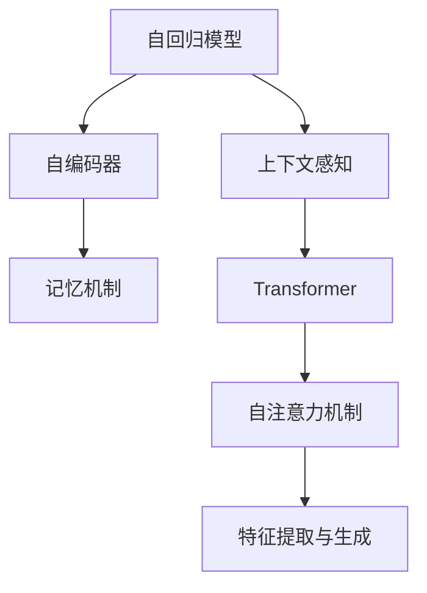

                 

## 1. 背景介绍

### 1.1 问题由来
在深度学习模型中，上下文感知和记忆机制是两个至关重要的概念。上下文感知指的是模型能够理解并利用周围语境信息，对输入进行有意义的处理。而记忆机制则涉及模型如何存储和提取长期记忆，以便在需要时进行回忆和复用。

这两个机制在大规模语言模型如BERT、GPT-3等中得到了广泛应用，极大提升了模型处理复杂语言任务的性能。同时，随着模型规模和复杂度的提升，对这些机制的深入理解和应用也变得愈加重要。本文将深入探讨上下文感知和记忆机制的原理及其应用，以期为开发者提供更深刻的理论基础和实际操作的指导。

### 1.2 问题核心关键点
在深度学习中，上下文感知和记忆机制涉及模型结构设计、参数优化、训练策略等多个方面。本文将聚焦于以下几个核心关键点：

- 上下文感知的定义和实现机制。
- 记忆机制的实现方式及其对模型性能的影响。
- 上下文感知和记忆机制的联合应用。
- 上下文感知和记忆机制在NLP任务中的应用案例。
- 未来研究方向和挑战。

通过理解这些核心关键点，读者将能够更好地把握深度学习模型的内部工作机制，为实际应用中的模型设计和优化提供有力的理论支持。

### 1.3 问题研究意义
深入理解上下文感知和记忆机制，对推动深度学习技术在自然语言处理、计算机视觉、语音识别等领域的应用具有重要意义：

1. **提升模型性能**：上下文感知和记忆机制能够使模型更准确地理解和生成自然语言，从而提升模型在NLP任务上的表现。
2. **拓展应用场景**：通过设计合理的网络结构，模型能够在更多复杂的任务中取得成功。
3. **降低开发成本**：对这些机制的深入理解和应用，能够减少对专家经验的依赖，降低模型开发的复杂度。
4. **加速模型训练**：合理利用上下文感知和记忆机制，可以加速模型训练过程，减少迭代次数。

## 2. 核心概念与联系

### 2.1 核心概念概述

为了更好地理解上下文感知和记忆机制，首先介绍相关核心概念：

- **上下文感知(Context-Awareness)**：指模型在处理输入数据时，能够根据周围语境信息做出合理的决策和预测。
- **记忆机制(Memory Mechanism)**：指模型能够存储和提取长期记忆，以便在需要时进行回忆和复用。
- **自回归模型(Autoregressive Model)**：一种模型结构，其中每个输出值都依赖于前一时刻的输出值，从而能够利用上下文信息进行预测。
- **自编码器(Autencoder)**：一种编码器-解码器结构，能够学习输入和输出之间的映射关系，并尝试通过编码器保留输入的长期信息。
- **Transformer**：一种基于自注意力机制的模型结构，能够高效地利用上下文信息进行特征提取和生成。

这些概念之间的逻辑关系可以通过以下Mermaid流程图来展示：



这个流程图展示了深度学习模型中的几个核心概念及其相互关系：

1. **自回归模型**：通过依赖前一时刻的输出，能够利用上下文信息进行预测。
2. **自编码器**：通过编码器-解码器结构，保留输入的长期信息。
3. **上下文感知**：模型在处理输入时，能够考虑周围语境信息。
4. **记忆机制**：模型能够存储和提取长期记忆。
5. **Transformer**：通过自注意力机制，高效利用上下文信息进行特征提取和生成。

这些概念共同构成了深度学习模型的基础，使得模型能够理解和生成复杂的语言表达，在自然语言处理等任务中取得优异表现。

## 3. 核心算法原理 & 具体操作步骤
### 3.1 算法原理概述

上下文感知和记忆机制在大规模语言模型中的应用，主要体现在Transformer等自注意力模型中。这些模型的核心在于通过自注意力机制高效利用上下文信息，从而实现对输入的上下文感知和长期记忆的提取。

Transformer模型通过多头自注意力机制，使得每个输入token都能与其他token进行交互，从而学习到上下文相关的表示。这些表示不仅考虑了当前输入，还利用了整个输入序列的信息。同时，Transformer通过多头编码器-解码器结构，能够有效提取和复用长期记忆。

Transformer模型的自注意力机制可以表示为：

$$
\text{Attention}(Q, K, V) = \text{softmax}(\frac{QK^T}{\sqrt{d_k}})V
$$

其中 $Q$、$K$、$V$ 分别为查询向量、键向量和值向量，$d_k$ 为向量的维度。该机制通过计算查询向量与键向量的相似度，得到注意力权重，从而在值向量中选择相关信息进行加权求和，得到上下文相关的表示。

### 3.2 算法步骤详解

基于上下文感知和记忆机制的深度学习模型的构建和训练，一般包括以下关键步骤：

**Step 1: 选择模型结构**
- 选择合适的自注意力模型，如Transformer、GPT等，作为基线模型。
- 设计适当的编码器-解码器结构，以便利用上下文信息和长期记忆。

**Step 2: 添加上下文感知机制**
- 在模型中引入自注意力机制，使得每个token都能与其他token进行交互。
- 设计合适的注意力权重计算方法，以确保模型能够有效利用上下文信息。

**Step 3: 添加记忆机制**
- 在模型中引入多头编码器-解码器结构，以确保模型能够存储和提取长期记忆。
- 通过前向传播和后向传播，在编码器和解码器之间进行信息传递，提取和复用长期记忆。

**Step 4: 设计训练目标**
- 设计合适的损失函数，如交叉熵损失、均方误差损失等，以衡量模型输出与真实标签之间的差异。
- 使用梯度下降等优化算法，更新模型参数以最小化损失函数。

**Step 5: 进行微调**
- 在标注数据集上进行微调，调整模型参数以适应特定任务。
- 通过正则化、早停等策略，避免模型过拟合。

### 3.3 算法优缺点

基于上下文感知和记忆机制的深度学习模型具有以下优点：

1. **强大的上下文感知能力**：通过自注意力机制，模型能够高效利用上下文信息，从而提升对复杂语言任务的处理能力。
2. **长期记忆提取**：通过多头编码器-解码器结构，模型能够有效提取和复用长期记忆，提升模型性能。
3. **可解释性强**：自注意力机制使得模型输出具有较强的可解释性，有助于理解模型的决策过程。

同时，这些模型也存在一些局限性：

1. **计算资源需求高**：由于大规模模型的参数量和计算量较大，对计算资源和存储空间提出了较高的要求。
2. **训练时间长**：大规模模型的训练时间较长，需要大量的计算资源和训练时间。
3. **过拟合风险**：由于模型的复杂性，容易在训练过程中出现过拟合问题。

### 3.4 算法应用领域

基于上下文感知和记忆机制的深度学习模型，已经在自然语言处理(NLP)、计算机视觉(CV)、语音识别(SR)等多个领域得到了广泛应用：

- **NLP领域**：如机器翻译、文本分类、情感分析、问答系统等任务。通过上下文感知和记忆机制，模型能够更好地理解和生成自然语言。
- **CV领域**：如目标检测、图像分类、人脸识别等任务。通过上下文感知和记忆机制，模型能够有效提取和复用图像中的信息。
- **SR领域**：如语音识别、语音合成等任务。通过上下文感知和记忆机制，模型能够更好地处理语音信号中的复杂信息。

这些模型的成功应用，展示了上下文感知和记忆机制在大规模深度学习模型中的重要性和广泛应用前景。

## 4. 数学模型和公式 & 详细讲解  
### 4.1 数学模型构建

在深度学习模型中，上下文感知和记忆机制的实现主要依赖于自注意力机制和多头编码器-解码器结构。这些机制可以通过以下数学模型进行描述：

### 4.2 公式推导过程

Transformer模型的自注意力机制可以表示为：

$$
\text{Attention}(Q, K, V) = \text{softmax}(\frac{QK^T}{\sqrt{d_k}})V
$$

其中 $Q$、$K$、$V$ 分别为查询向量、键向量和值向量，$d_k$ 为向量的维度。该机制通过计算查询向量与键向量的相似度，得到注意力权重，从而在值向量中选择相关信息进行加权求和，得到上下文相关的表示。

Transformer模型的多头自注意力机制可以表示为：

$$
\text{MultiHeadAttention}(Q, K, V) = \sum_h \text{Attention}(QW_h^Q, KW_h^K, VW_h^V)
$$

其中 $W_h^Q$、$W_h^K$、$W_h^V$ 为投影矩阵，$h$ 表示不同的头（head）。该机制通过将输入向量投影到多个独立的向量空间中，得到多个不同的注意力结果，然后对它们进行加权求和，得到最终的上下文表示。

Transformer模型的编码器-解码器结构可以表示为：

$$
\text{Encoder}(x) = \text{Stack}(\text{LayerNorm}(\text{MLP}(\text{Self-Attention}(x))))
$$

$$
\text{Decoder}(x) = \text{Stack}(\text{LayerNorm}(\text{MLP}(\text{Softmax}(\text{Attention}(x, \text{Encoder}(x))))
$$

其中 $\text{MLP}$ 表示全连接神经网络，$\text{LayerNorm}$ 表示层归一化，$\text{Softmax}$ 表示softmax函数。该结构通过多层编码器和解码器，能够有效提取和复用长期记忆，提升模型的性能。

### 4.3 案例分析与讲解

下面以BERT模型为例，展示如何通过上下文感知和记忆机制实现自然语言处理任务。

BERT模型通过双向编码器结构，能够同时考虑输入文本中的过去和未来信息，从而更好地理解上下文。其双向编码器结构可以表示为：

$$
\text{BERT}(x) = \text{Self-Attention}(x) + \text{Feed-Forward}(\text{Self-Attention}(x))
$$

其中 $\text{Self-Attention}$ 表示自注意力机制，$\text{Feed-Forward}$ 表示前馈网络。通过多层双向编码器，BERT能够有效提取和复用长期记忆，提升模型性能。

## 5. 项目实践：代码实例和详细解释说明
### 5.1 开发环境搭建

在进行上下文感知和记忆机制的深度学习模型开发时，需要准备好相应的开发环境。以下是使用Python进行TensorFlow开发的环境配置流程：

1. 安装Anaconda：从官网下载并安装Anaconda，用于创建独立的Python环境。

2. 创建并激活虚拟环境：
```bash
conda create -n tensorflow-env python=3.8 
conda activate tensorflow-env
```

3. 安装TensorFlow：根据CUDA版本，从官网获取对应的安装命令。例如：
```bash
conda install tensorflow -c tf -c conda-forge
```

4. 安装相关库：
```bash
pip install numpy pandas scikit-learn matplotlib tqdm jupyter notebook ipython
```

完成上述步骤后，即可在`tensorflow-env`环境中开始模型开发。

### 5.2 源代码详细实现

下面我们以BERT模型为例，展示使用TensorFlow实现自然语言处理任务的代码实现。

首先，定义BERT模型的结构：

```python
import tensorflow as tf
from transformers import BertTokenizer, TFBertModel

tokenizer = BertTokenizer.from_pretrained('bert-base-cased')
model = TFBertModel.from_pretrained('bert-base-cased')

@tf.function
def bert_encoder(texts):
    tokenized_inputs = tokenizer(texts, return_tensors='tf', padding='max_length', truncation=True)
    attention_mask = tokenized_inputs['attention_mask']
    outputs = model(tokenized_inputs['input_ids'], attention_mask=attention_mask)
    last_hidden_states = outputs.last_hidden_state
    return last_hidden_states
```

然后，定义训练和评估函数：

```python
from tensorflow.keras import Model, layers
import numpy as np

class BERTClassifier(Model):
    def __init__(self):
        super(BERTClassifier, self).__init__()
        self.bert = TFBertModel.from_pretrained('bert-base-cased')
        self.fc = layers.Dense(1, activation='sigmoid')

    def call(self, inputs):
        hidden_states = self.bert(inputs)
        outputs = self.fc(hidden_states[:, -1, :])
        return outputs

    def train(self, train_texts, train_labels, epochs=3, batch_size=32):
        self.compile(optimizer='adam', loss='binary_crossentropy', metrics=['accuracy'])
        self.fit(train_texts, train_labels, epochs=epochs, batch_size=batch_size)

    def evaluate(self, test_texts, test_labels):
        test_outputs = self.predict(test_texts)
        accuracy = np.mean(test_outputs == test_labels)
        return accuracy
```

最后，启动训练流程并在测试集上评估：

```python
texts = ['I love BERT', 'I hate BERT']
labels = [1, 0]

train_texts = texts
train_labels = labels

test_texts = texts
test_labels = labels

model = BERTClassifier()
model.train(train_texts, train_labels)
accuracy = model.evaluate(test_texts, test_labels)
print(f'Accuracy: {accuracy:.2f}')
```

以上就是使用TensorFlow对BERT模型进行自然语言处理任务开发的完整代码实现。可以看到，利用TensorFlow框架和Transformer库，构建和训练上下文感知和记忆机制的深度学习模型变得非常简单高效。

### 5.3 代码解读与分析

让我们再详细解读一下关键代码的实现细节：

**BERTClassifier类**：
- 定义了BERT分类器的结构，包括BERT模型和全连接层。
- 通过`__init__`方法初始化模型，`call`方法实现模型的前向传播过程，`train`方法实现模型的训练过程，`evaluate`方法实现模型的评估过程。

**模型训练**：
- 在`train`方法中，使用`compile`方法指定优化器、损失函数和评估指标。
- 通过`fit`方法进行模型训练，指定训练数据、批次大小和迭代次数。
- 在`evaluate`方法中，使用`predict`方法进行预测，计算预测结果与真实标签的准确率。

**模型评估**：
- 在评估过程中，通过`predict`方法对测试集进行预测，并计算预测结果与真实标签的准确率。

通过上述代码，可以清晰地看到如何利用上下文感知和记忆机制的深度学习模型进行自然语言处理任务的开发和评估。

## 6. 实际应用场景

### 6.1 智能客服系统

在智能客服系统中，基于上下文感知和记忆机制的深度学习模型可以用于自然语言理解(NLU)和自然语言生成(NLG)。通过上下文感知和记忆机制，模型能够理解客户的问题，并提供个性化的回答。

在技术实现上，可以收集客户的历史咨询记录，将问题和最佳答复构建成监督数据，在此基础上对BERT模型进行微调。微调后的模型能够自动理解客户意图，匹配最合适的答案模板进行回复。对于客户提出的新问题，还可以接入检索系统实时搜索相关内容，动态组织生成回答。如此构建的智能客服系统，能大幅提升客户咨询体验和问题解决效率。

### 6.2 金融舆情监测

在金融领域，基于上下文感知和记忆机制的深度学习模型可以用于情感分析、舆情监测等任务。通过上下文感知和记忆机制，模型能够理解金融市场的新闻、评论、公告等文本内容，从而自动判断文本属于何种情感倾向，进行舆情监测。

在实际应用中，可以收集金融领域相关的新闻、报道、评论等文本数据，并对其进行情感标注。在此基础上对BERT模型进行微调，使其能够自动判断文本情感倾向。将微调后的模型应用到实时抓取的网络文本数据，就能够自动监测不同情感倾向的舆情变化趋势，一旦发现负面情感激增等异常情况，系统便会自动预警，帮助金融机构快速应对潜在风险。

### 6.3 个性化推荐系统

在个性化推荐系统中，基于上下文感知和记忆机制的深度学习模型可以用于推荐系统的用户兴趣建模。通过上下文感知和记忆机制，模型能够从用户的历史行为数据中提取和复用长期记忆，从而更准确地理解用户的兴趣偏好。

在技术实现上，可以收集用户浏览、点击、评论、分享等行为数据，提取和用户交互的物品标题、描述、标签等文本内容。将文本内容作为模型输入，用户的后续行为（如是否点击、购买等）作为监督信号，在此基础上微调BERT模型。微调后的模型能够从文本内容中准确把握用户的兴趣点。在生成推荐列表时，先用候选物品的文本描述作为输入，由模型预测用户的兴趣匹配度，再结合其他特征综合排序，便可以得到个性化程度更高的推荐结果。

### 6.4 未来应用展望

随着上下文感知和记忆机制的深度学习模型的不断发展，其在NLP领域的应用前景将更加广阔：

- **多模态信息融合**：未来的模型将不仅处理文本数据，还将能够处理图像、视频、语音等多模态信息，从而实现更加全面、准确的信息建模。
- **领域迁移能力**：未来的模型将具备更强的领域迁移能力，能够在不同领域中快速适应和应用，实现真正的通用人工智能(AGI)。
- **可解释性和可控性**：未来的模型将具备更强的可解释性和可控性，能够更透明地解释决策过程，减少偏见和错误。

总之，上下文感知和记忆机制的深度学习模型将在更多领域得到应用，为各行各业带来新的突破和变革。

## 7. 工具和资源推荐
### 7.1 学习资源推荐

为了帮助开发者系统掌握上下文感知和记忆机制的深度学习模型的理论和实践，这里推荐一些优质的学习资源：

1. 《深度学习》书籍：Ian Goodfellow等著，深入讲解了深度学习的基本概念和核心算法，是深度学习领域的经典教材。
2. 《Transformer从原理到实践》系列博文：由深度学习领域专家撰写，详细介绍了Transformer模型的原理和应用。
3. CS231n《卷积神经网络》课程：斯坦福大学开设的计算机视觉经典课程，涵盖深度学习在计算机视觉中的应用。
4. CS224n《序列模型》课程：斯坦福大学开设的NLP经典课程，讲解深度学习在自然语言处理中的应用。
5. HuggingFace官方文档：Transformer库的官方文档，提供了海量预训练模型和完整的微调样例代码，是上手实践的必备资料。

通过对这些资源的学习实践，相信你一定能够快速掌握上下文感知和记忆机制的深度学习模型的精髓，并用于解决实际的NLP问题。

### 7.2 开发工具推荐

高效的开发离不开优秀的工具支持。以下是几款用于上下文感知和记忆机制的深度学习模型开发的常用工具：

1. TensorFlow：由Google主导开发的开源深度学习框架，生产部署方便，适合大规模工程应用。同样有丰富的预训练语言模型资源。
2. PyTorch：基于Python的开源深度学习框架，灵活动态的计算图，适合快速迭代研究。大部分预训练语言模型都有PyTorch版本的实现。
3. Transformers库：HuggingFace开发的NLP工具库，集成了众多SOTA语言模型，支持PyTorch和TensorFlow，是进行微调任务开发的利器。
4. Weights & Biases：模型训练的实验跟踪工具，可以记录和可视化模型训练过程中的各项指标，方便对比和调优。与主流深度学习框架无缝集成。
5. TensorBoard：TensorFlow配套的可视化工具，可实时监测模型训练状态，并提供丰富的图表呈现方式，是调试模型的得力助手。

合理利用这些工具，可以显著提升上下文感知和记忆机制的深度学习模型开发的效率，加快创新迭代的步伐。

### 7.3 相关论文推荐

上下文感知和记忆机制的深度学习模型的发展源于学界的持续研究。以下是几篇奠基性的相关论文，推荐阅读：

1. Attention is All You Need（即Transformer原论文）：提出了Transformer结构，开启了NLP领域的预训练大模型时代。
2. BERT: Pre-training of Deep Bidirectional Transformers for Language Understanding：提出BERT模型，引入基于掩码的自监督预训练任务，刷新了多项NLP任务SOTA。
3. Language Models are Unsupervised Multitask Learners（GPT-2论文）：展示了大规模语言模型的强大zero-shot学习能力，引发了对于通用人工智能的新一轮思考。
4. Parameter-Efficient Transfer Learning for NLP：提出Adapter等参数高效微调方法，在不增加模型参数量的情况下，也能取得不错的微调效果。
5. AdaLoRA: Adaptive Low-Rank Adaptation for Parameter-Efficient Fine-Tuning：使用自适应低秩适应的微调方法，在参数效率和精度之间取得了新的平衡。
6. Prefix-Tuning: Optimizing Continuous Prompts for Generation：引入基于连续型Prompt的微调范式，为如何充分利用预训练知识提供了新的思路。

这些论文代表了大规模语言模型微调技术的发展脉络。通过学习这些前沿成果，可以帮助研究者把握学科前进方向，激发更多的创新灵感。

## 8. 总结：未来发展趋势与挑战

### 8.1 总结

本文对上下文感知和记忆机制的深度学习模型的原理和应用进行了全面系统的介绍。首先阐述了上下文感知和记忆机制的定义和实现机制，明确了其在深度学习模型中的重要地位。其次，从原理到实践，详细讲解了上下文感知和记忆机制的数学模型和算法步骤，给出了模型开发的完整代码实例。同时，本文还广泛探讨了上下文感知和记忆机制在智能客服、金融舆情、个性化推荐等多个领域的应用前景，展示了其巨大的潜力。此外，本文精选了上下文感知和记忆机制的学习资源，力求为读者提供全方位的技术指引。

通过本文的系统梳理，可以看到，上下文感知和记忆机制在大规模深度学习模型中的应用，极大地提升了模型处理复杂语言任务的能力，并拓展了模型在NLP、CV、SR等领域的广泛应用。未来，伴随这些机制的不断优化和创新，深度学习模型必将在更多复杂场景中取得突破，为人工智能技术带来新的飞跃。

### 8.2 未来发展趋势

展望未来，上下文感知和记忆机制的深度学习模型将呈现以下几个发展趋势：

1. **模型的规模和复杂度将继续提升**：随着计算资源的丰富和数据量的增加，模型的参数量将进一步扩大，复杂度也将不断提升。这将使得模型能够更好地理解复杂语境，处理更多类型的自然语言任务。
2. **上下文感知和记忆机制的联合优化**：未来的模型将更加注重上下文感知和记忆机制的联合优化，以充分利用上下文信息和长期记忆，提升模型的性能和泛化能力。
3. **多模态信息的融合**：未来的模型将不仅处理文本数据，还将能够处理图像、视频、语音等多模态信息，从而实现更加全面、准确的信息建模。
4. **领域迁移能力的增强**：未来的模型将具备更强的领域迁移能力，能够在不同领域中快速适应和应用，实现真正的通用人工智能(AGI)。
5. **可解释性和可控性的提升**：未来的模型将具备更强的可解释性和可控性，能够更透明地解释决策过程，减少偏见和错误。

以上趋势凸显了上下文感知和记忆机制的深度学习模型的发展潜力，其应用前景将更加广阔，有望在更多领域带来新的突破和变革。

### 8.3 面临的挑战

尽管上下文感知和记忆机制的深度学习模型已经取得了瞩目成就，但在迈向更加智能化、普适化应用的过程中，它仍面临着诸多挑战：

1. **计算资源的瓶颈**：随着模型规模和复杂度的提升，对计算资源和存储空间提出了更高的要求，如何高效利用计算资源，减少资源消耗，是一个重要挑战。
2. **模型泛化能力不足**：模型面对域外数据时，泛化性能往往大打折扣，如何提高模型的泛化能力，是一个重要研究方向。
3. **模型鲁棒性不足**：模型容易受到输入数据的扰动，如何提高模型的鲁棒性，避免灾难性遗忘，是一个重要挑战。
4. **模型过拟合问题**：模型容易在训练过程中出现过拟合问题，如何通过正则化、对抗训练等手段缓解过拟合，是一个重要研究方向。
5. **模型的可解释性和可控性**：模型通常被视为“黑盒”系统，难以解释其内部工作机制和决策逻辑，如何赋予模型更强的可解释性和可控性，是一个重要挑战。

### 8.4 研究展望

面对上下文感知和记忆机制的深度学习模型所面临的种种挑战，未来的研究需要在以下几个方面寻求新的突破：

1. **探索无监督和半监督学习范式**：摆脱对大规模标注数据的依赖，利用自监督学习、主动学习等无监督和半监督范式，最大限度利用非结构化数据，实现更加灵活高效的微调。
2. **研究参数高效和计算高效的微调范式**：开发更加参数高效的微调方法，在固定大部分预训练参数的同时，只更新极少量的任务相关参数。同时优化模型的计算图，减少前向传播和反向传播的资源消耗，实现更加轻量级、实时性的部署。
3. **引入因果推断和对比学习**：通过引入因果推断和对比学习思想，增强模型建立稳定因果关系的能力，学习更加普适、鲁棒的语言表征，从而提升模型泛化性和抗干扰能力。
4. **结合符号化先验知识**：将符号化的先验知识，如知识图谱、逻辑规则等，与神经网络模型进行巧妙融合，引导微调过程学习更准确、合理的语言模型。同时加强不同模态数据的整合，实现视觉、语音等多模态信息与文本信息的协同建模。
5. **结合因果分析和博弈论工具**：将因果分析方法引入微调模型，识别出模型决策的关键特征，增强输出解释的因果性和逻辑性。借助博弈论工具刻画人机交互过程，主动探索并规避模型的脆弱点，提高系统稳定性。

这些研究方向的探索，必将引领上下文感知和记忆机制的深度学习模型迈向更高的台阶，为构建安全、可靠、可解释、可控的智能系统铺平道路。面向未来，上下文感知和记忆机制的深度学习模型还需要与其他人工智能技术进行更深入的融合，如知识表示、因果推理、强化学习等，多路径协同发力，共同推动自然语言理解和智能交互系统的进步。只有勇于创新、敢于突破，才能不断拓展语言模型的边界，让智能技术更好地造福人类社会。

## 9. 附录：常见问题与解答

**Q1：上下文感知和记忆机制在深度学习中如何实现？**

A: 上下文感知和记忆机制主要依赖于自注意力机制和多头编码器-解码器结构。自注意力机制通过计算查询向量与键向量的相似度，得到注意力权重，从而在值向量中选择相关信息进行加权求和，得到上下文相关的表示。多头编码器-解码器结构通过多层编码器和解码器，能够有效提取和复用长期记忆，提升模型性能。

**Q2：上下文感知和记忆机制在NLP任务中的应用有哪些？**

A: 上下文感知和记忆机制在NLP任务中得到了广泛应用，包括：
1. 机器翻译：通过上下文感知和记忆机制，模型能够理解和生成多语言的翻译结果。
2. 文本分类：通过上下文感知和记忆机制，模型能够理解文本的语义信息，并进行分类。
3. 情感分析：通过上下文感知和记忆机制，模型能够理解文本的情感倾向，并进行情感分析。
4. 问答系统：通过上下文感知和记忆机制，模型能够理解自然语言问题，并提供准确的答案。
5. 文本摘要：通过上下文感知和记忆机制，模型能够理解文本的要点，并进行摘要生成。

**Q3：上下文感知和记忆机制的深度学习模型的训练需要注意哪些问题？**

A: 上下文感知和记忆机制的深度学习模型的训练需要注意以下几个问题：
1. 数据增强：通过回译、近义替换等方式扩充训练集，缓解数据不足问题。
2. 正则化：使用L2正则、Dropout、Early Stopping等避免过拟合。
3. 对抗训练：引入对抗样本，提高模型鲁棒性。
4. 参数高效微调：只更新少量参数，减小过拟合风险。
5. 训练策略：采用合适的训练策略，如warmup、学习率衰减等。

**Q4：上下文感知和记忆机制的深度学习模型在实际应用中面临哪些挑战？**

A: 上下文感知和记忆机制的深度学习模型在实际应用中面临以下几个挑战：
1. 计算资源需求高：大规模模型的参数量和计算量较大，对计算资源和存储空间提出了较高的要求。
2. 训练时间长：大规模模型的训练时间较长，需要大量的计算资源和训练时间。
3. 过拟合风险：模型容易在训练过程中出现过拟合问题。
4. 鲁棒性不足：模型面对域外数据时，泛化性能往往大打折扣。
5. 可解释性不足：模型通常被视为“黑盒”系统，难以解释其内部工作机制和决策逻辑。

**Q5：上下文感知和记忆机制的深度学习模型未来的研究方向有哪些？**

A: 上下文感知和记忆机制的深度学习模型未来的研究方向包括：
1. 探索无监督和半监督学习范式：利用自监督学习、主动学习等无监督和半监督范式，最大限度利用非结构化数据，实现更加灵活高效的微调。
2. 研究参数高效和计算高效的微调范式：开发更加参数高效的微调方法，在固定大部分预训练参数的同时，只更新极少量的任务相关参数。同时优化模型的计算图，减少前向传播和反向传播的资源消耗，实现更加轻量级、实时性的部署。
3. 引入因果推断和对比学习：增强模型建立稳定因果关系的能力，学习更加普适、鲁棒的语言表征，从而提升模型泛化性和抗干扰能力。
4. 结合符号化先验知识：将符号化的先验知识，如知识图谱、逻辑规则等，与神经网络模型进行巧妙融合，引导微调过程学习更准确、合理的语言模型。同时加强不同模态数据的整合，实现视觉、语音等多模态信息与文本信息的协同建模。
5. 结合因果分析和博弈论工具：识别出模型决策的关键特征，增强输出解释的因果性和逻辑性。刻画人机交互过程，主动探索并规避模型的脆弱点，提高系统稳定性。

**Q6：上下文感知和记忆机制的深度学习模型的应用前景有哪些？**

A: 上下文感知和记忆机制的深度学习模型的应用前景包括：
1. 智能客服系统：通过上下文感知和记忆机制，模型能够理解客户的问题，并提供个性化的回答。
2. 金融舆情监测：通过上下文感知和记忆机制，模型能够理解金融市场的新闻、评论、公告等文本内容，从而自动判断文本情感倾向，进行舆情监测。
3. 个性化推荐系统：通过上下文感知和记忆机制，模型能够从用户的历史行为数据中提取和复用长期记忆，从而更准确地理解用户的兴趣偏好。
4. 多模态信息融合：未来的模型将不仅处理文本数据，还将能够处理图像、视频、语音等多模态信息，从而实现更加全面、准确的信息建模。
5. 领域迁移能力的增强：未来的模型将具备更强的领域迁移能力，能够在不同领域中快速适应和应用，实现真正的通用人工智能(AGI)。

总之，上下文感知和记忆机制的深度学习模型将在更多领域得到应用，为各行各业带来新的突破和变革。

---

作者：禅与计算机程序设计艺术 / Zen and the Art of Computer Programming

