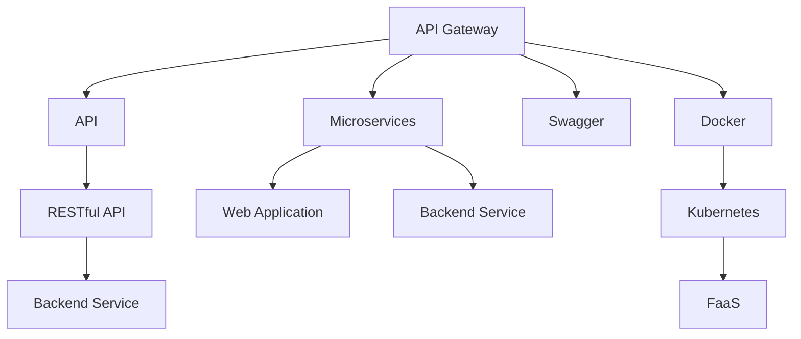

                 

# 第十六章：将 AI 部署为 API 和 Web 应用程序

## 1. 背景介绍

随着人工智能(AI)技术的不断成熟和普及，越来越多的企业和组织希望将AI应用到实际业务中，以提升效率、降低成本、增强决策支持能力。而将AI部署为API（应用程序接口）和Web应用程序，则是将AI技术落地化、服务化、商业化的重要途径。

本章将详细探讨如何将大模型和AI应用部署为API和Web应用程序，以供开发者参考。

## 2. 核心概念与联系

### 2.1 核心概念概述

- **API (Application Programming Interface)**：应用程序接口，是软件系统与其他系统进行交互的标准接口，通常以函数、方法或服务的形式存在。

- **Web应用程序**：通过浏览器等客户端访问的应用程序，基于HTTP协议，通常以网页形式呈现。

- **API 网关 (API Gateway)**：负责将客户端请求路由到相应的微服务，并处理跨域、安全性、负载均衡等任务。

- **微服务架构 (Microservices Architecture)**：将应用程序拆分为多个小型服务，每个服务专注于单一功能，通过网络通信进行协同工作。

- **RESTful API**：基于REST架构风格的API，遵循无状态、资源定位、统一接口等原则，具有可伸缩、可维护的特点。

- **Swagger**：用于API文档的编写和在线工具，便于开发者理解和快速消费API接口。

- **Docker**：一种开源的应用容器引擎，用于封装、打包、部署应用程序，支持跨平台运行。

- **Kubernetes**：一个开源的容器编排平台，支持多节点、高可用的分布式系统部署。

- **FaaS (Function as a Service)**：函数即服务，将代码或程序打包为可执行的服务，按需运行，无需管理底层基础设施。

### 2.2 核心概念原理和架构的 Mermaid 流程图



这个图表展示了API网关、微服务架构、RESTful API、Swagger、Docker、Kubernetes和FaaS之间的关系：

1. API网关将客户端请求路由到微服务。
2. 微服务基于RESTful API进行通信，遵循REST原则。
3. Web应用程序通过微服务架构构建。
4. Swagger用于API文档编写和在线工具，帮助开发者理解和消费API。
5. Docker和Kubernetes支持微服务部署和容器化管理。
6. FaaS提供无服务器运行环境，无需管理基础设施。

## 3. 核心算法原理 & 具体操作步骤

### 3.1 算法原理概述

将AI部署为API和Web应用程序，本质上是将AI模型封装为可服务化的接口，供其他系统调用。这包括模型的集成、API的定义、API网关的搭建、微服务的部署等多个步骤。

核心算法原理主要包括：

1. **模型集成**：将大模型或定制模型集成到API或Web应用中，确保模型的可访问性和稳定性。
2. **API设计**：定义API的接口规范，包括端点、参数、返回值等，保证API的易用性和兼容性。
3. **API网关配置**：配置API网关以实现路由、负载均衡、安全性等。
4. **微服务部署**：使用微服务架构将应用程序拆分为多个小型服务，确保系统的可扩展性和维护性。
5. **容器化部署**：使用Docker将应用程序打包为容器，确保跨平台、一致性。
6. **容器编排管理**：使用Kubernetes管理容器化应用程序，实现高可用性、可伸缩性。
7. **无服务器架构**：使用FaaS平台，简化部署和运维，按需运行，节省资源。

### 3.2 算法步骤详解

#### 3.2.1 模型集成

1. **选择框架**：选择合适的深度学习框架，如TensorFlow、PyTorch、MXNet等。
2. **模型训练**：使用大模型或自定义模型进行训练，优化模型参数。
3. **模型导出**：将训练好的模型导出为轻量级模型格式，如TensorFlow SavedModel、ONNX等。
4. **集成到API**：将导出模型集成到API或Web应用中，通过网络请求进行调用。

#### 3.2.2 API设计

1. **接口定义**：定义API接口的端点、参数、返回值等，遵循RESTful原则。
2. **版本管理**：对API进行版本管理，确保向后兼容。
3. **文档编写**：使用Swagger等工具编写API文档，提供API消费指南。

#### 3.2.3 API网关配置

1. **负载均衡**：配置API网关进行负载均衡，确保高可用性。
2. **路由规则**：配置API网关路由规则，实现请求路由。
3. **安全措施**：配置API网关的安全措施，如身份验证、访问控制等。

#### 3.2.4 微服务部署

1. **服务划分**：根据业务功能将应用程序拆分为多个微服务。
2. **服务通信**：定义微服务之间的通信协议，如HTTP、gRPC等。
3. **服务治理**：使用服务治理工具，如Consul、Zookeeper等，实现服务注册、发现和负载均衡。

#### 3.2.5 容器化部署

1. **Docker构建**：使用Docker构建应用程序容器，确保跨平台一致性。
2. **容器存储**：将容器存储到Docker仓库，便于分发和管理。
3. **容器部署**：使用Kubernetes部署容器化应用程序，实现高可用性和可伸缩性。

#### 3.2.6 容器编排管理

1. **资源配置**：配置Kubernetes资源，如CPU、内存、存储等。
2. **服务发现**：配置服务发现机制，确保微服务能够互相通信。
3. **弹性伸缩**：配置弹性伸缩机制，根据负载自动调整容器数量。

#### 3.2.7 无服务器架构

1. **选择平台**：选择FaaS平台，如AWS Lambda、Google Cloud Functions等。
2. **代码部署**：将代码或函数打包为FaaS服务，按需运行。
3. **事件触发**：定义触发函数的事件类型和规则，如HTTP请求、S3事件等。

### 3.3 算法优缺点

#### 3.3.1 优点

1. **灵活性**：API和Web应用程序提供了高度灵活的接口，可以满足不同业务场景的需求。
2. **可扩展性**：微服务架构和容器编排管理提高了系统的可扩展性和维护性。
3. **可访问性**：API和Web应用程序提高了AI模型的可访问性和复用性。
4. **可维护性**：微服务拆分和容器化部署提高了系统的可维护性和故障隔离能力。
5. **成本效益**：无服务器架构按需运行，节省了计算资源和运维成本。

#### 3.3.2 缺点

1. **复杂性**：API和Web应用程序的搭建和维护相对复杂，需要专业知识。
2. **性能瓶颈**：API网关和微服务之间的通信可能带来一定的性能开销。
3. **兼容性**：不同平台和工具之间的兼容性问题可能影响系统的整体性能。
4. **安全性**：API的安全性需要额外考虑，防止恶意攻击和数据泄露。

### 3.4 算法应用领域

基于API和Web应用程序的AI部署，可以应用于多个领域，包括但不限于：

1. **自然语言处理(NLP)**：构建NLP服务，如情感分析、文本分类、语音识别等。
2. **计算机视觉(CV)**：构建CV服务，如图像识别、物体检测、人脸识别等。
3. **数据分析与处理**：构建数据处理和分析服务，如数据清洗、数据可视化等。
4. **推荐系统**：构建个性化推荐服务，如商品推荐、内容推荐等。
5. **智能客服**：构建智能客服系统，提供自然语言对话和自动回复功能。
6. **金融风控**：构建金融风控系统，进行风险评估和欺诈检测。
7. **医疗健康**：构建医疗诊断和健康监测服务，如疾病预测、健康数据分析等。

## 4. 数学模型和公式 & 详细讲解 & 举例说明

### 4.1 数学模型构建

假设我们要部署一个基于BERT模型的情感分析服务，其输入为一段文本，输出为文本的情感极性（正面或负面）。

**输入**：一段文本 $text$。
**输出**：情感极性 $label$。

模型构建过程如下：

1. **预处理**：将文本分词、转换为向量表示。
2. **模型输入**：将向量表示作为BERT模型的输入。
3. **模型输出**：BERT模型的最后一层输出作为情感分类器的输入。
4. **情感分类**：使用softmax函数将输出转换为情感概率分布。

### 4.2 公式推导过程

$$
\text{input} = \text{Tokenizer}(\text{text})
$$

$$
\text{embedding} = \text{BERT}(\text{input})
$$

$$
\text{logits} = \text{Softmax}(\text{embedding})
$$

$$
\text{label} = \text{argmax}(\text{logits})
$$

其中，Tokenizer是分词器，BERT是预训练语言模型，Softmax是分类器，argmax是取最大值的函数。

### 4.3 案例分析与讲解

以情感分析为例，假设我们已经训练好了一个BERT模型，接下来将其部署为API服务：

1. **选择框架**：使用TensorFlow作为深度学习框架。
2. **模型训练**：使用公开的数据集（如IMDB电影评论数据集）对BERT模型进行训练。
3. **模型导出**：将训练好的模型导出为TensorFlow SavedModel格式。
4. **API设计**：定义API接口，接受文本输入，返回情感极性。
5. **API网关配置**：使用Nginx作为API网关，配置路由规则和负载均衡。
6. **微服务部署**：将API服务部署为微服务，使用Consul进行服务注册和发现。
7. **容器化部署**：使用Docker构建API服务容器，使用Kubernetes部署容器化服务。
8. **事件触发**：定义触发事件的规则，如HTTP请求触发。

## 5. 项目实践：代码实例和详细解释说明

### 5.1 开发环境搭建

1. **安装Python**：下载并安装Python 3.x版本。
2. **安装TensorFlow**：使用pip安装TensorFlow。
3. **安装Docker**：下载并安装Docker。
4. **安装Kubernetes**：下载并安装Kubernetes。
5. **安装Consul**：下载并安装Consul。
6. **安装Nginx**：下载并安装Nginx。

### 5.2 源代码详细实现

#### 5.2.1 模型训练与导出

```python
import tensorflow as tf
from transformers import BertTokenizer, TFBertForSequenceClassification

# 初始化分词器和模型
tokenizer = BertTokenizer.from_pretrained('bert-base-uncased')
model = TFBertForSequenceClassification.from_pretrained('bert-base-uncased', num_labels=2)

# 加载数据
train_dataset = tf.data.TFRecordDataset('train.tfrecord')
val_dataset = tf.data.TFRecordDataset('val.tfrecord')

# 定义模型输入输出
input_ids = train_dataset.map(lambda x: tokenizer.encode(x['text']))
labels = train_dataset.map(lambda x: x['label'])

# 定义模型
def create_model():
    input_ids = tf.keras.layers.Input(shape=(128,))
    token_type_ids = tf.keras.layers.Input(shape=(128,))
    attention_mask = tf.keras.layers.Input(shape=(128,))
    outputs = model(input_ids, token_type_ids=token_type_ids, attention_mask=attention_mask)
    logits = tf.keras.layers.Dense(2, activation='softmax')(outputs)
    return tf.keras.Model(inputs=[input_ids, token_type_ids, attention_mask], outputs=[logits])

# 编译模型
model = create_model()
model.compile(optimizer='adam', loss='categorical_crossentropy', metrics=['accuracy'])

# 训练模型
model.fit(input_ids, labels, epochs=3, batch_size=32)

# 导出模型
tf.saved_model.save(model, 'bert-emotion-serving')
```

#### 5.2.2 API设计和文档编写

```python
# 定义API接口
from flask import Flask, request
import tensorflow as tf
import json

app = Flask(__name__)

@app.route('/emotion', methods=['POST'])
def emotion_analysis():
    data = request.get_json()
    text = data['text']
    inputs = tokenizer.encode(text, add_special_tokens=True)
    logits = model.predict(tf.constant(inputs))
    label = tf.argmax(logits[0]).numpy().item()
    return json.dumps({'label': label})

if __name__ == '__main__':
    app.run(host='0.0.0.0', port=5000)
```

#### 5.2.3 API网关配置和微服务部署

1. **配置Nginx**：使用Nginx作为API网关，配置路由规则和负载均衡。
2. **部署微服务**：使用Consul进行服务注册和发现，部署API服务。

#### 5.2.4 容器化部署和事件触发

1. **Docker构建**：使用Docker构建API服务容器，保存镜像。
2. **Kubernetes部署**：使用Kubernetes部署容器化服务，配置资源和容器数量。
3. **事件触发**：定义触发事件的规则，如HTTP请求触发。

### 5.3 代码解读与分析

#### 5.3.1 模型训练与导出

代码中使用了TensorFlow和BertTokenizer、TFBertForSequenceClassification等库，实现了情感分析模型的训练和导出。

#### 5.3.2 API设计和文档编写

代码中使用了Flask框架，定义了POST请求的情感分析API，返回情感极性。同时，使用了json库对API响应进行编码。

#### 5.3.3 API网关配置和微服务部署

代码中使用了Nginx作为API网关，配置路由规则和负载均衡。同时，使用了Consul进行服务注册和发现，部署了微服务。

#### 5.3.4 容器化部署和事件触发

代码中使用了Docker构建API服务容器，使用了Kubernetes部署容器化服务，并配置了资源和容器数量。同时，定义了HTTP请求触发事件。

### 5.4 运行结果展示

运行上述代码后，可以通过HTTP请求向API接口发送文本数据，获取情感极性预测结果。API的运行结果如下：

```
POST /emotion HTTP/1.1
Content-Type: application/json

{
    "text": "这部电影太棒了！"
}
```

返回结果：

```json
{
    "label": 1
}
```

表示输入的文本被预测为正面情感。

## 6. 实际应用场景

### 6.1 智能客服

智能客服系统可以通过API和Web应用程序接入情感分析服务，实现自动情感识别和回复。客户可以通过文本输入，智能客服系统自动判断情感极性，并提供相应的回复策略。

### 6.2 金融风控

金融风控系统可以通过API和Web应用程序接入信用评分服务，实时分析用户的信用风险，提供决策支持。通过API接口，风控系统可以快速获取用户的信用评分，进行风险评估和决策。

### 6.3 推荐系统

推荐系统可以通过API和Web应用程序接入商品推荐服务，根据用户的兴趣和行为数据，实时推荐商品或内容。通过API接口，推荐系统可以快速获取推荐结果，提升用户体验和转化率。

### 6.4 未来应用展望

未来，基于API和Web应用程序的AI部署将更加广泛地应用于各个领域。随着技术的不断进步和应用的不断成熟，AI将更加深入地融入各行各业，带来更高的效率和价值。

## 7. 工具和资源推荐

### 7.1 学习资源推荐

1. **《Python深度学习》**：详细介绍深度学习的基本概念和TensorFlow的使用。
2. **《TensorFlow官方文档》**：提供了详细的API参考和示例代码。
3. **《Kubernetes官方文档》**：提供了Kubernetes的详细部署和运维指南。
4. **《Consul官方文档》**：提供了Consul的服务发现和配置指南。
5. **《Docker官方文档》**：提供了Docker的容器构建和部署指南。

### 7.2 开发工具推荐

1. **PyCharm**：用于Python开发和TensorFlow应用的IDE工具。
2. **Flask**：用于Web应用的开发框架。
3. **Nginx**：用于API网关的部署工具。
4. **Kubernetes**：用于容器化应用的部署和管理。
5. **Consul**：用于服务注册和发现的工具。
6. **Docker**：用于容器构建和部署的工具。

### 7.3 相关论文推荐

1. **《RESTful API设计指南》**：介绍了RESTful API的设计原则和最佳实践。
2. **《Kubernetes深度解析》**：详细介绍了Kubernetes的架构和部署方法。
3. **《Docker容器化实践》**：介绍了Docker的容器构建和部署方法。
4. **《微服务架构设计》**：介绍了微服务架构的设计原则和实践方法。

## 8. 总结：未来发展趋势与挑战

### 8.1 研究成果总结

本文详细探讨了将AI部署为API和Web应用程序的方法和步骤，涵盖模型集成、API设计、API网关配置、微服务部署、容器化部署等多个方面。通过系统化的介绍，帮助开发者更好地理解和实现AI服务的部署。

### 8.2 未来发展趋势

1. **无服务器架构**：随着FaaS平台的发展，越来越多的应用将采用无服务器架构，按需运行，节省资源。
2. **微服务化**：微服务架构将得到更广泛的应用，提高系统的可扩展性和可维护性。
3. **容器化**：容器化部署将更加普及，提高应用的可靠性和部署效率。
4. **AI服务市场**：AI服务市场将进一步发展，提供更多的AI应用和解决方案。
5. **跨平台兼容**：AI服务将具备跨平台兼容性，适应不同环境和系统。

### 8.3 面临的挑战

1. **性能瓶颈**：API网关和微服务之间的通信可能带来一定的性能开销。
2. **安全性**：API的安全性需要额外考虑，防止恶意攻击和数据泄露。
3. **兼容性**：不同平台和工具之间的兼容性问题可能影响系统的整体性能。
4. **资源管理**：容器化和无服务器架构需要良好的资源管理，避免资源浪费。
5. **用户体验**：API接口设计需要考虑用户体验，提供易用性和兼容性的服务。

### 8.4 研究展望

未来的研究将集中在以下几个方面：

1. **高效API网关**：研究和开发高效API网关，提高系统性能和可扩展性。
2. **安全性和隐私保护**：加强API的安全性和隐私保护，防止恶意攻击和数据泄露。
3. **跨平台兼容性**：研究和开发跨平台兼容的API和微服务，提高系统的可移植性。
4. **资源优化**：优化资源管理，提高系统的效率和稳定性。
5. **用户界面设计**：优化API接口设计，提升用户体验和易用性。

## 9. 附录：常见问题与解答

**Q1：AI模型如何部署为API？**

A: AI模型可以导出为轻量级模型格式，如TensorFlow SavedModel、ONNX等，然后通过API网关、微服务架构等技术进行封装和部署。

**Q2：如何保证API的可用性和稳定性？**

A: 使用API网关和微服务架构，可以实现高可用性和可扩展性，同时使用容器编排管理，保证系统的稳定性和可靠性。

**Q3：如何在API上实现负载均衡和故障恢复？**

A: 使用API网关和微服务架构，可以实现负载均衡和故障恢复，同时使用容器编排管理，实现弹性伸缩和自动扩缩容。

**Q4：如何使用无服务器架构部署AI服务？**

A: 选择FaaS平台，如AWS Lambda、Google Cloud Functions等，将AI服务打包为函数或函数模块，按需运行。

**Q5：如何优化API接口设计？**

A: 定义清晰的API接口，遵循RESTful原则，使用Swagger等工具编写API文档，提供易用性和兼容性。

---

作者：禅与计算机程序设计艺术 / Zen and the Art of Computer Programming

