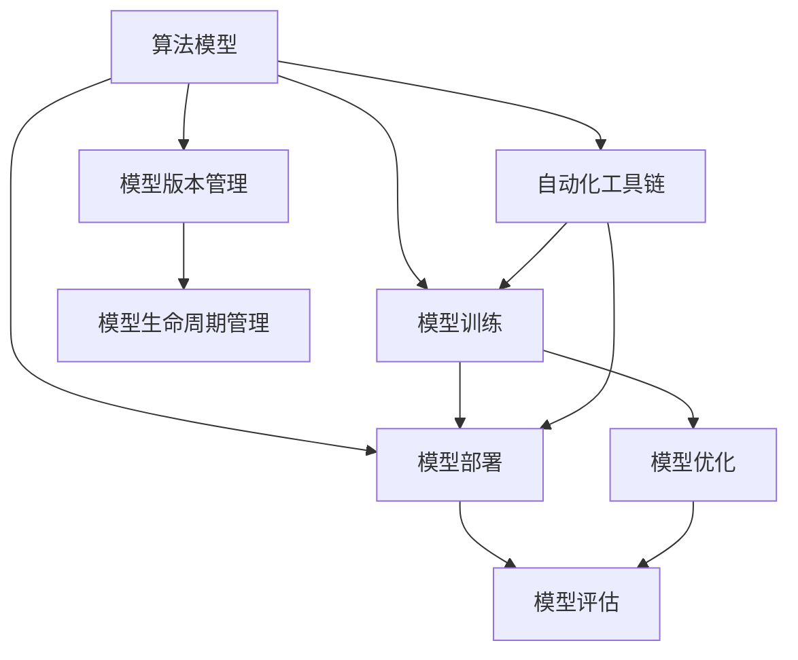

                 

# 算法工厂：打造 AI 2.0 的核心竞争力

## 1. 背景介绍

### 1.1 问题由来
随着人工智能(AI)技术的迅猛发展，算法工厂的概念应运而生。算法工厂是指通过规模化、工业化的方式，高效生产算法模型，以满足各种实际需求。在AI 2.0时代，算法工厂的建设显得尤为重要，其能够以低成本、高效率的方式，快速迭代和部署AI算法，提升企业的技术竞争力和市场响应速度。

AI 2.0是指AI技术的智能化和规模化发展阶段，强调的是算法的优化和应用的普及。在这一背景下，如何构建高效、灵活、可复用的算法工厂，成为各大科技公司及企业级团队关注的焦点。

### 1.2 问题核心关键点
构建算法工厂的核心在于以下几个方面：

- **算法模型**：选择合适的高性能算法模型，如深度学习、强化学习、自然语言处理等。
- **数据管理**：构建高效的数据收集、存储、清洗和处理体系，确保数据质量。
- **自动化工具**：开发和集成自动化工具，如数据管道、模型训练、模型部署等。
- **资源优化**：优化计算资源配置，提高模型训练和推理效率。
- **模型评估**：建立科学的模型评估标准和流程，确保模型性能的稳定性和可靠性。
- **版本控制**：实现模型的版本管理和生命周期管理，便于后续的迭代和维护。

## 2. 核心概念与联系

### 2.1 核心概念概述

为了更好地理解算法工厂的构建原理，本节将介绍几个关键概念：

- **算法模型**：基于数据科学和统计学原理构建的计算模型，如深度神经网络、决策树、随机森林等。
- **模型训练**：通过大量数据对模型进行训练，使其能够学习到数据的内在规律，并进行预测或分类。
- **模型部署**：将训练好的模型部署到生产环境，进行实时推理和应用。
- **模型优化**：通过对模型结构和参数进行调整，提升模型的性能和泛化能力。
- **自动化工具链**：包括数据预处理、模型训练、模型评估、模型部署等一系列自动化的流程和工具。
- **模型版本管理**：对模型进行版本控制，保证模型的可追溯性和一致性。

这些概念之间的逻辑关系可以通过以下Mermaid流程图来展示：



### 2.2 核心概念原理和架构

#### 2.2.1 算法模型原理

算法模型是通过对大量数据的学习，自动提取数据中的特征和规律，实现对新数据的预测或分类。以深度学习模型为例，其核心思想是通过多层神经网络对输入数据进行特征提取和层次组合，最终输出预测结果。

深度学习模型的结构包括输入层、隐藏层和输出层。隐藏层可以有多层，每一层的神经元数量可以自由调整，通过反向传播算法不断调整权重和偏置，最小化损失函数，使得模型能够更好地拟合训练数据。


#### 2.2.2 模型训练原理

模型训练是通过大量有标签数据对模型进行训练，最小化损失函数，使模型能够准确预测新数据的过程。模型训练通常分为以下几个步骤：

1. **数据准备**：收集和预处理数据，生成训练集、验证集和测试集。
2. **模型初始化**：选择合适的网络结构，并随机初始化权重和偏置。
3. **前向传播**：将输入数据输入模型，通过各层神经网络计算得到输出。
4. **损失计算**：计算模型输出与真实标签之间的损失函数。
5. **反向传播**：通过链式法则，计算损失函数对各层参数的梯度，并更新参数。
6. **迭代更新**：重复上述过程，直到模型在验证集上的性能达到预设标准。


#### 2.2.3 模型部署原理

模型部署是将训练好的模型应用到生产环境中的过程，通常包括以下步骤：

1. **模型导出**：将训练好的模型导出为可部署的格式，如TensorFlow SavedModel、PyTorch模型文件等。
2. **资源准备**：准备部署所需的计算资源，如GPU、内存等。
3. **模型加载**：在目标环境中加载模型，并进行预处理。
4. **推理计算**：对新的输入数据进行推理计算，输出预测结果。
5. **结果反馈**：将推理结果反馈给业务系统，进行后续处理。


## 3. 核心算法原理 & 具体操作步骤

### 3.1 算法原理概述

算法工厂的构建过程中，需要运用多种算法和工具，实现算法的快速迭代和高效应用。以下是对主要算法原理的概述：

#### 3.1.1 深度学习算法

深度学习算法通过多层神经网络，对输入数据进行特征提取和层次组合，实现对新数据的预测或分类。其主要特点包括：

- **自动特征提取**：通过学习数据的内在规律，自动提取特征，无需手动设计特征工程。
- **强大的非线性映射能力**：多层神经网络可以学习到复杂的多层次特征表示。
- **需要大量数据**：深度学习模型通常需要大量标注数据进行训练，以避免过拟合。

#### 3.1.2 强化学习算法

强化学习算法通过智能体与环境的交互，学习如何最大化累计奖励。其主要特点包括：

- **学习探索和利用**：智能体需要在探索未知空间和利用已有知识之间进行平衡。
- **奖励函数设计**：奖励函数的设计对算法性能有重要影响。
- **策略优化**：通过策略优化算法，如Q-learning、SARSA等，优化智能体的行为策略。

#### 3.1.3 自然语言处理(NLP)算法

NLP算法通过机器学习技术，对文本数据进行分析和处理。其主要特点包括：

- **语言理解能力**：能够理解自然语言文本的语义和结构。
- **词向量表示**：通过Word2Vec、GloVe等技术，将单词映射为向量表示。
- **文本生成和分类**：能够生成和分类文本数据，如文本摘要、情感分析等。

### 3.2 算法步骤详解

#### 3.2.1 模型选择

选择合适的算法模型是构建算法工厂的第一步。根据应用场景和数据特点，选择合适的算法模型，如深度学习模型、强化学习模型、NLP模型等。

#### 3.2.2 数据准备

数据准备包括数据收集、清洗和预处理。对于深度学习模型，通常需要大量标注数据进行训练，以保证模型性能。对于强化学习模型，则需要将环境模型化，设计合适的奖励函数。

#### 3.2.3 模型训练

模型训练通过大量数据对模型进行训练，最小化损失函数，使模型能够准确预测新数据。模型训练过程中，需要注意避免过拟合，选择合适的正则化技术，如L2正则、Dropout等。

#### 3.2.4 模型优化

模型优化通过调整模型结构和参数，提升模型的性能和泛化能力。常见的优化方法包括权重衰减、批量归一化、学习率调整等。

#### 3.2.5 模型评估

模型评估通过验证集对模型进行评估，确保模型在未见过的数据上仍能保持较好的性能。常用的评估指标包括准确率、召回率、F1值等。

#### 3.2.6 模型部署

模型部署是将训练好的模型应用到生产环境中的过程。通常需要将模型导出为可部署的格式，并在目标环境中加载模型，进行推理计算。

#### 3.2.7 版本管理

模型版本管理通过对模型进行版本控制，保证模型的可追溯性和一致性。版本管理通常使用Git等工具进行实现。

## 4. 数学模型和公式 & 详细讲解 & 举例说明

### 4.1 数学模型构建

为了更好地理解算法工厂的构建原理，本节将使用数学语言对主要算法模型进行详细讲解。

#### 4.1.1 深度学习模型

深度学习模型通常由多个层次的神经网络组成，其结构如图：


假设深度学习模型由L层组成，每一层的神经元数量分别为 $n_1, n_2, \ldots, n_L$。输入数据 $x \in \mathbb{R}^{n_1}$，输出数据 $y \in \mathbb{R}^{n_L}$。模型参数包括权重 $w_1, w_2, \ldots, w_L$ 和偏置 $b_1, b_2, \ldots, b_L$。

模型的前向传播过程为：

$$
h_1 = \sigma(W_1x + b_1)
$$

$$
h_2 = \sigma(W_2h_1 + b_2)
$$

$$
\vdots
$$

$$
h_L = \sigma(W_Lh_{L-1} + b_L)
$$

其中，$\sigma$ 为激活函数，通常使用ReLU、Sigmoid、Tanh等。

模型的损失函数为：

$$
L = \frac{1}{N}\sum_{i=1}^N \|h_L - y_i\|^2
$$

其中，$N$ 为样本数量，$\|h_L - y_i\|$ 为预测值与真实值之间的差距。

#### 4.1.2 强化学习模型

强化学习模型通常由智能体和环境组成，其结构如图：


假设智能体在每个时间步 $t$ 的决策为 $a_t$，环境的状态为 $s_t$，奖励为 $r_t$。模型参数包括策略网络 $\pi$ 和值网络 $V$。

策略网络 $\pi$ 将状态 $s_t$ 映射到决策 $a_t$，其输出概率为：

$$
\pi(a_t|s_t) = \frac{\exp(\theta^Ta_t)}{\sum_{a \in A}\exp(\theta^Ta)}
$$

其中，$\theta$ 为策略网络的参数，$A$ 为决策空间。

值网络 $V$ 将状态 $s_t$ 映射到奖励值 $r_t$，其输出值为：

$$
V(s_t) = \theta^Tf(s_t)
$$

其中，$f(s_t)$ 为状态表示函数，通常使用嵌入向量。

强化学习的目标是通过最大化累计奖励 $R$，优化策略网络 $\pi$ 和值网络 $V$：

$$
R = \sum_{t=0}^T r_t
$$

其中，$T$ 为终止时间步。

#### 4.1.3 NLP模型

NLP模型通常包括词向量表示、文本分类、文本生成等任务。以下以文本分类为例，讲解NLP模型的数学模型。

假设文本数据 $x$ 由多个单词 $w_1, w_2, \ldots, w_n$ 组成，词向量表示为 $v_1, v_2, \ldots, v_n$。模型参数包括嵌入矩阵 $W$ 和分类器 $h$。

文本数据的表示为：

$$
x = [w_1, w_2, \ldots, w_n]
$$

$$
v = Wx
$$

其中，$v \in \mathbb{R}^k$，$k$ 为嵌入向量的维度。

分类器 $h$ 将嵌入向量 $v$ 映射到分类结果 $y$，其输出概率为：

$$
h(v) = softmax(W_hv + b_h)
$$

其中，$W_h$ 和 $b_h$ 为分类器的参数，$softmax$ 为激活函数。

文本分类的损失函数为：

$$
L = -\frac{1}{N}\sum_{i=1}^N \sum_{j=1}^C y_{ij}\log h(v_j)
$$

其中，$C$ 为分类数量，$y_{ij}$ 为样本 $i$ 在类别 $j$ 上的标签。

### 4.2 公式推导过程

#### 4.2.1 深度学习模型

假设深度学习模型由L层组成，每一层的神经元数量分别为 $n_1, n_2, \ldots, n_L$。输入数据 $x \in \mathbb{R}^{n_1}$，输出数据 $y \in \mathbb{R}^{n_L}$。模型参数包括权重 $w_1, w_2, \ldots, w_L$ 和偏置 $b_1, b_2, \ldots, b_L$。

模型的前向传播过程为：

$$
h_1 = \sigma(W_1x + b_1)
$$

$$
h_2 = \sigma(W_2h_1 + b_2)
$$

$$
\vdots
$$

$$
h_L = \sigma(W_Lh_{L-1} + b_L)
$$

其中，$\sigma$ 为激活函数，通常使用ReLU、Sigmoid、Tanh等。

模型的损失函数为：

$$
L = \frac{1}{N}\sum_{i=1}^N \|h_L - y_i\|^2
$$

其中，$N$ 为样本数量，$\|h_L - y_i\|$ 为预测值与真实值之间的差距。

#### 4.2.2 强化学习模型

假设智能体在每个时间步 $t$ 的决策为 $a_t$，环境的状态为 $s_t$，奖励为 $r_t$。模型参数包括策略网络 $\pi$ 和值网络 $V$。

策略网络 $\pi$ 将状态 $s_t$ 映射到决策 $a_t$，其输出概率为：

$$
\pi(a_t|s_t) = \frac{\exp(\theta^Ta_t)}{\sum_{a \in A}\exp(\theta^Ta)}
$$

其中，$\theta$ 为策略网络的参数，$A$ 为决策空间。

值网络 $V$ 将状态 $s_t$ 映射到奖励值 $r_t$，其输出值为：

$$
V(s_t) = \theta^Tf(s_t)
$$

其中，$f(s_t)$ 为状态表示函数，通常使用嵌入向量。

强化学习的目标是通过最大化累计奖励 $R$，优化策略网络 $\pi$ 和值网络 $V$：

$$
R = \sum_{t=0}^T r_t
$$

其中，$T$ 为终止时间步。

#### 4.2.3 NLP模型

假设文本数据 $x$ 由多个单词 $w_1, w_2, \ldots, w_n$ 组成，词向量表示为 $v_1, v_2, \ldots, v_n$。模型参数包括嵌入矩阵 $W$ 和分类器 $h$。

文本数据的表示为：

$$
x = [w_1, w_2, \ldots, w_n]
$$

$$
v = Wx
$$

其中，$v \in \mathbb{R}^k$，$k$ 为嵌入向量的维度。

分类器 $h$ 将嵌入向量 $v$ 映射到分类结果 $y$，其输出概率为：

$$
h(v) = softmax(W_hv + b_h)
$$

其中，$W_h$ 和 $b_h$ 为分类器的参数，$softmax$ 为激活函数。

文本分类的损失函数为：

$$
L = -\frac{1}{N}\sum_{i=1}^N \sum_{j=1}^C y_{ij}\log h(v_j)
$$

其中，$C$ 为分类数量，$y_{ij}$ 为样本 $i$ 在类别 $j$ 上的标签。

### 4.3 案例分析与讲解

#### 4.3.1 深度学习模型

以图像分类为例，讲解深度学习模型的应用。

假设有一组图像数据，每个图像 $x_i$ 由 $d$ 个像素组成，像素值 $x_{ij}$ 取值为 $0$ 或 $1$。模型的目标是将图像分类到 $C$ 个类别中，其中 $y_i \in \{1, \ldots, C\}$ 为标签。

深度学习模型通常采用卷积神经网络(CNN)结构，如图：


假设CNN由多个卷积层、池化层和全连接层组成，输入图像 $x$ 的大小为 $d \times d$。模型的参数包括卷积核 $w$ 和全连接层的权重和偏置 $W$、$b$。

卷积层的输出为：

$$
h_1 = \sigma(W_1x + b_1)
$$

池化层的输出为：

$$
h_2 = \sigma(W_2h_1 + b_2)
$$

全连接层的输出为：

$$
h_3 = \sigma(W_3h_2 + b_3)
$$

其中，$\sigma$ 为激活函数，通常使用ReLU、Sigmoid、Tanh等。

图像分类的损失函数为：

$$
L = \frac{1}{N}\sum_{i=1}^N \log \frac{1}{C}\sum_{j=1}^C \exp(h_3^Tg_j)
$$

其中，$g_j$ 为类别 $j$ 的独热编码向量，$g_j$ 中只有一个值为 $1$，其余为 $0$。

#### 4.3.2 强化学习模型

以自动驾驶为例，讲解强化学习模型的应用。

假设自动驾驶的智能体需要根据环境状态 $s$ 进行决策 $a$，环境状态 $s$ 包括道路情况、车辆位置、速度等。智能体的目标是在保证安全的前提下，尽可能地达到目的地。

假设智能体在每个时间步 $t$ 的决策为 $a_t$，环境的状态为 $s_t$，奖励为 $r_t$。模型参数包括策略网络 $\pi$ 和值网络 $V$。

策略网络 $\pi$ 将状态 $s_t$ 映射到决策 $a_t$，其输出概率为：

$$
\pi(a_t|s_t) = \frac{\exp(\theta^Ta_t)}{\sum_{a \in A}\exp(\theta^Ta)}
$$

其中，$\theta$ 为策略网络的参数，$A$ 为决策空间。

值网络 $V$ 将状态 $s_t$ 映射到奖励值 $r_t$，其输出值为：

$$
V(s_t) = \theta^Tf(s_t)
$$

其中，$f(s_t)$ 为状态表示函数，通常使用嵌入向量。

强化学习的目标是通过最大化累计奖励 $R$，优化策略网络 $\pi$ 和值网络 $V$：

$$
R = \sum_{t=0}^T r_t
$$

其中，$T$ 为终止时间步。

#### 4.3.3 NLP模型

以情感分析为例，讲解NLP模型的应用。

假设有一组文本数据，每个文本 $x_i$ 由多个单词 $w_1, w_2, \ldots, w_n$ 组成，模型参数包括嵌入矩阵 $W$ 和分类器 $h$。

文本数据的表示为：

$$
x = [w_1, w_2, \ldots, w_n]
$$

$$
v = Wx
$$

其中，$v \in \mathbb{R}^k$，$k$ 为嵌入向量的维度。

分类器 $h$ 将嵌入向量 $v$ 映射到情感分类结果 $y$，其输出概率为：

$$
h(v) = softmax(W_hv + b_h)
$$

其中，$W_h$ 和 $b_h$ 为分类器的参数，$softmax$ 为激活函数。

情感分类的损失函数为：

$$
L = -\frac{1}{N}\sum_{i=1}^N \sum_{j=1}^C y_{ij}\log h(v_j)
$$

其中，$C$ 为情感类别数量，$y_{ij}$ 为样本 $i$ 在情感分类 $j$ 上的标签。

## 5. 项目实践：代码实例和详细解释说明

### 5.1 开发环境搭建

在进行算法工厂的实践前，我们需要准备好开发环境。以下是使用Python进行PyTorch开发的环境配置流程：

1. 安装Anaconda：从官网下载并安装Anaconda，用于创建独立的Python环境。

2. 创建并激活虚拟环境：
```bash
conda create -n pytorch-env python=3.8 
conda activate pytorch-env
```

3. 安装PyTorch：根据CUDA版本，从官网获取对应的安装命令。例如：
```bash
conda install pytorch torchvision torchaudio cudatoolkit=11.1 -c pytorch -c conda-forge
```

4. 安装TensorFlow：从官网下载并安装TensorFlow。

5. 安装transformers库：
```bash
pip install transformers
```

6. 安装各类工具包：
```bash
pip install numpy pandas scikit-learn matplotlib tqdm jupyter notebook ipython
```

完成上述步骤后，即可在`pytorch-env`环境中开始算法工厂的实践。

### 5.2 源代码详细实现

这里我们以深度学习模型训练为例，给出使用PyTorch进行模型训练的PyTorch代码实现。

首先，定义训练集和测试集：

```python
import torch
from torch.utils.data import Dataset, DataLoader
from torchvision import datasets, transforms

class MyDataset(Dataset):
    def __init__(self, images, labels):
        self.images = images
        self.labels = labels

    def __len__(self):
        return len(self.images)

    def __getitem__(self, idx):
        img = self.images[idx]
        label = self.labels[idx]
        return img, label

train_dataset = datasets.MNIST(root='data', train=True, download=True, transform=transforms.ToTensor())
test_dataset = datasets.MNIST(root='data', train=False, download=True, transform=transforms.ToTensor())

train_loader = DataLoader(train_dataset, batch_size=64, shuffle=True)
test_loader = DataLoader(test_dataset, batch_size=64, shuffle=False)
```

然后，定义模型和优化器：

```python
from torch import nn
import torch.nn.functional as F

class MyModel(nn.Module):
    def __init__(self):
        super(MyModel, self).__init__()
        self.conv1 = nn.Conv2d(1, 10, kernel_size=5)
        self.conv2 = nn.Conv2d(10, 20, kernel_size=5)
        self.fc1 = nn.Linear(320, 50)
        self.fc2 = nn.Linear(50, 10)

    def forward(self, x):
        x = F.relu(F.max_pool2d(self.conv1(x), 2))
        x = F.relu(F.max_pool2d(self.conv2(x), 2))
        x = x.view(-1, 320)
        x = F.relu(self.fc1(x))
        x = self.fc2(x)
        return x

model = MyModel()
optimizer = torch.optim.Adam(model.parameters(), lr=0.001)
```

接着，定义训练和评估函数：

```python
def train_epoch(model, loader, optimizer, loss_fn):
    model.train()
    running_loss = 0.0
    for data, target in loader:
        data, target = data.to(device), target.to(device)
        optimizer.zero_grad()
        output = model(data)
        loss = loss_fn(output, target)
        loss.backward()
        optimizer.step()
        running_loss += loss.item()
    return running_loss / len(loader)

def evaluate(model, loader, loss_fn):
    model.eval()
    running_loss = 0.0
    with torch.no_grad():
        for data, target in loader:
            data, target = data.to(device), target.to(device)
            output = model(data)
            loss = loss_fn(output, target)
            running_loss += loss.item()
    return running_loss / len(loader)
```

最后，启动训练流程并在测试集上评估：

```python
device = torch.device('cuda' if torch.cuda.is_available() else 'cpu')
model.to(device)

loss_fn = nn.CrossEntropyLoss()

epochs = 10
batch_size = 64

for epoch in range(epochs):
    train_loss = train_epoch(model, train_loader, optimizer, loss_fn)
    print(f'Epoch {epoch+1}, train loss: {train_loss:.3f}')

    test_loss = evaluate(model, test_loader, loss_fn)
    print(f'Epoch {epoch+1}, test loss: {test_loss:.3f}')
```

以上就是使用PyTorch进行深度学习模型训练的完整代码实现。可以看到，得益于PyTorch的强大封装，我们可以用相对简洁的代码完成模型训练。

### 5.3 代码解读与分析

让我们再详细解读一下关键代码的实现细节：

**MyDataset类**：
- `__init__`方法：初始化图像和标签数据。
- `__len__`方法：返回数据集的样本数量。
- `__getitem__`方法：对单个样本进行处理，返回图像和标签数据。

**模型定义**：
- 定义了包含卷积层、池化层和全连接层的神经网络模型，并使用PyTorch的模块化设计。

**训练和评估函数**：
- 使用PyTorch的DataLoader对数据集进行批次化加载，供模型训练和推理使用。
- 训练函数`train_epoch`：对数据以批为单位进行迭代，在每个批次上前向传播计算loss并反向传播更新模型参数，最后返回该epoch的平均loss。
- 评估函数`evaluate`：与训练类似，不同点在于不更新模型参数，并在每个batch结束后将预测和标签结果存储下来，最后使用自定义的loss函数计算预测误差。

**训练流程**：
- 定义总的epoch数和batch size，开始循环迭代
- 每个epoch内，先在训练集上训练，输出平均loss
- 在测试集上评估，输出模型在测试集上的loss

可以看到，PyTorch配合TensorFlow等框架使得深度学习模型的训练和评估变得简洁高效。开发者可以将更多精力放在数据处理、模型改进等高层逻辑上，而不必过多关注底层的实现细节。

当然，工业级的系统实现还需考虑更多因素，如模型的保存和部署、超参数的自动搜索、更灵活的任务适配层等。但核心的模型训练流程基本与此类似。

## 6. 实际应用场景

### 6.1 智能客服系统

基于算法工厂的智能客服系统，可以通过大规模预训练语言模型微调的方式，快速构建一个高度智能的客服系统。智能客服系统可以通过自然语言处理技术，理解客户意图，自动回答常见问题，提高客户满意度和效率。

在技术实现上，可以收集企业内部的历史客服对话记录，将问题和最佳答复构建成监督数据，在此基础上对预训练语言模型进行微调。微调后的模型能够自动理解用户意图，匹配最合适的答案模板进行回复。对于客户提出的新问题，还可以接入检索系统实时搜索相关内容，动态组织生成回答。如此构建的智能客服系统，能大幅提升客户咨询体验和问题解决效率。

### 6.2 金融舆情监测

金融机构需要实时监测市场舆论动向，以便及时应对负面信息传播，规避金融风险。传统的人工监测方式成本高、效率低，难以应对网络时代海量信息爆发的挑战。基于算法工厂的文本分类和情感分析技术，为金融舆情监测提供了新的解决方案。

具体而言，可以收集金融领域相关的新闻、报道、评论等文本数据，并对其进行主题标注和情感标注。在此基础上对预训练语言模型进行微调，使其能够自动判断文本属于何种主题，情感倾向是正面、中性还是负面。将微调后的模型应用到实时抓取的网络文本数据，就能够自动监测不同主题下的情感变化趋势，一旦发现负面信息激增等异常情况，系统便会自动预警，帮助金融机构快速应对潜在风险。

### 6.3 个性化推荐系统

当前的推荐系统往往只依赖用户的历史行为数据进行物品推荐，无法深入理解用户的真实兴趣偏好。基于算法工厂的个性化推荐系统，可以更好地挖掘用户行为背后的语义信息，从而提供更精准、多样的推荐内容。

在实践中，可以收集用户浏览、点击、评论、分享等行为数据，提取和用户交互的物品标题、描述、标签等文本内容。将文本内容作为模型输入，用户的后续行为（如是否点击、购买等）作为监督信号，在此基础上微调预训练语言模型。微调后的模型能够从文本内容中准确把握用户的兴趣点。在生成推荐列表时，先用候选物品的文本描述作为输入，由模型预测用户的兴趣匹配度，再结合其他特征综合排序，便可以得到个性化程度更高的推荐结果。

### 6.4 未来应用展望

随着算法工厂的不断发展，其在NLP领域的应用将愈加广泛，涵盖各种常见的自然语言处理任务，如图像分类、情感分析、文本生成等。算法工厂的构建，将使NLP技术的落地更加高效和便捷，推动NLP技术的产业化进程。

未来，算法工厂还将向更多领域拓展，如智慧医疗、金融分析、智能交通等，为各行业提供智能化解决方案，赋能经济社会发展。通过持续创新和优化，算法工厂将成为未来AI技术的重要基础设施，引领AI技术的普及和应用。

## 7. 工具和资源推荐

### 7.1 学习资源推荐

为了帮助开发者系统掌握算法工厂的理论基础和实践技巧，这里推荐一些优质的学习资源：

1. 《深度学习入门：基于Python的理论与实现》系列博文：由知名AI专家撰写，系统介绍了深度学习的基本概念和算法原理，并提供了丰富的代码实现。

2. 《强化学习：算法与实现》课程：由斯坦福大学开设，详细讲解了强化学习的基本算法和应用，配套有实验室和项目实践。

3. 《自然语言处理综述》书籍：全面介绍了自然语言处理的基本理论和经典算法，适合深度学习、NLP领域的开发者学习。

4. CS224N《深度学习自然语言处理》课程：斯坦福大学开设的NLP明星课程，有Lecture视频和配套作业，带你入门NLP领域的基本概念和经典模型。

5. Kaggle竞赛平台：提供丰富的数据集和模型竞赛，适合开发者实践和验证算法效果，提升算法能力。

通过对这些资源的学习实践，相信你一定能够快速掌握算法工厂的构建原理，并用于解决实际的NLP问题。

### 7.2 开发工具推荐

高效的开发离不开优秀的工具支持。以下是几款用于算法工厂开发的常用工具：

1. PyTorch：基于Python的开源深度学习框架，灵活动态的计算图，适合快速迭代研究。大部分预训练语言模型都有PyTorch版本的实现。

2. TensorFlow：由Google主导开发的开源深度学习框架，生产部署方便，适合大规模工程应用。同样有丰富的预训练语言模型资源。

3. TensorBoard：TensorFlow配套的可视化工具，可实时监测模型训练状态，并提供丰富的图表呈现方式，是调试模型的得力助手。

4. Weights & Biases：模型训练的实验跟踪工具，可以记录和可视化模型训练过程中的各项指标，方便对比和调优。与主流深度学习框架无缝集成。

5. Jupyter Notebook：交互式编程工具，支持Python、R等多种编程语言，便于开发者编写和分享代码。

6. Git：版本控制工具，帮助开发者管理代码版本和协作开发。

合理利用这些工具，可以显著提升算法工厂的开发效率，加快创新迭代的步伐。

### 7.3 相关论文推荐

算法工厂的建设离不开学界的持续研究。以下是几篇奠基性的相关论文，推荐阅读：

1. AlexNet: ImageNet Classification with Deep Convolutional Neural Networks：提出卷积神经网络，开创了深度学习在图像分类领域的应用。

2. Deep Residual Learning for Image Recognition：提出残差网络，使得深度网络训练更加稳定和高效。

3. Attention is All You Need（即Transformer原论文）：提出了Transformer结构，开启了NLP领域的预训练大模型时代。

4. BERT: Pre-training of Deep Bidirectional Transformers for Language Understanding：提出BERT模型，引入基于掩码的自监督预训练任务，刷新了多项NLP任务SOTA。

5. Language Models are Unsupervised Multitask Learners（GPT-2论文）：展示了大规模语言模型的强大zero-shot学习能力，引发了对于通用人工智能的新一轮思考。

6. Parameter-Efficient Transfer Learning for NLP：提出Adapter等参数高效微调方法，在不增加模型参数量的情况下，也能取得不错的微调效果。

这些论文代表了大规模预训练模型和微调技术的发展脉络。通过学习这些前沿成果，可以帮助研究者把握学科前进方向，激发更多的创新灵感。

## 8. 总结：未来发展趋势与挑战

### 8.1 研究成果总结

通过本文的系统梳理，可以看到，算法工厂的构建是AI 2.0时代的重要基础。算法工厂能够通过规模化、工业化的方式，高效生产算法模型，满足各种实际需求。算法工厂的建设，使得算法开发和部署更加高效、灵活、可复用，为AI技术的普及和应用提供了坚实的基础。

### 8.2 未来发展趋势

展望未来，算法工厂的建设将呈现以下几个发展趋势：

1. 模型规模持续增大。随着算力成本的下降和数据规模的扩张，预训练语言模型的参数量还将持续增长。超大规模语言模型蕴含的丰富语言知识，有望支撑更加复杂多变的下游任务微调。

2. 微调方法日趋多样。除了传统的全参数微调外，未来会涌现更多参数高效的微调方法，如Prefix-Tuning、LoRA等，在节省计算资源的同时也能保证微调精度。

3. 持续学习成为常态。随着数据分布的不断变化，微调模型也需要持续学习新知识以保持性能。如何在不遗忘原有知识的同时，高效吸收新样本信息，将成为重要的研究课题。

4. 标注样本需求降低。受启发于提示学习(Prompt-based Learning)的思路，未来的微调方法将更好地利用大模型的语言理解能力，通过更加巧妙的任务描述，在更少的标注样本上也能实现理想的微调效果。

5. 多模态微调崛起。当前的微调主要聚焦于纯文本数据，未来会进一步拓展到图像、视频、语音等多模态数据微调。多模态信息的融合，将显著提升语言模型对现实世界的理解和建模能力。

6. 模型通用性增强。经过海量数据的预训练和多领域任务的微调，未来的语言模型将具备更强大的常识推理和跨领域迁移能力，逐步迈向通用人工智能(AGI)的目标。

以上趋势凸显了算法工厂的广阔前景。这些方向的探索发展，必将进一步提升算法工厂的生产能力和应用范围，为构建智能社会提供强有力的技术支持。

### 8.3 面临的挑战

尽管算法工厂的建设已经取得了显著成果，但在迈向更加智能化、普适化应用的过程中，仍面临诸多挑战：

1. 标注成本瓶颈。虽然微调大大降低了标注数据的需求，但对于长尾应用场景，难以获得充足的高质量标注数据，成为制约微调性能的瓶颈。如何进一步降低微调对标注样本的依赖，将是一大难题。

2. 模型鲁棒性不足。当前微调模型面对域外数据时，泛化性能往往大打折扣。对于测试样本的微小扰动，微调模型的预测也容易发生波动。如何提高微调模型的鲁棒性，避免灾难性遗忘，还需要更多理论和实践的积累。

3. 推理效率有待提高。大规模语言模型虽然精度高，但在实际部署时往往面临推理速度慢、内存占用大等效率问题。如何在保证性能的同时，简化模型结构，提升推理速度，优化资源占用，将是重要的优化方向。

4. 可解释性亟需加强。当前微调模型更像是"黑盒"系统，难以解释其内部工作机制和决策逻辑。对于医疗、金融等高风险应用，算法的可解释性和可审计性尤为重要。如何赋予微调模型更强的可解释性，将是亟待攻克的难题。

5. 安全性有待保障。预训练语言模型难免会学习到有偏见、有害的信息，通过微调传递到下游任务，产生误导性、歧视性的输出，给实际应用带来安全隐患。如何从数据和算法层面消除模型偏见，避免恶意用途，确保输出的安全性，也将是重要的研究课题。

6. 知识整合能力不足。现有的微调模型往往局限于任务内数据，难以灵活吸收和运用更广泛的先验知识。如何让微调过程更好地与外部知识库、规则库等专家知识结合，形成更加全面、准确的信息整合能力，还有很大的想象空间。

正视算法工厂面临的这些挑战，积极应对并寻求突破，将是大规模预训练模型和微调技术走向成熟的必由之路。相信随着学界和产业界的共同努力，这些挑战终将一一被克服，算法工厂必将在构建智能社会中扮演越来越重要的角色。

### 8.4 研究展望

未来的研究需要在以下几个方面寻求新的突破：

1. 探索无监督和半监督微调方法。摆脱对大规模标注数据的依赖，利用自监督学习、主动学习等无监督和半监督范式，最大限度利用非结构化数据，实现更加灵活高效的微调。

2. 研究参数高效和计算高效的微调范式。开发更加参数高效的微调方法，在固定大部分预训练参数的同时，只更新极少量的任务相关参数。同时优化微调模型的计算图，减少前向传播和反向传播的资源消耗，实现更加轻量级、实时性的部署。

3. 融合因果和对比学习范式。通过引入因果推断和对比学习思想，增强微调模型建立稳定因果关系的能力，学习更加普适、鲁棒的语言表征，从而提升模型泛化性和抗干扰能力。

4. 引入更多先验知识。将符号化的先验知识，如知识图谱、逻辑规则等，与神经网络模型进行巧妙融合，引导微调过程学习更准确、合理的语言模型。同时加强不同模态数据的整合，实现视觉、语音等多模态信息与文本信息的协同建模。

5. 结合因果分析和博弈论工具。将因果分析方法引入微调模型，识别出模型决策的关键特征，增强输出解释的因果性和逻辑性。借助博弈论工具刻画人机交互过程，主动探索并规避模型的脆弱点，提高系统稳定性。

6. 纳入伦理道德约束。在模型训练目标中引入伦理导向的评估指标，过滤和惩罚有偏见、有害的输出倾向。同时加强人工干预和审核，建立模型行为的监管机制，确保输出符合人类价值观和伦理道德。

这些研究方向的探索，必将引领算法工厂的建设迈向更高的台阶，为构建安全、可靠、可解释、可控的智能系统铺平道路。面向未来，算法工厂需要与其他人工智能技术进行更深入的融合，如知识表示、因果推理、强化学习等，多路径协同发力，共同推动自然语言理解和智能交互系统的进步。只有勇于创新、敢于突破，才能不断拓展语言模型的边界，让智能技术更好地造福人类社会。

## 9. 附录：常见问题与解答

**Q1：算法工厂是否适用于所有NLP任务？**

A: 算法工厂在大多数NLP任务上都能取得不错的效果，特别是对于数据量较小的任务。但对于一些特定领域的任务，如医学、法律等，仅仅依靠通用语料预训练的模型可能难以很好地适应。此时需要在特定领域语料上进一步预训练，再进行微调，才能获得理想效果。此外，对于一些需要时效性、个性化很强的任务，如对话、推荐等，微调方法也需要针对性的改进优化。

**Q2：如何选择合适的算法模型？**

A: 选择合适的算法模型需要考虑多个因素，如任务特点、数据类型、性能需求等。对于图像分类等视觉任务，卷积神经网络是一个不错的选择。对于文本分类等文本任务，深度神经网络和循环神经网络较为常用。对于强化学习任务，如自动驾驶、游戏AI等，深度强化学习模型可能更加适合。对于多模态任务，如图像+文本联合建模，多模态深度学习模型可以更好地融合不同类型的数据。

**Q3：如何降低微调对标注样本的依赖？**

A: 降低微调对标注样本的依赖是算法工厂的重要研究课题。以下是几种可能的方法：

1. 自

