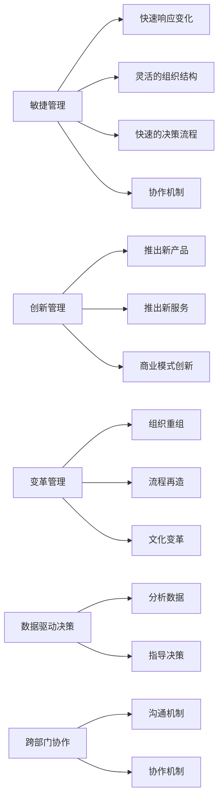

                 

## 1. 背景介绍

在当今瞬息万变的商业环境中，管理者面临着前所未有的挑战。消费者需求多变，市场竞争激烈，技术进步日新月异，所有这些因素都在不断推动企业快速变革。因此，管理者需要具备应对这些变化的能力，以确保企业的持续发展和竞争力。

### 1.1 商业环境的变化

全球化和数字化转型是当前商业环境的主要趋势。全球化带来了跨文化和跨地域的商业机会，同时也增加了市场的不确定性。数字化转型则将数据和信息技术引入企业管理，要求企业能够快速收集、分析和利用数据，以指导决策。

### 1.2 管理者的角色

面对快速变化的商业环境，管理者的角色也发生了重大转变。他们需要从传统的计划、组织、领导和控制中解放出来，更加注重创新、协作和变革管理。此外，管理者还需要具备应对危机和预测未来的能力，以引导企业顺应时代潮流。

## 2. 核心概念与联系

### 2.1 核心概念概述

在应对快速变化的商业环境中，管理者需要掌握以下核心概念：

- **敏捷管理**：敏捷管理强调快速响应变化，通过灵活的组织结构、快速的决策流程和协作机制，使企业能够快速调整战略和执行计划。
- **创新管理**：创新管理旨在推动企业不断推出新产品、服务和商业模式，以适应市场变化和客户需求。
- **变革管理**：变革管理关注如何有效实施和推动组织变革，包括组织重组、流程再造和文化变革等。
- **数据驱动决策**：数据驱动决策强调通过分析数据来指导决策，以提高决策的准确性和及时性。
- **跨部门协作**：跨部门协作要求不同部门之间建立有效沟通和协作机制，以实现资源共享和信息协同。

### 2.2 核心概念原理和架构的 Mermaid 流程图



### 2.3 核心概念联系

敏捷管理、创新管理和变革管理是管理者应对快速变化的三大核心能力，它们之间相互关联，共同构成企业应对变化的整体框架。数据驱动决策和跨部门协作则提供了解决方案和执行手段，确保敏捷和创新的有效实施。

## 3. 核心算法原理 & 具体操作步骤

### 3.1 算法原理概述

在快速变化的商业环境中，管理者需要应用敏捷管理、创新管理和变革管理的算法原理，以确保企业能够迅速适应变化。以下是这些算法的基本原理：

- **敏捷管理**：采用迭代开发和持续交付的方法，通过小步快跑的方式，不断测试和优化产品和服务。
- **创新管理**：运用创新扩散模型，识别和评估创新机会，将创新理念转化为实际产品和服务。
- **变革管理**：使用组织变革理论，设计和管理变革项目，确保变革过程平稳有序。

### 3.2 算法步骤详解

管理者应对快速变化的商业环境，一般遵循以下步骤：

1. **环境分析**：分析市场、技术、竞争对手和消费者需求，确定企业面临的挑战和机会。
2. **制定战略**：根据环境分析结果，制定符合企业核心价值观的战略方向。
3. **实施计划**：将战略转化为具体的行动计划，并分配给相应的部门和团队。
4. **监控与调整**：通过关键绩效指标（KPIs）和定期评估，监控战略实施效果，并根据实际情况进行调整。

### 3.3 算法优缺点

敏捷管理、创新管理和变革管理的算法具有以下优点：

- 灵活性和适应性强：能够快速响应市场和技术变化，调整战略和执行计划。
- 创新驱动：通过创新管理，推动企业不断推出新产品和服务，保持竞争力。
- 变革能力：通过变革管理，有效实施和推动组织变革，优化业务流程和组织结构。

同时，这些算法也存在一些缺点：

- 管理复杂度高：需要协调多个部门和团队，增加了管理的复杂性。
- 决策难度大：在快速变化的环境中，决策需要考虑多方面因素，增加了决策难度。
- 资源投入大：敏捷和创新管理需要大量的资源投入，包括时间、人力和资金。

### 3.4 算法应用领域

敏捷管理、创新管理和变革管理适用于各种商业环境，特别是快速变化和不确定性高的领域，如科技、金融和医疗等。数据驱动决策和跨部门协作则广泛应用于各行各业，提高决策的准确性和协作效率。

## 4. 数学模型和公式 & 详细讲解 & 举例说明

### 4.1 数学模型构建

管理者在应对快速变化的商业环境中，通常使用以下数学模型：

- **敏捷管理**：采用迭代开发模型（如Scrum），通过周期性的迭代和交付，不断改进产品和服务。
- **创新管理**：使用创新扩散模型，通过预测创新采纳曲线，指导企业推动创新。
- **变革管理**：采用变革模型（如ADKAR），通过五个关键步骤（意识、动机、知识、能力、行动），推动组织变革。

### 4.2 公式推导过程

以下是一些常见的数学模型和公式推导过程：

- **敏捷管理**：
  - 迭代周期（T）的计算公式：$$T = \frac{C}{n}$$
  - 交付率（P）的计算公式：$$P = \frac{D}{T}$$
  
- **创新管理**：
  - 创新采纳曲线公式：$$N(t) = N_0 + (M - N_0) \left[ 1 - (1 - c) \exp(-kt) \right]$$
  - 创新扩散速度公式：$$k = \frac{\ln 10}{t_{50}}$$
  
- **变革管理**：
  - ADKAR模型公式：$$ADKAR = A \times D \times K \times A \times R$$

### 4.3 案例分析与讲解

以下是一个具体的案例分析：

- **案例背景**：某科技公司面临快速变化的市场环境，需要迅速推出新产品以保持竞争优势。
- **分析过程**：
  - 环境分析：市场对新产品的需求快速增长，竞争对手不断推出创新产品。
  - 制定战略：采用敏捷管理，进行快速迭代开发和持续交付。
  - 实施计划：设立敏捷团队，使用Scrum方法进行迭代开发，每两周交付一次新功能。
  - 监控与调整：通过用户反馈和市场反应，定期调整产品功能和开发计划。

## 5. 项目实践：代码实例和详细解释说明

### 5.1 开发环境搭建

在实际项目中，管理者需要搭建相应的开发环境来支持敏捷管理、创新管理和变革管理。以下是一个简单的开发环境搭建流程：

1. **敏捷管理工具**：选择如JIRA、Trello等敏捷管理工具，实现任务跟踪和团队协作。
2. **创新管理工具**：选择如Innovation Insight、Pandora等创新管理工具，帮助识别和评估创新机会。
3. **变革管理工具**：选择如Korn/Ferry的变革管理平台，进行变革项目的规划和管理。

### 5.2 源代码详细实现

管理者在项目实践中，需要开发相应的代码来支持各种管理活动。以下是一个示例代码：

```python
class AgileManagement:
    def __init__(self):
        self.backlog = []
        self.sprints = []
    
    def add_task(self, task):
        self.backlog.append(task)
    
    def start_sprint(self, sprint):
        sprint.tasks = []
        while len(self.backlog) > 0 and len(sprint.tasks) < sprint.capacity:
            sprint.tasks.append(self.backlog.pop(0))
    
    def end_sprint(self, sprint):
        sprint.completed_tasks = [task for task in sprint.tasks if task.status == 'done']
        self.sprints.append(sprint)
        
class InnovationManagement:
    def __init__(self, data):
        self.data = data
    
    def analyze_trends(self):
        # 分析市场趋势和消费者需求
        pass
    
    def evaluate_opportunities(self):
        # 评估创新机会
        pass

class ChangeManagement:
    def __init__(self, plan):
        self.plan = plan
    
    def execute_plan(self):
        # 执行变革计划
        pass
```

### 5.3 代码解读与分析

上述代码展示了敏捷管理、创新管理和变革管理的Python实现。

- **AgileManagement**类：负责任务管理，包括任务添加、迭代开始和结束等操作。
- **InnovationManagement**类：负责市场和消费者需求的分析，以及创新机会的评估。
- **ChangeManagement**类：负责变革计划的执行，确保变革过程平稳有序。

## 6. 实际应用场景

### 6.1 智能制造

智能制造是当前制造业变革的主要方向，管理者需要采用敏捷管理和创新管理，以快速响应市场需求和技术变化。例如，通过使用敏捷开发方法和创新管理工具，企业可以快速推出定制化产品和解决方案，提升市场竞争力。

### 6.2 金融科技

金融科技是金融行业的重要创新方向，管理者需要应用敏捷管理和数据驱动决策，以快速响应市场变化和客户需求。例如，通过敏捷开发和数据驱动决策，金融科技企业可以推出新的金融产品和服务，优化用户体验。

### 6.3 电子商务

电子商务是快速变化的行业，管理者需要应用敏捷管理和跨部门协作，以快速响应市场变化和客户需求。例如，通过敏捷开发和跨部门协作，电子商务企业可以快速推出新功能和改进用户体验。

## 7. 工具和资源推荐

### 7.1 学习资源推荐

管理者需要不断学习新的管理理论和工具，以适应快速变化的商业环境。以下是一些推荐的学习资源：

1. **《敏捷管理的实践》**：讲解敏捷管理的基本原理和工具，帮助管理者提升敏捷能力。
2. **《创新管理：实现突破性增长》**：介绍创新管理的理论和实践，帮助管理者推动企业创新。
3. **《变革管理：实现组织转型》**：讲解变革管理的基本模型和步骤，帮助管理者推动组织变革。
4. **《数据驱动决策：从数据到行动》**：介绍数据驱动决策的方法和工具，帮助管理者提升决策能力。
5. **《跨部门协作：构建高效团队》**：讲解跨部门协作的方法和工具，帮助管理者提升团队协作效率。

### 7.2 开发工具推荐

管理者在实际项目中，需要使用多种开发工具来支持敏捷管理、创新管理和变革管理。以下是一些推荐的开发工具：

1. **JIRA**：敏捷管理工具，支持任务跟踪、团队协作和报告生成。
2. **Trello**：敏捷管理工具，支持看板管理、任务分配和进度跟踪。
3. **Innovation Insight**：创新管理工具，支持创新机会识别、评估和跟踪。
4. **Pandora**：创新管理工具，支持创新项目管理和创新扩散分析。
5. **Korn/Ferry**：变革管理平台，支持变革项目规划、执行和监控。

### 7.3 相关论文推荐

管理者需要持续关注最新的管理研究，以提升自身的管理能力。以下是一些推荐的论文：

1. **《敏捷管理的实践：案例研究》**：通过案例研究，介绍敏捷管理的实施方法和效果。
2. **《创新管理的理论和实践》**：介绍创新管理的基本理论和方法，帮助管理者推动企业创新。
3. **《变革管理模型和实践》**：介绍变革管理的基本模型和方法，帮助管理者推动组织变革。
4. **《数据驱动决策：理论与实践》**：介绍数据驱动决策的方法和工具，帮助管理者提升决策能力。
5. **《跨部门协作：理论和实践》**：介绍跨部门协作的方法和工具，帮助管理者提升团队协作效率。

## 8. 总结：未来发展趋势与挑战

### 8.1 研究成果总结

通过以上讨论，管理者可以了解到应对快速变化的商业环境需要掌握敏捷管理、创新管理和变革管理等核心能力，并使用数据驱动决策和跨部门协作等手段。这些方法和工具在实际应用中得到了广泛验证，并取得了显著效果。

### 8.2 未来发展趋势

未来，敏捷管理、创新管理和变革管理将进一步发展和完善，帮助管理者更好地应对快速变化的商业环境。以下是一些未来趋势：

1. **人工智能和自动化**：人工智能和自动化技术将进一步融入管理过程，提升管理效率和决策准确性。
2. **数据驱动管理**：数据驱动管理将成为主流，管理者将更加依赖数据进行决策。
3. **可持续管理**：可持续发展将成为企业管理的重要方向，管理者将更多关注环境保护和社会责任。

### 8.3 面临的挑战

尽管管理者在应对快速变化的商业环境中取得了一定的成效，但仍面临以下挑战：

1. **管理复杂性增加**：快速变化带来更多的不确定性，管理复杂性随之增加。
2. **数据质量问题**：数据驱动管理依赖高质量数据，但数据质量问题可能影响决策准确性。
3. **文化变革难度大**：组织变革需要改变企业文化，难度较大。
4. **人才短缺**：缺乏具备敏捷管理、创新管理和变革管理能力的人才。

### 8.4 研究展望

未来，管理者需要持续关注和探索以下研究领域：

1. **混合管理模式**：结合敏捷管理和精益管理，形成混合管理模式，提升管理效果。
2. **新工具和新技术**：探索新的管理工具和技术，如区块链、物联网等，提升管理效率。
3. **多层次管理**：关注宏观和微观管理，实现多层次管理，提升管理能力。
4. **全球化管理**：关注全球化管理，提升企业在全球市场中的竞争力。

## 9. 附录：常见问题与解答

**Q1: 管理者如何提升敏捷管理能力？**

A: 管理者可以通过以下方式提升敏捷管理能力：
1. 学习和掌握敏捷管理的基本理论和工具，如Scrum、Kanban等。
2. 建立敏捷团队，培养团队成员的敏捷意识和技能。
3. 定期进行敏捷培训和认证，提升管理能力。

**Q2: 如何在快速变化的市场中推动企业创新？**

A: 管理者可以通过以下方式推动企业创新：
1. 建立创新管理机制，识别和评估创新机会。
2. 设立创新团队，推动创新项目的实施。
3. 激励员工创新，营造创新文化。

**Q3: 如何推动组织变革？**

A: 管理者可以通过以下方式推动组织变革：
1. 制定清晰的变革计划，明确变革目标和步骤。
2. 采用变革管理模型，如ADKAR，确保变革过程平稳有序。
3. 激励员工参与变革，提升变革的接受度和执行效果。

通过以上讨论，管理者可以更好地应对快速变化的商业环境，提升企业的竞争力和市场地位。管理者需要不断学习和应用新的管理理论和方法，以适应不断变化的市场和技术环境，推动企业的持续发展和创新。

