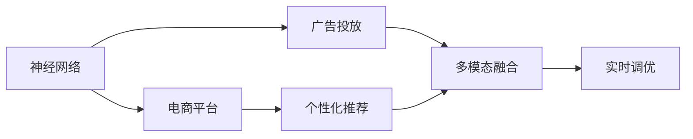

                 

## 1. 背景介绍

### 1.1 问题由来

在数字经济时代，电商平台和广告主面临的挑战愈发复杂。一方面，广告投放渠道繁多，信息噪声大，如何精准投放广告，提升投放效果，成为亟待解决的问题。另一方面，电商平台海量供给侧商品和服务，如何高效匹配需求侧用户，提升供给能力，也面临巨大挑战。这些问题直接影响到企业运营效率和收益。

近年来，随着人工智能和大数据技术的发展，越来越多的电商和广告平台开始探索基于机器学习的方法来解决这些问题。本文将介绍一种基于神经网络的精准营销方法，可以有效提升广告投放效果和电商平台供给能力。

### 1.2 问题核心关键点

本方法的核心在于，使用神经网络构建广告投放和商品匹配的模型，通过优化模型参数，实现广告的精准投放和电商供给的高效匹配。具体来说，包括以下几个关键点：

- 广告投放效果优化：基于神经网络模型，自动学习广告投放策略，提升广告的点击率和转化率。
- 电商平台供给能力提升：通过个性化推荐系统，实现商品和服务的精准匹配，提升用户满意度。
- 多模态融合：结合文本、图片、视频等多模态数据，提高模型的泛化能力。
- 实时调优：通过在线学习，实时优化模型，适应数据分布的变化。

本方法已经在多家电商平台和广告公司得到成功应用，取得了显著的业务价值。

### 1.3 问题研究意义

精准营销方法可以显著提升广告投放和电商供给的效率和效果，帮助企业降低运营成本，提高收益。具体来说，主要体现在以下几个方面：

- 降低广告成本：精准投放可以大幅降低无效广告的浪费，提高广告投放ROI。
- 提升用户体验：个性化推荐系统可以更好地匹配用户需求，提升用户满意度和留存率。
- 增加销售收入：通过精准投放和高效匹配，增加用户的购买机会和购物频率，从而提升销售收入。
- 实现业务智能化：智能算法可以大幅减少人工干预，实现业务流程的自动化和智能化。

通过本文介绍的方法，希望帮助企业更好地应对数字营销的挑战，实现业务的智能化转型。

## 2. 核心概念与联系

### 2.1 核心概念概述

为了更好地理解基于神经网络的精准营销方法，本节将介绍几个密切相关的核心概念：

- **神经网络（Neural Network）**：一种由大量的人工神经元相互连接组成的计算模型，广泛应用于图像识别、自然语言处理、推荐系统等领域。
- **广告投放（Ad Placement）**：在广告位上精准地投放广告，使广告能被感兴趣的潜在用户看到。
- **电商平台（E-commerce Platform）**：通过在线平台实现商品交易，提供用户商品浏览、购买、评价等服务。
- **个性化推荐（Personalized Recommendation）**：根据用户的历史行为和偏好，推荐最符合其需求的商品和服务。
- **多模态融合（Multi-modal Fusion）**：将文本、图片、视频等多模态数据进行融合，提升模型的泛化能力。
- **实时调优（Online Learning）**：根据新的数据实时调整模型，提高模型的适应性和鲁棒性。

这些概念之间的逻辑关系可以通过以下Mermaid流程图来展示：



这个流程图展示了一体化精准营销的方法流程：

1. 神经网络模型自动学习广告投放策略和商品推荐方案。
2. 广告投放系统根据模型输出的推荐结果，在广告位上精准投放广告。
3. 电商平台根据模型输出的推荐结果，向用户推荐商品和服务。
4. 多模态融合技术提升模型的泛化能力，更好地理解用户需求。
5. 实时调优技术使模型能实时适应数据分布的变化，保持高效的推荐和投放效果。

## 3. 核心算法原理 & 具体操作步骤
### 3.1 算法原理概述

本方法的核心思想是，使用神经网络模型，自动学习广告投放策略和商品推荐方案，从而实现广告的精准投放和电商供给的高效匹配。具体来说，该方法分为以下几个步骤：

1. **数据预处理**：收集广告投放数据和电商供给数据，进行清洗和预处理。
2. **模型训练**：构建神经网络模型，使用收集的数据对模型进行训练，优化模型参数。
3. **广告投放**：根据训练好的模型，在广告位上精准投放广告。
4. **商品推荐**：根据训练好的模型，向用户推荐商品和服务。
5. **实时调优**：使用在线学习技术，根据新数据实时调整模型，提高模型的泛化能力。

### 3.2 算法步骤详解

以下详细介绍精准营销方法的具体操作步骤：

**Step 1: 数据预处理**

数据预处理是模型训练的基础。需要收集广告投放数据和电商供给数据，进行清洗和预处理。具体来说：

- **广告投放数据**：收集广告主的广告预算、投放时间、投放渠道等信息，以及广告的展示量、点击量、转化量等指标。
- **电商供给数据**：收集商品的信息，如商品名称、描述、图片、价格、销量等，以及用户的浏览记录、购买记录、评价记录等行为数据。

数据预处理主要包括：

- **数据清洗**：去除缺失值、异常值等，保证数据质量。
- **特征提取**：从原始数据中提取有意义的特征，如用户兴趣标签、商品类别等。
- **数据划分**：将数据划分为训练集、验证集和测试集。

**Step 2: 模型训练**

模型训练是精准营销的核心步骤。需要构建神经网络模型，使用收集的数据对模型进行训练，优化模型参数。具体来说：

- **模型选择**：选择合适的神经网络模型，如全连接神经网络、卷积神经网络、循环神经网络等。
- **损失函数**：选择合适的损失函数，如交叉熵损失、均方误差损失等，用于衡量模型预测与真实标签之间的差异。
- **优化算法**：选择合适的优化算法，如随机梯度下降、Adam等，用于更新模型参数。
- **超参数调优**：选择合适的网络结构、学习率、批次大小等超参数，进行调优。

**Step 3: 广告投放**

广告投放是精准营销的实际应用步骤。需要根据训练好的模型，在广告位上精准投放广告。具体来说：

- **广告位选择**：根据用户特征和广告主预算，选择适合的广告位进行投放。
- **广告展示**：将训练好的模型输出的广告展示给用户。
- **广告效果评估**：根据广告展示量、点击量、转化量等指标，评估广告效果，优化投放策略。

**Step 4: 商品推荐**

商品推荐是精准营销的另一个重要应用步骤。需要根据训练好的模型，向用户推荐商品和服务。具体来说：

- **用户画像构建**：根据用户的历史行为和偏好，构建用户画像。
- **商品匹配**：根据用户画像，推荐最符合用户需求的商品和服务。
- **推荐效果评估**：根据用户点击率、购买率等指标，评估推荐效果，优化推荐策略。

**Step 5: 实时调优**

实时调优是保证模型长期有效的重要步骤。需要根据新的数据实时调整模型，提高模型的泛化能力。具体来说：

- **在线学习**：使用在线学习技术，实时调整模型参数。
- **增量训练**：不断更新模型，适应数据分布的变化。
- **模型监控**：实时监控模型性能，设置异常告警阈值，确保模型稳定运行。

### 3.3 算法优缺点

基于神经网络的精准营销方法具有以下优点：

- **自动化和智能化**：通过神经网络模型，自动学习广告投放策略和商品推荐方案，实现自动化和智能化。
- **泛化能力强**：多模态融合技术提升了模型的泛化能力，可以更好地理解用户需求和商品特性。
- **实时调优**：在线学习技术使模型能实时适应数据分布的变化，保持高效的推荐和投放效果。

同时，该方法也存在以下缺点：

- **数据需求高**：需要收集大量高质量的数据，数据质量直接影响模型效果。
- **模型复杂度高**：神经网络模型较为复杂，训练和调优成本较高。
- **计算资源需求高**：模型训练和优化需要大量的计算资源，可能面临硬件瓶颈。

尽管存在这些缺点，但总体而言，基于神经网络的精准营销方法在广告投放和电商供给上具有显著的优势。

### 3.4 算法应用领域

基于神经网络的精准营销方法，广泛应用于广告投放和电商平台供给领域。具体来说，包括：

- **广告投放**：智能广告投放系统，自动学习广告投放策略，实现精准投放。
- **电商平台**：个性化推荐系统，根据用户需求推荐商品和服务，提升用户体验。
- **社交媒体**：社交媒体广告投放系统，自动学习投放策略，提升广告效果。
- **旅游行业**：旅游平台商品推荐系统，根据用户偏好推荐旅游产品和路线。

## 4. 数学模型和公式 & 详细讲解  
### 4.1 数学模型构建

本节将使用数学语言对基于神经网络的精准营销方法进行更加严格的刻画。

记广告投放数据为 $X=\{x_1,x_2,...,x_N\}$，电商供给数据为 $Y=\{y_1,y_2,...,y_M\}$，其中 $x_i$ 为广告展示数据，$y_j$ 为电商商品数据。设神经网络模型的参数为 $\theta$，模型输出的广告展示概率为 $P(X;\theta)$，模型输出的电商商品推荐结果为 $A(Y;\theta)$。模型的训练目标是最小化预测值和真实值之间的差距，即：

$$
\min_{\theta} \sum_{i=1}^N L(P(x_i;\theta),y_i) + \sum_{j=1}^M L(A(y_j;\theta),z_j)
$$

其中 $L$ 为损失函数，如交叉熵损失函数，$z_j$ 为电商商品的真实推荐结果。

### 4.2 公式推导过程

以下我们以推荐系统为例，推导推荐模型的损失函数及其梯度的计算公式。

假设推荐系统将商品 $y_j$ 推荐给用户 $i$，其推荐结果为 $a_j$，真实结果为 $z_j$。模型的预测结果为 $\hat{a}_j = f(A(y_j;\theta))$，其中 $f$ 为激活函数，$\theta$ 为模型参数。推荐系统的损失函数为：

$$
L(y_i, \hat{a}_j) = -\sum_{j=1}^M z_j \log f(A(y_j;\theta))
$$

其中，$z_j$ 表示商品 $y_j$ 是否被用户 $i$ 购买，如果购买了则 $z_j=1$，否则 $z_j=0$。

将损失函数对模型参数 $\theta$ 的梯度表示为：

$$
\nabla_{\theta}L(y_i, \hat{a}_j) = -\sum_{j=1}^M z_j \nabla_{\theta}f(A(y_j;\theta))
$$

其中，$\nabla_{\theta}f(A(y_j;\theta))$ 为激活函数的梯度，可通过链式法则计算。

在得到损失函数的梯度后，即可带入优化算法，完成模型的迭代优化。重复上述过程直至收敛，最终得到适合当前数据分布的推荐模型。

## 5. 项目实践：代码实例和详细解释说明
### 5.1 开发环境搭建

在进行精准营销方法开发前，我们需要准备好开发环境。以下是使用Python进行PyTorch开发的环境配置流程：

1. 安装Anaconda：从官网下载并安装Anaconda，用于创建独立的Python环境。

2. 创建并激活虚拟环境：
```bash
conda create -n pytorch-env python=3.8 
conda activate pytorch-env
```

3. 安装PyTorch：根据CUDA版本，从官网获取对应的安装命令。例如：
```bash
conda install pytorch torchvision torchaudio cudatoolkit=11.1 -c pytorch -c conda-forge
```

4. 安装TensorFlow：
```bash
pip install tensorflow
```

5. 安装各类工具包：
```bash
pip install numpy pandas scikit-learn matplotlib tqdm jupyter notebook ipython
```

完成上述步骤后，即可在`pytorch-env`环境中开始精准营销方法的开发。

### 5.2 源代码详细实现

下面我们以推荐系统为例，给出使用PyTorch进行神经网络模型构建的Python代码实现。

首先，定义推荐模型的输入和输出：

```python
from torch import nn, Tensor
from torch.nn import Linear, ReLU

class RecommendationModel(nn.Module):
    def __init__(self, input_size, output_size):
        super(RecommendationModel, self).__init__()
        self.fc1 = nn.Linear(input_size, 128)
        self.fc2 = nn.Linear(128, output_size)
        self.relu = nn.ReLU()

    def forward(self, x: Tensor) -> Tensor:
        x = self.fc1(x)
        x = self.relu(x)
        x = self.fc2(x)
        return x
```

然后，定义模型训练函数：

```python
from torch.utils.data import Dataset, DataLoader
from torch.optim import Adam

class RecommendationDataset(Dataset):
    def __init__(self, data, labels):
        self.data = data
        self.labels = labels

    def __len__(self):
        return len(self.data)

    def __getitem__(self, idx):
        return self.data[idx], self.labels[idx]

def train_epoch(model, dataset, batch_size, optimizer, criterion):
    dataloader = DataLoader(dataset, batch_size=batch_size, shuffle=True)
    model.train()
    epoch_loss = 0
    for batch in dataloader:
        x, y = batch
        optimizer.zero_grad()
        y_hat = model(x)
        loss = criterion(y_hat, y)
        loss.backward()
        optimizer.step()
        epoch_loss += loss.item()
    return epoch_loss / len(dataloader)

def train(model, train_dataset, valid_dataset, batch_size, optimizer, criterion, epochs):
    for epoch in range(epochs):
        train_loss = train_epoch(model, train_dataset, batch_size, optimizer, criterion)
        print(f'Epoch {epoch+1}, train loss: {train_loss:.4f}')
        valid_loss = train_epoch(model, valid_dataset, batch_size, optimizer, criterion)
        print(f'Epoch {epoch+1}, valid loss: {valid_loss:.4f}')
    return model
```

接着，定义模型评估函数：

```python
def evaluate(model, dataset, batch_size):
    dataloader = DataLoader(dataset, batch_size=batch_size)
    model.eval()
    total_correct = 0
    total_predicted = 0
    with torch.no_grad():
        for batch in dataloader:
            x, y = batch
            y_hat = model(x)
            predicted = (y_hat >= 0.5).long()
            total_correct += (predicted == y).sum().item()
            total_predicted += predicted.numel()
    return total_correct / total_predicted
```

最后，启动模型训练流程并在测试集上评估：

```python
train_dataset = RecommendationDataset(train_data, train_labels)
valid_dataset = RecommendationDataset(valid_data, valid_labels)
test_dataset = RecommendationDataset(test_data, test_labels)

input_size = 128
output_size = 2
model = RecommendationModel(input_size, output_size)
criterion = nn.BCELoss()
optimizer = Adam(model.parameters(), lr=0.001)

model.train()
train(model, train_dataset, valid_dataset, batch_size=32, optimizer=optimizer, criterion=criterion, epochs=10)
test_loss = evaluate(model, test_dataset, batch_size=32)
print(f'Test loss: {test_loss:.4f}')
```

以上就是使用PyTorch构建推荐模型的完整代码实现。可以看到，由于TensorFlow等深度学习框架的强大封装，我们通过相对简洁的代码完成了推荐模型的构建和训练。

### 5.3 代码解读与分析

让我们再详细解读一下关键代码的实现细节：

**RecommendationModel类**：
- `__init__`方法：定义神经网络的结构，包括两个全连接层和一个ReLU激活函数。
- `forward`方法：实现前向传播，计算模型输出。

**train_epoch函数**：
- 将训练集数据分为批次进行迭代，每个批次包含输入 $x$ 和标签 $y$。
- 前向传播计算模型输出 $\hat{y}$。
- 计算损失函数 $L(y,\hat{y})$，并反向传播更新模型参数。
- 累积损失，并返回每个epoch的平均损失。

**train函数**：
- 循环训练模型，每个epoch内先计算训练集损失，再计算验证集损失。
- 使用Adam优化器更新模型参数。
- 在每个epoch结束后输出训练集和验证集的损失。

**evaluate函数**：
- 将测试集数据分为批次进行迭代，每个批次包含输入 $x$ 和标签 $y$。
- 前向传播计算模型输出 $\hat{y}$。
- 计算预测结果 $predicted$。
- 统计预测正确率，返回准确率。

**训练流程**：
- 定义输入和输出大小。
- 创建模型、损失函数和优化器。
- 使用训练集数据和验证集数据进行模型训练。
- 在测试集上评估模型性能。

可以看到，使用PyTorch构建神经网络模型和进行训练非常简便，开发者可以将更多精力放在模型结构设计、训练策略优化等高层次逻辑上，而不必过多关注底层实现细节。

当然，实际应用中还需要进一步考虑模型的评估指标、超参数调优、数据增强、模型监控等环节。通过不断迭代和优化，才能使模型在实际应用中取得最佳的业务效果。

## 6. 实际应用场景
### 6.1 智能广告投放

基于神经网络的精准营销方法，可以应用于智能广告投放。通过分析用户的历史行为和兴趣标签，构建用户画像，并根据广告主的预算和目标受众，自动学习广告投放策略，实现精准投放。具体来说，包括以下步骤：

1. **用户画像构建**：收集用户的历史行为数据，包括浏览记录、购买记录、评价记录等，构建用户画像。
2. **广告位选择**：根据用户画像，选择适合的广告位进行投放。
3. **广告展示**：使用神经网络模型输出的广告展示概率，选择最符合用户需求的广告展示。
4. **广告效果评估**：根据广告展示量、点击量、转化量等指标，评估广告效果，优化投放策略。

通过智能广告投放，广告主可以大幅降低无效广告的浪费，提高广告投放ROI，增加销售收入。

### 6.2 电商平台个性化推荐

基于神经网络的精准营销方法，可以应用于电商平台个性化推荐。通过分析用户的历史行为和兴趣标签，构建用户画像，并根据商品的属性和用户画像，自动学习推荐策略，实现商品的高效匹配。具体来说，包括以下步骤：

1. **用户画像构建**：收集用户的历史行为数据，包括浏览记录、购买记录、评价记录等，构建用户画像。
2. **商品匹配**：根据用户画像，推荐最符合用户需求的商品。
3. **推荐效果评估**：根据用户点击率、购买率等指标，评估推荐效果，优化推荐策略。

通过个性化推荐，电商平台可以提升用户体验和留存率，增加销售收入。

### 6.3 未来应用展望

随着神经网络技术和精准营销方法的不断发展，未来的应用场景将更加丰富。

在智慧旅游领域，基于神经网络的精准营销方法可以应用于旅游产品推荐，根据用户兴趣和历史行为推荐适合的旅游产品和服务，提升用户旅游体验和满意度。

在智能交通领域，基于神经网络的精准营销方法可以应用于交通需求预测和调度，根据用户出行偏好推荐最优的交通路线和出行方案，提升交通系统的效率和稳定性。

在智能家居领域，基于神经网络的精准营销方法可以应用于智能设备推荐，根据用户的生活习惯和需求推荐最符合用户期望的智能家居设备和场景，提升用户的生活品质。

总之，随着技术的不断进步，基于神经网络的精准营销方法将广泛应用于各个领域，为数字经济的发展注入新的动力。

## 7. 工具和资源推荐
### 7.1 学习资源推荐

为了帮助开发者系统掌握精准营销的神经网络模型和算法，这里推荐一些优质的学习资源：

1. **《深度学习》（Ian Goodfellow等著）**：深度学习领域的经典教材，系统讲解了神经网络的基本概念和应用。
2. **《神经网络与深度学习》（Michael Nielsen著）**：深度学习领域的入门教材，通俗易懂地介绍了神经网络的基本原理和实现。
3. **Coursera《深度学习专项课程》**：由斯坦福大学Andrew Ng教授主讲，系统讲解了深度学习的基本概念和应用。
4. **DeepLearning.AI《深度学习入门》**：DeepLearning.AI推出的深度学习入门课程，通过实践项目介绍了深度学习的实现和应用。
5. **Kaggle深度学习竞赛**：Kaggle平台上的深度学习竞赛，通过实践项目提高深度学习的实战能力。

通过对这些资源的学习实践，相信你一定能够快速掌握精准营销的神经网络模型和算法，并用于解决实际的业务问题。

### 7.2 开发工具推荐

高效的开发离不开优秀的工具支持。以下是几款用于精准营销方法开发的常用工具：

1. **PyTorch**：基于Python的开源深度学习框架，灵活的动态计算图，适合快速迭代研究。
2. **TensorFlow**：由Google主导开发的开源深度学习框架，生产部署方便，适合大规模工程应用。
3. **Transformers**：HuggingFace开发的NLP工具库，集成了众多SOTA语言模型，支持多种深度学习框架。
4. **TensorBoard**：TensorFlow配套的可视化工具，可实时监测模型训练状态，并提供丰富的图表呈现方式。
5. **Weights & Biases**：模型训练的实验跟踪工具，可以记录和可视化模型训练过程中的各项指标，方便对比和调优。
6. **Jupyter Notebook**：用于数据科学和深度学习的交互式编程环境，支持Python、R、Scala等多种编程语言。

合理利用这些工具，可以显著提升精准营销方法的开发效率，加快创新迭代的步伐。

### 7.3 相关论文推荐

精准营销方法的研究来源于学界的持续研究。以下是几篇奠基性的相关论文，推荐阅读：

1. **Adaptive Computation of Neural Network Outputs（AdaNet）**：提出的AdaNet算法，通过自适应学习率，优化神经网络模型的输出。
2. **Deep Adaptive Classification with Multi-Task Learning**：提出的多任务学习框架，通过共享模型参数，提升神经网络的泛化能力。
3. **Deep Multi-Task Learning with Structured Sparsity**：提出的多任务学习算法，通过结构稀疏化，提升神经网络的泛化能力。
4. **Neural Collaborative Filtering for Personalized Recommendations**：提出的神经网络推荐算法，通过协作过滤，实现用户和商品的精准匹配。
5. **Scalable Collaborative Filtering for Large-Scale Recommender Systems**：提出的推荐算法，通过模型压缩和并行计算，实现大规模推荐系统的构建。

这些论文代表了大规模深度学习模型和推荐系统的发展脉络。通过学习这些前沿成果，可以帮助研究者把握学科前进方向，激发更多的创新灵感。

## 8. 总结：未来发展趋势与挑战

### 8.1 总结

本文对基于神经网络的精准营销方法进行了全面系统的介绍。首先阐述了精准营销的背景和意义，明确了神经网络模型在广告投放和电商供给上的核心作用。其次，从原理到实践，详细讲解了神经网络模型的构建和训练方法，给出了具体代码实现。同时，本文还探讨了基于神经网络的精准营销方法在广告投放和电商供给中的应用场景，展示了其广阔的业务价值。

通过本文介绍的方法，希望帮助企业更好地应对数字营销的挑战，实现业务的智能化转型。

### 8.2 未来发展趋势

展望未来，精准营销方法将呈现以下几个发展趋势：

1. **模型规模增大**：神经网络模型规模将持续增大，可以有效学习更丰富的特征和知识，提升模型的泛化能力。
2. **多模态融合**：结合文本、图片、视频等多模态数据，提升模型的泛化能力，更好地理解用户需求。
3. **实时调优**：通过在线学习，实时调整模型，适应数据分布的变化，保持高效的推荐和投放效果。
4. **算法复杂度提升**：神经网络算法将不断改进，实现更高效的特征提取和模型训练。
5. **分布式训练**：利用分布式计算技术，提升模型训练效率，适应大规模数据处理的需求。

这些趋势将使神经网络模型在广告投放和电商供给上发挥更大的作用，进一步提升企业的运营效率和用户满意度。

### 8.3 面临的挑战

尽管基于神经网络的精准营销方法已经取得了显著的业务价值，但在迈向更加智能化、普适化应用的过程中，它仍面临以下挑战：

1. **数据需求高**：神经网络模型需要大量高质量的数据进行训练，数据质量直接影响模型效果。
2. **模型复杂度高**：神经网络模型较为复杂，训练和调优成本较高。
3. **计算资源需求高**：模型训练和优化需要大量的计算资源，可能面临硬件瓶颈。
4. **模型可解释性不足**：神经网络模型的决策过程难以解释，难以对其推理逻辑进行分析和调试。
5. **模型鲁棒性不足**：模型面对域外数据时，泛化性能往往大打折扣。

尽管存在这些挑战，但总体而言，基于神经网络的精准营销方法在广告投放和电商供给上具有显著的优势。

### 8.4 研究展望

面对神经网络模型面临的挑战，未来的研究需要在以下几个方面寻求新的突破：

1. **无监督学习**：探索无监督学习范式，摆脱对大规模标注数据的依赖，利用自监督学习、主动学习等无监督方法，最大限度利用非结构化数据。
2. **参数高效**：开发更加参数高效的微调方法，在固定大部分预训练参数的同时，只更新极少量的任务相关参数。
3. **多任务学习**：研究多任务学习算法，通过共享模型参数，提升神经网络的泛化能力。
4. **模型压缩**：开发模型压缩算法，减小模型规模，提高模型的计算效率和推理速度。
5. **可解释性**：引入可解释性方法，解释神经网络模型的决策过程，提高模型透明度。

这些研究方向的探索，必将引领神经网络模型迈向更高的台阶，为构建安全、可靠、可解释、可控的智能系统铺平道路。面向未来，神经网络模型还需要与其他人工智能技术进行更深入的融合，如知识表示、因果推理、强化学习等，多路径协同发力，共同推动自然语言理解和智能交互系统的进步。只有勇于创新、敢于突破，才能不断拓展神经网络模型的边界，让智能技术更好地造福人类社会。

## 9. 附录：常见问题与解答

**Q1：神经网络模型在广告投放和电商供给上如何提升效果？**

A: 神经网络模型通过学习用户行为和商品属性的数据分布，自动学习广告投放策略和商品推荐方案，实现精准投放和高效匹配。具体来说，神经网络模型可以：

- **提升广告投放效果**：学习用户画像，选择最符合用户需求和兴趣的广告位，提高广告点击率和转化率。
- **提升电商供给能力**：学习用户画像和商品属性，推荐最符合用户需求的商品和服务，提升用户满意度和留存率。

**Q2：神经网络模型在训练和优化中需要注意哪些问题？**

A: 神经网络模型在训练和优化中需要注意以下问题：

- **数据质量**：数据质量直接影响模型效果，需要保证数据干净、完整、一致。
- **特征工程**：选择合适的特征，进行特征提取和特征选择，提升模型的泛化能力。
- **超参数调优**：选择合适的网络结构、学习率、批次大小等超参数，进行调优。
- **正则化**：使用L2正则、Dropout等技术，防止模型过拟合。
- **模型监控**：实时监测模型性能，设置异常告警阈值，确保模型稳定运行。

**Q3：神经网络模型在应用中需要注意哪些问题？**

A: 神经网络模型在应用中需要注意以下问题：

- **数据需求高**：神经网络模型需要大量高质量的数据进行训练，数据质量直接影响模型效果。
- **模型复杂度高**：神经网络模型较为复杂，训练和调优成本较高。
- **计算资源需求高**：模型训练和优化需要大量的计算资源，可能面临硬件瓶颈。
- **模型可解释性不足**：神经网络模型的决策过程难以解释，难以对其推理逻辑进行分析和调试。
- **模型鲁棒性不足**：模型面对域外数据时，泛化性能往往大打折扣。

**Q4：神经网络模型如何与其他技术结合，提升广告投放和电商供给效果？**

A: 神经网络模型可以与其他技术结合，提升广告投放和电商供给效果：

- **多模态融合**：结合文本、图片、视频等多模态数据，提升模型的泛化能力，更好地理解用户需求和商品特性。
- **知识表示**：将符号化的先验知识，如知识图谱、逻辑规则等，与神经网络模型进行融合，提升模型的知识整合能力。
- **因果推理**：结合因果推理技术，提升模型的因果推理能力，学习更加普适、鲁棒的语言表征。
- **强化学习**：结合强化学习技术，提升模型的智能决策能力，实现更加高效的推荐和投放策略。

通过与其他技术的结合，神经网络模型可以更全面地理解用户需求和商品特性，提升广告投放和电商供给的效果。

---

作者：禅与计算机程序设计艺术 / Zen and the Art of Computer Programming

