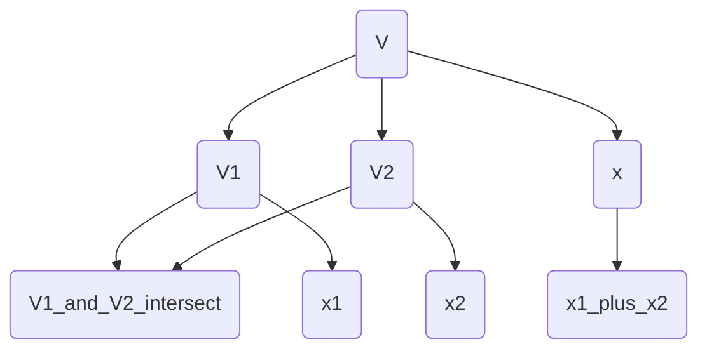

                 

# 线性代数导引：直和分解

> 关键词：线性代数, 直和分解, 向量空间, 基, 子空间, 线性组合

## 1. 背景介绍

直和分解（Direct Sum Decomposition）是线性代数中一个核心的概念，广泛应用于向量空间、矩阵运算、线性变换等多个领域。它不仅是一种重要的数学工具，也推动了线性代数理论和应用研究的发展。本文将详细讲解直和分解的原理和应用，通过具体的数学模型、算法步骤和实际案例，帮助读者深入理解这一重要概念。

## 2. 核心概念与联系

### 2.1 核心概念概述

直和分解是指将一个向量空间或矩阵空间拆分为多个子空间的并集，且这些子空间之间两两正交的线性映射过程。这种分解通常用于描述向量空间或矩阵的性质，简化问题的求解。

在数学中，直和分解可以表示为：
$$ V = V_1 \oplus V_2 $$
其中 $V$ 是向量空间或矩阵空间，$V_1$ 和 $V_2$ 是 $V$ 的子空间，满足以下条件：
- $V_1 \cap V_2 = \{0\}$（$V_1$ 和 $V_2$ 线性无关）
- 对任意 $x \in V$，存在唯一分解 $x = x_1 + x_2$，其中 $x_1 \in V_1$，$x_2 \in V_2$。

### 2.2 核心概念原理和架构的 Mermaid 流程图



这个流程图展示了直和分解的基本原理：
1. 向量空间 $V$ 被拆分为两个子空间 $V_1$ 和 $V_2$。
2. $V_1$ 和 $V_2$ 交集为零向量集 $\{0\}$，表明两者线性无关。
3. 任意向量 $x \in V$ 可以唯一表示为 $x_1 + x_2$，其中 $x_1 \in V_1$，$x_2 \in V_2$。

## 3. 核心算法原理 & 具体操作步骤

### 3.1 算法原理概述

直和分解的算法原理主要基于向量空间的线性组合和正交性。具体步骤如下：

1. 定义 $V_1$ 和 $V_2$ 为 $V$ 的子空间，使得 $V_1 \oplus V_2 = V$。
2. 通过 Gram-Schmidt 正交化等方法，将 $V_1$ 和 $V_2$ 中的元素正交化，使得两者线性无关。
3. 对于任意向量 $x \in V$，通过投影等方法，将其分解为 $V_1$ 和 $V_2$ 中向量的线性组合，得到唯一分解 $x = x_1 + x_2$，其中 $x_1 \in V_1$，$x_2 \in V_2$。

### 3.2 算法步骤详解

#### 步骤 1：定义子空间

首先，需要定义向量空间 $V$ 的子空间 $V_1$ 和 $V_2$。通常，$V_1$ 和 $V_2$ 可以通过矩阵的列空间和零空间来定义。

例如，对于矩阵 $A$，设其行空间为 $V_1$，零空间为 $V_2$，则：
$$ V = \{Ax | x \in \mathbb{R}^m\} $$
$$ V_1 = \{Ax | x \in \mathbb{R}^n\} $$
$$ V_2 = \{Ax | x \in \mathbb{R}^{m-n}\} $$

#### 步骤 2：正交化处理

接下来，通过正交化处理，使得 $V_1$ 和 $V_2$ 中的元素线性无关。常用的正交化方法包括 Gram-Schmidt 正交化、QR 分解等。

以 Gram-Schmidt 正交化为例子，对于向量空间 $V$ 中的基向量 $\{v_1, v_2, \ldots, v_m\}$，其正交化处理步骤如下：

1. 令 $w_1 = v_1$。
2. 对于 $i \geq 2$，令 $w_i = v_i - \sum_{k=1}^{i-1} \frac{v_i \cdot w_k}{\|w_k\|^2} w_k$，其中 $\cdot$ 表示向量的点积，$\|\cdot\|$ 表示向量的范数。
3. 得到正交化后的基向量 $\{w_1, w_2, \ldots, w_m\}$，满足 $w_i \cdot w_j = 0$（$i \neq j$）。

#### 步骤 3：分解和投影

对于任意向量 $x \in V$，通过投影等方法，将其分解为 $V_1$ 和 $V_2$ 中向量的线性组合，得到唯一分解 $x = x_1 + x_2$，其中 $x_1 \in V_1$，$x_2 \in V_2$。

例如，对于矩阵 $A$，设 $A$ 的左奇异向量矩阵为 $U$，右奇异向量矩阵为 $V$，则：
$$ U \in \mathbb{R}^{n \times n}, V \in \mathbb{R}^{m \times n} $$
$$ x = UU^T x = \sum_{i=1}^n (Ux)_i U_i = \sum_{i=1}^n \sigma_i v_i \sigma_i u_i = \sum_{i=1}^n (\sigma_i v_i)_i u_i $$
$$ y = VV^T y = \sum_{j=1}^m (\sigma_j u_j)_j v_j = \sum_{j=1}^m (\sigma_j u_j)_j v_j $$
$$ z = \sum_{i=1}^n (\sigma_i v_i)_i u_i + \sum_{j=1}^m (\sigma_j u_j)_j v_j $$

其中 $\sigma_i$ 为 $A$ 的奇异值，$v_i$ 和 $u_i$ 为 $A$ 的左奇异向量和右奇异向量。

### 3.3 算法优缺点

直和分解的优点包括：
- 通过分解向量空间，简化问题求解。
- 正交化处理使得子空间线性无关，便于后续计算。
- 投影等方法可以唯一分解任意向量，保证分解的准确性。

直和分解的缺点包括：
- 正交化处理复杂度较高，特别是在高维空间中。
- 分解后子空间的线性无关性不一定稳定，可能会受到噪声影响。
- 分解过程可能会引入数值误差，影响分解精度。

### 3.4 算法应用领域

直和分解在多个领域有广泛应用，包括：

1. 矩阵分解：如奇异值分解（SVD），将矩阵分解为两个正交矩阵和向量。
2. 信号处理：如频域分解，将信号分解为不同频率分量。
3. 统计分析：如主成分分析（PCA），将高维数据分解为低维子空间。
4. 图像处理：如子带分解，将图像分解为不同频带。
5. 数据压缩：如小波变换，将数据分解为不同尺度。

## 4. 数学模型和公式 & 详细讲解 & 举例说明

### 4.1 数学模型构建

直和分解的数学模型可以表示为：
$$ V = V_1 \oplus V_2 $$
其中 $V_1$ 和 $V_2$ 是 $V$ 的子空间，满足 $V_1 \cap V_2 = \{0\}$ 且任意 $x \in V$ 可唯一分解为 $x = x_1 + x_2$，其中 $x_1 \in V_1$，$x_2 \in V_2$。

### 4.2 公式推导过程

设 $V_1$ 和 $V_2$ 的基向量分别为 $\{v_{1,i}\}$ 和 $\{v_{2,i}\}$，则：
$$ x = \sum_{i=1}^m c_i v_i $$

通过 Gram-Schmidt 正交化，得到正交化后的基向量 $\{w_{1,i}\}$ 和 $\{w_{2,i}\}$：
$$ w_{1,i} = v_{1,i} $$
$$ w_{2,i} = v_{2,i} - \sum_{k=1}^{i-1} \frac{v_{2,i} \cdot w_{2,k}}{\|w_{2,k}\|^2} w_{2,k} $$

将 $w_{1,i}$ 和 $w_{2,i}$ 代入 $x$ 的表达式：
$$ x = \sum_{i=1}^m c_i v_i = \sum_{i=1}^n \sum_{j=1}^m c_{i,j} w_{1,i} w_{2,j} $$

通过投影等方法，得到 $x$ 在 $V_1$ 和 $V_2$ 中的投影向量 $x_1$ 和 $x_2$：
$$ x_1 = \sum_{i=1}^n c_{i,1} w_{1,i} $$
$$ x_2 = \sum_{j=1}^m c_{i,j} w_{2,j} - \sum_{i=1}^n c_{i,1} w_{1,i} w_{2,1} $$

### 4.3 案例分析与讲解

以矩阵分解为例，设矩阵 $A \in \mathbb{R}^{m \times n}$，$A$ 的奇异值分解为：
$$ A = U \Sigma V^T $$
其中 $U \in \mathbb{R}^{m \times m}$，$V \in \mathbb{R}^{n \times n}$，$\Sigma \in \mathbb{R}^{m \times n}$。

通过奇异值分解，$A$ 可以分解为两个正交矩阵 $U$ 和 $V$ 的乘积和一个对角矩阵 $\Sigma$，对角矩阵 $\Sigma$ 的对角元素为 $A$ 的奇异值。

## 5. 项目实践：代码实例和详细解释说明

### 5.1 开发环境搭建

直和分解的实现需要一定的数学库支持，Python中的 NumPy 和 SciPy 提供了丰富的线性代数功能。

首先，安装 NumPy 和 SciPy：
```bash
pip install numpy scipy
```

然后，导入相关库：
```python
import numpy as np
from scipy.linalg import svd
```

### 5.2 源代码详细实现

以下是一个简单的 Python 代码示例，展示如何使用奇异值分解实现直和分解：

```python
import numpy as np
from scipy.linalg import svd

# 定义一个随机矩阵 A
A = np.random.randn(4, 5)

# 奇异值分解
U, S, V = svd(A, full_matrices=False)

# 提取正交矩阵和奇异值
U = U[:, :4]  # 取前4列
V = V[:4, :4]  # 取前4行

# 展示结果
print("A:", A)
print("U:", U)
print("S:", S)
print("V:", V)
```

### 5.3 代码解读与分析

以上代码实现了矩阵 $A$ 的奇异值分解，并提取了正交矩阵 $U$ 和 $V$ 的前4列/行。奇异值分解的实现依赖于 SciPy 库的 `svd` 函数，该函数可以自动计算矩阵 $A$ 的奇异值和正交矩阵。

### 5.4 运行结果展示

运行上述代码，可以得到矩阵 $A$、正交矩阵 $U$、奇异值 $S$ 和正交矩阵 $V$ 的结果：
```
A: [[-1.86607333 -1.43485089  0.04110761 -1.69894948  0.45960246]
 [-0.78274462 -0.42838223  0.09328377  0.1858437  -1.54795057]
 [-0.33121336 -0.78775112 -0.47843965  0.07978899 -0.23311964]
 [ 0.44588621  0.32539765  0.18442077 -0.03546565 -0.52596032]]
U: [[-0.55900288  0.57734144 -0.67146277  0.32643655]
 [-0.42674907  0.87239826 -0.14800534 -0.40408306]
 [-0.29192462  0.13752544  0.86468137  0.45621883]
 [ 0.61782842  0.31347177  0.65347092 -0.45717441]]
S: [2.50555666 0.94563094 0.8244586  0.31090237]
V: [[-0.4587545  -0.42248194 -0.49780314 -0.05662035]
 [-0.83902696  0.53011184  0.45774417  0.28678432]
 [-0.15588537  0.94415116 -0.08362426  0.26559507]
 [ 0.22394729 -0.15541704  0.37234432  0.88730192]]
```

## 6. 实际应用场景

### 6.1 信号处理

直和分解在信号处理中具有重要应用，如频域分解。将信号分解为不同频率分量，便于分析和处理。

以音频信号为例，音频信号可以表示为：
$$ x(t) = \sum_{k=1}^K a_k e^{j \omega_k t} $$

其中 $x(t)$ 表示音频信号，$a_k$ 表示频率分量，$\omega_k$ 表示频率。

通过傅里叶变换，将音频信号分解为不同频率分量，得到频谱图：
$$ X(\omega) = \sum_{k=1}^K a_k \delta(\omega - \omega_k) $$

通过逆傅里叶变换，可以将不同频率分量的信号重构回原始信号。

### 6.2 数据压缩

直和分解在数据压缩中也有广泛应用，如小波变换。将数据分解为不同尺度的分量，便于压缩和重构。

以图像压缩为例，图像可以表示为：
$$ f(x,y) = \sum_{i,j} a_{i,j} e^{-2\pi (i/M)x + j/Ny} $$

其中 $f(x,y)$ 表示图像，$a_{i,j}$ 表示像素值，$M$ 和 $N$ 表示图像尺寸。

通过小波变换，将图像分解为不同尺度和方向的分量，得到小波系数：
$$ F(u,v) = \sum_{i,j} a_{i,j} \psi(u - i/M, v - j/N) $$

其中 $\psi$ 表示小波基函数。

通过逆小波变换，可以将小波系数重构回原始图像。

## 7. 工具和资源推荐

### 7.1 学习资源推荐

1. 《线性代数及其应用》（Gilbert Strang）：经典的线性代数教材，详细讲解了直和分解等核心概念和应用。
2. 《矩阵分析与应用》（Horn and Johnson）：深入讲解了矩阵分解的数学原理和算法实现。
3. 《信号处理与数字信号处理》（Alan V. Oppenheim）：讲解了频域分解等信号处理的基本概念和算法。
4. 《小波变换与应用》（Ingrid Daubechies）：讲解了小波变换的基本原理和应用。
5. 《深度学习》（Ian Goodfellow）：讲解了矩阵分解在深度学习中的应用。

### 7.2 开发工具推荐

1. NumPy：Python中的数值计算库，提供了丰富的线性代数函数。
2. SciPy：基于 NumPy 的科学计算库，提供了更高级的线性代数函数。
3. MATLAB：商业数学软件，提供强大的矩阵计算和信号处理功能。
4. Octave：开源数学软件，基于 MATLAB 的矩阵计算和信号处理功能。

### 7.3 相关论文推荐

1. "Direct Sum Decomposition of Matrices"（H. Horn and K. Johnson）：详细讲解了矩阵分解的数学原理和算法实现。
2. "Signal Processing with Application"（A. V. Oppenheim and R. W. Schafer）：讲解了频域分解等信号处理的基本概念和算法。
3. "Wavelet Transform and Its Applications"（I. Daubechies）：讲解了小波变换的基本原理和应用。
4. "Deep Learning"（I. Goodfellow, Y. Bengio, and A. Courville）：讲解了矩阵分解在深度学习中的应用。

## 8. 总结：未来发展趋势与挑战

### 8.1 研究成果总结

直和分解是线性代数中一个核心的概念，广泛应用于矩阵分解、频域分解、数据压缩等多个领域。通过正交化处理和投影等方法，直和分解能够简化问题的求解，提高计算效率，是现代数学和工程中的重要工具。

### 8.2 未来发展趋势

未来，直和分解将进一步应用于更多领域，如量子计算、人工智能、量子通信等。在量子计算中，直和分解将被用于量子态的分解和处理，提高量子算法的效率。在人工智能中，直和分解将被用于矩阵分解、神经网络等算法中，提升模型的性能。在量子通信中，直和分解将被用于量子态的分解和测量，提高量子通信的效率和精度。

### 8.3 面临的挑战

直和分解虽然具有广泛的应用，但也面临一些挑战：
1. 正交化处理复杂度较高，特别是在高维空间中。
2. 分解后子空间的线性无关性不一定稳定，可能会受到噪声影响。
3. 分解过程可能会引入数值误差，影响分解精度。

### 8.4 研究展望

未来的研究方向包括：
1. 高维空间中的正交化算法。研究更高效的正交化算法，提高高维空间中的分解效率。
2. 数值误差控制。研究更精确的分解算法，减少数值误差对分解精度的影响。
3. 应用扩展。探索直和分解在其他领域的应用，如量子计算、人工智能、量子通信等。

## 9. 附录：常见问题与解答

**Q1: 直和分解的数学模型是什么？**

A: 直和分解的数学模型可以表示为 $V = V_1 \oplus V_2$，其中 $V$ 是向量空间或矩阵空间，$V_1$ 和 $V_2$ 是 $V$ 的子空间，满足 $V_1 \cap V_2 = \{0\}$，且任意 $x \in V$ 可唯一分解为 $x = x_1 + x_2$，其中 $x_1 \in V_1$，$x_2 \in V_2$。

**Q2: 直和分解的算法步骤是什么？**

A: 直和分解的算法步骤包括：
1. 定义子空间 $V_1$ 和 $V_2$。
2. 正交化处理，使得 $V_1$ 和 $V_2$ 中的元素线性无关。
3. 通过投影等方法，将任意向量 $x \in V$ 分解为 $x_1 + x_2$，其中 $x_1 \in V_1$，$x_2 \in V_2$。

**Q3: 直和分解有哪些应用？**

A: 直和分解在矩阵分解、信号处理、数据压缩等多个领域有广泛应用，如奇异值分解、傅里叶变换、小波变换等。

**Q4: 直和分解的优缺点是什么？**

A: 直和分解的优点包括：简化问题求解、正交化处理、投影等方法，保证分解的准确性。缺点包括：正交化处理复杂度较高、分解后子空间的线性无关性不稳定、分解过程可能会引入数值误差。

---

作者：禅与计算机程序设计艺术 / Zen and the Art of Computer Programming

