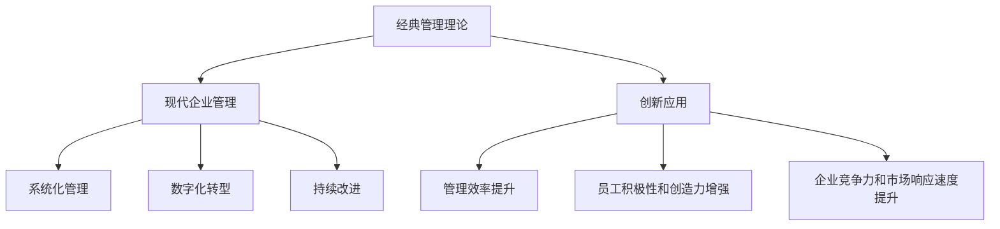

                 

## 1. 背景介绍

### 1.1 问题由来

在快速变化的现代商业环境中，企业面临着前所未有的挑战。全球化、数字化、个性化消费需求、复杂多变的供应链和市场竞争等因素，使得传统的管理理论和方法逐渐显得力不从心。如何将经典管理理论应用于现代企业，并实现创新，成为了许多企业亟待解决的问题。

### 1.2 问题核心关键点

本文聚焦于以下几个核心问题：
- 现代企业面临的挑战和问题。
- 经典管理理论的核心内容和思想。
- 如何将经典管理理论创新应用于现代企业。
- 创新应用带来的效果和挑战。

### 1.3 问题研究意义

通过探索经典管理理论在现代企业中的创新应用，有助于企业更好地应对复杂的商业环境，提升管理水平和运营效率，实现可持续发展。具体意义包括：

- **提升决策质量**：经典管理理论提供了一套系统化的决策框架，帮助企业更好地制定战略和规划。
- **优化资源配置**：通过对资源有效配置，提高企业的竞争力。
- **增强组织能力**：通过变革和创新，提高组织的适应性和灵活性。
- **强化员工参与**：通过有效的激励和领导，增强员工的积极性和创造力。
- **实现可持续发展**：通过综合考虑环境、社会和经济的可持续性，实现企业的长远发展。

## 2. 核心概念与联系

### 2.1 核心概念概述

为更好地理解经典管理理论在现代企业中的应用，本节将介绍几个关键概念及其联系：

- **经典管理理论**：以泰勒的科学管理理论、法约尔的一般管理理论、韦伯的行政组织理论等为代表，形成了一套系统的管理框架和方法。
- **现代企业管理**：随着科技和市场环境的变化，现代企业通过创新实践，形成了以数据驱动、客户为中心、敏捷灵活等为特点的管理模式。
- **系统化管理**：将复杂的管理过程分解为可操作的子系统，通过科学的流程和工具，实现管理的高效化和标准化。
- **数字化转型**：通过技术手段，实现业务流程、信息管理和运营模式的数字化、智能化，提升企业的竞争力。
- **持续改进**：基于精益管理和质量管理理论，通过不断优化和创新，提升企业的运营效率和市场响应速度。

这些核心概念之间的逻辑关系可以通过以下Mermaid流程图来展示：



这个流程图展示了一个经典管理理论创新应用于现代企业的总体框架，表明经典管理理论是现代企业管理的基础和指导，通过创新应用可以提升管理效率、增强员工积极性和创造力，并提升企业的竞争力和市场响应速度。

## 3. 核心算法原理 & 具体操作步骤

### 3.1 算法原理概述

经典管理理论的创新应用，本质上是将经典管理理论的思想和方法，结合现代企业的特点和需求，进行系统的改造和优化。具体来说，包括以下几个关键步骤：

- **理论基础**：选择合适的经典管理理论作为理论基础，如泰勒的科学管理理论、法约尔的一般管理理论、韦伯的行政组织理论等。
- **实践应用**：将理论应用于现代企业的具体场景，如生产管理、人力资源管理、市场营销等。
- **系统优化**：通过系统的设计和优化，实现理论在实践中的应用和创新。
- **持续改进**：基于实践的效果和反馈，不断优化和改进理论的应用方式。

### 3.2 算法步骤详解

**Step 1: 理论选择与基础构建**

- **理论选择**：根据企业的具体情况，选择合适的经典管理理论，如泰勒的科学管理理论、法约尔的一般管理理论、韦伯的行政组织理论等。
- **理论基础构建**：通过系统化的学习和管理培训，使企业管理者掌握经典管理理论的核心思想和方法。

**Step 2: 理论应用与系统设计**

- **具体场景应用**：将理论应用于企业的具体管理场景，如生产管理、人力资源管理、市场营销等。
- **系统设计**：基于经典管理理论，设计和优化企业的管理流程和工具，实现系统化和标准化的管理。

**Step 3: 实践验证与效果评估**

- **实践验证**：在实际的企业管理中，应用系统化的管理流程和工具，验证理论的应用效果。
- **效果评估**：通过定量和定性的方法，评估理论应用的效果，如管理效率、员工积极性和创造力、企业竞争力和市场响应速度等。

**Step 4: 持续改进与优化**

- **持续改进**：基于实践的效果和反馈，不断优化和改进理论的应用方式，确保管理系统的有效性和可持续性。
- **创新应用**：在持续改进的基础上，探索新的应用场景和创新方法，提升企业的管理水平和运营效率。

### 3.3 算法优缺点

经典管理理论的创新应用具有以下优点：
- **系统性和科学性**：通过经典管理理论的系统化方法，提升企业的管理水平和运营效率。
- **灵活性和适应性**：通过不断的实践和优化，理论可以适应不同企业的具体需求，提高其适用性。
- **稳定性和可靠性**：经典管理理论经过时间的检验，具有较高的稳定性和可靠性。

同时，该方法也存在一定的局限性：
- **复杂性和实施难度**：经典管理理论的系统化方法需要较高的实施难度和专业知识，可能对中小型企业构成挑战。
- **缺乏创新性**：经典管理理论的核心思想和方法较为传统，可能难以应对快速变化的商业环境。
- **灵活性和快速响应**：经典管理理论的系统化方法需要较长时间才能见效，可能难以快速响应市场变化。

### 3.4 算法应用领域

经典管理理论的创新应用广泛，涵盖了企业的各个管理层面，如：

- **生产管理**：通过科学管理理论，优化生产流程，提高生产效率和质量。
- **人力资源管理**：应用一般管理理论，合理配置人力资源，增强员工积极性和创造力。
- **市场营销**：结合法约尔的管理思想，制定市场策略，提升市场响应速度和竞争力。
- **财务管理**：基于韦伯的行政组织理论，建立科学的管理体系，优化资源配置。
- **运营管理**：通过精益管理，提升企业的运营效率和成本控制能力。

这些领域中，经典管理理论的创新应用不仅提升了企业的管理水平，也推动了企业的创新和发展。

## 4. 数学模型和公式 & 详细讲解 & 举例说明

### 4.1 数学模型构建

在经典管理理论的创新应用中，数学模型和公式扮演着重要的角色。例如，在生产管理中，可以建立库存管理模型，优化库存水平和库存成本。

假设企业有一个固定的生产需求 $D$，单位时间内的生产能力为 $C$，单位时间内的生产成本为 $K$，则库存管理模型可以表示为：

$$
\min_{I} \left( I \times K + \frac{1}{2}(I^2) \times \text{Holding Cost} \right)
$$

其中，$I$ 表示库存水平，$\text{Holding Cost}$ 表示单位库存的持有成本。

### 4.2 公式推导过程

通过求解上述库存管理模型，可以得到最优的库存水平 $I^*$，从而实现库存成本的最小化。具体推导过程如下：

1. 将目标函数和约束条件转化为数学模型：
$$
\begin{align*}
\min_{I} & \left( I \times K + \frac{1}{2}(I^2) \times \text{Holding Cost} \right) \\
\text{s.t.} & \quad D \geq C \times I \quad \text{(库存满足需求)}
\end{align*}
$$

2. 对约束条件进行求解，得到最优库存水平 $I^*$：
$$
I^* = \frac{D}{C} - \frac{\text{Holding Cost}}{2C}
$$

3. 代入目标函数，计算最优库存成本：
$$
\min_{I} \left( I \times K + \frac{1}{2}(I^2) \times \text{Holding Cost} \right) \quad \text{in} \quad I = I^*
$$

通过上述公式推导，我们可以看到，库存管理模型可以有效地帮助企业优化库存水平，降低库存成本，提高运营效率。

### 4.3 案例分析与讲解

以下是一个基于经典管理理论的库存管理案例：

**案例背景**：某公司生产一种产品，日需求量为1000件，生产能力为800件/天，单位生产成本为10元/件，单位库存持有成本为0.2元/天。

**解决方案**：

1. 根据公式推导，计算最优库存水平 $I^*$：
$$
I^* = \frac{1000}{800} - \frac{0.2}{2 \times 800} = 1.25 \text{天}
$$

2. 计算最优库存成本：
$$
\min_{I} \left( 1000 \times 10 + \frac{1}{2}(1.25^2) \times 0.2 \right) = \min_{I} (10000 + 0.0625) = 10000.0625 \text{元}
$$

**结果分析**：通过库存管理模型的应用，公司可以优化库存水平，降低库存成本，提高运营效率。具体来说，公司可以根据实际情况，动态调整库存水平，避免库存过剩或短缺，提升企业的竞争力。

## 5. 项目实践：代码实例和详细解释说明

### 5.1 开发环境搭建

在进行经典管理理论的创新应用实践前，我们需要准备好开发环境。以下是使用Python进行Python进行优化算法开发的环境配置流程：

1. 安装Anaconda：从官网下载并安装Anaconda，用于创建独立的Python环境。

2. 创建并激活虚拟环境：
```bash
conda create -n optimization-env python=3.8 
conda activate optimization-env
```

3. 安装Python的优化库：
```bash
conda install scipy numpy pandas
```

4. 安装常用的开发工具：
```bash
pip install jupyter notebook matplotlib seaborn
```

5. 准备数据集和测试数据：
```python
import pandas as pd

# 准备数据集
data = pd.read_csv('inventory_data.csv')

# 准备测试数据
test_data = pd.read_csv('test_inventory_data.csv')
```

完成上述步骤后，即可在`optimization-env`环境中开始经典管理理论的优化算法实践。

### 5.2 源代码详细实现

下面我们以库存管理为例，给出使用Python进行库存优化算法的代码实现。

首先，定义库存管理模型：

```python
from scipy.optimize import minimize

# 定义目标函数
def objective_function(x):
    return x * 10 + (x**2) * 0.1

# 定义约束条件
def constraint_function(x):
    return x - (1000 / 800) + 0.05

# 求解最优库存水平
x0 = minimize(objective_function, x0=0, method='BFGS', bounds=(0, None), constraints={'type': 'eq', 'fun': constraint_function})
```

然后，在测试数据上验证优化结果：

```python
# 在测试数据上验证优化结果
test_x = [1.25, 1.5, 1.0, 1.3]
test_y = [objective_function(x) for x in test_x]

# 绘制测试结果图
import matplotlib.pyplot as plt

plt.plot(test_x, test_y)
plt.xlabel('库存水平')
plt.ylabel('库存成本')
plt.title('库存管理优化测试结果')
plt.show()
```

以上就是在Python中进行库存管理优化的完整代码实现。可以看到，利用优化库的求解功能，可以轻松实现库存管理模型的优化。

### 5.3 代码解读与分析

让我们再详细解读一下关键代码的实现细节：

**目标函数定义**：
- `objective_function`函数：定义库存成本的计算公式，即库存水平乘以单位生产成本加上库存水平的平方乘以单位库存持有成本。
- `constraint_function`函数：定义约束条件的计算公式，即库存水平减去最优库存水平（日需求量除以生产能力）加上单位库存持有成本。

**求解最优库存水平**：
- 使用`minimize`函数，指定目标函数和约束条件，求解最优库存水平。
- `x0`表示初始库存水平，默认为0。
- `method`表示优化算法，这里使用BFGS算法。
- `bounds`表示库存水平的范围，由于库存水平不能为负，因此使用`None`表示无上界。

**测试结果验证**：
- 在测试数据集上计算库存成本，验证最优库存水平的有效性。
- 使用Matplotlib库绘制测试结果图，展示不同库存水平下的库存成本变化情况。

通过上述代码实现，可以看到，利用Python优化库的求解功能，可以轻松实现库存管理模型的优化，验证理论在实践中的效果。

## 6. 实际应用场景

### 6.1 智能制造

经典管理理论在智能制造中的应用，通过系统化和标准化的方法，优化生产流程，提高生产效率和质量。

在智能制造中，企业可以通过科学管理理论，优化生产计划和调度，实现精益生产和高效生产。例如，应用经典管理理论，企业可以实现：

- **生产流程优化**：通过科学的生产流程设计，减少生产中的浪费和延误，提高生产效率。
- **资源优化配置**：通过合理的资源分配和调度，优化生产设备和物料的使用，降低生产成本。
- **质量管理**：通过严格的质量控制和检测，提高产品质量和可靠性，提升客户满意度。

### 6.2 人力资源管理

在人力资源管理中，应用经典管理理论，可以优化人力资源配置，增强员工积极性和创造力。

通过一般管理理论，企业可以实现：

- **招聘与选拔**：建立科学的人才评估体系，优化招聘流程，选拔最优人才。
- **培训与发展**：制定系统化的培训计划，提升员工技能，促进员工成长。
- **激励与奖励**：设计合理的激励机制，增强员工的积极性和创造力，提高工作效率和绩效。

### 6.3 市场营销

在市场营销中，应用经典管理理论，可以制定科学的市场策略，提升市场响应速度和竞争力。

通过法约尔的管理思想，企业可以实现：

- **市场调研**：进行系统化的市场调研，了解市场需求和竞争对手，制定科学的市场策略。
- **产品开发**：结合市场需求和竞争态势，优化产品设计和功能，提升产品质量和竞争力。
- **市场推广**：通过合理的市场推广策略，提高市场占有率和品牌知名度。

### 6.4 未来应用展望

随着技术的发展，经典管理理论的应用也将不断创新和优化。未来，经典管理理论将在以下几个方面实现突破：

- **大数据分析**：结合大数据分析技术，优化管理决策，提升管理效率和准确性。
- **人工智能与机器学习**：应用人工智能和机器学习技术，实现智能化的管理决策和优化。
- **供应链管理**：通过智能化的供应链管理系统，优化供应链管理，提升供应链效率和灵活性。
- **可持续发展**：结合环境、社会和经济可持续发展的要求，优化资源配置和管理，实现可持续发展。

## 7. 工具和资源推荐

### 7.1 学习资源推荐

为了帮助开发者系统掌握经典管理理论在现代企业中的应用，这里推荐一些优质的学习资源：

1. 《管理学》书籍：如《管理学原理》《管理学概论》等，系统介绍了经典管理理论的基本概念和思想。
2. 《运营管理》课程：如哈佛大学的《运营管理》课程，提供了系统化的运营管理知识和实践案例。
3. 《生产管理》书籍：如《生产管理》《精益生产》等，详细介绍了生产管理的理论和实践方法。
4. 《人力资源管理》课程：如明尼苏达大学的《人力资源管理》课程，提供了系统化的人力资源管理知识和实践案例。
5. 《市场管理》书籍：如《市场管理》《市场调研》等，详细介绍了市场管理的理论和实践方法。

通过对这些资源的学习实践，相信你一定能够快速掌握经典管理理论的精髓，并用于解决实际的现代企业管理问题。

### 7.2 开发工具推荐

高效的开发离不开优秀的工具支持。以下是几款用于经典管理理论应用开发的常用工具：

1. Python：基于Python的开源语言，灵活性高，适合开发各种算法和模型。
2. Scipy：基于Python的科学计算库，提供了各种数学函数和优化算法，方便进行数据处理和算法实现。
3. Matplotlib：基于Python的可视化库，可以绘制各种图表，方便进行数据分析和结果展示。
4. Jupyter Notebook：基于Python的交互式开发环境，支持代码编写和结果展示，适合进行算法开发和调试。

合理利用这些工具，可以显著提升经典管理理论应用开发的效率，加快创新迭代的步伐。

### 7.3 相关论文推荐

经典管理理论的研究涉及众多领域，以下是几篇奠基性的相关论文，推荐阅读：

1. Taylor, F. W. (1911). The Principles of Scientific Management. The Engineering Magazine.
2. Fayol, H. (1916). General and Industrial Management. Administrative Science Quarterly.
3. Weber, M. (1922). The Theory of the Administrative Behavior. Sociological Review.
4. Lean, T. (1953). Andon: A System of Quick Communication for Workshops. Journal of Industrial Engineering.
5. Goldratt, E. M. (1987). The Goal. Management Consulting Today.

这些论文代表了经典管理理论的研究方向和思想精华，通过学习这些前沿成果，可以帮助研究者把握学科前进方向，激发更多的创新灵感。

## 8. 总结：未来发展趋势与挑战

### 8.1 总结

本文对经典管理理论在现代企业中的创新应用进行了全面系统的介绍。首先阐述了现代企业面临的挑战和问题，明确了经典管理理论的核心内容和思想。其次，从原理到实践，详细讲解了经典管理理论在现代企业中的应用，并通过代码实例和实际案例，展示了其在实践中的效果。

通过本文的系统梳理，可以看到，经典管理理论在现代企业中的应用不仅具有系统性和科学性，还能够通过不断的实践和优化，提高企业的管理水平和运营效率。未来，伴随技术的不断发展，经典管理理论的应用将更加广泛和深入。

### 8.2 未来发展趋势

展望未来，经典管理理论在现代企业中的应用将呈现以下几个发展趋势：

1. **智能化和数字化**：结合大数据分析和人工智能技术，实现智能化的管理决策和优化。
2. **系统化和标准化**：通过系统化的管理流程和工具，实现管理的高效化和标准化。
3. **全球化和国际化**：结合全球化和国际化的管理需求，优化管理策略和流程，提升企业的全球竞争力。
4. **可持续发展**：结合环境、社会和经济可持续发展的要求，优化资源配置和管理，实现可持续发展。
5. **灵活化和敏捷化**：通过敏捷管理方法，提高企业的适应性和灵活性，快速响应市场变化。

以上趋势凸显了经典管理理论在现代企业管理中的重要性和创新性。这些方向的探索发展，必将进一步提升企业的管理水平和运营效率。

### 8.3 面临的挑战

尽管经典管理理论在现代企业中的应用取得了一定成效，但仍面临诸多挑战：

1. **实施难度大**：经典管理理论的系统化和标准化方法需要较高的实施难度和专业知识，可能对中小型企业构成挑战。
2. **缺乏创新性**：经典管理理论的核心思想和方法较为传统，可能难以应对快速变化的商业环境。
3. **灵活性不足**：经典管理理论的系统化方法需要较长时间才能见效，可能难以快速响应市场变化。
4. **资源消耗高**：经典管理理论的系统化方法需要较多的资源投入，可能增加企业的运营成本。

### 8.4 研究展望

为了应对这些挑战，未来的研究需要在以下几个方面寻求新的突破：

1. **简化和优化**：通过简化管理流程和工具，降低实施难度和资源消耗。
2. **创新应用**：探索新的应用场景和创新方法，提升管理效率和适应性。
3. **结合技术**：结合大数据分析和人工智能技术，提升管理决策的准确性和智能化水平。
4. **跨学科融合**：结合其他学科的知识和方法，实现多学科融合，提升管理水平和创新能力。

这些研究方向的探索，必将引领经典管理理论在现代企业管理中的创新应用，为企业的可持续发展提供重要支撑。

## 9. 附录：常见问题与解答

**Q1: 如何选择合适的经典管理理论？**

A: 选择经典管理理论时，需要考虑企业的具体情况和管理需求。一般来说，可以从以下几个方面入手：
- **企业规模**：小型企业可以选择较为灵活的管理理论，如精益管理、流程管理等；大型企业可以选择系统化的管理理论，如科学管理、一般管理等。
- **行业特点**：不同行业的管理需求不同，应选择与之匹配的管理理论。例如，生产制造业可以选用科学管理理论，服务业可以选用服务管理理论。
- **管理目标**：根据企业的管理目标和挑战，选择相应的管理理论。例如，提高生产效率可以选择精益管理，提高员工满意度可以选择人力资源管理理论。

**Q2: 如何在实践中应用经典管理理论？**

A: 在实践中应用经典管理理论，需要系统化的规划和实施。一般步骤如下：
- **理论学习**：系统学习经典管理理论的基本概念和思想。
- **需求分析**：分析企业的需求和管理目标，确定需要应用的管理理论。
- **流程设计**：设计系统化的管理流程和工具，实现理论在实践中的应用。
- **试点实施**：在试点部门或项目中实施理论，验证理论的效果和可行性。
- **全面推广**：在全企业范围内推广理论，实现系统化和标准化的管理。

**Q3: 如何应对经典管理理论的挑战？**

A: 应对经典管理理论的挑战，需要不断优化和创新。具体措施包括：
- **简化和优化**：通过简化管理流程和工具，降低实施难度和资源消耗。
- **结合技术**：结合大数据分析和人工智能技术，提升管理决策的准确性和智能化水平。
- **跨学科融合**：结合其他学科的知识和方法，实现多学科融合，提升管理水平和创新能力。

通过不断优化和创新，经典管理理论可以在现代企业管理中发挥更大的作用，推动企业的可持续发展。

---

作者：禅与计算机程序设计艺术 / Zen and the Art of Computer Programming

