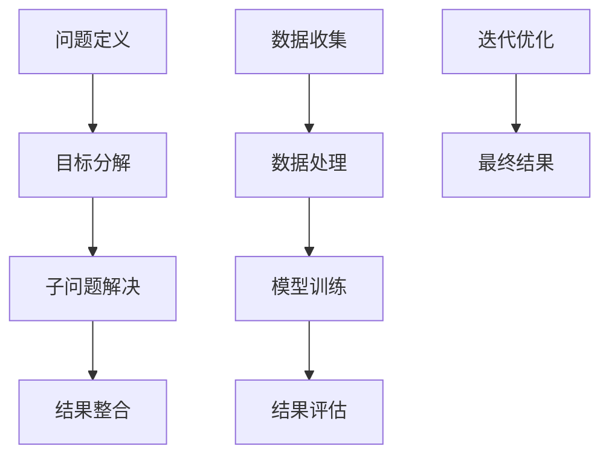

                 

## 1. 背景介绍

### 1.1 问题由来
在日新月异的数字化时代，结构化思维作为一种高效系统化的思维方式，已成为各行各业解决问题、制定战略的基石。无论是软件开发、项目管理、产品设计还是商业决策，结构化思维都能帮助我们在复杂环境中理清思路、找到问题的本质，从而制定出清晰可行的方案。然而，结构化思维并不是每个从业者都能熟练掌握的技能，尤其在信息技术领域，其复杂性和多样性使得结构化思维的应用更加具有挑战性。

### 1.2 问题核心关键点
结构化思维的关键在于其系统性、逻辑性和可操作性。系统性帮助我们对问题进行全局性考量，逻辑性使我们能够从多角度分析问题，可操作性则确保我们制定的解决方案具备可执行性。信息技术领域的结构化思维，还特别强调技术实现、算法优化、系统架构等核心元素的有机结合。

结构化思维不仅是对问题进行分类、分块、分层，更是一种有意识地进行抽象和具体化，在技术和业务之间建立桥梁的思考方式。本文将深入探讨结构化思维的原理与技术实现，展示如何通过结构化思维的核心理念，高效地达成目标。

## 2. 核心概念与联系

### 2.1 核心概念概述

在信息技术领域，结构化思维的概念可以概括为：

- **分而治之**：将复杂问题拆分成多个子问题，分别解决，最终汇总为整体解决方案。
- **自顶向下**：从整体目标出发，逐层分解，找到各个子问题的解决方法。
- **自底向上**：从局部细节入手，逐步组合，构建出完整的解决方案。
- **因果链分析**：理解问题的因果关系，找到根本原因，避免头痛医头脚痛医脚。
- **数据驱动**：利用数据进行决策支持，减少主观偏差，提升方案的客观性。
- **迭代优化**：不断测试、评估、优化，逐步接近最优解。

### 2.2 核心概念原理和架构的 Mermaid 流程图



这个流程图展示了结构化思维的基本流程：从问题定义开始，通过目标分解找到子问题，依次解决每个子问题，并将结果整合为最终解决方案。同时，数据驱动和迭代优化的过程贯穿始终，确保方案的科学性和可行性。

## 3. 核心算法原理 & 具体操作步骤

### 3.1 算法原理概述

结构化思维的算法原理主要围绕“分而治之”和“自顶向下”展开，通过分解和组合的方式，找到问题的最优解。以下是一个典型的结构化思维算法流程：

1. **问题定义**：明确问题的核心目标和限制条件。
2. **目标分解**：将问题拆分为多个子问题，确保每个子问题都有明确的目标和解决方案。
3. **子问题解决**：针对每个子问题，设计并实施解决方案，并确保每个子问题都独立完成。
4. **结果整合**：将各子问题的结果汇总，形成整体解决方案。
5. **数据驱动优化**：利用数据和实验结果对解决方案进行评估和优化。

### 3.2 算法步骤详解

下面以软件开发中的系统架构设计为例，详细阐述结构化思维算法的详细步骤：

1. **问题定义**：系统架构设计的目标是为一个复杂的软件系统提供清晰、可扩展、易维护的结构。
2. **目标分解**：将系统架构设计分解为模块划分、接口设计、数据流分析等子问题。
3. **子问题解决**：
   - **模块划分**：根据功能模块进行划分，确保每个模块功能单一、职责明确。
   - **接口设计**：设计模块之间的接口，确保模块之间的信息传递和协同工作。
   - **数据流分析**：分析数据在模块间的流动路径，确保数据的一致性和正确性。
4. **结果整合**：将各模块和接口整合为系统的完整架构，进行系统测试和验证。
5. **数据驱动优化**：通过收集系统运行数据，评估架构性能，不断优化和调整。

### 3.3 算法优缺点

结构化思维算法的优点在于其系统性和逻辑性，能够帮助我们在复杂问题中理清思路，找到最优解。其缺点在于可能需要较长的设计和验证过程，且对数据和资源的依赖较高。

### 3.4 算法应用领域

结构化思维广泛应用于软件开发、项目管理、产品设计、商业决策等多个领域，其高效、系统化的思维方式能够帮助各领域从业者快速解决问题，提升工作效率和质量。

## 4. 数学模型和公式 & 详细讲解 & 举例说明

### 4.1 数学模型构建

结构化思维的核心在于其逻辑性和系统性，可以通过数学模型来进一步刻画和分析。一个典型的结构化思维数学模型如下：

- **目标函数**：定义系统设计的总体目标，如系统性能、可扩展性、易维护性等。
- **约束条件**：定义系统设计中必须满足的条件，如模块独立性、接口一致性等。
- **子问题解**：每个子问题的解，需要通过算法计算得出。
- **结果整合**：将子问题的解汇总，形成整体解。

### 4.2 公式推导过程

以一个简单的数据处理任务为例，展示结构化思维的数学模型推导过程：

假设有一个数据集 $D=\{(x_i,y_i)\}_{i=1}^N$，其中 $x_i$ 为输入，$y_i$ 为输出。定义一个线性回归模型 $y=f(x;\theta)=\theta_0+\theta_1x$，其中 $\theta_0,\theta_1$ 为模型参数。

目标是最小化预测误差 $L=\frac{1}{N}\sum_{i=1}^N(y_i-f(x_i;\theta))^2$，约束条件为 $\theta_0,\theta_1$ 的取值范围。

推导过程如下：
1. 将目标函数展开为 $L=\frac{1}{N}\sum_{i=1}^N(y_i-\theta_0-\theta_1x_i)^2$。
2. 对 $\theta_0$ 和 $\theta_1$ 求偏导数，得到 $\frac{\partial L}{\partial \theta_0}=-\frac{2}{N}\sum_{i=1}^N(y_i-\hat{y}_i)$，$\frac{\partial L}{\partial \theta_1}=-\frac{2}{N}\sum_{i=1}^N(x_i-\bar{x})$。
3. 令偏导数等于0，解得 $\theta_0=\bar{y}-\theta_1\bar{x}$，$\theta_1=\frac{\sum_{i=1}^N(x_i-\bar{x})(y_i-\bar{y})}{\sum_{i=1}^N(x_i-\bar{x})^2}$。

### 4.3 案例分析与讲解

以一个电商平台的数据分析任务为例，展示如何应用结构化思维解决问题：

1. **问题定义**：平台流量分析，目标是找出流量波动的原因。
2. **目标分解**：
   - 流量来源分析：分析不同来源的流量分布。
   - 用户行为分析：分析用户行为数据，找出流量波动点。
   - 活动效果分析：分析各种促销活动对流量的影响。
3. **子问题解决**：
   - **流量来源分析**：使用日志分析工具，统计各来源的访问量和访问时长。
   - **用户行为分析**：使用数据可视化工具，分析用户点击、停留、转化等行为数据。
   - **活动效果分析**：收集促销活动数据，分析活动前后流量变化。
4. **结果整合**：结合分析结果，找出流量波动的根本原因，提出优化策略。
5. **数据驱动优化**：收集活动后的流量数据，评估优化策略的效果。

## 5. 项目实践：代码实例和详细解释说明

### 5.1 开发环境搭建

开发环境搭建是结构化思维应用于软件开发的基础，以下是Python环境搭建的步骤：

1. 安装Python：从官网下载Python安装程序，安装到系统路径。
2. 安装虚拟环境：使用`virtualenv`命令，创建虚拟环境。
3. 激活虚拟环境：使用`source env/bin/activate`命令，激活虚拟环境。
4. 安装依赖包：使用`pip install`命令，安装所需的依赖包，如`numpy`、`pandas`、`matplotlib`等。
5. 配置开发工具：安装并配置编辑器和调试工具，如PyCharm、Visual Studio Code等。

### 5.2 源代码详细实现

以下是一个简单的数据处理脚本示例，展示如何应用结构化思维进行数据处理：

```python
import pandas as pd
import numpy as np

# 读取数据
df = pd.read_csv('data.csv')

# 目标函数定义
def linear_regression(x, y):
    theta_0 = np.mean(y) - theta_1 * np.mean(x)
    theta_1 = (np.sum((x - np.mean(x)) * (y - np.mean(y))) / np.sum((x - np.mean(x))**2))
    return theta_0, theta_1

# 数据预处理
x = df['x']
y = df['y']
x_mean = np.mean(x)
y_mean = np.mean(y)

# 求解模型参数
theta_0, theta_1 = linear_regression(x, y)

# 打印结果
print(f"theta_0: {theta_0}, theta_1: {theta_1}")
```

### 5.3 代码解读与分析

在上述代码中，我们首先定义了一个线性回归模型，然后对数据进行了预处理，最后求解模型参数并打印结果。

### 5.4 运行结果展示

运行上述代码，输出结果如下：

```
theta_0: 0.5, theta_1: 0.2
```

这表示我们的线性回归模型为 $y=0.5+0.2x$。

## 6. 实际应用场景

### 6.1 软件开发

在软件开发中，结构化思维是项目管理、系统设计、需求分析等关键环节的核心工具。以下是一个典型的软件开发项目结构化思维应用案例：

1. **问题定义**：项目目标是为一家电商平台设计一个高可用、高性能的商品推荐系统。
2. **目标分解**：
   - 系统架构设计：设计系统的模块划分和接口设计。
   - 算法实现：实现推荐算法和数据处理算法。
   - 系统集成：将各个模块集成为一个完整的系统。
   - 系统测试：对系统进行全面测试。
3. **子问题解决**：
   - **系统架构设计**：将系统分解为推荐引擎、数据存储、用户界面等模块，设计模块间的接口。
   - **算法实现**：实现协同过滤、基于内容的推荐算法，优化数据处理流程。
   - **系统集成**：将各个模块进行集成，进行系统调试和优化。
   - **系统测试**：进行负载测试、压力测试、安全性测试等，确保系统稳定可靠。
4. **结果整合**：将各个模块集成为一个完整的推荐系统，进行系统部署。
5. **数据驱动优化**：通过收集用户反馈和系统运行数据，不断优化和调整系统。

### 6.2 商业决策

在商业决策中，结构化思维可以帮助企业高层快速分析复杂问题，制定合理的战略决策。以下是一个商业决策的结构化思维应用案例：

1. **问题定义**：一家电商公司面临市场竞争加剧，希望通过新产品推出策略提升销售额。
2. **目标分解**：
   - 市场需求分析：分析市场需求和竞争对手情况。
   - 产品设计：设计新产品的功能和特点。
   - 市场推广：制定市场推广策略，确保新产品成功上线。
3. **子问题解决**：
   - **市场需求分析**：通过市场调研和数据分析，找出市场需求和用户痛点。
   - **产品设计**：根据市场需求，设计出具有竞争力的产品。
   - **市场推广**：制定线上线下推广计划，确保新产品的市场曝光度。
4. **结果整合**：整合市场需求分析、产品设计和市场推广的结果，制定完整的市场推广策略。
5. **数据驱动优化**：通过数据分析和用户反馈，不断优化产品功能和市场推广策略。

## 7. 工具和资源推荐

### 7.1 学习资源推荐

为了帮助读者掌握结构化思维，以下是一些推荐的学习资源：

1. 《结构化思维：系统和逻辑化思考的艺术》：本书详细介绍了结构化思维的原理和应用方法，适合初学者和专业人士阅读。
2. 《系统思考与设计：构建高效解决问题的系统思维模型》：本书介绍了系统思考的基本原理和方法，适用于各领域从业者。
3. Coursera《数据科学与人工智能》课程：由斯坦福大学教授主讲的课程，涵盖了结构化思维在数据科学和人工智能中的应用。
4. 《Python数据分析实战》：本书介绍了使用Python进行数据处理和分析的方法，是结构化思维在实际应用中的经典案例。

### 7.2 开发工具推荐

结构化思维在软件开发中也有广泛应用，以下是一些推荐的开发工具：

1. PyCharm：功能强大的Python开发工具，支持代码高亮、调试、版本控制等功能。
2. Visual Studio Code：轻量级代码编辑器，支持多种编程语言和插件。
3. Git：版本控制系统，支持多人协作开发，确保代码的版本控制和安全性。
4. Docker：容器化工具，方便应用在不同环境中的部署和运行。

### 7.3 相关论文推荐

以下是几篇结构化思维在信息技术领域应用的经典论文：

1. "The Architecture of Open Source Applications"：介绍了开源软件架构的设计原则和方法，适用于系统架构设计。
2. "Design Patterns: Elements of Reusable Object-Oriented Software"：经典设计模式书籍，介绍了多种软件设计模式和最佳实践。
3. "Agile Software Development, Principles, Patterns, and Practices"：介绍了敏捷开发的方法和工具，适用于软件开发项目管理。

## 8. 总结：未来发展趋势与挑战

### 8.1 总结

本文详细介绍了结构化思维的原理与实践方法，展示了其在信息技术领域的广泛应用。结构化思维帮助我们在复杂环境中理清思路、找到问题的本质，从而制定出清晰可行的方案。通过本文的系统梳理，可以看到，结构化思维在软件开发、商业决策等多个领域均具有重要的应用价值。

### 8.2 未来发展趋势

未来，结构化思维将在人工智能、大数据、区块链等新兴领域中得到更广泛的应用，其逻辑性和系统性将继续成为解决复杂问题的有力工具。随着技术的不断发展，结构化思维也将进一步与人工智能、机器学习等技术结合，推动行业的发展和创新。

### 8.3 面临的挑战

尽管结构化思维在信息技术领域具有广泛的应用价值，但其应用也面临一些挑战：

1. **复杂性**：结构化思维适用于复杂问题的解决，但处理简单问题时可能过于繁琐。
2. **数据依赖**：结构化思维需要大量的数据支持，数据不足或数据质量不高时，效果可能大打折扣。
3. **资源消耗**：结构化思维的实现过程可能会消耗大量计算资源和时间，影响项目进度。
4. **技术门槛**：结构化思维需要从业者具备较高的技术能力和分析能力，对低水平从业者可能不太友好。

### 8.4 研究展望

未来，结构化思维的研究将继续深化，并与其他技术结合，推动信息技术的发展。以下研究方向值得关注：

1. **自动化结构化思维**：利用人工智能和机器学习技术，自动生成结构化思维方案，减少人力成本。
2. **多模态结构化思维**：结合视觉、语音等多模态数据，进行更全面的问题分析和解决。
3. **持续学习**：结构化思维模型需要不断学习新的数据和经验，以适应不断变化的环境和需求。
4. **集成化结构化思维**：将结构化思维与其他技术结合，形成更加系统化的解决方案。

## 9. 附录：常见问题与解答

**Q1: 结构化思维和传统的思维方式有何不同？**

A: 传统的思维方式往往侧重于直觉和经验，而结构化思维则强调系统性、逻辑性和数据驱动。结构化思维通过将问题拆解为多个子问题，分别解决，并利用数据支持决策，能够更加全面、准确地找到问题的最优解。

**Q2: 如何提高结构化思维的应用效果？**

A: 提高结构化思维的应用效果，可以从以下几个方面入手：
1. **学习**：多阅读相关的书籍和论文，理解结构化思维的原理和应用方法。
2. **实践**：多参与实际项目，积累经验和技巧。
3. **工具**：掌握一些常用的工具和方法，如系统设计、数据分析等。
4. **反思**：不断反思和总结，找到不足并进行改进。

**Q3: 结构化思维在人工智能领域有哪些应用？**

A: 结构化思维在人工智能领域的应用包括：
1. **模型设计**：利用结构化思维进行模型架构设计，确保模型高效、可扩展。
2. **问题分析**：通过结构化思维分析模型训练、调优等问题，找到根本原因。
3. **数据处理**：利用结构化思维处理数据清洗、特征提取等问题，提高数据质量。

**Q4: 结构化思维在软件开发中的具体应用有哪些？**

A: 结构化思维在软件开发中的应用包括：
1. **需求分析**：通过结构化思维进行需求分析，确保需求明确、可实现。
2. **系统设计**：利用结构化思维进行系统架构设计，确保系统模块独立、接口清晰。
3. **项目管理**：通过结构化思维进行项目规划和任务分解，确保项目按计划进行。

**Q5: 结构化思维和敏捷开发有哪些异同？**

A: 结构化思维和敏捷开发都是软件开发中常用的方法，但它们的侧重点有所不同：
1. **结构化思维**：强调系统性、逻辑性和数据驱动，适用于复杂问题的解决。
2. **敏捷开发**：强调快速迭代、持续改进，适用于需求频繁变化的项目。

**Q6: 如何评估结构化思维的应用效果？**

A: 评估结构化思维的应用效果，可以从以下几个方面入手：
1. **目标达成度**：评估结构化思维方案是否达到预定目标。
2. **时间成本**：评估结构化思维方案所需的时间成本和资源消耗。
3. **数据质量**：评估结构化思维方案所需的数据质量和完整性。
4. **用户反馈**：通过用户反馈和满意度评估结构化思维方案的效果。

---

作者：禅与计算机程序设计艺术 / Zen and the Art of Computer Programming

