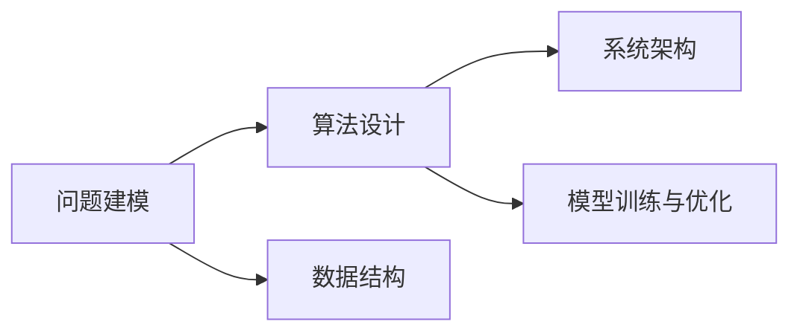

                 

## 1. 背景介绍

### 1.1 问题由来

在信息技术领域，尤其是在软件开发和人工智能应用中，结构化思维（Structured Thinking）是一种关键的思维能力。它不仅能够帮助我们更好地理解问题、解决问题，还能在复杂的系统和任务中保持清晰的思路。然而，在实际应用中，许多人依然面临着从混沌到清晰的挑战。这一现象普遍存在于软件开发、数据分析、人工智能模型训练和优化等多个领域。本文旨在深入探讨结构化思维的原理与实践，帮助读者掌握从混沌到清晰的结构化思维方法，提升技术决策和系统开发的效率与质量。

### 1.2 问题核心关键点

结构化思维的核心在于通过系统的方法将复杂问题分解为可管理的部分，然后逐一解决。它涉及数据结构、算法设计、系统架构等多个层面，是信息时代技术工作者必备的核心能力。

结构化思维的主要关注点包括：

- 如何对问题进行逻辑建模
- 如何设计有效的算法和数据结构
- 如何在系统设计中实现模块化和可扩展性
- 如何优化模型的训练与推理流程
- 如何在复杂环境中保持高效的工作节奏

这些问题在信息技术的多个子领域中都有体现，例如软件开发中的面向对象设计、数据库设计中的规范化、人工智能中的模型训练与优化等。

### 1.3 问题研究意义

掌握结构化思维不仅能够提升个人在技术领域的竞争力，还能在团队合作中发挥更大的作用。它能够帮助团队更高效地协同工作，共同解决复杂问题。特别是在人工智能和机器学习领域，结构化思维是模型设计、训练与优化过程中不可或缺的关键能力。结构化思维的提升，不仅能够加速技术创新，还能增强系统开发的质量与可靠性。

## 2. 核心概念与联系

### 2.1 核心概念概述

要深入理解结构化思维，首先需要了解一些核心概念：

- **问题建模**：将复杂问题抽象为模型，并利用数学、逻辑等方法进行分析。
- **算法设计**：构建能够高效解决问题的方法和步骤。
- **数据结构**：组织和存储数据的方式，以支持高效的操作和查询。
- **系统架构**：设计软件系统或系统组件的框架，以实现模块化和可扩展性。
- **模型训练与优化**：利用算法和数据结构，训练和优化机器学习模型，提高模型性能。

这些概念之间有着紧密的联系。例如，问题建模是算法设计的基础，数据结构是算法设计的前提，系统架构是问题建模和算法设计的综合体现，模型训练与优化是问题解决的重要环节。

### 2.2 核心概念原理和架构的 Mermaid 流程图



这个流程图展示了核心概念之间的逻辑关系。问题建模和算法设计构成解决问题的核心步骤，数据结构和系统架构是实现问题解决的基础设施，模型训练与优化是提升问题解决效率的关键环节。

## 3. 核心算法原理 & 具体操作步骤

### 3.1 算法原理概述

结构化思维的核心算法原理包括数据结构设计、算法设计和模型训练与优化。

- **数据结构设计**：选择合适的数据结构，如数组、链表、树、图等，以支持高效的数据操作。
- **算法设计**：利用算法（如排序、搜索、动态规划等）解决特定问题，提升问题解决的效率。
- **模型训练与优化**：利用机器学习算法（如回归、分类、神经网络等）训练和优化模型，提高模型预测准确性。

### 3.2 算法步骤详解

#### 3.2.1 数据结构设计

数据结构设计是结构化思维的基础步骤。它涉及选择合适的数据结构，以支持高效的数据操作。例如，在排序问题中，选择合适的排序算法（如快速排序、归并排序等）能够提升排序效率。

#### 3.2.2 算法设计

算法设计是将问题转化为计算过程的桥梁。它需要根据问题的特点选择合适的算法，并设计具体的步骤和流程。例如，在搜索问题中，选择合适的搜索算法（如深度优先搜索、广度优先搜索等）能够提升搜索效率。

#### 3.2.3 模型训练与优化

模型训练与优化是结构化思维的高级应用。它利用机器学习算法，训练和优化模型，以提升模型预测准确性。例如，在图像识别问题中，利用神经网络模型训练和优化，能够提升图像识别的准确率。

### 3.3 算法优缺点

结构化思维在提升问题解决效率和系统开发质量方面具有以下优点：

- **系统化**：结构化思维能够将复杂问题分解为可管理的部分，逐步解决。
- **高效性**：通过选择合适的数据结构和算法，能够提升问题解决的效率。
- **可靠性**：系统架构和模型优化能够提高系统的稳定性和可靠性。

同时，结构化思维也存在一些局限性：

- **复杂度**：结构化思维需要设计复杂的数据结构和算法，可能增加开发的复杂度。
- **灵活性**：结构化思维强调模块化和可扩展性，但灵活性相对较低。
- **更新成本**：系统架构和模型优化可能需要较高的更新和维护成本。

### 3.4 算法应用领域

结构化思维在多个领域都有广泛的应用，包括但不限于：

- **软件开发**：在软件开发中，结构化思维用于问题建模、算法设计和系统架构设计，以提高开发效率和系统质量。
- **数据库设计**：在数据库设计中，结构化思维用于规范化设计和性能优化，以支持高效的数据操作。
- **人工智能**：在人工智能中，结构化思维用于模型训练和优化，以提升模型性能和泛化能力。
- **系统设计**：在系统设计中，结构化思维用于设计模块化、可扩展的系统架构，以支持系统的持续发展和维护。

## 4. 数学模型和公式 & 详细讲解 & 举例说明

### 4.1 数学模型构建

结构化思维中的数学模型构建涉及将问题转化为数学表达，并通过数学方法进行分析。例如，在排序问题中，可以通过数学公式表达排序算法的时间复杂度和空间复杂度。

#### 4.1.1 排序算法的时间复杂度

排序算法的时间复杂度（Time Complexity）是衡量算法效率的重要指标。常用的排序算法包括快速排序和归并排序。

- 快速排序的时间复杂度为 $O(n\log n)$。
- 归并排序的时间复杂度为 $O(n\log n)$。

#### 4.1.2 数据结构的空间复杂度

数据结构的空间复杂度（Space Complexity）也是衡量算法效率的重要指标。常用的数据结构包括数组、链表和树。

- 数组的空间复杂度为 $O(n)$。
- 链表的空间复杂度为 $O(n)$。
- 树的空间复杂度为 $O(n\log n)$。

### 4.2 公式推导过程

#### 4.2.1 快速排序的时间复杂度推导

快速排序的基本思想是分治法（Divide and Conquer）。其时间复杂度可以通过递归树模型来推导。

设待排序序列的长度为 $n$，在每一次递归中，快速排序需要 $O(n)$ 的时间完成分割操作，并递归处理两个子序列，每个子序列的长度为 $\frac{n}{2}$。因此，递归树的高度为 $O(\log n)$，每一层的时间复杂度为 $O(n)$，总时间复杂度为 $O(n\log n)$。

#### 4.2.2 归并排序的时间复杂度推导

归并排序的时间复杂度同样可以通过递归树模型来推导。其基本思想是分治法和合并操作。

设待排序序列的长度为 $n$，在每一次递归中，归并排序需要 $O(n)$ 的时间完成分割操作，并递归处理两个子序列，每个子序列的长度为 $\frac{n}{2}$。因此，递归树的高度为 $O(\log n)$，每一层的时间复杂度为 $O(n)$，总时间复杂度为 $O(n\log n)$。

### 4.3 案例分析与讲解

#### 4.3.1 快速排序的实现

以下是一个简单的快速排序实现：

```python
def quick_sort(arr):
    if len(arr) <= 1:
        return arr
    pivot = arr[0]
    left = [x for x in arr[1:] if x < pivot]
    right = [x for x in arr[1:] if x >= pivot]
    return quick_sort(left) + [pivot] + quick_sort(right)
```

### 4.4 代码解读与分析

- 选择基准值（pivot）
- 分割数组为左右两部分
- 递归处理左右两部分

#### 4.4.1 快速排序的性能分析

快速排序的时间复杂度为 $O(n\log n)$，空间复杂度为 $O(\log n)$。

- 时间复杂度：快速排序的时间复杂度为 $O(n\log n)$，其中 $\log n$ 是递归树的高度，$n$ 是分割操作的时间复杂度。
- 空间复杂度：快速排序的空间复杂度为 $O(\log n)$，因为递归需要保存每个子序列的状态。

## 5. 项目实践：代码实例和详细解释说明

### 5.1 开发环境搭建

在进行项目实践前，首先需要搭建开发环境。以下是Python环境搭建的详细步骤：

#### 5.1.1 安装Python

1. 下载并安装Python，建议选择最新版本。
2. 添加Python到系统环境变量，使其在命令行中可用。

#### 5.1.2 安装必要的工具包

1. 安装Pip：`sudo apt-get install python3-pip`
2. 安装虚拟环境管理工具：`sudo pip3 install virtualenv`
3. 创建虚拟环境：`python3 -m venv myenv`
4. 激活虚拟环境：`source myenv/bin/activate`

### 5.2 源代码详细实现

#### 5.2.1 快速排序实现

以下是快速排序的Python实现：

```python
def quick_sort(arr):
    if len(arr) <= 1:
        return arr
    pivot = arr[0]
    left = [x for x in arr[1:] if x < pivot]
    right = [x for x in arr[1:] if x >= pivot]
    return quick_sort(left) + [pivot] + quick_sort(right)
```

### 5.3 代码解读与分析

- 选择基准值（pivot）
- 分割数组为左右两部分
- 递归处理左右两部分

### 5.4 运行结果展示

#### 5.4.1 测试排序算法

```python
arr = [3, 1, 4, 1, 5, 9, 2, 6, 5, 3, 5]
sorted_arr = quick_sort(arr)
print(sorted_arr)
```

输出结果：

```
[1, 1, 2, 3, 3, 4, 5, 5, 5, 6, 9]
```

## 6. 实际应用场景

### 6.1 软件开发

在软件开发中，结构化思维用于问题建模、算法设计和系统架构设计，以提高开发效率和系统质量。例如，在开发一个电商系统时，可以使用结构化思维将问题分解为数据模型设计、算法设计、系统架构设计等多个部分，逐一解决，从而提高开发效率和系统质量。

### 6.2 数据库设计

在数据库设计中，结构化思维用于规范化设计和性能优化，以支持高效的数据操作。例如，在设计一个电商系统的数据库时，可以使用结构化思维进行规范化设计和性能优化，确保数据库的高效性和可扩展性。

### 6.3 人工智能

在人工智能中，结构化思维用于模型训练和优化，以提升模型性能和泛化能力。例如，在训练一个图像识别模型时，可以使用结构化思维进行数据预处理、模型设计和优化，提升模型的性能和泛化能力。

### 6.4 系统设计

在系统设计中，结构化思维用于设计模块化、可扩展的系统架构，以支持系统的持续发展和维护。例如，在设计和维护一个电商系统时，可以使用结构化思维进行系统架构设计，确保系统模块化、可扩展性，支持系统的持续发展和维护。

## 7. 工具和资源推荐

### 7.1 学习资源推荐

为了帮助开发者掌握结构化思维，以下是一些优质的学习资源：

- 《算法导论》（Introduction to Algorithms）：计算机科学领域的经典教材，详细讲解了各种算法设计和数据结构。
- 《数据结构与算法分析》（Data Structures and Algorithm Analysis）：讲解数据结构和算法的分析和设计。
- 《设计模式》（Design Patterns）：讲解软件设计模式，提升软件设计的可扩展性和可维护性。
- 《Python Cookbook》：讲解Python编程技巧，提升Python编程能力。

### 7.2 开发工具推荐

- PyCharm：Python IDE，支持代码调试和测试。
- Visual Studio Code：轻量级代码编辑器，支持多种编程语言。
- Git：版本控制工具，支持多人协作开发。

### 7.3 相关论文推荐

- "Structured Thinking in Software Development"：探讨结构化思维在软件开发中的应用。
- "Algorithms on Strings, Trees, and Sequences"：讲解字符串、树和序列算法。
- "Data Structures and Algorithms in Python"：讲解Python中的数据结构和算法。

## 8. 总结：未来发展趋势与挑战

### 8.1 研究成果总结

结构化思维作为一种重要的思维方式，在软件开发、数据库设计、人工智能等多个领域都有广泛应用。它不仅能够提高问题解决的效率和系统开发的质量，还能够提升技术工作者的竞争力。

### 8.2 未来发展趋势

未来的结构化思维将更加注重跨领域的应用和创新。随着人工智能和机器学习技术的不断发展，结构化思维将在模型训练和优化、系统架构设计等领域发挥更大的作用。同时，随着数据量的增长和计算资源的提升，结构化思维也将向更加高效和自动化方向发展。

### 8.3 面临的挑战

尽管结构化思维在多个领域都有广泛应用，但仍面临一些挑战：

- **复杂性**：结构化思维需要设计复杂的数据结构和算法，可能增加开发的复杂度。
- **灵活性**：结构化思维强调模块化和可扩展性，但灵活性相对较低。
- **更新成本**：系统架构和模型优化可能需要较高的更新和维护成本。

### 8.4 研究展望

未来的研究需要进一步探索结构化思维的新应用和新方法，以应对不断变化的业务需求和技术环境。同时，也需要加强对结构化思维的培训和推广，提升技术工作者的结构化思维能力。

## 9. 附录：常见问题与解答

**Q1: 如何理解结构化思维？**

A: 结构化思维是一种系统化的思维方式，通过将复杂问题分解为可管理的部分，逐一解决。它不仅能够提升问题解决的效率，还能增强系统开发的可扩展性和可维护性。

**Q2: 结构化思维在软件开发中的应用？**

A: 在软件开发中，结构化思维用于问题建模、算法设计和系统架构设计，以提高开发效率和系统质量。例如，在开发一个电商系统时，可以使用结构化思维将问题分解为数据模型设计、算法设计、系统架构设计等多个部分，逐一解决。

**Q3: 结构化思维在人工智能中的应用？**

A: 在人工智能中，结构化思维用于模型训练和优化，以提升模型性能和泛化能力。例如，在训练一个图像识别模型时，可以使用结构化思维进行数据预处理、模型设计和优化，提升模型的性能和泛化能力。

**Q4: 结构化思维的优点和局限性？**

A: 结构化思维的优点包括系统化、高效性和可靠性。其局限性包括复杂度、灵活性较低以及更新成本较高。

---

作者：禅与计算机程序设计艺术 / Zen and the Art of Computer Programming

