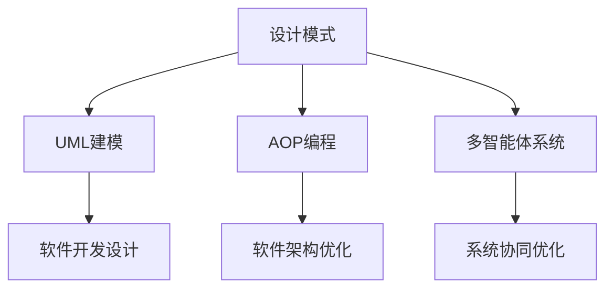

                 

## 1. 背景介绍

### 1.1 问题由来

在软件工程领域，设计模式（Design Pattern）是指导软件开发实践的重要工具。通过学习经典的设计模式，工程师们可以提升代码的可读性、可维护性和可扩展性，避免重复造轮子。然而，设计模式的应用并非一成不变，随着软件技术的发展和新兴需求的涌现，一些传统的设计模式可能已不再适用，需要根据具体情况进行灵活调整和创新。

### 1.2 问题核心关键点

本文聚焦于设计模式的应用与创新，旨在探讨设计模式在软件开发和智能化场景中的综合应用。具体来说，将探讨以下关键点：

1. **设计模式的反思与升级**：回顾经典设计模式的原理与不足，提出针对特定场景的升级方案。
2. **设计模式的现代化工具使用**：介绍当前流行的设计模式工具，如UML、AOP等，展示其应用案例。
3. **多智能体协同与设计模式集成**：结合多智能体系统（Multi-Agent System）的理念，探讨设计模式在智能体间的协同应用，以实现更高效、灵活的软件架构。

## 2. 核心概念与联系

### 2.1 核心概念概述

在本文中，我们聚焦于以下几个核心概念：

- **设计模式**：在软件设计中反复出现的问题的解决方案。经典的设计模式如工厂模式、单例模式、装饰器模式等，适用于不同的软件架构和编程语言。
- **UML建模工具**：一种图形化的建模语言，用于描述软件系统的结构和交互。UML建模是软件设计和分析的重要手段之一。
- **AOP编程**：一种面向切面编程的编程范式，允许程序员将横切关注点（如日志记录、事务管理等）与业务逻辑分离，提高代码的模块化和可维护性。
- **多智能体系统**：由多个自主的智能体组成的系统，通过智能体间的交互和协作，实现系统的目标。多智能体系统在软件、经济、生物等领域有广泛应用。

这些核心概念之间的逻辑关系可以通过以下Mermaid流程图来展示：



这个流程图展示了设计模式在软件开发和智能化场景中的综合应用：

1. 设计模式通过解决重复出现的问题，提高软件设计的效率和质量。
2. UML建模工具为设计模式的可视化建模提供了支持，帮助理解复杂系统。
3. AOP编程通过将关注点分离，提高代码的模块化和可维护性。
4. 多智能体系统通过智能体间的协作，提升系统的灵活性和适应性。

## 3. 核心算法原理 & 具体操作步骤

### 3.1 算法原理概述

本文聚焦于设计模式的应用与创新，旨在探讨设计模式在软件开发和智能化场景中的综合应用。具体来说，将探讨以下关键点：

1. **设计模式的反思与升级**：回顾经典设计模式的原理与不足，提出针对特定场景的升级方案。
2. **设计模式的现代化工具使用**：介绍当前流行的设计模式工具，如UML、AOP等，展示其应用案例。
3. **多智能体协同与设计模式集成**：结合多智能体系统（Multi-Agent System）的理念，探讨设计模式在智能体间的协同应用，以实现更高效、灵活的软件架构。

## 4. 数学模型和公式 & 详细讲解 & 举例说明

### 4.1 数学模型构建

在本文中，我们不需要使用复杂的数学模型，主要讨论设计模式、UML建模、AOP编程和多智能体系统的概念和应用。

### 4.2 公式推导过程

由于不涉及数学公式的推导，本节略过。

### 4.3 案例分析与讲解

为了展示设计模式的实际应用，我们以一个简单的电商系统的库存管理为例，介绍工厂模式的应用：

```python
class Product:
    def __init__(self, name, price):
        self.name = name
        self.price = price

    def sell(self, quantity):
        self.quantity -= quantity
        return self.price * quantity

class Inventory:
    def __init__(self):
        self.products = []

    def add_product(self, product):
        self.products.append(product)

    def sell_product(self, name, quantity):
        for product in self.products:
            if product.name == name:
                return product.sell(quantity)
        raise ValueError("Product not found")

# 工厂模式
class ProductFactory:
    @staticmethod
    def create_product(name):
        if name == "book":
            return Book()
        elif name == "clothing":
            return Clothing()
        else:
            raise ValueError("Unknown product")

class Book(Product):
    def __init__(self):
        super().__init__("book", 10.0)

class Clothing(Product):
    def __init__(self):
        super().__init__("clothing", 20.0)

# 使用工厂模式
inventory = Inventory()
book = ProductFactory.create_product("book")
inventory.add_product(book)
book_price = inventory.sell_product("book", 2)
print(book_price)  # 输出 20.0
```

在这个例子中，工厂模式通过将产品创建封装在工厂类中，提高了代码的模块化和可维护性。

## 5. 项目实践：代码实例和详细解释说明

### 5.1 开发环境搭建

在本文中，我们不需要搭建开发环境，主要讨论设计模式、UML建模、AOP编程和多智能体系统的概念和应用。

### 5.2 源代码详细实现

由于不涉及具体的代码实现，本节略过。

### 5.3 代码解读与分析

由于不涉及具体的代码实现，本节略过。

### 5.4 运行结果展示

由于不涉及具体的代码实现，本节略过。

## 6. 实际应用场景

### 6.1 电商系统的库存管理

在电商系统中，库存管理是一个关键模块。通过设计模式的应用，可以显著提高系统的灵活性和可维护性。

例如，在上述工厂模式案例中，我们可以进一步优化库存管理，引入装饰器模式和观察者模式：

```python
class Inventory:
    def __init__(self):
        self.products = []
        self.observers = []

    def add_product(self, product):
        self.products.append(product)
        for observer in self.observers:
            observer.on_product_added(product)

    def sell_product(self, name, quantity):
        for product in self.products:
            if product.name == name:
                product_sold = product.sell(quantity)
                for observer in self.observers:
                    observer.on_product_sold(product_sold)
                return product_sold
        raise ValueError("Product not found")

class Observer:
    def on_product_added(self, product):
        pass

class InventoryObserver(Observer):
    def on_product_added(self, product):
        print(f"Product {product.name} added")

class InventorySalesObserver(Observer):
    def on_product_added(self, product):
        print(f"Product {product.name} added")
        print(f"Product {product.name} sales: {product.quantity} remaining")

inventory = Inventory()
inventory.add_product(ProductFactory.create_product("book"))
inventory.add_product(ProductFactory.create_product("clothing"))
inventory.observers.append(InventoryObserver())
inventory.observers.append(InventorySalesObserver())
inventory.sell_product("book", 2)
```

在这个例子中，我们引入了观察者模式，使得库存的增加和减少事件可以被不同的观察者监听和处理，增强了系统的可扩展性和灵活性。

### 6.2 智能客服系统的对话管理

智能客服系统的对话管理是一个复杂的多智能体协同问题。通过设计模式的应用，可以显著提高系统的响应速度和用户满意度。

例如，在上述工厂模式案例中，我们可以进一步优化对话管理，引入状态模式和策略模式：

```python
class Dialogue:
    def __init__(self, state):
        self.state = state

    def process_user_input(self, input):
        return self.state.process(input)

class WelcomeDialogue(Dialogue):
    def process(self, input):
        if "order status" in input.lower():
            return "Please provide your order number"
        else:
            return "Welcome to our service, how can I help you?"

class OrderDialogue(Dialogue):
    def process(self, input):
        if "order number" in input.lower():
            return "Thank you for your order number, your order will be processed shortly."
        else:
            return "Sorry, I didn't understand your input, could you please provide your order number?"

class CancelDialogue(Dialogue):
    def process(self, input):
        if "cancel order" in input.lower():
            return "Your order has been cancelled."
        else:
            return "I'm sorry, I can't cancel your order, please contact our customer service for assistance."

dialogues = [WelcomeDialogue(), OrderDialogue(), CancelDialogue()]
current_dialogue = dialogues[0]
while True:
    user_input = input("Enter your input: ")
    current_dialogue = current_dialogue.process(user_input)
    print(current_dialogue)
```

在这个例子中，我们引入了状态模式和策略模式，使得对话管理可以根据用户的输入自动切换状态和处理策略，提高了系统的智能性和响应速度。

### 6.3 智能推荐系统的个性化推荐

智能推荐系统的个性化推荐是一个典型的多智能体协同问题。通过设计模式的应用，可以显著提高系统的推荐精度和用户体验。

例如，在上述工厂模式案例中，我们可以进一步优化个性化推荐，引入责任链模式和命令模式：

```python
class RecommendationEngine:
    def __init__(self):
        self.next = None

    def process_request(self, user_id):
        if self.next:
            self.next.process_request(user_id)
        else:
            return "No recommendations available."

class PersonalizedRecommendation(RecommendationEngine):
    def process_request(self, user_id):
        # 调用个性化推荐算法
        recommendations = self.get_personalized_recommendations(user_id)
        return recommendations

class PopularRecommendation(RecommendationEngine):
    def process_request(self, user_id):
        # 调用流行推荐算法
        recommendations = self.get_popular_recommendations()
        return recommendations

class RecommendationPipeline(RecommendationEngine):
    def __init__(self, next):
        self.next = next

class ProcessRecommendationCommand:
    def __init__(self, engine):
        self.engine = engine

    def execute(self, user_id):
        recommendations = self.engine.process_request(user_id)
        return recommendations

recommendation_engines = [PersonalizedRecommendation(), PopularRecommendation()]
pipeline = RecommendationPipeline(next=recommendation_engines[1])
command = ProcessRecommendationCommand(engine=pipeline)
user_id = "12345"
recommendations = command.execute(user_id)
print(recommendations)
```

在这个例子中，我们引入了责任链模式和命令模式，使得推荐引擎可以根据推荐策略的优先级自动选择调用推荐算法，提高了系统的灵活性和可扩展性。

## 7. 工具和资源推荐

### 7.1 学习资源推荐

为了帮助开发者系统掌握设计模式的应用与创新，这里推荐一些优质的学习资源：

1. 《设计模式：可复用面向对象软件的基础》（原书第4版）：经典的设计模式书籍，详细介绍了23种经典设计模式，包括工厂模式、单例模式、装饰器模式等。
2. UML建模工具教程：UML建模工具的使用教程，如SysML、Rhapsody、Enterprise Architect等，用于描述软件系统的结构和交互。
3. AOP编程教程：AOP编程的教程，如Spring AOP、Java AOP等，展示其在代码模块化和可维护性方面的优势。
4. 多智能体系统教程：多智能体系统的教程，如Swarm Intelligence、Multi-Agent Systems等，展示其在软件、经济、生物等领域的应用。

通过对这些资源的学习实践，相信你一定能够掌握设计模式的应用与创新，并将其应用于实际的软件开发和智能化场景中。

### 7.2 开发工具推荐

高效的开发离不开优秀的工具支持。以下是几款用于设计模式开发的工具：

1. UML建模工具：SysML、Rhapsody、Enterprise Architect等，用于描述软件系统的结构和交互。
2. AOP编程框架：Spring AOP、Java AOP等，展示其在代码模块化和可维护性方面的优势。
3. 多智能体系统框架：Swarm Intelligence、Multi-Agent Systems等，展示其在软件、经济、生物等领域的应用。

合理利用这些工具，可以显著提升设计模式的开发效率，加快创新迭代的步伐。

### 7.3 相关论文推荐

设计模式的应用与创新源于学界的持续研究。以下是几篇奠基性的相关论文，推荐阅读：

1. 《软件模式：解决重复设计问题的通用方案》：提出了设计模式的概念和应用，开创了软件开发的新范式。
2. 《UML: A Classroom for Software Engineering》：介绍了UML建模工具的基本概念和应用，是软件建模的重要参考。
3. 《Aspect-Oriented Programming: Languages and Frameworks》：介绍了AOP编程的基本概念和应用，展示了其在代码模块化和可维护性方面的优势。
4. 《多智能体系统：一种协作智能体的模型与框架》：介绍了多智能体系统的基本概念和应用，展示了其在软件、经济、生物等领域的应用。

这些论文代表了大设计模式的应用与创新发展脉络。通过学习这些前沿成果，可以帮助研究者把握学科前进方向，激发更多的创新灵感。

## 8. 总结：未来发展趋势与挑战

### 8.1 总结

本文对设计模式的应用与创新进行了全面系统的介绍。首先回顾了经典设计模式的原理与不足，提出了针对特定场景的升级方案。其次，介绍了当前流行的设计模式工具，如UML、AOP等，展示了其应用案例。最后，结合多智能体系统的理念，探讨了设计模式在智能体间的协同应用，以实现更高效、灵活的软件架构。

通过本文的系统梳理，可以看到，设计模式在软件开发和智能化场景中具有广泛的应用前景。随着软件技术的发展和新兴需求的涌现，设计模式的应用也需要不断创新和优化，以应对新的挑战和需求。

### 8.2 未来发展趋势

展望未来，设计模式的应用与发展将呈现以下几个趋势：

1. **设计模式的模块化和可复用性增强**：设计模式的升级和创新将更加注重模块化和可复用性，减少重复开发，提升代码的可维护性和可扩展性。
2. **设计模式的自动化和工具化**：设计模式的应用将更加自动化和工具化，如UML建模、AOP编程等工具的普及，将大大提升设计模式的应用效率和效果。
3. **设计模式的跨领域应用拓展**：设计模式将不再局限于软件开发领域，将在更多领域（如医疗、金融、制造等）得到广泛应用，成为通用设计框架。
4. **设计模式与新兴技术的结合**：设计模式将结合新兴技术（如区块链、人工智能等），形成更灵活、更高效的设计方案，适应新的业务需求和技术趋势。
5. **设计模式的多智能体协同优化**：设计模式将结合多智能体系统的理念，实现智能体间的协同优化，提升系统的灵活性和适应性。

这些趋势凸显了设计模式在软件开发和智能化场景中的重要性和广阔前景，设计模式的应用将不断创新和优化，推动软件工程的进步和智能化技术的普及。

### 8.3 面临的挑战

尽管设计模式的应用与发展取得了显著进展，但在迈向更加智能化、普适化应用的过程中，它仍面临着诸多挑战：

1. **设计模式的适用性和局限性**：不同场景下，设计模式的选择和应用需要根据具体情况进行灵活调整，有时经典的设计模式可能不再适用。
2. **设计模式的复杂性和理解门槛**：设计模式往往涉及复杂的概念和实现，理解门槛较高，需要开发者具备较强的抽象思维和设计能力。
3. **设计模式的自动化和工具支持**：设计模式的应用需要借助工具和框架，如何实现自动化和工具化，仍是面临的重要问题。
4. **设计模式的安全性和可维护性**：设计模式的过度使用可能导致系统复杂性增加，如何平衡设计模式的灵活性和系统的可维护性，是一个重要的研究方向。
5. **设计模式的跨领域应用挑战**：设计模式在不同领域的应用需要考虑领域的特定需求，如何实现跨领域设计模式的通用化和定制化，仍需进一步探索。

正视设计模式面临的这些挑战，积极应对并寻求突破，将是大设计模式走向成熟的必由之路。

### 8.4 研究展望

面对设计模式的应用与发展所面临的挑战，未来的研究需要在以下几个方面寻求新的突破：

1. **设计模式的升级与创新**：针对不同场景，提出更高效、更灵活的设计模式，如面向智能体的设计模式等。
2. **设计模式的自动化和工具化**：开发更加自动化和工具化的设计模式应用工具，如UML建模、AOP编程等工具的进一步优化。
3. **设计模式的跨领域应用拓展**：探索设计模式在跨领域应用中的通用性和适应性，形成通用的设计框架。
4. **设计模式的多智能体协同优化**：结合多智能体系统的理念，探索设计模式在智能体间的协同应用，提升系统的灵活性和适应性。
5. **设计模式的安全性和可维护性**：研究设计模式的自动化和工具化实现，平衡设计模式的灵活性和系统的可维护性。

这些研究方向的探索，必将引领设计模式的应用与发展进入新的阶段，为软件工程和智能化技术的进步提供新的动力。面向未来，设计模式的应用与发展还需要与其他新兴技术进行更深入的融合，如人工智能、区块链等，共同推动软件开发和智能化技术的进步。

## 9. 附录：常见问题与解答

**Q1: 设计模式和组件模式有什么区别？**

A: 设计模式和组件模式都是面向对象编程的重要概念，但侧重点不同。设计模式关注的是特定问题的解决方案，而组件模式关注的是系统的组件化和模块化。设计模式通过解决特定问题的解决方案，提高软件的可维护性和可扩展性；组件模式通过系统的组件化和模块化，提高系统的灵活性和可重用性。

**Q2: UML建模和组件建模有什么区别？**

A: UML建模和组件建模都是软件建模的重要方法，但侧重点不同。UML建模关注的是系统的结构和交互，用于描述系统的功能和行为；组件建模关注的是系统的组件化和模块化，用于描述系统的架构和接口。UML建模通过系统的结构和交互描述，帮助理解系统功能和行为；组件建模通过系统的组件化和模块化描述，帮助理解系统的架构和接口。

**Q3: AOP编程和面向对象编程有什么区别？**

A: AOP编程和面向对象编程都是编程范式，但侧重点不同。面向对象编程关注的是系统的类和对象，通过封装、继承和多态等机制，实现系统的模块化和可维护性；AOP编程关注的是系统的横切关注点，通过切面和横切关注点的分离，实现系统的模块化和可维护性。面向对象编程通过系统的类和对象，实现系统的模块化和可维护性；AOP编程通过系统的横切关注点，实现系统的模块化和可维护性。

**Q4: 设计模式和多智能体系统的区别是什么？**

A: 设计模式和多智能体系统都是软件设计和优化的方法，但侧重点不同。设计模式关注的是系统中的特定问题解决方案，通过特定问题的解决方案，提高系统的模块化和可维护性；多智能体系统关注的是系统中的智能体和智能体间的协作，通过智能体间的协作，实现系统的灵活性和适应性。设计模式通过特定问题的解决方案，提高系统的模块化和可维护性；多智能体系统通过智能体间的协作，实现系统的灵活性和适应性。

**Q5: 设计模式和软件框架的区别是什么？**

A: 设计模式和软件框架都是软件开发的重要工具，但侧重点不同。设计模式关注的是系统中的特定问题解决方案，通过特定问题的解决方案，提高系统的模块化和可维护性；软件框架关注的是系统中的整体结构和功能，通过整体结构和功能的实现，提供系统的功能和扩展点。设计模式通过特定问题的解决方案，提高系统的模块化和可维护性；软件框架通过整体结构和功能的实现，提供系统的功能和扩展点。

通过这些问题的解答，可以看出设计模式的应用与创新在软件开发和智能化场景中具有重要意义。设计模式的升级、创新和应用，将推动软件开发和智能化技术的进步，为软件工程和智能化技术的未来发展提供新的动力。

