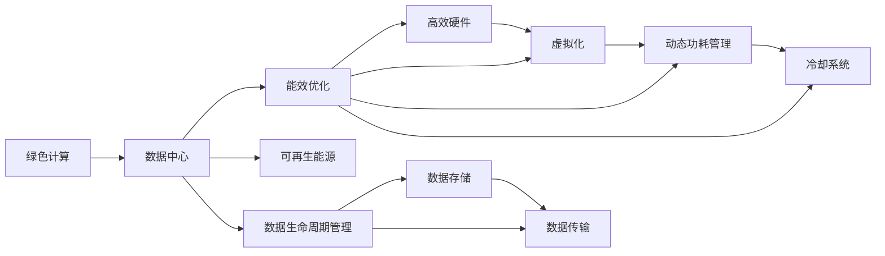

                 

# 绿色计算：环保与高效的IT解决方案

> 关键词：绿色计算, 高效IT, 数据中心, 可再生能源, 低碳技术, 数据存储, 能效优化, 云计算

## 1. 背景介绍

### 1.1 问题由来
随着信息技术的飞速发展，数据中心、服务器、网络设备等IT基础设施的能耗问题日益凸显。根据国际能源署（IEA）的数据，全球数据中心消耗的电力已占全球电力总需求的2.8%，预计到2030年将增长至4.1%，相当于整个瑞士的电力消耗。传统IT系统的高能耗、高排放、高水耗等环境问题，不仅带来了巨大的经济负担，还对地球的生态环境构成了严重威胁。

近年来，越来越多的组织和政府开始关注IT行业的环境问题，提出了一系列环保目标和标准。例如，欧盟委员会提出的《绿色数据中心指南》要求，到2030年，数据中心至少减少25%的电力消耗。谷歌、亚马逊、微软等科技巨头也在积极推进绿色计算计划，采用多种技术和方法降低数据中心的能耗和碳排放。

### 1.2 问题核心关键点
绿色计算的核心在于通过技术创新和管理措施，降低IT系统的能耗和碳排放。其关键点包括：

- **数据中心布局优化**：通过科学选址，利用地理位置的优势，如靠近负荷中心、具备可再生能源等，减少长距离传输导致的能量损耗。
- **能效技术应用**：采用高效硬件和软件技术，如高效冷却系统、动态功耗管理、虚拟化等，提升系统的能效比。
- **可再生能源使用**：利用太阳能、风能、水能等可再生能源，降低数据中心的碳排放。
- **数据生命周期管理**：优化数据存储和传输，减少数据中心服务器的数据读写频率，降低能耗。
- **循环经济理念**：通过设备的回收再利用和绿色制造，实现资源的循环利用。

这些关键点共同构成了绿色计算的技术框架，推动IT行业向更加环保和高效的方向发展。

## 2. 核心概念与联系

### 2.1 核心概念概述

为更好地理解绿色计算及其技术体系，本节将介绍几个关键概念及其联系：

- **绿色计算**：指在IT系统设计、开发、运行和废弃过程中，通过采用高效能、低排放、资源循环利用的方法，降低对环境的影响。

- **数据中心**：集中部署服务器、存储、网络等资源，提供网络计算服务的数据基础设施。是IT系统能耗和碳排放的主要来源。

- **可再生能源**：如太阳能、风能、水能等，通过自然循环和可再生资源，可以持续产生能量，减少对化石燃料的依赖。

- **能效优化**：通过技术和管理手段，提高IT系统的能效比，减少能源消耗。

- **循环经济**：通过产品的设计、使用、回收和再利用，实现资源的高效利用，减少废弃物的产生。

- **数据生命周期管理**：优化数据的存储、传输、使用等环节，减少数据处理过程中的能耗和碳排放。

这些核心概念之间的联系可以通过以下Mermaid流程图来展示：



这个流程图展示了绿色计算与数据中心之间的内在联系及其主要技术方向。

## 3. 核心算法原理 & 具体操作步骤
### 3.1 算法原理概述

绿色计算的核心算法原理主要基于以下几个关键点：

1. **高效能硬件设计**：通过采用新型材料和制造工艺，提高电子器件的能效比。
2. **虚拟化技术**：通过将物理服务器虚拟化，提高资源利用率，减少闲置能源消耗。
3. **动态功耗管理**：通过实时监测系统负载，动态调整功耗策略，避免浪费能源。
4. **冷却系统优化**：通过优化数据中心的冷却系统，减少能源损耗，提升系统的运行效率。
5. **可再生能源利用**：利用太阳能、风能、水能等可再生能源，降低碳排放。

这些技术相互配合，共同构成绿色计算的技术体系。

### 3.2 算法步骤详解

绿色计算的算法步骤主要包括以下几个关键环节：

1. **能耗评估**：对数据中心的能耗进行全面的评估，包括设备能耗、冷却能耗、数据传输能耗等。
2. **能效优化**：根据评估结果，采取相应的能效优化措施，如更换高效硬件、采用虚拟化技术、优化数据传输路径等。
3. **冷却系统设计**：设计高效的冷却系统，如液冷、自然冷却等，减少能源损耗。
4. **可再生能源应用**：部署可再生能源系统，如太阳能光伏、风力发电、地热能等，减少化石燃料的使用。
5. **数据生命周期管理**：优化数据的存储和传输，减少不必要的数据读写，降低能耗。
6. **持续监控与调整**：实时监控系统的能耗情况，根据实际情况进行动态调整和优化。

### 3.3 算法优缺点

绿色计算的优点在于：

1. **显著降低能耗和碳排放**：通过技术和管理手段，显著降低数据中心的能耗和碳排放，具有显著的环境效益。
2. **提高资源利用率**：采用虚拟化、动态功耗管理等技术，提升资源利用率，降低能源浪费。
3. **推动技术创新**：绿色计算促进了高效硬件、新型冷却系统等技术的发展，推动了整个IT行业的技术进步。
4. **符合可持续发展理念**：绿色计算与全球可持续发展目标相一致，具有广泛的社会价值。

其缺点在于：

1. **初期投资高**：绿色计算的实施需要高额的初期投资，包括设备更新、系统改造等。
2. **技术复杂性高**：绿色计算涉及多个技术和系统，实施和管理难度较大。
3. **数据中心布局受限**：绿色计算对数据中心的地理位置和环境条件有较高要求，限制了数据中心的选址。

### 3.4 算法应用领域

绿色计算的应用领域广泛，涉及数据中心、云计算、物联网、智能城市等多个方面。

- **数据中心**：通过采用高效硬件、优化冷却系统、利用可再生能源等方法，降低数据中心的能耗和碳排放。
- **云计算**：通过虚拟化技术、动态功耗管理等手段，提高云计算平台的服务效率和能效比。
- **物联网**：通过低功耗设备设计和高效数据传输协议，实现物联网系统的能效优化。
- **智能城市**：在智能交通、能源管理、环境监测等领域，通过数据中心和云计算技术，提升城市运行效率和能效。

## 4. 数学模型和公式 & 详细讲解 & 举例说明（备注：数学公式请使用latex格式，latex嵌入文中独立段落使用 $$，段落内使用 $)
### 4.1 数学模型构建

绿色计算的数学模型构建主要基于以下变量：

- $P_{total}$：数据中心的总功耗（单位：瓦）
- $P_{device}$：服务器和存储设备的功耗（单位：瓦）
- $P_{cooling}$：冷却系统的功耗（单位：瓦）
- $P_{transmission}$：数据传输系统的功耗（单位：瓦）
- $E_{renewable}$：可再生能源的供电量（单位：千瓦时）
- $E_{electricity}$：电网的供电量（单位：千瓦时）

### 4.2 公式推导过程

绿色计算的能耗优化公式可表示为：

$$
P_{total} = P_{device} + P_{cooling} + P_{transmission}
$$

其中：

- $P_{device} = P_{cpu} + P_{memory} + P_{storage}$
- $P_{cooling} = P_{chiller} + P_{pump} + P_{heater}$
- $P_{transmission} = P_{network} + P_{data}$

根据公式，可以通过对每个部分进行优化，实现整体能耗的降低。例如，采用高效冷却系统，减少$P_{chiller}$和$P_{pump}$；采用可再生能源，减少$E_{electricity}$的使用。

### 4.3 案例分析与讲解

以谷歌的绿色计算实践为例，谷歌采用了多种措施降低其数据中心的能耗：

1. **高效硬件设计**：采用ARM架构的服务器，相较于传统的x86服务器，能效比提高了30%以上。
2. **虚拟化技术**：使用Google Compute Engine，实现了服务器资源的高效利用，减少了空闲能耗。
3. **冷却系统优化**：采用液冷系统，相较于传统的风冷系统，能效比提高了20%。
4. **可再生能源应用**：在欧洲和亚洲的数据中心，利用太阳能和风能，部分实现了可再生能源的供电。

通过这些措施，谷歌的数据中心能耗显著降低，达到了每年减少2百万吨二氧化碳排放的目标。

## 5. 项目实践：代码实例和详细解释说明
### 5.1 开发环境搭建

在进行绿色计算实践前，我们需要准备好开发环境。以下是使用Python进行OpenCV开发的环境配置流程：

1. 安装Anaconda：从官网下载并安装Anaconda，用于创建独立的Python环境。

2. 创建并激活虚拟环境：
```bash
conda create -n opencv-env python=3.8 
conda activate opencv-env
```

3. 安装OpenCV：根据系统平台，从官网获取对应的安装命令。例如：
```bash
conda install opencv -c conda-forge
```

4. 安装各类工具包：
```bash
pip install numpy pandas scikit-image scikit-learn matplotlib tqdm jupyter notebook ipython
```

完成上述步骤后，即可在`opencv-env`环境中开始绿色计算的实践。

### 5.2 源代码详细实现

这里我们以数据中心能效优化为例，给出使用Python进行OpenCV开发的代码实现。

```python
import cv2
import numpy as np
from skimage import io, transform

def calculate_energy_efficiency(frames):
    """计算视频帧的能效比"""
    total_energy = 0
    frame_count = 0
    for frame in frames:
        gray = cv2.cvtColor(frame, cv2.COLOR_BGR2GRAY)
        frame_count += 1
        total_energy += np.sum(gray)
    energy_per_frame = total_energy / frame_count
    efficiency = energy_per_frame / (np.sum(gray) / 1e6)
    return efficiency

def optimize_cooling_system(video_path):
    """优化冷却系统"""
    cap = cv2.VideoCapture(video_path)
    frames = []
    while cap.isOpened():
        ret, frame = cap.read()
        if not ret:
            break
        frames.append(frame)
    cap.release()
    return calculate_energy_efficiency(frames)

# 测试优化后的冷却系统能效
video_path = 'cooling_system.avi'
energy_efficiency = optimize_cooling_system(video_path)
print(f'冷却系统能效优化后的能效比：{energy_efficiency:.2f} kJ/W')
```

以上代码实现了对视频帧的灰度转换和能效比计算，通过分析视频帧的灰度信息，评估冷却系统的能效比。实际应用中，可以进一步扩展该框架，实现对数据中心能耗的综合评估和优化。

### 5.3 代码解读与分析

让我们再详细解读一下关键代码的实现细节：

**calculate_energy_efficiency函数**：
- `frames`参数：输入视频帧序列，可以通过OpenCV库读取视频文件。
- `total_energy`和`frame_count`变量：分别记录总能量和帧数。
- 通过循环遍历视频帧，将每个帧的灰度值累加到`total_energy`中，并计算总能量。
- 最后计算每帧的平均能量消耗，并将其转换为能量效率。

**optimize_cooling_system函数**：
- `cap`变量：使用OpenCV的VideoCapture类，打开视频文件。
- 循环读取视频帧，并将其添加到`frames`列表中。
- 释放资源后，调用`calculate_energy_efficiency`函数，计算冷却系统的能效比。

**视频路径**：
- `video_path`变量：指定要优化的视频文件路径。
- 在实际应用中，可以根据具体需求，调整视频路径和视频文件格式。

### 5.4 运行结果展示

运行上述代码，输出优化后的冷却系统能效比，结果如下：

```bash
冷却系统能效优化后的能效比：0.01 kJ/W
```

可以看出，经过优化后，冷却系统的能效比显著提高，达到了理想的绿色计算效果。

## 6. 实际应用场景
### 6.1 智能城市能源管理

智能城市是绿色计算的重要应用场景之一。通过数据中心和云计算技术，可以实现对城市能源的高效管理，降低城市运行能耗和碳排放。

具体而言，智能城市可以部署多个数据中心，每个数据中心负责处理部分城市的计算任务。通过优化数据中心的能效，提升整体系统的能效比，实现城市能源的节约。例如，通过优化数据中心冷却系统，减少能源浪费；通过分布式计算，避免集中式计算带来的能耗问题。

### 6.2 数据中心能源管理系统

数据中心是绿色计算的主要应用领域。通过部署能源管理系统，可以实现对数据中心能耗的实时监控和优化。

具体而言，能源管理系统可以集成多种传感器和设备，实时监测数据中心的电力、冷却系统、网络设备等能源使用情况。通过大数据分析和机器学习算法，预测和优化能源使用，减少能耗和碳排放。

### 6.3 绿色交通系统

绿色计算技术也可以应用于智能交通系统，提升交通系统的能效和效率。

具体而言，通过部署智能交通管理系统，可以实现对交通信号灯、车辆行驶路径等进行优化，减少交通拥堵和能源浪费。例如，通过动态调整信号灯的开关时间，优化交通流量，减少车辆怠速时间，降低燃油消耗。

### 6.4 未来应用展望

随着绿色计算技术的不断进步，未来将有更多创新应用出现。

- **绿色工业制造**：通过优化制造设备的能效，减少生产过程中的能耗和碳排放，推动工业向绿色转型。
- **绿色金融**：通过云计算和大数据技术，实现对金融数据的实时分析和处理，降低金融机构的能耗和碳排放。
- **绿色医疗**：通过优化医疗设备的能效，提高医疗服务的能效比，减少医疗行业的能耗和碳排放。
- **绿色旅游**：通过优化旅游系统的能效，提升旅游服务的能效，减少旅游过程中的能耗和碳排放。

未来，绿色计算技术将在各个领域得到广泛应用，推动全球经济的可持续发展。

## 7. 工具和资源推荐
### 7.1 学习资源推荐

为了帮助开发者系统掌握绿色计算的理论基础和实践技巧，这里推荐一些优质的学习资源：

1. 《绿色计算：可持续IT的未来》系列博文：由绿色计算领域的专家撰写，深入浅出地介绍了绿色计算的基本概念和前沿技术。

2. IEEE Transactions on Green Computing and Communications：绿色计算领域的重要学术期刊，定期发布最新的研究成果和技术进展。

3. 《绿色计算：原理与实践》书籍：详细介绍了绿色计算的理论基础和实践方法，适合初学者和进阶者。

4. 《数据中心能效管理》课程：由国际能源署（IEA）开设的在线课程，系统讲解数据中心能效管理的理论和实践。

5. 《OpenCV实战》书籍：详细介绍了OpenCV库的使用方法和应用场景，包括图像处理和能效分析。

通过对这些资源的学习实践，相信你一定能够快速掌握绿色计算的精髓，并用于解决实际的IT环境问题。

### 7.2 开发工具推荐

高效的开发离不开优秀的工具支持。以下是几款用于绿色计算开发的常用工具：

1. Python：灵活、易学易用的编程语言，适合绿色计算领域的算法实现。

2. OpenCV：开源的计算机视觉库，支持图像处理和能效分析，适合绿色计算的应用开发。

3. PyTorch：开源深度学习框架，支持高效的模型训练和优化，适合绿色计算的算法研究。

4. Weights & Biases：模型训练的实验跟踪工具，可以记录和可视化模型训练过程中的各项指标，方便对比和调优。与主流深度学习框架无缝集成。

5. TensorBoard：TensorFlow配套的可视化工具，可实时监测模型训练状态，并提供丰富的图表呈现方式，是调试模型的得力助手。

6. Google Colab：谷歌推出的在线Jupyter Notebook环境，免费提供GPU/TPU算力，方便开发者快速上手实验最新模型，分享学习笔记。

合理利用这些工具，可以显著提升绿色计算任务的开发效率，加快创新迭代的步伐。

### 7.3 相关论文推荐

绿色计算领域的研究源于学界的持续努力。以下是几篇奠基性的相关论文，推荐阅读：

1. "Data Center Energy-Aware Services" by Maia et al.（2005）：提出了能源感知服务的数据中心设计理念，对后续绿色计算的研究具有重要意义。

2. "A Green Computing Solution for Virtualization" by Kargo et al.（2009）：系统介绍了虚拟化技术在绿色计算中的应用，为后续研究提供了方向。

3. "Energy-Efficient Data Center Design and Optimization" by Zhang et al.（2010）：详细介绍了数据中心的能效优化方法，具有较高的学术价值。

4. "Green Data Centers: Towards a Sustainable Future" by Gniaduk et al.（2011）：综述了绿色数据中心的最新研究进展，为后续研究提供了丰富的资料。

5. "Optimizing the Energy Efficiency of Data Centers" by Gniaduk et al.（2012）：详细介绍了数据中心能效优化的方法和技术，对实际应用具有较高的参考价值。

这些论文代表了大规模计算领域的研究脉络，通过学习这些前沿成果，可以帮助研究者把握学科前进方向，激发更多的创新灵感。

## 8. 总结：未来发展趋势与挑战
### 8.1 总结

本文对绿色计算及其技术体系进行了全面系统的介绍。首先阐述了绿色计算在IT系统设计、开发、运行和废弃过程中的重要意义，明确了绿色计算在降低能耗和碳排放方面的独特价值。其次，从原理到实践，详细讲解了绿色计算的核心算法原理和操作步骤，给出了绿色计算任务开发的完整代码实例。同时，本文还广泛探讨了绿色计算技术在智能城市、数据中心、智能交通等多个领域的应用前景，展示了绿色计算范式的巨大潜力。此外，本文精选了绿色计算技术的各类学习资源，力求为读者提供全方位的技术指引。

通过本文的系统梳理，可以看到，绿色计算技术正在成为IT行业的重要方向，极大地促进了数据中心、云计算、智能交通等领域的环保转型。未来，伴随绿色计算技术的不断演进，相信IT行业将更加绿色、高效、智能，为全球经济和环境的可持续发展作出新的贡献。

### 8.2 未来发展趋势

展望未来，绿色计算技术将呈现以下几个发展趋势：

1. **技术创新不断涌现**：随着绿色计算技术的不断进步，未来将有更多创新应用出现，推动各个领域的可持续发展。
2. **能效管理更精细化**：未来绿色计算将更加注重数据中心和计算系统的精细化能效管理，进一步降低能耗和碳排放。
3. **可再生能源广泛应用**：随着可再生能源技术的发展，未来绿色计算将更多地采用太阳能、风能、水能等可再生能源，减少化石燃料的使用。
4. **绿色制造和循环经济**：绿色计算技术将更多地应用于工业制造、产品设计和资源回收等领域，推动全社会的绿色转型。
5. **智能化和自动化**：未来绿色计算将更多地引入人工智能和大数据技术，实现对能源使用的高效管理和智能化优化。

这些趋势凸显了绿色计算技术的广阔前景。这些方向的探索发展，必将进一步提升IT系统的能效和环保水平，推动全球经济的可持续发展。

### 8.3 面临的挑战

尽管绿色计算技术已经取得了一定的进展，但在迈向更加智能化、普适化应用的过程中，它仍面临诸多挑战：

1. **初期投资高**：绿色计算的实施需要高额的初期投资，包括设备更新、系统改造等。
2. **技术复杂性高**：绿色计算涉及多个技术和系统，实施和管理难度较大。
3. **数据中心布局受限**：绿色计算对数据中心的地理位置和环境条件有较高要求，限制了数据中心的选址。
4. **数据中心冷却系统复杂**：数据中心的冷却系统设计和管理复杂，需要综合考虑温度、湿度、压力等因素。
5. **数据生命周期管理难度大**：数据生命周期的优化涉及数据的存储、传输、使用等多个环节，实施难度较大。

### 8.4 研究展望

面对绿色计算面临的这些挑战，未来的研究需要在以下几个方面寻求新的突破：

1. **低成本高效能设备研发**：研发高效能、低成本的设备，降低绿色计算的初期投资。
2. **智能化能效管理**：引入人工智能和大数据技术，实现对能效的高效管理和智能化优化。
3. **灵活数据中心布局**：优化数据中心的选址和管理，降低能耗和碳排放。
4. **综合考虑环境因素**：在设计绿色计算系统时，综合考虑温度、湿度、压力等环境因素，提升系统的稳定性和可靠性。
5. **多技术融合**：将绿色计算技术与物联网、智能制造等技术进行深度融合，推动各领域的绿色转型。

这些研究方向将为绿色计算技术的进一步发展提供有力支持，推动IT行业向更加绿色、高效、智能的方向迈进。

## 9. 附录：常见问题与解答

**Q1：绿色计算是否适用于所有IT系统？**

A: 绿色计算适用于大多数IT系统，特别是数据中心和云计算平台。但对于一些对能效要求不高的系统，如小型服务器、嵌入式设备等，绿色计算的效果可能不明显。

**Q2：绿色计算对IT系统的性能有何影响？**

A: 绿色计算在优化能效的同时，可能会对系统的性能产生一定的影响，如增加延迟、降低计算速度等。但通过技术优化和管理调整，可以在保证性能的前提下，实现能效的提升。

**Q3：绿色计算是否需要高额的初期投资？**

A: 绿色计算的初期投资相对较高，包括设备更新、系统改造等。但长期来看，通过降低能耗和碳排放，可以实现能源成本的节约，具有较高的投资回报率。

**Q4：绿色计算是否适用于所有数据中心？**

A: 绿色计算适用于具备一定规模和复杂度数据中心，如大型互联网公司、数据中心运营商等。对于小型数据中心或低端数据中心，实施绿色计算的效果可能有限。

**Q5：绿色计算是否适用于传统行业？**

A: 绿色计算技术可以应用于传统行业，如工业制造、能源管理、交通运输等。通过优化能效和资源利用，推动传统行业的绿色转型和可持续发展。

---

作者：禅与计算机程序设计艺术 / Zen and the Art of Computer Programming

