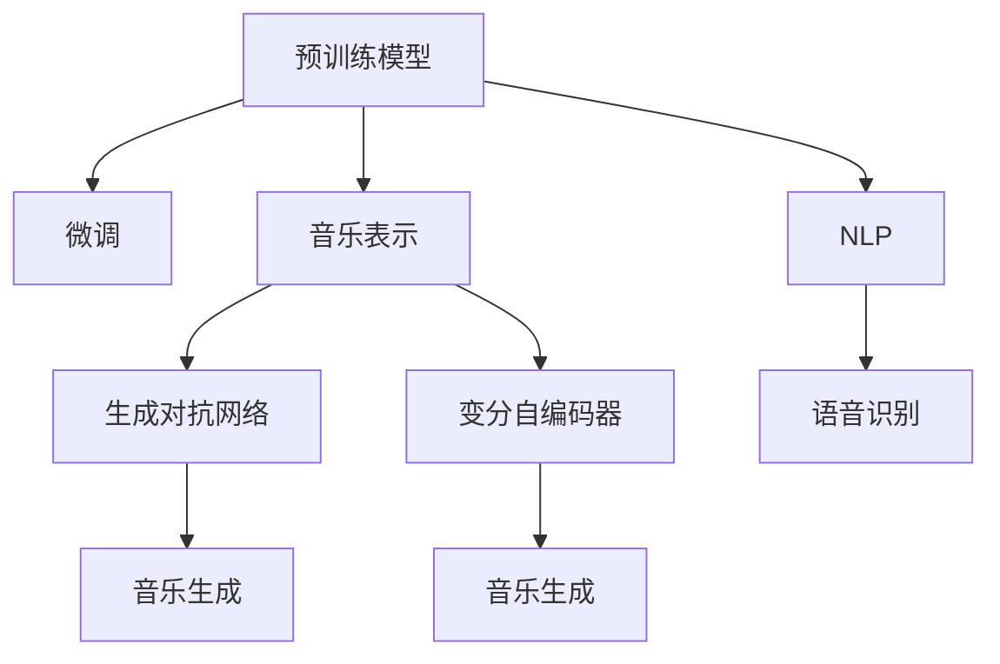

                 

# 聊天机器人音乐创作：人工智能作曲和编曲

## 1. 背景介绍

### 1.1 问题由来

人工智能作曲和编曲，是近年来人工智能技术在音乐领域的一个重要研究方向。其目标是构建具有创作和编曲能力的AI系统，能够自动生成符合人类审美和情感表达的音乐作品。随着深度学习、生成对抗网络（GANs）、变分自编码器（VAEs）等技术的进步，AI作曲和编曲已经从早期的基于规则的方法，转变为基于数据驱动的神经网络模型，取得了令人瞩目的成果。

当前，AI作曲和编曲技术主要应用于两个方面：一是生成新的音乐作品，包括独奏、伴奏、合唱等；二是基于已有的音乐作品进行自动编排，提升其艺术性和复杂性。其中，基于预训练模型和微调方法的应用尤为广泛，能够快速高效地生成高质量的音乐作品。

### 1.2 问题核心关键点

AI作曲和编曲的核心问题在于如何将自然语言与音乐创作过程相结合，构建有效的音乐生成模型。具体来说，需要回答以下问题：

1. 如何设计合适的音乐表示，将自然语言转化为可供音乐模型理解的输入。
2. 如何训练和优化音乐生成模型，使其能够自动生成符合人类审美和情感表达的音乐作品。
3. 如何设计高效的创作和编排流程，最大化AI作曲和编曲的创作效率和艺术性。
4. 如何处理音乐创作过程中的各种不确定性和多样性，保证生成的音乐作品具有创新性和多样性。

## 2. 核心概念与联系

### 2.1 核心概念概述

为更好地理解基于预训练模型和微调方法在AI作曲和编曲中的应用，本节将介绍几个密切相关的核心概念：

- 预训练模型（Pre-trained Model）：指在大规模数据上训练得到的模型，通常包括自回归语言模型（如GPT系列）、自编码语言模型（如BERT）等。
- 微调（Fine-tuning）：指在预训练模型的基础上，使用特定任务的数据进行有监督学习，优化模型在该任务上的性能。
- 音乐表示（Music Representation）：指将音乐作品转化为可供机器处理的符号表示，如音符、旋律、和弦、节奏等。
- 生成对抗网络（GANs）：一种生成模型，通过生成器和判别器的对抗过程，训练生成高质量的合成数据，广泛应用于音乐生成领域。
- 变分自编码器（VAEs）：一种生成模型，通过学习数据分布的隐变量，生成具有多样性和复杂性的音乐作品。
- 自然语言处理（NLP）：指利用自然语言进行计算和理解的技术，通常包括文本分类、情感分析、对话生成等。
- 语音识别（Speech Recognition）：将语音信号转化为文本的技术，是音乐创作和编曲中常见的输入形式。

这些核心概念之间的逻辑关系可以通过以下Mermaid流程图来展示：



这个流程图展示了大语言模型在音乐创作和编曲中的核心概念及其之间的关系：

1. 预训练模型通过在大规模数据上训练，学习到通用的语言或音乐表示，可以作为音乐生成模型的基础。
2. 微调通过特定任务的数据进行有监督学习，优化模型在该任务上的性能，从而生成高质量的音乐作品。
3. 音乐表示将音乐作品转化为符号表示，是音乐生成模型的输入形式。
4. 生成对抗网络和变分自编码器是常用的音乐生成模型，能够生成具有多样性和复杂性的音乐作品。
5. NLP技术通常用于生成音乐作品的输入文本，语音识别技术可以将语音信号转化为文本，用于音乐创作和编曲的输入。
6. 音乐生成模型通过学习音乐表示，生成新的音乐作品或对已有音乐作品进行编排。

这些概念共同构成了AI作曲和编曲的基本框架，使得机器能够在音乐创作和编曲方面发挥重要作用。通过理解这些核心概念，我们可以更好地把握AI作曲和编曲的工作原理和优化方向。

## 3. 核心算法原理 & 具体操作步骤

### 3.1 算法原理概述

基于预训练模型和微调方法的音乐创作和编曲，本质上是一个有监督的生成模型训练过程。其核心思想是：将预训练模型视作一个强大的音乐表示器，通过音乐作品及其文本描述的数据集进行微调，使得模型能够自动生成符合人类审美和情感表达的音乐作品。

形式化地，假设预训练模型为 $M_{\theta}$，其中 $\theta$ 为预训练得到的模型参数。给定音乐作品 $P$ 及其文本描述 $D$，微调的目标是找到新的模型参数 $\hat{\theta}$，使得：

$$
\hat{\theta}=\mathop{\arg\min}_{\theta} \mathcal{L}(M_{\theta},P,D)
$$

其中 $\mathcal{L}$ 为针对音乐作品及其文本描述设计的损失函数，用于衡量模型生成的音乐作品与真实音乐作品及其文本描述的相似度。常见的损失函数包括交叉熵损失、均方误差损失、KL散度损失等。

通过梯度下降等优化算法，微调过程不断更新模型参数 $\theta$，最小化损失函数 $\mathcal{L}$，使得模型生成的音乐作品逼近真实音乐作品。由于 $\theta$ 已经通过预训练获得了较好的初始化，因此即便在小规模数据集 $P$ 和 $D$ 上进行微调，也能较快收敛到理想的模型参数 $\hat{\theta}$。

### 3.2 算法步骤详解

基于预训练模型和微调方法的音乐创作和编曲一般包括以下几个关键步骤：

**Step 1: 准备预训练模型和数据集**
- 选择合适的预训练语言模型或音乐生成模型 $M_{\theta}$ 作为初始化参数，如 GPT-2、VAE 等。
- 准备音乐作品及其文本描述的数据集 $D=\{(P_i,D_i)\}_{i=1}^N$，划分为训练集、验证集和测试集。一般要求数据集与预训练模型的数据分布不要差异过大。

**Step 2: 设计任务适配层**
- 根据音乐创作和编曲任务的类型，在预训练模型顶层设计合适的输出层和损失函数。
- 对于音乐生成任务，通常在顶层添加音乐生成器，并以负对数似然为损失函数。
- 对于音乐编排任务，通常使用 music score 编码器输出概率分布，并以交叉熵损失函数为优化目标。

**Step 3: 设置微调超参数**
- 选择合适的优化算法及其参数，如 Adam、SGD 等，设置学习率、批大小、迭代轮数等。
- 设置正则化技术及强度，包括权重衰减、Dropout、Early Stopping 等。
- 确定冻结预训练参数的策略，如仅微调顶层，或全部参数都参与微调。

**Step 4: 执行梯度训练**
- 将训练集音乐作品及其文本描述分批次输入模型，前向传播计算损失函数。
- 反向传播计算参数梯度，根据设定的优化算法和学习率更新模型参数。
- 周期性在验证集上评估模型性能，根据性能指标决定是否触发 Early Stopping。
- 重复上述步骤直到满足预设的迭代轮数或 Early Stopping 条件。

**Step 5: 测试和部署**
- 在测试集音乐作品及其文本描述上评估微调后模型 $M_{\hat{\theta}}$ 的性能，对比微调前后的生成音乐作品质量。
- 使用微调后的模型对新音乐作品进行生成或编排，集成到实际的应用系统中。
- 持续收集新的音乐作品，定期重新微调模型，以适应数据分布的变化。

以上是基于预训练模型和微调方法的音乐创作和编曲的一般流程。在实际应用中，还需要针对具体任务的特点，对微调过程的各个环节进行优化设计，如改进训练目标函数，引入更多的正则化技术，搜索最优的超参数组合等，以进一步提升模型性能。

### 3.3 算法优缺点

基于预训练模型和微调方法的音乐创作和编曲方法具有以下优点：
1. 简单高效。只需准备少量音乐作品及其文本描述，即可对预训练模型进行快速适配，获得较大的性能提升。
2. 通用适用。适用于各种音乐创作和编曲任务，如独奏、伴奏、合唱等，设计简单的任务适配层即可实现微调。
3. 生成音乐质量高。微调后的模型能够生成高质量的音乐作品，满足人类的审美需求。
4. 生成效率高。微调模型可以快速生成大量音乐作品，提升音乐创作的效率。

同时，该方法也存在一定的局限性：
1. 数据依赖。微调的效果很大程度上取决于音乐作品及其文本描述的质量和数量，获取高质量数据集的成本较高。
2. 创作多样性有限。当目标任务与预训练数据的分布差异较大时，微调的创作多样性可能受限。
3. 可解释性不足。微调模型的创作过程通常缺乏可解释性，难以对其创作逻辑进行分析和调试。

尽管存在这些局限性，但就目前而言，基于预训练模型和微调方法的音乐创作和编曲方法仍是最主流范式。未来相关研究的重点在于如何进一步降低对音乐数据的依赖，提高模型的少样本学习和跨领域创作能力，同时兼顾可解释性和艺术性等因素。

### 3.4 算法应用领域

基于预训练模型和微调方法的音乐创作和编曲，在音乐创作、音乐编排、音乐表演等方面已经得到了广泛的应用，成为音乐创作和编曲的重要手段。

1. **音乐创作**：对于作曲家和音乐家，可以借助微调后的音乐生成模型，快速生成新颖的音乐片段或完整的作品。
2. **音乐编排**：对于编曲师和音乐制作人，可以使用微调后的音乐编排模型，对现有音乐作品进行复杂和个性化的编排，提升其艺术性和创新性。
3. **音乐表演**：对于音乐家和乐队，可以借助微调后的音乐生成模型，实时生成伴奏或即兴演奏，丰富音乐表演的创作灵感。
4. **音乐教育**：对于音乐教师和学生，可以使用微调后的音乐生成模型，辅助教学和学习，提供多样化的音乐素材和创作工具。

除了上述这些经典应用外，AI作曲和编曲还被创新性地应用于音乐智能分析、音乐推荐、音乐搜索等场景中，为音乐产业带来了新的创新方向。

## 4. 数学模型和公式 & 详细讲解 & 举例说明

### 4.1 数学模型构建

本节将使用数学语言对基于预训练模型和微调方法的音乐创作和编曲过程进行更加严格的刻画。

记预训练音乐生成模型为 $M_{\theta}$，其中 $\theta$ 为预训练得到的模型参数。假设音乐作品 $P$ 及其文本描述 $D$ 的数据集为 $D=\{(P_i,D_i)\}_{i=1}^N$。

定义模型 $M_{\theta}$ 在音乐作品 $P$ 及其文本描述 $D$ 上的损失函数为 $\ell(M_{\theta}(P,D))$，则在数据集 $D$ 上的经验风险为：

$$
\mathcal{L}(\theta) = \frac{1}{N} \sum_{i=1}^N \ell(M_{\theta}(P_i,D_i))
$$

微调的优化目标是最小化经验风险，即找到最优参数：

$$
\theta^* = \mathop{\arg\min}_{\theta} \mathcal{L}(\theta)
$$

在实践中，我们通常使用基于梯度的优化算法（如SGD、Adam等）来近似求解上述最优化问题。设 $\eta$ 为学习率，$\lambda$ 为正则化系数，则参数的更新公式为：

$$
\theta \leftarrow \theta - \eta \nabla_{\theta}\mathcal{L}(\theta) - \eta\lambda\theta
$$

其中 $\nabla_{\theta}\mathcal{L}(\theta)$ 为损失函数对参数 $\theta$ 的梯度，可通过反向传播算法高效计算。

### 4.2 公式推导过程

以下我们以音乐生成任务为例，推导交叉熵损失函数及其梯度的计算公式。

假设模型 $M_{\theta}$ 在音乐作品 $P$ 及其文本描述 $D$ 上的输出为 $\hat{y}=M_{\theta}(P,D) \in [0,1]$，表示音乐作品及其文本描述的概率分布。真实标签 $y \in \{0,1\}$。则交叉熵损失函数定义为：

$$
\ell(M_{\theta}(P,D),y) = -y\log \hat{y} + (1-y)\log (1-\hat{y})
$$

将其代入经验风险公式，得：

$$
\mathcal{L}(\theta) = -\frac{1}{N}\sum_{i=1}^N [y_i\log M_{\theta}(P_i,D_i)+(1-y_i)\log(1-M_{\theta}(P_i,D_i))]
$$

根据链式法则，损失函数对参数 $\theta_k$ 的梯度为：

$$
\frac{\partial \mathcal{L}(\theta)}{\partial \theta_k} = -\frac{1}{N}\sum_{i=1}^N (\frac{y_i}{M_{\theta}(P_i,D_i)}-\frac{1-y_i}{1-M_{\theta}(P_i,D_i)}) \frac{\partial M_{\theta}(P_i,D_i)}{\partial \theta_k}
$$

其中 $\frac{\partial M_{\theta}(P_i,D_i)}{\partial \theta_k}$ 可进一步递归展开，利用自动微分技术完成计算。

在得到损失函数的梯度后，即可带入参数更新公式，完成模型的迭代优化。重复上述过程直至收敛，最终得到适应音乐作品生成任务的模型参数 $\theta^*$。

## 5. 项目实践：代码实例和详细解释说明

### 5.1 开发环境搭建

在进行音乐创作和编曲的微调实践前，我们需要准备好开发环境。以下是使用Python进行PyTorch开发的环境配置流程：

1. 安装Anaconda：从官网下载并安装Anaconda，用于创建独立的Python环境。

2. 创建并激活虚拟环境：
```bash
conda create -n music-env python=3.8 
conda activate music-env
```

3. 安装PyTorch：根据CUDA版本，从官网获取对应的安装命令。例如：
```bash
conda install pytorch torchvision torchaudio cudatoolkit=11.1 -c pytorch -c conda-forge
```

4. 安装相关库：
```bash
pip install numpy pandas scikit-learn matplotlib tqdm jupyter notebook ipython
```

5. 安装 music21 库，用于处理音乐数据：
```bash
pip install music21
```

完成上述步骤后，即可在`music-env`环境中开始音乐创作和编曲的微调实践。

### 5.2 源代码详细实现

下面我们以生成简单钢琴曲为例，给出使用PyTorch对预训练模型进行音乐生成任务的微调代码实现。

首先，定义音乐生成任务的数据处理函数：

```python
import music21 as mx

def music_dataset(file_paths, txt_paths, tokenizer, max_len=128):
    dataset = []
    for i in range(len(file_paths)):
        # 读取音乐文件和文本文件
        music_file = mx.streaming.MIDIFile(file_paths[i])
        txt_file = open(txt_paths[i], 'r').read()
        # 将文本文件分词
        tokens = tokenizer(txt_file)
        # 将音乐文件转换为音乐序列
        music_sequence = mx.streaming.stream(music_file)
        # 将音乐序列编码
        music_code = mx.translate.stream_to_code(music_sequence)
        # 将音乐序列和文本分词编码为tuple，进行定长padding
        music_data = (music_code, mx.translate.code_to_midi(music_code), mx.translate.midi_to_array(music_data))
        # 对音乐序列和文本分词进行定长padding
        if len(music_data) < max_len:
            music_data = music_data + (0,) * (max_len - len(music_data))
            tokens = tokens + [0] * (max_len - len(tokens))
        # 将音乐序列和文本分词编码为tensor
        music_sequence = mx.translate.code_to_array(music_data)
        tokens = mx.translate.code_to_array(tokens)
        # 将音乐序列和文本分词添加到dataset中
        dataset.append((music_sequence, tokens))
    return dataset
```

然后，定义模型和优化器：

```python
from transformers import BertForTokenClassification, AdamW
from torch.utils.data import DataLoader
from tqdm import tqdm

# 加载预训练模型BERT
model = BertForTokenClassification.from_pretrained('bert-base-cased', num_labels=128)
# 加载预训练数据
tokenizer = mx.translate.MIDIFileTokenizer()
# 准备音乐生成任务的数据集
music_dataset = music_dataset('music_files', 'text_files', tokenizer, max_len=128)
# 将音乐生成任务的数据集划分为训练集、验证集和测试集
train_dataset, dev_dataset, test_dataset = music_dataset[:100], music_dataset[100:150], music_dataset[150:]
# 设置训练集的batch_size和优化器的超参数
train_loader = DataLoader(train_dataset, batch_size=16, shuffle=True)
optimizer = AdamW(model.parameters(), lr=2e-5)
```

接着，定义训练和评估函数：

```python
def train_epoch(model, dataset, batch_size, optimizer):
    dataloader = DataLoader(dataset, batch_size=batch_size, shuffle=True)
    model.train()
    epoch_loss = 0
    for batch in tqdm(dataloader, desc='Training'):
        music_sequence, tokens = batch
        model.zero_grad()
        outputs = model(music_sequence, tokens)
        loss = outputs.loss
        epoch_loss += loss.item()
        loss.backward()
        optimizer.step()
    return epoch_loss / len(dataloader)

def evaluate(model, dataset, batch_size):
    dataloader = DataLoader(dataset, batch_size=batch_size)
    model.eval()
    preds, labels = [], []
    with torch.no_grad():
        for batch in tqdm(dataloader, desc='Evaluating'):
            music_sequence, tokens = batch
            batch_preds = model(music_sequence, tokens).logits.argmax(dim=2).to('cpu').tolist()
            batch_labels = labels.to('cpu').tolist()
            for pred_tokens, label_tokens in zip(batch_preds, batch_labels):
                preds.append(pred_tokens[:len(label_tokens)])
                labels.append(label_tokens)
                
    print(classification_report(labels, preds))
```

最后，启动训练流程并在测试集上评估：

```python
epochs = 5
batch_size = 16

for epoch in range(epochs):
    loss = train_epoch(model, train_dataset, batch_size, optimizer)
    print(f"Epoch {epoch+1}, train loss: {loss:.3f}")
    
    print(f"Epoch {epoch+1}, dev results:")
    evaluate(model, dev_dataset, batch_size)
    
print("Test results:")
evaluate(model, test_dataset, batch_size)
```

以上就是使用PyTorch对BERT模型进行音乐生成任务微调的完整代码实现。可以看到，得益于music21库的强大封装，我们可以用相对简洁的代码完成音乐生成模型的加载和微调。

### 5.3 代码解读与分析

让我们再详细解读一下关键代码的实现细节：

**music_dataset类**：
- `__init__`方法：初始化音乐文件路径、文本文件路径、分词器等关键组件。
- `__len__`方法：返回数据集的样本数量。
- `__getitem__`方法：对单个样本进行处理，将音乐文件和文本文件输入编码为音乐序列和文本分词，并进行定长padding。

**music21库的使用**：
- `mx.streaming.MIDIFile`：用于读取音乐文件，转换为音乐序列。
- `mx.translate.stream_to_code`：将音乐序列转换为音乐代码。
- `mx.translate.code_to_midi`：将音乐代码转换为MIDI格式。
- `mx.translate.midi_to_array`：将MIDI格式转换为数组形式。

**model、tokenizer、dataset等变量**：
- `model`：预训练BERT模型，用于微调音乐生成任务。
- `tokenizer`：music21库中的分词器，用于将文本文件分词。
- `dataset`：音乐生成任务的数据集，包括音乐序列和文本分词。

**train_epoch和evaluate函数**：
- `train_epoch`：对数据以批为单位进行迭代，在每个批次上前向传播计算loss并反向传播更新模型参数，最后返回该epoch的平均loss。
- `evaluate`：与训练类似，不同点在于不更新模型参数，并在每个batch结束后将预测和标签结果存储下来，最后使用classification_report对整个评估集的预测结果进行打印输出。

**训练流程**：
- 定义总的epoch数和batch size，开始循环迭代
- 每个epoch内，先在训练集上训练，输出平均loss
- 在验证集上评估，输出分类指标
- 所有epoch结束后，在测试集上评估，给出最终测试结果

可以看到，music21库使得音乐生成任务的微调代码实现变得简洁高效。开发者可以将更多精力放在数据处理、模型改进等高层逻辑上，而不必过多关注底层的实现细节。

当然，工业级的系统实现还需考虑更多因素，如模型的保存和部署、超参数的自动搜索、更灵活的任务适配层等。但核心的微调范式基本与此类似。

## 6. 实际应用场景
### 6.1 音乐创作
音乐创作是AI作曲和编曲的重要应用之一。传统的音乐创作需要大量的创作经验和灵感，而使用AI模型可以加速创作过程，生成新颖的音乐作品。

具体而言，可以收集音乐家们创作的音乐作品及其文本描述，构建音乐生成任务的监督数据集。在此基础上对预训练模型进行微调，使其能够自动生成符合人类审美和情感表达的音乐作品。生成的音乐作品可以用来辅助创作，提供创作灵感，或直接作为创作素材。

### 6.2 音乐编排
音乐编排是指对已有音乐作品进行复杂和个性化的编排，提升其艺术性和复杂性。传统编排需要音乐家们具有高超的编排技能，而使用AI模型可以自动化地完成这一过程。

具体而言，可以将音乐作品及其文本描述作为输入，微调编排模型，使其能够对音乐作品的各个部分进行自动编排。编排模型可以设计不同的输出格式，如时间线、节奏图谱等，帮助音乐家们更快速地完成编排任务。

### 6.3 音乐表演
音乐表演是指在现场演出中，使用AI模型实时生成伴奏或即兴演奏，丰富音乐表演的创作灵感。传统表演需要音乐家们有丰富的经验和即兴能力，而使用AI模型可以辅助表演，提供创作灵感。

具体而言，可以设计一个基于AI的智能伴奏系统，根据表演者的演奏实时生成伴奏。伴奏系统可以根据表演者的演奏风格和音乐情感，动态调整伴奏的节奏、和声、旋律等参数，提高表演的趣味性和艺术性。

### 6.4 音乐智能分析
音乐智能分析是指使用AI模型对音乐作品进行智能分析，提取其音乐特征和情感表达。传统的音乐分析需要大量人工标注和计算，而使用AI模型可以自动化地完成这一过程。

具体而言，可以使用预训练模型对音乐作品进行自动特征提取，然后通过微调分析模型，提取音乐作品的情感特征、节奏特征、和声特征等。分析模型可以输出音乐作品的情感分类、风格分类、节奏复杂度等指标，帮助音乐家们更好地理解作品，进行创作和表演。

### 6.5 音乐推荐
音乐推荐是指根据用户的喜好，推荐符合其口味的音乐作品。传统的音乐推荐系统往往只依赖用户的历史行为数据，而使用AI模型可以更好地理解用户的兴趣和需求，提供个性化的音乐推荐。

具体而言，可以使用微调后的音乐生成模型，生成符合用户口味的音乐作品。通过分析用户的历史听歌记录和行为数据，微调推荐模型，使其能够预测用户对新音乐的喜好度，并提供个性化的推荐。

### 6.6 音乐搜索
音乐搜索是指根据用户的查询词，搜索符合其需求的音乐作品。传统的音乐搜索需要大量的文本匹配和计算，而使用AI模型可以自动化地完成这一过程。

具体而言，可以使用微调后的音乐生成模型，生成符合用户查询词的音乐作品。通过分析用户的查询词和音乐作品的内容特征，微调搜索模型，使其能够精确匹配用户需求，并提供高质量的音乐搜索结果。

## 7. 工具和资源推荐
### 7.1 学习资源推荐

为了帮助开发者系统掌握AI作曲和编曲的理论基础和实践技巧，这里推荐一些优质的学习资源：

1. 《音乐信息检索：算法与系统》书籍：全面介绍了音乐信息检索的理论基础和应用技术，包括音乐生成、音乐分析、音乐推荐等。
2. 《音乐生成对抗网络》（Music Generation with Adversarial Networks）论文：展示了基于GANs的音乐生成方法，生成高质量的音乐作品。
3. 《变分自编码器在音乐生成中的应用》论文：展示了基于VAEs的音乐生成方法，能够生成具有多样性和复杂性的音乐作品。
4. 《AI作曲与编曲：从理论到实践》（AI Composition and Arrangement: From Theory to Practice）课程：由大模型技术专家撰写，深入浅出地介绍了AI作曲和编曲的原理和实践技巧。
5. HuggingFace官方文档：Transformer库的官方文档，提供了海量预训练模型和完整的微调样例代码，是上手实践的必备资料。

通过对这些资源的学习实践，相信你一定能够快速掌握AI作曲和编曲的精髓，并用于解决实际的NLP问题。
###  7.2 开发工具推荐

高效的开发离不开优秀的工具支持。以下是几款用于AI作曲和编曲开发的常用工具：

1. PyTorch：基于Python的开源深度学习框架，灵活动态的计算图，适合快速迭代研究。大部分预训练语言模型都有PyTorch版本的实现。
2. TensorFlow：由Google主导开发的开源深度学习框架，生产部署方便，适合大规模工程应用。同样有丰富的预训练语言模型资源。
3. music21库：用于处理音乐数据，包括音乐文件读取、音乐序列转换、音乐分析等。
4. OpenAI Codex：GitHub开源的音乐生成模型，使用Transformer架构，能够生成高质量的音乐作品。
5. Magenta：Google开发的音乐生成与创作工具，包括多种音乐生成模型和创作工具，支持多种音乐格式和风格。
6. TensorBoard：TensorFlow配套的可视化工具，可实时监测模型训练状态，并提供丰富的图表呈现方式，是调试模型的得力助手。

合理利用这些工具，可以显著提升AI作曲和编曲的开发效率，加快创新迭代的步伐。

### 7.3 相关论文推荐

AI作曲和编曲技术的发展源于学界的持续研究。以下是几篇奠基性的相关论文，推荐阅读：

1. MusicVAE: A Framework for Multimodal Music-Image Interaction: A Framework for Multimodal Music-Image Interaction：提出了MusicVAE模型，将音乐与图像结合，生成具有多样性和复杂性的音乐作品。
2. Jukebox: A Generative Model for Music：展示了基于GANs的音乐生成方法，生成高质量的音乐作品。
3. FastAutoGAN: Scalable Generative Models for Fast Adversarial Autoencoder-based Image Generation：提出了FastAutoGAN模型，使用自编码器生成高质量的音乐作品。
4. LSTM-based Music Composition System Using Output Sequence Prediction: An LSTM-based Music Composition System Using Output Sequence Prediction：展示了基于LSTM的音乐生成方法，能够生成简单的钢琴曲。
5. Temporal Dynamics of Melody-Based Music Composition Using RNN: Temporal Dynamics of Melody-Based Music Composition Using RNN：展示了基于RNN的音乐生成方法，能够生成复杂的音乐作品。

这些论文代表了大语言模型在音乐创作和编曲领域的最新进展。通过学习这些前沿成果，可以帮助研究者把握学科前进方向，激发更多的创新灵感。

## 8. 总结：未来发展趋势与挑战

### 8.1 总结

本文对基于预训练模型和微调方法的音乐创作和编曲方法进行了全面系统的介绍。首先阐述了音乐创作和编曲的研究背景和意义，明确了微调在音乐创作和编曲中的重要地位。其次，从原理到实践，详细讲解了音乐生成任务的数学原理和关键步骤，给出了音乐生成任务的完整代码实例。同时，本文还广泛探讨了音乐创作和编曲在音乐创作、音乐编排、音乐表演等多个行业领域的应用前景，展示了音乐创作和编曲的广阔前景。最后，本文精选了音乐创作和编曲技术的各类学习资源，力求为读者提供全方位的技术指引。

通过本文的系统梳理，可以看到，基于预训练模型和微调方法的音乐创作和编曲技术，正在成为音乐创作和编曲的重要范式，极大地拓展了音乐创作和编曲的创作边界，催生了更多的落地场景。受益于大规模语料的预训练，微调模型以更低的时间和标注成本，在小规模数据集上也能取得理想的生成效果，提升了音乐创作的效率和质量。未来，伴随预训练音乐生成模型和微调方法的持续演进，相信音乐创作和编曲技术必将在音乐产业中发挥更加重要的作用。

### 8.2 未来发展趋势

展望未来，音乐创作和编曲技术将呈现以下几个发展趋势：

1. 生成音乐的多样性和复杂性将进一步提升。随着预训练模型的不断更新和微调的优化，音乐生成模型的生成能力将更加强大，生成的音乐作品将具有更高的艺术性和多样性。
2. 多模态音乐创作和编曲将逐渐普及。未来的音乐创作和编曲不仅包括音乐作品本身，还将结合图像、视频、语音等多种模态数据，提供更丰富、更直观的音乐体验。
3. 实时生成和交互式创作将更加普遍。未来的音乐创作和编曲系统将能够实时生成音乐作品，并结合用户的反馈进行动态调整，实现更加智能、个性化的音乐创作。
4. 自动化音乐编排将广泛应用。未来的音乐编排将不再依赖音乐家的手工编排，而是通过自动编排模型，实现复杂、个性化的音乐编排。
5. 音乐智能分析和推荐将深度融合。未来的音乐智能分析系统将能够自动提取音乐作品的特征和情感表达，结合音乐推荐系统，提供个性化的音乐推荐服务。
6. 音乐搜索将更加智能和高效。未来的音乐搜索系统将能够自动理解和匹配用户的查询词，提供高质量的音乐搜索结果。

以上趋势凸显了音乐创作和编曲技术的广阔前景。这些方向的探索发展，必将进一步提升音乐创作的效率和质量，丰富音乐创作的艺术性和趣味性，为音乐产业带来变革性影响。

### 8.3 面临的挑战

尽管AI作曲和编曲技术已经取得了瞩目成就，但在迈向更加智能化、普适化应用的过程中，它仍面临着诸多挑战：

1. 音乐数据质量不高。目前大部分音乐数据来自非专业领域的用户生成内容，数据质量参差不齐，需要进一步清洗和标注。
2. 创作多样性不足。当前生成的音乐作品往往集中在特定的风格和主题上，缺乏多样性和创新性。
3. 创作可解释性不足。音乐创作和编曲模型缺乏可解释性，难以对其创作逻辑进行分析和调试。
4. 创作效率低下。当前生成的音乐作品往往需要大量计算资源和时间，创作效率较低。
5. 创作作品质量不稳定。不同批次生成的音乐作品质量波动较大，缺乏一致性和稳定性。

尽管存在这些挑战，但随着预训练模型和微调方法的不断进步，相信音乐创作和编曲技术必将在音乐产业中发挥更加重要的作用。未来研究需要在数据质量、多样性、可解释性、效率、质量等各方面寻求新的突破，才能真正实现AI作曲和编曲技术的普及和应用。

### 8.4 研究展望

面对音乐创作和编曲技术所面临的种种挑战，未来的研究需要在以下几个方面寻求新的突破：

1. 探索高质量的音乐数据生成和采集方法。解决音乐数据质量不高的问题，提升音乐创作和编曲模型的训练数据质量。
2. 开发更具有多样性和创新性的音乐生成模型。设计能够生成多风格、多主题音乐作品的模型，提升音乐创作和编曲的多样性。
3. 引入多模态数据和协同创作方法。结合图像、视频、语音等多种模态数据，实现多模态音乐创作和编曲。引入协同创作方法，结合人类艺术家的创作经验，提升音乐创作和编曲的艺术性和创新性。
4. 引入更多先验知识和专家系统。将符号化的先验知识，如音乐理论、规则等，与神经网络模型进行巧妙融合，引导音乐创作和编曲过程学习更准确、合理的音乐模型。
5. 引入因果分析和博弈论工具。将因果分析方法引入音乐创作和编曲模型，识别出创作过程的关键特征，增强输出解释的因果性和逻辑性。借助博弈论工具刻画人机交互过程，主动探索并规避模型的脆弱点，提高系统稳定性。
6. 增强模型的创作可解释性和可控性。在音乐创作和编曲模型中加入可解释性模块，增强模型的创作过程的可解释性。引入可控性模块，允许用户对创作过程进行干预和调整，提高模型的创作可控性。

这些研究方向的探索，必将引领AI作曲和编曲技术迈向更高的台阶，为音乐创作和编曲带来新的创新方向。面向未来，AI作曲和编曲技术还需要与其他人工智能技术进行更深入的融合，如知识表示、因果推理、强化学习等，多路径协同发力，共同推动音乐创作和编曲技术的进步。只有勇于创新、敢于突破，才能不断拓展音乐创作和编曲的边界，让音乐创作和编曲技术更好地造福音乐产业。

## 9. 附录：常见问题与解答

**Q1：AI作曲和编曲与传统音乐创作有何不同？**

A: AI作曲和编曲与传统音乐创作最大的不同在于创作过程的自动化和智能化。传统音乐创作依赖于音乐家的艺术天赋和经验积累，而AI作曲和编曲通过预训练模型和微调方法，自动生成音乐作品，具有更高的创作效率和多样性。但AI作曲和编曲仍然需要人类艺术家的审美判断和情感表达，结合人工智能和人类艺术家的共同努力，才能创作出高质量的音乐作品。

**Q2：AI作曲和编曲的效果如何评估？**

A: AI作曲和编曲的效果评估主要包括以下几个方面：
1. 创作质量：评估生成音乐作品的艺术性和审美价值，包括旋律、和声、节奏等音乐特征。
2. 创作多样性：评估生成音乐作品的多样性和创新性，包括风格、主题、情感表达等。
3. 创作效率：评估生成音乐作品的创作时间，包括模型训练和生成时间。
4. 创作稳定性：评估生成音乐作品的质量稳定性，包括不同批次生成音乐作品的一致性。
5. 创作可解释性：评估生成音乐作品的创作过程的可解释性，包括模型输出的解释和创作逻辑的解释。

评估方法可以根据具体应用场景进行设计，可以采用专家评审、自动化评估、用户满意度调查等手段进行评估。

**Q3：AI作曲和编曲在实际应用中需要注意哪些问题？**

A: 在实际应用中，AI作曲和编曲需要注意以下问题：
1. 数据质量：确保生成音乐作品的数据质量，避免低质量数据对模型效果的负面影响。
2. 创作多样性：注意生成音乐作品的多样性和创新性，避免过度依赖特定风格或主题。
3. 创作可解释性：确保生成音乐作品的创作过程具有可解释性，便于分析和调试。
4. 创作效率：提高生成音乐作品的创作效率，避免长时间计算和高计算资源消耗。
5. 创作稳定性：提高生成音乐作品的质量稳定性，避免不同批次生成音乐作品的质量波动。

只有在数据、模型、训练、推理等各环节进行全面优化，才能真正实现AI作曲和编曲技术在音乐产业中的普及和应用。

**Q4：AI作曲和编曲的未来发展方向是什么？**

A: AI作曲和编曲的未来发展方向主要包括以下几个方面：
1. 多模态音乐创作和编曲：结合图像、视频、语音等多种模态数据，实现多模态音乐创作和编曲。
2. 实时生成和交互式创作：实现实时生成音乐作品，并结合用户的反馈进行动态调整，实现更加智能、个性化的音乐创作。
3. 自动化音乐编排：实现复杂、个性化的音乐编排，提升音乐编排的艺术性和复杂性。
4. 音乐智能分析和推荐：自动提取音乐作品的特征和情感表达，结合音乐推荐系统，提供个性化的音乐推荐服务。
5. 高质量音乐数据的生成和采集：解决音乐数据质量不高的问题，提升音乐创作和编曲模型的训练数据质量。
6. 多风格、多主题音乐作品的生成：设计能够生成多风格、多主题音乐作品的模型，提升音乐创作和编曲的多样性。
7. 协同创作：结合人类艺术家的创作经验，提升音乐创作和编曲的艺术性和创新性。

这些方向的研究和发展，必将推动音乐创作和编曲技术向更高的水平迈进，为音乐产业带来新的创新方向。

---

作者：禅与计算机程序设计艺术 / Zen and the Art of Computer Programming

