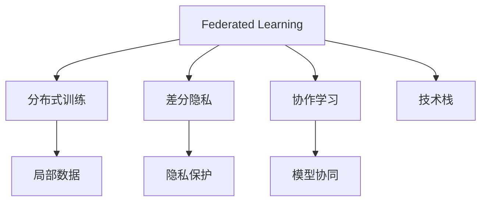

                 

# 联邦学习(Federated Learning) - 原理与代码实例讲解

> 关键词：联邦学习, 分布式训练, 本地数据, 差分隐私, 协作学习, 技术栈, TensorFlow, PyTorch

## 1. 背景介绍

### 1.1 问题由来
随着互联网技术的发展和智能设备的普及，海量用户数据不断产生，数据隐私保护成为愈发严峻的挑战。在传统的集中式训练中，数据集中在中央服务器，容易被黑客攻击和数据泄露。而单个用户或企业的数据往往有限，难以构建高质量的模型。为此，联邦学习(Federated Learning, FL)应运而生，通过分布式计算，使得模型在各个节点上进行训练，而无需将数据集中到中央服务器，从而有效保护用户隐私。

### 1.2 问题核心关键点
联邦学习的基本思想是：多个参与节点（如智能手机、智能手表等）在不共享本地数据的前提下，通过协作更新模型参数，共同构建一个高质量的共享模型。相较于传统的集中式训练，联邦学习能够最大化利用用户数据，同时确保数据隐私，避免单点故障，降低通信开销，适用于分布式环境下的模型训练。

## 2. 核心概念与联系

### 2.1 核心概念概述

为更好地理解联邦学习，本节将介绍几个密切相关的核心概念：

- **联邦学习**：一种分布式机器学习范式，参与节点（如客户端）在不共享本地数据的前提下，通过协作训练共同构建模型。
- **分布式训练**：将训练任务分散到多个节点上，每个节点负责一部分数据，协同更新全局模型参数。
- **差分隐私**：一种保护隐私的技术，在模型训练过程中，对用户的本地数据进行扰动，使得任何单点数据分析无法还原出其他节点的数据。
- **协作学习**：多个节点共同参与训练，分享中间计算结果，以提升模型性能。
- **技术栈**：联邦学习主要使用TensorFlow Federated(TFF)、PyTorch Federated(PTF)等技术栈实现。

这些概念之间的逻辑关系可以通过以下Mermaid流程图来展示：



这个流程图展示出联邦学习的基本组成和关键技术：

1. 联邦学习将训练任务分散到各个节点上。
2. 差分隐私对本地数据进行扰动，确保数据隐私。
3. 协作学习实现节点间的模型参数共享，提升整体模型性能。
4. 技术栈提供了具体的实现工具。

## 3. 核心算法原理 & 具体操作步骤
### 3.1 算法原理概述

联邦学习的核心算法流程包括：

1. 初始化全局模型参数。
2. 各节点从全局模型参数开始，使用本地数据进行训练，得到本地更新。
3. 各节点将本地更新发送给中央服务器，中央服务器计算全局更新。
4. 中央服务器将全局更新发送给各个节点，更新全局模型参数。
5. 重复上述步骤，直至全局模型收敛。

### 3.2 算法步骤详解

**Step 1: 准备数据集**
- 划分数据集为训练集和测试集。
- 选择参与联邦学习的客户端（如移动设备、服务器等）。
- 确定每个客户端的本地数据分布。

**Step 2: 初始化全局模型**
- 选择合适的网络结构（如卷积神经网络、循环神经网络等）。
- 初始化全局模型参数 $\theta_0$。

**Step 3: 进行联邦训练**
- 循环进行以下操作：
  1. 每个客户端获取全局模型参数 $\theta_t$。
  2. 使用本地数据计算本地更新 $\Delta_t$。
  3. 计算全局更新 $\Delta^{\text{avg}}_t$。
  4. 更新全局模型参数：$\theta_{t+1} = \theta_t + \eta\Delta^{\text{avg}}_t$。
  5. 重复至满足停止条件。

**Step 4: 评估模型**
- 在测试集上评估模型性能。
- 根据评估结果调整超参数和训练策略。

### 3.3 算法优缺点

联邦学习的主要优点包括：
1. 数据隐私保护：模型训练在本地进行，数据不离开本地设备，确保了数据隐私。
2. 鲁棒性强：模型参数分散到多个设备，减少单点故障的风险。
3. 提升效率：模型在本地训练，减少了通信开销，提升训练效率。

然而，联邦学习也存在一些局限性：
1. 通信开销：每次模型更新需要传输全局模型参数和本地更新，可能带来较大的通信负担。
2. 本地数据偏差：不同客户端的本地数据可能存在偏差，导致模型训练不一致。
3. 收敛速度慢：由于数据分散在不同客户端，模型参数更新需要多次通信，收敛速度较慢。
4. 硬件要求高：联邦学习通常需要高效的计算资源，如GPU/TPU等。

### 3.4 算法应用领域

联邦学习已在多个领域得到应用，包括但不限于：

- 个性化推荐：通过联邦学习训练推荐模型，实现跨设备推荐，提升用户体验。
- 智能医疗：各医疗机构共享病患数据，协同训练医疗诊断模型，提升诊断精度。
- 智能制造：各工厂通过联邦学习，共享生产数据，训练优化模型，提高生产效率。
- 智能交通：各城市共享交通数据，训练交通预测模型，优化交通流量。
- 金融风控：各金融机构共享风控数据，训练风险评估模型，降低信贷风险。

## 4. 数学模型和公式 & 详细讲解 & 举例说明

### 4.1 数学模型构建

联邦学习的数学模型通常包括客户端数据分布、模型参数更新和全局模型训练。假设客户端总数为 $N$，客户端 $i$ 的本地数据分布为 $D_i$，全局模型参数为 $\theta_t$，本地模型参数为 $\theta_i^t$。

联邦学习的目标是最小化全局损失函数 $\mathcal{L}(\theta)$：

$$
\mathcal{L}(\theta) = \frac{1}{N}\sum_{i=1}^N \mathcal{L}_i(\theta)
$$

其中 $\mathcal{L}_i(\theta)$ 为第 $i$ 个客户端的损失函数。

### 4.2 公式推导过程

以二分类任务为例，假设 $i$ 个客户端的本地数据为 $\{(x_{ij},y_{ij})\}_{j=1}^m$，损失函数为交叉熵损失：

$$
\mathcal{L}_i(\theta) = \frac{1}{m} \sum_{j=1}^m -(y_{ij}\log p_{ij} + (1-y_{ij})\log (1-p_{ij}))
$$

其中 $p_{ij}=\sigma(\theta_i^T x_{ij})$，$\sigma$ 为sigmoid函数。

假设全局模型参数 $\theta_t$ 初始化为 $\theta_0$，客户端在 $t$ 轮训练后更新为 $\theta_i^t$。根据上述公式，可以推导出客户端的本地更新 $\Delta_i^t$：

$$
\Delta_i^t = \nabla_{\theta} \mathcal{L}_i(\theta_i^t)
$$

将本地更新 $\Delta_i^t$ 汇总，得到全局更新 $\Delta^{\text{avg}}_t$：

$$
\Delta^{\text{avg}}_t = \frac{1}{N}\sum_{i=1}^N \Delta_i^t
$$

全局模型参数更新为：

$$
\theta_{t+1} = \theta_t + \eta\Delta^{\text{avg}}_t
$$

### 4.3 案例分析与讲解

以一个简单的示例来说明联邦学习的应用。假设有三个客户端，分别来自中国、美国和印度，它们共享一个目标模型，用于识别图片中的动物类别。每个客户端有 $m=1000$ 张图片，图片尺寸为 $256\times 256$，类别数为 $10$。

假设每个客户端的数据分布和模型初始化相同，每个客户端迭代 $100$ 轮，学习率为 $0.01$。训练后，可以观察到模型在不同客户端上的性能变化。

## 5. 项目实践：代码实例和详细解释说明
### 5.1 开发环境搭建

在进行联邦学习实践前，我们需要准备好开发环境。以下是使用TensorFlow联邦学习的开发环境配置流程：

1. 安装Python 3.6或更高版本，建议使用Anaconda。
2. 安装TensorFlow Federated库，可以通过pip命令进行安装。
3. 安装其他依赖库，如numpy、scikit-learn等。

完成上述步骤后，即可在Anaconda环境下进行联邦学习实践。

### 5.2 源代码详细实现

这里以联邦学习在图像分类任务中的应用为例，展示使用TensorFlow Federated库实现联邦学习的代码。

首先，定义联邦学习环境：

```python
import tensorflow as tf
import tensorflow_federated as tff

# 定义联邦学习上下文
context = tff.learning.server_lib.LocalServer(context=tff.learning.server_lib invariant)
```

然后，定义数据集：

```python
import tff.learning.datasets as datasets

# 加载MNIST数据集
mnist_data = datasets.load_mnist()
```

接着，定义全局模型：

```python
import tff.learning.experimental.particle_mixing as particle_mixing
import tff.learning.iterative_process as iterative_process
import tff.learning.basic_processes as basic_processes
import tff.learning.models as models
import tff.learning.input as input

# 定义全连接网络
def create_mnist_model():
    return models.MnistModel(num_classes=10, width=784, height=28, channel=1)

# 定义训练过程
def train_step(state, batch, model_fn):
    model = model_fn()
    predictions, loss = model.predict(batch['images'])
    accuracy = tf.reduce_mean(tf.cast(tf.equal(predictions, batch['labels']), tf.float32))
    gradients = tf.gradients(loss, model.trainable_variables)
    return input_state.input_state, input_state.update_state(gradients, accuracy)

# 定义模型训练过程
def train_model(model_fn, train_data, batch_size, max_epochs):
    state = input_state.InputState(model_fn)
    train_process = basic_processes.build_train_process(
        train_step, model_fn, train_data, batch_size, optimizer=tf.keras.optimizers.Adam(learning_rate=0.1))
    train_state = train_process.initialize(state)
    for epoch in range(max_epochs):
        train_state = train_process.next(train_state)
    return train_state.model
```

最后，启动联邦学习流程：

```python
# 选择训练集和测试集
train_data, test_data = mnist_data.data['train'], mnist_data.data['test']

# 定义模型函数
model_fn = create_mnist_model

# 定义批大小和最大训练轮数
batch_size = 64
max_epochs = 100

# 训练模型
train_state = train_model(model_fn, train_data, batch_size, max_epochs)

# 评估模型
print("Accuracy:", train_state.model.evaluate(test_data))
```

以上就是使用TensorFlow Federated库实现联邦学习的完整代码实例。可以看到，TensorFlow Federated提供了完整的联邦学习框架，开发者只需关注具体的模型实现和训练过程，而不必过多关注底层的通信细节。

### 5.3 代码解读与分析

让我们再详细解读一下关键代码的实现细节：

**上下文定义**：
- 使用 `tff.learning.server_lib.LocalServer` 创建本地服务器环境，用于分布式训练。

**数据集加载**：
- 使用 `tff.learning.datasets.load_mnist` 加载MNIST数据集，定义训练集和测试集。

**全局模型定义**：
- 定义全连接网络 `MnistModel`，用于图像分类任务。
- 定义训练函数 `train_step`，计算损失和梯度。
- 定义训练过程 `train_model`，使用 `tff.learning.basic_processes.build_train_process` 构建训练过程。

**模型训练**：
- 将数据集划分为训练集和测试集，并加载全局模型。
- 定义批大小和最大训练轮数。
- 调用 `train_model` 函数进行模型训练。
- 在测试集上评估训练后的模型，输出准确率。

可以看到，TensorFlow Federated大大简化了联邦学习的实现，使得联邦学习的代码实现变得简洁高效。开发者可以将更多精力放在模型设计和训练策略上，而不必过多关注通信和分布式计算的细节。

## 6. 实际应用场景
### 6.1 智能推荐系统

联邦学习可以应用于智能推荐系统，提升推荐效果和用户隐私保护。现有的推荐系统通常依赖单一的集中式训练，数据集中在中央服务器上，存在隐私泄露风险。而联邦学习通过在各个客户端上进行本地训练，可以有效保护用户数据隐私。

在实践中，可以收集用户的浏览、点击、评分等数据，并在各个客户端上进行本地模型训练。各客户端将本地训练结果汇总，通过中央服务器进行全局参数更新，最终得到全局推荐模型。由于各客户端数据分布不均，联邦学习可以在数据不平衡的情况下，平衡各个客户端的训练效果，提升推荐模型的整体性能。

### 6.2 医疗健康

联邦学习可以用于医疗健康领域的模型训练，提高诊断和治疗效果。医疗机构可以通过联邦学习，共享患者的健康数据，协同训练医疗诊断模型。由于数据涉及患者隐私，中央服务器无法直接访问这些数据，只能通过联邦学习机制进行模型训练。

在实践中，各医疗机构可以共享患者的病历、影像等数据，并在本地进行模型训练。联邦学习机制可以确保数据隐私，同时提升模型的泛化能力，提高医疗诊断和治疗效果。

### 6.3 智慧交通

联邦学习可以用于智慧交通领域的模型训练，提升交通流量预测和优化效果。交通管理部门可以通过联邦学习，共享各城市的交通数据，协同训练交通流量预测模型。

在实践中，各城市可以共享交通数据，并在本地进行模型训练。联邦学习机制可以确保数据隐私，同时提升模型的泛化能力，提高交通流量预测和优化效果。

## 7. 工具和资源推荐
### 7.1 学习资源推荐

为了帮助开发者系统掌握联邦学习的理论基础和实践技巧，这里推荐一些优质的学习资源：

1. TensorFlow Federated官方文档：提供完整的联邦学习框架和样例代码，是学习联邦学习的首选资料。
2. PyTorch Federated官方文档：提供PyTorch实现的联邦学习框架，具有较好的灵活性。
3. federated_learning系列书籍：由联邦学习领域的专家撰写，系统讲解联邦学习的原理、算法和应用。
4. federated_learning在线课程：涵盖联邦学习的基本概念和前沿研究，适合初学者入门。
5. federated_learning开源项目：提供丰富的联邦学习实现和案例，帮助开发者实践联邦学习。

通过对这些资源的学习实践，相信你一定能够快速掌握联邦学习的精髓，并用于解决实际的NLP问题。

### 7.2 开发工具推荐

高效的开发离不开优秀的工具支持。以下是几款用于联邦学习开发的常用工具：

1. TensorFlow Federated：由Google开发的联邦学习框架，支持分布式计算和差分隐私，是联邦学习的主要技术栈。
2. PyTorch Federated：由Facebook开发的联邦学习框架，支持Python语言，灵活性高。
3. Weights & Biases：模型训练的实验跟踪工具，可以记录和可视化模型训练过程中的各项指标，方便对比和调优。
4. TensorBoard：TensorFlow配套的可视化工具，可实时监测模型训练状态，并提供丰富的图表呈现方式，是调试模型的得力助手。

合理利用这些工具，可以显著提升联邦学习的开发效率，加快创新迭代的步伐。

### 7.3 相关论文推荐

联邦学习技术的发展源于学界的持续研究。以下是几篇奠基性的相关论文，推荐阅读：

1. A Federated Learning Approach for Multi-Client Classification with Partial Labels（ICML 2017）：提出FedAvg算法，通过本地更新和全局平均，在无标签数据下训练分类模型。
2. Federated Learning with Clustered Data（ICML 2017）：提出FedProx算法，利用本地数据相似性，提升联邦学习的收敛速度。
3. Communication-Efficient Learning of Deep Networks from Decentralized Data（NIPS 2017）：提出FedAvg算法，通过本地更新和全局平均，提升联邦学习的效率。
4. A Decentralized Deep Learning Framework with L-shapes Loss for Image Classification（KDD 2019）：提出FedLab框架，支持分布式计算和差分隐私，提升联邦学习的灵活性和安全性。
5. Federated Learning with Statistical Guarantees：Training Under Data and Model Heterogeneity（IEEE T-PAMI 2020）：提出FedML框架，提供联邦学习的多样性优化和理论保证。

这些论文代表了大模型微调技术的发展脉络。通过学习这些前沿成果，可以帮助研究者把握学科前进方向，激发更多的创新灵感。

## 8. 总结：未来发展趋势与挑战

### 8.1 总结

本文对联邦学习进行了全面系统的介绍。首先阐述了联邦学习的研究背景和意义，明确了联邦学习在分布式数据场景下的重要性。其次，从原理到实践，详细讲解了联邦学习的数学模型和具体步骤，给出了联邦学习任务开发的完整代码实例。同时，本文还广泛探讨了联邦学习在智能推荐、医疗健康、智慧交通等多个行业领域的应用前景，展示了联邦学习的巨大潜力。此外，本文精选了联邦学习的各类学习资源，力求为读者提供全方位的技术指引。

通过本文的系统梳理，可以看到，联邦学习作为一种分布式机器学习范式，能够有效保护用户隐私，提升模型性能，适用于多个领域的应用。未来，伴随联邦学习的不断发展，其在更多领域的应用将进一步拓展，为人工智能技术的发展注入新的活力。

### 8.2 未来发展趋势

展望未来，联邦学习技术将呈现以下几个发展趋势：

1. 多层次分布式训练：联邦学习从单层分布式训练向多层分布式训练演进，提升训练效率和模型性能。
2. 隐私保护技术提升：引入差分隐私、安全多方计算等技术，进一步提升数据隐私保护。
3. 模型压缩与优化：通过模型压缩、量化等技术，提升联邦学习的计算效率和通信带宽。
4. 跨设备协同优化：联邦学习在不同设备间协同优化，提升资源利用率和系统效率。
5. 联邦学习平台化：联邦学习框架和工具的逐步成熟，将促进联邦学习在更多场景中的应用。

以上趋势凸显了联邦学习技术的广泛前景。这些方向的探索发展，必将进一步提升联邦学习的灵活性和可扩展性，推动分布式计算和隐私保护技术的进步。

### 8.3 面临的挑战

尽管联邦学习技术已经取得了显著进展，但在迈向更加智能化、普适化应用的过程中，它仍面临一些挑战：

1. 通信开销：联邦学习需要进行频繁的模型更新，导致通信开销较大。如何降低通信开销，提高联邦学习的效率，是需要解决的问题。
2. 数据一致性：不同客户端的本地数据可能存在不一致性，导致联邦学习的收敛困难。如何确保数据的一致性和同步，提高联邦学习的稳定性，还需要进一步研究。
3. 硬件要求高：联邦学习通常需要高效的计算资源，如GPU/TPU等。如何在资源有限的条件下，进行联邦学习，提升联邦学习的灵活性和可扩展性，也是未来的研究重点。
4. 差分隐私问题：差分隐私技术在保护用户隐私方面存在一定的局限性，如何进一步提升隐私保护的强度，是需要解决的问题。
5. 模型收敛性：联邦学习在数据分布不均的情况下，模型收敛性较弱。如何提升联邦学习模型的泛化能力，需要更多的理论和方法支持。

这些挑战需要进一步解决，才能使联邦学习技术在更多场景下得到应用。相信随着学界和产业界的共同努力，联邦学习技术将逐步成熟，推动分布式计算和隐私保护技术的进步。

### 8.4 研究展望

面向未来，联邦学习需要从以下几个方面进行深入研究：

1. 多层次分布式训练：通过多层次分布式训练，提高联邦学习的效率和效果。
2. 隐私保护技术提升：引入差分隐私、安全多方计算等技术，提升数据隐私保护。
3. 模型压缩与优化：通过模型压缩、量化等技术，提升联邦学习的计算效率和通信带宽。
4. 跨设备协同优化：联邦学习在不同设备间协同优化，提升资源利用率和系统效率。
5. 联邦学习平台化：联邦学习框架和工具的逐步成熟，将促进联邦学习在更多场景中的应用。

通过以上研究方向的探索发展，联邦学习必将进一步拓展其应用场景，为人工智能技术的发展注入新的活力。

