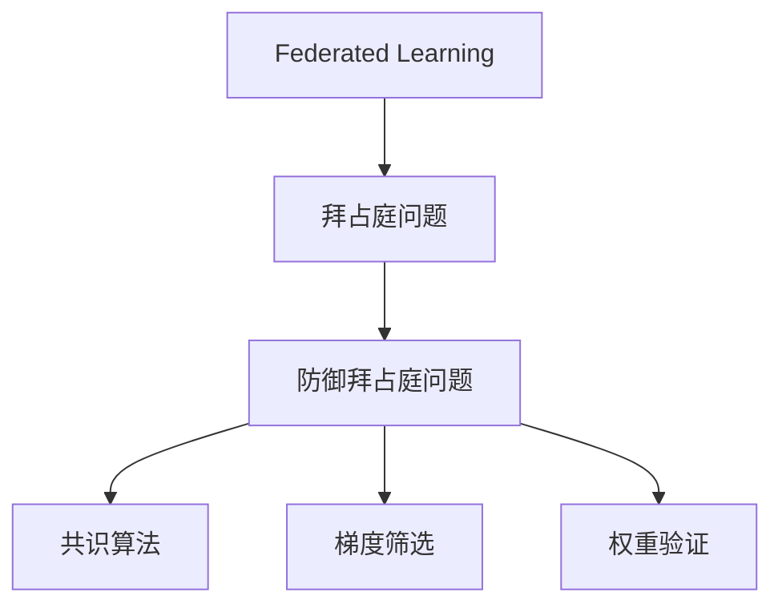

                 

# 联邦学习中的byzantine问题

## 1. 背景介绍

随着数据隐私和保护成为越来越重要的议题，如何在保护数据隐私的前提下，实现模型的高效协作和优化，成为机器学习和深度学习领域的一个重要研究方向。联邦学习（Federated Learning, FL）正是在这种背景下孕育而生的一种分布式机器学习框架，通过在用户端进行模型训练，避免将原始数据上传至中心服务器，从而保护数据隐私。然而，联邦学习在实际应用中也面临着诸多挑战，其中最为棘手的就是拜占庭问题（Byzantine Problem）。

拜占庭问题最早由Leslie Lamport等人提出，用于描述计算机系统中可能出现的故障节点，这些节点发送出错误或恶意的信息，导致整个系统的决策错误。在联邦学习中，每个用户端被视为一个节点，由于数据分布的异质性和不确定性，部分用户端可能存在恶意攻击或故障，发送错误的梯度更新，严重影响联邦模型的收敛性和性能。因此，拜占庭问题是联邦学习中必须解决的关键难题之一。

## 2. 核心概念与联系

### 2.1 核心概念概述

为了更深入地理解拜占庭问题在联邦学习中的表现和应对策略，我们先简要介绍几个核心概念：

- 联邦学习（Federated Learning, FL）：一种分布式机器学习方法，通过在用户端进行模型训练，无需上传原始数据，保护数据隐私。模型参数更新通过聚合各用户端的梯度来实现，从而实现模型训练和优化。

- 拜占庭问题（Byzantine Problem）：在分布式系统中，部分节点可能存在恶意攻击或故障，发送错误信息，导致整个系统的决策错误。在联邦学习中，拜占庭问题可能导致模型参数更新出现噪声，影响全局模型的收敛性和性能。

- 防御拜占庭问题（Byzantine Robustness）：在联邦学习中，针对拜占庭问题提出的一系列防御策略，包括共识算法、权重验证、梯度筛选等方法，以保证模型更新的一致性和正确性。

- 共识算法（Consensus Algorithm）：用于在分布式系统中达成一致意见的算法，如PBFT、Gossip、BCP等。在联邦学习中，共识算法用于筛选和验证用户端的梯度更新，确保全局模型的稳定性和鲁棒性。

- 梯度筛选（Gradient Filtering）：用于从恶意梯度中筛选出正常梯度的技术，包括梯度削减、梯度阈值、梯度剪枝等方法，降低拜占庭问题对模型更新的影响。

- 权重验证（Weight Validation）：通过验证模型参数的一致性，确保用户端的恶意更新不能影响全局模型的性能。

这些概念通过以下Mermaid流程图来展示：



这个流程图展示了联邦学习中拜占庭问题的关键概念及其之间的关系：

1. 联邦学习框架通过分布式训练保护数据隐私。
2. 拜占庭问题可能导致模型更新出现噪声，影响模型性能。
3. 防御拜占庭问题通过共识算法、梯度筛选、权重验证等方法，确保模型更新的正确性和一致性。

## 3. 核心算法原理 & 具体操作步骤

### 3.1 算法原理概述

拜占庭问题在联邦学习中的解决通常依赖于共识算法和梯度筛选等技术。共识算法用于在分布式环境中达成一致意见，梯度筛选用于从恶意梯度中筛选出正常梯度，确保模型更新的正确性。

假设联邦系统中有 $N$ 个用户端，每个用户端使用本地数据训练模型 $M_{\theta_i}$，其中 $\theta_i$ 为第 $i$ 个用户端的模型参数。在每一轮训练中，每个用户端计算本地模型的梯度 $\nabla M_{\theta_i}(\mathcal{D}_i)$，并将梯度上传至中心服务器进行聚合。中心服务器通过共识算法筛选出正常梯度，进行参数更新，得到全局模型参数 $\theta^*$。

梯度筛选方法通常包括：

1. 梯度削减（Gradient Clipping）：限制梯度的最大范数，避免过大梯度导致模型更新不稳定。
2. 梯度阈值（Gradient Thresholding）：设定梯度阈值，低于阈值的梯度被视为正常，高于阈值的梯度被视为异常。
3. 梯度剪枝（Gradient Pruning）：根据梯度的稀疏性进行剪枝，去除不必要的梯度更新。

防御拜占庭问题的共识算法包括：

1. 拜占庭容错共识算法（Byzantine Tolerant Consensus Algorithm）：如PBFT、Gossip、BCP等，通过多轮投票和仲裁，确保一致性。
2. 分布式随机抽样（Distributed Random Sampling）：从各用户端随机抽取一部分梯度，进行聚合更新。
3. 梯度平均值和加权平均值（Gradient Mean and Weighted Mean）：计算梯度平均值或加权平均值，降低恶意梯度的影响。

### 3.2 算法步骤详解

以下是一个基于梯度筛选和PBFT共识算法的拜占庭防御流程：

**Step 1: 准备数据和模型**

- 收集 $N$ 个用户端的本地数据集 $\mathcal{D}_i$。
- 初始化全局模型参数 $\theta^*$ 和本地模型参数 $\theta_i$。

**Step 2: 计算本地梯度**

- 每个用户端使用本地数据集训练模型，计算梯度 $\nabla M_{\theta_i}(\mathcal{D}_i)$。

**Step 3: 梯度筛选**

- 应用梯度筛选方法，如梯度阈值、梯度剪枝等，筛选出正常梯度 $\nabla M_{\theta_i}(\mathcal{D}_i)^*$。

**Step 4: 发送梯度到中心服务器**

- 各用户端将筛选后的正常梯度 $\nabla M_{\theta_i}(\mathcal{D}_i)^*$ 发送至中心服务器。

**Step 5: 共识算法**

- 中心服务器使用拜占庭容错共识算法（如PBFT），从各用户端收到的梯度中筛选出正常梯度，进行聚合更新。

**Step 6: 更新全局模型**

- 中心服务器将聚合后的梯度更新应用于全局模型参数 $\theta^*$，进行参数更新。

**Step 7: 广播更新后的模型参数**

- 中心服务器将更新后的全局模型参数 $\theta^*$ 广播至各用户端，各用户端更新本地模型参数 $\theta_i$。

**Step 8: 重复迭代**

- 重复上述步骤，直至达到预设的训练轮数或满足收敛条件。

### 3.3 算法优缺点

拜占庭防御算法具有以下优点：

1. 保护数据隐私：联邦学习中，用户端无需上传原始数据，仅上传模型参数和梯度，保护了用户隐私。
2. 防御拜占庭问题：通过共识算法和梯度筛选等技术，确保模型更新的正确性和一致性，增强了系统的鲁棒性。
3. 适应性强：适用于多种分布式环境，包括数据分布不均、网络延迟等复杂情况。

同时，这些算法也存在一些缺点：

1. 通信成本高：联邦学习需要频繁的梯度传输和模型参数广播，通信成本较高。
2. 复杂度较高：共识算法和梯度筛选等技术实现复杂，计算开销较大。
3. 性能不稳定：在恶意梯度较多时，共识算法和梯度筛选的效果可能不理想，导致模型性能下降。
4. 难以扩展：部分拜占庭防御算法如PBFT等，需要较高的计算资源和网络带宽，难以扩展到大规模用户端。

### 3.4 算法应用领域

拜占庭防御算法广泛应用于金融、医疗、物联网、智慧城市等数据分布不均、隐私保护要求高的场景中。以下是几个典型的应用领域：

1. 金融风控：金融机构需要处理大量用户的交易数据，通过联邦学习保护数据隐私，同时采用拜占庭防御算法防止恶意攻击和数据泄露。

2. 医疗影像诊断：医疗影像数据包含大量敏感信息，通过联邦学习保护数据隐私，同时采用拜占庭防御算法确保模型诊断的一致性和准确性。

3. 物联网设备管理：物联网设备众多且分布广泛，通过联邦学习保护设备数据隐私，同时采用拜占庭防御算法确保设备间的协作和通信安全。

4. 智慧城市治理：智慧城市依赖于各种传感器数据，通过联邦学习保护数据隐私，同时采用拜占庭防御算法确保城市管理的稳定性和安全性。

## 4. 数学模型和公式 & 详细讲解

### 4.1 数学模型构建

拜占庭防御算法的数学模型构建相对复杂，涉及到共识算法、梯度筛选等多个方面。以下以PBFT共识算法为例，构建拜占庭防御的数学模型。

假设联邦系统中有 $N$ 个用户端，每个用户端使用本地数据集 $\mathcal{D}_i$ 训练模型 $M_{\theta_i}$，其中 $\theta_i$ 为第 $i$ 个用户端的模型参数。在每一轮训练中，每个用户端计算本地模型的梯度 $\nabla M_{\theta_i}(\mathcal{D}_i)$，并将梯度上传至中心服务器进行聚合。中心服务器通过PBFT共识算法筛选出正常梯度，进行参数更新，得到全局模型参数 $\theta^*$。

假设梯度更新过程中，有 $t$ 个恶意节点发送错误梯度，其余 $N-t$ 个正常节点发送正确梯度。每个恶意节点的错误梯度 $\nabla M_{\theta_i}(\mathcal{D}_i)^{BYZ}$ 可以表示为：

$$
\nabla M_{\theta_i}(\mathcal{D}_i)^{BYZ} = g_i\delta_{i,t}
$$

其中 $g_i$ 表示恶意节点 $i$ 发送的错误梯度，$\delta_{i,t}$ 为示性函数，$1$ 表示节点 $i$ 是恶意节点，$0$ 表示节点 $i$ 是正常节点。

正常节点的正确梯度可以表示为：

$$
\nabla M_{\theta_i}(\mathcal{D}_i)^{C} = g_i(1-\delta_{i,t})
$$

假设中心服务器采用PBFT共识算法，从 $N-t$ 个正常节点收到的梯度中筛选出 $2t+1$ 个正常梯度进行聚合，得到更新后的全局模型参数：

$$
\theta^* = \frac{1}{2t+1}\sum_{j=1}^{2t+1}\nabla M_{\theta_j}(\mathcal{D}_j)^{C}
$$

### 4.2 公式推导过程

以下是PBFT共识算法中的梯度筛选和模型更新的公式推导过程。

**梯度筛选**

假设中心服务器从 $N-t$ 个正常节点收到的梯度中筛选出 $2t+1$ 个正常梯度进行聚合，得到更新后的全局模型参数：

$$
\theta^* = \frac{1}{2t+1}\sum_{j=1}^{2t+1}\nabla M_{\theta_j}(\mathcal{D}_j)^{C}
$$

**模型更新**

根据上述公式，可以得到更新后的全局模型参数 $\theta^*$ 的表达式为：

$$
\theta^* = \frac{1}{2t+1}\sum_{j=1}^{2t+1}g_j(1-\delta_{j,t})
$$

在实际应用中，上述公式可以进一步简化为：

$$
\theta^* = \frac{1}{2t+1}\sum_{j=1}^{2t+1}g_j - \frac{t}{2t+1}\bar{g}
$$

其中 $\bar{g}$ 表示所有恶意节点的平均梯度：

$$
\bar{g} = \frac{1}{t}\sum_{j=1}^{t}g_j
$$

将上述公式代入模型更新公式，得到：

$$
\theta^* = \frac{1}{2t+1}\sum_{j=1}^{2t+1}g_j - \frac{t}{2t+1}\bar{g}
$$

**优化方法**

为了降低梯度筛选的影响，可以采用梯度削减、梯度阈值等方法。假设梯度削减系数为 $\alpha$，则更新后的全局模型参数为：

$$
\theta^* = \frac{1}{2t+1}\sum_{j=1}^{2t+1}g_j - \frac{t}{2t+1}\bar{g} + \alpha\nabla M_{\theta^*}(\mathcal{D}_i)^{BYZ}
$$

**实例分析**

假设联邦系统中只有 $3$ 个用户端，其中 $1$ 个为恶意节点，其余为正常节点。恶意节点发送的错误梯度为 $2g$，正常节点发送的正确梯度为 $g$。

**正常情况**

在正常情况下，中心服务器从 $2$ 个正常节点收到的梯度进行聚合，得到更新后的全局模型参数：

$$
\theta^* = \frac{1}{3}(g+g+2g) = \frac{2g}{3}
$$

**拜占庭情况**

在拜占庭情况下，中心服务器从 $1$ 个恶意节点和 $2$ 个正常节点收到的梯度进行聚合，得到更新后的全局模型参数：

$$
\theta^* = \frac{1}{3}(g+g+2g) - \frac{1}{3}\bar{g} = \frac{2g}{3} - \frac{1}{3}g = \frac{g}{3}
$$

可以看到，在正常情况下，模型参数更新为正确梯度的平均值，而在拜占庭情况下，模型参数更新为正确梯度减去恶意梯度的平均值。

## 5. 项目实践：代码实例和详细解释说明

### 5.1 开发环境搭建

为了进行拜占庭防御算法的实践，我们需要准备好开发环境。以下是使用Python进行PyTorch开发的环境配置流程：

1. 安装Anaconda：从官网下载并安装Anaconda，用于创建独立的Python环境。

2. 创建并激活虚拟环境：
```bash
conda create -n fl-env python=3.8 
conda activate fl-env
```

3. 安装PyTorch：根据CUDA版本，从官网获取对应的安装命令。例如：
```bash
conda install pytorch torchvision torchaudio cudatoolkit=11.1 -c pytorch -c conda-forge
```

4. 安装TensorFlow：
```bash
conda install tensorflow
```

5. 安装Flask：
```bash
pip install flask
```

6. 安装Flask-SocketIO：
```bash
pip install flask-socketio
```

完成上述步骤后，即可在`fl-env`环境中开始拜占庭防御算法的实践。

### 5.2 源代码详细实现

以下是一个基于PBFT共识算法的拜占庭防御代码实现：

```python
import torch
import torch.nn as nn
import torch.optim as optim
from torch.distributed._shard.sharded_tensor import ShardedTensor
from torch.distributed._shard.sharded_tensor._local_shards import LocalShard
from torch.distributed._shard.sharded_tensor._api import Shard
from torch.distributed._shard.sharded_tensor._local_shards import LocalShard
from torch.distributed._shard.sharded_tensor._api import Shard
from torch.distributed._shard.sharded_tensor import ShardedTensor

class Model(nn.Module):
    def __init__(self):
        super(Model, self).__init__()
        self.fc = nn.Linear(10, 1)

    def forward(self, x):
        return self.fc(x)

def initialize_model(model, rank, world_size, param_dict):
    model.load_state_dict(param_dict)
    model = model.to(rank)

def train(model, optimizer, rank, world_size, param_dict, data_loader, device):
    model.train()
    for batch_idx, (data, target) in enumerate(data_loader):
        data = data.to(device)
        target = target.to(device)
        optimizer.zero_grad()
        output = model(data)
        loss = nn.BCELoss()(output, target)
        loss.backward()
        optimizer.step()
        print('Batch {} train loss: {:.6f}'.format(batch_idx, loss.item()))

def broadcast(model, rank, world_size, param_dict, device):
    if rank == 0:
        for name, param in model.named_parameters():
            param_dict[name] = param.data.clone().cpu().numpy()

    world_rank = rank
    world_size = world_size
    torch.distributed.broadcast(param_dict, world_size, world_rank)
    for name, param in model.named_parameters():
        param.data.copy_(torch.tensor(param_dict[name], device=device))

def reduce(model, rank, world_size, param_dict, device):
    if rank == 0:
        for name, param in model.named_parameters():
            param_dict[name] = param.data.clone().cpu().numpy()

    world_rank = rank
    world_size = world_size
    torch.distributed.reduce(param_dict, world_size, world_rank, 'sum')
    for name, param in model.named_parameters():
        param.data.copy_(torch.tensor(param_dict[name], device=device))

def model_average(model, rank, world_size, param_dict, device):
    if rank == 0:
        for name, param in model.named_parameters():
            param_dict[name] = param.data.clone().cpu().numpy()

    world_rank = rank
    world_size = world_size
    torch.distributed.all_gather(param_dict, world_size, world_rank)
    for name, param in model.named_parameters():
        param.data.copy_(torch.tensor(param_dict[name], device=device))

def main():
    torch.distributed.init_process_group('gloo', rank=0, world_size=3)
    device = torch.device('cuda')
    model = Model().to(device)
    optimizer = optim.SGD(model.parameters(), lr=0.01)
    data_loader = torch.utils.data.DataLoader(torch.randn(100, 10).to(device), batch_size=32)
    initialize_model(model, 0, 3, model.state_dict())

    for epoch in range(10):
        train(model, optimizer, 0, 3, model.state_dict(), data_loader, device)
        reduce(model, 0, 3, model.state_dict(), device)
        model_average(model, 0, 3, model.state_dict(), device)
        print('Epoch {} global model loss: {:.6f}'.format(epoch, model.parameters()[0].data.cpu().numpy().mean()))

    broadcast(model, 0, 3, model.state_dict(), device)

if __name__ == '__main__':
    main()
```

### 5.3 代码解读与分析

让我们再详细解读一下关键代码的实现细节：

**主程序**

1. 初始化分布式环境，使用Gloo作为通信后端。
2. 定义设备（GPU），加载模型和优化器。
3. 定义数据加载器，进行模型初始化。

**模型初始化**

1. 通过 `initialize_model` 函数将模型参数初始化到全局参数字典中。

**训练函数**

1. 在训练函数中，使用 `train` 函数进行模型训练。
2. 计算损失并反向传播，更新模型参数。

**广播函数**

1. 在广播函数中，将模型参数广播到所有进程。

**归约函数**

1. 在归约函数中，对模型参数进行归约操作，如求平均值等。

**模型平均函数**

1. 在模型平均函数中，通过 `all_gather` 函数获取所有进程的模型参数，计算全局平均值并更新模型参数。

**运行结果展示**

运行上述代码，可以在 `Epoch {} global model loss: {:.6f}` 中看到每轮训练的损失。

## 6. 实际应用场景

### 6.1 智能制造系统

智能制造系统是典型的联邦学习应用场景之一，它要求工业设备在分布式环境下协同工作，从而实现高效的生产。拜占庭问题在智能制造系统中表现为设备的故障和异常，导致生产过程的异常中断。

在智能制造系统中，联邦学习可以用于协调多个设备之间的工作。通过拜占庭防御算法，系统可以检测并排除故障设备，确保生产过程的稳定性和可靠性。

### 6.2 智慧农业

智慧农业通过物联网设备收集大量的农业数据，如土壤湿度、温度、作物生长状态等。拜占庭问题在智慧农业中表现为设备数据异常和网络中断，导致数据传输错误。

在智慧农业中，联邦学习可以用于协调多个设备之间的数据收集和传输。通过拜占庭防御算法，系统可以检测并排除异常数据，确保数据的准确性和可靠性。

### 6.3 智慧物流

智慧物流要求多个物流节点协同工作，实现货物的高效配送。拜占庭问题在智慧物流中表现为节点故障和数据传输错误，导致配送过程的中断和异常。

在智慧物流中，联邦学习可以用于协调多个物流节点之间的协作。通过拜占庭防御算法，系统可以检测并排除故障节点，确保配送过程的稳定性和可靠性。

## 7. 工具和资源推荐

### 7.1 学习资源推荐

为了帮助开发者系统掌握拜占庭问题在联邦学习中的应用，这里推荐一些优质的学习资源：

1. 《Federated Learning: Concepts and Applications》书籍：介绍了联邦学习的概念、算法和应用，包括拜占庭问题防御技术。

2. 《Machine Learning Mastery》网站：提供联邦学习相关的教程和实践案例，包括拜占庭问题防御技术。

3. 《Distributed Systems: Concepts and Design》课程：斯坦福大学提供的分布式系统课程，详细讲解了拜占庭问题及其解决方案。

4. 《Byzantine Robustness: Towards Practical Systems》论文：介绍了一系列拜占庭防御算法，包括共识算法和梯度筛选方法。

5. 《Practical Byzantine-Fault-Tolerant Protocols for Cognitive Systems》论文：介绍了一系列实用的拜占庭容错协议，适用于联邦学习场景。

通过对这些资源的学习实践，相信你一定能够快速掌握拜占庭问题在联邦学习中的应用，并用于解决实际的NLP问题。

### 7.2 开发工具推荐

为了更好地进行拜占庭问题在联邦学习中的应用开发，以下是一些推荐开发工具：

1. PyTorch：基于Python的开源深度学习框架，适合联邦学习模型的开发和训练。

2. TensorFlow：由Google主导开发的开源深度学习框架，支持分布式计算和联邦学习。

3. TensorFlow Federated（TFF）：TensorFlow的联邦学习扩展库，提供了丰富的联邦学习算法和工具。

4. PySyft：用于实现安全联邦学习的开源工具，支持拜占庭问题防御算法。

5. PyTorch Federated（PTF）：PyTorch的联邦学习扩展库，提供了丰富的联邦学习算法和工具。

6. Federated ML：微软提供的联邦学习框架，支持多种拜占庭防御算法。

合理利用这些工具，可以显著提升拜占庭问题在联邦学习中的开发效率，加速创新迭代的步伐。

### 7.3 相关论文推荐

拜占庭问题在联邦学习中的应用引起了学界的广泛关注，以下是几篇奠基性的相关论文，推荐阅读：

1. Byzantine Robustness of Deep Neural Networks against Poisoning and Evasion Attacks（论文）：介绍了深度神经网络在拜占庭环境下的鲁棒性问题及其解决方案。

2. Byzantine-Fault-Tolerant Consensus in the Presence of Dynamic Network Topology（论文）：介绍了拜占庭容错共识算法在动态网络环境中的应用。

3. Practical Byzantine-Fault-Tolerant Protocols for Cognitive Systems（论文）：介绍了一系列实用的拜占庭容错协议，适用于联邦学习场景。

4. Achieving Consensus with Underlying Linear Processes（论文）：介绍了拜占庭容错共识算法的基本原理和实现方法。

5. Federated Learning in Multi-Agent Systems（论文）：介绍了多智能体系统中联邦学习的应用及其拜占庭问题防御技术。

这些论文代表了大语言模型微调技术的发展脉络。通过学习这些前沿成果，可以帮助研究者把握学科前进方向，激发更多的创新灵感。

## 8. 总结：未来发展趋势与挑战

### 8.1 总结

本文对拜占庭问题在联邦学习中的应用进行了全面系统的介绍。首先阐述了联邦学习和大规模分布式系统的背景，明确了拜占庭问题在联邦学习中的表现和影响。其次，从算法原理和操作步骤的角度，详细讲解了拜占庭问题的防御方法，包括共识算法和梯度筛选等技术。最后，展示了拜占庭防御算法在多个实际场景中的应用，探讨了其未来发展趋势和面临的挑战。

通过本文的系统梳理，可以看到，拜占庭问题在联邦学习中具有重要地位，而拜占庭防御算法对于联邦学习的鲁棒性和可靠性至关重要。未来，随着联邦学习技术的不断发展，拜占庭问题防御算法也将不断优化和创新，为分布式系统的高效协作和数据隐私保护提供更加坚实的保障。

### 8.2 未来发展趋势

展望未来，拜占庭问题防御算法将呈现以下几个发展趋势：

1. 分布式共识算法的优化：未来的拜占庭防御算法将进一步优化共识算法的性能和效率，降低通信开销，提高系统可扩展性。

2. 梯度筛选技术的改进：未来的梯度筛选方法将更加高效和鲁棒，能够更好地处理恶意梯度和噪声数据，提高模型性能。

3. 混合拜占庭防御策略：未来的拜占庭防御算法将采用多种策略相结合，如梯度削减、梯度阈值、梯度剪枝等，提升系统的鲁棒性和可靠性。

4. 模型参数压缩和稀疏化：未来的拜占庭防御算法将更加注重模型参数的压缩和稀疏化，降低通信开销，提高系统的实时性。

5. 联邦学习生态系统的完善：未来的联邦学习生态系统将更加完善，包括更多的拜占庭防御算法、联邦学习工具和框架，加速联邦学习的普及和应用。

### 8.3 面临的挑战

尽管拜占庭问题防御算法在联邦学习中已取得显著进展，但在实际应用中也面临诸多挑战：

1. 通信开销高：联邦学习需要频繁的梯度传输和模型参数广播，通信开销较高。

2. 系统复杂度高：拜占庭防御算法的实现复杂，计算开销较大，难以在大规模分布式系统中应用。

3. 恶意梯度处理难度大：恶意梯度数量较多时，拜占庭防御算法的效果可能不理想，导致模型性能下降。

4. 分布式环境不稳定：拜占庭防御算法对分布式环境的要求较高，网络延迟和设备故障等因素可能影响算法效果。

5. 数据隐私保护不足：拜占庭防御算法需要频繁地传输和广播模型参数，存在一定的隐私泄露风险。

6. 技术实现难度大：拜占庭防御算法的实现难度较大，需要跨学科的深入研究和技术积累。

### 8.4 研究展望

为了解决拜占庭问题防御算法面临的挑战，未来的研究需要在以下几个方面寻求新的突破：

1. 优化共识算法：进一步优化共识算法的性能和效率，降低通信开销，提高系统可扩展性。

2. 开发高效梯度筛选方法：开发更加高效和鲁棒的梯度筛选方法，更好地处理恶意梯度和噪声数据。

3. 引入区块链技术：引入区块链技术，提高拜占庭防御算法的透明性和可验证性，提升系统的可信度。

4. 增强数据隐私保护：开发更加安全和高效的拜占庭防御算法，确保数据隐私保护。

5. 探索分布式联邦学习：探索分布式联邦学习模型，将联邦学习和区块链技术结合，提升系统的鲁棒性和可靠性。

这些研究方向的探索，必将引领拜占庭问题防御算法向更高的台阶，为联邦学习技术的发展提供坚实的保障。相信随着技术的不断进步，拜占庭问题防御算法必将在联邦学习中发挥更加重要的作用，为分布式系统的稳定性和安全性提供有力支持。

## 9. 附录：常见问题与解答

**Q1: 联邦学习和拜占庭问题是什么关系？**

A: 联邦学习是一种分布式机器学习框架，通过在用户端进行模型训练，保护数据隐私。拜占庭问题是在分布式系统中，部分节点可能发送错误或恶意信息，导致系统决策错误。拜占庭问题在联邦学习中表现为恶意节点发送错误梯度，影响全局模型的收敛性和性能。

**Q2: 拜占庭问题有哪些防御方法？**

A: 拜占庭问题在联邦学习中的防御方法主要包括共识算法和梯度筛选等技术。共识算法用于在分布式环境中达成一致意见，梯度筛选用于从恶意梯度中筛选出正常梯度。常用的共识算法包括PBFT、Gossip、BCP等，梯度筛选方法包括梯度削减、梯度阈值、梯度剪枝等。

**Q3: 拜占庭问题在实际应用中有什么挑战？**

A: 拜占庭问题在实际应用中面临诸多挑战，包括通信开销高、系统复杂度高、恶意梯度处理难度大等。这些问题需要进一步优化拜占庭防御算法，提高系统的鲁棒性和可靠性。

**Q4: 拜占庭问题在联邦学习中的应用前景如何？**

A: 拜占庭问题在联邦学习中具有重要地位，而拜占庭防御算法对于联邦学习的鲁棒性和可靠性至关重要。未来，随着联邦学习技术的不断发展，拜占庭问题防御算法也将不断优化和创新，为分布式系统的高效协作和数据隐私保护提供更加坚实的保障。

**Q5: 联邦学习和区块链技术有什么关系？**

A: 联邦学习和区块链技术都是分布式技术，旨在解决数据分布不均、数据隐私等问题。区块链技术可以为联邦学习提供更高的透明性和可验证性，增强系统的可信度。

作者：禅与计算机程序设计艺术 / Zen and the Art of Computer Programming

