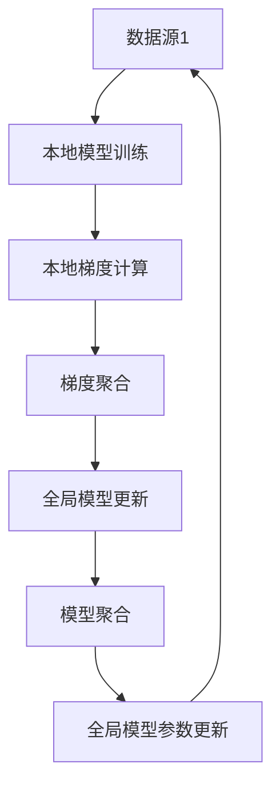

                 

# 联邦学习在金融行业的实践与前景

> 关键词：联邦学习,金融行业,数据安全,隐私保护,智能风控,隐私计算,联邦学习框架,前沿技术

## 1. 背景介绍

### 1.1 问题由来

随着人工智能技术在金融行业的广泛应用，大数据分析、智能风控、信用评估等金融场景的应用需求日益增长。然而，金融数据涉及个人隐私和经济安全，单一中心化存储的局限性日益凸显。传统的集中式数据中心模式容易遭受数据泄露、黑客攻击等安全威胁，导致数据安全和隐私保护成为金融行业发展的一大障碍。

为解决这些问题，联邦学习（Federated Learning, FL）应运而生。联邦学习是一种分布式机器学习方法，多个数据源在不共享原始数据的前提下，联合训练模型，共同提升模型性能。这种模式既能保护数据隐私，又能实现模型联邦的统一协作。

### 1.2 问题核心关键点

联邦学习在金融行业的应用主要包括：

- 数据隐私保护：通过分布式训练模式，确保各数据源隐私数据不泄露。
- 智能风控：在金融风险管理中应用联邦学习，构建智能风控系统。
- 信用评估：联合银行、保险、电商等各数据源，共同训练信用评估模型。
- 金融预测：基于跨行、跨机构的数据集，联合训练金融预测模型。
- 联合反欺诈：通过各机构间的联合训练，提升金融反欺诈能力。

以上几个关键点体现了联邦学习在金融行业的潜在价值和应用前景。

### 1.3 问题研究意义

研究联邦学习在金融行业的实践与前景，对于推动金融科技的创新发展具有重要意义：

1. **保障数据安全**：通过联邦学习，各金融机构可以保护客户隐私，避免数据泄露风险。
2. **提升风控能力**：联邦学习可联合多方数据，构建更全面、准确的信用评估和风险评估模型。
3. **促进合作共赢**：通过联邦学习，各金融机构可以共享模型知识，降低重复投资和开发成本。
4. **推动行业标准**：联邦学习为金融数据治理和共享提供新的解决方案，有助于建立统一标准。
5. **加速应用落地**：联邦学习使得金融机构能够快速构建智能风控系统，提升业务效率。

## 2. 核心概念与联系

### 2.1 核心概念概述

为更好地理解联邦学习在金融行业的应用，本节将介绍几个关键核心概念及其联系：

- **联邦学习（Federated Learning, FL）**：一种分布式机器学习方法，多个数据源联合训练模型，共享模型参数，不共享原始数据，确保数据隐私。
- **分布式训练（Distributed Training）**：将模型训练任务分布到多个计算节点上进行，每个节点仅保留部分模型参数，不泄露全量数据。
- **聚合（Aggregation）**：定期将各节点模型参数合并到中心服务器，进行全局模型更新。
- **梯度聚合（Gradient Aggregation）**：各节点将本地梯度值传递给中心服务器，中心服务器汇总并更新全局模型。
- **同态加密（Homomorphic Encryption）**：一种加密方式，可以在不解密数据的情况下，对数据进行计算。

这些核心概念共同构成了联邦学习的基本框架，确保了模型联邦的隐私保护和数据安全。

### 2.2 核心概念原理和架构的 Mermaid 流程图



以上流程图展示了联邦学习的核心流程：各数据源在本地训练模型，计算本地梯度，将梯度传递到中心服务器进行聚合，更新全局模型参数，并返回给各数据源进行下一次本地训练。

## 3. 核心算法原理 & 具体操作步骤
### 3.1 算法原理概述

联邦学习在金融行业的核心原理是，各金融机构保留原始数据，仅在本地训练模型和计算梯度，然后将梯度传递给中心服务器进行模型聚合。中心服务器将聚合后的梯度用于更新全局模型，并将新的全局模型参数分发给各数据源，进行下一次本地训练。

其核心步骤如下：

1. **本地训练**：各数据源在本地数据上训练模型，计算本地梯度。
2. **梯度聚合**：将本地梯度传递给中心服务器进行聚合。
3. **全局模型更新**：中心服务器根据聚合后的梯度，更新全局模型参数。
4. **模型分发**：将更新后的全局模型参数分发给各数据源。

### 3.2 算法步骤详解

以下详细介绍联邦学习在金融行业的具体实施步骤：

**Step 1: 数据准备与预处理**
- 准备金融数据集，包括但不限于用户交易记录、信用评分、贷款申请、保险索赔等。
- 对数据进行预处理，包括去噪、缺失值填补、标准化等。

**Step 2: 构建联邦学习框架**
- 选择适合金融场景的联邦学习框架，如FederatedAvg、FedProx、SPIDER等。
- 设计适合金融任务的任务适配层，如分类、回归、聚类等。
- 配置联邦学习参数，包括学习率、聚合次数、通信频率等。

**Step 3: 本地训练与梯度聚合**
- 各数据源在本地数据集上训练模型，计算本地梯度。
- 将本地梯度发送到中心服务器，中心服务器汇总后进行梯度聚合。
- 中心服务器根据聚合后的梯度更新全局模型参数。

**Step 4: 全局模型分发与本地更新**
- 将更新后的全局模型参数分发给各数据源。
- 各数据源使用新的全局模型参数进行本地训练，并计算新的本地梯度。
- 重复Step 3和Step 4，直到模型收敛或达到预设迭代次数。

### 3.3 算法优缺点

联邦学习在金融行业的优势包括：
1. **数据隐私保护**：各数据源仅在本地训练模型，不共享原始数据，保护数据隐私。
2. **模型鲁棒性**：通过联合多个数据源的模型参数，提高模型的鲁棒性和泛化能力。
3. **成本节约**：共享模型参数，降低重复训练和模型开发成本。
4. **动态更新**：模型可以随时动态更新，适应金融市场变化。

同时，联邦学习也存在一些局限：
1. **通信开销大**：联邦学习需要频繁的通信操作，尤其是在数据量大、模型复杂的情况下，通信开销较大。
2. **模型收敛速度慢**：由于各数据源数据分布差异较大，模型收敛速度可能较慢。
3. **安全风险**：如果通信网络不安全，存在被攻击的风险。
4. **可扩展性**：在大规模数据和模型情况下，联邦学习需要更高效的算法和框架支持。

### 3.4 算法应用领域

联邦学习在金融行业的广泛应用主要包括以下几个领域：

- **智能风控**：基于联邦学习构建智能风控系统，联合多方数据进行信用评估和风险预测。
- **反欺诈**：通过联邦学习联合多家银行和电商平台，提升反欺诈能力。
- **信用评估**：在联合贷款场景中，利用联邦学习对多个数据源的用户信用数据进行联合评估。
- **市场预测**：联合多家金融机构，基于联邦学习进行股票、货币等金融市场预测。
- **个性化推荐**：联合各金融机构的客户数据，构建个性化金融产品推荐系统。

## 4. 数学模型和公式 & 详细讲解 & 举例说明

### 4.1 数学模型构建

在金融场景中，通常使用二分类模型进行风险评估和预测，如逻辑回归、支持向量机等。假设数据源 $S_i$ 有 $N_i$ 条本地样本 $(x_{i,j}, y_{i,j})$，其中 $x_{i,j} \in \mathbb{R}^d$ 为特征向量，$y_{i,j} \in \{0,1\}$ 为标签。各数据源本地训练的模型参数为 $\theta_i$，模型输出为 $h_i(x)=\sigma(\theta_i^T x)$，其中 $\sigma$ 为激活函数。

### 4.2 公式推导过程

联邦学习的目标是最小化全局损失函数 $\mathcal{L}_{\text{global}}$，其中包含各数据源的本地损失函数 $\mathcal{L}_i$。假设各数据源损失函数相同，则全局损失函数为：

$$
\mathcal{L}_{\text{global}} = \frac{1}{N} \sum_{i=1}^{N} \sum_{j=1}^{N_i} \mathcal{L}_i(x_{i,j}, y_{i,j})
$$

联邦学习的优化目标是最小化全局损失函数，即：

$$
\mathop{\min}_{\theta} \mathcal{L}_{\text{global}}
$$

其中，全局模型参数 $\theta$ 为各本地模型参数的加权平均值：

$$
\theta = \frac{1}{N} \sum_{i=1}^{N} \theta_i
$$

### 4.3 案例分析与讲解

假设某银行有 $N=3$ 个数据源，每个数据源有 $N_i$ 条本地样本 $(x_{i,j}, y_{i,j})$。银行希望联合这些数据源，训练一个二分类模型进行信用评估。

1. **本地训练**：
   - 每个数据源在本地数据上训练模型，计算本地梯度。
   - 设本地模型参数为 $\theta_i$，则本地梯度为 $\partial \mathcal{L}_i(x_{i,j}, y_{i,j}) / \partial \theta_i$。

2. **梯度聚合**：
   - 各数据源将本地梯度传递给中心服务器。
   - 中心服务器对所有本地梯度进行加权平均，得到全局梯度：
     $$
     \partial \mathcal{L}_{\text{global}} / \partial \theta = \frac{1}{N} \sum_{i=1}^{N} \partial \mathcal{L}_i(x_{i,j}, y_{i,j}) / \partial \theta_i
     $$

3. **全局模型更新**：
   - 中心服务器根据全局梯度更新全局模型参数 $\theta$。
   - 更新后的全局模型参数 $\theta_{\text{global}} = \theta - \eta \partial \mathcal{L}_{\text{global}} / \partial \theta$。

4. **模型分发与本地更新**：
   - 中心服务器将更新后的全局模型参数 $\theta_{\text{global}}$ 分发给各数据源。
   - 各数据源使用新的全局模型参数 $\theta_{\text{global}}$ 进行本地训练，并计算新的本地梯度。
   - 重复上述步骤，直到模型收敛或达到预设迭代次数。

## 5. 项目实践：代码实例和详细解释说明
### 5.1 开发环境搭建

在进行联邦学习实践前，我们需要准备好开发环境。以下是使用Python进行PyTorch开发的环境配置流程：

1. 安装Anaconda：从官网下载并安装Anaconda，用于创建独立的Python环境。

2. 创建并激活虚拟环境：
```bash
conda create -n fl-env python=3.8 
conda activate fl-env
```

3. 安装PyTorch：根据CUDA版本，从官网获取对应的安装命令。例如：
```bash
conda install pytorch torchvision torchaudio cudatoolkit=11.1 -c pytorch -c conda-forge
```

4. 安装相关库：
```bash
pip install numpy pandas scikit-learn torchmetrics pytorch-lightning
```

5. 安装FedML库：
```bash
pip install git+https://github.com/fedml/fedml.git
```

完成上述步骤后，即可在`fl-env`环境中开始联邦学习实践。

### 5.2 源代码详细实现

下面我们以联邦学习在信用评估任务中的应用为例，给出使用FedML库对逻辑回归模型进行联邦训练的PyTorch代码实现。

首先，定义信用评估任务的模型：

```python
import torch
import torch.nn as nn
import torch.nn.functional as F
from fl import FL, FLClient

class LogisticRegression(nn.Module):
    def __init__(self, input_dim):
        super(LogisticRegression, self).__init__()
        self.fc = nn.Linear(input_dim, 1)

    def forward(self, x):
        return F.sigmoid(self.fc(x))

# 定义训练函数
def train_client(client, client_id, global_model, batch_size, num_epochs, lr):
    model = LogisticRegression(client.get_input_dim())
    model.train()
    for epoch in range(num_epochs):
        optimizer = torch.optim.SGD(model.parameters(), lr)
        for batch in tqdm(client.get_data(batch_size), total=len(client.get_data(batch_size))):
            x, y = batch
            y_pred = model(x)
            loss = F.binary_cross_entropy(y_pred, y)
            optimizer.zero_grad()
            loss.backward()
            optimizer.step()
    client.set_model(model)

# 定义通信轮数、聚合次数和训练轮数
num_rounds = 5
num_aggregations = 5
num_epochs = 5
batch_size = 32
lr = 0.1

# 定义全局模型参数和本地模型参数
global_model_params = torch.nn.Parameter(torch.zeros(1))
client_params = torch.nn.Parameter(torch.zeros(1))

# 初始化联邦学习客户端
client1 = FLClient(1, num_aggregations, train_client, global_model_params, client_params)
client2 = FLClient(2, num_aggregations, train_client, global_model_params, client_params)

# 定义联邦学习框架
fl = FL(model_class=nn.Linear, loss_function=F.binary_cross_entropy, optimizer_class=torch.optim.SGD)
fl.add_client(client1)
fl.add_client(client2)

# 训练模型
fl.train(num_rounds, num_epochs=num_epochs, batch_size=batch_size, lr=lr)

# 获取全局模型参数
global_model = fl.get_global_model()
print(global_model)
```

### 5.3 代码解读与分析

让我们再详细解读一下关键代码的实现细节：

**LogisticRegression类**：
- 定义了逻辑回归模型的前向传播和后向传播。
- 构造函数中初始化线性层，并在前向传播中使用激活函数 `F.sigmoid`。

**train_client函数**：
- 对单个客户端进行本地训练，计算本地梯度，并更新本地模型参数。

**联邦学习框架**：
- 初始化全局模型参数 `global_model_params` 和本地模型参数 `client_params`。
- 创建两个联邦学习客户端 `client1` 和 `client2`，设置通信轮数、聚合次数和训练函数。
- 创建联邦学习框架，添加两个客户端，并配置训练轮数、批次大小和学习率。
- 开始训练模型，并在训练过程中定期更新全局模型参数。

**获取全局模型参数**：
- 通过联邦学习框架 `fl` 获取全局模型参数 `global_model`。

可以看到，PyTorch配合FedML库使得联邦学习模型的开发变得简洁高效。开发者可以将更多精力放在数据处理、模型改进等高层逻辑上，而不必过多关注底层的实现细节。

## 6. 实际应用场景

### 6.1 智能风控系统

联邦学习在智能风控系统中具有广泛的应用前景。通过联合多个金融机构的数据，构建全局模型，可以更全面、准确地评估用户的信用风险。

具体而言，各金融机构可以将用户的历史交易记录、信用评分、贷款申请等信息上传到中心服务器，中心服务器使用联邦学习算法，构建全局信用评估模型。模型在训练过程中，各金融机构只上传本地模型参数和梯度，不泄露原始数据，从而保护用户隐私。

### 6.2 联合反欺诈系统

欺诈检测是一个典型的多标签分类任务。在联合反欺诈系统中，各金融机构可以联合训练一个多标签分类模型，识别各种类型的欺诈行为。

例如，银行、电商、保险公司等各机构可以将用户的交易记录、消费行为、保险记录等信息上传到中心服务器，中心服务器使用联邦学习算法，构建联合反欺诈模型。模型在训练过程中，各金融机构只上传本地模型参数和梯度，不泄露原始数据，从而保护用户隐私。

### 6.3 信用评估系统

联邦学习在信用评估系统中也有重要应用。联合多家金融机构的数据，可以构建一个更全面、准确的信用评估模型，帮助金融机构更好地进行贷款审批。

例如，银行、保险公司、电商等各机构可以将用户的信用评分、消费记录、贷款申请等信息上传到中心服务器，中心服务器使用联邦学习算法，构建全局信用评估模型。模型在训练过程中，各金融机构只上传本地模型参数和梯度，不泄露原始数据，从而保护用户隐私。

### 6.4 未来应用展望

随着联邦学习技术的不断发展，其应用领域将进一步扩展。未来联邦学习将在以下几个方向取得更大突破：

1. **跨机构联合模型**：联邦学习可以联合多个机构的模型，构建更加复杂、强大的模型。例如，联合银行、保险公司、电商等数据，构建更全面的信用评估和风险评估模型。

2. **模型联邦训练**：联邦学习不仅限于模型参数的联合训练，还可以将模型本身进行联邦训练，共享模型结构。例如，联合多个金融机构，构建统一的信用评估模型。

3. **隐私计算融合**：联邦学习可以与隐私计算技术融合，进一步保护数据隐私。例如，使用同态加密技术，在不解密数据的情况下进行模型训练。

4. **模型联邦推理**：联邦学习可以在联合训练后，进行模型联邦推理，降低通信开销。例如，联合多家金融机构，构建全局信用评估模型，并使用模型进行推理。

5. **联邦学习平台**：联邦学习可以构建平台化解决方案，提供统一的服务接口，方便各机构接入和使用。例如，构建统一的联邦学习平台，提供模型训练、模型推理、模型管理等功能。

## 7. 工具和资源推荐

### 7.1 学习资源推荐

为了帮助开发者系统掌握联邦学习在金融行业的应用，这里推荐一些优质的学习资源：

1. **FedML官方文档**：FedML库的官方文档，提供了丰富的教程和样例，是入门联邦学习的重要资源。

2. **Deep Learning for Federated Learning** 课程：Coursera上的课程，由联邦学习领域的专家讲授，深入浅出地介绍了联邦学习的基本原理和应用场景。

3. **Federated Learning in Industry** 报告：谷歌发布的联邦学习应用报告，介绍了联邦学习在医疗、金融、智能家居等领域的实际应用案例。

4. **Federated Learning and Privacy** 书籍：探讨联邦学习在保护数据隐私方面的应用，是理解联邦学习隐私保护机制的重要参考。

5. **Arxiv论文库**：收录了大量关于联邦学习的学术研究，是了解最新进展的重要资源。

通过对这些资源的学习实践，相信你一定能够快速掌握联邦学习在金融行业的应用，并用于解决实际的金融问题。

### 7.2 开发工具推荐

高效的开发离不开优秀的工具支持。以下是几款用于联邦学习开发的常用工具：

1. PyTorch：基于Python的开源深度学习框架，灵活动态的计算图，适合快速迭代研究。

2. TensorFlow：由Google主导开发的开源深度学习框架，生产部署方便，适合大规模工程应用。

3. FLlib：联邦学习框架，提供了丰富的联邦学习算法和工具，支持多种分布式计算环境。

4. FederatedScope：联邦学习平台，提供模型训练、推理、数据管理等功能，方便用户快速构建联邦学习系统。

5. Federated ML：联邦学习开源项目，提供了联邦学习算法和工具，支持多种深度学习框架。

合理利用这些工具，可以显著提升联邦学习任务的开发效率，加快创新迭代的步伐。

### 7.3 相关论文推荐

联邦学习在金融行业的发展源于学界的持续研究。以下是几篇奠基性的相关论文，推荐阅读：

1. **Federated Learning: Strategies and Tactics Towards Scalable and Distributed Deep Learning**：介绍联邦学习的基本原理和算法，是理解联邦学习的重要基础。

2. **A Systematic Survey on Federated Learning**：系统综述了联邦学习的算法和应用，是了解联邦学习发展脉络的重要参考。

3. **Federated Learning: Conceptual Foundation and Research Directions**：探讨联邦学习的概念基础和研究方向，是理解联邦学习前沿进展的重要资源。

4. **A Survey on Privacy-Preserving Deep Learning Techniques**：探讨隐私保护技术在深度学习中的应用，是理解联邦学习隐私保护机制的重要参考。

5. **Federated Learning for Healthcare**：介绍联邦学习在医疗领域的应用，是理解联邦学习在具体场景中的应用的重要资源。

这些论文代表了大模型微调技术的发展脉络。通过学习这些前沿成果，可以帮助研究者把握学科前进方向，激发更多的创新灵感。

## 8. 总结：未来发展趋势与挑战

### 8.1 总结

本文对联邦学习在金融行业的实践与前景进行了全面系统的介绍。首先阐述了联邦学习的背景和意义，明确了其对数据隐私保护和模型联合训练的价值。其次，从原理到实践，详细讲解了联邦学习在金融场景中的应用，给出了联邦学习任务开发的完整代码实例。同时，本文还广泛探讨了联邦学习在智能风控、反欺诈、信用评估等多个金融领域的应用前景，展示了联邦学习范式的巨大潜力。

通过本文的系统梳理，可以看到，联邦学习在金融行业的应用前景广阔，能够有效保护数据隐私，提升模型性能和鲁棒性，降低重复投资和开发成本。未来，随着联邦学习技术的不断发展，其在金融科技领域的落地应用将进一步深化，为金融行业带来新的机遇和挑战。

### 8.2 未来发展趋势

展望未来，联邦学习在金融行业的应用将呈现以下几个趋势：

1. **技术成熟度提升**：联邦学习算法和技术不断成熟，应用场景将更加广泛。例如，跨机构联合模型、模型联邦推理等技术将逐步落地。

2. **隐私保护技术融合**：联邦学习与隐私计算、同态加密等隐私保护技术深度融合，提升数据隐私保护的可靠性。

3. **跨行业数据共享**：联邦学习将推动跨行业数据共享和联合建模，构建更全面、准确的风险评估和信用评估模型。

4. **模型联合训练平台化**：联邦学习将构建平台化解决方案，提供统一的服务接口，方便各机构接入和使用。

5. **智能风控体系建设**：联邦学习将推动智能风控体系建设，提升金融机构的风险管理和业务决策能力。

### 8.3 面临的挑战

尽管联邦学习在金融行业的实践取得了初步成果，但在走向大规模应用的过程中，仍面临诸多挑战：

1. **数据分布差异**：各金融机构的数据分布差异较大，模型在联合训练过程中可能难以收敛。

2. **通信开销大**：联邦学习需要频繁的通信操作，尤其是在数据量大、模型复杂的情况下，通信开销较大。

3. **模型鲁棒性不足**：在联合训练过程中，模型可能存在过拟合或欠拟合的风险。

4. **隐私和安全问题**：联邦学习需要在保护数据隐私的前提下，实现高效的模型联合训练。

5. **标准化和合规性**：联邦学习需要建立统一的标准和合规机制，确保模型安全和合法性。

6. **动态更新和优化**：联邦学习模型需要能够动态更新和优化，以适应金融市场变化。

### 8.4 研究展望

面对联邦学习面临的这些挑战，未来的研究需要在以下几个方面寻求新的突破：

1. **优化算法和架构**：开发更加高效、稳健的联邦学习算法和架构，减少通信开销，提高模型收敛速度和鲁棒性。

2. **隐私保护技术创新**：引入新的隐私保护技术，如差分隐私、多方安全计算等，进一步提升数据隐私保护的可靠性。

3. **跨行业数据协同**：探索跨行业数据协同机制，构建统一的联邦学习平台，推动跨行业数据共享和联合建模。

4. **模型联邦训练**：研究模型联邦训练技术，构建更强大的联邦学习模型，提升模型的泛化能力和鲁棒性。

5. **标准化和合规性**：建立联邦学习标准化和合规机制，确保模型安全和合法性，推动联邦学习在金融行业的规范应用。

通过这些研究方向的探索发展，联邦学习必将在金融行业得到更广泛的应用，为金融科技的创新发展提供新的动力。

## 9. 附录：常见问题与解答

**Q1：什么是联邦学习？**

A: 联邦学习是一种分布式机器学习方法，多个数据源在不共享原始数据的前提下，联合训练模型，共享模型参数，保护数据隐私。

**Q2：联邦学习在金融行业的优势是什么？**

A: 联邦学习在金融行业的优势包括：
1. **数据隐私保护**：各数据源仅在本地训练模型，不共享原始数据，保护数据隐私。
2. **模型鲁棒性**：通过联合多个数据源的模型参数，提高模型的鲁棒性和泛化能力。
3. **成本节约**：共享模型参数，降低重复训练和模型开发成本。
4. **动态更新**：模型可以随时动态更新，适应金融市场变化。

**Q3：联邦学习在金融行业的挑战有哪些？**

A: 联邦学习在金融行业的挑战包括：
1. **数据分布差异**：各金融机构的数据分布差异较大，模型在联合训练过程中可能难以收敛。
2. **通信开销大**：联邦学习需要频繁的通信操作，尤其是在数据量大、模型复杂的情况下，通信开销较大。
3. **模型鲁棒性不足**：在联合训练过程中，模型可能存在过拟合或欠拟合的风险。
4. **隐私和安全问题**：联邦学习需要在保护数据隐私的前提下，实现高效的模型联合训练。
5. **标准化和合规性**：联邦学习需要建立统一的标准和合规机制，确保模型安全和合法性。
6. **动态更新和优化**：联邦学习模型需要能够动态更新和优化，以适应金融市场变化。

**Q4：联邦学习在金融行业有哪些应用场景？**

A: 联邦学习在金融行业的广泛应用主要包括：
1. **智能风控**：基于联邦学习构建智能风控系统，联合多方数据进行信用评估和风险预测。
2. **反欺诈**：通过联邦学习联合多家银行和电商平台，提升反欺诈能力。
3. **信用评估**：在联合贷款场景中，利用联邦学习对多个数据源的用户信用数据进行联合评估。
4. **市场预测**：联合多家金融机构，基于联邦学习进行股票、货币等金融市场预测。
5. **个性化推荐**：联合各金融机构的客户数据，构建个性化金融产品推荐系统。

总之，联邦学习在金融行业的实践和展望，展示了其在数据隐私保护、模型联合训练、智能风控等领域的重要应用价值，为金融科技的创新发展提供了新的思路和方法。随着联邦学习技术的不断发展和成熟，其应用前景将更加广阔，为金融行业的数字化转型注入新的动力。

