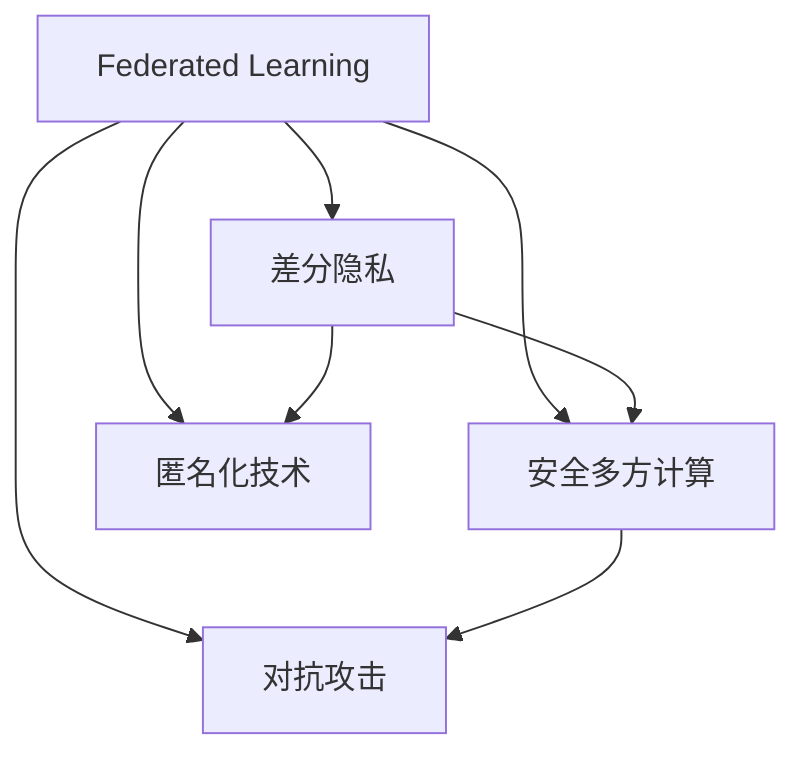

                 

# 联邦学习的隐私攻击与防御策略

> 关键词：联邦学习,隐私保护,差分隐私,安全多方计算,对抗攻击,匿名化技术

## 1. 背景介绍

### 1.1 问题由来
随着大数据技术的发展，联邦学习(Federated Learning, FL)作为一种新兴的分布式机器学习范式，逐渐成为数据隐私保护和高效协作的重要手段。联邦学习通过在分布式节点上独立训练模型，再通过聚合学习参数来提升整体性能，避免了将数据集中存储和传输带来的隐私风险。然而，联邦学习模型在提升数据共享效率的同时，也面临着隐私泄露和对抗攻击等潜在威胁。

### 1.2 问题核心关键点
当前，联邦学习面临的核心问题是如何在保证模型性能的前提下，最大化数据隐私保护。具体来说，需要在以下几个方面进行研究：

1. 如何设计安全的聚合策略，防止攻击者通过恶意数据或对抗攻击破坏模型参数。
2. 如何采用差分隐私(Differential Privacy, DP)等隐私保护技术，确保个体数据的不可识别性。
3. 如何结合安全多方计算(Secure Multi-party Computation, SMPC)等技术，保障模型训练过程的安全性。
4. 如何构建健壮的防御体系，检测和抵御各类隐私攻击，保障联邦学习的稳健性。

### 1.3 问题研究意义
联邦学习在数据分布式存储和计算的大背景下，对于推动数据驱动型应用的安全和高效具有重要意义：

1. 保障数据隐私。联邦学习通过在本地节点上进行模型训练，有效避免了数据集中存储带来的隐私风险，使得数据所有者能够在不泄露原始数据的前提下，参与到协作学习中。
2. 提升协作效率。联邦学习可以在不传输原始数据的情况下，利用分布式计算资源，大幅提升数据处理的效率和效果。
3. 推动数据共享。联邦学习能够克服数据孤岛，促进跨机构、跨行业的数据共享与合作，为实现数据驱动型创新提供技术支持。

## 2. 核心概念与联系

### 2.1 核心概念概述

为更好地理解联邦学习中的隐私攻击与防御策略，本节将介绍几个关键概念：

- **联邦学习(Federated Learning, FL)**：一种分布式机器学习范式，通过在多个分布式节点上独立训练模型，再聚合学习参数，优化整体性能。典型的应用场景包括移动设备数据协同学习、互联网应用数据联合分析等。
- **差分隐私(Differential Privacy, DP)**：一种隐私保护技术，通过对查询结果的噪声干扰，确保个体数据不可识别，从而在满足隐私保护要求的同时，不牺牲模型的实用性和可用性。
- **安全多方计算(Secure Multi-party Computation, SMPC)**：一种密码学技术，允许多个参与方在不泄露各自输入数据的情况下，共同计算一个函数的结果。
- **对抗攻击(Adversarial Attack)**：指攻击者通过加入恶意数据或干扰模型训练过程，影响模型输出结果的正确性和可靠性。
- **匿名化技术(Anonymization Technique)**：一种数据预处理方法，通过去除或混淆个人身份信息，确保数据不可识别。

这些概念之间的逻辑关系可以通过以下Mermaid流程图来展示：



这个流程图展示了联邦学习中涉及的各个关键概念及其关系：

1. 联邦学习依赖于差分隐私和安全多方计算，确保聚合后的模型参数不可识别。
2. 联邦学习需要抵御对抗攻击，防止恶意数据对模型造成影响。
3. 匿名化技术可以提升数据的隐私保护水平，防止数据泄露。

## 3. 核心算法原理 & 具体操作步骤
### 3.1 算法原理概述

联邦学习的核心思想是：在分布式节点上独立训练多个本地模型，通过聚合所有本地模型的参数来优化全局模型。假设所有节点的数据集为 $\{(x_i,y_i)\}_{i=1}^N$，本地模型的损失函数为 $\mathcal{L}_i(\theta)$，其中 $\theta$ 为模型参数。联邦学习的目标是最小化全局损失函数 $\mathcal{L}(\theta)$，即：

$$
\theta^* = \mathop{\arg\min}_{\theta} \frac{1}{N}\sum_{i=1}^N \mathcal{L}_i(\theta)
$$

### 3.2 算法步骤详解

基于联邦学习的大规模协作学习过程，可以分为以下几个关键步骤：

**Step 1: 本地模型训练**
- 各节点获取本地数据，使用局部损失函数训练本地模型 $\theta_i$，并将模型参数上传给服务器端。

**Step 2: 参数聚合与更新**
- 服务器端接收各节点的模型参数，通过聚合算法计算全局模型参数 $\theta^*$。
- 将全局模型参数 $\theta^*$ 下发给各节点，并更新本地模型 $\theta_i$。

**Step 3: 隐私保护与安全计算**
- 对本地模型参数进行隐私保护处理，如差分隐私、安全多方计算等。
- 通过安全协议，确保模型训练过程的透明性和可审计性。

**Step 4: 对抗攻击检测与防御**
- 使用抗攻击模型或算法检测训练数据中的恶意攻击或异常样本。
- 对检测到的攻击进行相应的处理，如删除异常样本或更新本地模型参数。

**Step 5: 防御策略优化**
- 根据攻击行为和统计特征，优化防御策略，提升系统的鲁棒性和安全性。

### 3.3 算法优缺点

联邦学习作为一种新兴的分布式学习范式，具有以下优点：
1. 降低数据隐私风险。通过在本地节点上进行模型训练，避免了数据集中存储带来的隐私风险。
2. 提高数据利用率。可以在分布式环境中利用闲置计算资源，实现数据的高效利用。
3. 促进跨机构合作。联邦学习可以克服数据孤岛，促进跨行业、跨机构的数据共享与合作。

同时，该方法也存在一些缺点：
1. 通信开销较大。需要频繁地在节点和服务器间传输模型参数，增加了通信负担。
2. 同步问题复杂。各节点之间数据分布不均匀，可能出现模型同步困难。
3. 局部模型的鲁棒性不足。局部模型容易出现过拟合，影响全局模型的泛化能力。
4. 防御策略不完善。当前联邦学习模型的安全性和鲁棒性仍需进一步提升。

### 3.4 算法应用领域

联邦学习已经广泛应用于多个领域，如智能交通、医疗健康、金融风控等，为各行业带来了显著的效益：

- **智能交通**：通过联邦学习，各城市的交通数据可以共享，优化交通流量管理，减少拥堵和事故。
- **医疗健康**：不同医疗机构可以共享患者数据，提升疾病诊断和治疗方案的精准度。
- **金融风控**：多个银行可以联合训练模型，提高欺诈检测和风险评估的准确性。
- **能源管理**：各电网公司可以通过联邦学习共享能源使用数据，优化电力分配和节能策略。

此外，联邦学习还在工业物联网、供应链管理、社交网络分析等领域得到了广泛应用，为各行业的智能化、高效化提供了技术支持。

## 4. 数学模型和公式 & 详细讲解 & 举例说明
### 4.1 数学模型构建

假设每个节点 $i$ 的本地数据集为 $\{(x_{i1},y_{i1}),(x_{i2},y_{i2}),\cdots,(x_{in},y_{in})\}$，其中 $x_{ij} \in \mathbb{R}^d$ 为输入特征，$y_{ij} \in \{0,1\}$ 为标签。记节点 $i$ 的局部模型为 $f_i$，全局模型为 $f$。

联邦学习的优化目标是最小化全局损失函数：

$$
\min_{\theta} \frac{1}{N} \sum_{i=1}^N \sum_{j=1}^n [l(f_i(x_{ij},y_{ij});y_{ij}) + \epsilon]
$$

其中 $l$ 为损失函数，$\epsilon$ 为差分隐私参数。

### 4.2 公式推导过程

对于节点 $i$ 的局部模型 $f_i$，假设其损失函数为 $\mathcal{L}_i(\theta)$。本地模型训练过程如下：

$$
\theta_i \leftarrow \theta_i - \eta \nabla_{\theta}\mathcal{L}_i(\theta)
$$

其中 $\eta$ 为学习率。

全局模型的损失函数为：

$$
\mathcal{L}(\theta) = \frac{1}{N} \sum_{i=1}^N \mathcal{L}_i(\theta)
$$

联邦学习模型参数的更新公式为：

$$
\theta \leftarrow \theta - \eta \nabla_{\theta}\mathcal{L}(\theta)
$$

其中 $\nabla_{\theta}\mathcal{L}(\theta)$ 为损失函数对模型参数的梯度，可以通过反向传播算法高效计算。

### 4.3 案例分析与讲解

以一个简单的二分类任务为例，说明联邦学习的基本原理和计算过程。

假设有两个节点 $i=1,2$，各节点的本地数据集分别为：

- 节点 1：$\{(x_{11},1),(x_{12},0),(x_{13},1)\}$
- 节点 2：$\{(x_{21},1),(x_{22},0),(x_{23},1)\}$

记节点 $i$ 的局部模型为 $f_i$，全局模型为 $f$。假设 $f_i(x_{ij}) = \sigma(W_i^T x_{ij} + b_i)$，其中 $\sigma$ 为激活函数。

节点 1 和节点 2 分别训练其局部模型：

$$
\theta_{11} \leftarrow \theta_{11} - \eta_1 \nabla_{\theta_{11}}\mathcal{L}_{11}(\theta_{11})
$$
$$
\theta_{12} \leftarrow \theta_{12} - \eta_2 \nabla_{\theta_{12}}\mathcal{L}_{12}(\theta_{12})
$$

节点 1 和节点 2 的本地模型损失函数分别为：

$$
\mathcal{L}_{11}(\theta_{11}) = \frac{1}{3} \sum_{j=1}^3 [l(f_1(x_{11,j},y_{11,j});y_{11,j}) + \epsilon]
$$
$$
\mathcal{L}_{12}(\theta_{12}) = \frac{1}{3} \sum_{j=1}^3 [l(f_2(x_{21,j},y_{21,j});y_{21,j}) + \epsilon]
$$

全局模型参数的更新公式为：

$$
\theta \leftarrow \theta - \eta \nabla_{\theta}\mathcal{L}(\theta)
$$

其中：

$$
\mathcal{L}(\theta) = \frac{1}{N} \sum_{i=1}^N \sum_{j=1}^n [l(f(x_{ij},y_{ij});y_{ij}) + \epsilon]
$$

通过以上过程，节点间的协作训练使得全局模型能够充分利用各节点的数据，提升了模型的泛化能力。

## 5. 项目实践：代码实例和详细解释说明
### 5.1 开发环境搭建

在进行联邦学习项目开发前，需要准备好开发环境。以下是使用Python进行FedML(一种通用的联邦学习框架)进行联邦学习开发的环境配置流程：

1. 安装Python：选择最新版本，并确保PATH环境变量配置正确。
2. 安装FedML：从官网下载并安装FedML库，安装命令为 `pip install fedml`。
3. 安装PyTorch：若使用PyTorch作为模型框架，则需安装PyTorch库，命令为 `pip install torch`。
4. 安装Flare：若使用Flare作为框架，则需安装Flare库，命令为 `pip install flare`。
5. 安装其他相关库：如numpy、scipy、tqdm等，命令为 `pip install numpy scipy tqdm`。

完成上述步骤后，即可在Python环境中开始联邦学习项目开发。

### 5.2 源代码详细实现

下面以FedML框架为例，给出使用FedML进行二分类任务联邦学习的PyTorch代码实现。

首先，定义二分类任务的本地数据集：

```python
import torch
import torch.nn as nn
import torch.optim as optim
from fedml import Node, FederatedTrainer
from fedml.fedlearner.fedml_mnist import MnistFedLearner
from torch.utils.data import DataLoader
from torchvision import datasets, transforms

class CustomNode:
    def __init__(self, local_data):
        self.local_data = local_data
        self.fed_learner = MnistFedLearner(local_data, device='cpu', batch_size=64)
        self.model = self.fed_learner.model
        
    def train(self):
        criterion = nn.CrossEntropyLoss()
        optimizer = optim.SGD(self.model.parameters(), lr=0.1, momentum=0.9)
        
        for epoch in range(10):
            self.model.train()
            for batch_idx, (inputs, targets) in enumerate(self.local_data):
                inputs, targets = inputs.to('cpu'), targets.to('cpu')
                optimizer.zero_grad()
                outputs = self.model(inputs)
                loss = criterion(outputs, targets)
                loss.backward()
                optimizer.step()
            print(f'Epoch {epoch+1}, loss: {loss.item()}')
            
    def save_model(self):
        torch.save(self.model.state_dict(), 'model.pth')
        
    def load_model(self):
        self.model.load_state_dict(torch.load('model.pth'))
```

然后，构建联邦学习系统，并定义全局模型参数：

```python
node_1 = CustomNode(train_dataset_1)
node_2 = CustomNode(train_dataset_2)

node_1.train()
node_2.train()

global_model = torch.load('model.pth')
```

最后，使用FedML框架进行全局模型的训练：

```python
trainer = FederatedTrainer(fed_model=global_model)
trainer.fed_optimizer = optim.SGD(global_model.parameters(), lr=0.01, momentum=0.9)
trainer.train(model=global_model, local_models=[node_1.model, node_2.model])
```

完整代码如下所示：

```python
import torch
import torch.nn as nn
import torch.optim as optim
from fedml import Node, FederatedTrainer
from fedml.fedlearner.fedml_mnist import MnistFedLearner
from torch.utils.data import DataLoader
from torchvision import datasets, transforms

class CustomNode:
    def __init__(self, local_data):
        self.local_data = local_data
        self.fed_learner = MnistFedLearner(local_data, device='cpu', batch_size=64)
        self.model = self.fed_learner.model
        
    def train(self):
        criterion = nn.CrossEntropyLoss()
        optimizer = optim.SGD(self.model.parameters(), lr=0.1, momentum=0.9)
        
        for epoch in range(10):
            self.model.train()
            for batch_idx, (inputs, targets) in enumerate(self.local_data):
                inputs, targets = inputs.to('cpu'), targets.to('cpu')
                optimizer.zero_grad()
                outputs = self.model(inputs)
                loss = criterion(outputs, targets)
                loss.backward()
                optimizer.step()
            print(f'Epoch {epoch+1}, loss: {loss.item()}')
            
    def save_model(self):
        torch.save(self.model.state_dict(), 'model.pth')
        
    def load_model(self):
        self.model.load_state_dict(torch.load('model.pth'))
        
node_1 = CustomNode(train_dataset_1)
node_2 = CustomNode(train_dataset_2)

node_1.train()
node_2.train()

global_model = torch.load('model.pth')

trainer = FederatedTrainer(fed_model=global_model)
trainer.fed_optimizer = optim.SGD(global_model.parameters(), lr=0.01, momentum=0.9)
trainer.train(model=global_model, local_models=[node_1.model, node_2.model])
```

### 5.3 代码解读与分析

让我们再详细解读一下关键代码的实现细节：

**CustomNode类**：
- `__init__`方法：初始化本地数据集和局部模型。
- `train`方法：在本地数据集上训练局部模型。
- `save_model`方法：保存局部模型的参数。
- `load_model`方法：加载局部模型的参数。

**FederatedTrainer类**：
- `train`方法：使用FedML框架进行全局模型训练。

**trainer.fed_optimizer**：
- 设置全局模型训练的学习率和动量。

**trainer.train**方法：
- 使用FedML框架的`train`方法，在全局模型和本地模型之间进行协作训练。

可以看到，PyTorch和FedML框架的组合，可以方便地实现联邦学习的基本训练流程。开发者可以根据具体任务，灵活调整模型架构、优化算法和训练策略，以适应不同的联邦学习场景。

## 6. 实际应用场景
### 6.1 联邦智能医疗

联邦学习在智能医疗领域有着广阔的应用前景。各医疗机构可以共享患者数据，训练联邦模型用于疾病诊断和治疗方案优化。通过联邦学习，可以保障患者隐私，提升医疗数据的共享和使用效率，加速医疗知识的积累和传播。

具体而言，各医疗机构可以收集患者的病历数据，并将其存储在本地。通过联邦学习，各机构可以在不泄露原始数据的情况下，联合训练疾病诊断模型和治疗方案推荐模型。训练后的模型可以用于预测患者疾病类型和推荐个性化治疗方案，提升医疗服务的智能化和精准化。

### 6.2 联邦金融风控

金融风控是联邦学习的重要应用场景之一。各大银行可以共享交易数据，训练联邦模型用于欺诈检测和信用风险评估。通过联邦学习，可以保障金融数据的隐私安全，提升风控模型的鲁棒性和准确性。

具体而言，各大银行可以收集用户交易数据，并将其存储在本地。通过联邦学习，各银行可以在不泄露原始数据的情况下，联合训练欺诈检测和信用风险评估模型。训练后的模型可以用于实时监控交易行为，识别异常交易和欺诈行为，评估用户的信用风险，提升金融服务的安全性和可靠性。

### 6.3 联邦智慧城市

智慧城市建设是联邦学习的重要应用方向。各城市可以共享交通、能源等数据，训练联邦模型用于城市管理优化。通过联邦学习，可以保障城市数据的隐私安全，提升城市管理的智能化和高效化。

具体而言，各城市可以收集交通流量数据、能源消耗数据等，并将其存储在本地。通过联邦学习，各城市可以在不泄露原始数据的情况下，联合训练交通流量优化和能源分配模型。训练后的模型可以用于实时优化交通流量和能源分配，提升城市的运行效率和可持续发展能力。

### 6.4 未来应用展望

未来，联邦学习将在更多领域得到广泛应用，为各行业带来深远的变革：

- **联邦智能制造**：各制造企业可以共享生产数据，联合训练优化生产流程的模型，提升制造业的智能化和自动化水平。
- **联邦教育**：各教育机构可以共享学生数据，联合训练学习效果评估和个性化教学模型，提升教育服务的公平性和高效性。
- **联邦智慧农业**：各农业合作社可以共享气象数据、种植数据等，联合训练农作物生长预测和施肥优化模型，提升农业生产的智能化和精准化。

联邦学习作为一种新兴的分布式学习范式，必将在推动各行业智能化转型中发挥重要作用，为建设智慧社会提供重要技术支撑。

## 7. 工具和资源推荐
### 7.1 学习资源推荐

为了帮助开发者系统掌握联邦学习的基本原理和实践技巧，这里推荐一些优质的学习资源：

1. **FedML官方文档**：FedML库的官方文档，详细介绍了FedML框架的使用方法和API，是联邦学习入门的必备资料。

2. **Federated Learning in Industry** 课程：由Google AI组织，介绍了联邦学习在实际场景中的应用，适合进阶学习。

3. **Federated Learning: A Survey and Taxonomy** 论文：一篇综述论文，系统介绍了联邦学习的研究现状和未来方向，是了解联邦学习全貌的必读文献。

4. **Flare官方文档**：Flare框架的官方文档，介绍了Flare的使用方法和API，适合联邦学习实践。

5. **Federated Learning in Industrial Research** 课程：由南京大学组织，介绍了联邦学习在工业研究中的应用，适合学术研究人员学习。

通过对这些资源的学习实践，相信你一定能够快速掌握联邦学习的精髓，并用于解决实际的隐私保护和协作学习问题。

### 7.2 开发工具推荐

高效的开发离不开优秀的工具支持。以下是几款用于联邦学习开发的常用工具：

1. FedML：Federated Learning的通用框架，支持多种联邦学习算法和协议。
2. PyTorch：基于Python的开源深度学习框架，支持动态图计算，适合联邦学习模型的训练。
3. Flare：Google开发的联邦学习框架，支持分布式训练和推理。
4. TensorFlow：由Google主导开发的深度学习框架，支持分布式计算，适合联邦学习模型的部署。
5. WEKA：数据挖掘工具，支持数据预处理、特征工程等联邦学习项目的前期工作。

合理利用这些工具，可以显著提升联邦学习项目的开发效率，加速创新迭代的步伐。

### 7.3 相关论文推荐

联邦学习的研究始于学术界，并在学界不断推进。以下是几篇奠基性的相关论文，推荐阅读：

1. **A Framework for Federated Learning**：提出联邦学习的定义和基本框架，是联邦学习研究的奠基之作。

2. **Federated Learning with Differential Privacy**：提出差分隐私技术，用于保障联邦学习的隐私性，是该领域的经典论文。

3. **Secure Multi-party Computation in Secure Computation**：介绍安全多方计算的基本原理和应用场景，是联邦学习中的重要技术。

4. **An efficient and secure federated learning system**：提出一种高效的联邦学习系统，解决了分布式训练中的通信效率问题，是该领域的里程碑之作。

5. **Hierarchical federated learning for multi-domain collaborative learning**：提出分层联邦学习框架，解决了跨机构、跨领域联邦学习的协同问题，是该领域的最新进展。

这些论文代表了大规模协作学习技术的发展脉络。通过学习这些前沿成果，可以帮助研究者把握学科前进方向，激发更多的创新灵感。

## 8. 总结：未来发展趋势与挑战
### 8.1 总结

本文对联邦学习中的隐私攻击与防御策略进行了全面系统的介绍。首先阐述了联邦学习在分布式协作中的应用场景和重要性，明确了联邦学习在隐私保护和数据共享中的独特价值。其次，从原理到实践，详细讲解了联邦学习的基本流程和实现方法，给出了联邦学习项目开发的完整代码实例。同时，本文还广泛探讨了联邦学习在智能医疗、金融风控、智慧城市等领域的实际应用，展示了联邦学习的广泛应用前景。此外，本文精选了联邦学习技术的各类学习资源，力求为读者提供全方位的技术指引。

通过本文的系统梳理，可以看到，联邦学习作为一种新兴的分布式学习范式，具有广泛的应用前景和重大的社会价值。在数据分布式存储和计算的大背景下，联邦学习为各行业带来了智能化、高效化和安全化的重要契机。未来，随着联邦学习技术的不断演进，必将在更多领域得到应用，为各行业带来深远的变革性影响。

### 8.2 未来发展趋势

展望未来，联邦学习的发展趋势主要包括：

1. **联邦模型可解释性提升**：联邦学习模型的决策过程需要更加透明，以提升模型的可解释性和可信任度。未来将会有更多研究致力于提升联邦模型的可解释性。

2. **联邦学习算法多样化**：除了当前主流的基于梯度的联邦学习算法，未来将会有更多基于树、图等结构的联邦学习算法被提出和应用。

3. **跨领域联邦学习**：未来联邦学习将更多地应用于跨行业、跨机构的协作学习，解决复杂场景下的数据分布和隐私保护问题。

4. **联邦学习与区块链结合**：区块链技术具有去中心化、透明等优势，与联邦学习结合，将进一步提升协作学习的安全性。

5. **联邦学习与安全多方计算的融合**：安全多方计算可以提供更高的数据隐私保护，与联邦学习结合，将实现更高层次的隐私保护需求。

以上趋势凸显了联邦学习的广阔前景。这些方向的探索发展，必将进一步提升联邦学习的性能和应用范围，为实现大规模协作学习和数据共享提供新的技术路径。

### 8.3 面临的挑战

尽管联邦学习已经取得了显著的进展，但在迈向更广泛的实际应用过程中，仍面临诸多挑战：

1. **通信开销较大**：联邦学习需要频繁地在节点和服务器间传输模型参数，增加了通信负担。
2. **模型同步困难**：各节点之间数据分布不均匀，可能出现模型同步困难。
3. **本地模型鲁棒性不足**：局部模型容易出现过拟合，影响全局模型的泛化能力。
4. **隐私攻击风险高**：联邦学习模型面临的隐私攻击风险较高，需要进一步提升模型的鲁棒性和安全性。

### 8.4 研究展望

面对联邦学习所面临的挑战，未来的研究需要在以下几个方面寻求新的突破：

1. **优化通信开销**：研究更高效的联邦学习算法和数据传输策略，减少通信开销。
2. **解决模型同步问题**：研究更好的模型同步策略，确保各节点模型的一致性。
3. **提升局部模型鲁棒性**：研究更好的本地模型训练策略，提升模型的泛化能力和鲁棒性。
4. **防御隐私攻击**：研究更强大的隐私保护和对抗攻击防御策略，提升模型的安全性。

## 9. 附录：常见问题与解答

**Q1：联邦学习是否适用于所有分布式数据应用场景？**

A: 联邦学习在数据分布式存储和计算的大背景下，对于分布式数据应用的隐私保护和高效协作具有重要意义。但对于一些数据不具备分布式特征的应用场景，如单点应用、实时数据处理等，联邦学习可能并不适用。

**Q2：如何设计安全的聚合策略？**

A: 安全的聚合策略设计需要考虑以下几个方面：
1. 选择可解释的聚合算法，如FedAvg，确保聚合过程透明性。
2. 引入差分隐私等隐私保护技术，防止聚合后的参数可识别。
3. 使用安全多方计算等技术，保障聚合过程的安全性。

**Q3：差分隐私技术如何实现？**

A: 差分隐私通过在查询结果中添加噪声，确保个体数据的不可识别性。常用的差分隐私算法包括Laplace机制、Gaussian机制等。差分隐私参数的选择需要综合考虑隐私保护和实用性的平衡。

**Q4：如何检测和防御隐私攻击？**

A: 隐私攻击检测与防御需要结合多种技术，如对抗样本检测、异常值检测、数据指纹等。检测到隐私攻击后，需要及时采取措施，如删除异常样本、更新模型参数等。

**Q5：联邦学习模型如何进行参数更新？**

A: 联邦学习模型的参数更新通常采用随机梯度下降(SGD)等优化算法。在参数更新时，需要对全局参数和本地参数进行联合更新，以确保模型的一致性。

这些问答帮助开发者更好地理解联邦学习的核心概念和关键技术，为联邦学习项目的开发和应用提供重要的指导和支持。

---

作者：禅与计算机程序设计艺术 / Zen and the Art of Computer Programming

