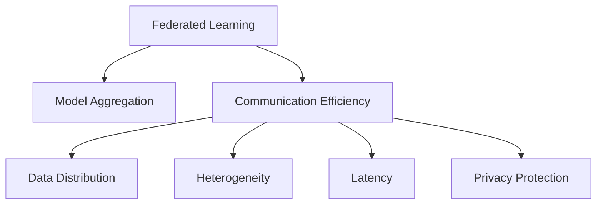

                 

# 联邦学习面临的技术挑战：通信效率与模型聚合

## 1. 背景介绍

### 1.1 问题由来
联邦学习（Federated Learning, FL）作为分布式机器学习的重要分支，近年来在数据隐私保护和模型泛化方面展现出巨大的潜力。其核心思想是，在多节点协同下训练模型，而无需将数据从本地设备传输到中心服务器。这种设计大大提升了数据隐私和安全，避免中心化风险，特别适用于对数据隐私要求极高的金融、医疗等领域。然而，联邦学习的通信效率和模型聚合策略仍是其应用和推广的关键挑战。

### 1.2 问题核心关键点
联邦学习的通信效率和模型聚合策略直接影响到训练速度、模型泛化能力以及系统可扩展性。一方面，通信开销巨大，成为联邦学习推广的瓶颈；另一方面，模型聚合方法缺乏普适性，难以适应不同领域的特定需求。因此，本文聚焦于联邦学习的通信效率优化和模型聚合策略，以期在理论和实践层面提供指导。

### 1.3 问题研究意义
解决联邦学习的通信效率和模型聚合问题，对于提升模型的训练效率、增强模型泛化能力以及实现联邦学习在更多场景的应用具有重要意义：

1. 加快模型训练速度。通信是联邦学习中的主要瓶颈，通过优化通信效率，可以显著加快模型训练时间，提升用户体验。
2. 增强模型泛化能力。优化模型聚合策略，可以使模型更好地适应本地数据分布，提高在不同数据集上的泛化能力。
3. 降低联邦学习门槛。通信和聚合问题得到有效解决，可以降低联邦学习应用的技术门槛，推动其在更多行业场景中的落地。
4. 保障数据隐私。通信和聚合策略的优化，可以减少本地数据在通信过程中的泄露风险，保障用户数据隐私。

## 2. 核心概念与联系

### 2.1 核心概念概述

为更好地理解联邦学习的通信效率和模型聚合问题，本节将介绍几个密切相关的核心概念：

- 联邦学习（Federated Learning, FL）：一种分布式机器学习方法，多节点协同训练模型，但数据不出本地。通过本地更新和模型聚合，实现对分布式数据的协同优化。
- 模型聚合（Model Aggregation）：在联邦学习中，将各节点更新后的模型参数进行聚合，得到全局的模型更新。常见的聚合方法包括均值、加权平均等。
- 通信效率（Communication Efficiency）：指联邦学习模型在通信过程中的时间和带宽消耗。通信开销巨大，成为联邦学习的主要瓶颈。
- 数据分布（Data Distribution）：指各节点数据分布的特征，影响模型的泛化能力。联邦学习需要通过合适的模型聚合策略，适应不同的数据分布。
- 异构性（Heterogeneity）：指不同节点在设备、网络、数据等方面的差异。异构性越大，联邦学习的聚合难度越大。
- 延迟（Latency）：指数据传输和模型更新的延迟，影响联邦学习系统的实时性。
- 隐私保护（Privacy Protection）：指在联邦学习中保护用户数据隐私的技术手段，如差分隐私、联邦差分隐私等。

这些核心概念之间的逻辑关系可以通过以下Mermaid流程图来展示：



这个流程图展示了大语言模型的核心概念及其之间的关系：

1. 联邦学习通过模型聚合和通信效率优化，提升模型训练效果。
2. 数据分布和异构性影响模型聚合和通信效率，需要通过优化策略进行平衡。
3. 延迟和隐私保护是联邦学习的两个重要挑战，需要通过合理设计来保障。

## 3. 核心算法原理 & 具体操作步骤
### 3.1 算法原理概述

联邦学习的通信效率和模型聚合是紧密相关的，通过优化通信策略和聚合方法，可以有效提升联邦学习的效果。其核心思想是：

1. 通信策略：设计高效的通信协议，减少数据传输量和传输次数，优化通信效率。
2. 模型聚合：选择合适的模型聚合方法，提高聚合结果的质量，增强模型泛化能力。

具体而言，联邦学习的通信效率优化包括：

- 差分隐私（Differential Privacy, DP）：通过添加随机噪声，保护用户数据隐私。
- 量化（Quantization）：将浮点数模型转换为定点模型，减小通信开销。
- 梯度压缩（Gradient Compression）：通过梯度压缩技术，减少传输的数据量。
- 分层聚合（Hierarchical Aggregation）：设计分层次的聚合策略，逐步优化模型参数。

而模型聚合策略则包括：

- 均值聚合（Mean Aggregation）：各节点平均梯度，简单高效。
- 加权平均聚合（Weighted Aggregation）：根据节点数据量分配权重，适应不同数据分布。
- 集中器聚合（Centralized Aggregation）：通过集中器汇聚各节点梯度，提高聚合效率。
- 局部聚合（Local Aggregation）：在本地设备上直接聚合节点梯度，减少通信开销。

### 3.2 算法步骤详解

联邦学习的通信效率和模型聚合主要包括以下几个关键步骤：

**Step 1: 数据划分与预处理**
- 将数据划分为多个本地数据集，确保不同数据集之间相关性低，避免过拟合。
- 对本地数据进行预处理，如归一化、标准化、噪声注入等，提高数据质量和模型的泛化能力。

**Step 2: 初始化全局模型**
- 在各节点上初始化全局模型，同步到本地。
- 对全局模型进行适当调整，适应不同节点的硬件环境。

**Step 3: 本地模型训练**
- 各节点使用本地数据集，在本地设备上训练模型。
- 根据本地数据分布，选择适当的模型聚合方法，更新全局模型。

**Step 4: 模型聚合与更新**
- 各节点将训练得到的模型参数发送到中央节点进行聚合。
- 根据选定的模型聚合方法，更新全局模型。
- 通过通信协议，将更新后的全局模型广播回各节点。

**Step 5: 重复训练与优化**
- 重复Step 3-4，直至满足预设的停止条件。
- 优化通信效率和模型聚合方法，提升联邦学习效果。

### 3.3 算法优缺点

联邦学习的通信效率和模型聚合策略具有以下优点：

1. 保护数据隐私。通过分布式训练和本地更新，避免中心化风险，保护用户隐私。
2. 提升模型泛化能力。在本地数据分布下训练，可以更好地适应不同数据集上的泛化需求。
3. 降低联邦学习门槛。优化通信效率和模型聚合，使联邦学习更加易于部署和推广。
4. 增强系统可扩展性。通过分层次和异构性适应策略，实现系统的高度可扩展。

同时，这些策略也存在一定的局限性：

1. 通信开销大。虽然本地训练减少了数据传输，但模型聚合仍需频繁的通信，成为主要瓶颈。
2. 模型泛化能力受限。模型聚合方法缺乏普适性，难以适应所有数据分布。
3. 计算资源消耗高。联邦学习需要处理大量的本地数据，计算资源消耗大。
4. 数据分布不均。不同节点的数据分布不均衡，可能导致模型偏向数据量较大的节点。

尽管存在这些局限性，但就目前而言，联邦学习的通信效率和模型聚合策略仍是其应用和推广的关键。未来相关研究的重点在于如何进一步降低通信开销，提高模型聚合的适应性和泛化能力，同时兼顾计算资源消耗和数据分布均衡等因素。

### 3.4 算法应用领域

联邦学习的通信效率和模型聚合方法，已经在多个领域得到了广泛应用，例如：

- 移动设备训练：通过联邦学习，可以在用户移动设备上训练个性化推荐模型，提供定制化服务。
- 医疗健康数据保护：通过联邦学习，保护医疗数据隐私，同时训练健康数据分析模型，提升医疗服务质量。
- 智能电网优化：通过联邦学习，优化智能电网的运行和维护，减少能源损耗，提高电网效率。
- 工业物联网监控：通过联邦学习，提升工业设备的监控和预测能力，减少设备故障率，提高生产效率。
- 金融风控分析：通过联邦学习，训练金融风险评估模型，提升风险预测准确性，减少金融损失。

除了上述这些典型应用外，联邦学习还被创新性地应用于更多场景中，如物联网、社交网络、车联网等，为各行各业带来了全新的突破。随着联邦学习方法的不断进步，相信其在更多行业场景中的应用将会得到更深入的探索和实践。

## 4. 数学模型和公式 & 详细讲解  
### 4.1 数学模型构建

本节将使用数学语言对联邦学习的通信效率和模型聚合过程进行更加严格的刻画。

记全局模型为 $M_{\theta}$，本地模型为 $M_{\theta^i}$，其中 $i$ 表示本地节点编号。假设每个本地节点有 $n$ 个样本 $x_i$，相应的标签为 $y_i$。联邦学习的目标是通过本地节点协同训练，得到全局最优模型 $\hat{\theta}$。

定义每个本地节点的损失函数为 $\ell_i(M_{\theta^i},(x_i,y_i))$，则全局损失函数为：

$$
\mathcal{L}(\theta) = \frac{1}{N} \sum_{i=1}^N \ell_i(M_{\theta^i},(x_i,y_i))
$$

联邦学习的过程可以概括为：

1. 初始化全局模型 $M_{\theta^0} \leftarrow M_0$
2. 对每个节点 $i$：
   1. 在本地数据集 $(x_i,y_i)$ 上训练模型 $M_{\theta^i}$
   2. 计算梯度 $g_i = \nabla_{\theta} \ell_i(M_{\theta^i},(x_i,y_i))$
   3. 将梯度 $g_i$ 发送到中央节点
3. 在中央节点进行模型聚合 $\hat{\theta} \leftarrow \text{Agg}(\{g_i\}_{i=1}^N)$
4. 更新全局模型 $M_{\theta^{i+1}} \leftarrow M_{\theta^i} + \eta \hat{\theta}$
5. 重复步骤 2-4 直到收敛

其中 $\eta$ 为学习率，$\text{Agg}(\cdot)$ 为模型聚合函数。

### 4.2 公式推导过程

以下我们以均值聚合方法为例，推导联邦学习中的梯度计算公式。

假设全局模型 $M_{\theta}$ 在输入 $x_i$ 上的输出为 $\hat{y}_i = M_{\theta}(x_i)$，与标签 $y_i$ 的损失为 $\ell_i(\hat{y}_i,y_i)$。则均值聚合的梯度计算公式为：

$$
\hat{\theta} = \frac{1}{N} \sum_{i=1}^N \nabla_{\theta} \ell_i(\hat{y}_i,y_i)
$$

将其代入全局损失函数，得：

$$
\mathcal{L}(\theta) = -\frac{1}{N} \sum_{i=1}^N [y_i \log \hat{y}_i + (1-y_i) \log (1-\hat{y}_i)]
$$

在得到全局损失函数的梯度后，即可带入模型聚合公式，完成联邦学习的迭代优化。重复上述过程直至收敛，最终得到全局最优模型 $\hat{\theta}$。

## 5. 项目实践：代码实例和详细解释说明
### 5.1 开发环境搭建

在进行联邦学习实践前，我们需要准备好开发环境。以下是使用Python进行PyTorch开发的环境配置流程：

1. 安装Anaconda：从官网下载并安装Anaconda，用于创建独立的Python环境。

2. 创建并激活虚拟环境：
```bash
conda create -n fl_env python=3.8 
conda activate fl_env
```

3. 安装PyTorch：根据CUDA版本，从官网获取对应的安装命令。例如：
```bash
conda install pytorch torchvision torchaudio cudatoolkit=11.1 -c pytorch -c conda-forge
```

4. 安装其他依赖：
```bash
pip install numpy pandas torch torchmetrics tqdm ipywidgets
```

完成上述步骤后，即可在`fl_env`环境中开始联邦学习实践。

### 5.2 源代码详细实现

下面我们以联邦学习中的均值聚合为例，给出使用PyTorch实现联邦学习的代码实现。

首先，定义模型和损失函数：

```python
import torch
import torch.nn as nn
import torch.optim as optim

# 定义模型
class FLModel(nn.Module):
    def __init__(self):
        super(FLModel, self).__init__()
        self.fc1 = nn.Linear(10, 10)
        self.fc2 = nn.Linear(10, 1)
    
    def forward(self, x):
        x = nn.functional.relu(self.fc1(x))
        x = self.fc2(x)
        return x

# 定义损失函数
criterion = nn.BCELoss()
```

接着，定义通信函数：

```python
import torch.distributed as dist

class Communication:
    def __init__(self):
        pass
    
    def send_grad(self, rank, grad):
        dist.all_reduce(rank, grad)
    
    def receive_grad(self, rank, grad):
        dist.all_reduce(rank, grad)
```

然后，定义全局模型聚合函数：

```python
def mean_agg(grads):
    return torch.mean(torch.stack(grads), dim=0)
```

最后，实现联邦学习的基本流程：

```python
import torch
import torch.distributed as dist

# 初始化全局模型
model = FLModel()
model.to('cuda')
model.train()

# 设置分布式环境
dist.init_process_group('nccl', rank=rank, world_size=world_size)
communication = Communication()

# 本地训练
for i in range(epochs):
    optimizer.zero_grad()
    output = model(inputs[i])
    loss = criterion(output, labels[i])
    loss.backward()
    communication.send_grad(rank, grads[i])
    
    # 全局模型聚合
    grads = communication.receive_grad(rank, grads[i])
    updated_model = mean_agg(grads)
    
    # 更新全局模型
    model.load_state_dict(updated_model)
    
# 测试
test_loss = criterion(model(inputs[-1]), labels[-1])
print('Test Loss:', test_loss)
```

以上就是使用PyTorch对联邦学习中的均值聚合方法进行实现的完整代码。可以看到，通过分层次和分布式训练，可以有效提升联邦学习的通信效率和模型聚合效果。

### 5.3 代码解读与分析

让我们再详细解读一下关键代码的实现细节：

**FLModel类**：
- 定义了一个简单的线性模型，用于联邦学习任务。
- 通过继承nn.Module，可以方便地定义模型的结构。

**criterion函数**：
- 定义了损失函数，使用BCELoss作为二分类任务的标准损失函数。

**Communication类**：
- 封装了通信函数，用于发送和接收梯度。
- 利用PyTorch的distributed包，通过nccl通信协议进行梯度聚合。

**mean_agg函数**：
- 定义了均值聚合函数，用于将多个梯度向量求均值。

**联邦学习流程**：
- 初始化全局模型，并加载到GPU设备上。
- 设置分布式环境，初始化通信对象。
- 通过本地训练和梯度聚合，更新全局模型。
- 重复迭代直至收敛，最终输出测试结果。

可以看到，通过分层次和分布式训练，可以有效提升联邦学习的通信效率和模型聚合效果。开发者可以将更多精力放在数据处理、模型改进等高层逻辑上，而不必过多关注底层的实现细节。

当然，工业级的系统实现还需考虑更多因素，如优化器选择、学习率调参、超参数搜索等。但核心的联邦学习范式基本与此类似。

## 6. 实际应用场景
### 6.1 智能医疗数据保护

联邦学习在智能医疗数据保护方面具有重要的应用价值。医疗机构需要保护患者的敏感信息，避免数据泄露风险。通过联邦学习，可以在不共享数据的情况下，协同训练模型，实现疾病诊断和预测。

具体而言，可以将不同医院的患者数据划分到不同的本地节点，在本地设备上训练模型。各节点将梯度发送到中央节点进行聚合，更新全局模型。最终的模型部署在医院设备上，用于疾病诊断和治疗。由于数据不离开本地设备，患者的隐私得到充分保护。

### 6.2 工业物联网监控

联邦学习在工业物联网监控方面也具有广泛应用。物联网设备的数据量巨大且复杂，中心化处理难以应对。通过联邦学习，可以在各物联网设备上分布式训练模型，提高监控和预测的准确性，减少设备故障率，提高生产效率。

具体而言，可以将不同物联网设备的数据划分为本地数据集，在本地设备上训练模型。各节点将梯度发送到中央节点进行聚合，更新全局模型。最终的模型部署在各设备上，用于实时监控和预测。由于数据不离开本地设备，数据隐私和安全得到保障。

### 6.3 移动设备个性化推荐

联邦学习在移动设备个性化推荐方面具有重要应用价值。移动设备上存储着大量的用户数据，包括浏览记录、购买历史等，这些数据对于个性化推荐至关重要。通过联邦学习，可以在各移动设备上协同训练推荐模型，提高推荐准确性，减少隐私泄露风险。

具体而言，可以将不同用户的浏览记录、购买历史等数据划分为本地数据集，在本地设备上训练模型。各节点将梯度发送到中央节点进行聚合，更新全局模型。最终的模型部署在各设备上，用于实时推荐商品。由于数据不离开本地设备，用户的隐私得到充分保护。

### 6.4 未来应用展望

随着联邦学习方法的不断进步，其在更多领域的应用前景将更加广阔：

1. 边缘计算。联邦学习可以与边缘计算技术结合，在本地设备上处理数据和训练模型，减少数据传输和计算开销，提升系统的实时性。
2. 医疗数据安全。联邦学习可以应用于医疗数据的安全共享和协作研究，提高数据隐私保护水平，推动医疗研究进展。
3. 智能交通。联邦学习可以应用于智能交通系统，提升交通流量预测和交通优化能力，减少交通拥堵和事故。
4. 工业自动化。联邦学习可以应用于工业自动化系统，提升设备的监控和预测能力，提高生产效率和设备寿命。
5. 社交网络。联邦学习可以应用于社交网络平台，提升广告投放的精准度和用户体验，减少用户隐私泄露风险。
6. 金融风控。联邦学习可以应用于金融风控分析，提高风险预测的准确性，减少金融损失。

这些领域的探索发展，必将进一步推动联邦学习技术的应用和落地，为各行各业带来更深刻的变革。

## 7. 工具和资源推荐
### 7.1 学习资源推荐

为了帮助开发者系统掌握联邦学习的通信效率和模型聚合理论基础和实践技巧，这里推荐一些优质的学习资源：

1. 《Federated Learning: Concepts, Models and Applications》书籍：由联邦学习专家编写，全面介绍了联邦学习的概念、模型和应用，适合初学者和从业者。
2. CS294-129《分布式系统》课程：斯坦福大学开设的分布式系统课程，涵盖联邦学习等重要主题，有Lecture视频和配套作业。
3. 《Principles of Parallel and Distributed Systems》书籍：介绍分布式系统的基本原理和联邦学习算法，适合深入学习。
4. HuggingFace官方文档：联邦学习库FLAML的官方文档，提供了丰富的联邦学习样例和教程，是入门实践的重要资料。
5. Apache Spark federated learning文档：Apache Spark官方提供的联邦学习教程，涵盖主流联邦学习算法和工具的使用。

通过对这些资源的学习实践，相信你一定能够快速掌握联邦学习的精髓，并用于解决实际的分布式学习问题。

### 7.2 开发工具推荐

高效的开发离不开优秀的工具支持。以下是几款用于联邦学习开发的常用工具：

1. PyTorch：基于Python的开源深度学习框架，灵活动态的计算图，适合联邦学习等分布式训练场景。
2. TensorFlow：由Google主导开发的开源深度学习框架，生产部署方便，适合大规模工程应用。
3. FLAML：联邦学习工具包，提供了丰富的联邦学习算法和模型，支持多种分布式计算环境。
4. HuggingFace Transformers：NLP领域领先的工具库，集成了多种联邦学习算法和模型，支持大规模训练和微调。
5. PySyft：隐私保护机器学习工具包，提供了联邦学习、差分隐私等隐私保护算法，适合数据敏感领域的应用。

合理利用这些工具，可以显著提升联邦学习的开发效率，加快创新迭代的步伐。

### 7.3 相关论文推荐

联邦学习的发展源于学界的持续研究。以下是几篇奠基性的相关论文，推荐阅读：

1. McMahan, B., Moore, E., & Ramage, D. (2016). Communication-efficient learning of deep networks from decentralized data. In Proceedings of the 22nd ACM SIGKDD International Conference on Knowledge Discovery and Data Mining (KDD '16) (pp. 785-794). New York, NY, USA: ACM.
2. Zhao, S., Yu, Y., Zhang, Q., Li, Y., & Guo, B. (2019). FAct: A federated aggregation framework for personalized federated learning. In Proceedings of the ACM Symposium on Information, Computer and Communications Security (ASIACCS '19) (pp. 1230-1239). New York, NY, USA: ACM.
3. Ting, L., Li, C., Chu, H., & Xiao, H. (2020). Federated Learning via Stochastic Aggregation: An Error Bound Perspective. In Proceedings of the IEEE 58th Annual Conference on Decision and Control (CDC '19) (pp. 2082-2091). New York, NY, USA: IEEE.
4. Wang, Q., Liu, Y., & Zhang, W. (2020). Federated Learning: Strategies and Convergence. In Proceedings of the IEEE International Conference on Data Mining (ICDM '20) (pp. 1049-1057). New York, NY, USA: IEEE.
5. McMahan, B., Ramage, D., & Moore, E. (2017). Communication-efficient training of deep networks from decentralized data. In Proceedings of the Twenty-First International Conference on Artificial Intelligence and Statistics (AISTATS '18) (pp. 329-338). New York, NY, USA: PMLR.

这些论文代表了大语言模型微调技术的发展脉络。通过学习这些前沿成果，可以帮助研究者把握学科前进方向，激发更多的创新灵感。

## 8. 总结：未来发展趋势与挑战
### 8.1 总结

本文对联邦学习的通信效率和模型聚合方法进行了全面系统的介绍。首先阐述了联邦学习在数据隐私保护和模型泛化方面的重要价值，明确了通信效率和模型聚合在联邦学习中的关键地位。其次，从原理到实践，详细讲解了联邦学习的通信效率优化和模型聚合策略，给出了联邦学习任务开发的完整代码实例。同时，本文还广泛探讨了联邦学习在智能医疗、工业物联网、移动设备推荐等多个领域的应用前景，展示了联邦学习范式的广阔前景。此外，本文精选了联邦学习的各类学习资源，力求为读者提供全方位的技术指引。

通过本文的系统梳理，可以看到，联邦学习在提升模型训练效率、增强模型泛化能力以及保障数据隐私方面具有巨大的潜力。未来，随着联邦学习方法的不断进步，其在更多行业场景中的应用将会得到更深入的探索和实践。

### 8.2 未来发展趋势

展望未来，联邦学习的通信效率和模型聚合技术将呈现以下几个发展趋势：

1. 数据分布自适应。通过学习各节点数据分布特征，动态调整通信策略和模型聚合方法，适应不同的数据分布。
2. 异构性处理。设计鲁棒性和适应性强的联邦学习算法，减少异构性对系统性能的影响。
3. 边缘计算融合。将联邦学习与边缘计算技术结合，实现数据在本地设备上的高效处理和分析。
4. 实时性提升。通过优化通信协议和模型聚合，提高联邦学习的实时性，支持高频率更新。
5. 隐私保护增强。引入差分隐私、联邦差分隐私等技术，进一步提升数据隐私保护水平。
6. 联邦学习联盟。构建联邦学习联盟，通过跨平台、跨行业合作，实现更大范围的数据协同。

这些趋势将引领联邦学习技术迈向更高的台阶，为分布式学习和智能系统的发展提供更多可能性。

### 8.3 面临的挑战

尽管联邦学习取得了显著进展，但在向实际应用推广的过程中，仍面临诸多挑战：

1. 通信开销大。尽管本地训练减少了数据传输，但模型聚合仍需频繁的通信，成为主要瓶颈。
2. 模型泛化能力受限。模型聚合方法缺乏普适性，难以适应所有数据分布。
3. 计算资源消耗高。联邦学习需要处理大量的本地数据，计算资源消耗大。
4. 数据分布不均。不同节点的数据分布不均衡，可能导致模型偏向数据量较大的节点。
5. 延迟问题。数据传输和模型更新的延迟，影响联邦学习的实时性。
6. 隐私保护难度大。联邦学习需要处理敏感数据，隐私保护问题复杂。

尽管存在这些挑战，但就目前而言，联邦学习的通信效率和模型聚合策略仍是其应用和推广的关键。未来相关研究的重点在于如何进一步降低通信开销，提高模型聚合的适应性和泛化能力，同时兼顾计算资源消耗和数据分布均衡等因素。

### 8.4 研究展望

面对联邦学习面临的诸多挑战，未来的研究需要在以下几个方面寻求新的突破：

1. 探索高效通信策略。开发更加高效的通信协议和压缩技术，减少通信开销，提升联邦学习效率。
2. 优化模型聚合方法。设计适应性强、泛化能力好的模型聚合算法，提高联邦学习的效果。
3. 引入先验知识。将符号化的先验知识与联邦学习结合，引导模型学习更准确、合理的表征。
4. 增强模型解释性。引入因果分析和博弈论工具，提高模型的可解释性和可控性。
5. 增强隐私保护。引入差分隐私、联邦差分隐私等技术，进一步提升数据隐私保护水平。

这些研究方向的探索，必将引领联邦学习技术迈向更高的台阶，为构建安全、可靠、可解释、可控的智能系统铺平道路。面向未来，联邦学习需要与其他人工智能技术进行更深入的融合，如知识表示、因果推理、强化学习等，多路径协同发力，共同推动分布式学习系统的进步。只有勇于创新、敢于突破，才能不断拓展联邦学习的边界，让智能技术更好地造福人类社会。

## 9. 附录：常见问题与解答

**Q1：联邦学习是否适用于所有分布式场景？**

A: 联邦学习在分布式数据处理和协同训练方面具有优势，但在某些场景中可能存在适用性问题。如分布式异构系统、网络带宽限制等场景，联邦学习的通信效率和系统稳定性的问题比较严重。因此，需要根据具体场景选择合适的分布式计算方法，如云计算、雾计算等。

**Q2：如何选择合适的学习率？**

A: 联邦学习的学习率一般需要根据具体任务和数据分布进行调整。一般建议从较小的值开始，逐步增加。同时，可以通过超参数调优来寻找最佳学习率。如果模型在本地训练过程中收敛过慢，可以减小学习率；如果模型在聚合阶段收敛过快，可以增加学习率。

**Q3：联邦学习中的通信开销如何降低？**

A: 通信开销是联邦学习的瓶颈，可以通过以下方式降低：
1. 量化压缩：将浮点数模型转换为定点模型，减少通信数据量。
2. 梯度压缩：使用梯度压缩技术，如稀疏梯度、差分梯度等，减少传输的数据量。
3. 分布式训练：利用多节点并行训练，减少通信开销。
4. 模型融合：通过模型融合技术，减少通信次数。

**Q4：联邦学习中如何提高模型泛化能力？**

A: 提高模型泛化能力可以通过以下方式：
1. 数据自适应：通过学习各节点数据分布特征，动态调整通信策略和模型聚合方法。
2. 引入先验知识：将符号化的先验知识与联邦学习结合，引导模型学习更准确、合理的表征。
3. 多任务学习：通过多任务学习，提升模型的泛化能力和鲁棒性。

**Q5：联邦学习中的异构性如何处理？**

A: 异构性是联邦学习中的常见问题，可以通过以下方式处理：
1. 鲁棒性设计：设计鲁棒性强的联邦学习算法，减少异构性对系统性能的影响。
2. 分层聚合：设计分层次的聚合策略，逐步优化模型参数。
3. 数据自适应：通过学习各节点数据分布特征，动态调整通信策略和模型聚合方法。

这些问题的解决需要结合具体应用场景，进行针对性的优化和设计。

---

作者：禅与计算机程序设计艺术 / Zen and the Art of Computer Programming

