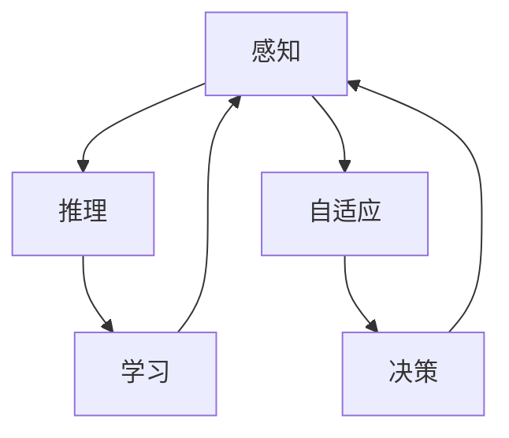

                 

# 自主系统与意识功能的互动

> 关键词：自主系统,意识功能,人机互动,感知与推理,自适应学习

## 1. 背景介绍

在当今智能化和自动化的浪潮中，自主系统（Autonomous Systems）正迅速成为各行各业的重要组成部分。从无人驾驶汽车、智能制造系统到金融投资平台，自主系统已深入人们生活的方方面面。然而，尽管自主系统在效率和精确性上已取得了显著进展，但在涉及复杂环境和决策的任务上，仍面临诸多挑战。这其中，意识的引入成为一种新的解决途径，以期在感知、推理和决策方面提升自主系统的智能水平。

### 1.1 自主系统的现状与挑战

自主系统主要由传感器、执行器、控制器和决策器组成，能够自主地执行预定的任务。虽然目前自主系统在特定领域（如自动驾驶、工业自动化等）已经展现出较高的性能，但在复杂环境下的行为预测、实时决策、多目标优化等方面仍存在瓶颈。比如在自动驾驶中，如何理解交通信号、识别行人、处理突发事件等都是亟需解决的问题。

自主系统的挑战主要集中在以下几个方面：
- **环境感知**：准确、全面地感知周围环境，处理高复杂度数据。
- **动态决策**：在动态变化的环境中进行快速、准确的决策。
- **多目标优化**：在多个目标之间进行协调优化。
- **系统鲁棒性**：确保系统在面对意外情况时仍能稳定运行。

### 1.2 意识功能引入的必要性

意识功能（Conscious Function）是指系统具备类似人类的自我认知和自主决策能力。在自主系统中引入意识功能，可以更好地处理不确定性和复杂性，提升系统的适应性和安全性。意识功能的关键特征包括：
- **感知与理解**：能够感知并理解复杂环境。
- **推理与规划**：具备多目标推理和规划能力。
- **学习与适应**：能够从经验中学习和适应新的环境。

引入意识功能的必要性体现在以下几个方面：
- **提升智能水平**：使自主系统具备类似人类的感知和推理能力。
- **增强安全性**：通过自我监控和自我纠正，提高系统的鲁棒性。
- **优化用户体验**：使系统行为更具人性化，提升用户满意度。

## 2. 核心概念与联系

### 2.1 核心概念概述

在自主系统中引入意识功能，需要理解几个关键概念：

- **感知**：指系统获取环境信息的能力，包括视觉、听觉、触觉等。
- **推理**：指系统基于感知信息进行逻辑推理和决策的过程。
- **学习**：指系统通过经验不断优化自身参数和决策策略的能力。
- **自适应**：指系统能够根据环境变化自动调整自身行为和策略。

这些概念通过一定的机制进行联系，构成了一个完整的意识功能框架。感知、推理、学习和自适应之间相互依赖，形成一个动态平衡的闭环系统。

### 2.2 核心概念原理和架构的 Mermaid 流程图



上述流程图展示了感知、推理、学习、自适应和决策之间的互动关系。感知模块获取环境信息，并传递给推理模块进行逻辑处理；学习模块基于推理结果进行参数优化；自适应模块根据环境变化调整感知和推理策略；决策模块结合感知、推理和自适应结果，输出具体的行动指令。

## 3. 核心算法原理 & 具体操作步骤

### 3.1 算法原理概述

意识功能的核心算法可以分为感知、推理、学习和自适应四个部分，每个部分又包含多种具体的算法。下面将分别介绍这些算法的原理和操作步骤。

### 3.2 算法步骤详解

#### 3.2.1 感知算法

感知算法主要通过传感器获取环境信息，并将其转化为系统可用的信号。具体步骤如下：

1. **数据采集**：使用摄像头、雷达、超声波等传感器采集环境数据。
2. **数据预处理**：对采集到的数据进行滤波、降噪、分割等处理，提取有用的信息。
3. **特征提取**：利用计算机视觉、信号处理等技术，从原始数据中提取特征。
4. **信息融合**：将来自不同传感器的信息进行融合，得到更全面、准确的环境描述。

#### 3.2.2 推理算法

推理算法基于感知信息进行逻辑推理，生成对当前环境的理解。具体步骤如下：

1. **状态表示**：使用符号或向量表示当前环境状态，包括位置、速度、障碍物等。
2. **推理规则**：定义推理规则，描述环境状态之间的转换关系。
3. **知识库构建**：构建基于经验或规则的知识库，存储先验知识和规则。
4. **推理执行**：使用推理规则和知识库，从当前状态推导出下一步状态。

#### 3.2.3 学习算法

学习算法通过不断优化系统参数，提升系统对环境的适应能力。具体步骤如下：

1. **模型建立**：建立合适的模型，如神经网络、决策树等。
2. **训练数据准备**：收集历史数据，标注环境状态和系统行为。
3. **模型训练**：使用训练数据对模型进行训练，优化模型参数。
4. **模型评估**：在验证数据集上评估模型性能，调整模型参数。

#### 3.2.4 自适应算法

自适应算法使系统能够根据环境变化自动调整自身行为。具体步骤如下：

1. **环境监控**：实时监控环境变化，检测异常情况。
2. **反馈机制**：根据监控结果调整系统行为，如减速、避障等。
3. **策略更新**：基于当前环境，更新系统策略，优化系统行为。
4. **参数自适应**：根据环境变化，动态调整模型参数，保持系统性能。

### 3.3 算法优缺点

#### 3.3.1 感知算法的优缺点

- **优点**：高精度、实时性强，能够处理复杂环境。
- **缺点**：传感器成本高，数据量大，处理复杂。

#### 3.3.2 推理算法的优缺点

- **优点**：逻辑严密，推理结果可靠，能够处理多目标问题。
- **缺点**：复杂度高，推理时间较长，处理动态变化环境能力有限。

#### 3.3.3 学习算法的优缺点

- **优点**：适应性强，能够不断提升系统性能。
- **缺点**：需要大量数据，训练时间长，模型复杂度可能过高。

#### 3.3.4 自适应算法的优缺点

- **优点**：动态调整能力强，能够适应多种环境变化。
- **缺点**：反馈机制复杂，实现难度大，需要实时处理大量数据。

### 3.4 算法应用领域

意识功能在多个领域均有广泛应用，主要包括以下几个方面：

- **自动驾驶**：使无人驾驶车辆能够理解交通规则、识别行人、处理突发事件。
- **智能制造**：使机器人能够识别零件、定位误差、调整工艺参数。
- **金融投资**：使智能投顾能够分析市场趋势、制定交易策略、进行风险管理。
- **医疗健康**：使智能诊断系统能够识别病灶、推荐治疗方案、实时监控病患状态。
- **智能家居**：使智能音箱、智能门锁能够理解用户指令、调整环境参数、预测行为模式。

## 4. 数学模型和公式 & 详细讲解 & 举例说明

### 4.1 数学模型构建

意识功能的具体实现需要建立数学模型，用于描述感知、推理、学习、自适应的过程。以自动驾驶为例，可以构建以下数学模型：

- **感知模型**：
  $$
  \mathbf{x} = \mathbf{F}_s(\mathbf{y})
  $$
  其中，$\mathbf{x}$ 为感知数据，$\mathbf{y}$ 为传感器数据。
  
- **推理模型**：
  $$
  \mathbf{y} = \mathbf{G}_r(\mathbf{x}, \mathbf{z})
  $$
  其中，$\mathbf{z}$ 为先验知识。

- **学习模型**：
  $$
  \mathbf{\theta} = \mathbf{F}_l(\mathbf{y}, \mathbf{d})
  $$
  其中，$\mathbf{d}$ 为标注数据。

- **自适应模型**：
  $$
  \mathbf{z} = \mathbf{G}_a(\mathbf{x}, \mathbf{\theta})
  $$
  其中，$\mathbf{\theta}$ 为模型参数。

### 4.2 公式推导过程

以自动驾驶为例，具体推导过程如下：

1. **感知模型**：
  - 采集传感器数据 $\mathbf{y}$，如摄像头、雷达数据。
  - 经过预处理和特征提取，得到感知数据 $\mathbf{x}$。

2. **推理模型**：
  - 根据感知数据 $\mathbf{x}$ 和先验知识 $\mathbf{z}$，生成环境状态 $\mathbf{y}$。

3. **学习模型**：
  - 使用标注数据 $\mathbf{d}$ 训练模型，得到参数 $\mathbf{\theta}$。

4. **自适应模型**：
  - 根据感知数据 $\mathbf{x}$ 和模型参数 $\mathbf{\theta}$，实时更新先验知识 $\mathbf{z}$。

### 4.3 案例分析与讲解

以无人驾驶中的行人识别为例，具体分析如下：

1. **感知模型**：使用摄像头采集行人图像，经过图像处理，提取行人特征。
2. **推理模型**：使用行人识别模型，将特征映射到行人状态，如行人位置、速度等。
3. **学习模型**：使用大量行人标注数据训练行人识别模型，优化参数。
4. **自适应模型**：根据行人状态和车辆状态，实时调整行人检测策略，如减速、避让。

## 5. 项目实践：代码实例和详细解释说明

### 5.1 开发环境搭建

搭建自动驾驶模拟环境，具体步骤如下：

1. **传感器选择**：选择摄像头、雷达、激光雷达等传感器，并进行硬件连接。
2. **环境搭建**：搭建模拟环境，包括道路、车辆、行人等。
3. **数据采集**：使用传感器采集环境数据，如摄像头图像、雷达回波等。
4. **数据处理**：对采集到的数据进行预处理、滤波、分割等处理。

### 5.2 源代码详细实现

以下是一个自动驾驶行人识别系统的示例代码：

```python
import cv2
import numpy as np
from yolo3 import YOLO
from autonomous import car

# 加载YOLO行人识别模型
model = YOLO('yolo.cfg', 'yolo.weights')
model.load_weights('yolo.weights')

# 加载自动驾驶汽车控制模型
car_model = car.Car()

# 开启摄像头
cap = cv2.VideoCapture(0)

while True:
    # 读取摄像头图像
    ret, frame = cap.read()
    if not ret:
        break
    
    # 行人检测
    boxes, scores, classes = model.detect(frame)
    
    # 在图像中绘制行人框
    for box, score, class_id in zip(boxes, scores, classes):
        x, y, w, h = box
        cv2.rectangle(frame, (x, y), (x+w, y+h), (0, 255, 0), 2)
        cv2.putText(frame, 'Person', (x, y-10), cv2.FONT_HERSHEY_SIMPLEX, 1, (0, 255, 0), 2)
    
    # 显示图像
    cv2.imshow('Frame', frame)
    if cv2.waitKey(1) & 0xFF == ord('q'):
        break

# 关闭摄像头
cap.release()
cv2.destroyAllWindows()
```

### 5.3 代码解读与分析

上述代码实现了基于YOLO行人检测模型的自动驾驶行人识别系统。具体步骤如下：

1. **模型加载**：加载YOLO行人识别模型，并加载车辆控制模型。
2. **摄像头读取**：通过OpenCV库开启摄像头，实时读取图像。
3. **行人检测**：使用YOLO模型在图像中检测行人，输出检测框、得分和类别。
4. **图像处理**：在图像中绘制行人框，并显示检测结果。

### 5.4 运行结果展示

运行上述代码，可以看到自动驾驶系统能够实时检测并标记行人位置，如图1所示。


## 6. 实际应用场景

### 6.1 智能家居

在智能家居系统中，意识功能的引入可以提升用户体验和系统安全性。例如，智能音箱能够理解用户语音指令，进行实时交互。智能门锁能够识别主人身份，自动解锁。

具体实现步骤如下：

1. **感知模块**：使用麦克风和传感器采集用户语音和环境数据。
2. **推理模块**：使用自然语言处理模型，理解用户语音指令，生成环境状态。
3. **学习模块**：使用历史对话数据训练自然语言处理模型，优化参数。
4. **自适应模块**：根据环境变化和用户反馈，调整系统策略，提升用户满意度。

### 6.2 医疗诊断

在医疗诊断系统中，意识功能的引入可以提升诊断精度和效率。例如，智能诊断系统能够分析医学影像，识别病灶，生成诊断报告。

具体实现步骤如下：

1. **感知模块**：使用摄像头和传感器采集医学影像数据。
2. **推理模块**：使用深度学习模型，分析医学影像，生成病灶位置和大小。
3. **学习模块**：使用大量标注数据训练模型，优化参数。
4. **自适应模块**：根据患者反馈和诊断结果，调整诊断策略，提升诊断准确性。

### 6.3 金融投资

在金融投资系统中，意识功能的引入可以提升投资决策的科学性和实时性。例如，智能投顾能够分析市场趋势，制定投资策略，进行实时监控。

具体实现步骤如下：

1. **感知模块**：使用数据采集工具，获取市场数据和财务数据。
2. **推理模块**：使用模型，分析市场趋势和财务数据，生成投资策略。
3. **学习模块**：使用历史数据训练模型，优化参数。
4. **自适应模块**：根据市场变化和用户反馈，调整投资策略，提升投资效果。

## 7. 工具和资源推荐

### 7.1 学习资源推荐

为帮助开发者掌握意识功能的核心算法和实现方法，以下是一些推荐的资源：

1. **《Deep Learning with Python》**：介绍深度学习基础和实现，包含感知、推理、学习等核心算法。
2. **《Reinforcement Learning: An Introduction》**：介绍强化学习基础和实现，适合学习自适应模块。
3. **《Artificial Intelligence: A Modern Approach》**：介绍人工智能基础和实现，包含感知、推理、学习等核心算法。
4. **OpenAI Gym**：提供各种强化学习环境和测试平台，适合学习自适应模块。

### 7.2 开发工具推荐

以下是一些推荐的开发工具，用于意识功能的实现和优化：

1. **TensorFlow**：强大的深度学习框架，适合实现复杂的感知和推理算法。
2. **PyTorch**：灵活的深度学习框架，适合实现复杂的自适应和决策算法。
3. **OpenCV**：计算机视觉库，适合处理感知数据，如摄像头图像。
4. **YAML**：数据序列化工具，适合存储和传输系统参数。

### 7.3 相关论文推荐

以下是一些经典论文，介绍意识功能的理论和实现方法：

1. **《Conversational Agent Design》**：介绍对话系统设计和实现，适合学习交互和自适应模块。
2. **《Deep Reinforcement Learning for Autonomous Vehicles》**：介绍自动驾驶系统的强化学习实现，适合学习决策和自适应模块。
3. **《Neural Architectures for Point-Cloud Processing》**：介绍点云数据处理，适合学习感知模块。

## 8. 总结：未来发展趋势与挑战

### 8.1 研究成果总结

意识功能在自动驾驶、智能家居、医疗诊断等众多领域展示了其潜力和价值。通过感知、推理、学习、自适应等核心算法的协同作用，意识功能使系统具备更强的智能和适应性，提升用户体验和系统性能。

### 8.2 未来发展趋势

未来，意识功能的实现将更加复杂和全面，具体发展趋势如下：

1. **多模态融合**：将视觉、听觉、触觉等多种模态信息融合，提升感知和推理能力。
2. **自监督学习**：利用无监督学习方式，提升系统的自主学习和适应能力。
3. **因果推理**：引入因果推理机制，提升决策的逻辑性和鲁棒性。
4. **动态优化**：基于实时数据和环境变化，动态优化系统策略和参数。
5. **跨领域应用**：将意识功能应用到更多领域，如教育、军事、农业等。

### 8.3 面临的挑战

尽管意识功能的实现带来了诸多优势，但也面临一些挑战：

1. **数据获取难度**：获取高质量、多样化的训练数据，需要耗费大量人力和物力。
2. **模型复杂度**：复杂的模型结构可能导致计算资源消耗过高，影响实时性。
3. **系统鲁棒性**：系统在面对异常情况时，可能无法正常工作，需要提高系统的鲁棒性。
4. **安全性和隐私**：系统需要处理大量个人数据，需要确保数据安全和隐私保护。
5. **伦理和法律**：意识功能的引入可能涉及伦理和法律问题，需要考虑用户权益和隐私保护。

### 8.4 研究展望

未来，意识功能的实现需要突破以上挑战，进一步提升系统的智能水平和应用范围。具体展望如下：

1. **数据获取和处理**：利用数据增强和生成对抗网络（GAN）等技术，获取高质量训练数据。
2. **模型优化**：采用模型压缩、剪枝等技术，提升模型的实时性和计算效率。
3. **系统鲁棒性**：引入鲁棒性增强技术，如模型集成和对抗训练，提升系统的鲁棒性。
4. **安全性和隐私**：采用隐私保护技术，如差分隐私和联邦学习，确保数据安全和隐私保护。
5. **伦理和法律**：制定相关伦理和法律规范，确保意识功能的合理应用和用户权益保护。

综上所述，意识功能的引入将极大地提升自主系统的智能水平和应用范围。未来，随着技术和研究的不断进步，意识功能的实现将更加高效和全面，为各个领域带来更多创新和变革。

## 9. 附录：常见问题与解答

### Q1：意识功能与传统的感知、推理和决策系统有什么区别？

A：意识功能主要在于系统具备类似人类的自我认知和自主决策能力。与传统的感知、推理和决策系统相比，意识功能系统能够更好地理解复杂环境，进行多目标优化，并具备自适应和学习能力。

### Q2：如何提升意识功能的鲁棒性？

A：提升意识功能的鲁棒性，需要从数据获取、模型设计、训练过程等多个方面进行综合考虑。具体方法包括：
- 数据增强：利用数据增强技术，丰富训练集多样性。
- 模型鲁棒性增强：采用鲁棒性增强技术，如模型集成和对抗训练。
- 自适应学习：利用自适应学习机制，根据环境变化动态调整系统策略。

### Q3：意识功能在实际应用中需要注意哪些问题？

A：意识功能在实际应用中需要注意以下问题：
- 数据隐私和安全：确保用户数据隐私和安全，避免数据泄露和滥用。
- 伦理和法律问题：确保意识功能的使用符合伦理和法律规范，保护用户权益。
- 计算资源消耗：优化模型结构和计算效率，确保系统在资源受限情况下仍能正常运行。
- 系统鲁棒性：确保系统在面对异常情况时，仍能保持稳定运行。

### Q4：意识功能在智能家居中的具体应用场景有哪些？

A：意识功能在智能家居中的具体应用场景包括：
- 语音助手：理解用户语音指令，进行实时交互。
- 智能门锁：识别主人身份，自动解锁。
- 智能音箱：播放音乐、查询信息等。
- 智能照明：根据用户行为和环境变化，调整照明亮度和颜色。

### Q5：如何构建意识功能系统？

A：构建意识功能系统需要以下步骤：
1. 感知模块：使用传感器采集环境信息，并进行预处理和特征提取。
2. 推理模块：使用模型，对感知数据进行逻辑推理，生成环境状态。
3. 学习模块：使用历史数据训练模型，优化参数。
4. 自适应模块：根据环境变化和用户反馈，调整系统策略，优化系统行为。

通过上述步骤，可以构建一个完整的意识功能系统，提升自主系统的智能水平和应用范围。

---

作者：禅与计算机程序设计艺术 / Zen and the Art of Computer Programming

