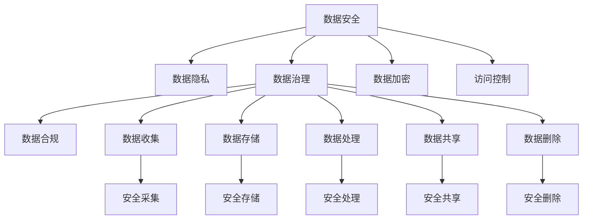

                 

# 自动化创业中的数据安全与隐私保护

自动化技术的迅猛发展为创业提供了前所未有的机遇，但也带来了新的挑战，尤其是在数据安全与隐私保护方面。本文将系统地介绍自动化创业中数据安全与隐私保护的核心概念、算法原理、实践步骤，并通过案例分析来阐述其在实际应用中的关键作用。同时，本文还将提供相关的工具和资源推荐，以及总结未来的发展趋势与面临的挑战。

## 1. 背景介绍

随着人工智能、大数据、物联网等技术的不断进步，自动化正在改变各行各业的运营模式。自动化技术以其效率高、成本低、灵活性强的特点，迅速成为创业者和企业关注的焦点。然而，自动化过程中数据的收集、存储、传输和处理过程涉及大量敏感信息，如何在自动化创业中确保数据安全与隐私保护，成为了一个重要课题。

### 1.1 数据安全与隐私保护的重要性

在自动化创业中，数据是关键资产，也是创业项目的重要资源。数据泄露、未经授权的访问、数据滥用等问题，都会对企业带来巨大的损失，甚至导致项目失败。因此，保护数据安全与隐私，确保数据的合法、合规使用，是自动化创业成功的基础。

### 1.2 自动化创业中的数据安全与隐私挑战

自动化创业通常需要收集、处理和共享大量的用户数据，包括用户画像、交易记录、位置信息等。数据的安全性和隐私性要求高，但创业初期资源有限，难以投入大量资金和技术力量进行数据保护。此外，自动化系统复杂性高，数据泄露风险增加，这也对数据安全与隐私保护提出了更高的要求。

## 2. 核心概念与联系

### 2.1 核心概念概述

在自动化创业中，数据安全与隐私保护涉及多个关键概念：

- **数据安全**：指保护数据免受未经授权的访问、修改、泄露等威胁，确保数据的完整性、可用性和机密性。
- **数据隐私**：指保护个人数据的隐私权，防止个人数据被滥用、未经授权的收集和使用。
- **数据治理**：指对数据的全生命周期管理，包括数据收集、存储、处理、共享、删除等各个环节的控制和管理。
- **数据合规**：指符合相关法律法规对数据使用的规定，确保数据处理过程的合法性。
- **数据加密**：指对数据进行加密处理，确保数据在传输和存储过程中的安全性。
- **访问控制**：指对数据访问进行控制，确保只有授权人员或系统能够访问敏感数据。

### 2.2 核心概念联系

数据安全与隐私保护是一个系统工程，涉及多个核心概念。以下是这些概念之间的联系及其示意图：



这些概念相互关联，共同构成了一个数据安全与隐私保护的全生命周期管理框架。数据治理贯穿始终，确保数据在整个生命周期中的安全与合规。

## 3. 核心算法原理 & 具体操作步骤

### 3.1 算法原理概述

数据安全与隐私保护的核心算法主要包括数据加密、访问控制、差分隐私等技术。这些算法通过不同的方式保护数据，使其在传输、存储和使用过程中不被非法访问和滥用。

### 3.2 算法步骤详解

以下是数据安全与隐私保护的主要算法步骤详解：

#### 3.2.1 数据加密算法

**算法步骤**：
1. 确定需要加密的数据。
2. 选择合适的加密算法（如AES、RSA等）。
3. 对数据进行加密处理。
4. 将加密后的数据传输或存储。

**案例分析**：
假设某自动化创业项目需要处理用户的交易记录，数据包含用户的姓名、交易金额等敏感信息。为确保数据安全，可以对这些数据进行加密处理，并使用AES算法对数据进行加密。加密后，数据将存储在数据库中，确保只有授权人员才能解密并访问。

#### 3.2.2 访问控制算法

**算法步骤**：
1. 确定需要访问控制的数据。
2. 设定访问权限规则。
3. 实现访问控制机制。
4. 监控和审计访问行为。

**案例分析**：
某自动化创业项目开发了一个智能客服系统，系统需要访问用户的交易记录以提供服务。为保护用户隐私，可以对交易记录设定访问权限，只有经过授权的客服人员才能访问。同时，系统需对访问行为进行监控和审计，确保合规使用。

#### 3.2.3 差分隐私算法

**算法步骤**：
1. 确定需要差分隐私的数据。
2. 设定隐私预算。
3. 进行数据扰动处理。
4. 发布处理后的数据。

**案例分析**：
某自动化创业项目需要收集用户的位置信息，用于分析用户行为。为保护用户隐私，可以使用差分隐私算法，将位置信息进行扰动处理，并设定隐私预算。处理后的数据可以发布使用，同时确保不泄露用户的具体位置信息。

### 3.3 算法优缺点

#### 3.3.1 数据加密算法

**优点**：
1. 可以防止数据泄露。
2. 加密后的数据难以被非法解读。
3. 可以确保数据的完整性。

**缺点**：
1. 加密和解密过程较为复杂，增加了系统复杂性。
2. 加密算法的安全性依赖于密钥管理。
3. 加密后数据处理和存储成本较高。

#### 3.3.2 访问控制算法

**优点**：
1. 可以控制数据的访问权限。
2. 可以监控和审计访问行为。
3. 可以保护数据免受未经授权的访问。

**缺点**：
1. 复杂的访问控制规则增加了系统复杂性。
2. 需要对访问行为进行监控和审计，增加了系统维护成本。

#### 3.3.3 差分隐私算法

**优点**：
1. 可以在保护隐私的前提下发布数据。
2. 可以在处理数据的同时保护用户隐私。
3. 可以应对大数据分析中的隐私泄露风险。

**缺点**：
1. 扰动后的数据精度降低，影响数据分析结果。
2. 隐私预算的设定较为复杂，需要权衡隐私和数据质量。
3. 差分隐私算法的实现较为复杂，增加了系统复杂性。

## 4. 数学模型和公式 & 详细讲解

### 4.1 数学模型构建

数据安全与隐私保护的数学模型主要包括数据加密、访问控制和差分隐私的数学模型。以下是这些模型的构建过程：

#### 4.1.1 数据加密模型

**构建过程**：
1. 定义明文数据 $m$。
2. 选择加密算法 $E$ 和密钥 $k$。
3. 加密明文数据 $m$ 得到密文 $c = E(m, k)$。
4. 解密密文 $c$ 得到明文 $m = D(c, k)$。

**公式推导**：
$$
c = E(m, k) = f(m, k)
$$
$$
m = D(c, k) = g(c, k)
$$

#### 4.1.2 访问控制模型

**构建过程**：
1. 定义数据 $d$ 和访问规则 $P$。
2. 根据访问规则 $P$ 确定访问权限。
3. 实现访问控制机制。
4. 监控和审计访问行为。

**公式推导**：
$$
\text{Access}(d, P) = \begin{cases}
1, & \text{如果 } d \text{ 满足 } P \\
0, & \text{如果 } d \text{ 不满足 } P
\end{cases}
$$

#### 4.1.3 差分隐私模型

**构建过程**：
1. 定义原始数据 $x$ 和隐私预算 $\epsilon$。
2. 对数据 $x$ 进行扰动处理得到 $x'$。
3. 发布扰动后的数据 $x'$。

**公式推导**：
$$
x' = x + \delta
$$
其中 $\delta$ 是扰动噪声，满足：
$$
P(|\delta| > \epsilon) < \frac{\epsilon}{\Delta}
$$
$\Delta$ 是数据敏感度，$\epsilon$ 是隐私预算。

### 4.2 公式推导过程

#### 4.2.1 数据加密算法

**推导过程**：
1. 明文 $m$ 转化为二进制串 $m = (m_1, m_2, ..., m_n)$。
2. 使用密钥 $k$ 对明文 $m$ 进行加密处理。
3. 加密后的密文 $c = (c_1, c_2, ..., c_n)$。

**公式表示**：
$$
c_i = E(m_i, k) = k \oplus m_i
$$

#### 4.2.2 访问控制算法

**推导过程**：
1. 定义数据 $d = (d_1, d_2, ..., d_n)$。
2. 定义访问规则 $P = (p_1, p_2, ..., p_n)$。
3. 根据访问规则 $P$ 确定访问权限。

**公式表示**：
$$
\text{Access}(d, P) = \begin{cases}
1, & \text{如果 } d_i \in p_i \\
0, & \text{如果 } d_i \notin p_i
\end{cases}
$$

#### 4.2.3 差分隐私算法

**推导过程**：
1. 定义原始数据 $x = (x_1, x_2, ..., x_n)$。
2. 定义扰动噪声 $\delta = (\delta_1, \delta_2, ..., \delta_n)$。
3. 对数据 $x$ 进行扰动处理得到 $x' = (x_1 + \delta_1, x_2 + \delta_2, ..., x_n + \delta_n)$。

**公式表示**：
$$
x'_i = x_i + \delta_i
$$

### 4.3 案例分析与讲解

**案例分析**：
某自动化创业项目需要处理用户的交易记录，数据包含用户的姓名、交易金额等敏感信息。为确保数据安全，可以对这些数据进行加密处理，并使用AES算法对数据进行加密。加密后，数据将存储在数据库中，确保只有授权人员才能解密并访问。

**分析讲解**：
1. **数据加密**：使用AES算法对交易记录进行加密处理。加密后的数据存储在数据库中。
2. **访问控制**：设定访问权限规则，只有经过授权的客服人员才能访问交易记录。系统对访问行为进行监控和审计，确保合规使用。

## 5. 项目实践：代码实例和详细解释说明

### 5.1 开发环境搭建

在进行数据安全与隐私保护的项目实践前，我们需要准备好开发环境。以下是使用Python进行PyTorch开发的环境配置流程：

1. 安装Anaconda：从官网下载并安装Anaconda，用于创建独立的Python环境。

2. 创建并激活虚拟环境：
```bash
conda create -n pytorch-env python=3.8 
conda activate pytorch-env
```

3. 安装PyTorch：根据CUDA版本，从官网获取对应的安装命令。例如：
```bash
conda install pytorch torchvision torchaudio cudatoolkit=11.1 -c pytorch -c conda-forge
```

4. 安装TensorFlow：由Google主导开发的开源深度学习框架，生产部署方便，适合大规模工程应用。同样有丰富的预训练语言模型资源。

5. 安装Transformer库：
```bash
pip install transformers
```

6. 安装各类工具包：
```bash
pip install numpy pandas scikit-learn matplotlib tqdm jupyter notebook ipython
```

完成上述步骤后，即可在`pytorch-env`环境中开始数据安全与隐私保护的项目实践。

### 5.2 源代码详细实现

下面我们以差分隐私为例，给出使用PyTorch进行数据扰动的PyTorch代码实现。

首先，定义数据扰动函数：

```python
import torch
from torch.distributions import Laplace

def laplace_noise(x, epsilon=1e-5, delta=0.1):
    # 计算噪声分布
    scale = epsilon / delta
    noise_dist = Laplace(loc=torch.zeros_like(x), scale=scale)
    # 生成噪声
    noise = noise_dist.sample()
    # 扰动数据
    x_plus_noise = x + noise
    return x_plus_noise
```

然后，定义测试函数：

```python
import numpy as np

# 生成原始数据
x = np.array([1.0, 2.0, 3.0, 4.0])

# 添加扰动
x_plus_noise = laplace_noise(x)

# 输出扰动后的数据
print(x_plus_noise)
```

### 5.3 代码解读与分析

让我们再详细解读一下关键代码的实现细节：

**laplace_noise函数**：
- 计算噪声分布。根据隐私预算 $\epsilon$ 和数据敏感度 $\Delta$，计算噪声的尺度 $scale$。
- 生成噪声。使用Laplace分布生成噪声。
- 扰动数据。将原始数据 $x$ 加上噪声，得到扰动后的数据 $x+$噪声。

**测试函数**：
- 生成原始数据 $x$。
- 添加扰动。调用 `laplace_noise` 函数对数据进行扰动处理。
- 输出扰动后的数据。

可以看到，使用差分隐私技术对数据进行扰动，可以在保护隐私的前提下发布数据，确保数据的安全性。

## 6. 实际应用场景

### 6.1 智能客服系统

在智能客服系统中，保护用户隐私是关键。为确保用户隐私不被泄露，可以采用数据加密和访问控制技术。例如，对用户的交易记录进行加密处理，只有经过授权的客服人员才能访问这些数据。同时，系统需要对访问行为进行监控和审计，确保合规使用。

### 6.2 金融舆情监测

金融舆情监测需要处理大量的用户数据，包括交易记录、用户画像等。为保护用户隐私，可以采用差分隐私技术，对敏感数据进行扰动处理。同时，需要设置合理的隐私预算，确保数据在保护隐私的前提下，仍能提供有效的分析结果。

### 6.3 个性化推荐系统

个性化推荐系统需要收集和分析大量的用户数据，包括用户的浏览记录、购买记录等。为保护用户隐私，可以采用差分隐私技术，对数据进行扰动处理。同时，需要确保推荐结果的质量，避免隐私保护对推荐效果的影响。

### 6.4 未来应用展望

未来，数据安全与隐私保护技术将在更多的自动化应用场景中得到应用。随着数据量的增长和数据处理复杂性的提升，数据安全与隐私保护技术将成为自动化创业的重要保障。

## 7. 工具和资源推荐

### 7.1 学习资源推荐

为了帮助开发者系统掌握数据安全与隐私保护的理论基础和实践技巧，这里推荐一些优质的学习资源：

1. 《数据安全与隐私保护》系列博文：由大模型技术专家撰写，深入浅出地介绍了数据安全与隐私保护的基本概念和关键技术。

2. 《网络安全与隐私保护》课程：斯坦福大学开设的网络安全课程，涵盖网络安全、加密技术、隐私保护等方面的内容，适合全面了解数据安全与隐私保护的理论和实践。

3. 《数据隐私保护》书籍：介绍数据隐私保护的基本概念、法律法规和技术手段，适合深入学习数据隐私保护的原理和实践。

4. 《数据加密技术》书籍：详细讲解了各种数据加密算法和实现技术，适合学习数据加密的基本原理和实践。

5. 《访问控制技术》书籍：介绍访问控制的基本概念、模型和实现方法，适合学习访问控制技术的原理和实践。

通过对这些资源的学习实践，相信你一定能够快速掌握数据安全与隐私保护的核心技术，并用于解决实际的NLP问题。

### 7.2 开发工具推荐

高效的开发离不开优秀的工具支持。以下是几款用于数据安全与隐私保护开发的常用工具：

1. PyTorch：基于Python的开源深度学习框架，灵活动态的计算图，适合快速迭代研究。大部分预训练语言模型都有PyTorch版本的实现。

2. TensorFlow：由Google主导开发的开源深度学习框架，生产部署方便，适合大规模工程应用。同样有丰富的预训练语言模型资源。

3. Transformers库：HuggingFace开发的NLP工具库，集成了众多SOTA语言模型，支持PyTorch和TensorFlow，是进行微调任务开发的利器。

4. Weights & Biases：模型训练的实验跟踪工具，可以记录和可视化模型训练过程中的各项指标，方便对比和调优。与主流深度学习框架无缝集成。

5. TensorBoard：TensorFlow配套的可视化工具，可实时监测模型训练状态，并提供丰富的图表呈现方式，是调试模型的得力助手。

合理利用这些工具，可以显著提升数据安全与隐私保护任务的开发效率，加快创新迭代的步伐。

### 7.3 相关论文推荐

数据安全与隐私保护的发展源于学界的持续研究。以下是几篇奠基性的相关论文，推荐阅读：

1. "Data Privacy: A Survey on Recent Trends and Solutions"（数据隐私：最近趋势和解决方案综述）：介绍了数据隐私保护的基本概念、技术手段和最新进展，适合全面了解数据隐私保护的理论和实践。

2. "Differential Privacy"（差分隐私）：差分隐私算法的基础论文，介绍了差分隐私的基本概念和理论基础，适合深入学习差分隐私的原理和实践。

3. "Data Security and Privacy: Foundations, Algorithms, and Protocols"（数据安全与隐私：基础、算法和协议）：介绍了数据安全与隐私保护的基本概念、算法和技术手段，适合全面了解数据安全与隐私保护的理论和实践。

4. "Secure Multi-party Computation"（安全多方计算）：介绍了安全多方计算的基本概念和实现方法，适合学习安全多方计算的原理和实践。

5. "Homomorphic Encryption"（同态加密）：介绍了同态加密的基本概念和实现方法，适合学习同态加密的原理和实践。

这些论文代表了大数据安全与隐私保护的发展脉络。通过学习这些前沿成果，可以帮助研究者把握学科前进方向，激发更多的创新灵感。

## 8. 总结：未来发展趋势与挑战

### 8.1 总结

本文对数据安全与隐私保护的核心概念、算法原理、实践步骤进行了系统介绍。首先，我们详细讲解了数据安全与隐私保护的基本概念，包括数据安全、数据隐私、数据治理、数据合规、数据加密、访问控制等。然后，我们深入探讨了数据安全与隐私保护的主要算法，如数据加密、访问控制、差分隐私等，并给出了详细的算法步骤和案例分析。最后，我们提供了相关的学习资源、开发工具和论文推荐，帮助读者深入理解数据安全与隐私保护的理论和实践。

通过本文的系统梳理，可以看到，数据安全与隐私保护是大数据时代的重要课题。自动化创业中，数据的收集、存储、传输和使用过程涉及大量敏感信息，如何在自动化过程中保护数据安全与隐私，已成为创业成功的关键因素之一。

### 8.2 未来发展趋势

展望未来，数据安全与隐私保护技术将呈现以下几个发展趋势：

1. 数据安全与隐私保护技术将更加成熟，能够提供更全面、高效的保护手段。

2. 数据加密技术将更加复杂，能够提供更强的安全保障。

3. 访问控制技术将更加智能，能够实现更加精细的权限管理。

4. 差分隐私技术将更加普及，能够更好地保护用户隐私。

5. 安全多方计算技术将得到更多应用，能够实现更加安全的数据共享和协作。

6. 同态加密技术将逐渐成熟，能够实现数据的实时处理和分析。

以上趋势凸显了数据安全与隐私保护技术的广阔前景。这些方向的探索发展，必将进一步提升数据保护的能力，为自动化创业提供更坚实的技术保障。

### 8.3 面临的挑战

尽管数据安全与隐私保护技术已经取得了一定的进展，但在迈向更加智能化、普适化应用的过程中，仍面临诸多挑战：

1. 数据隐私保护与数据可用性的平衡。如何在保护用户隐私的同时，保证数据的可用性，是大数据安全与隐私保护的重要挑战。

2. 数据安全与隐私保护的复杂性。自动化创业中，数据处理和应用场景复杂多样，数据安全与隐私保护技术需要具备灵活性，能够应对多种应用场景。

3. 数据安全与隐私保护的资源投入。数据安全与隐私保护需要投入大量资源，包括人力、物力和时间，这对创业公司而言是一大负担。

4. 数据安全与隐私保护的技术门槛。数据安全与隐私保护技术复杂，需要具备一定的技术实力和经验，这对创业公司的人才储备提出了较高的要求。

5. 数据安全与隐私保护的法律法规。数据安全与隐私保护需要遵守相关法律法规，这对创业公司的合规性提出了较高的要求。

6. 数据安全与隐私保护的市场需求。数据安全与隐私保护的市场需求尚未充分释放，创业公司需要积极拓展市场，提升业务价值。

正视数据安全与隐私保护面临的这些挑战，积极应对并寻求突破，将是大数据安全与隐私保护走向成熟的必由之路。相信随着学界和产业界的共同努力，这些挑战终将一一被克服，数据安全与隐私保护技术必将在自动化创业中发挥越来越重要的作用。

### 8.4 研究展望

面对数据安全与隐私保护所面临的种种挑战，未来的研究需要在以下几个方面寻求新的突破：

1. 开发更加高效的数据加密算法。研究更加高效、复杂的数据加密算法，提高数据加密的速度和安全性。

2. 设计更加智能的访问控制策略。研究更加智能、精细的访问控制策略，实现更加高效、灵活的数据访问管理。

3. 探索更加实用的差分隐私技术。研究更加实用的差分隐私技术，提高数据隐私保护的效率和效果。

4. 融合更多的安全多方计算技术。研究安全多方计算技术，实现更加安全、高效的数据共享和协作。

5. 探索更加成熟的同态加密技术。研究更加成熟的同态加密技术，实现数据的实时处理和分析。

6. 引入伦理道德约束。在数据安全与隐私保护过程中，引入伦理道德约束，确保数据使用的合法性和道德性。

这些研究方向的探索，必将引领数据安全与隐私保护技术迈向更高的台阶，为自动化创业提供更坚实的技术保障。面向未来，数据安全与隐私保护技术还需要与其他人工智能技术进行更深入的融合，如知识表示、因果推理、强化学习等，多路径协同发力，共同推动自然语言理解和智能交互系统的进步。只有勇于创新、敢于突破，才能不断拓展数据保护的技术边界，让智能技术更好地造福人类社会。

## 9. 附录：常见问题与解答

**Q1：如何平衡数据隐私保护与数据可用性？**

A: 数据隐私保护与数据可用性之间存在一定的矛盾。为平衡两者，可以采用差分隐私技术，对数据进行扰动处理，确保数据在保护隐私的同时，仍能提供有效的分析结果。同时，需要在隐私预算的设定和数据处理的过程中，权衡隐私保护和数据可用性。

**Q2：如何选择合适的数据加密算法？**

A: 选择数据加密算法需要考虑多种因素，如数据类型、数据量、安全性要求等。一般而言，对称加密算法（如AES）适用于加密大量数据，非对称加密算法（如RSA）适用于加密密钥交换等。同时，需要确保密钥的安全管理，防止密钥泄露。

**Q3：如何实现智能访问控制？**

A: 实现智能访问控制，需要采用更加灵活、智能的访问控制策略。例如，使用基于角色的访问控制（RBAC），根据用户的角色和权限，动态调整访问控制策略。同时，需要对访问行为进行监控和审计，确保合规使用。

**Q4：如何处理大规模数据集的数据安全与隐私保护？**

A: 处理大规模数据集的数据安全与隐私保护，需要采用分布式计算和存储技术，如Hadoop、Spark等。同时，可以采用差分隐私、安全多方计算等技术，确保数据在分布式计算和存储过程中，仍能保证隐私和安全。

**Q5：如何保护移动设备上的数据安全与隐私？**

A: 保护移动设备上的数据安全与隐私，需要采用多种技术手段，如设备指纹识别、密码保护、安全存储等。同时，需要对移动应用进行安全审计，确保应用的安全性。

通过本文的系统梳理，可以看到，数据安全与隐私保护是大数据时代的重要课题。自动化创业中，数据的收集、存储、传输和使用过程涉及大量敏感信息，如何在自动化过程中保护数据安全与隐私，已成为创业成功的关键因素之一。未来，随着技术的不断进步和应用的不断扩展，数据安全与隐私保护技术必将为自动化创业提供更坚实的技术保障，推动自动化技术在各行业的普及和应用。

