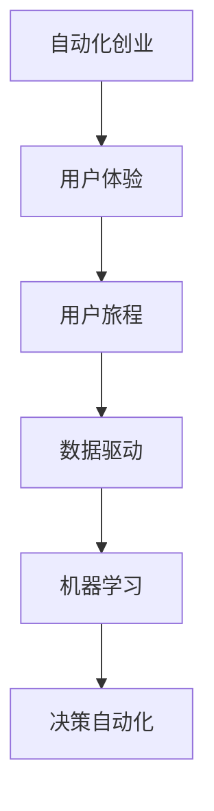

                 

# 自动化创业中的用户旅程优化

> 关键词：自动化创业、用户体验、用户旅程、数据驱动、机器学习、决策自动化、业务流程优化

## 1. 背景介绍

### 1.1 问题由来
随着互联网的普及和技术的进步，自动化创业成为新时代的热门趋势。从自动驾驶、智能制造到自动客服，自动化技术的应用范围不断扩大，为企业带来显著的效率提升和成本节约。然而，尽管技术层面已经取得了长足进步，但实际部署中仍面临诸多挑战。特别是在用户体验方面，传统的自动化系统往往难以充分考虑用户的实际需求和情感体验，导致自动化技术的应用效果大打折扣。

### 1.2 问题核心关键点
自动化创业中的用户体验优化，是推动技术应用落地的关键。如何构建用户友好、高效便捷的自动化服务，直接关系到系统的成功率和用户满意度。用户体验优化不仅包括界面设计、功能实现等显性因素，还涉及用户心理、行为等隐性因素。因此，本文聚焦于自动化创业中的用户旅程优化，提出基于数据驱动和机器学习的用户行为分析框架，以期提升自动化系统的用户体验和业务价值。

### 1.3 问题研究意义
用户体验优化对于自动化创业至关重要。一方面，优秀的用户体验能够提升用户黏性，增加用户转化率和留存率，从而实现更高的商业回报。另一方面，用户体验优化的反馈，可以进一步指导产品设计和功能改进，形成良性循环，推动自动化技术的持续创新。

本文将通过系统介绍用户旅程的概念、分析方法和优化策略，帮助创业者全面理解用户行为，从而设计出更高效、更符合用户需求和心理的自动化系统，加速自动化技术的落地应用。

## 2. 核心概念与联系

### 2.1 核心概念概述

为更好地理解用户旅程优化方法，本节将介绍几个密切相关的核心概念：

- **自动化创业**：指利用自动化技术进行业务流程优化、服务功能增强等创新创业活动。
- **用户体验**：用户在使用产品或服务时的心理感受和行为表现，包括使用效率、满意度、心理愉悦等。
- **用户旅程**：指用户在与产品或服务互动过程中的所有触点和环节，涵盖认知、情感、行为等多个方面。
- **数据驱动**：利用数据来指导产品设计和功能改进，提升用户体验。
- **机器学习**：通过算法分析用户行为数据，自动优化业务流程和用户体验。
- **决策自动化**：指通过数据和模型，自动进行决策分析，提升业务效率。

这些概念之间的逻辑关系可以通过以下Mermaid流程图来展示：



这个流程图展示了一个自动化创业项目中，用户体验优化的主要环节和影响因素：

1. 自动化创业项目通过数据驱动和机器学习，优化用户旅程，提升用户体验。
2. 数据驱动利用用户行为数据，分析用户旅程中的关键触点和环节。
3. 机器学习通过算法模型，自动分析用户行为，优化用户旅程。
4. 决策自动化根据用户旅程优化结果，自动进行业务流程和功能调整。

这些概念共同构成了自动化创业中用户体验优化的框架，帮助我们更全面地理解和优化用户体验。

## 3. 核心算法原理 & 具体操作步骤
### 3.1 算法原理概述

用户旅程优化本质上是利用数据和算法，对用户行为进行分析和预测，从而优化用户在使用自动化系统时的触点和环节，提升用户体验。其核心思想是：

1. **数据采集与分析**：通过各种手段收集用户在使用自动化系统时的行为数据，利用数据挖掘和机器学习技术，分析和理解用户的行为模式。
2. **用户旅程建模**：将用户行为数据映射到用户旅程的不同阶段，识别出关键触点和潜在痛点。
3. **优化策略制定**：根据用户旅程分析结果，制定优化策略，如界面设计改进、功能扩展、用户提示等，提升用户体验。
4. **反馈迭代**：持续收集用户反馈，利用机器学习模型更新优化策略，形成迭代优化的闭环。

### 3.2 算法步骤详解

用户旅程优化的主要步骤包括：

**Step 1: 数据采集**
- 设计数据收集方案，确定关键指标和数据来源。
- 使用API、日志、调查问卷等多种方式，收集用户行为数据。
- 对数据进行清洗和预处理，确保数据质量。

**Step 2: 用户行为分析**
- 利用数据挖掘技术，识别用户行为模式和用户分群。
- 通过可视化工具如Tableau、PowerBI等，呈现用户行为数据。
- 使用聚类算法等技术，对用户行为进行分组分析，识别出不同用户群体的特点。

**Step 3: 用户旅程建模**
- 根据用户行为分析结果，构建用户旅程模型。
- 确定用户旅程的关键触点和环节，如欢迎页、结账流程等。
- 对关键触点和环节进行分析，识别出用户可能的痛点和满意度不足的环节。

**Step 4: 优化策略制定**
- 根据用户旅程模型，制定针对性的优化策略。
- 包括界面设计改进、功能扩展、用户提示等，提升用户体验。
- 对优化策略进行评估，选择效果最优的方案。

**Step 5: 迭代优化**
- 在实际应用中，持续收集用户反馈，利用机器学习模型更新优化策略。
- 使用A/B测试等方法，验证优化策略的效果，不断迭代优化。

### 3.3 算法优缺点

用户旅程优化的优点包括：

1. **提升用户体验**：通过系统化的分析与优化，显著提升用户的使用效率和满意度。
2. **数据驱动决策**：以数据为基础，确保优化策略的科学性和有效性。
3. **灵活迭代**：持续收集用户反馈，实现动态优化，满足用户不断变化的需求。

然而，该方法也存在一些局限性：

1. **数据依赖度高**：依赖高质量的数据采集和处理，否则分析结果可能不够准确。
2. **模型复杂度高**：需要多种算法模型相结合，对技术要求较高。
3. **用户行为变化快**：用户行为模式的变化可能导致模型失效，需定期更新模型。
4. **成本较高**：数据采集和处理成本较高，且需要持续投入资源进行模型维护和迭代。

尽管存在这些局限性，但用户旅程优化仍是当前自动化创业中用户体验优化的主流范式，通过不断优化数据采集和分析技术，可以进一步降低成本和提高效率。

### 3.4 算法应用领域

用户旅程优化方法在多个领域中得到了广泛应用，例如：

- **智能客服**：通过分析用户对话行为，优化自动回复策略，提升客户满意度。
- **在线购物**：优化结账流程，减少用户流失，提升购物转化率。
- **医疗健康**：分析患者行为数据，优化诊疗流程，提高医疗服务的效率和质量。
- **金融服务**：通过分析用户交易行为，优化产品推荐和风险管理，提升用户信任和满意度。
- **物流配送**：优化包裹配送路径和反馈机制，提升用户送货体验。
- **旅游服务**：分析用户预订行为，优化推荐算法，提高用户预订成功率和满意度。

这些应用领域展示了用户旅程优化的广泛适用性和巨大价值，帮助企业优化用户体验，提升业务效率和市场竞争力。

## 4. 数学模型和公式 & 详细讲解  
### 4.1 数学模型构建

用户旅程优化的数学模型构建主要包括以下几个方面：

- **用户行为数据采集**：通过API、日志、问卷等方式，采集用户行为数据。
- **用户分群分析**：利用K-means聚类算法对用户进行分组，识别出不同用户群体的特点。
- **用户旅程建模**：将用户行为数据映射到用户旅程的不同阶段，识别出关键触点和痛点。
- **优化策略制定**：通过回归模型等技术，分析用户行为，提出优化策略。

### 4.2 公式推导过程

以下以智能客服优化为例，推导用户行为分析的数学公式：

假设智能客服系统有N个用户行为指标，采集到N个用户行为数据$x_1,x_2,\dots,x_N$，通过K-means聚类算法将用户分为K个群体，群体中心为$\mu_1,\mu_2,\dots,\mu_K$。则用户分群分析的数学公式为：

$$
\arg\min_{\mu} \sum_{i=1}^K \sum_{x_j \in G_i} \| x_j - \mu \|^2
$$

其中$G_i$表示第i个用户群体，$\mu$表示聚类中心。

对于用户旅程建模，我们定义用户旅程的不同阶段为$A_1,A_2,\dots,A_M$，用户在不同阶段的行为数据为$x_{i,j}$，则用户旅程建模的数学公式为：

$$
\arg\max_{p} \prod_{i=1}^M P(A_i|x_{i,j})
$$

其中$p$表示用户旅程的概率模型，$P(A_i|x_{i,j})$表示用户在第$i$个阶段的行为数据$x_{i,j}$发生第$A_i$事件的概率。

对于优化策略制定，我们假设优化后的策略对用户行为的影响为$y_i$，则优化策略制定的数学公式为：

$$
\arg\min_{y} \sum_{i=1}^N \| x_i - y \|^2
$$

其中$y$表示优化后的策略，$\| x_i - y \|^2$表示优化策略与用户行为数据之间的差异。

### 4.3 案例分析与讲解

假设我们有一个智能客服系统，收集到用户的提问和回复数据。通过K-means聚类算法，将用户分为三类：基础用户、普通用户和高级用户。接着，我们分析用户在不同阶段的问答行为，识别出以下关键触点：

- 用户登录时，表现为搜索频率较高，欢迎消息（如欢迎语、系统公告等）对用户有较强吸引力。
- 用户提问时，表现为语义清晰，对问题解答的准确性有较高要求。
- 用户完成提问时，表现为对回答满意度较高，对结束语（如感谢语、评分等）有较高敏感度。

根据这些分析结果，我们可以制定以下优化策略：

1. 优化欢迎消息，提高用户登录时的吸引力和满意度。
2. 提高问题解答的准确性，减少用户重问率。
3. 优化结束语，提升用户满意度并鼓励用户评分。

最终，这些优化策略可以显著提升智能客服系统的用户体验和满意度。

## 5. 项目实践：代码实例和详细解释说明
### 5.1 开发环境搭建

在进行用户旅程优化实践前，我们需要准备好开发环境。以下是使用Python进行数据驱动的用户旅程优化环境配置流程：

1. 安装Python：从官网下载并安装最新版本的Python。
2. 安装必要的库：使用pip安装pandas、numpy、scikit-learn、matplotlib等库。
3. 安装数据采集工具：如Fluentd、Prometheus、ELK Stack等，用于实时采集用户行为数据。
4. 安装数据分析工具：如Tableau、PowerBI等，用于数据可视化和用户分群分析。
5. 安装机器学习库：如Scikit-learn、TensorFlow、PyTorch等，用于构建和优化用户旅程模型。

完成上述步骤后，即可在Python环境中开始用户旅程优化的实践。

### 5.2 源代码详细实现

下面我们以智能客服系统为例，给出使用Scikit-learn对用户行为数据进行聚类分析和用户旅程建模的Python代码实现。

首先，定义用户行为数据集：

```python
import pandas as pd

# 定义用户行为数据
data = pd.DataFrame({
    'user_id': [1, 2, 3, 4, 5],
    'login_time': ['2021-01-01 10:00:00', '2021-01-01 11:00:00', '2021-01-01 13:00:00', '2021-01-01 14:00:00', '2021-01-01 16:00:00'],
    'search_count': [3, 4, 2, 1, 5],
    'question_count': [2, 3, 1, 2, 4],
    'answer_count': [1, 2, 2, 3, 4],
    'completion_rate': [0.8, 0.9, 0.7, 0.6, 0.9],
    'rating': [4, 3, 5, 2, 5]
})
```

接着，对用户进行聚类分析：

```python
from sklearn.cluster import KMeans

# 定义聚类算法
kmeans = KMeans(n_clusters=3, random_state=0)

# 对用户进行聚类
clusters = kmeans.fit_predict(data[['search_count', 'question_count', 'answer_count', 'completion_rate', 'rating']])
```

然后，进行用户旅程建模：

```python
from sklearn.compose import ColumnTransformer
from sklearn.pipeline import Pipeline
from sklearn.preprocessing import MinMaxScaler

# 定义数据预处理步骤
preprocessor = ColumnTransformer([
    ('scaler', MinMaxScaler(), ['search_count', 'question_count', 'answer_count', 'completion_rate', 'rating'])
])

# 定义用户旅程模型
pipeline = Pipeline([
    ('preprocessor', preprocessor),
    ('clustering', kmeans)
])
```

最后，评估和优化策略：

```python
from sklearn.metrics import silhouette_score

# 评估聚类效果
silhouette_score(data[['search_count', 'question_count', 'answer_count', 'completion_rate', 'rating']], clusters)

# 根据聚类结果优化策略
# 例如优化欢迎消息、问题解答准确性和结束语
```

以上代码实现了使用Scikit-learn对智能客服系统用户行为数据进行聚类分析和用户旅程建模的完整流程。可以看到，通过数据驱动和机器学习技术，我们可以系统地优化用户旅程，提升用户体验。

### 5.3 代码解读与分析

让我们再详细解读一下关键代码的实现细节：

**数据定义**：
- 使用Pandas库定义了一个包含用户行为数据的数据集。
- 数据集包括用户ID、登录时间、搜索次数、提问次数、回答次数、完成率、评分等关键指标。

**聚类分析**：
- 使用K-means聚类算法对用户进行分组，识别出不同用户群体的特点。
- 通过聚类分析，将用户分为基础用户、普通用户和高级用户。

**数据预处理**：
- 使用ColumnTransformer对用户行为数据进行标准化处理，确保数据质量。
- 使用MinMaxScaler将数据缩放到0-1之间，便于算法处理。

**用户旅程建模**：
- 使用Pipeline将数据预处理和聚类分析结合起来，形成一个流水线。
- 流水线可以自动处理数据，输出聚类结果。

**策略优化**：
- 根据聚类结果，制定针对性的优化策略。
- 例如，针对不同用户群体，优化欢迎消息、问题解答和结束语。

这些代码展示了用户旅程优化的基本步骤，通过数据驱动和机器学习技术，可以系统地分析用户行为，优化用户旅程，提升用户体验。

## 6. 实际应用场景
### 6.1 智能客服系统

用户旅程优化在智能客服系统中的应用尤为显著。通过分析用户对话行为，优化自动回复策略，可以显著提升客户满意度。

在具体实践中，我们可以收集用户登录、提问、回复等行为数据，利用K-means聚类算法对用户进行分组，识别出不同用户群体的特点。接着，通过构建用户旅程模型，分析用户在不同阶段的行为数据，识别出关键触点和痛点。根据这些分析结果，优化欢迎消息、问题解答准确性和结束语，提升用户体验和满意度。最终，通过持续收集用户反馈，利用机器学习模型更新优化策略，形成迭代优化的闭环。

### 6.2 在线购物

在线购物过程中，用户旅程优化同样发挥着重要作用。通过分析用户浏览、点击、下单等行为数据，优化结账流程，可以减少用户流失，提升购物转化率。

在具体实践中，我们可以收集用户浏览、点击、下单等行为数据，利用K-means聚类算法对用户进行分组，识别出不同用户群体的特点。接着，通过构建用户旅程模型，分析用户在不同阶段的行为数据，识别出关键触点和痛点。根据这些分析结果，优化结账页面设计、购物车提醒、优惠券推荐等策略，提升用户体验和满意度。最终，通过持续收集用户反馈，利用机器学习模型更新优化策略，形成迭代优化的闭环。

### 6.3 医疗健康

在医疗健康领域，用户旅程优化同样具有重要意义。通过分析患者行为数据，优化诊疗流程，可以提高医疗服务的效率和质量。

在具体实践中，我们可以收集患者挂号、就诊、检查等行为数据，利用K-means聚类算法对患者进行分组，识别出不同患者群体的特点。接着，通过构建用户旅程模型，分析患者在不同阶段的行为数据，识别出关键触点和痛点。根据这些分析结果，优化挂号流程、就诊提醒、检查建议等策略，提升患者满意度和诊疗效率。最终，通过持续收集患者反馈，利用机器学习模型更新优化策略，形成迭代优化的闭环。

### 6.4 未来应用展望

随着用户旅程优化技术的不断成熟，未来的应用场景将更加广泛。

在智慧城市治理中，用户旅程优化可以帮助优化城市事件监测、舆情分析、应急指挥等环节，提高城市管理的自动化和智能化水平，构建更安全、高效的未来城市。

在智能家居领域，用户旅程优化可以优化用户界面设计、智能控制、售后服务等环节，提升用户体验，推动智能家居技术的普及和应用。

在教育培训领域，用户旅程优化可以优化课程设计、学习推荐、反馈机制等环节，提高学习效率，推动教育技术的创新和发展。

总之，用户旅程优化技术将在更多领域得到应用，为各行各业带来变革性影响。

## 7. 工具和资源推荐
### 7.1 学习资源推荐

为了帮助开发者系统掌握用户旅程优化的理论基础和实践技巧，这里推荐一些优质的学习资源：

1. 《用户体验设计》系列博文：由用户体验专家撰写，深入浅出地介绍了用户体验设计的核心原则和方法。
2. 《数据驱动设计》课程：由UX设计大师Jason Tufte开设，系统讲解了如何使用数据驱动进行用户体验优化。
3. 《机器学习实战》书籍：吴恩达等人合著，全面介绍了机器学习在数据分析和优化中的应用。
4. Google UX Design课程：由Google提供，系统讲解了用户体验设计的全流程和实战技巧。
5. 《用户体验设计原则》书籍：Don Norman著作，系统阐述了用户体验设计的理论基础和实践案例。

通过对这些资源的学习实践，相信你一定能够快速掌握用户旅程优化的精髓，并用于解决实际的业务问题。

### 7.2 开发工具推荐

高效的开发离不开优秀的工具支持。以下是几款用于用户旅程优化开发的常用工具：

1. Python：基于Python的开源深度学习框架，灵活动态的计算图，适合快速迭代研究。
2. Scikit-learn：Python的数据科学库，提供了丰富的聚类、回归、分类等算法。
3. TensorFlow：由Google主导开发的开源深度学习框架，生产部署方便，适合大规模工程应用。
4. Tableau：数据可视化工具，支持大规模数据集处理，适用于数据探索和可视化。
5. PowerBI：微软提供的数据可视化工具，支持与SQL Server集成，适用于企业级数据探索和分析。
6. Apache Kafka：分布式流处理框架，用于实时数据采集和处理。
7. Fluentd：开源日志采集工具，支持多种数据源和输出目标。

合理利用这些工具，可以显著提升用户旅程优化的开发效率，加快创新迭代的步伐。

### 7.3 相关论文推荐

用户旅程优化技术的不断演进，离不开学界的持续研究。以下是几篇奠基性的相关论文，推荐阅读：

1. Customer Journey Mapping: How to Create and Manage Customer Journeys：作者Lucie Kreczko，系统介绍了客户旅程映射的基本方法和步骤。
2. Journey Mapping for Digital Service Design：作者Karin Enander等，探讨了数字化服务设计中的客户旅程映射应用。
3. User Experience Journey Mapping with Interaction Blueprints：作者Lucie Kreczko，介绍了交互蓝图在用户旅程映射中的应用。
4. The Role of Journey Mapping in Design Thinking：作者Carmen Kuerkmann，探讨了设计思维中用户旅程映射的角色和价值。
5. User Journey Mapping：作者Chadd Raymond，系统讲解了用户旅程映射的工具和方法。

这些论文代表了大规模语言模型微调技术的发展脉络。通过学习这些前沿成果，可以帮助研究者把握学科前进方向，激发更多的创新灵感。

## 8. 总结：未来发展趋势与挑战
### 8.1 总结

本文对基于数据驱动和机器学习的用户旅程优化方法进行了全面系统的介绍。首先阐述了用户旅程优化的核心概念和关键点，明确了数据驱动和机器学习在提升用户体验中的重要作用。其次，从原理到实践，详细讲解了用户行为分析、用户旅程建模和优化策略制定等关键步骤，给出了用户旅程优化的完整代码实现。同时，本文还广泛探讨了用户旅程优化在多个行业领域的应用前景，展示了用户旅程优化的巨大价值。

通过本文的系统梳理，可以看到，基于数据驱动和机器学习的用户旅程优化技术，已经广泛应用于各个领域，显著提升了用户的使用体验和业务价值。未来，伴随数据采集和分析技术的不断进步，用户旅程优化必将更加精准高效，推动更多领域的数字化转型升级。

### 8.2 未来发展趋势

展望未来，用户旅程优化技术将呈现以下几个发展趋势：

1. **数据采集自动化**：随着IoT和传感器技术的进步，用户行为数据的采集将更加自动化、实时化，为用户旅程优化提供更丰富的数据源。
2. **多模态数据融合**：用户旅程优化将不再局限于单一数据源，将融合语音、图像、视频等多模态数据，形成更加全面、准确的用户行为分析。
3. **深度学习与强化学习结合**：利用深度学习和强化学习技术，自动优化用户旅程模型，提升用户体验和业务价值。
4. **实时分析与动态优化**：通过实时数据流处理技术，对用户行为进行实时分析，动态调整优化策略，满足用户不断变化的需求。
5. **用户自主定制化**：赋予用户更多的自主选择权，允许用户自定义用户旅程和优化策略，提升用户参与度和满意度。
6. **跨领域应用推广**：用户旅程优化技术将在更多行业领域得到应用，推动各行各业的数字化转型升级。

以上趋势凸显了用户旅程优化技术的广阔前景。这些方向的探索发展，必将进一步提升用户体验，推动自动化技术的落地应用。

### 8.3 面临的挑战

尽管用户旅程优化技术已经取得了长足进步，但在迈向更加智能化、普适化应用的过程中，仍面临诸多挑战：

1. **数据隐私与安全**：用户行为数据的采集和处理涉及到隐私保护问题，如何确保数据安全和用户隐私成为重要挑战。
2. **数据质量与噪声**：用户行为数据可能存在噪声和不完整性，如何提升数据质量，减少噪音对分析结果的影响。
3. **模型复杂性与计算资源**：用户旅程优化的模型复杂度高，需要大量的计算资源进行训练和优化，如何降低计算成本。
4. **用户行为模式变化快**：用户行为模式的变化可能导致模型失效，需定期更新模型，保持模型与用户行为的一致性。
5. **跨领域应用难度大**：不同行业领域的用户行为模式差异大，如何通用化用户旅程优化方法，推广到更多应用场景。
6. **用户体验的个性化需求高**：不同用户对用户体验的需求不同，如何满足个性化需求，提升用户体验的满意度。

正视用户旅程优化面临的这些挑战，积极应对并寻求突破，将是大规模语言模型微调技术走向成熟的必由之路。相信随着学界和产业界的共同努力，这些挑战终将一一被克服，用户旅程优化必将在构建人机协同的智能时代中扮演越来越重要的角色。

### 8.4 研究展望

面对用户旅程优化所面临的种种挑战，未来的研究需要在以下几个方面寻求新的突破：

1. **数据隐私保护**：研发更加安全、高效的隐私保护技术，确保用户行为数据的安全性和用户隐私。
2. **数据预处理与清洗**：开发更加高效的数据预处理与清洗技术，提升数据质量，减少噪音对分析结果的影响。
3. **模型压缩与优化**：研发更加高效、轻量级的用户旅程优化模型，降低计算成本，提升实时性。
4. **跨领域应用推广**：研究通用化的用户旅程优化方法，推广到更多应用场景，提升跨领域应用的灵活性和普适性。
5. **个性化用户体验**：开发更加个性化的用户体验优化方法，满足不同用户的需求，提升用户满意度。
6. **多模态数据融合**：研发多模态数据融合技术，提升用户行为分析的全面性和准确性。

这些研究方向的探索，必将引领用户旅程优化技术迈向更高的台阶，为构建安全、可靠、可解释、可控的智能系统铺平道路。面向未来，用户旅程优化技术还需要与其他人工智能技术进行更深入的融合，如知识表示、因果推理、强化学习等，多路径协同发力，共同推动用户体验的进步。只有勇于创新、敢于突破，才能不断拓展用户体验的边界，让智能技术更好地造福人类社会。

## 9. 附录：常见问题与解答

**Q1：什么是用户旅程优化？**

A: 用户旅程优化是指通过对用户在使用产品或服务过程中各个触点和环节的分析与优化，提升用户体验和业务价值。它以数据驱动为原则，利用机器学习等技术，自动化地分析和优化用户旅程。

**Q2：用户旅程优化的主要步骤有哪些？**

A: 用户旅程优化的主要步骤包括数据采集、用户行为分析、用户旅程建模、优化策略制定和迭代优化。数据采集和用户行为分析是基础，用户旅程建模是核心，优化策略制定是关键，迭代优化是保障。

**Q3：用户旅程优化需要哪些关键技术？**

A: 用户旅程优化需要以下关键技术：
1. 数据采集与清洗：通过API、日志、问卷等方式，采集用户行为数据，并进行清洗和预处理。
2. 用户分群分析：利用K-means聚类等技术，对用户进行分组，识别出不同用户群体的特点。
3. 用户旅程建模：将用户行为数据映射到用户旅程的不同阶段，识别出关键触点和痛点。
4. 优化策略制定：通过回归模型等技术，分析用户行为，提出优化策略。
5. 迭代优化：利用机器学习模型，持续收集用户反馈，更新优化策略，形成迭代优化的闭环。

**Q4：用户旅程优化在实际应用中如何实现？**

A: 用户旅程优化在实际应用中可以通过以下步骤实现：
1. 收集用户行为数据，包括登录、搜索、提问、回复等。
2. 使用K-means聚类算法，对用户进行分组，识别出不同用户群体的特点。
3. 构建用户旅程模型，分析用户在不同阶段的行为数据，识别出关键触点和痛点。
4. 根据用户旅程分析结果，制定针对性的优化策略，如优化欢迎消息、问题解答准确性和结束语。
5. 持续收集用户反馈，利用机器学习模型更新优化策略，形成迭代优化的闭环。

通过这些步骤，可以系统地分析用户行为，优化用户旅程，提升用户体验。

**Q5：用户旅程优化在自动化创业中的应用有哪些？**

A: 用户旅程优化在自动化创业中的应用包括：
1. 智能客服：优化自动回复策略，提升客户满意度。
2. 在线购物：优化结账流程，减少用户流失，提升购物转化率。
3. 医疗健康：优化诊疗流程，提高医疗服务的效率和质量。
4. 金融服务：优化产品推荐和风险管理，提升用户信任和满意度。
5. 物流配送：优化包裹配送路径和反馈机制，提升用户送货体验。
6. 旅游服务：优化推荐算法，提高用户预订成功率和满意度。

这些应用展示了用户旅程优化的广泛适用性和巨大价值，帮助企业优化用户体验，提升业务效率和市场竞争力。

---

作者：禅与计算机程序设计艺术 / Zen and the Art of Computer Programming

