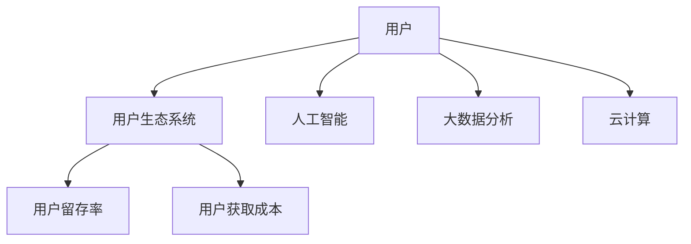

                 

# 自动化创业中的用户生态系统构建

> 关键词：自动化创业,用户生态系统,商业模式,数据驱动,人工智能,数字营销,产品创新

## 1. 背景介绍

### 1.1 问题由来

自动化创业（Automated Ventures）在过去十年中迅速崛起，成为科技创新和商业成功的热门领域。自动化解决方案通过人工智能、大数据分析、云计算等技术，实现了从生产到消费的全流程优化，大大降低了企业成本，提升了运营效率。然而，随着竞争的加剧，如何构建和维护用户生态系统（User Ecosystem），成为了企业面临的新挑战。

### 1.2 问题核心关键点

用户生态系统构建的目的是通过建立用户与企业间的良性互动，形成稳定的用户群体，驱动企业持续发展。核心关键点包括：

- **用户获取**：如何吸引更多高质量用户，提升用户粘性。
- **数据驱动**：如何通过数据洞察用户行为，优化产品和服务。
- **个性化推荐**：如何通过个性化推荐，提升用户体验。
- **商业模式创新**：如何构建新的商业模式，增加用户参与度和价值。

### 1.3 问题研究意义

构建稳定的用户生态系统，对于自动化创业企业至关重要。通过优化用户体验，提升用户满意度，企业能够实现业务增长和长期稳定发展。同时，用户生态系统的建设，也能为企业的数字化转型和智能化升级提供有力支持。

## 2. 核心概念与联系

### 2.1 核心概念概述

为更好地理解自动化创业中的用户生态系统构建，本节将介绍几个密切相关的核心概念：

- **用户生态系统**：指由用户、产品、服务、企业等多方面因素构成的有机系统。用户生态系统的健康发展，能够形成良性循环，持续吸引新用户，留住老用户。
- **人工智能（AI）**：通过机器学习、深度学习等技术，实现对用户行为和需求的自动分析与优化。AI技术在自动化创业中应用广泛，能够显著提升用户体验和运营效率。
- **大数据分析**：通过对海量用户数据进行分析，提取有价值的信息，指导企业决策和产品改进。
- **云计算**：利用云平台提供的计算和存储资源，实现服务的按需扩展和弹性伸缩。
- **用户留存率**：衡量用户在一定时间内继续使用产品或服务的情况，是衡量用户生态系统健康的重要指标。
- **用户获取成本（CAC）**：获取一个新用户的平均成本，是衡量用户获取效率的关键指标。

这些核心概念之间的逻辑关系可以通过以下Mermaid流程图来展示：



这个流程图展示了几大核心概念及其之间的关系：

1. 用户通过使用产品和服务，与企业建立互动。
2. 人工智能和大数据分析技术，从用户行为中提取有用信息，优化产品和服务。
3. 云计算提供强大的计算和存储能力，支持产品的按需扩展。
4. 用户留存率和用户获取成本，分别衡量用户生态系统的稳定性和效率。

## 3. 核心算法原理 & 具体操作步骤
### 3.1 算法原理概述

自动化创业中的用户生态系统构建，主要依赖于以下几个算法原理：

1. **用户行为分析**：通过用户数据挖掘和机器学习算法，分析用户行为和偏好，指导个性化推荐和产品改进。
2. **推荐系统**：基于协同过滤、内容过滤、深度学习等技术，构建推荐引擎，提升用户体验和满意度。
3. **预测模型**：通过时间序列预测、回归分析等方法，预测用户行为，优化运营策略。
4. **混合推荐策略**：结合个性化推荐和协同推荐，提升推荐系统的效果。
5. **自动化客服**：利用自然语言处理（NLP）和机器学习技术，实现自动化的客户服务，提升用户满意度。

### 3.2 算法步骤详解

基于上述算法原理，自动化创业中的用户生态系统构建一般包括以下几个关键步骤：

**Step 1: 数据准备与处理**
- 收集用户行为数据，包括点击、购买、浏览等行为记录。
- 清洗数据，处理缺失值、异常值和噪声，确保数据质量。
- 数据特征工程，提取用户行为特征和兴趣点，为后续算法提供支持。

**Step 2: 用户行为分析**
- 使用聚类算法（如K-means、LDA）对用户进行细分，识别不同用户群体。
- 利用关联规则挖掘算法（如Apriori）发现用户行为模式，如购物车关联、兴趣爱好关联等。
- 应用异常检测算法（如DBSCAN、Isolation Forest）识别用户行为中的异常情况，及时进行处理。

**Step 3: 个性化推荐系统**
- 选择推荐算法（如协同过滤、内容过滤、深度学习）进行模型构建。
- 使用A/B测试等方法评估推荐效果，不断优化模型参数。
- 引入多样化推荐策略，如多臂老虎机、混合推荐等，提升推荐多样性。

**Step 4: 预测模型构建**
- 根据历史数据建立预测模型（如时间序列预测模型、回归模型）。
- 通过交叉验证等方法评估模型性能，优化模型参数。
- 利用预测结果优化运营策略，如库存管理、价格优化等。

**Step 5: 自动化客服系统**
- 收集用户查询和反馈，构建语料库和知识库。
- 应用NLP和机器学习技术，构建自动客服模型。
- 实时监测用户反馈，优化模型和知识库。

### 3.3 算法优缺点

自动化创业中的用户生态系统构建算法具有以下优点：

1. **高效性**：利用机器学习和AI技术，快速分析大量用户数据，提升运营效率。
2. **精准性**：通过个性化推荐和预测模型，精准把握用户需求，提升用户体验。
3. **可扩展性**：利用云计算平台，实现按需扩展和弹性伸缩，降低企业成本。
4. **用户粘性提升**：通过个性化服务和智能客服，提升用户满意度和忠诚度。

同时，该算法也存在一定的局限性：

1. **数据隐私和安全**：用户数据隐私和安全问题，需要严格的数据保护措施和技术支持。
2. **模型复杂性**：复杂的推荐算法和预测模型，需要较强的技术储备和数据质量支持。
3. **成本投入高**：大规模数据处理和模型优化，需要较大的技术投入和计算资源。
4. **模型过拟合**：模型过于复杂，可能出现过拟合现象，降低模型泛化能力。

尽管存在这些局限性，但就目前而言，基于算法驱动的用户生态系统构建，仍然是自动化创业企业实现智能化转型的重要手段。未来相关研究的重点在于如何进一步降低技术成本，提升模型的稳定性和泛化能力，同时兼顾用户隐私保护和数据安全。

### 3.4 算法应用领域

基于自动化创业中用户生态系统构建的算法，已在诸多领域得到了广泛的应用，例如：

- **电子商务**：通过个性化推荐和预测模型，提升用户购买体验和商家销售额。
- **在线教育**：利用用户行为分析，优化课程推荐和学生学习路径，提升教学效果。
- **医疗健康**：通过用户行为分析，优化诊疗建议和服务流程，提升患者体验。
- **金融服务**：利用个性化推荐和预测模型，优化理财建议和风险控制，提升用户满意度。
- **物流运输**：通过实时数据分析和预测模型，优化配送路线和库存管理，提升物流效率。

除了上述这些经典应用外，自动化创业中的用户生态系统构建技术，还在更多场景中得到创新性应用，如智能家居、智能制造、智能农业等，为各行各业带来了新的变革。

## 4. 数学模型和公式 & 详细讲解  
### 4.1 数学模型构建

本节将使用数学语言对自动化创业中用户生态系统构建的算法过程进行更加严格的刻画。

假设用户行为数据为 $D=\{(x_i,y_i)\}_{i=1}^N$，其中 $x_i$ 为行为特征向量，$y_i$ 为行为标签。目标是构建一个推荐模型 $M$，使得用户对推荐结果的满意度最大化。推荐模型可以表示为：

$$
M(x_i) = \max_{y \in \mathcal{Y}} \mathbb{E}_{y_i|x_i} [\pi(y_i|x_i)]
$$

其中，$\mathcal{Y}$ 为用户可能的行为标签集合，$\pi(y_i|x_i)$ 为给定用户行为特征 $x_i$ 下，行为标签 $y_i$ 的条件概率。

### 4.2 公式推导过程

为了构建推荐模型，我们通常采用协同过滤和深度学习等方法。以下以协同过滤为例，推导推荐算法的数学公式：

设用户 $u$ 的行为特征向量为 $x_u$，物品 $i$ 的行为特征向量为 $x_i$。用户和物品之间的相似度矩阵为 $S$，可以通过余弦相似度等方法计算得到：

$$
S(u,i) = \cos \theta(x_u, x_i) = \frac{x_u \cdot x_i}{\|x_u\|\|x_i\|}
$$

推荐模型 $M$ 可以通过矩阵分解技术得到，具体公式如下：

$$
M(x_u) = \arg\max_{i \in \mathcal{X}} S(u,i) \cdot \hat{y}_i
$$

其中，$\hat{y}_i$ 为物品 $i$ 的潜在评分向量，可以通过奇异值分解（SVD）等技术得到：

$$
\hat{y}_i = U \cdot \hat{\Sigma} \cdot V^T
$$

其中 $U$ 和 $V$ 为矩阵 $Y$ 的左、右奇异向量矩阵，$\hat{\Sigma}$ 为矩阵 $Y$ 的奇异值矩阵。

### 4.3 案例分析与讲解

假设某电子商务平台希望通过协同过滤推荐系统提升用户购买体验。首先，平台收集用户行为数据，包括浏览记录、购买记录、评价记录等。然后，对数据进行清洗和特征工程，提取出用户和商品的特征向量。接下来，利用余弦相似度计算用户和商品的相似度矩阵 $S$。最后，通过矩阵分解技术，得到推荐模型 $M$，利用 $M$ 对用户进行个性化推荐，提升购买转化率。

## 5. 项目实践：代码实例和详细解释说明
### 5.1 开发环境搭建

在进行自动化创业中的用户生态系统构建的实践前，我们需要准备好开发环境。以下是使用Python进行TensorFlow开发的环境配置流程：

1. 安装Anaconda：从官网下载并安装Anaconda，用于创建独立的Python环境。

2. 创建并激活虚拟环境：
```bash
conda create -n tf-env python=3.8 
conda activate tf-env
```

3. 安装TensorFlow：根据CUDA版本，从官网获取对应的安装命令。例如：
```bash
conda install tensorflow -c conda-forge
```

4. 安装必要的库：
```bash
pip install numpy pandas scikit-learn scikit-learn-meter matplotlib tqdm jupyter notebook ipython
```

完成上述步骤后，即可在`tf-env`环境中开始实践。

### 5.2 源代码详细实现

这里以协同过滤推荐系统为例，给出使用TensorFlow进行用户生态系统构建的Python代码实现。

首先，定义协同过滤模型的数据处理函数：

```python
import tensorflow as tf
import numpy as np
from sklearn.metrics import mean_absolute_error

# 定义协同过滤模型的输入特征和标签
features = tf.keras.layers.Input(shape=(32,), name='features')
labels = tf.keras.layers.Input(shape=(1,), name='labels')

# 定义模型结构
embedding = tf.keras.layers.Embedding(input_dim=10000, output_dim=32, input_length=32, name='embedding')
user_vec = tf.keras.layers.Lambda(lambda x: tf.nn.embedding_lookup(embedding, features), name='user_vector')
item_vec = tf.keras.layers.Lambda(lambda x: tf.nn.embedding_lookup(embedding, features), name='item_vector')
dot_product = tf.keras.layers.Dot(axes=(1, 1), normalize=True, name='dot_product')
output = tf.keras.layers.Activation('softmax', name='softmax')

# 定义模型
model = tf.keras.Model(inputs=[features, labels], outputs=output)
model.compile(optimizer='adam', loss='categorical_crossentropy', metrics=['accuracy'])
```

然后，定义模型的训练和评估函数：

```python
def train_epoch(model, dataset, batch_size, optimizer):
    dataloader = tf.data.Dataset.from_tensor_slices(dataset)
    dataloader = dataloader.shuffle(1000).batch(batch_size).prefetch(1)
    model.fit(dataloader, epochs=10, validation_steps=100)

def evaluate(model, dataset, batch_size):
    dataloader = tf.data.Dataset.from_tensor_slices(dataset)
    dataloader = dataloader.shuffle(1000).batch(batch_size).prefetch(1)
    model.evaluate(dataloader)
```

最后，启动训练流程并在测试集上评估：

```python
epochs = 10
batch_size = 32

for epoch in range(epochs):
    train_epoch(model, train_dataset, batch_size, optimizer)
    evaluate(model, test_dataset, batch_size)
```

以上就是使用TensorFlow对协同过滤推荐系统进行用户生态系统构建的完整代码实现。可以看到，TensorFlow提供了丰富的深度学习框架和工具支持，使得模型构建和训练变得相对简单高效。

### 5.3 代码解读与分析

让我们再详细解读一下关键代码的实现细节：

**协同过滤模型**：
- 使用TensorFlow的Keras API构建模型，通过Embedding层将特征向量转换为高维向量。
- 利用Dot层计算用户和商品的相似度矩阵，并通过Softmax激活函数得到推荐结果。
- 使用Adam优化器进行模型训练，损失函数为交叉熵损失。

**训练和评估函数**：
- 使用TensorFlow的Dataset API处理数据，支持批量处理和预处理操作。
- 利用Epoch和ValidationSteps参数控制训练和验证的周期。
- 在训练过程中，使用Evaluate函数评估模型性能，输出准确率和损失等指标。

**训练流程**：
- 定义训练轮数和批次大小，开始循环迭代
- 每个epoch内，在训练集上训练，输出损失和准确率
- 在测试集上评估，输出最终测试结果

可以看到，TensorFlow提供了强大的框架和API支持，使得模型构建和训练变得相对简单高效。开发者可以将更多精力放在模型优化和业务逻辑上，而不必过多关注底层的实现细节。

当然，工业级的系统实现还需考虑更多因素，如模型的保存和部署、超参数的自动搜索、更灵活的任务适配层等。但核心的推荐算法基本与此类似。

## 6. 实际应用场景
### 6.1 智能推荐系统

基于协同过滤的推荐系统，已经在电子商务、内容分发、在线教育等多个领域得到广泛应用。传统的推荐系统依赖于用户的历史行为数据进行推荐，难以把握用户潜在的兴趣和需求。而利用协同过滤推荐系统，能够更好地理解用户的行为模式，提升推荐效果。

在技术实现上，可以收集用户行为数据，提取用户和商品的特征向量，构建协同过滤模型。通过模型预测用户对商品的潜在评分，生成推荐列表。在生成推荐列表时，还可以考虑商品的流行度、评分分布等因素，实现更加多样化和精准的推荐。

### 6.2 智能营销系统

在市场营销中，智能推荐系统可以帮助企业精准定位潜在客户，提升广告投放的ROI。通过分析用户行为数据，构建用户画像，识别潜在的高价值客户。利用推荐算法，将这些客户推荐给最合适的广告渠道，提高广告转化率。

在实践中，可以设计多渠道智能推荐系统，包括社交媒体、搜索引擎、电子邮件等。通过对不同渠道的用户行为数据进行分析，构建综合推荐模型，提升整体营销效果。

### 6.3 智能客服系统

智能客服系统能够显著提升客户服务的效率和质量。通过用户行为分析，识别客户咨询的主题和问题，推荐最合适的回答模板。利用自动化的聊天机器人，快速响应客户咨询，提供个性化的解决方案。

在技术实现上，可以构建基于机器学习的智能客服系统，通过自然语言处理技术解析用户输入，生成回答模板。系统通过不断学习和优化，能够逐渐提升回答的准确性和个性化程度，提升客户满意度。

### 6.4 未来应用展望

随着自动化创业和AI技术的不断发展，基于用户生态系统的推荐算法将在更多领域得到应用，为传统行业带来变革性影响。

在智慧农业领域，智能推荐系统可以帮助农民选择最优的种植方案和农资产品，提升农业生产效率和产品质量。在智能家居领域，智能推荐系统可以根据用户的生活习惯和偏好，推荐最合适的家居产品和布置方案，提升用户的生活品质。在智能制造领域，智能推荐系统可以帮助制造商优化生产流程和设备维护，提升生产效率和设备利用率。

此外，在医疗、教育、金融等众多领域，智能推荐系统也将不断涌现，为行业带来新的创新和突破。相信随着算法的不断优化和技术的持续进步，智能推荐系统必将在构建智能化生态系统方面发挥越来越重要的作用。

## 7. 工具和资源推荐
### 7.1 学习资源推荐

为了帮助开发者系统掌握自动化创业中用户生态系统构建的理论基础和实践技巧，这里推荐一些优质的学习资源：

1. TensorFlow官方文档：TensorFlow官方文档，提供了丰富的教程和示例代码，是入门和进阶的重要资源。
2. Keras官方文档：Keras官方文档，提供了简单易用的API支持，适合初学者快速上手。
3. Coursera《Deep Learning Specialization》课程：由Andrew Ng主讲，涵盖了深度学习的基础和应用，包括推荐系统等前沿课题。
4. Udacity《Machine Learning Engineer Nanodegree》课程：系统介绍了机器学习算法的原理和实现，适合深入学习推荐系统等领域。
5. 《推荐系统实战》书籍：推荐系统领域的经典教材，详细介绍了推荐系统的设计、实现和优化。

通过对这些资源的学习实践，相信你一定能够快速掌握自动化创业中用户生态系统构建的精髓，并用于解决实际的推荐问题。

### 7.2 开发工具推荐

高效的开发离不开优秀的工具支持。以下是几款用于用户生态系统构建的常用工具：

1. TensorFlow：由Google主导开发的开源深度学习框架，生产部署方便，适合大规模工程应用。
2. Keras：基于TensorFlow的高级API，提供了简单易用的API支持，适合快速迭代实验。
3. PyTorch：基于Python的开源深度学习框架，灵活高效的计算图，适合快速迭代研究。
4. Weights & Biases：模型训练的实验跟踪工具，可以记录和可视化模型训练过程中的各项指标，方便对比和调优。
5. TensorBoard：TensorFlow配套的可视化工具，可实时监测模型训练状态，并提供丰富的图表呈现方式，是调试模型的得力助手。
6. Apache Spark：分布式计算框架，支持大规模数据处理，适合大数据推荐系统应用。

合理利用这些工具，可以显著提升自动化创业中用户生态系统构建的开发效率，加快创新迭代的步伐。

### 7.3 相关论文推荐

自动化创业中用户生态系统构建的研究涉及多个交叉领域，以下是几篇奠基性的相关论文，推荐阅读：

1. "Collaborative Filtering for Implicit Feedback Datasets"（协同过滤算法）：提出了协同过滤算法的基本思想和实现方法，广泛应用于推荐系统中。
2. "Deep Personalized Ranking with Implicit Feedback"（深度个性化推荐）：利用深度学习技术，提升推荐系统的精度和效果。
3. "Adaptive Recommendation Algorithms"（自适应推荐算法）：介绍了多种推荐算法的改进和优化方法，适用于不同场景的推荐系统。
4. "An Improved Region-based Collaborative Filtering Method"（改进的区域协同过滤方法）：提出了一种基于区域分层的协同过滤方法，提高了推荐系统的多样性和准确性。
5. "A Multi-view Learning Framework for Multi-sphere Collaborative Filtering"（多视图学习框架）：提出了一种多视图协同过滤方法，综合利用不同类型的数据，提升推荐系统的效果。

这些论文代表了大规模推荐系统研究的发展脉络。通过学习这些前沿成果，可以帮助研究者把握学科前进方向，激发更多的创新灵感。

## 8. 总结：未来发展趋势与挑战
### 8.1 总结

本文对自动化创业中用户生态系统构建的方法进行了全面系统的介绍。首先阐述了用户生态系统的构建背景和意义，明确了用户生态系统在自动化创业中的重要地位。其次，从原理到实践，详细讲解了用户行为分析、推荐算法和预测模型的数学模型和实现方法，给出了用户生态系统构建的完整代码实例。同时，本文还广泛探讨了用户生态系统在电子商务、智能营销、智能客服等多个领域的应用前景，展示了用户生态系统构建范式的巨大潜力。此外，本文精选了用户生态系统构建的各类学习资源，力求为读者提供全方位的技术指引。

通过本文的系统梳理，可以看到，用户生态系统构建方法在自动化创业中具有重要的应用价值，能够显著提升用户满意度和企业收益。同时，随着技术的不断发展，用户生态系统的构建也将向着更加智能化、个性化、多样化的方向演进，为自动化创业企业带来更多发展机遇。

### 8.2 未来发展趋势

展望未来，自动化创业中的用户生态系统构建技术将呈现以下几个发展趋势：

1. **多模态协同推荐**：除了文本数据，推荐系统还将更多地融合图像、音频、视频等多模态数据，实现更加全面和多样化的推荐。
2. **实时动态推荐**：通过实时数据分析和预测模型，实现动态推荐，提升推荐的时效性和准确性。
3. **个性化推荐**：利用深度学习等技术，构建更加精准的个性化推荐模型，提升用户体验和满意度。
4. **用户行为预测**：通过机器学习和数据挖掘技术，预测用户未来的行为，优化产品和服务设计。
5. **隐私保护**：在推荐算法中引入隐私保护技术，如差分隐私、联邦学习等，确保用户数据安全。
6. **跨平台推荐**：构建跨平台推荐系统，实现多渠道的协同推荐，提升整体推荐效果。

这些趋势凸显了自动化创业中用户生态系统构建技术的广阔前景。这些方向的探索发展，必将进一步提升推荐系统的性能和应用范围，为自动化创业企业带来更多发展机遇。

### 8.3 面临的挑战

尽管用户生态系统构建技术已经取得了瞩目成就，但在迈向更加智能化、普适化应用的过程中，它仍面临着诸多挑战：

1. **数据隐私和安全**：用户数据隐私和安全问题，需要严格的数据保护措施和技术支持。
2. **算法复杂性**：复杂的推荐算法和预测模型，需要较强的技术储备和数据质量支持。
3. **模型过拟合**：模型过于复杂，可能出现过拟合现象，降低模型泛化能力。
4. **多渠道整合**：不同渠道的用户数据整合和协同推荐，需要统一的数据格式和标准。
5. **用户体验优化**：推荐系统需要平衡推荐效果和用户体验，避免过度推荐。
6. **成本投入高**：大规模数据处理和模型优化，需要较大的技术投入和计算资源。

尽管存在这些挑战，但随着技术的不断进步和应用场景的扩展，用户生态系统构建技术必将在自动化创业中发挥越来越重要的作用。未来相关研究的重点在于如何进一步降低技术成本，提升模型的稳定性和泛化能力，同时兼顾用户隐私保护和数据安全。

### 8.4 研究展望

面对用户生态系统构建面临的种种挑战，未来的研究需要在以下几个方面寻求新的突破：

1. **低成本推荐系统**：开发低成本推荐系统，减少对昂贵计算资源和算法的依赖，实现轻量级推荐。
2. **推荐模型的可解释性**：引入可解释性技术，如因果推断、逻辑规则等，提升推荐系统的透明度和可信度。
3. **跨模态协同推荐**：实现多模态数据的融合和协同推荐，提升推荐系统的多样性和精准度。
4. **实时推荐算法**：引入实时推荐算法，提升推荐系统响应速度和准确性。
5. **隐私保护技术**：引入隐私保护技术，如差分隐私、联邦学习等，确保用户数据安全。
6. **用户行为预测**：利用深度学习等技术，建立更加精准的用户行为预测模型，优化产品和服务设计。

这些研究方向的探索，必将引领自动化创业中用户生态系统构建技术迈向更高的台阶，为自动化创业企业带来更多发展机遇。面向未来，用户生态系统构建技术还需要与其他人工智能技术进行更深入的融合，如知识表示、因果推理、强化学习等，多路径协同发力，共同推动自动化创业的发展。

## 9. 附录：常见问题与解答

**Q1：如何设计用户行为分析算法？**

A: 设计用户行为分析算法，需要考虑以下几个关键步骤：
1. 数据收集：收集用户行为数据，包括点击、购买、浏览等行为记录。
2. 数据清洗：处理缺失值、异常值和噪声，确保数据质量。
3. 数据特征工程：提取用户行为特征和兴趣点，为后续算法提供支持。
4. 聚类分析：利用聚类算法对用户进行细分，识别不同用户群体。
5. 关联规则挖掘：利用关联规则挖掘算法发现用户行为模式。
6. 异常检测：利用异常检测算法识别用户行为中的异常情况。

**Q2：推荐系统如何实现多渠道协同推荐？**

A: 实现多渠道协同推荐，需要以下步骤：
1. 数据整合：将不同渠道的用户数据进行整合，统一数据格式和标准。
2. 协同过滤：利用协同过滤算法，实现不同渠道的协同推荐。
3. 混合推荐：结合个性化推荐和协同推荐，提升推荐系统的效果。
4. 多臂老虎机：引入多臂老虎机算法，优化推荐策略。
5. 模型训练：利用多渠道数据，训练综合推荐模型。

**Q3：智能推荐系统如何提升广告投放效果？**

A: 智能推荐系统可以提升广告投放效果，具体步骤包括：
1. 数据收集：收集用户行为数据，包括浏览、点击、购买等行为记录。
2. 数据分析：利用推荐算法，构建用户画像，识别潜在的高价值客户。
3. 推荐广告：将用户推荐给最合适的广告渠道，提高广告转化率。
4. 实时优化：利用实时数据分析，动态调整广告投放策略。
5. 反馈迭代：通过用户反馈，不断优化广告投放策略，提升效果。

**Q4：智能推荐系统如何实现个性化推荐？**

A: 实现个性化推荐，需要以下步骤：
1. 数据收集：收集用户行为数据，包括浏览、购买、评价等行为记录。
2. 数据清洗：处理缺失值、异常值和噪声，确保数据质量。
3. 数据特征工程：提取用户行为特征和兴趣点，为后续算法提供支持。
4. 推荐算法：利用协同过滤、内容过滤、深度学习等算法，构建推荐引擎。
5. 个性化优化：根据用户历史行为，优化推荐结果，提升用户体验。

**Q5：如何构建智能客服系统？**

A: 构建智能客服系统，需要以下步骤：
1. 数据收集：收集用户查询和反馈，构建语料库和知识库。
2. 自然语言处理：利用自然语言处理技术解析用户输入，生成回答模板。
3. 知识图谱构建：利用知识图谱技术，提升智能客服系统的智能程度。
4. 多轮对话设计：设计多轮对话系统，实现用户和智能客服的交互。
5. 实时优化：利用实时数据分析，优化智能客服系统。

这些回答旨在帮助读者更好地理解自动化创业中的用户生态系统构建，并在实际应用中取得更好的效果。通过不断优化和改进，相信自动化创业中的用户生态系统构建将迎来更多创新和突破。

---

作者：禅与计算机程序设计艺术 / Zen and the Art of Computer Programming

