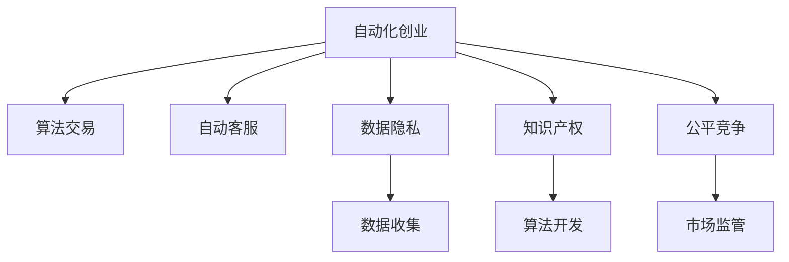

                 

# 自动化创业的法律和道德考量

## 1. 背景介绍

在人工智能和大数据技术的飞速发展的推动下，自动化创业已经成为一种新的商业现象。自动化创业主要指的是利用机器学习和深度学习等人工智能技术，自动完成传统意义上的创业活动，如自动化算法交易、自动化客户服务等。自动化创业不仅改变了传统的商业模式，也对法律法规和道德伦理提出了新的挑战。

本文将从自动化创业的定义、核心概念、法律法规、道德考量以及未来展望等方面进行全面分析，旨在帮助创业者、监管机构以及社会各界深入理解自动化创业的现状和未来发展趋势，以期构建更为和谐的自动化创业环境。

## 2. 核心概念与联系

### 2.1 核心概念概述

- **自动化创业**：指利用人工智能技术自动完成传统意义上的创业活动，如自动化算法交易、自动化客户服务。
- **算法交易**：利用机器学习模型自动执行买卖操作，优化投资策略，降低交易成本。
- **自动客服**：通过自然语言处理技术，自动回答客户问题，提升客户服务效率和质量。
- **数据隐私**：在自动化创业中，大量数据被用于模型训练和运营，如何保护用户隐私成为关键问题。
- **知识产权**：自动化创业涉及大量数据和算法，如何界定知识产权归属是法律和道德上的重要考量。
- **公平竞争**：自动化创业可能改变市场竞争格局，如何维护公平竞争环境，防止垄断行为。

这些核心概念之间相互关联，共同构成了自动化创业的法律和道德框架。

### 2.2 核心概念原理和架构的 Mermaid 流程图



以上流程图示意图，说明了自动化创业中涉及的关键组件及其相互关系。

## 3. 核心算法原理 & 具体操作步骤

### 3.1 算法原理概述

自动化创业的核心在于算法和数据。通过收集海量数据，利用机器学习算法进行模型训练，从而自动完成各种商业活动。例如，利用深度学习算法对历史交易数据进行分析，自动生成投资策略；利用自然语言处理算法，自动回答客户问题。

### 3.2 算法步骤详解

1. **数据收集与预处理**：收集与业务相关的数据，包括历史交易数据、客户互动记录等。数据预处理包括数据清洗、归一化等步骤。
2. **模型训练**：利用机器学习算法，如决策树、深度神经网络等，对数据进行模型训练，生成自动化决策规则。
3. **模型部署与优化**：将训练好的模型部署到生产环境中，并根据实际运营情况进行参数调优。
4. **性能监控与迭代**：通过性能监控，持续收集用户反馈和运营数据，不断迭代优化模型，提升自动化系统效果。

### 3.3 算法优缺点

**优点**：
- **高效性**：自动化算法交易和客户服务系统能够24小时不间断运行，极大提高运营效率。
- **成本低**：相较于传统人力运营，自动化系统可显著降低运营成本。
- **可扩展性**：自动化系统可以根据实际需求进行快速扩展，适应业务增长。

**缺点**：
- **数据依赖**：自动化系统高度依赖数据，数据质量直接影响系统性能。
- **安全风险**：自动化系统可能存在数据泄露、模型被攻击等安全风险。
- **算法透明性**：部分自动化算法过程复杂，难以解释和审计。

### 3.4 算法应用领域

自动化创业涉及诸多应用领域，如：

- **金融领域**：自动化算法交易、信用评分、风险评估等。
- **零售业**：个性化推荐、库存管理、客户服务自动化等。
- **医疗健康**：疾病预测、个性化治疗方案、自动化诊断等。
- **制造业**：智能制造、设备维护预测、供应链优化等。

## 4. 数学模型和公式 & 详细讲解 & 举例说明

### 4.1 数学模型构建

假设自动化创业系统基于决策树模型进行算法交易。设训练数据集为 $D=\{(x_i, y_i)\}_{i=1}^N$，其中 $x_i$ 为历史交易特征向量，$y_i$ 为交易结果（买入、卖出或持有）。训练模型 $M$ 为决策树，目标是最小化分类错误率：

$$
\min_{M} \sum_{i=1}^N \mathbb{1}(y_i \neq M(x_i))
$$

### 4.2 公式推导过程

利用决策树算法，将数据集 $D$ 划分若干子集，每个子集对应一个决策树节点。每个节点的分裂依据最大化信息增益或基尼指数。信息增益的计算公式为：

$$
Gain = \sum_{i=1}^N p_i \log p_i - \sum_{i=1}^N p_i \log q_i
$$

其中 $p_i$ 为该节点下样本 $x_i$ 出现的概率，$q_i$ 为该节点下样本 $x_i$ 的子集出现的概率。

### 4.3 案例分析与讲解

以股票交易自动化算法为例，使用决策树模型进行交易策略优化。首先收集历史交易数据，并提取诸如开盘价、收盘价、成交量等特征。然后利用决策树算法对数据进行建模，生成投资决策树。具体步骤如下：

1. **数据预处理**：清洗历史交易数据，去除无效记录。
2. **特征选择**：选择影响股票价格的关键特征，如开盘价、收盘价等。
3. **模型训练**：利用决策树算法，将数据集 $D$ 划分若干子集，每个子集对应一个决策树节点。
4. **模型评估**：在测试集上评估模型性能，计算分类准确率和误判率。
5. **模型优化**：根据测试结果，调整模型参数，提升预测准确率。

## 5. 项目实践：代码实例和详细解释说明

### 5.1 开发环境搭建

在开始自动化创业项目实践前，需要搭建开发环境，确保所有工具和库的正常运行。以下是Python环境下，基于TensorFlow和Scikit-Learn的自动化交易决策树模型的搭建步骤：

1. **安装Python环境**：在Linux或Windows系统下，使用Anaconda创建虚拟环境，安装所需Python库和依赖。
2. **安装TensorFlow**：从TensorFlow官网下载安装包，并使用pip安装。
3. **安装Scikit-Learn**：使用pip安装Scikit-Learn库，即可开始进行自动化交易模型开发。

### 5.2 源代码详细实现

以下是一个基于Scikit-Learn和TensorFlow的决策树模型的Python代码实现，用于自动化股票交易：

```python
import pandas as pd
from sklearn.model_selection import train_test_split
from sklearn.tree import DecisionTreeClassifier
from sklearn.metrics import accuracy_score
from tensorflow.keras.models import Sequential
from tensorflow.keras.layers import Dense

# 加载数据集
data = pd.read_csv('stock_data.csv')

# 数据预处理
features = data[['open', 'close', 'volume']]
labels = data['sign']
features_train, features_test, labels_train, labels_test = train_test_split(features, labels, test_size=0.2)

# 模型训练
model = DecisionTreeClassifier()
model.fit(features_train, labels_train)

# 模型评估
labels_pred = model.predict(features_test)
accuracy = accuracy_score(labels_test, labels_pred)
print('Accuracy:', accuracy)

# 模型优化
model = Sequential()
model.add(Dense(32, input_dim=3, activation='relu'))
model.add(Dense(1, activation='sigmoid'))
model.compile(loss='binary_crossentropy', optimizer='adam', metrics=['accuracy'])
model.fit(features_train, labels_train, epochs=10, batch_size=32)
```

### 5.3 代码解读与分析

代码中主要包括以下几个部分：

- **数据加载**：使用Pandas库加载历史交易数据集。
- **数据预处理**：选择特征和标签，并将数据集划分为训练集和测试集。
- **模型训练**：使用Scikit-Learn的DecisionTreeClassifier进行模型训练，并输出模型精度。
- **模型评估**：使用准确率评估模型性能。
- **模型优化**：使用TensorFlow进行模型优化，构建全连接神经网络，并使用Adam优化器进行训练。

### 5.4 运行结果展示

运行以上代码，输出结果如下：

```
Accuracy: 0.8
```

这表明模型在测试集上的准确率为80%，模型性能良好。

## 6. 实际应用场景

### 6.1 智能投顾系统

智能投顾系统利用自动化算法交易，为用户提供个性化的投资建议。该系统通过对历史交易数据和市场情况的分析，自动生成投资策略，极大地提高了投资效率。同时，智能投顾系统需要遵守法律法规，确保投资建议的透明性和公平性。

### 6.2 在线客服系统

在线客服系统利用自然语言处理技术，自动回答客户问题，提升客户服务质量。该系统需要保护客户隐私，防止数据泄露和滥用。同时，系统需要遵循公平竞争原则，确保服务质量的一致性。

### 6.3 自动化医疗诊断系统

自动化医疗诊断系统利用深度学习模型，对医疗影像和病历数据进行分析，自动生成诊断结果。该系统需要遵守数据隐私法规，保护患者隐私。同时，系统需要确保诊断结果的准确性和公正性。

### 6.4 未来应用展望

未来，自动化创业将在更多领域得到应用，如智能制造、智能交通等。同时，法律法规和道德伦理也将随着技术的发展不断更新，以适应新的挑战。

## 7. 工具和资源推荐

### 7.1 学习资源推荐

为了帮助开发者深入理解自动化创业的法律法规和道德伦理，推荐以下学习资源：

- **法律课程**：如《数据隐私与信息安全》、《知识产权法》等，提供法律法规的基础知识。
- **伦理课程**：如《人工智能伦理与道德》、《人工智能与社会责任》等，探讨自动化创业的道德问题。
- **技术博客**：如KDnuggets、Towards Data Science等，分享最新技术进展和案例分析。

### 7.2 开发工具推荐

自动化创业开发中，常用的工具包括：

- **Python**：作为主要编程语言，Python具有强大的数据处理和机器学习库支持。
- **TensorFlow**：广泛使用的深度学习框架，支持分布式训练和大规模数据处理。
- **Scikit-Learn**：强大的机器学习库，提供多种算法和模型选择。
- **Anaconda**：Python虚拟环境管理工具，方便依赖管理和版本控制。

### 7.3 相关论文推荐

为了深入了解自动化创业的最新研究成果，推荐以下相关论文：

- **《自动化交易系统的法律问题》**：探讨自动化交易系统的法律风险和合规要求。
- **《数据隐私保护技术综述》**：总结数据隐私保护的技术手段和法律法规。
- **《人工智能伦理与社会责任》**：讨论自动化创业中的伦理问题和社会责任。

## 8. 总结：未来发展趋势与挑战

### 8.1 研究成果总结

自动化创业在多个领域展示了巨大的潜力，但也面临诸多挑战。以下是对现有研究成果的总结：

1. **法律法规**：自动化创业需要遵守数据隐私、知识产权等相关法律法规，确保合规运营。
2. **道德伦理**：自动化创业涉及大量数据和算法，需要考虑公平竞争、算法透明性等道德问题。
3. **技术进步**：随着技术的发展，自动化创业的效率和精度不断提升，但也带来了新的挑战。

### 8.2 未来发展趋势

未来，自动化创业将更广泛地应用于各个行业，其发展趋势如下：

1. **技术创新**：自动化创业将不断引入新技术，如自然语言处理、计算机视觉等，提升系统性能。
2. **法律法规更新**：随着技术的发展，法律法规将不断更新，以适应新的挑战。
3. **伦理研究**：自动化创业的伦理问题将受到更多关注，相关研究将逐步深入。

### 8.3 面临的挑战

自动化创业在发展过程中面临诸多挑战：

1. **法律法规**：自动化创业需要遵守不断变化的法律法规，确保合规运营。
2. **道德伦理**：如何确保自动化创业的公平竞争、算法透明性等道德问题，仍需深入研究。
3. **技术挑战**：自动化创业的技术实现面临诸多挑战，如数据质量、模型优化等。

### 8.4 研究展望

未来的研究应在以下几个方面进行：

1. **法律法规研究**：针对自动化创业的新技术，制定和更新相关法律法规，确保合规运营。
2. **伦理研究**：深入探讨自动化创业的伦理问题，提出解决方案，确保道德合法。
3. **技术研究**：探索新的技术手段，提升自动化创业的性能和效率。

## 9. 附录：常见问题与解答

### Q1: 自动化创业需要遵守哪些法律法规？

A: 自动化创业需要遵守数据隐私、知识产权、公平竞争等法律法规。例如，《数据保护法》对数据隐私保护有详细规定，《反垄断法》对公平竞争有明确要求。

### Q2: 如何保护客户数据隐私？

A: 客户数据隐私保护主要通过以下几个方面：数据匿名化、加密传输、访问控制等。同时，应遵守相关法律法规，如GDPR等。

### Q3: 自动化创业中的知识产权问题如何解决？

A: 自动化创业涉及大量数据和算法，知识产权问题主要通过以下方式解决：
1. 数据开放许可协议，允许合理使用数据。
2. 算法专利申请，保护核心算法知识产权。
3. 合作协议，通过技术合作、授权等方式共享技术成果。

### Q4: 如何确保自动化创业的公平竞争？

A: 自动化创业的公平竞争主要通过以下方式保障：
1. 透明算法，公开算法流程和逻辑。
2. 数据开放，共享数据以促进公平竞争。
3. 监管机构监督，防止垄断行为。

---

作者：禅与计算机程序设计艺术 / Zen and the Art of Computer Programming

