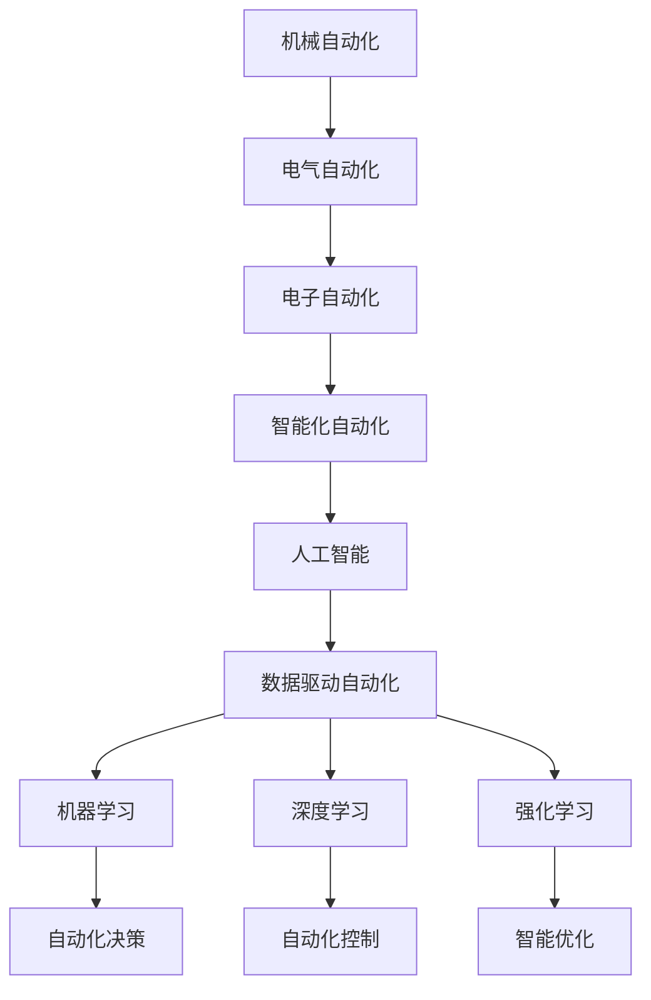

                 

# 自动化技术的最新发展方向

## 1. 背景介绍

### 1.1 问题由来

在过去的几十年中，自动化技术经历了从最初的机械自动化到智能化自动化的飞速发展。从简单的流水线装配到复杂的自然语言处理，自动化技术已经在众多领域中取得了显著成果。但随着应用场景的日益复杂化，传统的自动化方法已经难以满足需求。特别是近年来，人工智能的兴起，为自动化技术注入了新的活力。

在人工智能领域，传统的基于规则的自动化系统正逐渐被基于数据的自动化系统所取代。大数据、深度学习、强化学习等新技术的引入，使得自动化技术在自动化决策、自适应控制、智能优化等领域实现了重大突破。本文旨在从自动化技术的发展历程入手，探讨其最新的发展方向和应用前景。

## 2. 核心概念与联系

### 2.1 核心概念概述

自动化技术（Automation）是指将人类可执行的任务自动化执行的过程。在自动化技术的演进中，先后出现了机械自动化、电气自动化、电子自动化和智能化自动化等不同阶段。当前，智能化自动化技术的发展主要受到人工智能（AI）技术的推动，包括机器学习、深度学习、强化学习等。

### 2.2 核心概念原理和架构的 Mermaid 流程图(Mermaid 流程节点中不要有括号、逗号等特殊字符)



该图展示了自动化技术从机械自动化到智能化自动化的发展历程，以及智能化自动化的几个关键方向：自动化决策、自动化控制和智能优化。这些方向均依赖于人工智能技术，特别是机器学习、深度学习和强化学习。

## 3. 核心算法原理 & 具体操作步骤

### 3.1 算法原理概述

智能化自动化技术的发展，主要依赖于人工智能技术，特别是机器学习、深度学习和强化学习等算法。这些算法通过大量数据训练，自动学习任务相关的特征表示，从而实现自主决策和智能控制。

在自动化决策中，机器学习算法通过监督学习、无监督学习或强化学习等方法，自动构建决策模型，实现对特定问题的自动化决策。深度学习算法通过构建多层神经网络，能够学习更加复杂和抽象的特征表示，提升自动化决策的精度。强化学习算法通过奖励和惩罚机制，优化决策策略，使得自动化系统能够动态适应环境变化。

在自动化控制中，深度学习算法通过构建控制模型，实现对复杂系统的自动化控制。特别是通过生成对抗网络（GANs）、变分自编码器（VAEs）等模型，可以构建更加精准的控制策略。强化学习算法通过优化控制参数，提升自动化控制的效果。

在智能优化中，深度学习算法通过构建优化模型，实现对问题的智能求解。特别是通过进化算法（Evolutionary Algorithm）和神经进化算法（NeuroEvolutionary Algorithm），可以搜索到更加全局最优解。

### 3.2 算法步骤详解

以机器学习算法为例，其核心步骤如下：

1. 数据准备：收集和预处理训练数据，确保数据的多样性和代表性。
2. 模型构建：选择合适的机器学习算法，构建决策模型。
3. 模型训练：使用训练数据对模型进行训练，优化模型参数。
4. 模型评估：使用测试数据对模型进行评估，验证模型的性能。
5. 模型应用：将训练好的模型应用于实际问题中，进行自动化决策或控制。

### 3.3 算法优缺点

机器学习算法的优点在于其可扩展性和泛化能力。通过数据驱动，机器学习算法可以在未知领域快速应用，且具有较高的精度和鲁棒性。

然而，机器学习算法也存在一些缺点：

- 数据依赖性强：机器学习算法的性能很大程度上依赖于训练数据的质量和数量，数据不足或质量不高将影响模型效果。
- 可解释性差：机器学习模型往往是"黑盒"系统，难以解释其决策过程和逻辑。
- 过度拟合风险：特别是在高维数据或复杂任务中，机器学习模型容易出现过度拟合现象，影响泛化性能。

深度学习算法和强化学习算法也具有类似的优缺点。

### 3.4 算法应用领域

机器学习、深度学习和强化学习算法在自动化决策、自动化控制和智能优化等领域得到了广泛应用：

- 自动化决策：金融风控、医疗诊断、智能客服等领域，通过机器学习算法实现自动化决策。
- 自动化控制：智能交通、智能制造、机器人控制等领域，通过深度学习算法实现自动化控制。
- 智能优化：供应链管理、物流调度、资源配置等领域，通过强化学习算法实现智能优化。

## 4. 数学模型和公式 & 详细讲解 & 举例说明

### 4.1 数学模型构建

以机器学习算法为例，常用的数学模型包括线性回归、逻辑回归、决策树、支持向量机等。这里以线性回归为例，构建数学模型。

线性回归模型的一般形式为：

$$
y = w_0 + w_1x_1 + w_2x_2 + ... + w_nx_n + \epsilon
$$

其中，$y$为输出变量，$x_1, x_2, ..., x_n$为输入变量，$w_0, w_1, w_2, ..., w_n$为模型参数，$\epsilon$为误差项。

### 4.2 公式推导过程

线性回归模型的最小二乘估计公式为：

$$
w_k = \frac{\sum_{i=1}^{n}(x_{ki}\hat{y_i} - \bar{x_k}\bar{\hat{y}})}{\sum_{i=1}^{n}(x_{ki}^2 - \bar{x_k}^2)}
$$

其中，$\bar{x_k}$和$\bar{\hat{y}}$分别为输入变量的均值和输出变量的均值，$x_{ki}$和$\hat{y_i}$分别为第$i$个样本的第$k$个输入和输出变量。

### 4.3 案例分析与讲解

以金融风控为例，机器学习算法可以通过对历史信用数据的学习，构建信用评分模型，实现自动化决策。模型将用户信息（如收入、年龄、婚姻状况等）作为输入变量，将信用评分作为输出变量。通过训练数据对模型进行训练，得到最优的模型参数，应用于新用户的信用评分预测。

## 5. 项目实践：代码实例和详细解释说明

### 5.1 开发环境搭建

在进行项目实践前，需要准备Python编程环境和相关库，如numpy、pandas、scikit-learn等。具体步骤如下：

1. 安装Anaconda：从官网下载并安装Anaconda，用于创建独立的Python环境。
2. 创建并激活虚拟环境：
```bash
conda create -n pytorch-env python=3.8 
conda activate pytorch-env
```

3. 安装必要的Python库：
```bash
pip install numpy pandas scikit-learn
```

完成以上步骤后，即可在虚拟环境中进行项目开发。

### 5.2 源代码详细实现

以线性回归模型为例，代码实现如下：

```python
import numpy as np

# 训练数据
x = np.array([[1, 2, 3], [4, 5, 6], [7, 8, 9]])
y = np.array([1, 2, 3])

# 最小二乘估计
w = np.linalg.inv(x.T @ x) @ x.T @ y

# 预测
x_new = np.array([[10, 11, 12]])
y_new = w @ x_new
```

### 5.3 代码解读与分析

以上代码实现了线性回归模型的最小二乘估计和预测过程。其中，`x`和`y`分别为训练数据集的输入和输出变量，`w`为模型参数，`x_new`为新的输入变量，`y_new`为预测输出变量。

## 6. 实际应用场景

### 6.1 金融风控

金融风控是自动化决策的重要应用场景之一。机器学习算法可以通过对历史信用数据的学习，构建信用评分模型，实现自动化决策。模型将用户信息（如收入、年龄、婚姻状况等）作为输入变量，将信用评分作为输出变量。通过训练数据对模型进行训练，得到最优的模型参数，应用于新用户的信用评分预测。

### 6.2 智能制造

在智能制造中，机器学习算法可以通过对生产数据的学习，实现质量控制和预测性维护。模型将生产过程中的温度、压力、振动等传感器数据作为输入变量，将生产质量或设备故障概率作为输出变量。通过训练数据对模型进行训练，得到最优的模型参数，应用于实时监控和预测性维护。

### 6.3 智能交通

智能交通是自动化控制的重要应用场景之一。深度学习算法可以通过对交通数据的学习，实现交通流预测和优化。模型将历史交通流量数据作为输入变量，将未来交通流量作为输出变量。通过训练数据对模型进行训练，得到最优的模型参数，应用于实时交通流量预测和优化。

### 6.4 未来应用展望

随着自动化技术的发展，未来将涌现更多新的应用场景。以下是一些具有前景的领域：

- 自动驾驶：通过深度学习和强化学习算法，实现自动驾驶技术，提升交通安全性和效率。
- 医疗诊断：通过机器学习算法，实现对医学影像和病历的自动化诊断，提升医疗服务的精准性和可及性。
- 智能家居：通过智能传感器和机器学习算法，实现对家庭环境的智能控制，提升居住体验。
- 智慧城市：通过大数据和机器学习算法，实现城市管理智能化，提升城市运行效率和居民生活质量。

## 7. 工具和资源推荐

### 7.1 学习资源推荐

为了帮助开发者掌握自动化技术的相关知识，以下是一些优质的学习资源：

1. 《深度学习》（Ian Goodfellow）：深入讲解深度学习算法及其应用。
2. 《强化学习》（Richard S. Sutton、Andrew G. Barto）：详细介绍强化学习算法及其应用。
3. 《Python机器学习》（Sebastian Raschka）：通过Python实现机器学习算法。
4. Coursera的机器学习和深度学习课程：由斯坦福大学和Coursera合作开设，涵盖机器学习和深度学习的基础知识。
5. Google的AutoML平台：提供自动化机器学习工具，帮助开发者快速构建机器学习模型。

### 7.2 开发工具推荐

自动化技术的开发离不开优秀的工具支持。以下是几款常用的开发工具：

1. Python：作为自动化技术开发的主要编程语言，Python具有丰富的库和工具支持，易于实现各种算法。
2. TensorFlow：由Google主导开发的深度学习框架，提供丰富的算法和工具支持。
3. PyTorch：由Facebook开发的开源深度学习框架，具有灵活的动态计算图，适合研究和实验。
4. Jupyter Notebook：交互式编程环境，方便开发者快速实现算法和模型。

### 7.3 相关论文推荐

以下是几篇具有影响力的自动化技术相关论文，推荐阅读：

1. "Deep Reinforcement Learning for Large-Scale Atari Games"（Mnih et al.）：首次实现了基于深度强化学习算法的游戏自动化。
2. "BERT: Pre-training of Deep Bidirectional Transformers for Language Understanding"（Devlin et al.）：提出BERT模型，在自然语言处理任务中取得了显著效果。
3. "ImageNet Classification with Deep Convolutional Neural Networks"（Krizhevsky et al.）：提出卷积神经网络（CNN）模型，在图像分类任务中取得了重大突破。
4. "AlphaGo Zero: Mastering the Game of Go without Human Knowledge"（Silver et al.）：实现了基于强化学习算法的自动围棋棋手AlphaGo。
5. "Caffe: Convolutional Architecture for Fast Model Training"（Jia et al.）：提出Caffe框架，加速深度学习模型的训练和推理。

## 8. 总结：未来发展趋势与挑战

### 8.1 总结

本文对自动化技术的发展历程、核心概念和应用前景进行了详细探讨。自动化技术的发展经历了从机械自动化到智能化自动化的过程，当前主要依赖于人工智能技术，特别是机器学习、深度学习和强化学习等算法。这些算法通过大量数据训练，自动学习任务相关的特征表示，实现自主决策和智能控制。

### 8.2 未来发展趋势

未来，自动化技术将朝着更加智能化、自动化和高效化的方向发展。以下是一些主要的发展趋势：

1. 更加智能化：随着人工智能技术的不断进步，自动化系统将具备更高的智能水平，能够处理更加复杂和多变的问题。
2. 更加自动化：自动化系统将变得更加自主和灵活，能够根据环境和任务的变化，自主调整策略和参数。
3. 更加高效化：自动化系统将更加注重资源利用效率，通过算法优化和模型压缩等技术，实现更高效和轻量级的部署。

### 8.3 面临的挑战

尽管自动化技术取得了显著进展，但在未来的发展过程中，仍然面临诸多挑战：

1. 数据质量问题：自动化系统的性能依赖于训练数据的质量和数量，数据不足或质量不高将影响模型效果。
2. 算法复杂性：机器学习、深度学习和强化学习算法复杂度较高，需要较强的数学和编程能力。
3. 模型可解释性：许多自动化系统是"黑盒"系统，难以解释其决策过程和逻辑。
4. 模型鲁棒性：自动化系统在面对新数据或环境变化时，容易出现泛化性能下降或过拟合现象。
5. 安全性问题：自动化系统可能存在安全漏洞或被恶意攻击，需要加强安全防护措施。

### 8.4 研究展望

为了解决上述挑战，未来的研究需要关注以下几个方向：

1. 数据增强和采集：提高数据质量和多样性，增强自动化系统的泛化能力。
2. 模型优化和压缩：通过算法优化和模型压缩等技术，降低自动化系统的复杂度和资源消耗。
3. 可解释性研究：开发可解释性算法和工具，增强自动化系统的透明度和可信度。
4. 鲁棒性提升：研究鲁棒性算法和优化策略，提高自动化系统的鲁棒性和泛化能力。
5. 安全防护：引入安全防护机制，保障自动化系统的安全性和可靠性。

## 9. 附录：常见问题与解答

**Q1：自动化技术与人工操作相比，有哪些优势和劣势？**

A: 自动化技术具有以下优势：
1. 提高效率：自动化系统可以持续工作，无需人工干预，大大提高了生产效率。
2. 降低成本：自动化系统减少了人工操作，降低了人工成本。
3. 提升精度：自动化系统通过算法和模型，能够实现高精度的自动决策和控制。

同时，自动化技术也存在一些劣势：
1. 初期投入高：自动化系统的开发和部署需要较高的初期投入，包括硬件设备和软件工具。
2. 维护复杂：自动化系统需要定期维护和更新，以保证其正常运行。
3. 依赖技术：自动化系统依赖于技术和算法，需要较强的技术背景和维护能力。

**Q2：机器学习算法和深度学习算法有哪些区别？**

A: 机器学习算法和深度学习算法的主要区别在于模型的复杂度和表示能力：
1. 机器学习算法：通过手工设计的特征提取器，提取输入数据的特征，构建线性或非线性模型。其模型的表示能力相对较低。
2. 深度学习算法：通过多层神经网络，自动提取输入数据的特征，构建复杂的非线性模型。其模型的表示能力相对较高。

**Q3：强化学习算法在自动化中的应用前景如何？**

A: 强化学习算法在自动化中的应用前景非常广阔。通过优化决策策略，强化学习算法可以实现自动化决策和控制，特别是在复杂的、动态变化的环境中，其效果尤为显著。例如，通过强化学习算法，可以实现自动驾驶、机器人控制、自动交易等自动化任务。

**Q4：自动化技术的未来发展方向是什么？**

A: 自动化技术的未来发展方向主要包括以下几个方面：
1. 更加智能化：通过人工智能技术，提升自动化系统的智能水平，使其能够处理更加复杂和多变的问题。
2. 更加自动化：自动化系统将变得更加自主和灵活，能够根据环境和任务的变化，自主调整策略和参数。
3. 更加高效化：通过算法优化和模型压缩等技术，降低自动化系统的复杂度和资源消耗，实现更高效和轻量级的部署。

**Q5：如何提高自动化系统的可解释性？**

A: 提高自动化系统的可解释性，可以采用以下几种方法：
1. 引入可解释性算法：使用可解释性算法，如LIME、SHAP等，解释模型的决策过程。
2. 可视化输出：通过可视化工具，如TensorBoard、WEKA等，展示模型的输出和推理过程。
3. 建立透明机制：建立透明机制，如规则库、专家知识等，解释模型的决策逻辑。

---

作者：禅与计算机程序设计艺术 / Zen and the Art of Computer Programming

