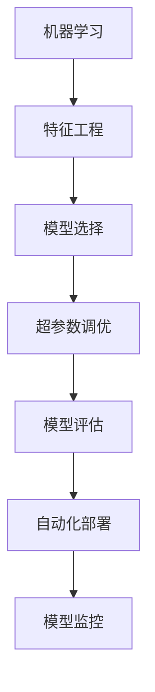

                 

# 自动机器学习AutoML原理与代码实战案例讲解

> 关键词：自动机器学习,AutoML,机器学习自动化,模型选择,超参数调优,模型评估,模型部署

## 1. 背景介绍

### 1.1 问题由来

在当今数据驱动的科技时代，机器学习已成为各行各业解决问题的关键技术之一。然而，机器学习的门槛较高，需要深厚的数学基础、编程能力和领域知识。同时，面对海量数据和多样化任务，选择合适的模型和超参数配置，往往需要大量的时间和精力，成为制约机器学习应用的重要瓶颈。

因此，自动机器学习(AutoML)应运而生，成为解决这一问题的重要手段。AutoML 通过自动化模型选择、超参数调优、模型评估与部署等环节，显著降低了机器学习应用的门槛，使更多非专业人士也能快速上手机器学习，提高模型构建和应用效率。

### 1.2 问题核心关键点

AutoML 的核心思想是通过自动化和自动化调优，使得机器学习模型的构建过程更高效、更可靠、更可解释。其核心包括：

- **模型选择与评估**：基于任务类型和数据特征，自动选择合适的模型架构和候选算法。
- **超参数调优**：通过高效搜索或优化算法，自动调整模型超参数，找到最优的参数组合。
- **自动化部署与监控**：自动部署优化后的模型到生产环境，同时监控模型性能，持续优化。

AutoML 技术已经成为机器学习领域的重要趋势，被广泛应用于工业界和学术界。本节将系统介绍 AutoML 的原理、流程和应用，为读者深入了解该领域提供全面的视角。

## 2. 核心概念与联系

### 2.1 核心概念概述

为更好地理解 AutoML 的实现原理和架构，本节将介绍几个密切相关的核心概念：

- **机器学习(ML)**：通过算法和模型，自动从数据中提取规律和模式，从而实现预测或决策的过程。
- **特征工程(Feature Engineering)**：通过数据处理和特征提取，提升模型对数据特征的利用效率，提高模型性能。
- **模型选择(Model Selection)**：根据任务类型和数据特征，自动选择合适的模型架构和候选算法。
- **超参数调优(Hyperparameter Tuning)**：通过搜索或优化算法，自动调整模型超参数，找到最优的参数组合。
- **模型评估(Model Evaluation)**：通过评估指标和交叉验证等方法，评估模型的性能和泛化能力。
- **自动化部署(Auto Deployment)**：自动将优化后的模型部署到生产环境，并提供监控和优化支持。

这些核心概念之间的逻辑关系可以通过以下 Mermaid 流程图来展示：



这个流程图展示了机器学习模型的构建过程：

1. 通过特征工程对原始数据进行处理，提升数据质量。
2. 基于数据特征和任务需求，选择和构建候选模型。
3. 调整模型超参数，通过搜索或优化算法找到最优配置。
4. 评估模型性能，确保模型泛化能力。
5. 自动化部署模型到生产环境，并持续监控性能，不断优化。

## 3. 核心算法原理 & 具体操作步骤

### 3.1 算法原理概述

AutoML 的核心在于自动化地完成机器学习模型的构建过程，其基本思想是通过自动化和自动化调优，使得模型构建更高效、更可靠、更可解释。具体来说，AutoML 包含以下几个关键步骤：

1. **数据预处理**：通过特征选择、数据清洗、标准化等方法，提升数据质量。
2. **模型选择**：根据任务类型和数据特征，自动选择适合该任务的模型架构和候选算法。
3. **超参数调优**：通过高效搜索或优化算法，自动调整模型超参数，找到最优的参数组合。
4. **模型评估**：通过评估指标和交叉验证等方法，评估模型的性能和泛化能力。
5. **自动化部署**：自动将优化后的模型部署到生产环境，并提供监控和优化支持。

### 3.2 算法步骤详解

以下是 AutoML 的主要操作步骤及其具体实现：

**Step 1: 数据预处理**
- **数据清洗**：去除缺失值、异常值等无用数据，确保数据的一致性和完整性。
- **特征选择**：通过统计特征重要性、相关性分析等方法，选择最具有预测能力的特征。
- **数据标准化**：将特征进行标准化处理，确保不同特征在同一个尺度上进行比较。

**Step 2: 模型选择**
- **候选模型集合**：根据任务类型和数据特征，构建候选模型集合，包括回归、分类、聚类等不同类型的模型。
- **模型评估指标**：根据任务需求，选择合适的评估指标，如准确率、召回率、F1 值、RMSE 等。
- **自动选择**：通过评估指标对候选模型进行评分，自动选择最优模型。

**Step 3: 超参数调优**
- **超参数空间**：定义超参数搜索空间，包括学习率、正则化系数、隐藏层大小等。
- **调优算法**：使用网格搜索、随机搜索、贝叶斯优化等算法，自动搜索超参数空间。
- **调优结果**：根据调优算法的结果，自动调整模型超参数，优化模型性能。

**Step 4: 模型评估**
- **交叉验证**：将数据集划分为训练集和验证集，通过交叉验证评估模型性能。
- **异常检测**：检测验证集上的异常样本，确保模型泛化能力。
- **性能优化**：根据评估结果，调整模型结构和超参数，进一步提升模型性能。

**Step 5: 自动化部署**
- **模型导出**：将优化后的模型保存为可部署的格式，如 PMML、ONNX 等。
- **部署平台**：选择合适的部署平台，如 TensorFlow Serving、Amazon SageMaker 等。
- **持续监控**：通过监控指标和日志，实时跟踪模型性能，确保模型稳定运行。

### 3.3 算法优缺点

AutoML 作为一种自动化机器学习技术，具有以下优点：

1. **高效性**：自动化流程可以大幅减少人工干预，加速模型构建和优化过程。
2. **可解释性**：自动化的调优过程可以提供详细的调优日志和分析报告，有助于理解模型的构建和优化过程。
3. **可靠性**：自动化的模型选择和超参数调优，可以减少人为错误，提高模型的稳定性和泛化能力。

然而，AutoML 也存在一些局限性：

1. **复杂性**：AutoML 的自动化流程可能相对复杂，需要一定的技术背景和实践经验。
2. **资源消耗**：自动化流程可能消耗较多计算资源，特别是在超参数调优环节。
3. **可解释性**：部分自动调优算法可能缺乏可解释性，难以理解和调试。
4. **适用范围**：AutoML 并非适用于所有任务，对于一些特定领域的任务，可能需要进行人工干预。

尽管存在这些局限性，但 AutoML 已经成为机器学习领域的重要趋势，在工业界和学术界得到了广泛应用。

### 3.4 算法应用领域

AutoML 技术在多个领域得到了广泛应用，以下是几个典型的应用场景：

1. **金融风险管理**：通过自动化的模型选择和超参数调优，自动构建信用评分模型、风险预测模型等，提高金融决策的效率和准确性。
2. **医疗诊断**：自动化的模型选择和特征工程，帮助医疗机构构建诊断模型，提高疾病诊断的精度和效率。
3. **电子商务推荐**：通过自动化的模型选择和超参数调优，构建个性化推荐模型，提升用户体验和业务转化率。
4. **智能客服**：自动化的模型选择和自动化部署，构建智能客服系统，提高客户服务效率和满意度。
5. **智能制造**：自动化的模型选择和特征工程，优化生产流程，提高生产效率和产品质量。

除了上述这些应用场景，AutoML 还被广泛应用于智能交通、智慧城市、智能农业等众多领域，为各行各业带来智能化升级。

## 4. 数学模型和公式 & 详细讲解  
### 4.1 数学模型构建

本节将使用数学语言对 AutoML 的构建过程进行更加严格的刻画。

记数据集为 $D=\{(x_i, y_i)\}_{i=1}^N$，其中 $x_i$ 为输入特征，$y_i$ 为输出标签。假设选择了一个基模型 $f(x; \theta)$，其中 $\theta$ 为模型参数。

定义基模型的损失函数为 $\ell(f(x; \theta), y_i)$，则在数据集 $D$ 上的经验风险为：

$$
\mathcal{L}(\theta) = \frac{1}{N} \sum_{i=1}^N \ell(f(x_i; \theta), y_i)
$$

在AutoML中，我们的目标是通过自动选择和调整模型参数 $\theta$，最小化经验风险 $\mathcal{L}(\theta)$。

### 4.2 公式推导过程

以下我们以线性回归为例，推导超参数调优的数学公式。

假设选择的基模型为线性回归模型 $f(x; \theta) = \theta^T x + b$，其中 $\theta$ 为权重向量，$b$ 为偏置项。定义损失函数为均方误差损失：

$$
\ell(f(x; \theta), y_i) = \frac{1}{2}(y_i - f(x_i; \theta))^2
$$

则经验风险为：

$$
\mathcal{L}(\theta) = \frac{1}{N} \sum_{i=1}^N \frac{1}{2}(y_i - f(x_i; \theta))^2
$$

定义超参数空间为 $\mathcal{H}$，假设通过贝叶斯优化算法自动搜索超参数，其数学模型为：

$$
\hat{\theta} = \mathop{\arg\min}_{\theta \in \mathcal{H}} \mathcal{L}(\theta)
$$

其中 $\hat{\theta}$ 为优化后的超参数。贝叶斯优化的公式推导过程如下：

1. **先验分布**：定义超参数 $\theta$ 的先验分布 $p(\theta)$。
2. **后验分布**：根据数据集 $D$ 和先验分布 $p(\theta)$，计算后验分布 $p(\theta|D)$。
3. **选择超参数**：根据后验分布 $p(\theta|D)$，选择最优超参数 $\hat{\theta}$。

具体地，假设先验分布为高斯分布 $p(\theta) = \mathcal{N}(\theta_0, \sigma_0^2)$，后验分布为：

$$
p(\theta|D) \propto \exp(-\frac{\mathcal{L}(\theta)}{2\sigma_0^2}) \mathcal{N}(\theta|\theta_0, \sigma_0^2)
$$

则超参数 $\hat{\theta}$ 为：

$$
\hat{\theta} = \mathop{\arg\min}_{\theta \in \mathcal{H}} \frac{\mathcal{L}(\theta)}{2\sigma_0^2} + \frac{1}{2} \|\theta - \theta_0\|^2_{\sigma_0^{-2}}
$$

该公式展示了基于贝叶斯优化的超参数调优过程，通过先验分布和后验分布的联合计算，自动选择最优超参数 $\hat{\theta}$。

## 5. 项目实践：代码实例和详细解释说明
### 5.1 开发环境搭建

在进行 AutoML 实践前，我们需要准备好开发环境。以下是使用 Python 进行 Scikit-Learn 开发的环境配置流程：

1. 安装 Anaconda：从官网下载并安装 Anaconda，用于创建独立的 Python 环境。

2. 创建并激活虚拟环境：
```bash
conda create -n sklearn-env python=3.8 
conda activate sklearn-env
```

3. 安装 Scikit-Learn：
```bash
conda install scikit-learn
```

4. 安装其他必要工具包：
```bash
pip install numpy pandas matplotlib seaborn
```

完成上述步骤后，即可在 `sklearn-env` 环境中开始 AutoML 实践。

### 5.2 源代码详细实现

下面我们以线性回归为例，给出使用 Scikit-Learn 进行超参数调优的 Python 代码实现。

首先，定义线性回归模型和数据集：

```python
from sklearn.linear_model import LinearRegression
from sklearn.model_selection import train_test_split
import pandas as pd
import numpy as np

# 加载数据集
data = pd.read_csv('data.csv')

# 划分数据集
X = data.drop('y', axis=1)
y = data['y']

# 划分训练集和测试集
X_train, X_test, y_train, y_test = train_test_split(X, y, test_size=0.2, random_state=42)
```

然后，定义超参数搜索空间和调优算法：

```python
from sklearn.model_selection import RandomizedSearchCV

# 定义超参数搜索空间
param_grid = {
    'fit_intercept': [True, False],
    'normalize': [True, False],
    'copy_X': [True, False],
    'n_jobs': [-1, 2, 4]
}

# 定义调优算法
search = RandomizedSearchCV(LinearRegression(), param_grid, cv=5, n_iter=10, random_state=42)
```

接着，执行超参数调优：

```python
# 执行超参数调优
search.fit(X_train, y_train)

# 输出调优结果
print(search.best_params_)
print(search.best_score_)
```

最后，评估调优后的模型性能：

```python
# 评估模型性能
print('R2 score: %.2f' % search.score(X_test, y_test))
```

以上就是使用 Scikit-Learn 进行线性回归超参数调优的完整代码实现。可以看到，Scikit-Learn 提供了丰富的机器学习算法和模型评估工具，使得超参数调优变得简单高效。

### 5.3 代码解读与分析

让我们再详细解读一下关键代码的实现细节：

**数据预处理**：
- 使用 pandas 加载数据集，并划分训练集和测试集。

**超参数搜索空间**：
- 定义了模型的四个超参数：`fit_intercept`、`normalize`、`copy_X`、`n_jobs`。
- `fit_intercept` 表示是否拟合截距，`normalize` 表示是否对特征进行归一化，`copy_X` 表示是否复制特征矩阵，`n_jobs` 表示并行执行的线程数。

**调优算法**：
- 使用 Scikit-Learn 提供的 `RandomizedSearchCV` 算法，自动搜索超参数空间。
- `cv=5` 表示使用五折交叉验证，`n_iter=10` 表示随机搜索的次数。

**模型评估**：
- 使用 `score` 方法评估调优后模型的性能，输出 R2 分数。

可以看到，Scikit-Learn 提供的超参数调优功能使得模型构建和优化过程变得更加简洁和高效。在实际应用中，还可以通过网格搜索、贝叶斯优化等算法，进一步提升超参数调优的效果。

## 6. 实际应用场景
### 6.1 智能推荐系统

智能推荐系统是 AutoML 的重要应用场景之一。通过自动化的模型选择和超参数调优，推荐系统能够高效构建个性化推荐模型，提升用户体验和业务转化率。

在实践中，可以自动化的进行特征工程，选择和构建候选推荐模型，并自动调整模型超参数，得到最优的推荐策略。同时，通过对用户行为数据的实时监控和预测，不断优化推荐模型，实现智能推荐。

### 6.2 金融风险管理

金融风险管理是 AutoML 的另一重要应用场景。通过自动化的模型选择和超参数调优，金融风控系统能够高效构建信用评分模型、风险预测模型等，提高金融决策的效率和准确性。

在实践中，可以自动化的进行特征选择和模型构建，自动调整模型超参数，得到最优的信用评分模型和风险预测模型。同时，通过对模型的持续监控和优化，确保模型的稳定性和准确性。

### 6.3 医疗诊断

在医疗领域，AutoML 可以自动化的构建诊断模型，提高疾病诊断的精度和效率。

在实践中，可以自动化的进行特征选择和模型构建，自动调整模型超参数，得到最优的诊断模型。同时，通过对模型的持续监控和优化，确保模型的稳定性和准确性。

### 6.4 未来应用展望

随着 AutoML 技术的发展，其在更多领域的应用前景将会更加广阔。未来，AutoML 可能会在以下几个方向得到更广泛的应用：

1. **自动化特征工程**：通过自动化的特征选择和特征生成，提升数据质量，提高模型的泛化能力。
2. **自动化模型集成**：通过自动化的模型选择和集成，构建更加稳定、鲁棒的综合模型。
3. **自动化模型解释**：通过自动化的模型解释和可解释性分析，提升模型的可解释性和可理解性。
4. **自动化元学习**：通过自动化的元学习算法，提升模型的自适应能力和迁移学习能力。

## 7. 工具和资源推荐
### 7.1 学习资源推荐

为了帮助开发者系统掌握 AutoML 的理论基础和实践技巧，这里推荐一些优质的学习资源：

1. **《机器学习实战》**：机器学习领域经典书籍，详细介绍了机器学习的理论基础和实践技巧，适合初学者和进阶者。
2. **《Python机器学习》**：由著名机器学习专家 Sebastian Raschka 撰写，详细介绍了 Python 和机器学习的结合，适合对 Python 有一定基础的读者。
3. **Kaggle 竞赛平台**：Kaggle 提供了丰富的机器学习和数据科学竞赛，是学习和实践 AutoML 技术的绝佳平台。
4. **Coursera 机器学习课程**：由斯坦福大学提供的经典课程，系统介绍了机器学习的理论基础和实践技巧，适合入门和进阶读者。
5. **HuggingFace 官方文档**：提供了丰富的预训练模型和 AutoML 工具，适合深度学习和自然语言处理领域的开发者。

通过对这些资源的学习实践，相信你一定能够快速掌握 AutoML 的精髓，并用于解决实际的机器学习问题。

### 7.2 开发工具推荐

高效的开发离不开优秀的工具支持。以下是几款用于 AutoML 开发的常用工具：

1. **Jupyter Notebook**：免费的交互式编程环境，支持 Python 和 R 等多种编程语言，适合快速迭代开发。
2. **Keras**：由 Google 开发的高级神经网络 API，支持多种深度学习框架的切换，适合快速构建和调试深度学习模型。
3. **TensorFlow**：由 Google 开发的开源深度学习框架，生产部署方便，适合大规模工程应用。
4. **Scikit-Learn**：由 Scikit-Learn 开发的核心机器学习库，提供了丰富的算法和模型评估工具，适合快速构建和调试机器学习模型。
5. **Hyperopt**：由 Julia 开发的超参数调优工具，支持多种优化算法，适合高效的超参数调优。

合理利用这些工具，可以显著提升 AutoML 任务的开发效率，加快创新迭代的步伐。

### 7.3 相关论文推荐

AutoML 技术的发展源于学界的持续研究。以下是几篇奠基性的相关论文，推荐阅读：

1. **《Hyperopt: A Python Library for Distributed Asynchronous Hyperparameter Optimization》**：介绍了 Hyperopt 超参数调优工具的设计和实现。
2. **《AutoML: Automated Machine Learning》**：介绍了 AutoML 技术的理论基础和实践技巧，是 AutoML 领域的经典论文。
3. **《AutoML: Design, Feature Engineering and Interpretability》**：介绍了 AutoML 技术的理论基础和实践技巧，探讨了特征工程和模型解释的重要性。
4. **《AutoML: An Overview》**：介绍了 AutoML 技术的理论基础和实践技巧，适合对 AutoML 感兴趣的读者。
5. **《Model-based AutoML》**：探讨了基于模型的 AutoML 方法，适合对 AutoML 理论基础感兴趣的读者。

这些论文代表了大规模机器学习中的自动机器学习技术的最新进展。通过学习这些前沿成果，可以帮助研究者把握学科前进方向，激发更多的创新灵感。

## 8. 总结：未来发展趋势与挑战

### 8.1 总结

本文对自动机器学习(AutoML)的原理和实践进行了全面系统的介绍。首先阐述了 AutoML 的技术背景和应用意义，明确了 AutoML 在模型选择、超参数调优、模型评估等方面的重要价值。其次，从原理到实践，详细讲解了 AutoML 的数学模型和关键步骤，给出了超参数调优任务开发的完整代码实例。同时，本文还广泛探讨了 AutoML 技术在智能推荐、金融风险管理、医疗诊断等多个领域的应用前景，展示了 AutoML 技术的广阔前景。

通过本文的系统梳理，可以看到，AutoML 技术已经成为机器学习领域的重要趋势，极大地降低了机器学习应用的门槛，提升了模型构建和优化效率。未来，伴随 AutoML 技术的持续演进，机器学习模型的构建过程将更加高效、可靠、可解释，为各行各业带来智能化升级。

### 8.2 未来发展趋势

展望未来，AutoML 技术将呈现以下几个发展趋势：

1. **自动化特征工程**：通过自动化的特征选择和特征生成，提升数据质量，提高模型的泛化能力。
2. **自动化模型集成**：通过自动化的模型选择和集成，构建更加稳定、鲁棒的综合模型。
3. **自动化模型解释**：通过自动化的模型解释和可解释性分析，提升模型的可解释性和可理解性。
4. **自动化元学习**：通过自动化的元学习算法，提升模型的自适应能力和迁移学习能力。
5. **多模态融合**：将符号化的先验知识，如知识图谱、逻辑规则等，与神经网络模型进行巧妙融合，引导 AutoML 过程学习更准确、合理的语言模型。

以上趋势凸显了 AutoML 技术的广阔前景。这些方向的探索发展，必将进一步提升 AutoML 系统的性能和应用范围，为人工智能技术的发展带来新的动力。

### 8.3 面临的挑战

尽管 AutoML 技术已经取得了瞩目成就，但在迈向更加智能化、普适化应用的过程中，它仍面临着诸多挑战：

1. **模型复杂性**：大规模模型的构建和优化过程相对复杂，需要一定的技术背景和实践经验。
2. **资源消耗**：自动化流程可能消耗较多计算资源，特别是在超参数调优环节。
3. **可解释性**：部分自动调优算法可能缺乏可解释性，难以理解和调试。
4. **适用范围**：AutoML 并非适用于所有任务，对于一些特定领域的任务，可能需要进行人工干预。

尽管存在这些局限性，但 AutoML 已经成为机器学习领域的重要趋势，在工业界和学术界得到了广泛应用。

### 8.4 研究展望

面对 AutoML 面临的种种挑战，未来的研究需要在以下几个方面寻求新的突破：

1. **优化超参数搜索算法**：开发更加高效的超参数搜索算法，如贝叶斯优化、进化算法等，减少超参数搜索的时间。
2. **提高模型可解释性**：通过可解释性分析方法，提升模型的可解释性和可理解性，增强模型的可信度。
3. **结合知识图谱**：将符号化的先验知识，如知识图谱、逻辑规则等，与神经网络模型进行巧妙融合，提升模型的准确性和泛化能力。
4. **融合多模态数据**：将视觉、语音、文本等多模态数据进行协同建模，提升模型的综合表现能力。
5. **集成元学习算法**：通过元学习算法，提升模型的自适应能力和迁移学习能力，增强模型的鲁棒性。

这些研究方向的探索，必将引领 AutoML 技术迈向更高的台阶，为构建安全、可靠、可解释、可控的智能系统铺平道路。面向未来，AutoML 技术还需要与其他人工智能技术进行更深入的融合，如知识表示、因果推理、强化学习等，多路径协同发力，共同推动人工智能技术的发展。只有勇于创新、敢于突破，才能不断拓展机器学习模型的边界，让智能技术更好地造福人类社会。

## 9. 附录：常见问题与解答

**Q1：AutoML 是否适用于所有机器学习任务？**

A: AutoML 并非适用于所有机器学习任务，对于一些特定领域的任务，可能需要进行人工干预。例如，对于复杂的自然语言处理任务，可能需要结合领域知识进行特征工程和模型选择。

**Q2：如何选择合适的超参数搜索算法？**

A: 选择合适的超参数搜索算法需要根据具体的任务需求和数据特征进行评估。常见的超参数搜索算法包括网格搜索、随机搜索、贝叶斯优化等。建议先尝试随机搜索，如果效果不理想，再逐步优化超参数搜索算法。

**Q3：AutoML 过程中需要注意哪些问题？**

A: AutoML 过程中需要注意以下几个问题：
1. 数据预处理：确保数据质量，提升模型性能。
2. 模型选择：根据任务类型和数据特征，选择适合的模型架构和候选算法。
3. 超参数调优：选择合适的超参数搜索算法，自动搜索超参数空间。
4. 模型评估：选择合适的评估指标，评估模型性能。
5. 自动化部署：选择合适的部署平台，自动将模型部署到生产环境。

**Q4：AutoML 模型在实际应用中需要注意哪些问题？**

A: AutoML 模型在实际应用中需要注意以下几个问题：
1. 数据分布变化：定期重新训练模型，适应数据分布的变化。
2. 模型更新频率：根据数据更新频率，定期更新模型，避免模型过时。
3. 模型性能监控：实时监控模型性能，及时发现并解决模型问题。
4. 模型安全性：确保模型输出符合伦理道德规范，避免有害信息的传播。

**Q5：AutoML 如何结合领域知识？**

A: AutoML 可以结合领域知识进行特征工程和模型选择。例如，对于自然语言处理任务，可以使用领域知识进行特征选择，提升模型性能。同时，在模型选择阶段，可以引入领域专家的知识，选择适合该领域的高效模型。

---

作者：禅与计算机程序设计艺术 / Zen and the Art of Computer Programming

