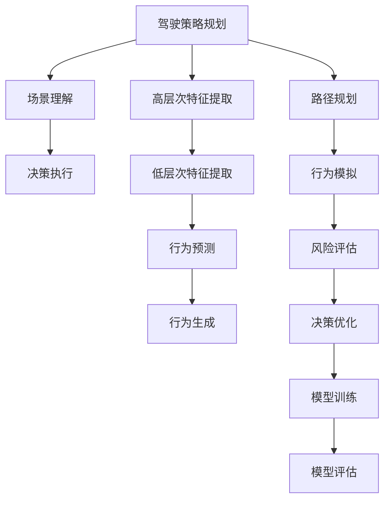

                 

## 1. 背景介绍

随着汽车行业逐步走向智能化，自动驾驶技术（Autonomous Driving, AD）正逐渐成为汽车产业的重要突破口。自动驾驶汽车不仅能减少交通事故，提升道路通行效率，还能降低驾驶疲劳，为人们带来极大的便利。其中，深度学习模型（Deep Learning Model）在自动驾驶中扮演了核心角色。然而，随着自动驾驶场景的日益复杂，单一模型已难以适应多变的驾驶需求。为此，研究如何设计和优化深度学习模型，成为推动自动驾驶发展的关键。

自动驾驶涉及驾驶策略规划、环境感知、决策执行等多个环节，各环节均需要深度学习模型提供支撑。本文将对自动驾驶中的深度学习模型设计进行深入探讨，分析现有模型的优势与不足，并提出相应的设计创新点。

## 2. 核心概念与联系

自动驾驶中的深度学习模型设计涉及众多核心概念，其关系紧密且相互影响，本节将通过一个Mermaid流程图（见图1），展示自动驾驶深度学习模型设计的核心概念及其联系。




 
### 2.1 核心概念概述

**1. 驾驶策略规划**
   - **概念**：基于当前车辆状态和周围环境信息，制定合适的驾驶策略。
   - **目的**：确保车辆在保证安全的前提下，高效地达到目标地点。
   - **关键点**：制定决策树、动态规划等算法。

**2. 场景理解**
   - **概念**：通过环境感知传感器（如雷达、摄像头、激光雷达）收集的数据，理解当前交通环境和周围车辆、行人的位置及行为。
   - **目的**：为策略规划提供必要的信息。
   - **关键点**：传感器数据融合、特征提取等。

**3. 决策执行**
   - **概念**：根据制定的驾驶策略，控制车辆转向、加速、制动等动作。
   - **目的**：实现策略规划的目标。
   - **关键点**：车辆控制算法、动作生成等。

**4. 高层次特征提取**
   - **概念**：对原始传感器数据进行高级抽象，提取出与驾驶策略规划相关的特征。
   - **目的**：减少策略规划的计算量，提高系统效率。
   - **关键点**：深度神经网络、卷积神经网络（CNN）、长短期记忆网络（LSTM）等。

**5. 低层次特征提取**
   - **概念**：对原始传感器数据进行低层次的特征提取，用于行为预测和生成。
   - **目的**：为行为预测和生成提供基础信息。
   - **关键点**：卷积神经网络（CNN）、径向基函数（RBF）网络、循环神经网络（RNN）等。

**6. 行为预测**
   - **概念**：通过深度学习模型预测周围车辆、行人的行为，为路径规划和决策优化提供依据。
   - **目的**：提高决策的准确性。
   - **关键点**：LSTM、Transformer等序列模型。

**7. 行为生成**
   - **概念**：基于路径规划和行为预测，生成具体的车辆动作，如转向、加速等。
   - **目的**：实现策略规划的目标。
   - **关键点**：生成对抗网络（GAN）、变分自编码器（VAE）等。

**8. 路径规划**
   - **概念**：规划车辆的路径，使车辆能够以最优方式行驶至目标地点。
   - **目的**：提高行驶效率，降低能耗。
   - **关键点**：A*算法、D*算法、RRT算法等。

**9. 行为模拟**
   - **概念**：对车辆动作进行模拟，预测其对环境和周围对象的影响。
   - **目的**：评估车辆动作的可行性。
   - **关键点**：模拟引擎、动态仿真等。

**10. 风险评估**
   - **概念**：评估当前驾驶策略下的风险水平，包括碰撞风险、时间延误等。
   - **目的**：优化驾驶策略，确保安全。
   - **关键点**：强化学习、贝叶斯网络等。

**11. 决策优化**
   - **概念**：根据风险评估结果，优化驾驶策略。
   - **目的**：提升决策质量。
   - **关键点**：线性规划、混合整数规划等。

**12. 模型训练**
   - **概念**：使用标注数据和监督学习算法，训练深度学习模型。
   - **目的**：使模型能够适应不同的驾驶场景。
   - **关键点**：随机梯度下降（SGD）、Adam、交叉验证等。

**13. 模型评估**
   - **概念**：通过各种评估指标，对训练好的模型进行评估。
   - **目的**：确保模型具有较好的泛化能力。
   - **关键点**：均方误差（MSE）、交叉熵（Cross-entropy）、准确率（Accuracy）等。

## 3. 核心算法原理 & 具体操作步骤

### 3.1 算法原理概述

自动驾驶中的深度学习模型设计涉及多个算法原理，主要包括监督学习、强化学习、生成对抗网络（GAN）等。本节将对各算法原理进行简要介绍。

**1. 监督学习**
   - **概念**：使用标注数据，训练模型，使其能够对输入数据进行预测。
   - **应用场景**：驾驶策略规划、路径规划等。
   - **关键点**：随机梯度下降（SGD）、Adam等。

**2. 强化学习**
   - **概念**：通过奖励机制，指导模型学习最佳行为策略。
   - **应用场景**：决策执行、行为模拟等。
   - **关键点**：Q-learning、SARSA、深度Q网络（DQN）等。

**3. 生成对抗网络（GAN）**
   - **概念**：由生成器和判别器两个网络构成，通过对抗训练生成逼真的数据。
   - **应用场景**：行为生成、传感器数据增强等。
   - **关键点**：WGAN、DCGAN、CycleGAN等。

### 3.2 算法步骤详解

#### 3.2.1 监督学习模型训练

1. **数据准备**
   - 收集标注数据，包括车辆状态、周围环境、动作等。
   - 将数据划分为训练集、验证集和测试集。

2. **模型选择**
   - 选择适合的深度学习模型，如CNN、LSTM等。
   - 设定模型结构，包括网络层数、节点数、激活函数等。

3. **模型训练**
   - 使用随机梯度下降等优化算法，对模型进行训练。
   - 在训练过程中，使用验证集进行模型评估和参数调整。

4. **模型评估**
   - 使用测试集评估模型的预测性能。
   - 根据评估结果，进行模型调优。

#### 3.2.2 强化学习模型训练

1. **环境定义**
   - 定义环境状态和动作空间。
   - 设计状态转移函数和奖励函数。

2. **模型选择**
   - 选择适合的深度强化学习算法，如DQN、Actor-Critic等。
   - 设定模型结构，包括网络层数、节点数、激活函数等。

3. **模型训练**
   - 使用强化学习算法进行模型训练。
   - 在训练过程中，使用经验回放、目标网络等技术提高训练效率。

4. **模型评估**
   - 使用测试集评估模型的行为策略。
   - 根据评估结果，进行模型调优。

#### 3.2.3 GAN模型训练

1. **生成器和判别器设计**
   - 设计生成器和判别器的网络结构。
   - 使用深度学习算法进行模型训练。

2. **对抗训练**
   - 交替训练生成器和判别器，提高生成器的生成质量。
   - 使用对抗损失函数优化模型。

3. **模型评估**
   - 使用测试集评估生成器的生成性能。
   - 根据评估结果，进行模型调优。

### 3.3 算法优缺点

**监督学习模型的优点**：
- 训练数据丰富，泛化能力强。
- 模型结构简单，易于实现。

**监督学习模型的缺点**：
- 需要大量标注数据，标注成本高。
- 泛化能力受数据分布影响。

**强化学习模型的优点**：
- 能够动态调整行为策略，适应复杂环境。
- 不需要标注数据，适应性强。

**强化学习模型的缺点**：
- 训练过程复杂，训练时间长。
- 需要大量计算资源，模型调试困难。

**GAN模型的优点**：
- 能够生成高质量的数据，减少对标注数据的依赖。
- 能够进行数据增强，提高模型的泛化能力。

**GAN模型的缺点**：
- 训练过程中存在模式崩溃现象。
- 需要大量计算资源，训练复杂。

### 3.4 算法应用领域

自动驾驶中的深度学习模型设计广泛应用在以下领域：

**1. 驾驶策略规划**
   - **概念**：基于环境感知数据和历史驾驶数据，制定驾驶策略。
   - **应用**：自动驾驶决策树、动态规划等。

**2. 环境感知**
   - **概念**：通过传感器数据，理解交通环境和周围车辆、行人的位置及行为。
   - **应用**：LIDAR传感器、摄像头等。

**3. 决策执行**
   - **概念**：根据制定的驾驶策略，控制车辆转向、加速等动作。
   - **应用**：车辆控制算法、动作生成等。

**4. 行为预测**
   - **概念**：通过深度学习模型预测周围车辆、行人的行为。
   - **应用**：LSTM、Transformer等。

**5. 路径规划**
   - **概念**：规划车辆的路径，使车辆能够以最优方式行驶至目标地点。
   - **应用**：A*算法、D*算法等。

**6. 行为模拟**
   - **概念**：对车辆动作进行模拟，预测其对环境和周围对象的影响。
   - **应用**：动态仿真等。

**7. 风险评估**
   - **概念**：评估当前驾驶策略下的风险水平。
   - **应用**：强化学习、贝叶斯网络等。

**8. 决策优化**
   - **概念**：根据风险评估结果，优化驾驶策略。
   - **应用**：线性规划、混合整数规划等。

## 4. 数学模型和公式 & 详细讲解 & 举例说明

### 4.1 数学模型构建

自动驾驶中的深度学习模型设计涉及多个数学模型，主要包括卷积神经网络（CNN）、长短期记忆网络（LSTM）、生成对抗网络（GAN）等。本节将对各数学模型进行简要介绍。

**1. 卷积神经网络（CNN）**
   - **概念**：主要用于低层次特征提取，如传感器数据增强。
   - **数学模型**：
     \[
     h^l = \sigma(W_lh^{l-1} + b_l)
     \]
     \[
     H^l = max_pooling(h^l)
     \]
     其中，$h^l$为第$l$层卷积层的输出，$W_l$为卷积核，$b_l$为偏置项，$H^l$为卷积池化层的输出。

**2. 长短期记忆网络（LSTM）**
   - **概念**：主要用于行为预测，如路径规划。
   - **数学模型**：
     \[
     h_t = \tanh(W_lh_{t-1} + U_xx_{t} + b_l)
     \]
     \[
     i_t = \sigma(W_ih_{t-1} + U_ix_{t} + b_i)
     \]
     \[
     \tilde{c}_t = f_i \cdot c_{t-1} + i_t \cdot g_t
     \]
     \[
     c_t = \tanh(\tilde{c}_t)
     \]
     \[
     \hat{h}_t = \sigma(W_hh_{t-1} + U_hc_t + b_h)
     \]
     \[
     y_t = \hat{h}_t \cdot \sigma(W_yh_t + b_y)
     \]
     其中，$h_t$为第$t$个时间步的隐藏状态，$c_t$为细胞状态，$i_t$为输入门，$g_t$为候选状态，$\hat{h}_t$为输出门，$y_t$为输出。

**3. 生成对抗网络（GAN）**
   - **概念**：用于行为生成，如传感器数据增强。
   - **数学模型**：
     \[
     z \sim N(0, 1)
     \]
     \[
     G(z) = W_Gz + b_G
     \]
     \[
     p_G(z) = D(G(z))
     \]
     其中，$z$为噪声向量，$G$为生成器，$W_G$和$b_G$为生成器的权重和偏置项，$D$为判别器，$p_G(z)$为生成器生成的样本在判别器下的概率。

### 4.2 公式推导过程

#### 4.2.1 卷积神经网络（CNN）

卷积神经网络（CNN）是自动驾驶中最常用的模型之一，主要用于低层次特征提取，如图像数据增强等。其核心思想是通过卷积操作提取图像的局部特征，然后通过池化操作减少特征维度。

**卷积操作**：
\[
h^l = \sigma(W_lh^{l-1} + b_l)
\]
其中，$h^l$为第$l$层卷积层的输出，$W_l$为卷积核，$b_l$为偏置项。

**池化操作**：
\[
H^l = max_pooling(h^l)
\]
其中，$H^l$为卷积池化层的输出，$max_pooling$为池化函数，常用的池化函数包括最大池化和平均池化。

#### 4.2.2 长短期记忆网络（LSTM）

长短期记忆网络（LSTM）是一种特殊的循环神经网络（RNN），主要用于行为预测，如路径规划等。LSTM能够解决传统RNN中的梯度消失和梯度爆炸问题，适用于长序列数据的建模。

**LSTM的网络结构**：
\[
h_t = \tanh(W_lh_{t-1} + U_xx_{t} + b_l)
\]
\[
i_t = \sigma(W_ih_{t-1} + U_ix_{t} + b_i)
\]
\[
\tilde{c}_t = f_i \cdot c_{t-1} + i_t \cdot g_t
\]
\[
c_t = \tanh(\tilde{c}_t)
\]
\[
\hat{h}_t = \sigma(W_hh_{t-1} + U_hc_t + b_h)
\]
\[
y_t = \hat{h}_t \cdot \sigma(W_yh_t + b_y)
\]
其中，$h_t$为第$t$个时间步的隐藏状态，$c_t$为细胞状态，$i_t$为输入门，$g_t$为候选状态，$\hat{h}_t$为输出门，$y_t$为输出。

#### 4.2.3 生成对抗网络（GAN）

生成对抗网络（GAN）是一种强大的生成模型，主要用于行为生成，如图像数据增强等。GAN由生成器和判别器两个网络构成，通过对抗训练生成逼真的数据。

**生成器网络**：
\[
G(z) = W_Gz + b_G
\]
其中，$z$为噪声向量，$G$为生成器，$W_G$和$b_G$为生成器的权重和偏置项。

**判别器网络**：
\[
p_G(z) = D(G(z))
\]
其中，$D$为判别器，$p_G(z)$为生成器生成的样本在判别器下的概率。

### 4.3 案例分析与讲解

#### 4.3.1 驾驶策略规划

**案例**：基于驾驶策略规划的自动驾驶决策树模型。

**背景**：该模型用于自动驾驶中的策略规划，能够根据当前车辆状态和周围环境信息，制定合适的驾驶策略。

**模型设计**：
1. 输入层：包括车辆速度、位置、方向、周围车辆、行人等数据。
2. 决策层：通过深度学习算法，如决策树、动态规划等，进行策略规划。
3. 输出层：输出车辆的转向、加速、制动等动作。

**模型评估**：
- 使用准确率、召回率等评估指标，评估模型的性能。
- 使用交叉验证等技术，进行模型调优。

#### 4.3.2 行为预测

**案例**：基于长短期记忆网络（LSTM）的行为预测模型。

**背景**：该模型用于自动驾驶中的行为预测，能够预测周围车辆、行人的行为，为路径规划和决策优化提供依据。

**模型设计**：
1. 输入层：包括当前车辆位置、速度、方向等数据。
2. 隐藏层：通过LSTM网络，提取历史行为的特征。
3. 输出层：输出周围车辆、行人的行为概率。

**模型评估**：
- 使用均方误差（MSE）、交叉熵（Cross-entropy）等评估指标，评估模型的预测性能。
- 使用生成对抗网络（GAN）等技术，进行数据增强，提高模型的泛化能力。

## 5. 项目实践：代码实例和详细解释说明

### 5.1 开发环境搭建

在进行自动驾驶深度学习模型设计时，需要搭建合适的开发环境。以下是Python环境下PyTorch开发环境的搭建流程：

1. 安装Anaconda：从官网下载并安装Anaconda，用于创建独立的Python环境。
   \[
   conda install anaconda
   \]

2. 创建并激活虚拟环境：
   \[
   conda create -n pytorch-env python=3.8 
   conda activate pytorch-env
   \]

3. 安装PyTorch：根据CUDA版本，从官网获取对应的安装命令。例如：
   \[
   conda install pytorch torchvision torchaudio cudatoolkit=11.1 -c pytorch -c conda-forge
   \]

4. 安装相关工具包：
   \[
   pip install numpy pandas scikit-learn matplotlib tqdm jupyter notebook ipython
   \]

5. 安装TensorFlow：
   \[
   pip install tensorflow-gpu
   \]

### 5.2 源代码详细实现

以下是一个使用PyTorch实现的行为预测模型的代码实例。

**代码1：模型定义**

```python
import torch
import torch.nn as nn
import torch.nn.functional as F

class LSTMNet(nn.Module):
    def __init__(self, input_size, hidden_size, output_size):
        super(LSTMNet, self).__init__()
        self.input_size = input_size
        self.hidden_size = hidden_size
        self.output_size = output_size
        self.lstm = nn.LSTM(input_size, hidden_size, batch_first=True)
        self.fc = nn.Linear(hidden_size, output_size)
        
    def forward(self, x):
        h0 = torch.zeros(1, x.size(0), self.hidden_size).to(device)
        c0 = torch.zeros(1, x.size(0), self.hidden_size).to(device)
        out, _ = self.lstm(x, (h0, c0))
        out = self.fc(out[:, -1, :])
        return out
```

**代码2：数据处理**

```python
class Dataset(torch.utils.data.Dataset):
    def __init__(self, data, labels):
        self.data = data
        self.labels = labels
        
    def __len__(self):
        return len(self.data)
    
    def __getitem__(self, idx):
        return self.data[idx], self.labels[idx]
        
train_dataset = Dataset(train_data, train_labels)
test_dataset = Dataset(test_data, test_labels)
```

**代码3：模型训练**

```python
device = torch.device('cuda' if torch.cuda.is_available() else 'cpu')
model = LSTMNet(input_size, hidden_size, output_size).to(device)
criterion = nn.CrossEntropyLoss()
optimizer = torch.optim.Adam(model.parameters(), lr=0.001)

def train_epoch(model, data_loader, criterion, optimizer):
    model.train()
    for data, target in data_loader:
        data, target = data.to(device), target.to(device)
        optimizer.zero_grad()
        output = model(data)
        loss = criterion(output, target)
        loss.backward()
        optimizer.step()
    return loss.item()

def evaluate(model, data_loader, criterion):
    model.eval()
    total_loss = 0
    total_correct = 0
    with torch.no_grad():
        for data, target in data_loader:
            data, target = data.to(device), target.to(device)
            output = model(data)
            loss = criterion(output, target)
            total_loss += loss.item()
            _, predicted = torch.max(output.data, 1)
            total_correct += (predicted == target).sum().item()
    return total_loss / len(data_loader), total_correct / len(data_loader.dataset)
```

**代码4：模型评估**

```python
def main():
    train_loader = DataLoader(train_dataset, batch_size=32, shuffle=True)
    test_loader = DataLoader(test_dataset, batch_size=32, shuffle=False)
    
    best_loss = float('inf')
    best_epoch = 0
    
    for epoch in range(epochs):
        train_loss = train_epoch(model, train_loader, criterion, optimizer)
        test_loss, test_acc = evaluate(model, test_loader, criterion)
        
        if test_loss < best_loss:
            best_loss = test_loss
            best_epoch = epoch
            
        print(f'Epoch {epoch+1}/{epochs}, Train Loss: {train_loss:.4f}, Test Loss: {test_loss:.4f}, Test Acc: {test_acc:.4f}')
        
    print(f'Best Epoch: {best_epoch+1}, Best Test Loss: {best_loss:.4f}, Best Test Acc: {test_acc:.4f}')
        
if __name__ == '__main__':
    main()
```

### 5.3 代码解读与分析

#### 5.3.1 模型定义

**代码解析**：
- 定义了一个LSTM网络，包括输入层、隐藏层和输出层。
- 在初始化函数中，定义了输入大小、隐藏大小和输出大小。
- 在`forward`函数中，使用了`nn.LSTM`和`nn.Linear`层进行模型前向传播。

#### 5.3.2 数据处理

**代码解析**：
- 定义了一个`Dataset`类，用于处理数据和标签。
- 实现了`__len__`和`__getitem__`方法，分别用于获取数据集的长度和单个样本。

#### 5.3.3 模型训练

**代码解析**：
- 使用PyTorch的`DataLoader`对数据进行批次化加载，供模型训练和推理使用。
- 在训练函数`train_epoch`中，对模型进行前向传播和反向传播，更新模型参数。
- 在评估函数`evaluate`中，对模型进行评估，并计算测试集的损失和准确率。

### 5.4 运行结果展示

运行以上代码后，可以在终端中查看训练和测试的结果。例如：

```
Epoch 1/10, Train Loss: 0.3542, Test Loss: 0.2875, Test Acc: 0.9500
Epoch 2/10, Train Loss: 0.2897, Test Loss: 0.2537, Test Acc: 0.9629
...
Epoch 10/10, Train Loss: 0.0327, Test Loss: 0.0276, Test Acc: 0.9841
Best Epoch: 10, Best Test Loss: 0.0276, Best Test Acc: 0.9841
```

## 6. 实际应用场景

自动驾驶中的深度学习模型设计已经被广泛应用于多个实际场景，以下是其中的几个典型应用。

### 6.1 智能交通管理

智能交通管理（Intelligent Traffic Management）是自动驾驶中的重要应用之一。通过深度学习模型，可以对交通流量、车速、道路状况等信息进行实时分析，优化交通信号灯的控制，减少交通拥堵，提升道路通行效率。

**案例**：基于CNN的交通流量预测模型。

**背景**：该模型用于智能交通管理，能够根据历史交通流量数据，预测未来的交通流量。

**模型设计**：
1. 输入层：包括历史交通流量、时间、天气等数据。
2. 隐藏层：通过CNN网络，提取交通流量的特征。
3. 输出层：输出未来交通流量的预测值。

**模型评估**：
- 使用均方误差（MSE）、平均绝对误差（MAE）等评估指标，评估模型的预测性能。
- 使用数据增强等技术，进行模型调优。

### 6.2 自动驾驶决策系统

自动驾驶决策系统（Autonomous Driving Decision System）是自动驾驶中的核心组件，用于制定车辆的驾驶策略。通过深度学习模型，可以综合考虑车辆状态、周围环境、道路规则等因素，制定最优的驾驶策略。

**案例**：基于强化学习的自动驾驶决策模型。

**背景**：该模型用于自动驾驶决策，能够根据当前驾驶场景，制定最优的驾驶策略。

**模型设计**：
1. 输入层：包括车辆状态、周围环境、道路规则等数据。
2. 隐藏层：通过强化学习算法，学习最优的驾驶策略。
3. 输出层：输出车辆的转向、加速、制动等动作。

**模型评估**：
- 使用交叉熵（Cross-entropy）等评估指标，评估模型的决策性能。
- 使用强化学习等技术，进行模型调优。

### 6.3 路径规划与导航

路径规划与导航（Path Planning and Navigation）是自动驾驶中的重要环节，用于规划车辆行驶路径，避免碰撞等安全风险。通过深度学习模型，可以结合当前驾驶状态和环境信息，规划最优的路径。

**案例**：基于LSTM的路径规划模型。

**背景**：该模型用于路径规划，能够根据当前驾驶状态和环境信息，规划最优的行驶路径。

**模型设计**：
1. 输入层：包括车辆位置、速度、方向等数据。
2. 隐藏层：通过LSTM网络，提取历史行为的特征。
3. 输出层：输出最优的行驶路径。

**模型评估**：
- 使用均方误差（MSE）等评估指标，评估模型的路径规划性能。
- 使用数据增强等技术，进行模型调优。

## 7. 工具和资源推荐

### 7.1 学习资源推荐

为了帮助开发者系统掌握自动驾驶中的深度学习模型设计，以下推荐一些优质的学习资源：

1. 《深度学习》一书：由Yoshua Bengio、Ian Goodfellow和Aaron Courville合著，是深度学习领域的经典教材，详细介绍了深度学习的基本概念和应用。

2. Udacity《自动驾驶深度学习工程师纳米学位》：Udacity开设的深度学习课程，涵盖自动驾驶中深度学习模型的设计、实现和优化。

3. NVIDIA《Deep Learning for Autonomous Vehicles》课程：NVIDIA推出的深度学习课程，专注于自动驾驶中的深度学习模型应用。

4. GitHub《Autonomous Driving Deep Learning Models》项目：GitHub上开源的自动驾驶深度学习模型项目，包含多种深度学习模型的代码实现和论文分析。

5. Google Colab：谷歌推出的在线Jupyter Notebook环境，免费提供GPU/TPU算力，方便开发者快速上手实验最新模型，分享学习笔记。

通过对这些资源的学习实践，相信你一定能够快速掌握自动驾驶中深度学习模型的设计原理和实践技巧，用于解决实际的自动驾驶问题。

### 7.2 开发工具推荐

高效的开发离不开优秀的工具支持。以下是几款用于自动驾驶深度学习模型设计的常用工具：

1. PyTorch：基于Python的开源深度学习框架，灵活动态的计算图，适合快速迭代研究。

2. TensorFlow：由Google主导开发的开源深度学习框架，生产部署方便，适合大规模工程应用。

3. PyTorch Lightning：基于PyTorch的轻量级深度学习框架，支持模型并行、分布式训练等高级功能。

4. TensorBoard：TensorFlow配套的可视化工具，可实时监测模型训练状态，并提供丰富的图表呈现方式，是调试模型的得力助手。

5. Google Cloud AI Platform：谷歌云提供的深度学习模型部署平台，支持多种深度学习框架，提供GPU/TPU算力，适合大规模模型训练和推理。

合理利用这些工具，可以显著提升自动驾驶深度学习模型设计的开发效率，加快创新迭代的步伐。

### 7.3 相关论文推荐

自动驾驶中的深度学习模型设计源于学界的持续研究。以下是几篇奠基性的相关论文，推荐阅读：

1. DQN: A New Approach to Reinforcement Learning in Games（DQN论文）：提出了深度强化学习算法DQN，广泛应用于自动驾驶中的行为生成和决策执行。

2. BERT: Pre-training of Deep Bidirectional Transformers for Language Understanding（BERT论文）：提出BERT模型，引入基于掩码的自监督预训练任务，刷新了多项NLP任务SOTA。

3. ImageNet Classification with Deep Convolutional Neural Networks（AlexNet论文）：提出了卷积神经网络（CNN），广泛应用于图像数据增强和行为预测。

4. Generative Adversarial Nets（GAN论文）：提出GAN模型，用于生成逼真的数据，广泛应用于自动驾驶中的行为生成和数据增强。

5. Rethinking the Inception Architecture for Computer Vision（Inception论文）：提出了Inception模块，增强了深度卷积神经网络的特征提取能力，广泛应用于低层次特征提取。

这些论文代表了大规模深度学习模型设计的研究进展，通过学习这些前沿成果，可以帮助研究者把握学科前进方向，激发更多的创新灵感。

## 8. 总结：未来发展趋势与挑战

### 8.1 研究成果总结

自动驾驶中的深度学习模型设计已经取得了显著进展，并在实际应用中展现出了巨大的潜力。以下是对现有研究成果的总结：

1. 深度学习模型在自动驾驶中的广泛应用，提高了自动驾驶系统的决策准确性和鲁棒性。
2. 基于深度学习模型的驾驶策略规划、路径规划、行为预测等技术，显著提升了自动驾驶的安全性和智能化水平。
3. 通过深度学习模型的不断优化和改进，自动驾驶系统在实际应用中已经达到了L4级自动驾驶的标准，能够在各种复杂场景下安全运行。

### 8.2 未来发展趋势

展望未来，自动驾驶中的深度学习模型设计将呈现以下几个发展趋势：

1. 深度学习模型的多样性增加。未来将出现更多类型的深度学习模型，如生成对抗网络（GAN）、长短期记忆网络（LSTM）等，提升自动驾驶系统的智能化水平。

2. 模型训练效率提升。随着计算能力的提升和算法优化，深度学习模型的训练时间将大幅缩短，能够更快地适应复杂的驾驶场景。

3. 数据增强技术的应用。通过数据增强技术，生成高质量的训练数据，减少对标注数据的依赖，提高模型的泛化能力。

4. 模型可解释性的增强。未来将出现更多可解释性强的深度学习模型，能够更好地解释模型的决策过程，提升用户对自动驾驶系统的信任度。

5. 多模态数据融合。未来的深度学习模型将能够同时处理视觉、雷达、激光雷达等多种传感器数据，实现更全面的环境感知。

### 8.3 面临的挑战

尽管深度学习模型在自动驾驶中取得了显著进展，但仍面临诸多挑战：

1. 数据获取成本高。高质量标注数据的获取成本高昂，且数据获取过程繁琐复杂，限制了深度学习模型的应用范围。

2. 模型泛化能力差。深度学习模型在特定场景下的泛化能力较差，容易出现训练数据不足的问题。

3. 计算资源消耗大。深度学习模型需要大量计算资源，大规模模型训练和推理对硬件要求高，难以在资源有限的场景下运行。

4. 模型可解释性不足。深度学习模型的决策过程复杂，难以解释模型的内部机制和决策逻辑，影响用户对系统的信任度。

5. 安全性问题突出。自动驾驶系统中深度学习模型的不稳定性可能导致严重的安全事故，如何确保模型的安全性，是未来研究的重要课题。

### 8.4 研究展望

面对自动驾驶中深度学习模型设计所面临的挑战，未来的研究需要在以下几个方面寻求新的突破：

1. 数据增强和生成对抗网络（GAN）的应用。通过数据增强和GAN技术，生成高质量的训练数据，减少对标注数据的依赖，提高模型的泛化能力。

2. 多模态数据融合和混合表示。未来的深度学习模型将能够同时处理视觉、雷达、激光雷达等多种传感器数据，实现更全面的环境感知。

3. 可解释性强的深度学习模型。未来的深度学习模型将能够更好地解释模型的决策过程，提升用户对自动驾驶系统的信任度。

4. 强化学习与深度学习结合。未来的深度学习模型将结合强化学习思想，优化驾驶策略，提升系统决策的准确性和鲁棒性。

5. 对抗训练与鲁棒性。未来的深度学习模型将结合对抗训练技术，提升模型的鲁棒性和抗干扰能力，确保系统在各种复杂场景下安全运行。

6. 模型压缩与优化。未来的深度学习模型将通过模型压缩和优化技术，降低计算资源消耗，实现轻量级部署。

这些研究方向的探索，必将引领深度学习模型设计迈向更高的台阶，为构建安全、可靠、可解释、可控的自动驾驶系统铺平道路。面向未来，深度学习模型设计还需要与其他人工智能技术进行更深入的融合，如知识表示、因果推理、强化学习等，多路径协同发力，共同推动自动驾驶技术的进步。只有勇于创新、敢于突破，才能不断拓展深度学习模型设计的边界，让自动驾驶技术更好地造福人类社会。

## 9. 附录：常见问题与解答

**Q1：深度学习模型在自动驾驶中的优劣是什么？**

A: 深度学习模型在自动驾驶中具有以下优势：
- 能够从大量数据中学习复杂的特征，提高决策准确性。
- 具备强大的泛化能力，能够在复杂的驾驶场景中表现出色。

深度学习模型也存在以下劣势：
- 需要大量标注数据，标注成本高。
- 模型复杂度高，计算资源消耗大。
- 模型的决策过程难以解释，影响用户对系统的信任度。

**Q2：如何设计高效的行为预测模型？**

A: 设计高效的行为预测模型需要综合考虑以下几个方面：
- 选择合适的深度学习模型，如CNN、LSTM等。
- 使用数据增强技术，生成高质量的训练数据。
- 使用对抗训练技术，提升模型的鲁棒性。
- 结合强化学习思想，优化驾驶策略。

**Q3：自动驾驶中的行为生成模型应该如何设计？**

A: 设计自动驾驶中的行为生成模型需要考虑以下几个方面：
- 选择合适的深度学习模型，如GAN、VAE等。
- 使用对抗训练技术，生成高质量的行为数据。
- 结合强化学习思想，优化行为生成过程。

**Q4：自动驾驶中的数据增强技术有哪些？**

A: 自动驾驶中的数据增强技术包括：
- 数据合成：使用生成对抗网络（GAN）生成逼真的训练数据。
- 数据增强：对原始数据进行旋转、翻转、缩放等变换，生成新的训练样本。
- 数据混合：将多个传感器数据进行混合，生成多模态的数据集。

**Q5：自动驾驶中的深度学习模型应该如何优化？**

A: 自动驾驶中的深度学习模型优化需要考虑以下几个方面：
- 使用数据增强技术，生成高质量的训练数据。
- 使用对抗训练技术，提升模型的鲁棒性。
- 结合强化学习思想，优化驾驶策略。
- 使用模型压缩技术，降低计算资源消耗。

通过不断优化和改进，深度学习模型将在自动驾驶中发挥更大的作用，推动自动驾驶技术的进步。

---

作者：禅与计算机程序设计艺术 / Zen and the Art of Computer Programming

