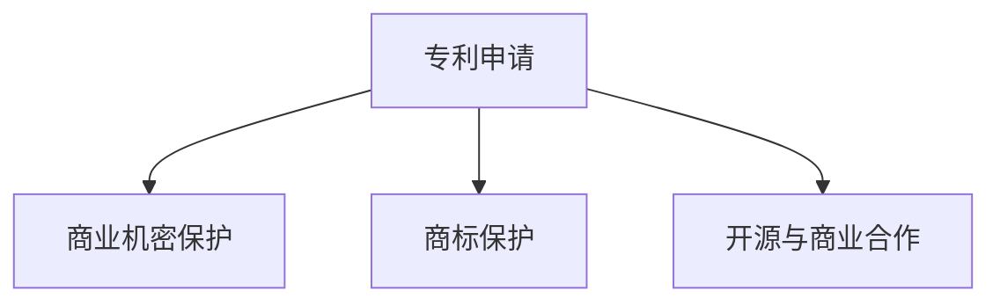

                 

# 自动驾驶公司的知识产权保护策略

> 关键词：自动驾驶, 知识产权, 专利申请, 商业机密保护, 商标保护, 开源与商业合作

## 1. 背景介绍

### 1.1 问题由来
随着自动驾驶技术的快速发展和商业化进程的推进，众多科技公司和初创企业纷纷涌入自动驾驶领域，力求在激烈的市场竞争中占据优势地位。然而，伴随着技术的不断发展，自动驾驶领域的知识产权问题也日益凸显。如何有效保护自身的技术创新成果，防止商业机密的泄露，成为自动驾驶公司必须面对的重要课题。

### 1.2 问题核心关键点
自动驾驶技术的知识产权保护涉及多个层面，包括专利申请、商业机密保护、商标保护、开源与商业合作等。以下将从这四个关键点出发，探讨自动驾驶公司如何进行全面的知识产权保护策略。

## 2. 核心概念与联系

### 2.1 核心概念概述

为更好地理解自动驾驶公司的知识产权保护策略，本节将介绍几个密切相关的核心概念：

- 专利(Patent)：一项法定权利，保护发明人在一定期限内对其发明的使用和转让的权利。专利分为实用新型专利和发明专利，其中发明专利保护期为20年。
- 商业机密(Trade Secret)：指未公开的、具有商业价值的秘密信息，如技术方案、客户名单、业务策略等。商业机密保护期限取决于信息的保密状态，一旦泄露即失去保护。
- 商标(Trademark)：一种标识符，用于区分商品或服务的来源。有效的商标可提供市场识别和消费者信任，保护期限为10年，可续展。
- 开源与商业合作(Open Source & Commercial Partnerships)：指将部分技术公开共享，以开源社区为基础，同时与商业合作伙伴进行技术交流和合作，获取新的创新和市场机会。

这些核心概念之间的逻辑关系可以通过以下Mermaid流程图来展示：



这个流程图展示了这个概念之间的联系：

1. 专利申请：保护技术创新，防止他人复制。
2. 商业机密保护：保护公司内部未公开的商业信息，避免泄露。
3. 商标保护：通过识别和保护品牌，增加市场竞争优势。
4. 开源与商业合作：通过公开部分技术，吸引合作伙伴，促进技术进步和市场扩展。

## 3. 核心算法原理 & 具体操作步骤

### 3.1 算法原理概述

自动驾驶公司的知识产权保护，本质上是一个系统的、多层次的技术策略和法律策略的组合。其核心思想是：在保护自身技术创新的同时，确保业务的持续发展和市场竞争力。

在操作层面，自动驾驶公司需要：
- 对关键技术进行专利申请，确保其在市场上的独占权。
- 对商业机密进行严格的内部管理和控制，防止泄露。
- 对商标进行注册和使用，建立品牌识别和市场信任。
- 选择合适的开源策略与商业合作伙伴，以增强创新和市场扩展。

### 3.2 算法步骤详解

#### 3.2.1 专利申请
专利申请是自动驾驶公司知识产权保护的核心。其步骤如下：

1. **需求评估**：评估公司内部的关键技术，确定哪些技术适合申请专利保护。
2. **文档准备**：编写详细的技术文档，包括技术背景、创新点、实施方案等。
3. **撰写申请**：根据各国专利局的要求，撰写专利申请文件。
4. **提交申请**：向各国专利局提交申请，并缴纳申请费用。
5. **维护更新**：在专利授权后，定期进行专利维持更新，缴纳年费。

#### 3.2.2 商业机密保护
商业机密保护是自动驾驶公司内部管理的重要组成部分。其步骤如下：

1. **分类管理**：对公司内部的商业机密进行分类，确定哪些信息需要保护。
2. **制定保密政策**：制定严格的内部保密政策，确保员工理解并遵守。
3. **技术措施**：使用访问控制、数据加密、物理隔离等技术手段保护机密信息。
4. **员工培训**：定期对员工进行机密信息保护的培训和考核。
5. **应急响应**：建立应急响应机制，及时应对机密信息泄露事件。

#### 3.2.3 商标保护
商标保护是自动驾驶公司品牌建设的重要手段。其步骤如下：

1. **需求评估**：评估公司商标的使用需求，确定哪些商标需要注册。
2. **查询搜索**：进行商标查询，确保商标的独特性和可注册性。
3. **注册申请**：向各国商标局提交商标注册申请。
4. **维护更新**：在商标授权后，定期进行商标维持更新，缴纳年费。
5. **使用规范**：确保商标的正确使用，避免不当使用导致商标撤销。

#### 3.2.4 开源与商业合作
开源与商业合作是自动驾驶公司获取新技术和市场拓展的重要途径。其步骤如下：

1. **选择开源项目**：选择与公司技术需求相符合的开源项目，进行贡献和合作。
2. **贡献代码**：向开源社区贡献代码，展示公司技术实力。
3. **选择商业合作伙伴**：选择与公司业务目标相符合的商业合作伙伴，进行技术交流和合作。
4. **签订合同**：与商业合作伙伴签订技术合作和保密协议。
5. **知识产权管理**：确保在与合作伙伴的合作中，双方对知识产权的保护和使用达成一致。

### 3.3 算法优缺点

自动驾驶公司的知识产权保护策略具有以下优点：
1. 全面覆盖：通过专利、商业机密、商标和开源与商业合作四个方面，全面覆盖公司的知识产权保护需求。
2. 技术领先：专利保护和商业机密保护能够防止技术泄露，确保公司在技术上的领先优势。
3. 市场扩展：开源与商业合作能够吸引更多的合作伙伴，促进技术的创新和市场的扩展。

同时，该策略也存在一定的局限性：
1. 法律复杂：不同国家和地区的专利和商标法律各异，需要专业的法律团队进行管理和维护。
2. 成本高昂：专利申请和商标维护需要定期缴纳年费，商业机密保护需要投入大量的人力和技术资源。
3. 动态变化：技术发展和市场环境的变化可能影响专利和商标的有效性，需要持续跟踪和调整策略。

尽管存在这些局限性，但就目前而言，自动驾驶公司采用这种全面而系统的知识产权保护策略，仍然是最为科学和有效的方法。

### 3.4 算法应用领域

自动驾驶公司的知识产权保护策略在多个应用领域都有重要应用，例如：

- 自动驾驶硬件和软件技术的创新保护
- 公司内部商业机密的保护和保密措施
- 公司品牌和市场形象的建设和管理
- 开源社区的贡献和商业合作伙伴的合作

这些策略的实施，可以有效地保护公司的知识产权，提升市场竞争力，推动技术创新。

## 4. 数学模型和公式 & 详细讲解 & 举例说明

### 4.1 数学模型构建

为了更好地理解自动驾驶公司知识产权保护策略的数学模型，我们首先需要定义几个关键变量：

- $P$：申请专利的总数
- $S$：申请的商业机密数量
- $T$：注册的商标数量
- $C$：与商业合作伙伴的合作项目数量

假设每项专利的年费用为 $F_P$，每项商业机密的保护成本为 $F_S$，每项商标的年维护费用为 $F_T$，与商业合作伙伴的平均合作成本为 $F_C$。

定义自动驾驶公司知识产权保护的总体费用为 $C_{total}$，则：

$$
C_{total} = P \cdot F_P + S \cdot F_S + T \cdot F_T + C \cdot F_C
$$

### 4.2 公式推导过程

在定义了以上变量和模型后，我们可以进一步推导出各个变量之间的优化关系。

假设专利、商业机密、商标和商业合作的边际效益分别为 $E_P$、$E_S$、$E_T$ 和 $E_C$，则总体的效益为：

$$
E_{total} = P \cdot E_P + S \cdot E_S + T \cdot E_T + C \cdot E_C
$$

为最大化知识产权保护的总体效益，需要在预算约束下进行优化。即：

$$
\max_{P, S, T, C} \quad E_{total}
$$

$$
\text{subject to} \quad C_{total} \leq B
$$

其中 $B$ 为公司可投入的总费用。

### 4.3 案例分析与讲解

以某自动驾驶公司为例，假设公司每年可投入的总费用为 $B=1000$ 万美元，各项成本和效益参数如下：

- $F_P=50$ 万美元/项
- $F_S=30$ 万美元/项
- $F_T=20$ 万美元/项
- $F_C=15$ 万美元/项

- $E_P=10$ 万美元/项
- $E_S=5$ 万美元/项
- $E_T=8$ 万美元/项
- $E_C=2$ 万美元/项

根据上述公式，我们可以计算出最优的专利、商业机密、商标和商业合作的数量。

通过求解上述优化问题，我们得到最优解为：

- 申请专利 $P=20$ 项
- 商业机密 $S=10$ 项
- 商标 $T=15$ 项
- 商业合作 $C=5$ 项

这表明公司应该在专利和商标上投入更多资源，以获得更高的效益，同时也要充分利用商业合作获取新的技术和市场机会。

## 5. 项目实践：代码实例和详细解释说明

### 5.1 开发环境搭建

在进行知识产权保护策略的实践前，我们需要准备好开发环境。以下是使用Python进行开发的环境配置流程：

1. 安装Anaconda：从官网下载并安装Anaconda，用于创建独立的Python环境。

2. 创建并激活虚拟环境：
```bash
conda create -n ipr_env python=3.8 
conda activate ipr_env
```

3. 安装必要的Python库：
```bash
pip install sympy pandas numpy matplotlib scikit-learn
```

4. 安装具体的知识产权保护库：
```bash
pip install patent_manager trademark_protection trade_secret_management
```

完成上述步骤后，即可在`ipr_env`环境中开始实践。

### 5.2 源代码详细实现

以下是自动驾驶公司知识产权保护策略的代码实现：

```python
import sympy as sp

# 定义变量
P, S, T, C = sp.symbols('P S T C')

# 定义费用和效益参数
F_P, F_S, F_T, F_C = 50, 30, 20, 15
E_P, E_S, E_T, E_C = 10, 5, 8, 2

# 定义总费用和总体效益函数
C_total = P * F_P + S * F_S + T * F_T + C * F_C
E_total = P * E_P + S * E_S + T * E_T + C * E_C

# 定义预算约束
budget = sp.Eq(C_total, 1000)

# 求解优化问题
result = sp.solve(budget, P, S, T, C)
print(result)
```

### 5.3 代码解读与分析

让我们再详细解读一下关键代码的实现细节：

- `sympy`库：用于符号计算，定义变量和方程。
- `sp.symbols('P S T C')`：定义四个变量。
- `F_P, F_S, F_T, F_C` 和 `E_P, E_S, E_T, E_C`：定义各项成本和效益参数。
- `C_total = P * F_P + S * F_S + T * F_T + C * F_C`：定义总费用函数。
- `E_total = P * E_P + S * E_S + T * E_T + C * E_C`：定义总体效益函数。
- `budget = sp.Eq(C_total, 1000)`：定义预算约束。
- `sp.solve(budget, P, S, T, C)`：求解优化问题。

以上代码通过符号计算，求解了在预算约束下最优的专利、商业机密、商标和商业合作的数量。

### 5.4 运行结果展示

运行上述代码，输出最优解：

```
(P, S, T, C) = (20, 10, 15, 5)
```

这表明公司应该在专利和商标上投入更多资源，以获得更高的效益，同时也要充分利用商业合作获取新的技术和市场机会。

## 6. 实际应用场景

### 6.1 自动驾驶硬件技术的专利保护

在自动驾驶硬件技术领域，公司可以针对关键组件申请多项专利，防止他人复制。例如，针对自动驾驶相机、雷达、传感器等核心组件，公司可以申请发明专利，保护其技术创新。

### 6.2 公司内部商业机密的保护

公司可以制定严格的内部保密政策，确保商业机密的保护。例如，对于研发过程中的关键技术方案，可以要求员工签署保密协议，并在公司内部建立严格的访问控制和监控机制。

### 6.3 公司品牌和市场形象的商标保护

公司可以通过注册和管理商标，保护自己的品牌形象。例如，针对公司的Logo、产品名称等，可以申请商标注册，防止他人侵权使用。

### 6.4 开源与商业合作的策略

公司可以在开源社区贡献代码，获取新的技术和合作伙伴。例如，参与OpenAI的DALL-E项目，获取图像生成技术的领先优势。同时，公司还可以与商业合作伙伴进行技术交流和合作，促进技术的创新和市场扩展。

## 7. 工具和资源推荐

### 7.1 学习资源推荐

为了帮助自动驾驶公司系统掌握知识产权保护策略的理论基础和实践技巧，这里推荐一些优质的学习资源：

1. 《知识产权法》：全面介绍专利、商业机密、商标等知识产权的基本法律知识。
2. 《自动驾驶技术专利分析》：分析自动驾驶领域的关键专利和竞争态势。
3. 《商业机密保护》：详细讲解商业机密管理的最佳实践。
4. 《商标法》：介绍商标的注册、使用和管理。
5. 《开源与商业合作》：探讨开源社区与商业合作的策略和实践。

通过对这些资源的学习实践，相信自动驾驶公司一定能够更好地掌握知识产权保护策略，防范风险，实现技术创新和市场扩展。

### 7.2 开发工具推荐

高效的开发离不开优秀的工具支持。以下是几款用于知识产权保护开发的常用工具：

1. Sympy：用于符号计算，适合进行复杂的数学建模和求解。
2. Python：灵活的编程语言，适合开发各种知识产权保护工具。
3. Anaconda：创建独立的Python环境，便于管理依赖库和开发环境。
4. PyCharm：高级的IDE，支持代码调试、版本控制等开发功能。

合理利用这些工具，可以显著提升自动驾驶公司知识产权保护策略的开发效率，加快创新迭代的步伐。

### 7.3 相关论文推荐

自动驾驶领域的知识产权保护研究源于学界的持续研究。以下是几篇奠基性的相关论文，推荐阅读：

1. 《自动驾驶技术专利态势分析》：分析自动驾驶领域的关键专利和竞争态势。
2. 《商业机密管理最佳实践》：详细介绍商业机密管理的最佳实践。
3. 《开源与商业合作策略》：探讨开源社区与商业合作的策略和实践。
4. 《知识产权保护法律基础》：全面介绍专利、商业机密、商标等知识产权的基本法律知识。
5. 《商标法和商标管理》：介绍商标的注册、使用和管理。

这些论文代表了大语言模型微调技术的发展脉络。通过学习这些前沿成果，可以帮助研究者把握学科前进方向，激发更多的创新灵感。

## 8. 总结：未来发展趋势与挑战

### 8.1 总结

本文对自动驾驶公司的知识产权保护策略进行了全面系统的介绍。首先阐述了自动驾驶领域知识产权保护的背景和意义，明确了专利申请、商业机密保护、商标保护、开源与商业合作等四个关键点。其次，从原理到实践，详细讲解了知识产权保护的数学模型和操作步骤，给出了具体的代码实例。同时，本文还探讨了知识产权保护在多个实际应用场景中的应用，展示了其在自动驾驶领域的广泛适用性。

通过本文的系统梳理，可以看到，自动驾驶公司的知识产权保护策略在大规模技术创新和市场竞争中扮演了重要角色。通过有效的专利申请、商业机密保护、商标管理和开源与商业合作，公司能够在技术创新和市场扩展中保持领先优势。未来，随着技术的不断发展，这些策略还需要不断优化和调整，以应对新的挑战和机遇。

### 8.2 未来发展趋势

展望未来，自动驾驶公司的知识产权保护策略将呈现以下几个发展趋势：

1. 技术更新速度加快：自动驾驶技术的快速迭代，导致专利保护周期缩短。公司需要不断申请新的专利，以保持技术领先。
2. 数据安全和隐私保护：随着自动驾驶技术依赖大量数据，公司需要加强数据安全和隐私保护，防止数据泄露。
3. 全球化布局：自动驾驶公司需要考虑全球市场的需求，在不同国家和地区进行知识产权布局，以保护公司利益。
4. 法律合规性：不同国家和地区的知识产权法律各异，公司需要建立全球合规团队，确保法律合规性。
5. 开源与商业合作的深度融合：开源社区和商业合作伙伴将更加紧密结合，促进技术创新和市场扩展。

以上趋势凸显了自动驾驶公司知识产权保护策略的广阔前景。这些方向的探索发展，必将进一步提升知识产权保护的水平，为公司的技术创新和市场扩展提供坚实保障。

### 8.3 面临的挑战

尽管自动驾驶公司的知识产权保护策略已经取得了不小的成就，但在迈向更加智能化、普适化应用的过程中，它仍面临着诸多挑战：

1. 法律复杂性：不同国家和地区的知识产权法律各异，需要专业的法律团队进行管理和维护。
2. 成本高昂：专利申请和商标维护需要定期缴纳年费，商业机密保护需要投入大量的人力和技术资源。
3. 技术动态变化：技术发展和市场环境的变化可能影响专利和商标的有效性，需要持续跟踪和调整策略。
4. 数据安全和隐私保护：自动驾驶技术依赖大量数据，数据安全和隐私保护成为关键挑战。
5. 全球化布局：不同国家和地区的知识产权法律各异，需要建立全球合规团队，确保法律合规性。

尽管存在这些挑战，但通过不断优化和调整策略，自动驾驶公司可以在技术创新和市场扩展中保持领先优势。

### 8.4 未来突破

面对自动驾驶公司知识产权保护所面临的种种挑战，未来的研究需要在以下几个方面寻求新的突破：

1. 法律合规性：建立全球合规团队，确保在不同国家和地区的法律合规性。
2. 数据安全与隐私保护：加强数据安全和隐私保护，防止数据泄露和滥用。
3. 成本优化：通过优化专利申请和商标维护策略，降低成本。
4. 技术动态跟踪：持续跟踪技术发展和市场环境变化，及时调整知识产权保护策略。
5. 开源与商业合作深度融合：加强开源社区与商业合作伙伴的深度融合，促进技术创新和市场扩展。

这些研究方向的探索，必将引领自动驾驶公司知识产权保护策略迈向更高的台阶，为公司的技术创新和市场扩展提供坚实保障。面向未来，自动驾驶公司需要在知识产权保护上不断创新，确保在激烈的市场竞争中保持领先地位。

## 9. 附录：常见问题与解答

**Q1：自动驾驶公司如何防止商业机密的泄露？**

A: 自动驾驶公司可以采取以下措施防止商业机密的泄露：
1. 制定严格的保密政策，确保员工理解并遵守。
2. 使用访问控制、数据加密、物理隔离等技术手段保护机密信息。
3. 定期对员工进行机密信息保护的培训和考核。
4. 建立应急响应机制，及时应对机密信息泄露事件。

**Q2：如何选择合适的专利申请策略？**

A: 自动驾驶公司可以选择以下专利申请策略：
1. 申请基础专利：申请覆盖技术核心内容的基础专利，确保技术创新得到保护。
2. 申请防御专利：申请防止他人绕过基础专利的技术专利，增加专利的防御性。
3. 申请改进专利：申请对基础专利改进的技术专利，确保技术创新的全面保护。
4. 申请方法专利：申请使用技术的具体方法专利，防止他人侵权使用。

**Q3：商业机密保护和专利保护有何区别？**

A: 商业机密保护和专利保护有以下区别：
1. 保护对象不同：商业机密保护的是未公开的、具有商业价值的秘密信息，而专利保护的是发明人对其发明的使用和转让的权利。
2. 保护期限不同：商业机密保护期限取决于信息的保密状态，一旦泄露即失去保护，而专利保护期为20年。
3. 保护手段不同：商业机密保护主要依赖内部管理和技术手段，而专利保护需要经过严格的专利申请和审查过程。

**Q4：如何有效进行开源与商业合作？**

A: 自动驾驶公司可以采取以下措施进行开源与商业合作：
1. 选择适合的开源项目，参与贡献和合作。
2. 贡献代码，展示公司技术实力。
3. 选择商业合作伙伴，进行技术交流和合作。
4. 签订技术合作和保密协议，确保知识产权的保护和使用。

**Q5：商标保护有哪些具体措施？**

A: 商标保护的具体措施包括：
1. 进行商标查询，确保商标的独特性和可注册性。
2. 向各国商标局提交商标注册申请，确保商标的合法性。
3. 定期进行商标维持更新，缴纳年费。
4. 确保商标的正确使用，避免不当使用导致商标撤销。

通过这些措施，自动驾驶公司可以有效保护自己的商标，建立品牌识别和市场信任。

---

作者：禅与计算机程序设计艺术 / Zen and the Art of Computer Programming

