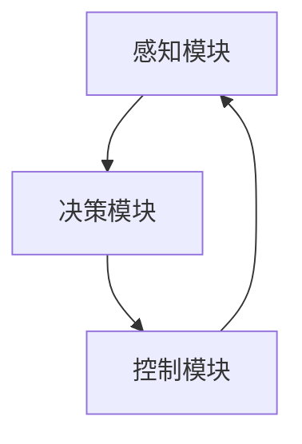

                 

# 自动驾驶系统：感知、决策与控制

## 1. 背景介绍

随着自动驾驶技术的逐步成熟，越来越多的车辆和城市基础设施开始采用自动驾驶系统，以提高道路运输的安全性和效率。自动驾驶系统是一个复杂的集成系统，涉及到感知、决策和控制等多个环节，各环节的技术和应用都有各自的研究热点和难点。本文将从感知、决策与控制三个核心环节，全面探讨自动驾驶系统的实现原理和技术挑战，并展望未来发展方向。

## 2. 核心概念与联系

### 2.1 核心概念概述

自动驾驶系统是一个高度集成和协作的系统，由多个核心模块组成。各模块之间通过信息交互，实现对环境的感知、路径规划和车辆控制。

- 感知模块：通过各种传感器获取车辆周围的环境信息，并进行数据处理和分析，形成车辆周围环境的完整认知。
- 决策模块：根据感知模块提供的环境信息，结合车辆的当前状态和目标，制定最优的决策方案。
- 控制模块：执行决策模块制定的控制策略，实时调整车辆的运动状态，确保车辆沿着最优路径行驶。

各模块之间相互依赖、相互补充，形成一个闭环系统，确保车辆能够安全、稳定、高效地运行。

### 2.2 核心概念原理和架构的 Mermaid 流程图



## 3. 核心算法原理 & 具体操作步骤

### 3.1 算法原理概述

自动驾驶系统中的感知、决策与控制过程，可以抽象为一个循环迭代的过程。系统通过感知模块获取环境信息，经过决策模块分析后，形成控制指令，最终由控制模块执行。该过程不断循环，确保车辆能够及时响应环境变化。

### 3.2 算法步骤详解

**感知模块**：

1. 数据采集：通过摄像头、激光雷达、毫米波雷达等传感器，获取车辆周围环境的图像、点云和雷达波数据。
2. 数据处理：对传感器数据进行预处理，如滤波、去噪、校准等，以确保数据质量。
3. 环境建模：将预处理后的数据，通过计算机视觉、深度学习等方法，形成对车辆周围环境的完整建模。
4. 目标检测与识别：在环境模型中检测和识别出道路边界、行人、车辆、交通标志等关键目标，并进行分类和定位。

**决策模块**：

1. 环境理解：将感知模块提供的环境模型进行解析，理解道路、交通标志、交通流等信息。
2. 路径规划：根据车辆的目标位置和状态，结合环境理解，规划出最优路径。
3. 决策优化：综合考虑安全、效率、舒适等因素，对路径规划结果进行优化，形成最终的驾驶决策。
4. 决策执行：将驾驶决策转化为具体的控制指令，如加速、减速、转向等。

**控制模块**：

1. 运动控制：根据驾驶决策，控制车辆的运动状态，如车速、转向角度等。
2. 传感器融合：实时监控车辆周围环境，结合历史数据和当前状态，预测未来环境变化，避免潜在的危险。
3. 故障检测与处理：检测车辆的传感器、控制模块等关键部件的工作状态，及时处理异常情况。

### 3.3 算法优缺点

自动驾驶系统的感知、决策与控制过程，具有以下优缺点：

**优点**：
1. 高度集成：各模块协同工作，能够快速响应环境变化，提高系统的实时性和鲁棒性。
2. 高效稳定：通过多层次的数据融合和决策优化，减少误差，提高系统的可靠性和安全性。
3. 可扩展性强：模块化设计，便于添加新的传感器和功能，满足不同应用场景的需求。

**缺点**：
1. 算法复杂：感知、决策与控制过程涉及大量算法和技术，实现难度较大。
2. 数据依赖：系统依赖于高质量的传感器数据，数据采集和处理环节容易出现误差。
3. 环境适应性：自动驾驶系统在不同环境和场景下表现差异较大，需要针对具体场景进行优化。

### 3.4 算法应用领域

自动驾驶系统的感知、决策与控制过程，在智能交通、无人驾驶、智慧物流等多个领域都有广泛应用。例如：

1. 智能交通：自动驾驶车辆在城市道路上行驶，能够减少交通拥堵，提高道路通行效率。
2. 无人驾驶：自动驾驶技术在物流配送、货运等领域，能够提高运输效率，降低人力成本。
3. 智慧物流：自动驾驶车辆在仓库和园区内运行，能够实现高效率、低成本的货物管理。
4. 工业自动化：自动驾驶技术在工业自动化生产线中，能够实现高精度、高速度的物料搬运。
5. 军事应用：自动驾驶车辆在军事领域，能够提高战场的侦察、侦查和战斗能力。

## 4. 数学模型和公式 & 详细讲解 & 举例说明

### 4.1 数学模型构建

自动驾驶系统的感知、决策与控制过程，可以通过数学模型进行建模和分析。本文以感知模块为例，介绍一种基于计算机视觉的数学模型。

感知模块的主要目标是获取车辆周围环境的图像数据，并从中检测出关键目标。一种常见的数学模型是卷积神经网络（CNN），用于图像分类和目标检测。

### 4.2 公式推导过程

以单层卷积神经网络为例，其数学模型可以表示为：

$$
\begin{aligned}
&f(x) = Wx + b \\
&W \in \mathbb{R}^{H \times H \times C \times F}, \\
&b \in \mathbb{R}^{H \times H \times F}, \\
&x \in \mathbb{R}^{H \times H \times C}, \\
&f \in \mathbb{R}^{H \times H \times F}
\end{aligned}
$$

其中，$W$为卷积核权重，$b$为偏置项，$x$为输入图像，$f$为输出特征图。

### 4.3 案例分析与讲解

假设输入图像大小为$H \times H$，通道数为$C$，卷积核大小为$F$。则卷积操作可以表示为：

$$
f_{i,j,k} = \sum_{h=0}^{H-1} \sum_{w=0}^{H-1} \sum_{c=0}^{C-1} W_{i,j,k,h,w,c} \times x_{h,w,c} + b_{i,j,k}
$$

其中，$i$和$j$表示输出特征图的位置，$k$表示卷积核的特征图，$h$和$w$表示输入图像的位置，$c$表示输入图像的通道。

## 5. 项目实践：代码实例和详细解释说明

### 5.1 开发环境搭建

在进行自动驾驶系统开发前，需要先搭建好开发环境。以下是使用Python进行OpenCV开发的环境配置流程：

1. 安装Anaconda：从官网下载并安装Anaconda，用于创建独立的Python环境。

2. 创建并激活虚拟环境：
```bash
conda create -n cv-env python=3.8 
conda activate cv-env
```

3. 安装OpenCV：
```bash
conda install opencv opencv-contrib
```

4. 安装numpy、pandas等常用工具包：
```bash
pip install numpy pandas scikit-image matplotlib jupyter notebook ipython
```

完成上述步骤后，即可在`cv-env`环境中开始自动驾驶系统的开发。

### 5.2 源代码详细实现

这里我们以目标检测为例，给出使用OpenCV和DNN模块进行目标检测的Python代码实现。

```python
import cv2
import numpy as np

# 加载预训练模型
net = cv2.dnn.readNetFromCaffe('deploy.prototxt', 'res10_300x300_ssd.caffemodel')

# 加载类别标签
classes = []
with open('classes.txt', 'r') as f:
    classes = f.read().split('\n')

# 加载图像
img = cv2.imread('test.jpg')
height, width = img.shape[:2]

# 缩放图像
blob = cv2.dnn.blobFromImage(img, 1.0, (300, 300), (104.0, 177.0, 123.0))

# 前向传播
net.setInput(blob)
detections = net.forward()

# 解析检测结果
confidences = detections[0, 0, :, 2]
boxes = detections[0, 0, :, 3:7] * np.array([width, height, width, height])
indices = np.where(confidences > 0.5)[0]
confidences = confidences[indices]
boxes = boxes[indices]
labels = [classes[i[1]] for i in detections[0, 0, indices, 1:5].astype(int)]

# 绘制检测结果
for i in range(boxes.shape[0]):
    x, y, w, h = boxes[i]
    cv2.rectangle(img, (int(x), int(y)), (int(x+w), int(y+h)), (0, 255, 0), 2)
    cv2.putText(img, labels[i], (int(x), int(y-10)), cv2.FONT_HERSHEY_PLAIN, 2, (0, 255, 0), 2)

# 显示结果
cv2.imshow('result', img)
cv2.waitKey(0)
cv2.destroyAllWindows()
```

以上就是使用OpenCV和DNN模块进行目标检测的完整代码实现。可以看到，OpenCV提供了方便的图像处理和深度学习模型调用接口，使得目标检测等自动驾驶任务开发变得简单高效。

### 5.3 代码解读与分析

**OpenCV初始化**：
- `cv2.dnn.readNetFromCaffe`：加载预训练的Caffe模型，用于图像分类和目标检测。
- `classes`列表：加载类别标签文件，用于检测结果的分类。

**图像预处理**：
- `cv2.dnn.blobFromImage`：将图像进行预处理，形成可用于模型输入的Blob数据。

**前向传播**：
- `net.setInput(blob)`：设置输入数据。
- `net.forward()`：进行前向传播计算。

**结果解析**：
- `confidences`：检测结果的置信度。
- `boxes`：检测结果的边界框坐标。
- `labels`：检测结果的类别标签。

**结果可视化**：
- 在图像上绘制边界框，并标注类别标签。

**显示结果**：
- 显示带有检测结果的图像。

代码实现了从图像读取、预处理、模型前向传播、结果解析和可视化等全过程，可以帮助开发者快速构建自动驾驶系统的感知模块。

## 6. 实际应用场景

### 6.1 智能交通

自动驾驶系统在智能交通中的应用，可以显著提高道路通行效率，降低交通拥堵。通过自动驾驶车辆对交通信号、道路状况等信息进行实时感知和处理，可以优化车辆行驶路径，避免不必要的等待和拥堵。

例如，通过车载摄像头和激光雷达，自动驾驶车辆可以实时检测交通信号灯和行人，并根据信号灯状态和行人位置，调整车速和转向，确保安全通行。

### 6.2 无人驾驶

无人驾驶技术在物流配送和货运领域具有广泛应用前景。通过自动驾驶车辆，可以24小时不间断地运输货物，提升运输效率，降低人力成本。

在无人驾驶系统中，感知模块通过摄像头、激光雷达等传感器获取周围环境信息，决策模块根据车辆状态和目标，规划最优路径，控制模块实时调整车速和转向，确保车辆顺利到达目的地。

### 6.3 智慧物流

智慧物流领域，自动驾驶车辆可以高效地进行物料搬运和仓储管理。通过自动驾驶技术，货物可以准确、快速地运输到指定位置，提高仓库的管理效率和库存准确率。

在智慧物流系统中，感知模块通过摄像头和激光雷达，实时检测货物和设备位置，决策模块根据目标位置和货物类型，规划最优路径，控制模块实时调整车辆运动状态，确保货物顺利到达指定位置。

### 6.4 未来应用展望

随着自动驾驶技术的不断发展，未来自动驾驶系统将具备更加智能和高效的功能，覆盖更多的应用场景。

1. **城市交通管理**：自动驾驶车辆在城市道路上行驶，可以实时监测交通状况，辅助交通管理部门进行交通调度，优化交通流量，减少拥堵。

2. **物流配送网络**：自动驾驶车辆在城市和郊区之间往返，构建高效的物流配送网络，提升物流效率，降低成本。

3. **智慧城市建设**：自动驾驶技术在智慧城市建设中，可以用于公共服务、紧急救援、环境监测等多个领域，提升城市的智能化水平。

4. **军事应用**：自动驾驶车辆在军事领域，可以用于侦察、侦查、战斗等任务，提高战场效率和战斗能力。

5. **智能家居**：自动驾驶技术在智能家居中，可以用于家庭物品搬运、智能导航等，提升家庭生活的便利性和安全性。

## 7. 工具和资源推荐

### 7.1 学习资源推荐

为了帮助开发者系统掌握自动驾驶系统的技术，这里推荐一些优质的学习资源：

1. 《深度学习实战：计算机视觉》系列博文：由深度学习专家撰写，详细介绍了计算机视觉和目标检测技术。

2. 《自动驾驶技术》课程：斯坦福大学开设的自动驾驶技术课程，涵盖自动驾驶的感知、决策和控制等多个方面。

3. 《自动驾驶系统设计与实现》书籍：详细介绍了自动驾驶系统的设计原理和实现方法，包括感知、决策与控制等环节。

4. Autoware开源项目：自动驾驶开源项目，涵盖自动驾驶系统的各个模块，并提供完整的开发指南。

5. Udacity自动驾驶工程师纳米学位：提供自动驾驶系统的全面学习路径，从基础理论到实战开发，涵盖多个技术栈。

通过对这些资源的学习实践，相信你一定能够快速掌握自动驾驶系统的核心技术，并用于解决实际的自动驾驶问题。

### 7.2 开发工具推荐

高效的开发离不开优秀的工具支持。以下是几款用于自动驾驶系统开发的常用工具：

1. Python：编程语言，提供丰富的科学计算和机器学习库，如NumPy、SciPy、TensorFlow等。

2. OpenCV：计算机视觉库，提供图像处理和目标检测等功能，适合自动驾驶系统中的视觉感知模块。

3. ROS：机器人操作系统，提供丰富的开源软件包，支持自动驾驶系统的传感器数据处理和决策控制。

4. Matplotlib：绘图库，用于可视化自动驾驶系统中的数据和结果。

5. Jupyter Notebook：交互式编程环境，方便开发者进行代码调试和数据分析。

6. TensorFlow：深度学习框架，支持自动驾驶系统中的深度学习模型训练和推理。

合理利用这些工具，可以显著提升自动驾驶系统的开发效率，加快创新迭代的步伐。

### 7.3 相关论文推荐

自动驾驶系统的感知、决策与控制过程，涉及大量前沿研究。以下是几篇奠基性的相关论文，推荐阅读：

1. YOLO: Real-Time Object Detection with Region Proposal Networks：提出YOLO算法，实现实时目标检测。

2. SSD: Single Shot MultiBox Detector：提出SSD算法，实现高效的目标检测。

3. Faster R-CNN: Towards Real-Time Object Detection with Region Proposal Networks：提出Faster R-CNN算法，实现更准确的目标检测。

4. Deep Driving: Learning a Deep Brainsimulator from Raw Video：提出Deep Driving算法，实现自动驾驶车辆对道路标志的识别和理解。

5. End-to-End Training of a Deep Neural Network for Self-Driving Cars：提出端到端的深度学习模型，实现自动驾驶车辆的感知、决策和控制。

6. Towards Fast and Scalable Multi-Target Tracking with Deep Neural Networks：提出深度学习模型，实现高效的车辆跟踪和识别。

这些论文代表了大规模深度学习技术在自动驾驶系统中的应用和发展，为自动驾驶技术的未来发展提供了宝贵的参考。

## 8. 总结：未来发展趋势与挑战

### 8.1 总结

本文对自动驾驶系统的感知、决策与控制过程进行了全面系统的介绍。从感知模块的图像处理和目标检测，到决策模块的环境理解和路径规划，再到控制模块的运动控制和传感器融合，详细讲解了自动驾驶系统的实现原理和技术挑战。

通过本文的系统梳理，可以看到，自动驾驶系统是一个高度集成和协作的系统，各模块之间通过信息交互，实现对环境的感知、路径规划和车辆控制。开发者需要在感知、决策与控制等多个环节进行全面优化，才能确保车辆能够安全、稳定、高效地运行。

### 8.2 未来发展趋势

展望未来，自动驾驶技术将呈现以下几个发展趋势：

1. 感知模块的提升：随着传感器技术的不断进步，感知模块的分辨率和实时性将显著提升。深度学习技术也将不断优化，提高目标检测和识别的精度和速度。

2. 决策模块的优化：决策模块将更加智能化，能够实时处理复杂环境信息，进行动态路径规划和决策优化。

3. 控制模块的改进：控制模块将更加高效，能够实时调整车辆的运动状态，确保车辆在各种环境下安全稳定行驶。

4. 多模态融合：将视觉、激光雷达、毫米波雷达等多种传感器数据进行融合，提高系统的感知和决策能力。

5. 环境理解：通过深度学习技术，提高车辆对环境的理解和预测能力，提高系统的鲁棒性和安全性。

6. 高精度地图：构建高精度地图和实时动态更新技术，提高车辆的定位和导航能力。

以上趋势将进一步提升自动驾驶系统的性能和安全性，推动自动驾驶技术的普及和应用。

### 8.3 面临的挑战

尽管自动驾驶技术已经取得了重要进展，但在迈向更加智能化、普适化应用的过程中，仍面临诸多挑战：

1. 感知模块的局限性：传感器的精度、分辨率和实时性仍需提升，以应对复杂多变的道路环境。

2. 决策模块的复杂性：决策算法需要考虑多种因素，如安全、效率、舒适等，决策难度较高。

3. 控制模块的可靠性：控制模块需要具备高可靠性和鲁棒性，避免系统崩溃或失控。

4. 数据隐私和安全：自动驾驶系统涉及大量个人数据，需要严格的隐私保护和安全措施。

5. 法律和伦理问题：自动驾驶技术的应用需要法律和伦理规范的引导和约束，确保系统行为的合理性和安全性。

6. 基础设施配套：自动驾驶系统需要完善的基础设施支持，如高精度地图、路标和交通信号等。

7. 用户体验：自动驾驶系统需要提升用户体验，让用户能够更自然、舒适地使用系统。

这些挑战需要通过技术创新、法规制定和社会共识等手段共同应对，推动自动驾驶技术的成熟和普及。

### 8.4 研究展望

面对自动驾驶技术所面临的挑战，未来的研究需要在以下几个方面寻求新的突破：

1. 感知模块的改进：探索高精度、高实时性的传感器和数据处理技术，提高系统的感知能力。

2. 决策模块的优化：开发更加智能化的决策算法，提高系统对复杂环境的适应能力。

3. 控制模块的提升：优化控制策略，提高系统的可靠性和安全性。

4. 多模态融合技术：探索多种传感器数据的深度融合方法，提高系统的感知和决策能力。

5. 环境理解技术：研究更加智能化的环境理解算法，提高系统对环境的理解和预测能力。

6. 高精度地图技术：构建高精度地图和实时动态更新技术，提高车辆的定位和导航能力。

7. 数据隐私和安全：研究隐私保护和安全技术，确保数据安全和用户隐私。

8. 法律和伦理规范：制定自动驾驶技术的法律和伦理规范，确保系统行为的合理性和安全性。

这些研究方向将引领自动驾驶技术的发展方向，推动自动驾驶技术的落地应用和普及。

## 9. 附录：常见问题与解答

**Q1：自动驾驶系统中的感知模块如何实现？**

A: 自动驾驶系统中的感知模块主要通过摄像头、激光雷达、毫米波雷达等传感器获取车辆周围的环境信息，并进行数据处理和分析。常用的感知技术包括计算机视觉、深度学习等，可以实现对道路边界、行人、车辆、交通标志等关键目标的检测和识别。

**Q2：自动驾驶系统中的决策模块如何实现？**

A: 自动驾驶系统中的决策模块主要通过环境理解和路径规划等技术，实现对车辆运动路径的优化。常用的决策算法包括A*、RRT、Q-learning等，可以根据车辆状态和目标，制定最优的驾驶决策。

**Q3：自动驾驶系统中的控制模块如何实现？**

A: 自动驾驶系统中的控制模块主要通过运动控制、传感器融合和故障检测等技术，实现对车辆运动状态的调整。常用的控制算法包括PID、LQR等，可以根据驾驶决策，实时调整车辆的速度和转向。

**Q4：自动驾驶系统中的高精度地图如何构建？**

A: 自动驾驶系统中的高精度地图主要通过激光雷达、GPS等传感器，获取道路、建筑、交通信号灯等关键信息，并进行数据处理和分析。常用的高精度地图构建技术包括SLAM、RTK-GPS等，可以实现高精度、实时的地图构建和更新。

**Q5：自动驾驶系统中的数据隐私和安全如何保障？**

A: 自动驾驶系统中的数据隐私和安全主要通过数据加密、访问控制和隐私保护等技术，确保数据的隐私和安全。常用的数据隐私和安全技术包括SSL/TLS、OAuth、差分隐私等，可以保障数据传输和存储的安全性。

---

作者：禅与计算机程序设计艺术 / Zen and the Art of Computer Programming

