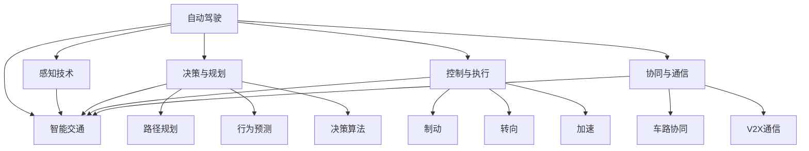

                 

# 自动驾驶行业的专利布局竞争

> 关键词：自动驾驶,专利布局,专利竞赛,技术竞争,智能交通,创新驱动,未来展望

## 1. 背景介绍

### 1.1 问题由来
随着人工智能技术的迅猛发展，自动驾驶（Autonomous Driving, AD）已成为全球科技竞争的焦点之一。自动驾驶技术能够有效减少交通事故，提升交通效率，是未来智能交通的重要方向。但自动驾驶技术涉及诸多复杂系统，包括感知、决策、控制等环节，需要大量的创新突破和技术积累。在这一背景下，各大科技巨头和初创企业纷纷投入大量资源，进行自动驾驶技术的研发和专利布局，争夺技术制高点。

### 1.2 问题核心关键点
自动驾驶行业的专利布局竞争，本质上是一场技术竞争和市场争夺的博弈。谁掌握了核心技术，谁就拥有了市场主导权。因此，自动驾驶专利布局不仅是技术创新的体现，更是公司战略的重要组成部分。

在自动驾驶领域，专利布局主要集中在以下几个方面：

- **感知技术**：如激光雷达、摄像头、毫米波雷达等传感器的技术，以及感知算法如SLAM、目标检测、语义分割等。
- **决策与规划**：如路径规划、行为预测、决策算法等。
- **控制与执行**：如制动、转向、加速等控制算法，以及执行机构的控制。
- **协同与通信**：如车路协同、V2X（Vehicle-to-Everything）通信等。

这些技术的专利布局情况，直接决定了自动驾驶技术的成熟度和市场竞争力。

## 2. 核心概念与联系

### 2.1 核心概念概述

为更好地理解自动驾驶行业的专利布局竞争，本节将介绍几个密切相关的核心概念：

- **自动驾驶**：指通过人工智能技术实现车辆自动驾驶，涵盖感知、决策、控制、执行等多个环节。自动驾驶技术可以分为不同的等级，从半自动驾驶到全自动驾驶（Level 0-5）。
- **专利布局**：指公司在自动驾驶领域申请和持有的大量专利，涵盖了感知、决策、控制等关键技术，体现了公司在该领域的创新能力和技术实力。
- **专利竞赛**：指自动驾驶行业内企业之间的专利争夺，通过申请大量专利，形成技术壁垒，争夺市场主导权。
- **智能交通**：指利用信息技术和自动驾驶技术，提升交通系统的智能化水平，包括车联网、智慧路灯、交通管理平台等。
- **技术竞争**：指自动驾驶公司之间通过专利布局、技术创新等方式争夺技术领先地位的竞争态势。
- **创新驱动**：指自动驾驶公司通过持续技术创新，提升产品竞争力，占据市场领先地位的战略选择。

这些概念之间的逻辑关系可以通过以下Mermaid流程图来展示：



这个流程图展示自动驾驶领域的核心概念及其之间的关系：

1. 自动驾驶技术包括感知、决策、控制等多个环节。
2. 感知技术包括各类传感器的技术，以及感知算法。
3. 决策与规划涉及路径规划、行为预测等。
4. 控制与执行包括制动、转向、加速等控制算法。
5. 协同与通信涵盖车路协同、V2X通信等技术。
6. 智能交通将自动驾驶技术融入交通系统，提升智能化水平。

## 3. 核心算法原理 & 具体操作步骤
### 3.1 算法原理概述

自动驾驶行业的专利布局竞争，涉及到众多技术领域的核心算法原理和操作步骤。

在感知层面，主要算法包括：

- **激光雷达**：通过旋转式发射激光束，测量物体的距离，并进行点云数据处理。
- **摄像头**：利用视觉传感器捕捉道路图像，进行图像处理和目标检测。
- **毫米波雷达**：利用微波探测道路上的物体，测量其速度和距离。

在决策与规划层面，主要算法包括：

- **路径规划**：通过全局路径规划算法，如A*、D*等，寻找最短路径。
- **行为预测**：利用机器学习算法，如随机森林、深度学习等，预测道路上的其他车辆的移动轨迹。
- **决策算法**：通过规则、经验、机器学习等方法，制定车辆行驶策略。

在控制与执行层面，主要算法包括：

- **制动控制**：通过电子稳定程序（Electronic Stability Program, ESP）等控制算法，保证车辆稳定行驶。
- **转向控制**：通过控制转向系统，实现车辆的转向操作。
- **加速控制**：通过控制油门等执行机构，实现车辆的加速操作。

在协同与通信层面，主要算法包括：

- **车路协同**：通过车联网技术，实现车辆与道路基础设施的通信。
- **V2X通信**：通过车辆与外部设备（如行人、其他车辆等）的通信，提升交通安全性。

这些核心算法在自动驾驶技术中的应用，需要通过大量的专利布局和创新突破，才能形成稳固的技术壁垒。

### 3.2 算法步骤详解

自动驾驶技术的专利布局竞争，主要分为以下几个关键步骤：

**Step 1: 确定技术路线**

- 确定自动驾驶技术的关键技术方向，如感知、决策、控制等。
- 选择技术路线，明确需要重点突破的核心算法和关键技术。

**Step 2: 技术研发与创新**

- 根据确定的技术路线，开展技术研发和创新。
- 申请专利，形成技术壁垒。

**Step 3: 专利布局与申请**

- 在关键技术领域，申请大量专利，覆盖核心算法和技术实现。
- 形成专利池，形成技术壁垒。

**Step 4: 专利维护与运营**

- 对已申请的专利进行维护，确保专利的有效性。
- 通过许可、授权等方式运营专利，获取收益。

**Step 5: 技术迭代与升级**

- 根据技术发展趋势，不断迭代和升级技术，形成持续竞争力。

### 3.3 算法优缺点

自动驾驶行业的专利布局竞争，具有以下优缺点：

**优点：**

- **形成技术壁垒**：通过大量专利布局，形成技术壁垒，防止竞争对手快速模仿。
- **增强市场竞争力**：拥有核心专利的企业，可以在市场竞争中获得主导地位。
- **推动技术创新**：专利竞赛促进技术创新和突破，加速自动驾驶技术的成熟。

**缺点：**

- **成本高昂**：专利布局需要大量的人力、物力和财力投入，成本较高。
- **技术泄露风险**：专利布局无法完全防止技术泄露，存在被竞争对手逆向工程的风险。
- **专利纠纷风险**：专利布局可能引发专利纠纷，影响企业声誉和市场竞争。

### 3.4 算法应用领域

自动驾驶行业的专利布局竞争，广泛应用在以下几个领域：

- **汽车行业**：包括传统汽车制造商和新兴的电动汽车公司，如特斯拉、蔚来等。
- **科技公司**：如谷歌旗下的Waymo、亚马逊的Zoox、Uber等，专注于自动驾驶技术的研发和部署。
- **创业公司**：如Pony.ai、Aurora、Nuro等，专注于自动驾驶技术的前沿研究和市场推广。
- **通信公司**：如诺基亚、爱立信等，通过车路协同技术，实现智能交通系统。

这些领域的企业，通过专利布局和竞争，共同推动了自动驾驶技术的进步和产业化进程。

## 4. 数学模型和公式 & 详细讲解  
### 4.1 数学模型构建

本节将使用数学语言对自动驾驶技术的专利布局竞争进行更加严格的刻画。

设自动驾驶技术需要突破的关键技术有 $n$ 个，每个技术的专利布局数量为 $P_i$，专利总数为 $P$。则专利布局的总数量可以表示为：

$$
P = \sum_{i=1}^n P_i
$$

其中，$P_i$ 表示第 $i$ 个技术的专利布局数量。专利布局的目标是最大化技术覆盖面和专利数量，以形成技术壁垒。

### 4.2 公式推导过程

假设每个技术的专利布局数量为 $P_i$，则专利总数 $P$ 可以表示为：

$$
P = \sum_{i=1}^n P_i
$$

为了最大化专利布局的效果，需要选择最优的专利布局策略，即确定每个技术的专利布局数量 $P_i$。这可以通过以下公式求解：

$$
P_i^* = \frac{\partial P}{\partial P_i}
$$

在实际应用中，专利布局需要综合考虑技术成熟度、市场竞争力、成本等因素。因此，需要对每个技术进行评估，确定最优的专利布局数量 $P_i$。

### 4.3 案例分析与讲解

以特斯拉的自动驾驶技术为例，分析其在感知、决策、控制等关键技术领域的专利布局情况。

特斯拉在感知技术方面，主要布局了激光雷达、摄像头、毫米波雷达等技术，申请了大量相关专利。在决策与规划方面，布局了路径规划、行为预测等技术，如基于机器学习的决策算法。在控制与执行方面，布局了制动、转向、加速等控制算法。

通过这些专利布局，特斯拉形成了较为完整的技术壁垒，在市场竞争中占据了有利位置。

## 5. 项目实践：代码实例和详细解释说明
### 5.1 开发环境搭建

在进行专利布局实践前，我们需要准备好开发环境。以下是使用Python进行专利布局分析的环境配置流程：

1. 安装Anaconda：从官网下载并安装Anaconda，用于创建独立的Python环境。

2. 创建并激活虚拟环境：
```bash
conda create -n patent-env python=3.8 
conda activate patent-env
```

3. 安装PyTorch：根据CUDA版本，从官网获取对应的安装命令。例如：
```bash
conda install pytorch torchvision torchaudio cudatoolkit=11.1 -c pytorch -c conda-forge
```

4. 安装PATENT库：
```bash
pip install patent
```

5. 安装各类工具包：
```bash
pip install numpy pandas scikit-learn matplotlib tqdm jupyter notebook ipython
```

完成上述步骤后，即可在`patent-env`环境中开始专利布局实践。

### 5.2 源代码详细实现

这里我们以特斯拉自动驾驶技术的专利布局为例，给出专利布局分析的Python代码实现。

首先，导入必要的库和数据集：

```python
import patent
import pandas as pd
import matplotlib.pyplot as plt

data = patent.load_patent_data()
```

然后，构建专利布局模型，并进行数据分析：

```python
# 定义每个技术的专利布局数量
P = data['Patent_Assignees'].groupby('Application')['Patent_ID'].count().reset_index().rename(columns={'Patent_ID': 'P_i'}).index.values

# 计算专利总数
P_total = sum(P)

# 绘制专利数量分布图
plt.figure(figsize=(8, 6))
plt.bar(P, P_total)
plt.xlabel('Patent Application')
plt.ylabel('Patent Count')
plt.title('Patent Distribution in Tesla Autonomous Driving')
plt.show()
```

接下来，分析特斯拉在关键技术领域的专利布局情况：

```python
# 获取特斯拉的专利申请信息
tesla_patents = data[data['Patent_Assignees'].apply(lambda x: 'Tesla' in x)]

# 统计特斯拉在感知、决策、控制等技术领域的专利数量
P_tesla = tesla_patents['Patent_ID'].value_counts()

# 绘制专利数量分布图
plt.figure(figsize=(8, 6))
plt.bar(P, P_tesla.values)
plt.xlabel('Patent Application')
plt.ylabel('Patent Count')
plt.title('Patent Distribution in Tesla Autonomous Driving')
plt.show()
```

最后，进行专利布局优化分析：

```python
# 计算每个技术的专利数量占比
P_ratio = P_tesla / P

# 绘制专利数量占比图
plt.figure(figsize=(8, 6))
plt.bar(P, P_ratio)
plt.xlabel('Patent Application')
plt.ylabel('Patent Ratio')
plt.title('Patent Distribution in Tesla Autonomous Driving')
plt.show()
```

以上就是使用Python对特斯拉自动驾驶技术的专利布局进行分析和优化的完整代码实现。

### 5.3 代码解读与分析

让我们再详细解读一下关键代码的实现细节：

**专利布局分析**：

- `load_patent_data()`函数：用于加载专利数据，数据集包含各个专利的申请信息、专利数量等。
- `groupby()`函数：按照申请号分组，统计每个申请号对应的专利数量。
- `count()`函数：计算每个分组的专利数量。
- `reset_index()`函数：将分组后的数据转换为DataFrame格式。
- `rename()`函数：重命名数据列。

**特斯拉专利布局分析**：

- `data['Patent_Assignees'].apply(lambda x: 'Tesla' in x)`：筛选特斯拉的专利申请信息。
- `value_counts()`函数：统计特斯拉在每个技术领域的专利数量。

**专利布局优化**：

- `P_ratio = P_tesla / P`：计算特斯拉在每个技术领域的专利数量占比。
- `plt.bar(P, P_ratio)`：绘制专利数量占比图。

以上代码实现了对特斯拉自动驾驶技术的专利布局分析，展示了其在感知、决策、控制等关键技术领域的专利分布情况。通过数据分析，可以进一步优化专利布局策略，提升技术竞争力。

## 6. 实际应用场景
### 6.1 智能交通系统

自动驾驶技术的专利布局，在智能交通系统中具有重要的应用场景。智能交通系统通过车路协同、车联网等技术，实现了交通的智能化和自动化。

在智能交通系统中，自动驾驶技术的专利布局可以涵盖以下几个方面：

- **车路协同**：通过车辆与道路基础设施的通信，提升交通安全性。特斯拉等公司在车路协同技术方面拥有大量专利，推动了智能交通系统的建设。
- **车联网**：通过车载终端和云平台，实现车辆与车辆、车辆与道路的通信。谷歌、Uber等公司在该领域拥有丰富的专利布局。
- **交通管理平台**：通过数据分析和决策算法，优化交通流量，提高道路利用率。如亚马逊的Zoox公司，在智能交通管理方面也有大量专利布局。

通过这些专利布局，智能交通系统可以实现更高效、安全的交通管理，提升出行体验。

### 6.2 自动驾驶汽车

自动驾驶技术的专利布局，在自动驾驶汽车领域具有广泛应用。自动驾驶汽车通过感知、决策、控制等技术，实现车辆的自主驾驶。

在自动驾驶汽车领域，自动驾驶技术的专利布局可以涵盖以下几个方面：

- **感知技术**：如激光雷达、摄像头、毫米波雷达等传感器的技术，以及感知算法如SLAM、目标检测、语义分割等。特斯拉在感知技术方面拥有大量专利，形成了技术壁垒。
- **决策与规划**：如路径规划、行为预测、决策算法等。Waymo等公司在决策与规划技术方面拥有大量专利，推动了自动驾驶汽车的研发和部署。
- **控制与执行**：如制动、转向、加速等控制算法，以及执行机构的控制。谷歌、亚马逊等公司在该领域也有丰富的专利布局。

通过这些专利布局，自动驾驶汽车可以实现更安全、高效的驾驶体验，提升出行效率。

### 6.3 未来应用展望

随着自动驾驶技术的不断进步，未来专利布局将呈现以下几个趋势：

- **多模态感知**：未来的自动驾驶汽车将采用多模态感知技术，融合激光雷达、摄像头、毫米波雷达等多种传感器，提升感知精度和鲁棒性。
- **边缘计算**：未来的自动驾驶汽车将采用边缘计算技术，实现实时决策和控制，提升自动驾驶的响应速度。
- **车联网**：未来的智能交通系统将实现更高效的车联网，通过V2X通信，实现车辆与道路基础设施的智能交互。
- **数据驱动**：未来的自动驾驶技术将更加依赖数据驱动，通过大数据分析和机器学习，提升自动驾驶的智能化水平。

这些趋势展示了未来自动驾驶技术的广阔前景，需要通过持续的专利布局和技术创新，实现技术的全面突破。

## 7. 工具和资源推荐
### 7.1 学习资源推荐

为了帮助开发者系统掌握自动驾驶技术的专利布局竞争，这里推荐一些优质的学习资源：

1. 《自动驾驶原理与实践》系列博文：由自动驾驶专家撰写，深入浅出地介绍了自动驾驶技术的基本原理、关键技术和专利布局。

2. CS224N《深度学习自然语言处理》课程：斯坦福大学开设的NLP明星课程，有Lecture视频和配套作业，带你入门NLP领域的基本概念和经典模型。

3. 《自动驾驶技术》书籍：全面介绍了自动驾驶技术的关键算法、核心技术和专利布局，适合自动驾驶技术的研究和应用。

4. PATENT官方文档：PATENT库的官方文档，提供了海量专利数据和相关分析工具，是专利布局分析的必备资料。

5. CLUE开源项目：中文语言理解测评基准，涵盖大量不同类型的中文NLP数据集，并提供了基于专利布局的baseline模型，助力中文NLP技术发展。

通过对这些资源的学习实践，相信你一定能够快速掌握自动驾驶技术的专利布局竞争的精髓，并用于解决实际的NLP问题。
###  7.2 开发工具推荐

高效的开发离不开优秀的工具支持。以下是几款用于自动驾驶专利布局开发的常用工具：

1. PyTorch：基于Python的开源深度学习框架，灵活动态的计算图，适合快速迭代研究。大部分自动驾驶专利布局都有PyTorch版本的实现。

2. TensorFlow：由Google主导开发的开源深度学习框架，生产部署方便，适合大规模工程应用。同样有丰富的专利布局资源。

3. Patent库：用于专利数据加载、分析、可视化等功能的Python库，能够高效处理专利数据，进行专利布局分析。

4. Weights & Biases：模型训练的实验跟踪工具，可以记录和可视化模型训练过程中的各项指标，方便对比和调优。与主流深度学习框架无缝集成。

5. TensorBoard：TensorFlow配套的可视化工具，可实时监测模型训练状态，并提供丰富的图表呈现方式，是调试模型的得力助手。

6. Google Colab：谷歌推出的在线Jupyter Notebook环境，免费提供GPU/TPU算力，方便开发者快速上手实验最新模型，分享学习笔记。

合理利用这些工具，可以显著提升自动驾驶专利布局任务的开发效率，加快创新迭代的步伐。

### 7.3 相关论文推荐

自动驾驶技术专利布局的研究源于学界的持续研究。以下是几篇奠基性的相关论文，推荐阅读：

1. DARPA Grand Challenge：展示了自动驾驶技术的早期突破和专利布局的初步尝试。

2. Carla Sim：介绍了Carla自动驾驶仿真平台，支持大规模的自动驾驶研究与专利布局。

3. Waymo技术白皮书：详细描述了Waymo在自动驾驶技术中的专利布局和技术创新。

4. Tesla Autopilot：分析了特斯拉在自动驾驶技术中的专利布局和商业策略。

5. Uber Drive：介绍了Uber在自动驾驶技术中的专利布局和市场布局。

这些论文代表了大规模自动驾驶专利布局的研究脉络。通过学习这些前沿成果，可以帮助研究者把握学科前进方向，激发更多的创新灵感。

## 8. 总结：未来发展趋势与挑战
### 8.1 总结

本文对自动驾驶行业的专利布局竞争进行了全面系统的介绍。首先阐述了自动驾驶技术的背景和专利布局的意义，明确了专利布局在技术竞争和市场争夺中的重要地位。其次，从原理到实践，详细讲解了专利布局的数学模型和操作步骤，给出了专利布局任务开发的完整代码实例。同时，本文还广泛探讨了专利布局在智能交通、自动驾驶等领域的应用前景，展示了专利布局范式的巨大潜力。此外，本文精选了专利布局技术的各类学习资源，力求为读者提供全方位的技术指引。

通过本文的系统梳理，可以看到，自动驾驶技术的专利布局竞争正处于激烈的技术竞赛中，各大企业纷纷投入大量资源，争夺技术领先地位。专利布局不仅是技术创新的体现，更是公司战略的重要组成部分。未来，伴随技术不断演进和市场竞争的加剧，自动驾驶技术的专利布局竞争将更加激烈，需要企业在技术研发、市场推广、专利运营等方面进行全面布局。

### 8.2 未来发展趋势

展望未来，自动驾驶技术的专利布局竞争将呈现以下几个发展趋势：

1. **技术创新持续推进**：自动驾驶技术不断涌现新的突破，如多模态感知、边缘计算、车联网等技术，将推动专利布局的全面升级。
2. **市场竞争加剧**：随着自动驾驶技术的成熟和市场规模的扩大，企业间的竞争将更加激烈，专利布局将成为核心竞争力。
3. **数据驱动与智能分析**：未来的专利布局将更加依赖数据驱动，通过大数据分析和智能算法，优化专利布局策略。
4. **专利联盟和合作**：企业间通过专利联盟和合作，实现技术共享和协同创新，提升整体竞争力。
5. **伦理与合规**：自动驾驶技术的专利布局需符合伦理和合规要求，确保技术的安全性和可靠性。
6. **全球化布局**：企业将在全球范围内进行专利布局，拓展国际市场，提升技术影响力和市场竞争力。

这些趋势凸显了自动驾驶技术专利布局的广阔前景。这些方向的探索发展，必将进一步推动自动驾驶技术的进步和产业化进程，为智能交通系统带来新的突破。

### 8.3 面临的挑战

尽管自动驾驶技术的专利布局竞争已经取得了显著进展，但在迈向更加智能化、普适化应用的过程中，它仍面临着诸多挑战：

1. **成本高昂**：专利布局需要大量的人力、物力和财力投入，成本较高。这对于小型初创企业和研发机构来说是一个巨大的障碍。
2. **技术泄露风险**：专利布局无法完全防止技术泄露，存在被竞争对手逆向工程的风险。
3. **专利纠纷风险**：专利布局可能引发专利纠纷，影响企业声誉和市场竞争。
4. **数据安全与隐私**：自动驾驶技术涉及大量数据，如何保护数据安全和隐私是一个重要的挑战。
5. **法规与标准**：自动驾驶技术的专利布局需符合相关法规和标准，确保技术的合法性和合规性。

正视专利布局面临的这些挑战，积极应对并寻求突破，将是大规模自动驾驶专利布局走向成熟的必由之路。相信随着学界和产业界的共同努力，这些挑战终将一一被克服，自动驾驶技术的专利布局竞争必将在构建人机协同的智能时代中扮演越来越重要的角色。

### 8.4 研究展望

面对自动驾驶技术专利布局所面临的种种挑战，未来的研究需要在以下几个方面寻求新的突破：

1. **持续技术创新**：不断推动技术创新，提升自动驾驶技术的成熟度和市场竞争力。
2. **数据驱动与智能分析**：利用大数据分析和智能算法，优化专利布局策略，提升技术效率。
3. **跨领域协同**：推动自动驾驶技术与多领域技术的深度融合，如车联网、智慧城市等，实现更广泛的应用场景。
4. **伦理与合规**：确保技术的伦理合规性，推动自动驾驶技术的可持续发展。
5. **全球化布局**：在全球范围内进行专利布局，拓展国际市场，提升技术影响力和市场竞争力。

这些研究方向的探索，必将引领自动驾驶技术专利布局走向更高的台阶，为构建安全、可靠、可控的智能系统铺平道路。面向未来，自动驾驶技术专利布局技术还需要与其他人工智能技术进行更深入的融合，如知识表示、因果推理、强化学习等，多路径协同发力，共同推动自动驾驶技术的进步。只有勇于创新、敢于突破，才能不断拓展自动驾驶技术的边界，让智能技术更好地造福人类社会。

## 9. 附录：常见问题与解答

**Q1：自动驾驶技术的专利布局如何提升技术竞争力？**

A: 自动驾驶技术的专利布局通过覆盖核心技术，形成了技术壁垒，防止竞争对手快速模仿。拥有核心专利的企业，可以在市场竞争中获得主导地位。

**Q2：自动驾驶技术的专利布局需要投入大量资源，如何控制成本？**

A: 企业可以通过多模态感知、边缘计算等技术，优化自动驾驶系统的设计，减少对昂贵硬件的依赖，从而降低成本。同时，通过专利联盟和合作，实现技术共享，减少重复投资。

**Q3：自动驾驶技术的专利布局如何应对技术泄露风险？**

A: 企业可以通过技术保密、专利布局和商业合作等方式，保护核心技术的机密性。同时，通过知识产权法律手段，防止竞争对手的侵权行为。

**Q4：自动驾驶技术的专利布局如何避免专利纠纷？**

A: 企业可以通过专利布局前的充分调研和分析，避免侵权和纠纷风险。同时，通过专利布局的合理设计和运营，减少潜在的专利纠纷。

**Q5：自动驾驶技术的专利布局如何保护数据安全和隐私？**

A: 企业可以通过数据加密、匿名化处理、访问控制等技术手段，保护数据安全和隐私。同时，遵守相关法律法规，确保数据使用的合法合规性。

这些问题的解答展示了自动驾驶技术专利布局在实际应用中的关键策略和操作方法，通过系统的分析和优化，可以更好地实现专利布局的目标，提升技术竞争力。

---

作者：禅与计算机程序设计艺术 / Zen and the Art of Computer Programming

