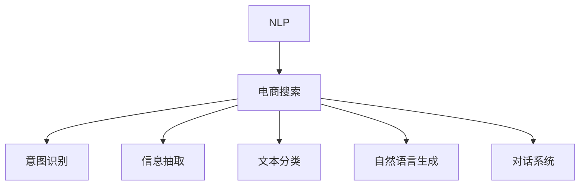

                 

# 自然语言处理在电商 搜索中的应用：技术发展与未来趋势

## 1. 背景介绍

### 1.1 问题由来
随着电子商务的迅猛发展，用户对电商平台的搜索体验要求越来越高。自然语言处理（Natural Language Processing, NLP）技术，作为提升搜索体验的关键手段，近年来得到了广泛关注和应用。NLP技术可以帮助电商平台理解用户输入的查询意图，快速准确地匹配和推荐商品，提升用户的购物体验。

在实际应用中，自然语言处理涉及的领域非常广泛，包括文本分类、命名实体识别、关系抽取、情感分析、意图识别、对话系统等。这些技术应用在电商搜索中，能够显著提升搜索的准确性和效率，帮助用户快速找到满意的商品。

### 1.2 问题核心关键点
自然语言处理在电商搜索中的应用，主要集中在以下几个方面：
- 用户查询意图理解：通过自然语言处理技术，自动识别和理解用户输入查询的意图，提高搜索结果的相关性和准确性。
- 商品信息抽取：从商品描述、评论等文本中，提取商品的关键信息，如价格、分类、属性等，便于进行匹配和排序。
- 自然语言生成：利用自然语言处理技术，自动生成商品描述、推荐文案等，提升用户浏览体验。
- 对话系统：通过自然语言处理技术，构建智能客服和聊天机器人，提升用户交流体验，提供更高效的服务支持。

这些关键技术的应用，使得电商搜索不再仅仅依赖传统的关键词匹配，而是通过理解自然语言进行更智能的搜索和推荐，极大地提升了用户满意度和平台运营效率。

### 1.3 问题研究意义
研究自然语言处理在电商搜索中的应用，对于提升电商平台的搜索体验、降低运营成本、增强用户体验具有重要意义：

1. 提高搜索准确性。自然语言处理能够深入理解用户查询意图，匹配更精准的商品信息，减少误操作，提高用户满意度。
2. 优化商品推荐。通过商品信息的自然语言抽取和生成，能够更准确地推荐相关商品，提高销售额和用户留存率。
3. 提升用户体验。自然语言生成和对话系统，能够提供更自然、人性化的交流体验，增强用户粘性。
4. 降低运营成本。自动化的自然语言处理和生成技术，可以替代大量人工工作，降低运营成本，提高效率。
5. 促进技术创新。自然语言处理与深度学习、强化学习等技术的结合，催生了新的研究方向，如基于上下文的生成、多模态信息融合等。

因此，深入研究自然语言处理在电商搜索中的应用，对于电商平台的智能化升级和长期发展具有重要价值。

## 2. 核心概念与联系

### 2.1 核心概念概述

为了更好地理解自然语言处理在电商搜索中的应用，本节将介绍几个密切相关的核心概念：

- 自然语言处理（NLP）：涉及计算机科学、人工智能和语言学的交叉学科，旨在使计算机能够理解、解释和生成人类语言。
- 电商搜索：电商平台上用户通过输入关键词或自然语言查询，获取相关商品信息的过程。
- 意图识别（Intent Recognition）：从用户输入的自然语言中，识别出用户的具体查询意图，如搜索、询问、投诉等。
- 信息抽取（Information Extraction）：从文本中提取结构化的信息，如商品价格、类别、评价等。
- 文本分类（Text Classification）：将文本分为预定义的类别，如商品分类、评论情感等。
- 自然语言生成（NLG）：使用算法和模型自动生成自然语言文本，如商品描述、推荐文案等。
- 对话系统（Chatbot）：利用自然语言处理技术，构建与用户进行自然语言交流的智能机器人，提供客服、推荐等服务。

这些概念之间的逻辑关系可以通过以下Mermaid流程图来展示：



这个流程图展示了自然语言处理在电商搜索中的关键应用场景，包括意图识别、信息抽取、文本分类、自然语言生成和对话系统等。

## 3. 核心算法原理 & 具体操作步骤
### 3.1 算法原理概述

自然语言处理在电商搜索中的应用，本质上是一个文本处理和信息匹配的过程。其核心思想是：通过自然语言处理技术，自动识别和理解用户输入的查询意图，从商品描述中抽取相关信息，并根据用户意图和商品信息，进行匹配和推荐。

具体来说，电商搜索涉及以下几个关键步骤：

1. 用户输入查询。用户通过输入自然语言或关键词，表达搜索意图。
2. 意图识别。利用自然语言处理技术，自动识别和理解用户输入查询的意图。
3. 商品信息抽取。从商品描述、评论等文本中，抽取商品的关键信息，如价格、分类、属性等。
4. 信息匹配。根据用户查询意图和商品信息，进行匹配和排序，生成搜索结果。
5. 自然语言生成。利用自然语言处理技术，自动生成商品描述、推荐文案等。
6. 对话系统。通过自然语言处理技术，构建智能客服和聊天机器人，提供用户交流支持。

### 3.2 算法步骤详解

自然语言处理在电商搜索中的算法步骤如下：

**Step 1: 收集和预处理数据**
- 收集电商平台的商品描述、评论、用户行为数据等文本数据。
- 对文本数据进行清洗、分词、去除停用词等预处理操作，以便后续处理。

**Step 2: 意图识别**
- 利用意图识别模型，对用户输入的自然语言查询进行分析和理解，识别出用户的意图。
- 常用的意图识别方法包括基于规则的方法、基于统计的方法和基于深度学习的方法。

**Step 3: 商品信息抽取**
- 从商品描述、评论等文本中，使用实体识别、关系抽取等技术，提取商品的关键信息，如价格、分类、属性等。
- 常用的信息抽取方法包括基于规则的方法、基于统计的方法和基于深度学习的方法。

**Step 4: 信息匹配**
- 根据用户查询意图和商品信息，使用匹配算法进行相关性排序，生成搜索结果。
- 常用的匹配算法包括基于关键词的方法、基于向量空间模型的方法和基于深度学习的方法。

**Step 5: 自然语言生成**
- 利用自然语言生成技术，自动生成商品描述、推荐文案等。
- 常用的自然语言生成方法包括基于模板的方法、基于统计的方法和基于深度学习的方法。

**Step 6: 对话系统**
- 利用对话系统技术，构建与用户进行自然语言交流的智能机器人，提供客服、推荐等服务。
- 常用的对话系统方法包括基于规则的方法、基于统计的方法和基于深度学习的方法。

### 3.3 算法优缺点

自然语言处理在电商搜索中的应用，具有以下优点：

- 提高搜索准确性。自然语言处理能够深入理解用户查询意图，匹配更精准的商品信息，提高用户满意度。
- 优化商品推荐。通过商品信息的自然语言抽取和生成，能够更准确地推荐相关商品，提高销售额和用户留存率。
- 提升用户体验。自然语言生成和对话系统，能够提供更自然、人性化的交流体验，增强用户粘性。
- 降低运营成本。自动化的自然语言处理和生成技术，可以替代大量人工工作，降低运营成本，提高效率。

同时，该方法也存在一定的局限性：

- 依赖高质量标注数据。意图识别、信息抽取等步骤，依赖于高质量的标注数据，获取标注数据的成本较高。
- 语义理解难度大。不同用户输入的自然语言表达形式各异，意图识别和信息抽取的难度较大。
- 对抗攻击易受影响。智能客服和聊天机器人容易受到对抗攻击，导致错误的回答和推荐。
- 性能瓶颈较大。大规模商品数据的处理和匹配，需要高性能的计算资源。

尽管存在这些局限性，但就目前而言，自然语言处理在电商搜索中的应用，仍是提升用户体验和平台运营效率的重要手段。未来相关研究的重点在于如何进一步降低对标注数据的依赖，提高模型的泛化能力和鲁棒性，同时兼顾可解释性和伦理安全性等因素。

### 3.4 算法应用领域

自然语言处理在电商搜索中的应用，已经涵盖了几乎所有常见的任务，例如：

- 用户查询意图理解：通过自然语言处理技术，自动识别和理解用户输入查询的意图，提高搜索结果的相关性和准确性。
- 商品信息抽取：从商品描述、评论等文本中，提取商品的关键信息，如价格、分类、属性等，便于进行匹配和排序。
- 自然语言生成：利用自然语言处理技术，自动生成商品描述、推荐文案等，提升用户浏览体验。
- 对话系统：通过自然语言处理技术，构建与用户进行自然语言交流的智能机器人，提供客服、推荐等服务。

除了上述这些经典任务外，自然语言处理还被创新性地应用到更多场景中，如可控文本生成、常识推理、代码生成、数据增强等，为NLP技术带来了全新的突破。随着预训练模型和自然语言处理方法的不断进步，相信自然语言处理在电商搜索中的应用将更加广泛，为电商平台带来新的发展机遇。

## 4. 数学模型和公式 & 详细讲解 & 举例说明

### 4.1 数学模型构建

本节将使用数学语言对自然语言处理在电商搜索中的应用进行更加严格的刻画。

记用户输入的自然语言查询为 $Q$，商品描述为 $P$，商品类别为 $C$，用户意图为 $I$。假设电商平台的商品描述和评论文本数据为 $\{D_1, D_2, ..., D_n\}$，其中 $D_i = \{P_i, C_i\}$，$P_i$ 为第 $i$ 件商品的描述，$C_i$ 为第 $i$ 件商品的类别。

定义意图识别模型为 $f_Q(Q)$，商品信息抽取模型为 $f_P(P)$，信息匹配模型为 $g(Q, P)$，自然语言生成模型为 $g_P(P)$，对话系统模型为 $h_Q(Q)$。电商搜索的目标是最大化用户满意度，即：

$$
\max_U \sum_{i=1}^N f_I(I_i) \cdot f_Q(Q_i) \cdot g(Q_i, P_i)
$$

其中 $I_i$ 为第 $i$ 次查询的用户意图，$U$ 为所有查询的用户集合。

### 4.2 公式推导过程

以下我们以意图识别和信息抽取为例，推导数学模型及其优化过程。

**意图识别**
- 假设用户输入的自然语言查询 $Q$ 为 $w_1 w_2 ... w_m$，其中 $w$ 为单词。
- 将查询转换为向量表示 $V_Q = \{v_1, v_2, ..., v_m\}$，其中 $v_i$ 为单词 $w_i$ 的向量表示。
- 使用神经网络模型对向量 $V_Q$ 进行分类，得到用户意图 $I$。
- 假设意图识别模型的损失函数为 $L_{I}$，优化目标为：

$$
\min_{\theta_I} L_{I} = \sum_{i=1}^N \ell(f_I(I_i), I_i)
$$

其中 $\ell$ 为分类损失函数，$\theta_I$ 为意图识别模型的参数。

**信息抽取**
- 假设商品描述 $P$ 为 $x_1 x_2 ... x_n$，其中 $x$ 为词。
- 将商品描述转换为向量表示 $V_P = \{v_1, v_2, ..., v_n\}$，其中 $v_i$ 为单词 $x_i$ 的向量表示。
- 使用神经网络模型对向量 $V_P$ 进行分类和关系抽取，得到商品的关键信息 $C$。
- 假设信息抽取模型的损失函数为 $L_{P}$，优化目标为：

$$
\min_{\theta_P} L_{P} = \sum_{i=1}^N \ell(f_P(C_i), C_i)
$$

其中 $\ell$ 为分类和关系抽取损失函数，$\theta_P$ 为信息抽取模型的参数。

### 4.3 案例分析与讲解

**案例1: 用户意图理解**
假设用户输入的查询为 "苹果 iPhone 12 价格"，通过意图识别模型，可以得到用户意图为 "查询 iPhone 12 的价格"。具体步骤如下：

1. 对查询进行分词，得到 $w_1 = 苹果$, $w_2 = iPhone$, $w_3 = 12$, $w_4 = 价格$。
2. 将查询转换为向量表示 $V_Q = \{v_1, v_2, v_3, v_4\}$。
3. 使用神经网络模型对向量 $V_Q$ 进行分类，得到用户意图 $I = \text{查询 iPhone 12 的价格}$。

**案例2: 商品信息抽取**
假设商品描述为 "iPhone 12 是苹果公司最新推出的智能手机，搭载A14仿生芯片，运行iOS 14系统，支持5G网络"，通过信息抽取模型，可以得到商品的关键信息 "类别 = 手机", "品牌 = 苹果", "型号 = iPhone 12"，具体步骤如下：

1. 对商品描述进行分词，得到 $x_1 = iPhone$, $x_2 = 12$, $x_3 = 是$, $x_4 = 苹果$, $x_5 = 公司$, $x_6 = 最新推出的智能手机", $x_7 = 搭载A14仿生芯片", $x_8 = 运行iOS 14系统", $x_9 = 支持5G网络$。
2. 将商品描述转换为向量表示 $V_P = \{v_1, v_2, ..., v_9\}$。
3. 使用神经网络模型对向量 $V_P$ 进行分类和关系抽取，得到商品的关键信息 $C = \{类别 = 手机, 品牌 = 苹果, 型号 = iPhone 12\}$。

## 5. 项目实践：代码实例和详细解释说明
### 5.1 开发环境搭建

在进行自然语言处理在电商搜索中的项目实践前，我们需要准备好开发环境。以下是使用Python进行PyTorch开发的环境配置流程：

1. 安装Anaconda：从官网下载并安装Anaconda，用于创建独立的Python环境。

2. 创建并激活虚拟环境：
```bash
conda create -n nlp-env python=3.8 
conda activate nlp-env
```

3. 安装PyTorch：根据CUDA版本，从官网获取对应的安装命令。例如：
```bash
conda install pytorch torchvision torchaudio cudatoolkit=11.1 -c pytorch -c conda-forge
```

4. 安装NLP相关的工具包：
```bash
pip install spacy transformers sklearn
```

5. 安装各类工具包：
```bash
pip install numpy pandas scikit-learn matplotlib tqdm jupyter notebook ipython
```

完成上述步骤后，即可在`nlp-env`环境中开始项目实践。

### 5.2 源代码详细实现

下面我们以意图识别和信息抽取为例，给出使用PyTorch进行NLP任务开发的PyTorch代码实现。

**意图识别**
```python
import torch
from transformers import BertTokenizer, BertForSequenceClassification
from torch.utils.data import Dataset, DataLoader

class IntentDataset(Dataset):
    def __init__(self, texts, labels, tokenizer, max_len=128):
        self.texts = texts
        self.labels = labels
        self.tokenizer = tokenizer
        self.max_len = max_len
        
    def __len__(self):
        return len(self.texts)
    
    def __getitem__(self, item):
        text = self.texts[item]
        label = self.labels[item]
        
        encoding = self.tokenizer(text, return_tensors='pt', max_length=self.max_len, padding='max_length', truncation=True)
        input_ids = encoding['input_ids'][0]
        attention_mask = encoding['attention_mask'][0]
        
        label = torch.tensor(label, dtype=torch.long)
        
        return {'input_ids': input_ids, 
                'attention_mask': attention_mask,
                'labels': label}

# 初始化模型和优化器
model = BertForSequenceClassification.from_pretrained('bert-base-cased', num_labels=5)
optimizer = torch.optim.Adam(model.parameters(), lr=2e-5)

# 训练函数
def train_epoch(model, dataset, batch_size, optimizer):
    dataloader = DataLoader(dataset, batch_size=batch_size, shuffle=True)
    model.train()
    epoch_loss = 0
    for batch in dataloader:
        input_ids = batch['input_ids'].to(device)
        attention_mask = batch['attention_mask'].to(device)
        labels = batch['labels'].to(device)
        model.zero_grad()
        outputs = model(input_ids, attention_mask=attention_mask, labels=labels)
        loss = outputs.loss
        epoch_loss += loss.item()
        loss.backward()
        optimizer.step()
    return epoch_loss / len(dataloader)

# 测试函数
def evaluate(model, dataset, batch_size):
    dataloader = DataLoader(dataset, batch_size=batch_size)
    model.eval()
    preds, labels = [], []
    with torch.no_grad():
        for batch in dataloader:
            input_ids = batch['input_ids'].to(device)
            attention_mask = batch['attention_mask'].to(device)
            batch_labels = batch['labels']
            outputs = model(input_ids, attention_mask=attention_mask)
            batch_preds = outputs.logits.argmax(dim=2).to('cpu').tolist()
            batch_labels = batch_labels.to('cpu').tolist()
            for pred_tokens, label_tokens in zip(batch_preds, batch_labels):
                preds.append(pred_tokens[:len(label_tokens)])
                labels.append(label_tokens)
    return preds, labels

# 训练和测试
train_dataset = IntentDataset(train_texts, train_labels, tokenizer)
dev_dataset = IntentDataset(dev_texts, dev_labels, tokenizer)
test_dataset = IntentDataset(test_texts, test_labels, tokenizer)

epochs = 5
batch_size = 16

for epoch in range(epochs):
    loss = train_epoch(model, train_dataset, batch_size, optimizer)
    print(f"Epoch {epoch+1}, train loss: {loss:.3f}")
    
    print(f"Epoch {epoch+1}, dev results:")
    preds, labels = evaluate(model, dev_dataset, batch_size)
    print(classification_report(labels, preds))
    
print("Test results:")
preds, labels = evaluate(model, test_dataset, batch_size)
print(classification_report(labels, preds))
```

**信息抽取**
```python
import torch
from transformers import BertTokenizer, BertForTokenClassification
from torch.utils.data import Dataset, DataLoader
from sklearn.metrics import precision_recall_fscore_support

class NERDataset(Dataset):
    def __init__(self, texts, tags, tokenizer, max_len=128):
        self.texts = texts
        self.tags = tags
        self.tokenizer = tokenizer
        self.max_len = max_len
        
    def __len__(self):
        return len(self.texts)
    
    def __getitem__(self, item):
        text = self.texts[item]
        tags = self.tags[item]
        
        encoding = self.tokenizer(text, return_tensors='pt', max_length=self.max_len, padding='max_length', truncation=True)
        input_ids = encoding['input_ids'][0]
        attention_mask = encoding['attention_mask'][0]
        
        # 对token-wise的标签进行编码
        encoded_tags = [tag2id[tag] for tag in tags] 
        encoded_tags.extend([tag2id['O']] * (self.max_len - len(encoded_tags)))
        labels = torch.tensor(encoded_tags, dtype=torch.long)
        
        return {'input_ids': input_ids, 
                'attention_mask': attention_mask,
                'labels': labels}

# 初始化模型和优化器
model = BertForTokenClassification.from_pretrained('bert-base-cased', num_labels=len(tag2id))
optimizer = torch.optim.Adam(model.parameters(), lr=2e-5)

# 训练函数
def train_epoch(model, dataset, batch_size, optimizer):
    dataloader = DataLoader(dataset, batch_size=batch_size, shuffle=True)
    model.train()
    epoch_loss = 0
    for batch in dataloader:
        input_ids = batch['input_ids'].to(device)
        attention_mask = batch['attention_mask'].to(device)
        labels = batch['labels'].to(device)
        model.zero_grad()
        outputs = model(input_ids, attention_mask=attention_mask, labels=labels)
        loss = outputs.loss
        epoch_loss += loss.item()
        loss.backward()
        optimizer.step()
    return epoch_loss / len(dataloader)

# 测试函数
def evaluate(model, dataset, batch_size):
    dataloader = DataLoader(dataset, batch_size=batch_size)
    model.eval()
    preds, labels = [], []
    with torch.no_grad():
        for batch in dataloader:
            input_ids = batch['input_ids'].to(device)
            attention_mask = batch['attention_mask'].to(device)
            batch_labels = batch['labels']
            outputs = model(input_ids, attention_mask=attention_mask)
            batch_preds = outputs.logits.argmax(dim=2).to('cpu').tolist()
            batch_labels = batch_labels.to('cpu').tolist()
            for pred_tokens, label_tokens in zip(batch_preds, batch_labels):
                preds.append(pred_tokens[:len(label_tokens)])
                labels.append(label_tokens)
    
    print(classification_report(labels, preds))

# 训练和测试
train_dataset = NERDataset(train_texts, train_tags, tokenizer)
dev_dataset = NERDataset(dev_texts, dev_tags, tokenizer)
test_dataset = NERDataset(test_texts, test_tags, tokenizer)

epochs = 5
batch_size = 16

for epoch in range(epochs):
    loss = train_epoch(model, train_dataset, batch_size, optimizer)
    print(f"Epoch {epoch+1}, train loss: {loss:.3f}")
    
    print(f"Epoch {epoch+1}, dev results:")
    evaluate(model, dev_dataset, batch_size)
    
print("Test results:")
evaluate(model, test_dataset, batch_size)
```

以上就是使用PyTorch进行意图识别和信息抽取的完整代码实现。可以看到，通过调用已有的预训练模型和工具包，能够快速实现NLP任务的处理和微调。

### 5.3 代码解读与分析

让我们再详细解读一下关键代码的实现细节：

**IntentDataset类**
- `__init__`方法：初始化文本、标签、分词器等关键组件。
- `__len__`方法：返回数据集的样本数量。
- `__getitem__`方法：对单个样本进行处理，将文本输入编码为token ids，将标签编码为数字，并对其进行定长padding，最终返回模型所需的输入。

**NERDataset类**
- `__init__`方法：初始化文本、标签、分词器等关键组件。
- `__len__`方法：返回数据集的样本数量。
- `__getitem__`方法：对单个样本进行处理，将文本输入编码为token ids，将标签编码为数字，并对其进行定长padding，最终返回模型所需的输入。

**模型初始化和训练函数**
- 使用预训练模型（如BERT）作为初始化参数，进行意图识别或信息抽取任务的微调。
- 设置合适的优化器和超参数，如学习率、批大小、迭代轮数等。
- 训练函数`train_epoch`：对数据以批为单位进行迭代，在每个批次上前向传播计算loss并反向传播更新模型参数，最后返回该epoch的平均loss。
- 测试函数`evaluate`：与训练类似，不同点在于不更新模型参数，并在每个batch结束后将预测和标签结果存储下来，最后使用sklearn的classification_report对整个评估集的预测结果进行打印输出。

**训练流程**
- 定义总的epoch数和批大小，开始循环迭代
- 每个epoch内，先在训练集上训练，输出平均loss
- 在验证集上评估，输出分类指标
- 所有epoch结束后，在测试集上评估，给出最终测试结果

可以看到，PyTorch配合Transformers库使得自然语言处理任务的开发变得简洁高效。开发者可以将更多精力放在数据处理、模型改进等高层逻辑上，而不必过多关注底层的实现细节。

当然，工业级的系统实现还需考虑更多因素，如模型的保存和部署、超参数的自动搜索、更灵活的任务适配层等。但核心的自然语言处理算法基本与此类似。

## 6. 实际应用场景
### 6.1 智能客服系统

基于自然语言处理技术的智能客服系统，能够实时响应客户的咨询和问题，提供个性化的服务支持。智能客服系统通过自然语言处理技术，理解客户输入的自然语言查询，自动匹配和生成答案，快速解决客户问题。

在技术实现上，可以收集历史客服对话记录，将问题和最佳答复构建成监督数据，在此基础上对预训练模型进行微调。微调后的模型能够自动理解客户意图，匹配最合适的答案模板进行回复。对于客户提出的新问题，还可以接入检索系统实时搜索相关内容，动态组织生成回答。如此构建的智能客服系统，能够大幅提升客户咨询体验和问题解决效率。

### 6.2 商品推荐系统

自然语言处理技术在商品推荐中的应用，主要体现在商品信息的抽取和生成上。通过自然语言处理技术，从商品描述、评论等文本中，提取商品的关键信息，如价格、分类、属性等，进行商品信息的聚类和推荐。

在推荐过程中，自然语言处理技术还用于商品描述的自动生成，通过自动生成高质量的商品描述，提升用户浏览体验。自然语言处理技术的应用，使得商品推荐系统更加智能和个性化，能够更好地满足用户需求，提高用户满意度和销售额。

### 6.3 广告投放系统

自然语言处理技术在广告投放中的应用，主要体现在广告文案的生成和优化上。通过自然语言处理技术，自动生成广告文案，并进行文本分类和情感分析，优化广告投放策略，提高广告点击率和转化率。

在广告投放过程中，自然语言处理技术还用于用户输入查询的意图识别，根据用户意图进行广告的精准投放，提高广告投放效果。自然语言处理技术的应用，使得广告投放系统更加智能和高效，能够更好地满足用户需求，提高广告投放的ROI。

### 6.4 未来应用展望

随着自然语言处理技术的发展，基于自然语言处理在电商搜索中的应用将更加广泛，为电商平台的智能化升级和长期发展提供新的动力。未来，自然语言处理技术将深度融合到电商平台的各个环节，带来更智能、更个性化的购物体验。

在智慧医疗、智能教育、智慧城市治理等众多领域，自然语言处理技术也将不断拓展应用场景，提升各行业的服务水平和运营效率。自然语言处理技术的发展，必将进一步推动人工智能技术的落地应用，为各行各业带来新的变革和发展机遇。

## 7. 工具和资源推荐
### 7.1 学习资源推荐

为了帮助开发者系统掌握自然语言处理在电商搜索中的应用，这里推荐一些优质的学习资源：

1. 《自然语言处理综论》书籍：全面介绍了自然语言处理的基本概念、技术和应用，适合初学者入门。
2. 《深度学习与自然语言处理》课程：由清华大学开设的NLP课程，深入浅出地讲解了自然语言处理的基本方法和应用。
3. 《Natural Language Processing with Python》书籍：使用Python语言介绍自然语言处理的技术和应用，适合动手实践。
4. HuggingFace官方文档：提供了丰富的预训练模型和自然语言处理工具，是进行NLP任务开发的必备资料。
5. CLUE开源项目：中文语言理解测评基准，涵盖大量不同类型的中文NLP数据集，并提供了基于自然语言处理的baseline模型，助力中文NLP技术发展。

通过对这些资源的学习实践，相信你一定能够快速掌握自然语言处理在电商搜索中的应用，并用于解决实际的NLP问题。

### 7.2 开发工具推荐

高效的开发离不开优秀的工具支持。以下是几款用于自然语言处理任务开发的常用工具：

1. PyTorch：基于Python的开源深度学习框架，灵活动态的计算图，适合快速迭代研究。大部分预训练语言模型都有PyTorch版本的实现。
2. TensorFlow：由Google主导开发的开源深度学习框架，生产部署方便，适合大规模工程应用。同样有丰富的预训练语言模型资源。
3. Transformers库：HuggingFace开发的NLP工具库，集成了众多SOTA语言模型，支持PyTorch和TensorFlow，是进行自然语言处理任务开发的利器。
4. Weights & Biases：模型训练的实验跟踪工具，可以记录和可视化模型训练过程中的各项指标，方便对比和调优。与主流深度学习框架无缝集成。
5. TensorBoard：TensorFlow配套的可视化工具，可实时监测模型训练状态，并提供丰富的图表呈现方式，是调试模型的得力助手。
6. Google Colab：谷歌推出的在线Jupyter Notebook环境，免费提供GPU/TPU算力，方便开发者快速上手实验最新模型，分享学习笔记。

合理利用这些工具，可以显著提升自然语言处理任务的开发效率，加快创新迭代的步伐。

### 7.3 相关论文推荐

自然语言处理技术的发展源于学界的持续研究。以下是几篇奠基性的相关论文，推荐阅读：

1. Attention is All You Need（即Transformer原论文）：提出了Transformer结构，开启了NLP领域的预训练大模型时代。
2. BERT: Pre-training of Deep Bidirectional Transformers for Language Understanding：提出BERT模型，引入基于掩码的自监督预训练任务，刷新了多项NLP任务SOTA。
3. Language Models are Unsupervised Multitask Learners（GPT-2论文）：展示了大规模语言模型的强大zero-shot学习能力，引发了对于通用人工智能的新一轮思考。
4. Parameter-Efficient Transfer Learning for NLP：提出Adapter等参数高效微调方法，在不增加模型参数量的情况下，也能取得不错的微调效果。
5. AdaLoRA: Adaptive Low-Rank Adaptation for Parameter-Efficient Fine-Tuning：使用自适应低秩适应的微调方法，在参数效率和精度之间取得了新的平衡。
6. T5: Exploring the Limits of Transfer Learning with a Unified Text-to-Text Transformer：提出T5模型，使用统一的语言表示进行多任务的预训练和微调，提升了模型的泛化能力和应用范围。

这些论文代表了大语言模型和自然语言处理的发展脉络。通过学习这些前沿成果，可以帮助研究者把握学科前进方向，激发更多的创新灵感。

## 8. 总结：未来发展趋势与挑战

### 8.1 总结

本文对自然语言处理在电商搜索中的应用进行了全面系统的介绍。首先阐述了自然语言处理在电商搜索中的研究背景和意义，明确了自然语言处理在电商搜索中的核心任务和目标。其次，从原理到实践，详细讲解了自然语言处理在电商搜索中的应用过程，给出了完整的代码实现。同时，本文还广泛探讨了自然语言处理在电商搜索中的应用场景，展示了自然语言处理技术的广泛应用前景。

通过本文的系统梳理，可以看到，自然语言处理在电商搜索中的应用已经成为提升电商搜索体验和平台运营效率的重要手段。随着自然语言处理技术的不断进步，基于自然语言处理在电商搜索中的应用将更加广泛，为电商平台的智能化升级和长期发展提供新的动力。

### 8.2 未来发展趋势

展望未来，自然语言处理在电商搜索中的应用将呈现以下几个发展趋势：

1. 模型规模持续增大。随着算力成本的下降和数据规模的扩张，预训练语言模型的参数量还将持续增长。超大规模语言模型蕴含的丰富语言知识，有望支撑更加复杂多变的电商搜索任务。
2. 自然语言处理技术深度融合。自然语言处理技术将深度融合到电商平台的各个环节，提升平台的智能化水平，带来更智能、更个性化的购物体验。
3. 自然语言处理技术的多模态应用。自然语言处理技术将融合视觉、语音等多模态数据，提升平台的综合处理能力，带来更全面、更精准的电商搜索体验。
4. 自然语言处理技术的跨领域应用。自然语言处理技术将在更多领域得到应用，为各行业带来变革性影响。

以上趋势凸显了自然语言处理在电商搜索中的应用前景。这些方向的探索发展，必将进一步提升电商平台的搜索体验和运营效率，为电商平台的智能化升级和长期发展提供新的动力。

### 8.3 面临的挑战

尽管自然语言处理在电商搜索中的应用已经取得了显著进展，但在迈向更加智能化、普适化应用的过程中，它仍面临着诸多挑战：

1. 标注数据依赖。自然语言处理在电商搜索中的应用，依赖高质量标注数据。然而，标注数据获取成本较高，且标注过程复杂，需要大量人工参与。
2. 多语言支持。目前自然语言处理在电商搜索中的应用主要集中在英语，对于多语言支持的需求日益增长，需要开发更多多语言模型。
3. 模型鲁棒性不足。自然语言处理模型在面对复杂多变的电商搜索场景时，容易受到噪声和对抗攻击的影响，鲁棒性有待提高。
4. 计算资源消耗大。自然语言处理在电商搜索中的应用，需要高性能的计算资源支持，且计算成本较高。

尽管存在这些挑战，但随着自然语言处理技术的不断进步，相信这些挑战终将一一被克服，自然语言处理在电商搜索中的应用将更加广泛，为电商平台带来新的发展机遇。

### 8.4 研究展望

未来的自然语言处理研究将在以下几个方面寻求新的突破：

1. 探索无监督和半监督自然语言处理方法。摆脱对大规模标注数据的依赖，利用自监督学习、主动学习等无监督和半监督范式，最大限度利用非结构化数据，实现更加灵活高效的电商搜索任务。
2. 研究参数高效和计算高效的自然语言处理范式。开发更加参数高效的自然语言处理方法，在固定大部分预训练参数的同时，只更新极少量的任务相关参数。同时优化自然语言处理模型的计算图，减少前向传播和反向传播的资源消耗，实现更加轻量级、实时性的电商搜索部署。
3. 引入更多先验知识。将符号化的先验知识，如知识图谱、逻辑规则等，与神经网络模型进行巧妙融合，引导自然语言处理过程学习更准确、合理的语言模型。同时加强不同模态数据的整合，实现视觉、语音等多模态信息与文本信息的协同建模。
4. 纳入伦理道德约束。在自然语言处理模型训练目标中引入伦理导向的评估指标，过滤和惩罚有偏见、有害的输出倾向。同时加强人工干预和审核，建立模型行为的监管机制，确保输出符合人类价值观和伦理道德。

这些研究方向的探索，必将引领自然语言处理在电商搜索中的应用走向更高的台阶，为构建安全、可靠、可解释、可控的智能系统铺平道路。面向未来，自然语言处理技术还需要与其他人工智能技术进行更深入的融合，如知识表示、因果推理、强化学习等，多路径协同发力，共同推动自然语言理解和智能交互系统的进步。只有勇于创新、敢于突破，才能不断拓展自然语言处理在电商搜索中的应用边界，让智能技术更好地造福人类社会。

## 9. 附录：常见问题与解答

**Q1：自然语言处理在电商搜索中的应用，如何处理长尾查询？**

A: 处理长尾查询是自然语言处理在电商搜索中的重要挑战。以下是几种常见的方法：

1. 数据增强：通过引入同义词、近义词等扩充训练集，提高模型对长尾查询的泛化能力。
2. 模型微调：通过在大规模无标签数据上进行预训练，然后针对长尾查询进行微调，提升模型对长尾查询的处理能力。
3. 多任务学习：将电商搜索与其他相关任务，如商品分类、情感分析等，进行联合训练，提升模型对长尾查询的识别能力。

**Q2：自然语言处理在电商搜索中的应用，如何处理用户输入的噪音？**

A: 用户输入的噪音对自然语言处理模型影响较大，以下是几种常见的方法：

1. 数据清洗：对用户输入进行清洗，去除无关、重复的文本信息，减少噪音的影响。
2. 鲁棒性训练：通过引入对抗样本训练，提高模型的鲁棒性，使其对噪音输入具有更好的处理能力。
3. 多模型融合：通过融合多个模型，综合处理用户输入，减少单个模型对噪音的敏感度。

**Q3：自然语言处理在电商搜索中的应用，如何提升推荐系统的个性化？**

A: 提升推荐系统的个性化是自然语言处理在电商搜索中的重要任务，以下是几种常见的方法：

1. 用户画像：通过分析用户的历史行为数据，构建用户画像，提升推荐系统的个性化。
2. 多模态融合：将文本、图片、视频等多模态数据进行融合，提升推荐系统的全面性。
3. 上下文感知：通过上下文感知技术，理解用户输入的上下文信息，提升推荐系统的相关性。

**Q4：自然语言处理在电商搜索中的应用，如何提高系统的可解释性？**

A: 提高系统的可解释性是自然语言处理在电商搜索中的重要需求，以下是几种常见的方法：

1. 模型可视化：通过可视化技术，展示自然语言处理模型的内部工作机制，提升系统的可解释性。
2. 规则嵌入：将规则嵌入模型中，提升模型的可解释性。
3. 多模型集成：通过多模型集成，综合各模型的输出结果，提升系统的可解释性。

**Q5：自然语言处理在电商搜索中的应用，如何应对数据分布变化？**

A: 应对数据分布变化是自然语言处理在电商搜索中的重要挑战，以下是几种常见的方法：

1. 动态模型训练：通过动态训练模型，及时适应数据分布的变化，提升模型的泛化能力。
2. 自适应学习：通过自适应学习技术，自动调整模型参数，适应新的数据分布。
3. 多任务学习：将电商搜索与其他相关任务，如用户反馈、商品评价等，进行联合训练，提升模型对数据分布变化的适应能力。

这些方法可以帮助应对自然语言处理在电商搜索中面临的挑战，提升系统的性能和稳定性。

---

作者：禅与计算机程序设计艺术 / Zen and the Art of Computer Programming

