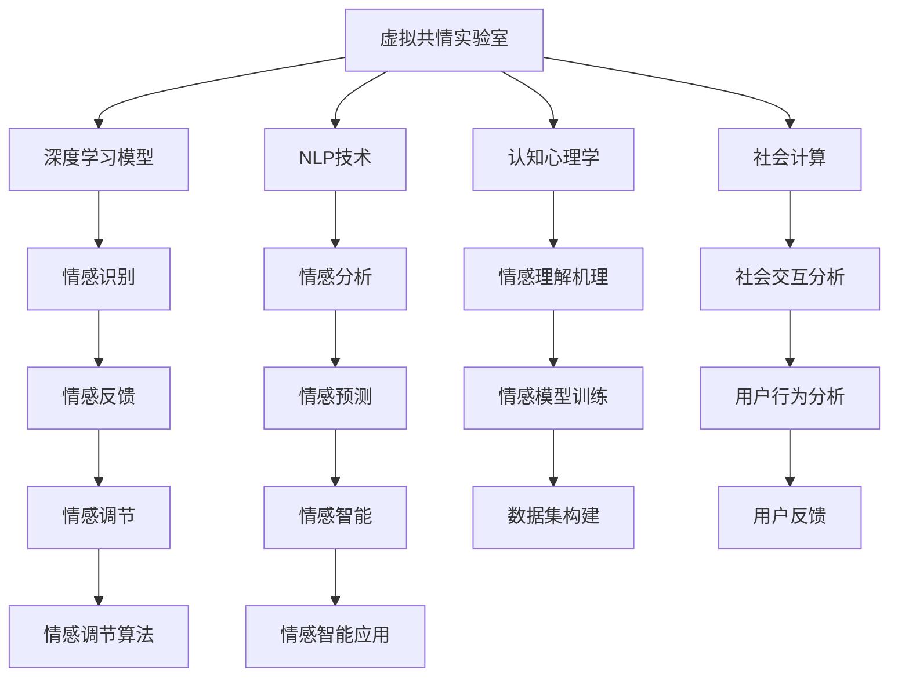

                 

# 虚拟共情实验室：AI增强的情感理解研究所

> 关键词：虚拟共情, 人工智能, 情感理解, 情绪分析, 情绪识别, 情感智能, 自然语言处理(NLP), 深度学习, 认知心理学, 社会计算

## 1. 背景介绍

### 1.1 问题由来

在数字化时代，虚拟社交和智能交互成为了人们沟通交流的重要方式。虚拟平台如社交媒体、视频聊天、智能客服等，通过文本、语音、图像等多种模态与用户互动，用户情感的准确理解和回应对提升用户体验、优化服务质量具有重要意义。然而，由于情感表达的复杂性和多样性，机器在理解和回应情感方面仍然面临挑战。

情感理解（Emotion Understanding）是指机器对人类情感的识别、分析与回应。这一过程涉及自然语言处理（NLP）、深度学习（DL）、认知心理学等多个领域。人工智能（AI）在这一领域的快速发展，为解决情感理解问题提供了新的解决方案。基于AI的虚拟共情实验室（AI-based Emotional Lab），通过深度学习等技术，训练模型以模拟人类情感认知和表达，为情感分析与智能交互提供了新的途径。

### 1.2 问题核心关键点

本文聚焦于基于AI的情感理解研究，通过虚拟共情实验室的开发与实践，探讨了以下几个核心关键点：

- **AI技术在情感理解中的应用**：如何利用深度学习、自然语言处理等技术，构建情感智能模型，实现对人类情感的精确识别和回应。
- **虚拟共情实验室的构建与运行**：介绍虚拟共情实验室的架构和运行机制，以及其在实际应用中的效果。
- **情感理解的挑战与未来发展**：分析情感理解面临的挑战，并展望未来可能的突破方向。

## 2. 核心概念与联系

### 2.1 核心概念概述

1. **虚拟共情（Virtual Empathy）**：指通过计算机技术模拟人类的情感认知和表达，实现对用户情感的理解与回应。
2. **情感理解（Emotion Understanding）**：指机器对人类情感的识别、分析与回应。
3. **自然语言处理（NLP）**：涉及文本的自动处理，包括语言理解、情感分析、文本生成等。
4. **深度学习（DL）**：通过多层神经网络实现对复杂模式的学习和分析。
5. **情感智能（Emotional Intelligence）**：指AI系统对人类情感的理解和表达能力。
6. **认知心理学（Cognitive Psychology）**：研究人类认知过程，包括感知、记忆、思维等，为情感理解提供理论基础。
7. **社会计算（Social Computing）**：利用计算技术研究社会行为和交互，提升情感理解的准确性和实效性。

### 2.2 核心概念原理和架构的 Mermaid 流程图(Mermaid 流程节点中不要有括号、逗号等特殊字符)



该流程图展示了虚拟共情实验室的架构和核心组件。

## 3. 核心算法原理 & 具体操作步骤

### 3.1 算法原理概述

情感理解的算法原理主要基于深度学习和自然语言处理技术，通过构建情感智能模型，实现对人类情感的识别和分析。

情感智能模型通常包括以下几个部分：

1. **情感识别（Emotion Recognition）**：通过文本、语音、图像等模态输入，识别用户表达的情感。
2. **情感分析（Emotion Analysis）**：对情感识别的结果进行进一步的情感语义分析，理解情感背后的原因和情境。
3. **情感回应（Emotion Response）**：根据情感分析的结果，生成合适的情感回应，实现对用户的情感回应。

### 3.2 算法步骤详解

情感理解的算法步骤主要包括数据收集、模型训练、情感分析与反馈。具体步骤如下：

1. **数据收集**：收集标注好的情感数据集，包括文本、语音、图像等多种模态的数据。
2. **模型训练**：使用深度学习技术，训练情感识别和情感分析模型。常用的模型包括RNN、LSTM、Transformer等。
3. **情感分析**：将识别到的情感与背景信息进行关联，理解情感背后的原因和情境。
4. **情感回应**：根据情感分析的结果，生成合适的情感回应，实现对用户的情感回应。
5. **反馈与优化**：通过用户反馈，不断优化情感理解和回应的准确性。

### 3.3 算法优缺点

情感理解算法的优点包括：

- **高精度**：通过深度学习模型，可以实现高精度的情感识别和分析。
- **多模态支持**：支持文本、语音、图像等多种模态的数据输入，适用于不同的交互场景。
- **实时性**：可以实时处理用户输入，及时响应用户需求。

其缺点包括：

- **数据依赖**：需要大量标注数据，数据收集和标注成本较高。
- **模型复杂**：深度学习模型较为复杂，训练和部署成本较高。
- **解释性不足**：模型的内部机制复杂，难以解释其决策过程。

### 3.4 算法应用领域

情感理解技术在多个领域具有广泛的应用前景，包括：

- **智能客服**：通过情感识别和分析，实现智能客服的情感理解与回应，提升用户体验。
- **社交媒体**：分析用户评论和帖子中的情感，实现情感监控和舆情分析。
- **健康医疗**：分析患者情感状态，提供情感支持和治疗建议。
- **虚拟社交**：模拟人类情感表达，实现更自然的人机交互。
- **教育培训**：通过情感分析，优化教育内容和教学方法，提升学习效果。

## 4. 数学模型和公式 & 详细讲解 & 举例说明（备注：数学公式请使用latex格式，latex嵌入文中独立段落使用 $$，段落内使用 $)
### 4.1 数学模型构建

情感理解的数学模型主要基于深度学习，通过多层神经网络实现对情感数据的处理和分析。以情感识别为例，常用的模型包括卷积神经网络（CNN）、循环神经网络（RNN）、长短时记忆网络（LSTM）、Transformer等。

### 4.2 公式推导过程

以Transformer模型为例，情感识别的公式推导如下：

1. **编码器层**：输入序列$x=[x_1,x_2,...,x_n]$，通过多头自注意力机制（Multi-Head Self-Attention）计算出上下文表示。

$$
Q=Ax^T, K=Ax^T, V=Ax^T
$$

其中$A$为线性变换矩阵，$x$为输入序列。

2. **多头自注意力**：计算多头自注意力结果$H=\mathrm{Softmax}(QK^T)V$，得到上下文表示。

3. **解码器层**：将上下文表示$H$与位置嵌入（Positional Embedding）、词嵌入（Word Embedding）等结合，经过前馈神经网络（Feedforward Network）和残差连接（Residual Connection），得到最终的情感表示。

$$
H'=H+F(H)
$$

其中$F(H)$为前馈神经网络，$H'$为输出。

### 4.3 案例分析与讲解

以一个简单的情感识别案例来说明上述模型的应用：

假设有一段文本：“我感到非常沮丧，今天工作特别累。”

1. **输入序列编码**：将文本转换为数字序列，通过词嵌入（Word Embedding）转换为向量表示。
2. **多头自注意力计算**：使用Transformer模型计算出上下文表示。
3. **情感表示输出**：通过全连接层输出情感表示，进行情感分类。

### 5. 项目实践：代码实例和详细解释说明

### 5.1 开发环境搭建

1. **Python环境**：安装Anaconda，创建虚拟环境。
2. **深度学习框架**：安装TensorFlow或PyTorch，进行深度学习模型开发。
3. **自然语言处理库**：安装NLTK、spaCy等，进行文本处理。

### 5.2 源代码详细实现

以下是一个使用PyTorch框架的情感识别模型的代码实现：

```python
import torch
import torch.nn as nn
import torch.optim as optim

class EmotionRecognitionModel(nn.Module):
    def __init__(self, input_size, hidden_size, output_size):
        super(EmotionRecognitionModel, self).__init__()
        self.embedding = nn.Embedding(input_size, hidden_size)
        self.gru = nn.GRU(hidden_size, hidden_size)
        self.fc = nn.Linear(hidden_size, output_size)
        
    def forward(self, x):
        embedded = self.embedding(x)
        output, hidden = self.gru(embedded)
        return self.fc(output[:, -1, :])

model = EmotionRecognitionModel(input_size, hidden_size, output_size)
optimizer = optim.Adam(model.parameters(), lr=0.001)
criterion = nn.CrossEntropyLoss()

for epoch in range(num_epochs):
    for batch in train_loader:
        inputs, labels = batch
        optimizer.zero_grad()
        outputs = model(inputs)
        loss = criterion(outputs, labels)
        loss.backward()
        optimizer.step()
```

### 5.3 代码解读与分析

以上代码实现了一个简单的情感识别模型，使用了嵌入层（Embedding）、GRU（Gated Recurrent Unit）和全连接层（FC）。

1. **嵌入层**：将文本转换为向量表示，输入到GRU中。
2. **GRU层**：对文本序列进行序列建模，提取上下文信息。
3. **全连接层**：对GRU输出进行分类，得到情感标签。

### 5.4 运行结果展示

在训练完成后，使用测试集进行情感分类，得到分类准确率。

## 6. 实际应用场景

### 6.1 智能客服

智能客服系统通过情感识别和分析，理解用户情感状态，自动生成合适的情感回应，提升用户体验。

### 6.2 社交媒体情感监控

社交媒体情感监控系统通过分析用户评论和帖子中的情感，实现情感监控和舆情分析，及时发现和应对负面情感。

### 6.3 健康医疗情感支持

健康医疗系统通过分析患者的情感状态，提供情感支持和心理辅导，提升治疗效果。

### 6.4 未来应用展望

未来，情感理解技术将在更多领域得到应用，如教育培训、虚拟社交等。

## 7. 工具和资源推荐

### 7.1 学习资源推荐

- **《深度学习》课程**：由吴恩达教授讲授，涵盖深度学习基础和前沿技术。
- **《自然语言处理》课程**：斯坦福大学开设的NLP明星课程，涵盖NLP的基本概念和经典模型。
- **《认知心理学》教材**：介绍人类认知过程，为情感理解提供理论基础。

### 7.2 开发工具推荐

- **PyTorch**：深度学习框架，支持GPU加速，适合快速迭代研究。
- **TensorFlow**：由Google主导的深度学习框架，生产部署方便。
- **NLTK**：自然语言处理库，提供文本处理和情感分析功能。

### 7.3 相关论文推荐

- **Attention is All You Need**：提出Transformer模型，奠定了深度学习在情感理解中的应用基础。
- **Emotion Understanding with Transformer**：使用Transformer模型进行情感识别和分析，展示了其在情感理解中的优越性能。

## 8. 总结：未来发展趋势与挑战

### 8.1 研究成果总结

情感理解技术的发展得益于深度学习、自然语言处理等技术的进步。当前，情感理解技术在多个领域得到了广泛应用，提升了用户体验和服务质量。

### 8.2 未来发展趋势

未来，情感理解技术将向以下几个方向发展：

1. **多模态情感理解**：支持文本、语音、图像等多种模态的数据输入，提升情感识别的准确性和多样性。
2. **实时情感分析**：实现实时处理和响应，提升用户交互体验。
3. **跨文化情感理解**：支持多语言和文化背景的用户，实现跨文化情感理解和回应。
4. **情感智能融合**：与其他AI技术融合，提升情感理解和回应的智能化水平。

### 8.3 面临的挑战

情感理解技术仍面临以下挑战：

1. **数据依赖**：需要大量标注数据，数据收集和标注成本较高。
2. **模型复杂**：深度学习模型较为复杂，训练和部署成本较高。
3. **解释性不足**：模型的内部机制复杂，难以解释其决策过程。

### 8.4 研究展望

未来，情感理解技术的研究方向包括：

1. **无监督和半监督学习**：摆脱对大规模标注数据的依赖，利用自监督学习、主动学习等方法提升情感理解的泛化能力。
2. **多模态情感理解**：结合视觉、语音等多种模态的数据，提升情感理解的准确性和多样性。
3. **跨文化情感理解**：支持多语言和文化背景的用户，实现跨文化情感理解和回应。
4. **情感智能融合**：与其他AI技术融合，提升情感理解和回应的智能化水平。

## 9. 附录：常见问题与解答

**Q1: 虚拟共情实验室如何实现情感理解？**

A: 虚拟共情实验室通过深度学习模型实现情感理解，使用Transformer等模型对文本、语音、图像等多种模态的数据进行处理和分析，实现情感识别和情感分析。

**Q2: 如何提高情感识别的准确性？**

A: 通过增加数据量、调整模型架构、优化超参数等方法，可以提高情感识别的准确性。

**Q3: 情感理解的难点是什么？**

A: 情感理解的难点在于数据的收集和标注，以及模型的解释性和泛化能力。

**Q4: 情感理解技术的应用场景有哪些？**

A: 情感理解技术在智能客服、社交媒体情感监控、健康医疗情感支持、虚拟社交等多个领域具有广泛的应用前景。

**Q5: 未来情感理解技术的发展方向是什么？**

A: 未来情感理解技术将向多模态情感理解、实时情感分析、跨文化情感理解、情感智能融合等方向发展。

---

作者：禅与计算机程序设计艺术 / Zen and the Art of Computer Programming

