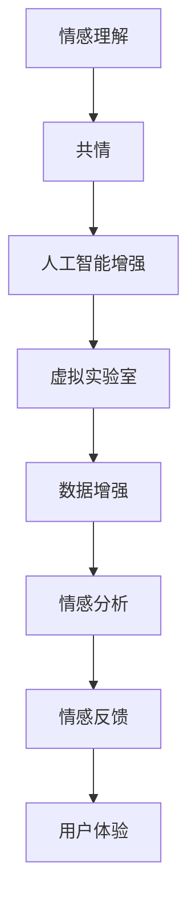

                 

# 虚拟共情实验室：AI增强的情感理解研究所

> 关键词：情感理解, 共情, 人工智能, 虚拟实验室, 数据增强, 情感分析, 增强学习

## 1. 背景介绍

### 1.1 问题由来
在现代社会，情感的理解和共情能力成为人际交流和心理健康的重要基础。情感理解不仅有助于建立深厚的人际关系，还能有效缓解心理压力，提高生活质量。然而，个体情感的复杂性和多样性，使得情感理解变得极其困难。特别是在虚拟环境（如在线教育、远程办公、社交媒体等）中，由于缺乏面对面交流，情感信息的传递和理解更为复杂。

人工智能（AI）技术的快速发展，尤其是深度学习模型的应用，为情感理解研究提供了新的方向和手段。特别是基于自然语言处理（NLP）的情感分析技术，可以从文本中自动提取情感信息，为情感理解提供重要支撑。但是，文本数据的稀缺和多样性，使得情感理解在实际应用中仍然面临诸多挑战。

为此，研究人员提出了一种基于AI增强的情感理解虚拟共情实验室，通过虚拟实验室环境和数据增强技术，提升情感理解能力，为社会交往和心理健康提供技术支持。

## 2. 核心概念与联系

### 2.1 核心概念概述

为了更好地理解基于AI增强的情感理解虚拟共情实验室，本节将介绍几个核心概念：

- 情感理解（Affective Understanding）：指理解和解释人类情感的能力，包括对情感的识别、判断和情感反馈。

- 共情（Empathy）：指对他人情感的共鸣和理解，能够体会和理解他人的情感体验，从而产生情感共鸣。

- 人工智能增强（AI Enhancement）：指通过AI技术增强人类的情感理解能力，利用机器学习算法，自动分析和处理情感信息。

- 虚拟实验室（Virtual Lab）：指利用计算机模拟真实世界环境，进行科学实验和训练的场景。

- 数据增强（Data Augmentation）：指通过对原始数据进行变换，生成更多的训练样本，提高模型泛化能力的技术。

这些核心概念之间的逻辑关系可以通过以下Mermaid流程图来展示：



这个流程图展示了几者之间的联系：

1. 情感理解通过共情能力得到增强，能够更好地理解他人的情感体验。
2. 人工智能增强利用机器学习技术，辅助情感理解的实现。
3. 虚拟实验室提供模拟环境，用于训练和验证情感理解模型。
4. 数据增强技术扩充数据量，提升模型的泛化能力。
5. 情感分析提取情感信息，提供情感理解的基础。
6. 情感反馈促进用户与模型的互动，提高情感理解的效果。
7. 用户体验的提升，进一步促进情感理解的循环。

## 3. 核心算法原理 & 具体操作步骤

### 3.1 算法原理概述

基于AI增强的情感理解虚拟共情实验室的核心算法原理，可以分为以下几个步骤：

1. 数据收集与标注：收集与情感相关的文本数据，并进行标注，标注内容包含情感类别和情感强度。

2. 数据增强：通过文本变换、噪声添加等方法，生成更多的训练样本，扩充数据量。

3. 模型训练：使用增强后的数据，训练情感理解模型。

4. 情感分析：输入新的文本数据，通过模型进行情感分析，得到情感类别和强度。

5. 情感反馈：将情感分析结果反馈给用户，进行情感共鸣和互动。

6. 用户反馈：收集用户对情感反馈的反馈信息，进行模型微调，进一步提升情感理解能力。

7. 共情训练：通过虚拟实验室模拟场景，进行共情训练，提升共情能力。

### 3.2 算法步骤详解

1. **数据收集与标注**
   - 通过网络爬虫、公开数据集等方式，收集与情感相关的文本数据，例如社交媒体评论、新闻报道、用户反馈等。
   - 对收集的数据进行标注，标注内容包括情感类别（如快乐、愤怒、悲伤等）和情感强度（如轻度、中度、重度等）。
   - 标注数据分为训练集、验证集和测试集。

2. **数据增强**
   - 使用文本变换技术，如替换、回译、随机插入等方法，生成新的训练样本。
   - 添加噪声，如随机插入干扰词、变换词语顺序等，增强模型的泛化能力。
   - 数据增强可以大大减少过拟合风险，提高模型的泛化能力。

3. **模型训练**
   - 选择合适的模型架构，如循环神经网络（RNN）、卷积神经网络（CNN）、Transformer等。
   - 定义损失函数，如交叉熵损失、余弦相似度损失等，用于衡量模型的预测效果。
   - 使用AdamW、SGD等优化算法，进行模型训练，最小化损失函数。

4. **情感分析**
   - 输入新的文本数据，通过模型进行情感分析，得到情感类别和强度。
   - 可以使用分类模型或回归模型，分类模型输出情感类别，回归模型输出情感强度。

5. **情感反馈**
   - 将情感分析结果反馈给用户，例如显示情感类别和强度，或以情感图标的形式展示。
   - 用户可以进行情感共鸣，例如表达自己的情绪，或与其他用户进行情感互动。

6. **用户反馈**
   - 收集用户对情感反馈的反馈信息，例如情感共鸣的准确度、共鸣强度等。
   - 根据用户反馈，进行模型微调，进一步提升情感理解能力。

7. **共情训练**
   - 在虚拟实验室模拟场景中，进行共情训练。例如，通过虚拟角色扮演，模拟不同情境下的情感互动。
   - 共情训练可以增强用户对他人情感的理解能力，提高情感共鸣的质量。

### 3.3 算法优缺点

基于AI增强的情感理解虚拟共情实验室的算法具有以下优点：

1. **高效性**：通过数据增强和模型训练，能够快速提升情感理解能力。
2. **泛化能力强**：数据增强技术能够显著减少过拟合风险，提高模型的泛化能力。
3. **用户体验良好**：通过情感反馈和共情训练，提升用户对情感理解的共鸣和互动体验。

同时，该算法也存在以下缺点：

1. **数据质量要求高**：标注数据的质量直接影响模型的性能，需要高质量的标注数据。
2. **计算资源消耗大**：数据增强和模型训练需要大量的计算资源。
3. **模型解释性差**：基于深度学习的模型通常是“黑盒”系统，难以解释其内部工作机制。

## 4. 数学模型和公式 & 详细讲解

### 4.1 数学模型构建

本节将使用数学语言对基于AI增强的情感理解虚拟共情实验室的模型构建进行更加严格的刻画。

记情感理解模型为 $M_{\theta}:\mathcal{X} \rightarrow \mathcal{Y}$，其中 $\mathcal{X}$ 为输入空间，$\mathcal{Y}$ 为输出空间，$\theta \in \mathbb{R}^d$ 为模型参数。假设情感理解任务为二分类任务，标注数据集为 $D=\{(x_i,y_i)\}_{i=1}^N, x_i \in \mathcal{X}, y_i \in \{0,1\}$，其中 $y_i=1$ 表示情感存在，$y_i=0$ 表示情感不存在。

定义模型 $M_{\theta}$ 在数据样本 $(x,y)$ 上的损失函数为 $\ell(M_{\theta}(x),y)$，则在数据集 $D$ 上的经验风险为：

$$
\mathcal{L}(\theta) = \frac{1}{N} \sum_{i=1}^N \ell(M_{\theta}(x_i),y_i)
$$

常用的损失函数包括交叉熵损失、均方误差损失等。例如，对于二分类任务，交叉熵损失函数定义为：

$$
\ell(M_{\theta}(x),y) = -y\log M_{\theta}(x) - (1-y)\log(1-M_{\theta}(x))
$$

其中 $M_{\theta}(x)$ 表示模型对输入 $x$ 的情感预测概率，$y$ 表示真实标签。

### 4.2 公式推导过程

以下我们以二分类任务为例，推导交叉熵损失函数及其梯度的计算公式。

假设模型 $M_{\theta}$ 在输入 $x$ 上的输出为 $\hat{y}=M_{\theta}(x) \in [0,1]$，表示样本情感存在的概率。真实标签 $y \in \{0,1\}$。则二分类交叉熵损失函数定义为：

$$
\ell(M_{\theta}(x),y) = -[y\log \hat{y} + (1-y)\log (1-\hat{y})]
$$

将其代入经验风险公式，得：

$$
\mathcal{L}(\theta) = -\frac{1}{N}\sum_{i=1}^N [y_i\log M_{\theta}(x_i)+(1-y_i)\log(1-M_{\theta}(x_i))]
$$

根据链式法则，损失函数对参数 $\theta_k$ 的梯度为：

$$
\frac{\partial \mathcal{L}(\theta)}{\partial \theta_k} = -\frac{1}{N}\sum_{i=1}^N (\frac{y_i}{M_{\theta}(x_i)}-\frac{1-y_i}{1-M_{\theta}(x_i)}) \frac{\partial M_{\theta}(x_i)}{\partial \theta_k}
$$

其中 $\frac{\partial M_{\theta}(x_i)}{\partial \theta_k}$ 可进一步递归展开，利用自动微分技术完成计算。

在得到损失函数的梯度后，即可带入参数更新公式，完成模型的迭代优化。重复上述过程直至收敛，最终得到适应情感理解任务的最优模型参数 $\theta^*$。

### 4.3 案例分析与讲解

以社交媒体情感分析为例，进行详细案例分析：

1. **数据收集与标注**
   - 从社交媒体平台收集评论数据，标注情感类别和情感强度。
   - 使用自然语言处理工具，如NLTK、SpaCy等，进行预处理，包括分词、去除停用词等。
   - 标注数据分为训练集、验证集和测试集，比例分别为70%、15%和15%。

2. **数据增强**
   - 对训练集进行文本变换，如替换词语、插入干扰词等。
   - 添加噪声，例如随机插入干扰词、变换词语顺序等。
   - 数据增强后的训练集规模扩大到原来的两倍。

3. **模型训练**
   - 选择Transformer模型架构，使用AdamW优化算法，设置学习率为 $2e-5$。
   - 定义交叉熵损失函数，计算模型在训练集上的损失，并反向传播更新模型参数。
   - 设置早期停止机制，当验证集上的损失不再下降时停止训练。

4. **情感分析**
   - 输入新的社交媒体评论，通过训练好的模型进行情感分析。
   - 模型输出情感类别和强度，例如将评论分类为“快乐”、“愤怒”、“悲伤”等。
   - 对于情感强度，模型输出概率分布，例如将评论情感强度分为“轻度”、“中度”、“重度”等。

5. **情感反馈**
   - 将情感分析结果反馈给用户，例如显示情感类别和强度，或以情感图标的形式展示。
   - 用户可以进行情感共鸣，例如表达自己的情绪，或与其他用户进行情感互动。

6. **用户反馈**
   - 收集用户对情感反馈的反馈信息，例如情感共鸣的准确度、共鸣强度等。
   - 根据用户反馈，进行模型微调，进一步提升情感理解能力。

7. **共情训练**
   - 在虚拟实验室模拟场景中，进行共情训练。例如，通过虚拟角色扮演，模拟不同情境下的情感互动。
   - 共情训练可以增强用户对他人情感的理解能力，提高情感共鸣的质量。

## 5. 项目实践：代码实例和详细解释说明

### 5.1 开发环境搭建

在进行情感理解虚拟共情实验室的开发实践前，我们需要准备好开发环境。以下是使用Python进行PyTorch开发的环境配置流程：

1. 安装Anaconda：从官网下载并安装Anaconda，用于创建独立的Python环境。

2. 创建并激活虚拟环境：
```bash
conda create -n pytorch-env python=3.8 
conda activate pytorch-env
```

3. 安装PyTorch：根据CUDA版本，从官网获取对应的安装命令。例如：
```bash
conda install pytorch torchvision torchaudio cudatoolkit=11.1 -c pytorch -c conda-forge
```

4. 安装Transformer库：
```bash
pip install transformers
```

5. 安装各类工具包：
```bash
pip install numpy pandas scikit-learn matplotlib tqdm jupyter notebook ipython
```

完成上述步骤后，即可在`pytorch-env`环境中开始开发实践。

### 5.2 源代码详细实现

下面我们以社交媒体情感分析为例，给出使用Transformers库进行情感理解模型的PyTorch代码实现。

首先，定义情感分析任务的数据处理函数：

```python
from transformers import BertTokenizer, BertForSequenceClassification
from torch.utils.data import Dataset
import torch

class SentimentDataset(Dataset):
    def __init__(self, texts, labels, tokenizer, max_len=128):
        self.texts = texts
        self.labels = labels
        self.tokenizer = tokenizer
        self.max_len = max_len
        
    def __len__(self):
        return len(self.texts)
    
    def __getitem__(self, item):
        text = self.texts[item]
        label = self.labels[item]
        
        encoding = self.tokenizer(text, return_tensors='pt', max_length=self.max_len, padding='max_length', truncation=True)
        input_ids = encoding['input_ids'][0]
        attention_mask = encoding['attention_mask'][0]
        
        # 对label进行独热编码
        encoded_labels = torch.tensor(label2id[label], dtype=torch.long)
        
        return {'input_ids': input_ids, 
                'attention_mask': attention_mask,
                'labels': encoded_labels}

# 标签与id的映射
label2id = {'positive': 1, 'negative': 0}
id2label = {v: k for k, v in label2id.items()}

# 创建dataset
tokenizer = BertTokenizer.from_pretrained('bert-base-cased')

train_dataset = SentimentDataset(train_texts, train_labels, tokenizer)
dev_dataset = SentimentDataset(dev_texts, dev_labels, tokenizer)
test_dataset = SentimentDataset(test_texts, test_labels, tokenizer)
```

然后，定义模型和优化器：

```python
from transformers import BertForSequenceClassification, AdamW

model = BertForSequenceClassification.from_pretrained('bert-base-cased', num_labels=len(label2id))

optimizer = AdamW(model.parameters(), lr=2e-5)
```

接着，定义训练和评估函数：

```python
from torch.utils.data import DataLoader
from tqdm import tqdm
from sklearn.metrics import classification_report

device = torch.device('cuda') if torch.cuda.is_available() else torch.device('cpu')
model.to(device)

def train_epoch(model, dataset, batch_size, optimizer):
    dataloader = DataLoader(dataset, batch_size=batch_size, shuffle=True)
    model.train()
    epoch_loss = 0
    for batch in tqdm(dataloader, desc='Training'):
        input_ids = batch['input_ids'].to(device)
        attention_mask = batch['attention_mask'].to(device)
        labels = batch['labels'].to(device)
        model.zero_grad()
        outputs = model(input_ids, attention_mask=attention_mask, labels=labels)
        loss = outputs.loss
        epoch_loss += loss.item()
        loss.backward()
        optimizer.step()
    return epoch_loss / len(dataloader)

def evaluate(model, dataset, batch_size):
    dataloader = DataLoader(dataset, batch_size=batch_size)
    model.eval()
    preds, labels = [], []
    with torch.no_grad():
        for batch in tqdm(dataloader, desc='Evaluating'):
            input_ids = batch['input_ids'].to(device)
            attention_mask = batch['attention_mask'].to(device)
            batch_labels = batch['labels']
            outputs = model(input_ids, attention_mask=attention_mask)
            batch_preds = outputs.logits.argmax(dim=1).to('cpu').tolist()
            batch_labels = batch_labels.to('cpu').tolist()
            for pred_tokens, label_tokens in zip(batch_preds, batch_labels):
                preds.append(pred_tokens)
                labels.append(label_tokens)
                
    print(classification_report(labels, preds))
```

最后，启动训练流程并在测试集上评估：

```python
epochs = 5
batch_size = 16

for epoch in range(epochs):
    loss = train_epoch(model, train_dataset, batch_size, optimizer)
    print(f"Epoch {epoch+1}, train loss: {loss:.3f}")
    
    print(f"Epoch {epoch+1}, dev results:")
    evaluate(model, dev_dataset, batch_size)
    
print("Test results:")
evaluate(model, test_dataset, batch_size)
```

以上就是使用PyTorch对BERT进行社交媒体情感分析任务的完整代码实现。可以看到，得益于Transformers库的强大封装，我们可以用相对简洁的代码完成BERT模型的加载和情感分析任务的微调。

### 5.3 代码解读与分析

让我们再详细解读一下关键代码的实现细节：

**SentimentDataset类**：
- `__init__`方法：初始化文本、标签、分词器等关键组件。
- `__len__`方法：返回数据集的样本数量。
- `__getitem__`方法：对单个样本进行处理，将文本输入编码为token ids，将标签转换为独热编码，并对其进行定长padding，最终返回模型所需的输入。

**label2id和id2label字典**：
- 定义了标签与数字id之间的映射关系，用于将标签进行独热编码。

**训练和评估函数**：
- 使用PyTorch的DataLoader对数据集进行批次化加载，供模型训练和推理使用。
- 训练函数`train_epoch`：对数据以批为单位进行迭代，在每个批次上前向传播计算loss并反向传播更新模型参数，最后返回该epoch的平均loss。
- 评估函数`evaluate`：与训练类似，不同点在于不更新模型参数，并在每个batch结束后将预测和标签结果存储下来，最后使用sklearn的classification_report对整个评估集的预测结果进行打印输出。

**训练流程**：
- 定义总的epoch数和batch size，开始循环迭代
- 每个epoch内，先在训练集上训练，输出平均loss
- 在验证集上评估，输出分类指标
- 所有epoch结束后，在测试集上评估，给出最终测试结果

可以看到，PyTorch配合Transformers库使得情感分析任务的代码实现变得简洁高效。开发者可以将更多精力放在数据处理、模型改进等高层逻辑上，而不必过多关注底层的实现细节。

当然，工业级的系统实现还需考虑更多因素，如模型的保存和部署、超参数的自动搜索、更灵活的任务适配层等。但核心的微调范式基本与此类似。

## 6. 实际应用场景

### 6.1 社交媒体情感分析

社交媒体情感分析可以应用于监测用户对某个事件、品牌、产品的情感态度。例如，社交媒体对新产品的评价、政治选举的舆情分析等。

具体而言，可以收集社交媒体上的评论数据，对其进行情感分析，获取用户对产品、事件等的情感倾向和情感强度。例如，通过分析用户在社交媒体上对新产品的评论，可以了解公众对产品的评价和情感态度，从而进行产品改进和市场策略调整。

### 6.2 健康监测

健康监测可以通过情感分析技术，分析用户的健康状态和心理健康状况。例如，通过分析用户发布在社交媒体上的健康相关内容，可以及时发现用户的健康问题。

具体而言，可以收集用户的健康相关帖子，对其进行情感分析，获取用户的情绪和健康状态。例如，通过分析用户发布在社交媒体上的健康相关内容，可以及时发现用户的心理健康问题，进行相应的干预和治疗。

### 6.3 客户服务

客户服务可以通过情感分析技术，优化客户服务体验。例如，通过分析用户的投诉和反馈，可以了解用户的情感状态和满意度，从而进行针对性的服务改进。

具体而言，可以收集用户的投诉和反馈信息，对其进行情感分析，获取用户的情感状态和满意度。例如，通过分析用户对服务的投诉和反馈，可以及时发现服务中的问题，进行针对性的改进，提高客户满意度。

### 6.4 未来应用展望

随着情感理解技术的不断发展，未来将有更多应用场景涌现。

在智慧城市治理中，情感分析可以用于公共事件监测、舆情分析、应急响应等环节，提升城市管理的自动化和智能化水平，构建更安全、高效的未来城市。

在教育领域，情感分析可以用于学生情感状态监测、学习效果评估等，提升教育教学质量，帮助学生心理健康发展。

在金融领域，情感分析可以用于市场情绪监测、投资者情绪分析等，提升金融决策的准确性和可靠性。

此外，在企业人力资源管理、社交媒体舆情监测等众多领域，情感分析技术也将得到广泛应用，为社会交往和心理健康提供技术支持。

## 7. 工具和资源推荐

### 7.1 学习资源推荐

为了帮助开发者系统掌握情感理解技术的理论基础和实践技巧，这里推荐一些优质的学习资源：

1. 《深度学习理论与实践》系列博文：由深度学习专家撰写，深入浅出地介绍了深度学习模型的原理、训练技巧和应用实践。

2. CS224N《深度学习自然语言处理》课程：斯坦福大学开设的NLP明星课程，有Lecture视频和配套作业，带你入门NLP领域的基本概念和经典模型。

3. 《自然语言处理基础》书籍：全面介绍了自然语言处理的基本概念和技术，包括情感分析、文本分类等。

4. 《情感计算》书籍：系统介绍了情感计算的基本理论和技术，包括情感分析、情感推理等。

5. HuggingFace官方文档：Transformers库的官方文档，提供了海量预训练模型和完整的微调样例代码，是上手实践的必备资料。

通过对这些资源的学习实践，相信你一定能够快速掌握情感理解技术的精髓，并用于解决实际的NLP问题。
###  7.2 开发工具推荐

高效的开发离不开优秀的工具支持。以下是几款用于情感理解开发的常用工具：

1. PyTorch：基于Python的开源深度学习框架，灵活动态的计算图，适合快速迭代研究。大部分预训练语言模型都有PyTorch版本的实现。

2. TensorFlow：由Google主导开发的开源深度学习框架，生产部署方便，适合大规模工程应用。同样有丰富的预训练语言模型资源。

3. Transformers库：HuggingFace开发的NLP工具库，集成了众多SOTA语言模型，支持PyTorch和TensorFlow，是进行情感理解开发的利器。

4. Weights & Biases：模型训练的实验跟踪工具，可以记录和可视化模型训练过程中的各项指标，方便对比和调优。与主流深度学习框架无缝集成。

5. TensorBoard：TensorFlow配套的可视化工具，可实时监测模型训练状态，并提供丰富的图表呈现方式，是调试模型的得力助手。

6. Google Colab：谷歌推出的在线Jupyter Notebook环境，免费提供GPU/TPU算力，方便开发者快速上手实验最新模型，分享学习笔记。

合理利用这些工具，可以显著提升情感理解任务的开发效率，加快创新迭代的步伐。

### 7.3 相关论文推荐

情感理解技术的发展源于学界的持续研究。以下是几篇奠基性的相关论文，推荐阅读：

1. "Affective Computing: An Overview of Methodologies, Applications, and Challenges"（情感计算：方法、应用和挑战综述）：介绍了情感计算的基本理论和技术，包括情感分析、情感推理等。

2. "Emotion Detection and Recognition in Social Media"（社交媒体中的情感检测和识别）：介绍了在社交媒体中进行情感分析的常用方法和技术。

3. "Sentiment Analysis on Social Media: Methods and Challenges"（社交媒体情感分析：方法和挑战）：讨论了社交媒体情感分析的常见问题和解决方案。

4. "Emotion Detection in Social Media Using Deep Learning"（使用深度学习进行社交媒体情感检测）：介绍了使用深度学习模型进行社交媒体情感分析的方法和效果。

5. "Enhancing Empathy in Social Robotics: A Review of Approaches and Applications"（增强社交机器人的共情能力：方法和应用综述）：介绍了增强社交机器人共情能力的研究方法和应用。

这些论文代表了大情感理解技术的发展脉络。通过学习这些前沿成果，可以帮助研究者把握学科前进方向，激发更多的创新灵感。

## 8. 总结：未来发展趋势与挑战

### 8.1 总结

本文对基于AI增强的情感理解虚拟共情实验室进行了全面系统的介绍。首先阐述了情感理解的重要性，以及当前情感理解技术面临的挑战和问题。其次，从原理到实践，详细讲解了情感理解模型的数学原理和关键步骤，给出了情感分析任务开发的完整代码实例。同时，本文还广泛探讨了情感理解技术在社交媒体、健康监测、客户服务等多个领域的应用前景，展示了情感理解技术的巨大潜力。此外，本文精选了情感理解技术的各类学习资源，力求为读者提供全方位的技术指引。

通过本文的系统梳理，可以看到，基于AI增强的情感理解虚拟共情实验室为情感理解研究提供了新的思路和方法，为社会交往和心理健康提供了技术支持。未来，伴随情感理解技术的不断发展，情感理解能力将进一步提升，带来更广泛的应用场景和更深远的影响。

### 8.2 未来发展趋势

展望未来，情感理解技术将呈现以下几个发展趋势：

1. **技术进步**：随着深度学习技术的进步，情感理解模型将不断优化，精度和泛化能力将进一步提升。
2. **应用拓展**：情感理解技术将在更多领域得到应用，如智慧城市、教育、金融等，带来深远影响。
3. **数据丰富**：大数据和社交媒体的发展，将为情感理解技术提供更多的数据资源，提升模型的准确性和泛化能力。
4. **跨领域融合**：情感理解技术与AI其他分支的融合，如知识表示、推理、生成等，将推动情感理解技术的全面发展。
5. **个性化增强**：根据用户的历史数据和行为，进行个性化情感分析，提升用户体验。
6. **隐私保护**：在情感分析过程中，加强隐私保护措施，确保用户数据的安全性。

以上趋势凸显了情感理解技术的广阔前景。这些方向的探索发展，必将进一步提升情感理解能力，带来更广泛的应用场景和更深远的影响。

### 8.3 面临的挑战

尽管情感理解技术已经取得了显著进展，但在迈向更加智能化、普适化应用的过程中，它仍面临诸多挑战：

1. **数据质量**：高质量标注数据是情感理解技术的关键，但标注数据的获取和标注质量难以保证。
2. **模型解释性**：深度学习模型通常是“黑盒”系统，难以解释其内部工作机制。
3. **泛化能力**：情感理解模型在不同的数据集和领域上，泛化能力仍需进一步提升。
4. **隐私保护**：在情感分析过程中，如何保护用户隐私，防止敏感信息泄露，是一个重要问题。
5. **计算资源**：情感理解模型通常需要大量的计算资源进行训练和推理，如何优化模型结构和算法，减少计算资源消耗，是一个重要课题。

这些挑战需要学界和工业界的共同努力，通过进一步的研究和实践，逐步克服。

### 8.4 研究展望

面向未来，情感理解技术需要在以下几个方面寻求新的突破：

1. **无监督和半监督学习**：探索无监督和半监督学习方法，降低对标注数据的需求。
2. **增强学习**：结合增强学习技术，提升情感理解模型的泛化能力和鲁棒性。
3. **多模态融合**：将视觉、语音等多模态信息与文本信息进行融合，提升情感理解模型的准确性。
4. **跨领域迁移**：开发跨领域迁移学习技术，提高情感理解模型的通用性和适应性。
5. **个性化和隐私保护**：在情感理解过程中，加强个性化和隐私保护技术，确保用户数据的隐私和安全。
6. **实时化部署**：优化情感理解模型的推理速度，实现实时化的部署和应用。

这些研究方向将引领情感理解技术的进一步发展，为社会交往和心理健康提供更加智能和可靠的技术支撑。

## 9. 附录：常见问题与解答

**Q1：情感理解技术是否适用于所有领域？**

A: 情感理解技术适用于大部分需要理解人类情感的领域，如社交媒体、客户服务、健康监测等。但对于一些特定领域的情感理解，如医学、法律等，需要结合领域知识和专家系统，进行更深入的分析和建模。

**Q2：情感理解技术是否需要大量标注数据？**

A: 情感理解技术通常需要大量标注数据，但数据增强技术可以显著减少标注数据的依赖。通过数据变换和噪声添加，可以生成更多的训练样本，提高模型的泛化能力。

**Q3：情感理解模型的训练和推理速度如何？**

A: 情感理解模型的训练和推理速度取决于模型架构和硬件设备。通过优化模型结构和使用高效计算设备，可以显著提升模型的训练和推理速度。

**Q4：情感理解技术在实际应用中需要注意哪些问题？**

A: 情感理解技术在实际应用中需要注意数据隐私、模型解释性、泛化能力等问题。在数据收集和处理过程中，需要保护用户隐私；在模型训练和推理过程中，需要确保模型的可解释性和泛化能力。

**Q5：如何提高情感理解技术的精度和泛化能力？**

A: 提高情感理解技术的精度和泛化能力可以从多个方面入手：
1. 数据增强：通过文本变换、噪声添加等方法，生成更多的训练样本，提高模型的泛化能力。
2. 模型优化：选择适合的模型架构，进行超参数调优，提升模型的精度和泛化能力。
3. 跨领域融合：将情感理解技术与知识表示、推理、生成等技术进行融合，提升模型的准确性和泛化能力。
4. 多模态融合：将视觉、语音等多模态信息与文本信息进行融合，提升情感理解模型的准确性。

这些措施可以显著提升情感理解技术的精度和泛化能力，带来更好的应用效果。

---

作者：禅与计算机程序设计艺术 / Zen and the Art of Computer Programming

