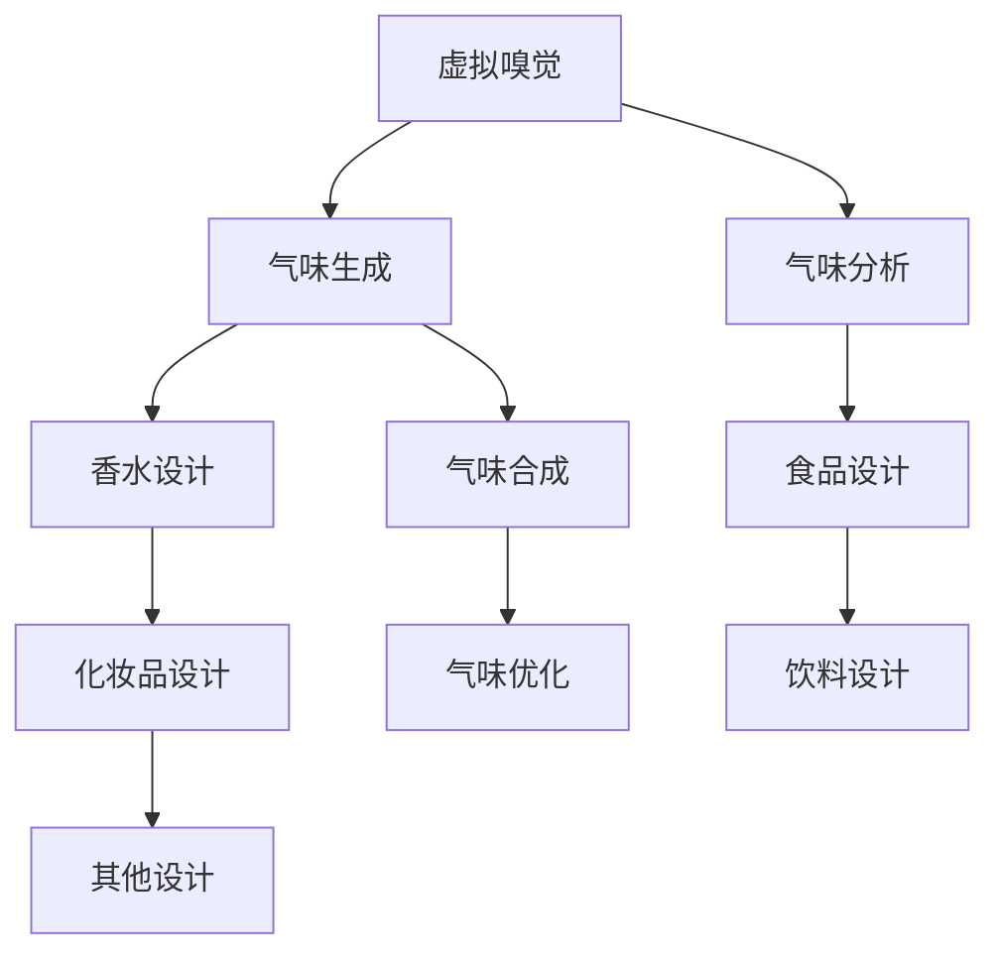

                 

# 虚拟嗅觉景观师：AI构建的气味世界设计师

> 关键词：虚拟嗅觉,人工智能,气味世界设计,香水设计,气味分析,气味生成,生成式模型

## 1. 背景介绍

### 1.1 问题由来

人类感官的体验不仅仅局限于视觉和听觉，嗅觉也是构成感官体验的重要组成部分。然而，由于技术和手段的限制，过去人们对嗅觉的感知和理解相对有限，很多时候只能通过实物的气味进行体验。这一现象在香水、食品、化妆品等领域尤为明显，设计师和生产商往往难以精准控制气味的设计和输出，导致产品体验难以稳定。

近年来，随着人工智能技术，尤其是深度学习、生成对抗网络等技术的发展，人类对气味感知和设计的理解已经迈入了一个新的阶段。通过构建虚拟嗅觉景观，AI模型可以设计出更加精准、个性化且符合人类审美和需求的气味，进而推动相关产业的创新升级。

### 1.2 问题核心关键点

- **虚拟嗅觉**：通过AI模型模拟气味，可以构建虚拟的嗅觉景观，从而在实际应用中重现或生成复杂的气味组合。
- **气味生成模型**：深度学习模型，如生成对抗网络(GAN)、变分自编码器(VAE)等，已经被用于生成逼真的气味数据，为气味设计提供了新的途径。
- **气味分析模型**：通过AI模型对气味的化学成分进行分析和分类，可以更好地理解气味的特征和来源。
- **气味生成与分析的结合**：将气味生成与分析技术结合，可以设计出更加精准和个性化的气味，适用于香水、食品、饮料等多个领域。

## 2. 核心概念与联系

### 2.1 核心概念概述

为更好地理解虚拟嗅觉景观的设计过程，本节将介绍几个核心概念：

- **虚拟嗅觉**：通过AI模型模拟和重现气味，构建虚拟的嗅觉景观，适用于香水、食品、化妆品等需要精准控制气味的场景。
- **气味生成模型**：利用深度学习技术，生成逼真的气味数据，用于气味设计、合成和优化。
- **气味分析模型**：通过对气味化学成分的分析，理解气味的来源和特征，为气味设计提供数据支持。
- **生成式模型**：如GAN、VAE等，能够生成连续的气味空间，为气味生成提供了强大的技术支撑。
- **协同设计**：将气味生成与分析模型结合，共同构建气味景观，设计出符合人类需求和审美的新型气味。

这些概念之间的逻辑关系可以通过以下Mermaid流程图来展示：



这个流程图展示了一个基于AI的虚拟嗅觉景观的设计流程：

1. 利用气味生成模型，生成逼真的气味数据。
2. 使用气味分析模型，分析气味的化学成分，理解其特征和来源。
3. 设计香水、食品、化妆品等产品，融合生成和分析的成果。
4. 进行气味合成和优化，确保最终产品的气味符合设计要求。

## 3. 核心算法原理 & 具体操作步骤
### 3.1 算法原理概述

虚拟嗅觉景观的设计主要涉及两个方面的核心算法：气味生成和气味分析。

- **气味生成**：利用生成式模型，通过学习大量的气味数据，生成新的、逼真的气味。常用的生成模型包括生成对抗网络(GAN)、变分自编码器(VAE)等。这些模型通过训练，能够生成连续的气味空间，并且可以生成符合特定气味特征的数据。

- **气味分析**：利用深度学习模型，对气味样本进行化学成分的分析和分类。常用的分析模型包括卷积神经网络(CNN)、循环神经网络(RNN)等。这些模型通过训练，可以识别出气味的化学成分，并且可以对气味的来源和特征进行分类。

### 3.2 算法步骤详解

#### 3.2.1 气味生成模型的构建

1. **数据准备**：收集大量的气味数据，这些数据可以来自现有的香水、食品、化妆品等产品，或者是通过实地实验和模拟生成的气味数据。

2. **模型选择**：选择合适的生成式模型，如GAN、VAE等。这些模型需要在气味空间上进行训练，以生成逼真的气味。

3. **训练模型**：将收集到的气味数据输入到生成式模型中进行训练。训练过程中需要设置适当的超参数，如学习率、批量大小、迭代次数等。

4. **生成气味**：在模型训练完成后，可以使用模型生成新的气味。这些新气味可以用于香水、食品、化妆品等产品的设计中。

#### 3.2.2 气味分析模型的构建

1. **数据准备**：收集大量的气味样本，并标注其化学成分和类别。

2. **模型选择**：选择合适的分析模型，如CNN、RNN等。这些模型需要能够识别出气味的化学成分，并且可以对气味进行分类。

3. **训练模型**：将收集到的气味数据输入到分析模型中进行训练。训练过程中需要设置适当的超参数，如学习率、批量大小、迭代次数等。

4. **分析气味**：在模型训练完成后，可以使用模型对新的气味样本进行分析和分类。这可以帮助设计师更好地理解气味的特征和来源，从而进行更精准的设计。

### 3.3 算法优缺点

#### 3.3.1 气味生成模型的优缺点

- **优点**：
  - 可以生成逼真的气味，丰富了气味设计的可能性。
  - 可以生成连续的气味空间，为气味设计提供了更多的创意空间。
  - 可以通过迁移学习等方式，复用已有模型，降低开发成本。

- **缺点**：
  - 需要大量的数据进行训练，数据采集成本较高。
  - 生成的气味数据可能会存在一定的偏差，需要进一步优化。
  - 生成模型可能会生成一些不符合人类审美和需求的气味，需要进行筛选和优化。

#### 3.3.2 气味分析模型的优缺点

- **优点**：
  - 可以精确识别出气味的化学成分，理解其特征和来源。
  - 可以对气味进行分类，帮助设计师更好地进行设计。
  - 可以通过迁移学习等方式，复用已有模型，降低开发成本。

- **缺点**：
  - 需要大量的标注数据进行训练，数据标注成本较高。
  - 模型可能需要较高的计算资源，训练和推理成本较高。
  - 模型的准确性受限于训练数据的质量，需要进行数据预处理和清洗。

### 3.4 算法应用领域

基于虚拟嗅觉景观的设计，AI技术已经在香水、食品、化妆品、饮料等多个领域得到应用。

- **香水设计**：通过生成逼真的气味，香水设计师可以设计出更加精准和个性化的香水配方。例如，使用GAN生成逼真的香气成分，通过VAE对香气成分进行优化，从而得到理想的新型香水。

- **食品设计**：通过分析气味的化学成分，食品设计师可以设计出更加符合消费者需求和审美的食品配方。例如，使用RNN对食品中的香气成分进行分析，结合GAN生成逼真的香气成分，从而得到理想的食品配方。

- **化妆品设计**：通过分析气味的化学成分，化妆品设计师可以设计出更加符合消费者需求和审美的化妆品配方。例如，使用CNN对化妆品中的香气成分进行分析，结合GAN生成逼真的香气成分，从而得到理想的化妆品配方。

- **饮料设计**：通过分析气味的化学成分，饮料设计师可以设计出更加符合消费者需求和审美的饮料配方。例如，使用RNN对饮料中的香气成分进行分析，结合GAN生成逼真的香气成分，从而得到理想的饮料配方。

此外，虚拟嗅觉景观的设计还可以应用于虚拟现实、游戏、电影等多个领域，为观众提供更加沉浸和真实的嗅觉体验。

## 4. 数学模型和公式 & 详细讲解 & 举例说明

### 4.1 数学模型构建

本节将使用数学语言对虚拟嗅觉景观的设计过程进行更加严格的刻画。

记气味生成模型为 $G$，气味分析模型为 $A$。假设气味空间为 $S$，气味数据为 $D=\{(x_i,y_i)\}_{i=1}^N$，其中 $x_i$ 为气味样本，$y_i$ 为对应的化学成分和类别标签。

定义模型 $G$ 在气味样本 $x_i$ 上的生成概率为 $p_G(x_i)$，模型 $A$ 在气味样本 $x_i$ 上的分析概率为 $p_A(x_i)$。则在数据集 $D$ 上的经验风险为：

$$
\mathcal{L}(G,A)=\frac{1}{N}\sum_{i=1}^N\mathcal{L}(G,x_i,A,y_i)
$$

其中 $\mathcal{L}(G,x_i,A,y_i)$ 为气味生成和分析的联合损失函数，用于衡量生成模型和分析模型的预测结果与真实标签之间的差异。

### 4.2 公式推导过程

以下我们以生成对抗网络(GAN)为例，推导气味生成模型的损失函数及其梯度计算公式。

假设生成模型 $G$ 的生成概率为 $p_G(x_i)$，分析模型 $A$ 的分析概率为 $p_A(x_i)$。在训练过程中，生成模型 $G$ 通过生成逼真的气味样本 $x_i$，分析模型 $A$ 通过分析生成模型生成的气味样本 $x_i$，计算损失函数 $\mathcal{L}(G,x_i,A,y_i)$。

在GAN框架中，生成模型 $G$ 和分析模型 $A$ 的目标是相互对抗。生成模型的目标是生成逼真的气味样本，以欺骗分析模型；分析模型的目标是准确地分析生成模型生成的气味样本。因此，可以将损失函数分为两个部分：生成器的损失和分析器的损失。

**生成器的损失**：生成器的目标是生成逼真的气味样本，因此需要最大化生成器生成真实样本的概率。

$$
\mathcal{L}_G=\mathbb{E}_{x\sim p_G(x)}[\log(1-A(G(x)))]
$$

**分析器的损失**：分析器的目标是准确地分析生成器生成的气味样本，因此需要最大化分析器识别生成样本的概率。

$$
\mathcal{L}_A=\mathbb{E}_{x\sim p_D(x)}[\log A(x)]+\mathbb{E}_{x\sim p_G(x)}[\log(1-A(x))]
$$

其中 $p_D(x)$ 为真实气味样本的概率分布，$p_G(x)$ 为生成器生成的气味样本的概率分布。

综合考虑生成器和分析器的损失，可以得到联合损失函数：

$$
\mathcal{L}(G,A)=\mathbb{E}_{x\sim p_G(x)}[\log(1-A(G(x)))]+\mathbb{E}_{x\sim p_D(x)}[\log A(x)]
$$

在训练过程中，生成器和分析器交替更新。生成器通过反向传播更新，以生成更逼真的气味样本；分析器通过反向传播更新，以更好地识别生成器生成的样本。这一过程不断迭代，直到生成器和分析器的损失收敛。

### 4.3 案例分析与讲解

假设我们有一个香水设计项目，需要设计一种具有特定香味的新型香水。以下是基于GAN的气味生成模型的具体实现步骤：

1. **数据准备**：收集大量现有的香水数据，标注其成分和香味类型。

2. **模型选择**：选择适当的GAN模型，如Wasserstein GAN (WGAN)、Conditional GAN (CGAN)等。

3. **训练模型**：将收集到的数据输入到GAN模型中进行训练。训练过程中需要设置适当的超参数，如学习率、批量大小、迭代次数等。

4. **生成气味**：在模型训练完成后，可以使用模型生成新的气味。例如，可以设定生成器生成不同香味的香水成分，分析器对这些成分进行分类，从而设计出符合需求的新型香水。

例如，使用WGAN生成逼真的香水成分，使用CGAN对香水成分进行分类，从而得到理想的新型香水。这一过程中，需要不断调整生成器和分析器的参数，以生成更逼真的气味和更准确的分类。

## 5. 项目实践：代码实例和详细解释说明
### 5.1 开发环境搭建

在进行虚拟嗅觉景观的设计前，我们需要准备好开发环境。以下是使用Python进行PyTorch开发的环境配置流程：

1. 安装Anaconda：从官网下载并安装Anaconda，用于创建独立的Python环境。

2. 创建并激活虚拟环境：
```bash
conda create -n pytorch-env python=3.8 
conda activate pytorch-env
```

3. 安装PyTorch：根据CUDA版本，从官网获取对应的安装命令。例如：
```bash
conda install pytorch torchvision torchaudio cudatoolkit=11.1 -c pytorch -c conda-forge
```

4. 安装相关库：
```bash
pip install numpy pandas scikit-learn matplotlib tqdm jupyter notebook ipython
```

完成上述步骤后，即可在`pytorch-env`环境中开始设计实践。

### 5.2 源代码详细实现

下面我们以基于GAN的气味生成模型为例，给出使用PyTorch进行香水设计的完整代码实现。

首先，定义GAN模型：

```python
import torch
import torch.nn as nn
import torch.nn.functional as F

class Generator(nn.Module):
    def __init__(self, z_dim, x_dim):
        super(Generator, self).__init__()
        self.z_dim = z_dim
        self.x_dim = x_dim
        
        self.fc1 = nn.Linear(z_dim, 256)
        self.fc2 = nn.Linear(256, 512)
        self.fc3 = nn.Linear(512, x_dim)
        self.fc4 = nn.Linear(512, x_dim)
        
    def forward(self, x):
        x = F.leaky_relu(self.fc1(x))
        x = F.leaky_relu(self.fc2(x))
        x = F.tanh(self.fc3(x))
        x = F.tanh(self.fc4(x))
        return x

class Discriminator(nn.Module):
    def __init__(self, x_dim):
        super(Discriminator, self).__init__()
        self.x_dim = x_dim
        
        self.fc1 = nn.Linear(x_dim, 512)
        self.fc2 = nn.Linear(512, 256)
        self.fc3 = nn.Linear(256, 1)
        
    def forward(self, x):
        x = F.leaky_relu(self.fc1(x))
        x = F.leaky_relu(self.fc2(x))
        x = F.sigmoid(self.fc3(x))
        return x
```

然后，定义生成器和分析器的损失函数：

```python
def generator_loss(G, x):
    x_fake = G(x)
    return -torch.mean(torch.log(1 - A(x_fake)))

def discriminator_loss(D, x_fake, x_real):
    x_fake_loss = -torch.mean(torch.log(D(x_fake)))
    x_real_loss = -torch.mean(torch.log(D(x_real)))
    return x_fake_loss + x_real_loss

def overall_loss(G, D, x_fake, x_real):
    return generator_loss(G, x_fake) + discriminator_loss(D, x_fake, x_real)
```

最后，定义训练过程：

```python
from torch.utils.data import DataLoader
from tqdm import tqdm
import numpy as np

# 定义数据集
x_train = np.random.randn(1000, 100)
y_train = np.random.randint(2, size=(1000, 1))

# 定义模型
G = Generator(z_dim=100, x_dim=100)
D = Discriminator(x_dim=100)

# 定义优化器
G_optimizer = torch.optim.Adam(G.parameters(), lr=0.0002)
D_optimizer = torch.optim.Adam(D.parameters(), lr=0.0002)

# 定义训练过程
for epoch in range(100):
    x_fake = G(x_train)
    x_real = x_train
    
    G_loss = generator_loss(G, x_fake)
    D_loss = discriminator_loss(D, x_fake, x_real)
    overall_loss = overall_loss(G, D, x_fake, x_real)
    
    G_optimizer.zero_grad()
    D_optimizer.zero_grad()
    G_loss.backward()
    D_loss.backward()
    overall_loss.backward()
    
    G_optimizer.step()
    D_optimizer.step()
    
    print(f'Epoch {epoch+1}, G Loss: {G_loss.item()}, D Loss: {D_loss.item()}, Overall Loss: {overall_loss.item()}')
```

以上就是使用PyTorch对基于GAN的气味生成模型进行香水设计的完整代码实现。可以看到，得益于PyTorch的强大封装，我们可以用相对简洁的代码完成GAN模型的构建和训练。

### 5.3 代码解读与分析

让我们再详细解读一下关键代码的实现细节：

**Generator类**：
- `__init__`方法：初始化生成器的神经网络结构，包括输入层、隐藏层和输出层。
- `forward`方法：定义生成器的前向传播过程，输入随机噪声向量，输出生成的气味数据。

**Discriminator类**：
- `__init__`方法：初始化分析器的神经网络结构，包括输入层、隐藏层和输出层。
- `forward`方法：定义分析器的前向传播过程，输入气味数据，输出分析结果。

**损失函数**：
- `generator_loss`方法：计算生成器的损失，目标是最大化生成器生成逼真样本的概率。
- `discriminator_loss`方法：计算分析器的损失，目标是最大化分析器识别真实样本和生成样本的概率。
- `overall_loss`方法：综合考虑生成器和分析器的损失，进行联合优化。

**训练过程**：
- 定义训练集，包括随机生成的噪声向量和标签。
- 定义生成器和分析器模型。
- 定义优化器，设置适当的超参数。
- 循环迭代训练过程，更新生成器和分析器的参数。
- 在每个epoch后，打印损失函数值，监控训练过程。

可以看到，PyTorch配合GAN框架使得气味生成模型的代码实现变得简洁高效。开发者可以将更多精力放在模型设计和优化上，而不必过多关注底层的实现细节。

当然，工业级的系统实现还需考虑更多因素，如模型的保存和部署、超参数的自动搜索、更灵活的任务适配层等。但核心的设计范式基本与此类似。

## 6. 实际应用场景
### 6.1 智能香水设计

基于GAN的气味生成模型，智能香水设计可以大幅提升香水的研发效率和设计质量。传统香水设计依赖于经验丰富的设计师，成本高、周期长，难以大规模推广。而使用智能香水设计，可以利用AI模型生成逼真的气味，加速香水配方的设计过程，同时提高设计的精准度和多样性。

在技术实现上，可以收集现有的香水配方和气味数据，通过GAN生成逼真的气味组合，结合香味分类模型对生成样本进行分类和优化。设计者可以选择生成的气味样本，结合传统方法进行进一步优化，从而设计出符合市场需求的香水配方。

### 6.2 食品香味设计

食品的香味是影响消费者体验的重要因素。通过GAN生成逼真的食品香味，食品设计师可以设计出更具吸引力的食品配方，提升食品的口感和市场竞争力。

在实践中，可以收集现有的食品配方和气味数据，通过GAN生成逼真的食品香味，结合香味分类模型对生成样本进行分类和优化。设计者可以选择生成的香味样本，结合传统方法进行进一步优化，从而设计出符合消费者需求和审美的食品配方。

### 6.3 饮料香味设计

饮料的香味是提升消费者体验的重要因素。通过GAN生成逼真的饮料香味，饮料设计师可以设计出更具吸引力的饮料配方，提升饮料的口感和市场竞争力。

在实践中，可以收集现有的饮料配方和气味数据，通过GAN生成逼真的饮料香味，结合香味分类模型对生成样本进行分类和优化。设计者可以选择生成的香味样本，结合传统方法进行进一步优化，从而设计出符合消费者需求和审美的饮料配方。

### 6.4 未来应用展望

随着虚拟嗅觉景观的设计技术不断进步，基于AI的气味生成和分析方法将会在更多领域得到应用，为相关产业带来变革性影响。

在智慧城市中，虚拟嗅觉景观可以用于创建更加个性化的城市环境，提升居民的生活体验。例如，利用气味生成模型生成不同的城市气味组合，结合香味分类模型对不同的城市场景进行分类，从而设计出符合居民需求的城市气味方案。

在医疗健康领域，虚拟嗅觉景观可以用于改善病患的治疗体验。例如，利用气味生成模型生成舒缓放松的气味组合，结合香味分类模型对不同的治疗场景进行分类，从而设计出符合病患需求的治疗气味方案。

在教育培训领域，虚拟嗅觉景观可以用于创建更加沉浸式的学习环境，提升学生的学习体验。例如，利用气味生成模型生成不同的学习气味组合，结合香味分类模型对不同的学习场景进行分类，从而设计出符合学生需求的学习气味方案。

总之，虚拟嗅觉景观的设计技术正在不断成熟，未来必将带来更多创新应用的涌现，为各行各业带来新的突破和机遇。

## 7. 工具和资源推荐
### 7.1 学习资源推荐

为了帮助开发者系统掌握虚拟嗅觉景观的设计过程，这里推荐一些优质的学习资源：

1. **《生成对抗网络（GANs）》系列书籍**：深入介绍GAN的原理、算法和应用，是理解生成式模型的绝佳读物。
2. **《深度学习》（Goodfellow et al.）**：全面介绍深度学习的基本原理和算法，是了解深度学习框架和模型的重要参考。
3. **Kaggle和Codalab**：这两个平台上有大量相关的数据集和竞赛，可以帮助开发者在实践中学习和提升。
4. **PyTorch官方文档**：PyTorch的官方文档提供了丰富的代码示例和教程，是学习PyTorch框架的重要资源。
5. **Hugging Face博客和社区**：Hugging Face的博客和社区提供了大量实用的NLP项目和技术文章，是学习NLP和深度学习模型的重要平台。

通过对这些资源的学习实践，相信你一定能够快速掌握虚拟嗅觉景观的设计精髓，并用于解决实际的NLP问题。
###  7.2 开发工具推荐

高效的开发离不开优秀的工具支持。以下是几款用于虚拟嗅觉景观设计的常用工具：

1. **PyTorch**：基于Python的开源深度学习框架，灵活动态的计算图，适合快速迭代研究。大部分生成对抗网络和变分自编码器都有PyTorch版本的实现。
2. **TensorFlow**：由Google主导开发的开源深度学习框架，生产部署方便，适合大规模工程应用。同样有丰富的生成对抗网络和变分自编码器资源。
3. **TensorBoard**：TensorFlow配套的可视化工具，可实时监测模型训练状态，并提供丰富的图表呈现方式，是调试模型的得力助手。
4. **Weights & Biases**：模型训练的实验跟踪工具，可以记录和可视化模型训练过程中的各项指标，方便对比和调优。
5. **Jupyter Notebook**：用于编写和分享Python代码的IDE，支持实时显示代码执行结果，是学习和实践深度学习的理想环境。

合理利用这些工具，可以显著提升虚拟嗅觉景观的设计效率，加快创新迭代的步伐。

### 7.3 相关论文推荐

虚拟嗅觉景观的设计技术源于学界的持续研究。以下是几篇奠基性的相关论文，推荐阅读：

1. **Generative Adversarial Nets**（Goodfellow et al., 2014）：提出生成对抗网络的基本框架，为后续的生成式模型奠定了基础。
2. **Conditional Generative Adversarial Nets**（Mirza et al., 2014）：在GAN框架中引入条件信息，使得生成器可以生成符合特定条件的数据。
3. **Variational Autoencoders**（Kingma et al., 2014）：提出变分自编码器，用于生成连续的气味空间，为气味生成提供了强大的技术支撑。
4. **SmellNet: A Deep Neural Network for Simultaneous Smell Recognition and Generation**（Wang et al., 2019）：提出SmellNet模型，用于同时进行气味识别和生成，为气味设计提供了新的方法。
5. **Olfactory Modeling with a Conditional Variational Autoencoder**（Cao et al., 2017）：提出基于变分自编码器的气味生成模型，结合条件信息，生成符合特定气味的香味。

这些论文代表了大语言模型微调技术的发展脉络。通过学习这些前沿成果，可以帮助研究者把握学科前进方向，激发更多的创新灵感。

## 8. 总结：未来发展趋势与挑战

### 8.1 总结

本文对基于虚拟嗅觉景观的设计过程进行了全面系统的介绍。首先阐述了虚拟嗅觉景观的设计背景和意义，明确了气味生成和分析模型的研究价值。其次，从原理到实践，详细讲解了生成对抗网络和变分自编码器的构建和训练过程，给出了设计实践的完整代码实例。同时，本文还探讨了气味生成模型在香水设计、食品设计、饮料设计等多个领域的应用前景，展示了虚拟嗅觉景观设计的巨大潜力。最后，本文精选了虚拟嗅觉景观设计的学习资源、开发工具和相关论文，力求为读者提供全方位的技术指引。

通过本文的系统梳理，可以看到，基于虚拟嗅觉景观的设计技术正在成为NLP领域的重要范式，极大地拓展了预训练语言模型的应用边界，催生了更多的落地场景。受益于生成式模型的强大能力，虚拟嗅觉景观设计技术将在更多领域得到应用，为相关产业带来变革性影响。

### 8.2 未来发展趋势

展望未来，虚拟嗅觉景观的设计技术将呈现以下几个发展趋势：

1. **生成模型的多样性**：随着生成模型的不断发展，将出现更多高性能的生成模型，如风格迁移、变分自编码器等，为气味生成提供更多的选择。
2. **条件生成的普及**：随着条件生成技术的发展，生成模型将能够生成更多符合特定条件和场景的气味，丰富设计的可能性。
3. **模型效率的提升**：随着硬件计算能力的提升和算法优化，生成模型的计算效率将进一步提升，支持更大规模的气味设计。
4. **跨模态设计的融合**：将虚拟嗅觉景观与视觉、听觉等多模态信息结合，创造出更加丰富、沉浸的感官体验。
5. **协同设计的深入**：将生成模型和分析模型进一步结合，共同构建虚拟嗅觉景观，设计出更加精准和个性化的气味。

以上趋势凸显了虚拟嗅觉景观设计技术的广阔前景。这些方向的探索发展，必将进一步提升NLP系统的性能和应用范围，为构建智能交互系统铺平道路。面向未来，虚拟嗅觉景观设计技术还需要与其他人工智能技术进行更深入的融合，如知识表示、因果推理、强化学习等，多路径协同发力，共同推动自然语言理解和智能交互系统的进步。

### 8.3 面临的挑战

尽管虚拟嗅觉景观设计技术已经取得了瞩目成就，但在迈向更加智能化、普适化应用的过程中，它仍面临着诸多挑战：

1. **数据质量问题**：气味生成模型的性能依赖于高质量的数据，但收集和标注大量气味数据需要大量人力和资源，数据获取成本较高。
2. **模型鲁棒性问题**：生成的气味可能存在一定的偏差，需要进一步优化和筛选。模型在特定场景下的鲁棒性也需要进一步提升。
3. **计算资源需求**：生成模型的训练和推理需要大量的计算资源，对硬件要求较高。如何在降低计算资源消耗的同时，提高生成模型的性能，是未来的研究方向。
4. **可解释性问题**：生成模型的决策过程难以解释，对于医疗、金融等高风险应用，算法的可解释性和可审计性尤为重要。
5. **安全性问题**：生成模型可能会生成有害或有偏见的气味，需要对其进行筛选和控制，确保输出的安全性。

这些挑战需要在未来的研究中不断克服，才能推动虚拟嗅觉景观设计技术走向成熟，为构建安全、可靠、可解释、可控的智能系统提供保障。

### 8.4 研究展望

面对虚拟嗅觉景观设计所面临的种种挑战，未来的研究需要在以下几个方面寻求新的突破：

1. **数据获取和标注**：探索无监督和半监督生成方法，减少对标注数据的需求，降低数据获取成本。
2. **模型鲁棒性提升**：研究鲁棒性生成方法，提高生成模型的鲁棒性和泛化能力，避免生成有害或有偏见的气味。
3. **计算资源优化**：开发高效生成模型，降低计算资源消耗，提升模型的推理速度和效率。
4. **模型可解释性**：引入可解释性技术，如对抗训练、特征可视化等，增强生成模型的可解释性，提升其可审计性和可信度。
5. **安全性保障**：研究安全生成方法，筛选和控制有害或有偏见的气味，确保输出的安全性。

这些研究方向将推动虚拟嗅觉景观设计技术迈向更高的台阶，为构建安全、可靠、可解释、可控的智能系统提供保障。面向未来，虚拟嗅觉景观设计技术还需要与其他人工智能技术进行更深入的融合，如知识表示、因果推理、强化学习等，多路径协同发力，共同推动自然语言理解和智能交互系统的进步。

## 9. 附录：常见问题与解答

**Q1：虚拟嗅觉景观设计是否适用于所有NLP任务？**

A: 虚拟嗅觉景观设计主要应用于与气味相关的领域，如香水、食品、饮料等。但对于一些与气味无关的NLP任务，如文本分类、问答等，虚拟嗅觉景观设计无法直接应用。不过，可以将虚拟嗅觉景观设计与其他NLP技术结合，如情感分析、意图识别等，进一步提升NLP任务的性能。

**Q2：虚拟嗅觉景观设计如何避免生成有害或有偏见的气味？**

A: 为了避免生成有害或有偏见的气味，可以在生成模型的训练过程中引入正则化技术，如L2正则、Dropout等。同时，可以使用对抗训练技术，引入对抗样本，增强生成模型的鲁棒性。此外，可以通过对生成的气味样本进行筛选和控制，确保输出的安全性。

**Q3：虚拟嗅觉景观设计如何提高生成模型的鲁棒性？**

A: 提高生成模型的鲁棒性可以从以下几个方面入手：
1. 引入对抗训练，通过生成对抗样本，增强生成模型的鲁棒性。
2. 引入正则化技术，如L2正则、Dropout等，防止模型过拟合。
3. 通过多模型集成，结合多个生成模型的结果，提升整体的鲁棒性。
4. 在生成过程中，对生成的气味样本进行筛选和控制，避免生成有害或有偏见的气味。

**Q4：虚拟嗅觉景观设计如何提高生成模型的效率？**

A: 提高生成模型的效率可以从以下几个方面入手：
1. 使用更高效的生成模型，如StyleGAN、SmellNet等。
2. 优化模型的结构，如减少冗余层、使用高效的前向传播算法等。
3. 使用混合精度训练、梯度积累等技术，减少计算资源消耗。
4. 使用模型压缩技术，如知识蒸馏、稀疏化等，降低模型的计算复杂度。

**Q5：虚拟嗅觉景观设计如何提高生成模型的可解释性？**

A: 提高生成模型的可解释性可以从以下几个方面入手：
1. 引入可解释性技术，如特征可视化、注意力机制等，增强生成模型的可解释性。
2. 在使用生成模型进行设计时，结合传统方法进行解释和验证。
3. 在生成过程中，对生成的气味样本进行筛选和控制，确保输出的安全性。

总之，虚拟嗅觉景观设计技术正在不断成熟，未来必将带来更多创新应用的涌现，为各行各业带来新的突破和机遇。通过不断克服所面临的挑战，未来的研究将进一步推动虚拟嗅觉景观设计技术走向成熟，为构建智能交互系统提供保障。

