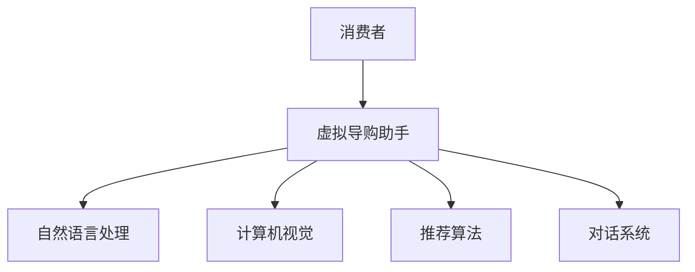

                 

# 虚拟导购助手：AI如何改变购物体验

在当今数字化、信息化快速发展的时代，购物方式正在发生深刻的变化。消费者不再仅仅依赖传统线下的购物体验，而是越来越多地通过线上渠道进行采购。这种转变带来了巨大的商业机会，也促使零售商们不断创新，利用人工智能技术提升购物体验。本文将探讨AI如何通过虚拟导购助手改变传统的购物体验，让购物变得更加智能、便捷和个性化。

## 1. 背景介绍

### 1.1 问题由来
随着电商平台的兴起和消费者习惯的变化，零售商们面临一个挑战：如何在海量商品中为消费者提供更个性化、更智能的购物体验。传统的导购方式依赖人工客服，效率低下且成本高昂。与此同时，消费者期望获得更加个性化、即时的购物建议。人工智能技术的出现为解决这一问题提供了新的解决方案。

### 1.2 问题核心关键点
虚拟导购助手是一种基于人工智能的购物辅助工具，通过自然语言处理(NLP)、计算机视觉和推荐算法等技术，为消费者提供个性化、实时的购物建议。它能够通过与消费者的交互，理解其需求，并根据需求提供相关商品的信息和推荐，大大提升了购物体验的便捷性和个性化程度。

## 2. 核心概念与联系

### 2.1 核心概念概述

为了更好地理解虚拟导购助手的原理和架构，本节将介绍几个关键概念：

- **自然语言处理（NLP）**：利用计算机处理和理解人类语言的技术。虚拟导购助手通过NLP技术实现与消费者的自然语言交互。

- **计算机视觉（CV）**：利用计算机处理和理解视觉信息的领域。虚拟导购助手通过CV技术识别人脸、商品图像等，提供视觉辅助的购物建议。

- **推荐算法**：基于用户历史行为和兴趣，推荐相关商品。虚拟导购助手通过推荐算法提供个性化的商品推荐。

- **对话系统**：用于模拟人类对话的计算机程序，虚拟导购助手通过对话系统实现与消费者的互动。

这些概念之间的联系可以通过以下Mermaid流程图来展示：



这个流程图展示了虚拟导购助手如何利用NLP、CV、推荐算法和对话系统，与消费者进行互动，并提供个性化的购物建议。

## 3. 核心算法原理 & 具体操作步骤

### 3.1 算法原理概述

虚拟导购助手的核心算法原理可以概括为以下几个步骤：

1. **自然语言理解（NLU）**：将消费者的自然语言输入转化为计算机可以处理的形式。
2. **意图识别（Intent Recognition）**：根据消费者的输入，识别其意图。
3. **实体识别（Entity Recognition）**：从消费者的输入中提取重要的实体信息，如商品名称、价格、颜色等。
4. **商品推荐**：根据消费者的意图和实体信息，使用推荐算法提供相关的商品建议。
5. **视觉识别**：使用计算机视觉技术，处理和理解消费者上传的商品图像。
6. **对话管理**：通过对话系统，实现与消费者的持续互动。

### 3.2 算法步骤详解

以下将详细介绍虚拟导购助手的工作流程：

**Step 1: 消费者输入**

消费者通过文本或语音的方式，向虚拟导购助手输入自己的需求和疑问。

**Step 2: 自然语言理解（NLU）**

虚拟导购助手使用NLP技术，将消费者的输入转换为计算机可处理的结构化信息。常见的NLU技术包括分词、词性标注、句法分析等。

**Step 3: 意图识别（Intent Recognition）**

虚拟导购助手根据消费者的输入，使用意图识别模型，确定消费者的具体需求。意图可以是“查找商品”、“比较价格”、“获取评论”等。

**Step 4: 实体识别（Entity Recognition）**

虚拟导购助手从消费者的输入中提取关键的实体信息，如商品名称、价格、颜色等。实体识别可以使用命名实体识别（NER）模型或关系抽取（Relation Extraction）模型。

**Step 5: 商品推荐**

虚拟导购助手根据消费者的意图和实体信息，使用推荐算法提供相关的商品建议。推荐算法可以基于协同过滤、内容过滤、深度学习等技术，结合消费者的历史行为和兴趣，生成个性化推荐。

**Step 6: 视觉识别**

如果消费者上传了商品图像，虚拟导购助手使用计算机视觉技术，处理和理解图像信息，提供视觉辅助的购物建议。

**Step 7: 对话管理**

虚拟导购助手通过对话系统，实现与消费者的持续互动。对话系统可以基于规则或深度学习技术，根据消费者的回复，调整后续的推荐和回复。

### 3.3 算法优缺点

虚拟导购助手的优点包括：

1. **个性化推荐**：通过分析消费者的历史行为和兴趣，提供个性化的购物建议，提升购物体验。
2. **实时交互**：消费者可以通过文本或语音与虚拟导购助手实时互动，获取即时反馈。
3. **降低成本**：相比人工客服，虚拟导购助手可以显著降低人力成本。
4. **24/7服务**：虚拟导购助手可以全年无休地为消费者提供服务。

同时，虚拟导购助手也存在一些缺点：

1. **技术复杂**：实现虚拟导购助手需要集成NLP、CV、推荐算法和对话系统等多项技术，技术实现复杂。
2. **数据隐私**：在处理消费者数据时，需要注意数据隐私和安全问题。
3. **上下文理解**：虚拟导购助手可能无法完全理解复杂的上下文，导致推荐不够准确。
4. **用户交互体验**：虚拟导购助手无法完全替代人工客服，在处理复杂问题时可能无法提供满意的服务。

### 3.4 算法应用领域

虚拟导购助手在多个领域都有广泛的应用，例如：

- **电商平台**：电商平台可以集成虚拟导购助手，提升消费者的购物体验。
- **零售商店**：零售商店可以在现场设置虚拟导购助手，为顾客提供即时咨询服务。
- **医疗健康**：虚拟导购助手可以用于健康商品推荐、疾病查询等。
- **旅游服务**：虚拟导购助手可以用于旅游商品的推荐和行程规划。

## 4. 数学模型和公式 & 详细讲解

### 4.1 数学模型构建

虚拟导购助手的核心数学模型包括自然语言处理模型、意图识别模型、实体识别模型和推荐模型。下面分别介绍这些模型的构建。

**自然语言处理模型**：

假设消费者的输入为 $x$，虚拟导购助手的输出为 $y$，则自然语言处理模型的目标是最小化损失函数 $L$：

$$
L = \frac{1}{N}\sum_{i=1}^N ||y_i - f(x_i)||^2
$$

其中，$f$ 为自然语言处理模型的预测函数。

**意图识别模型**：

假设消费者的意图为 $I$，虚拟导购助手的输出为 $I'$，则意图识别模型的目标是最小化损失函数 $L$：

$$
L = \frac{1}{N}\sum_{i=1}^N ||I_i - g(I_i', x_i)||^2
$$

其中，$g$ 为意图识别模型的预测函数。

**实体识别模型**：

假设消费者的输入中包含的实体为 $E$，虚拟导购助手的输出为 $E'$，则实体识别模型的目标是最小化损失函数 $L$：

$$
L = \frac{1}{N}\sum_{i=1}^N ||E_i - h(E_i', x_i)||^2
$$

其中，$h$ 为实体识别模型的预测函数。

**推荐模型**：

假设消费者对商品的评分向量为 $R$，虚拟导购助手的推荐向量为 $R'$，则推荐模型的目标是最小化损失函数 $L$：

$$
L = \frac{1}{N}\sum_{i=1}^N ||R_i - c(R_i', x_i)||^2
$$

其中，$c$ 为推荐模型的预测函数。

### 4.2 公式推导过程

以上公式分别对应了自然语言处理模型、意图识别模型、实体识别模型和推荐模型，每个模型的目标都是最小化损失函数。这些损失函数可以采用常见的最小二乘法、交叉熵等优化算法进行求解。

### 4.3 案例分析与讲解

以电商平台为例，假设消费者输入了“我想买一双适合跑鞋”，虚拟导购助手首先进行自然语言处理，识别出消费者的意图为“找跑鞋”，然后使用意图识别模型进行进一步验证。接着，虚拟导购助手通过实体识别模型，从消费者的输入中提取出“跑鞋”这个实体。最后，虚拟导购助手使用推荐模型，根据消费者的历史购买记录和兴趣，生成个性化的跑鞋推荐。

## 5. 项目实践：代码实例和详细解释说明

### 5.1 开发环境搭建

为了开发虚拟导购助手，需要准备以下开发环境：

1. **Python环境**：建议使用Python 3.8及以上版本。
2. **TensorFlow或PyTorch**：用于深度学习模型的训练和推理。
3. **自然语言处理库**：如NLTK、spaCy等。
4. **计算机视觉库**：如OpenCV、Pillow等。
5. **推荐系统库**：如LightFM、Surprise等。

### 5.2 源代码详细实现

以下是使用TensorFlow和PyTorch进行虚拟导购助手开发的示例代码：

```python
import tensorflow as tf
import torch
import nltk
from transformers import BertTokenizer, BertForIntentRecognition, BertForEntityRecognition, BertForRecommendation

# 自然语言处理模型
nltk.download('punkt')
tokenizer = BertTokenizer.from_pretrained('bert-base-cased')

# 意图识别模型
intent_model = BertForIntentRecognition.from_pretrained('bert-base-cased')
intent_model.compile(tf.keras.optimizers.Adam(), loss='categorical_crossentropy', metrics=['accuracy'])

# 实体识别模型
entity_model = BertForEntityRecognition.from_pretrained('bert-base-cased')
entity_model.compile(tf.keras.optimizers.Adam(), loss='categorical_crossentropy', metrics=['accuracy'])

# 推荐模型
recommendation_model = BertForRecommendation.from_pretrained('bert-base-cased')
recommendation_model.compile(tf.keras.optimizers.Adam(), loss='mse', metrics=['mae'])

# 训练模型
train_data = ...
train_labels = ...
train_model(tf.keras.Model(intent_model, entity_model, recommendation_model), train_data, train_labels)

# 推理过程
def predict(input_text):
    # 自然语言处理
    tokens = tokenizer.tokenize(input_text)
    # 意图识别
    intent = intent_model.predict(tokens)
    # 实体识别
    entities = entity_model.predict(tokens)
    # 推荐商品
    recommendation = recommendation_model.predict(tokens)
    return intent, entities, recommendation
```

### 5.3 代码解读与分析

以上代码展示了虚拟导购助手的主要模块和训练过程。

- `nltk` 用于分词和预处理。
- `BertTokenizer` 用于对输入文本进行分词。
- `BertForIntentRecognition`、`BertForEntityRecognition` 和 `BertForRecommendation` 分别用于意图识别、实体识别和商品推荐。
- `compile` 方法用于定义模型损失函数和优化器。
- `train_model` 方法用于训练模型。
- `predict` 方法用于进行推理预测。

## 6. 实际应用场景

### 6.1 电商平台

在电商平台上，虚拟导购助手可以帮助消费者快速找到所需商品，提升购物体验。例如，消费者可以输入“我想买一条裙子”，虚拟导购助手会根据其意图和兴趣，提供个性化的裙子推荐。

### 6.2 零售商店

在零售商店，虚拟导购助手可以提供个性化的商品查询和推荐服务。例如，消费者可以通过虚拟导购助手查询商品库存、获取商品评价等。

### 6.3 医疗健康

在医疗健康领域，虚拟导购助手可以提供健康商品的推荐和疾病查询服务。例如，消费者可以输入“我有什么药可以治感冒”，虚拟导购助手会根据其症状和历史记录，提供个性化的药品推荐。

### 6.4 未来应用展望

未来，虚拟导购助手将在更多领域得到应用，为消费者提供更全面、个性化的服务。例如，虚拟导购助手可以结合智能家居系统，提供定制化的家庭购物方案。此外，虚拟导购助手还可以与其他AI技术结合，如语音识别、情感分析等，提供更智能的购物体验。

## 7. 工具和资源推荐

### 7.1 学习资源推荐

为了深入了解虚拟导购助手的原理和实现，以下是一些推荐的学习资源：

1. **《深度学习与自然语言处理》**：该书详细介绍了自然语言处理和深度学习的基础知识。
2. **《TensorFlow实战Google AI》**：该书介绍了TensorFlow的实用技巧和最佳实践。
3. **《自然语言处理入门》**：该书介绍了自然语言处理的基本概念和算法。
4. **《推荐系统实战》**：该书介绍了推荐系统的基本原理和算法。

### 7.2 开发工具推荐

以下是一些推荐的工具：

1. **TensorFlow**：深度学习框架，提供了丰富的API和工具，适合构建虚拟导购助手。
2. **PyTorch**：深度学习框架，易于使用，适合研究和原型开发。
3. **NLTK**：自然语言处理库，提供了分词、词性标注等功能。
4. **spaCy**：自然语言处理库，提供了实体识别、命名实体识别等功能。
5. **OpenCV**：计算机视觉库，提供了图像处理和分析功能。

### 7.3 相关论文推荐

以下是一些推荐的相关论文：

1. **《基于深度学习的推荐系统》**：该论文介绍了深度学习在推荐系统中的应用。
2. **《自然语言处理综述》**：该论文综述了自然语言处理的基本方法和应用。
3. **《计算机视觉基础》**：该论文介绍了计算机视觉的基本概念和技术。

## 8. 总结：未来发展趋势与挑战

### 8.1 总结

本文系统地介绍了虚拟导购助手的原理和实现方法，探讨了其在电商、零售、医疗健康等领域的实际应用。虚拟导购助手通过自然语言处理、计算机视觉和推荐算法等技术，为消费者提供个性化、实时的购物建议，大大提升了购物体验的便捷性和个性化程度。

### 8.2 未来发展趋势

未来，虚拟导购助手将继续发展和创新，呈现以下几个趋势：

1. **个性化推荐**：通过更先进的推荐算法和更丰富的用户数据，提供更加精准的个性化推荐。
2. **多模态交互**：结合视觉、语音等多模态信息，提升用户交互体验。
3. **跨领域应用**：虚拟导购助手可以应用于更多领域，如旅游、教育等。
4. **智能决策**：结合机器学习、强化学习等技术，实现智能决策和动态调整。

### 8.3 面临的挑战

虚拟导购助手在发展过程中，也面临一些挑战：

1. **数据隐私**：在处理消费者数据时，需要确保数据隐私和安全。
2. **模型复杂度**：实现高质量的虚拟导购助手需要处理多模态数据和复杂的算法模型。
3. **上下文理解**：虚拟导购助手可能无法完全理解复杂的上下文，导致推荐不够准确。

### 8.4 研究展望

未来，虚拟导购助手的研究方向可能包括以下几个方面：

1. **多模态融合**：结合视觉、语音等多模态数据，提升用户交互体验。
2. **深度学习优化**：通过深度学习优化推荐算法，提高推荐精度。
3. **跨领域应用**：将虚拟导购助手应用于更多领域，如旅游、教育等。
4. **智能决策**：结合机器学习、强化学习等技术，实现智能决策和动态调整。

总之，虚拟导购助手作为一种新兴的AI技术，正逐步改变传统的购物体验，为消费者提供更加个性化、便捷的购物服务。未来，随着技术的不断进步和应用的不断扩展，虚拟导购助手将在更多领域发挥重要作用，推动零售业的发展和进步。

## 9. 附录：常见问题与解答

**Q1：虚拟导购助手是如何实现个性化推荐的？**

A: 虚拟导购助手通过分析消费者的历史行为和兴趣，使用推荐算法生成个性化的购物建议。推荐算法可以基于协同过滤、内容过滤、深度学习等技术，结合消费者的历史数据和兴趣，生成个性化的推荐。

**Q2：虚拟导购助手在处理数据隐私时需要注意哪些问题？**

A: 在处理消费者数据时，需要确保数据隐私和安全。虚拟导购助手应遵循数据隐私保护法规，如GDPR等，对消费者数据进行匿名化处理和加密存储。

**Q3：虚拟导购助手如何处理多模态数据？**

A: 虚拟导购助手可以结合视觉、语音等多模态数据，提升用户交互体验。例如，消费者可以通过上传商品图像，虚拟导购助手可以通过计算机视觉技术，提供视觉辅助的购物建议。

**Q4：虚拟导购助手在实现跨领域应用时需要注意哪些问题？**

A: 在实现跨领域应用时，需要考虑不同领域的数据特点和应用场景。例如，医疗健康领域的虚拟导购助手需要具备医疗知识，旅游领域的虚拟导购助手需要了解旅游信息等。

**Q5：虚拟导购助手在实现智能决策时需要注意哪些问题？**

A: 在实现智能决策时，需要考虑模型的可解释性和鲁棒性。虚拟导购助手应提供清晰的决策依据，避免出现错误决策。同时，需要确保模型在面对复杂和未知情况时，能够保持稳定和可靠。

---

作者：禅与计算机程序设计艺术 / Zen and the Art of Computer Programming

