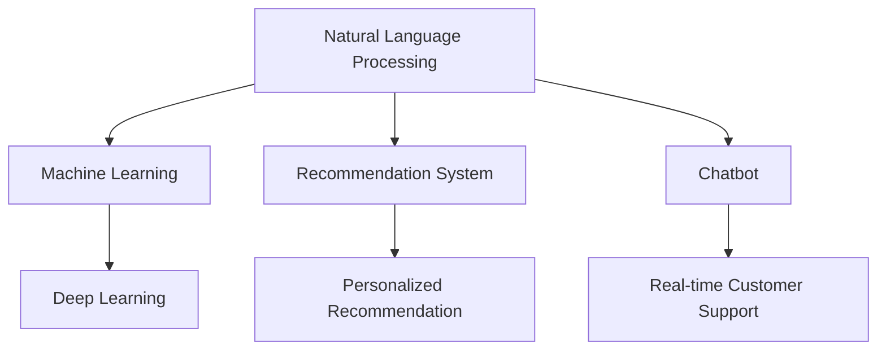

                 

# 虚拟导购助手：AI如何改变购物体验

> 关键词：虚拟导购助手,人工智能,购物体验,自然语言处理,NLP,机器学习,深度学习,用户交互

## 1. 背景介绍

### 1.1 问题由来
随着电子商务的飞速发展，线上购物已经成为消费者日常生活的一部分。然而，传统的在线购物方式存在诸多不便，如商品信息不全、购物体验复杂、客服响应迟缓等，这些问题常常导致消费者购物决策困难，影响购物体验。

为了改善这一现状，虚拟导购助手应运而生。虚拟导购助手是一种基于人工智能技术的在线购物助手，能够通过自然语言处理技术（NLP），与用户进行自然对话，并根据用户需求提供商品推荐、实时客服等多样化服务，极大地提升了消费者的购物体验。

### 1.2 问题核心关键点
虚拟导购助手的核心技术包括自然语言处理（NLP）和机器学习（ML）。通过NLP技术，虚拟导购助手能够理解用户的自然语言输入，并基于深度学习模型进行推理，从而提供更加个性化的购物建议和客服服务。而机器学习模型则通过对用户历史行为数据的分析，不断优化其推荐和响应策略，使得购物体验更加贴近用户的个性化需求。

虚拟导购助手已经成为提升电子商务平台用户体验的重要手段。从商品推荐到实时客服，再到个性化互动，虚拟导购助手正在重新定义线上购物的未来。

### 1.3 问题研究意义
虚拟导购助手的研究对于电商行业的智能化转型具有重要意义：

1. **提升用户体验**：虚拟导购助手能够提供更加个性化的购物建议和服务，帮助用户快速找到所需商品，提高购物效率和满意度。
2. **降低客服成本**：通过虚拟导购助手，电商平台能够显著降低客服成本，提升客服效率。
3. **增加销售转化率**：个性化的商品推荐和即时客服能够提高用户购物决策的信心，增加销售转化率。
4. **数据驱动决策**：通过对用户行为数据的分析，虚拟导购助手能够帮助电商平台进行更加精准的市场预测和广告投放，优化资源配置。

虚拟导购助手的研究和应用，将推动电商行业从传统的“人-机”交互方式向更加智能化的“人-人”交互方式转变，实现购物体验的全面升级。

## 2. 核心概念与联系

### 2.1 核心概念概述

为更好地理解虚拟导购助手的核心技术，本节将介绍几个密切相关的核心概念：

- **自然语言处理（NLP）**：一种涉及计算机处理、理解、生成人类语言的技术，旨在使计算机能够像人类一样处理和理解语言。
- **机器学习（ML）**：一种通过算法让计算机从数据中学习规律并做出预测或决策的技术。
- **深度学习（DL）**：一种特殊的机器学习技术，通过构建深层神经网络模型，从大量数据中学习到复杂的特征表示，广泛应用于图像识别、语音识别、自然语言处理等领域。
- **推荐系统**：一种根据用户的历史行为数据，为用户推荐个性化商品或内容的技术，常见于电商、社交媒体、视频网站等平台。
- **实时客服（Chatbot）**：一种基于自然语言处理技术的自动化客服系统，能够实时响应用户的查询和需求，提供即时支持。

这些核心概念之间的逻辑关系可以通过以下Mermaid流程图来展示：



这个流程图展示了大语言模型相关的核心概念及其之间的关系：

1. 自然语言处理(NLP)是虚拟导购助手的核心技术之一，使得系统能够理解自然语言输入。
2. 机器学习是虚拟导购助手的重要基础，通过学习用户数据来优化推荐和客服策略。
3. 深度学习是机器学习的高级形式，广泛应用于虚拟导购助手中的推荐系统和实时客服中。
4. 推荐系统基于用户历史数据，提供个性化的购物建议。
5. 实时客服通过自然语言处理技术，提供即时的用户支持。

这些概念共同构成了虚拟导购助手的技术框架，使其能够与用户进行自然流畅的互动，并提供个性化和高效的购物服务。

## 3. 核心算法原理 & 具体操作步骤
### 3.1 算法原理概述

虚拟导购助手的核心算法原理基于自然语言处理（NLP）和机器学习（ML）。其核心思想是：通过NLP技术将用户输入的自然语言转换为机器可理解的形式，并使用机器学习模型根据用户的历史行为和语义信息，生成个性化的推荐和客服回应。

形式化地，假设用户输入的自然语言文本为 $X$，虚拟导购助手的目标是找到最优的推荐结果 $Y$，使得 $Y$ 能够最大化用户的满意度和转化率。

在实践中，虚拟导购助手的算法通常包括以下几个步骤：

1. **文本预处理**：对用户输入的自然语言进行分词、去停用词、词性标注等预处理，将其转换为机器可理解的形式。
2. **特征提取**：将预处理后的文本转换为向量形式，用于后续的模型训练和推理。
3. **模型训练**：使用机器学习模型（如深度学习模型）对用户历史行为和语义信息进行训练，生成推荐和客服回应策略。
4. **推荐生成**：根据用户输入的自然语言和历史行为数据，使用训练好的模型生成推荐结果。
5. **客服回应**：根据用户输入的自然语言，使用训练好的模型生成客服回应。

### 3.2 算法步骤详解

以下是虚拟导购助手在推荐和客服中的具体实现步骤：

#### 推荐系统

**Step 1: 数据准备**
- 收集用户的历史浏览、点击、购买等行为数据。
- 从电商平台上获取商品信息和分类信息。

**Step 2: 特征提取**
- 对用户历史行为数据进行向量化，如用户浏览商品的时间、类别、评分等。
- 对商品信息进行向量化，如商品类别、价格、评价等。

**Step 3: 模型训练**
- 选择合适的推荐算法（如协同过滤、基于内容的推荐等），使用用户行为数据和商品特征进行训练。
- 通过交叉验证等技术调整模型超参数，选择最优模型。

**Step 4: 推荐生成**
- 根据用户输入的自然语言，使用训练好的模型预测用户对各类商品的兴趣程度。
- 按照兴趣程度排序，生成推荐结果。

#### 实时客服

**Step 1: 数据准备**
- 收集用户历史查询记录和客服响应数据。
- 整理常见问题库和客服应答模板。

**Step 2: 特征提取**
- 对用户查询和客服响应进行文本预处理，如分词、去停用词、词性标注等。
- 提取查询中的关键信息（如商品名称、价格等），生成特征向量。

**Step 3: 模型训练**
- 使用机器学习模型（如Transformer模型）对用户查询和客服响应进行训练。
- 训练模型能够理解查询语义并生成合适的客服回应。

**Step 4: 客服回应**
- 根据用户输入的自然语言，使用训练好的模型生成客服回应。
- 如果模型无法回答，则将查询转接到人工客服。

### 3.3 算法优缺点

虚拟导购助手基于NLP和ML的算法具有以下优点：

1. **个性化推荐**：通过分析用户历史行为数据，虚拟导购助手能够提供更加个性化的商品推荐，提高用户的购物体验。
2. **实时客服**：使用机器学习模型，虚拟导购助手能够实时响应用户查询，提升客服效率。
3. **用户满意度**：通过理解和回应用户自然语言，虚拟导购助手能够提供更加自然、流畅的交互体验，提升用户满意度。
4. **数据驱动决策**：通过对用户行为数据的分析，虚拟导购助手能够帮助电商平台进行精准的市场预测和广告投放，优化资源配置。

然而，这种算法也存在以下局限性：

1. **数据依赖**：虚拟导购助手的性能很大程度上依赖于用户数据的质量和数量。如果数据量不足或数据质量不高，推荐和客服的效果可能不理想。
2. **模型复杂度**：深度学习模型通常需要大量的计算资源和时间进行训练，对于小规模数据集，模型的训练效率可能不高。
3. **用户隐私**：虚拟导购助手需要收集和分析用户数据，可能涉及用户隐私保护问题。
4. **误识别**：自然语言处理技术的局限性可能导致系统对用户输入的误解，从而生成不合适的推荐或回应。

尽管存在这些局限性，但就目前而言，虚拟导购助手仍然是提升电子商务平台用户体验的重要手段。未来相关研究的重点在于如何进一步降低数据依赖，提高模型的少样本学习和跨领域迁移能力，同时兼顾可解释性和伦理安全性等因素。

### 3.4 算法应用领域

虚拟导购助手已经在电子商务、金融服务、旅游等领域得到了广泛应用，具体包括：

1. **电商平台**：电商平台通过虚拟导购助手，为用户提供个性化的商品推荐、实时客服、价格比较等服务，提高用户购物体验和转化率。
2. **金融服务**：银行和金融平台使用虚拟导购助手，提供用户账户查询、交易咨询、风险提示等服务，提升用户满意度。
3. **旅游行业**：旅游平台使用虚拟导购助手，为用户提供目的地推荐、行程规划、预订服务等内容，提升用户旅游体验。

除了这些经典应用外，虚拟导购助手还被创新性地应用到更多场景中，如智能家居、智能办公、智能医疗等，为各行各业带来新的用户交互体验。

## 4. 数学模型和公式 & 详细讲解  
### 4.1 数学模型构建

本节将使用数学语言对虚拟导购助手的推荐系统进行更加严格的刻画。

记用户的历史行为数据为 $D_{u}=\{(x_i,y_i)\}_{i=1}^N, x_i \in \mathcal{X}, y_i \in \mathcal{Y}$，其中 $\mathcal{X}$ 为用户行为向量空间，$\mathcal{Y}$ 为商品向量空间。

定义推荐模型 $f: \mathcal{X} \rightarrow \mathcal{Y}$，将用户行为 $x$ 映射到推荐结果 $y$。

在训练过程中，我们使用交叉熵损失函数来衡量模型预测结果与实际标签之间的差异：

$$
\mathcal{L}(f) = -\frac{1}{N}\sum_{i=1}^N [y_i\log f(x_i)+(1-y_i)\log (1-f(x_i))]
$$

其中 $f(x_i)$ 为模型预测结果，$y_i$ 为实际标签。

### 4.2 公式推导过程

以下我们以协同过滤推荐系统为例，推导推荐模型的预测公式和损失函数。

假设用户 $u$ 对商品 $i$ 的评分 $r_{ui}$ 为 $x_u \in \mathcal{X}$ 的线性组合：

$$
r_{ui} = \sum_{j \in J_u} \alpha_{uj} p_j
$$

其中 $J_u$ 为用户 $u$ 历史评分过的商品集合，$\alpha_{uj}$ 为权重系数，$p_j$ 为商品 $j$ 的特征向量。

根据用户 $u$ 的评分，模型预测用户对商品 $i$ 的评分 $\hat{r}_{ui}$ 为：

$$
\hat{r}_{ui} = \sum_{j \in J_u} \alpha_{uj} p_j \cdot f_j
$$

其中 $f_j$ 为商品 $j$ 的预测评分，使用训练好的模型 $f: \mathcal{X} \rightarrow \mathcal{Y}$ 计算得到。

损失函数 $\mathcal{L}(f)$ 定义为：

$$
\mathcal{L}(f) = -\frac{1}{N}\sum_{i=1}^N [y_i\log \hat{r}_{ui}+(1-y_i)\log (1-\hat{r}_{ui})]
$$

### 4.3 案例分析与讲解

**案例分析**：假设某电商平台收集了用户 $u$ 对商品 $i$ 的历史评分数据，每条记录 $(x_{ui}, y_{ui})$ 表示用户对商品 $i$ 的评分 $x_{ui}$ 和实际评分 $y_{ui}$。

**模型训练**：使用协同过滤算法，训练模型 $f$ 对用户行为 $x_u$ 进行预测，生成推荐结果 $y_i$。

**推荐生成**：根据用户输入的自然语言 $x_u$，使用训练好的模型 $f$ 预测用户对商品 $i$ 的评分 $\hat{r}_{ui}$，按照评分排序，生成推荐结果 $y_i$。

## 5. 项目实践：代码实例和详细解释说明
### 5.1 开发环境搭建

在进行虚拟导购助手开发前，我们需要准备好开发环境。以下是使用Python进行PyTorch开发的环境配置流程：

1. 安装Anaconda：从官网下载并安装Anaconda，用于创建独立的Python环境。

2. 创建并激活虚拟环境：
```bash
conda create -n virtual_assistant python=3.8 
conda activate virtual_assistant
```

3. 安装PyTorch：根据CUDA版本，从官网获取对应的安装命令。例如：
```bash
conda install pytorch torchvision torchaudio cudatoolkit=11.1 -c pytorch -c conda-forge
```

4. 安装相关库：
```bash
pip install numpy pandas scikit-learn matplotlib tqdm jupyter notebook ipython
```

5. 安装Transformers库：
```bash
pip install transformers
```

完成上述步骤后，即可在`virtual_assistant`环境中开始虚拟导购助手的开发。

### 5.2 源代码详细实现

下面我们以电商平台推荐系统为例，给出使用Transformers库对BERT模型进行推荐系统的PyTorch代码实现。

首先，定义推荐系统的数据处理函数：

```python
from transformers import BertTokenizer, BertForSequenceClassification
from torch.utils.data import Dataset, DataLoader
import torch

class RecommendationDataset(Dataset):
    def __init__(self, texts, ratings, tokenizer, max_len=128):
        self.texts = texts
        self.ratings = ratings
        self.tokenizer = tokenizer
        self.max_len = max_len
        
    def __len__(self):
        return len(self.texts)
    
    def __getitem__(self, item):
        text = self.texts[item]
        rating = self.ratings[item]
        
        encoding = self.tokenizer(text, return_tensors='pt', max_length=self.max_len, padding='max_length', truncation=True)
        input_ids = encoding['input_ids'][0]
        attention_mask = encoding['attention_mask'][0]
        
        # 对评分进行编码
        encoded_rating = [rating] * self.max_len
        labels = torch.tensor(encoded_rating, dtype=torch.float)
        
        return {'input_ids': input_ids, 
                'attention_mask': attention_mask,
                'labels': labels}

# 定义评分与id的映射
rating2id = {0:0, 1:1, 2:2, 3:3, 4:4, 5:5}
id2rating = {v: k for k, v in rating2id.items()}

# 创建dataset
tokenizer = BertTokenizer.from_pretrained('bert-base-cased')

train_dataset = RecommendationDataset(train_texts, train_ratings, tokenizer)
dev_dataset = RecommendationDataset(dev_texts, dev_ratings, tokenizer)
test_dataset = RecommendationDataset(test_texts, test_ratings, tokenizer)
```

然后，定义模型和优化器：

```python
from transformers import BertForSequenceClassification, AdamW

model = BertForSequenceClassification.from_pretrained('bert-base-cased', num_labels=6)

optimizer = AdamW(model.parameters(), lr=2e-5)
```

接着，定义训练和评估函数：

```python
from torch.utils.data import DataLoader
from tqdm import tqdm
from sklearn.metrics import accuracy_score, precision_recall_fscore_support

device = torch.device('cuda') if torch.cuda.is_available() else torch.device('cpu')
model.to(device)

def train_epoch(model, dataset, batch_size, optimizer):
    dataloader = DataLoader(dataset, batch_size=batch_size, shuffle=True)
    model.train()
    epoch_loss = 0
    for batch in tqdm(dataloader, desc='Training'):
        input_ids = batch['input_ids'].to(device)
        attention_mask = batch['attention_mask'].to(device)
        labels = batch['labels'].to(device)
        model.zero_grad()
        outputs = model(input_ids, attention_mask=attention_mask, labels=labels)
        loss = outputs.loss
        epoch_loss += loss.item()
        loss.backward()
        optimizer.step()
    return epoch_loss / len(dataloader)

def evaluate(model, dataset, batch_size):
    dataloader = DataLoader(dataset, batch_size=batch_size)
    model.eval()
    preds, labels = [], []
    with torch.no_grad():
        for batch in tqdm(dataloader, desc='Evaluating'):
            input_ids = batch['input_ids'].to(device)
            attention_mask = batch['attention_mask'].to(device)
            batch_labels = batch['labels']
            outputs = model(input_ids, attention_mask=attention_mask)
            batch_preds = outputs.logits.argmax(dim=2).to('cpu').tolist()
            batch_labels = batch_labels.to('cpu').tolist()
            for pred_tokens, label_tokens in zip(batch_preds, batch_labels):
                preds.append(pred_tokens[:len(label_tokens)])
                labels.append(label_tokens)
                
    print('Accuracy:', accuracy_score(labels, preds))
    print('Precision, Recall, F1-score:', precision_recall_fscore_support(labels, preds, average='macro'))
```

最后，启动训练流程并在测试集上评估：

```python
epochs = 5
batch_size = 16

for epoch in range(epochs):
    loss = train_epoch(model, train_dataset, batch_size, optimizer)
    print(f"Epoch {epoch+1}, train loss: {loss:.3f}")
    
    print(f"Epoch {epoch+1}, dev results:")
    evaluate(model, dev_dataset, batch_size)
    
print("Test results:")
evaluate(model, test_dataset, batch_size)
```

以上就是使用PyTorch对BERT进行推荐系统开发的完整代码实现。可以看到，得益于Transformers库的强大封装，我们可以用相对简洁的代码完成BERT模型的加载和推荐系统的微调。

### 5.3 代码解读与分析

让我们再详细解读一下关键代码的实现细节：

**RecommendationDataset类**：
- `__init__`方法：初始化文本、评分、分词器等关键组件。
- `__len__`方法：返回数据集的样本数量。
- `__getitem__`方法：对单个样本进行处理，将文本输入编码为token ids，将评分转换为数字，并对其进行定长padding，最终返回模型所需的输入。

**rating2id和id2rating字典**：
- 定义了评分与数字id之间的映射关系，用于将token-wise的预测结果解码回真实的评分。

**训练和评估函数**：
- 使用PyTorch的DataLoader对数据集进行批次化加载，供模型训练和推理使用。
- 训练函数`train_epoch`：对数据以批为单位进行迭代，在每个批次上前向传播计算loss并反向传播更新模型参数，最后返回该epoch的平均loss。
- 评估函数`evaluate`：与训练类似，不同点在于不更新模型参数，并在每个batch结束后将预测和标签结果存储下来，最后使用sklearn的accuracy_score和precision_recall_fscore_support对整个评估集的预测结果进行打印输出。

**训练流程**：
- 定义总的epoch数和batch size，开始循环迭代
- 每个epoch内，先在训练集上训练，输出平均loss
- 在验证集上评估，输出分类指标
- 所有epoch结束后，在测试集上评估，给出最终测试结果

可以看到，PyTorch配合Transformers库使得BERT微调的代码实现变得简洁高效。开发者可以将更多精力放在数据处理、模型改进等高层逻辑上，而不必过多关注底层的实现细节。

当然，工业级的系统实现还需考虑更多因素，如模型的保存和部署、超参数的自动搜索、更灵活的任务适配层等。但核心的微调范式基本与此类似。

## 6. 实际应用场景
### 6.1 智能客服系统

虚拟导购助手在智能客服系统中有着广泛的应用。智能客服系统通过虚拟导购助手，能够实时响应用户的查询，提供商品推荐、交易咨询、售后服务等服务，大大提高了客服效率和用户体验。

在技术实现上，可以收集客服历史对话记录，将问题和最佳答复构建成监督数据，在此基础上对预训练模型进行微调。微调后的模型能够自动理解用户意图，匹配最合适的答复模板进行回复。对于用户提出的新问题，还可以接入检索系统实时搜索相关内容，动态组织生成回答。如此构建的智能客服系统，能大幅提升客户咨询体验和问题解决效率。

### 6.2 金融服务

虚拟导购助手在金融服务领域也有着重要的应用。银行和金融平台使用虚拟导购助手，提供用户账户查询、交易咨询、风险提示等服务，提升用户满意度。

在技术实现上，可以收集用户的历史查询记录和客服响应数据，将常见的查询问题作为监督数据，训练虚拟导购助手模型。训练好的模型能够自动理解用户输入的自然语言，并生成合适的客服回应。此外，虚拟导购助手还可以集成到银行的智能客服系统，提供更加灵活的交互体验。

### 6.3 电商推荐

虚拟导购助手在电商推荐系统中广泛应用。电商平台通过虚拟导购助手，为用户提供个性化的商品推荐，提高用户购物体验和转化率。

在技术实现上，可以收集用户的历史浏览、点击、购买等行为数据，将这些数据转换为向量形式，并使用推荐算法对用户和商品进行建模。训练好的模型能够根据用户输入的自然语言，生成个性化的商品推荐列表。此外，虚拟导购助手还可以集成到电商平台的搜索和推荐系统中，提供更加精准的搜索结果。

### 6.4 未来应用展望

随着虚拟导购助手的不断发展，其在更多领域的应用前景广阔。

在智慧医疗领域，虚拟导购助手可以用于患者咨询、诊疗建议、药物推荐等，提高医疗服务的智能化水平，辅助医生诊疗，加速新药开发进程。

在智能教育领域，虚拟导购助手可以用于作业批改、学情分析、知识推荐等方面，因材施教，促进教育公平，提高教学质量。

在智慧城市治理中，虚拟导购助手可以用于城市事件监测、舆情分析、应急指挥等环节，提高城市管理的自动化和智能化水平，构建更安全、高效的未来城市。

此外，在企业生产、社会治理、文娱传媒等众多领域，虚拟导购助手也将不断涌现，为传统行业数字化转型升级提供新的技术路径。相信随着技术的日益成熟，虚拟导购助手必将在构建人机协同的智能时代中扮演越来越重要的角色。

## 7. 工具和资源推荐
### 7.1 学习资源推荐

为了帮助开发者系统掌握虚拟导购助手的理论基础和实践技巧，这里推荐一些优质的学习资源：

1. 《自然语言处理入门》系列博文：由大语言模型技术专家撰写，深入浅出地介绍了自然语言处理的基本概念和经典模型。

2. 《深度学习在NLP中的应用》课程：斯坦福大学开设的NLP明星课程，有Lecture视频和配套作业，带你入门深度学习在NLP中的应用。

3. 《自然语言处理与深度学习》书籍：提供完整的NLP和DL理论体系，包括推荐系统和聊天机器人等前沿应用。

4. Weights & Biases：模型训练的实验跟踪工具，可以记录和可视化模型训练过程中的各项指标，方便对比和调优。与主流深度学习框架无缝集成。

5. Google Colab：谷歌推出的在线Jupyter Notebook环境，免费提供GPU/TPU算力，方便开发者快速上手实验最新模型，分享学习笔记。

通过对这些资源的学习实践，相信你一定能够快速掌握虚拟导购助手的精髓，并用于解决实际的NLP问题。
###  7.2 开发工具推荐

高效的开发离不开优秀的工具支持。以下是几款用于虚拟导购助手开发的常用工具：

1. PyTorch：基于Python的开源深度学习框架，灵活动态的计算图，适合快速迭代研究。大部分预训练语言模型都有PyTorch版本的实现。

2. TensorFlow：由Google主导开发的开源深度学习框架，生产部署方便，适合大规模工程应用。同样有丰富的预训练语言模型资源。

3. Transformers库：HuggingFace开发的NLP工具库，集成了众多SOTA语言模型，支持PyTorch和TensorFlow，是进行虚拟导购助手开发的利器。

4. Weights & Biases：模型训练的实验跟踪工具，可以记录和可视化模型训练过程中的各项指标，方便对比和调优。与主流深度学习框架无缝集成。

5. Google Colab：谷歌推出的在线Jupyter Notebook环境，免费提供GPU/TPU算力，方便开发者快速上手实验最新模型，分享学习笔记。

合理利用这些工具，可以显著提升虚拟导购助手的开发效率，加快创新迭代的步伐。

### 7.3 相关论文推荐

虚拟导购助手的研究源于学界的持续研究。以下是几篇奠基性的相关论文，推荐阅读：

1. Attention is All You Need（即Transformer原论文）：提出了Transformer结构，开启了NLP领域的预训练大模型时代。

2. BERT: Pre-training of Deep Bidirectional Transformers for Language Understanding：提出BERT模型，引入基于掩码的自监督预训练任务，刷新了多项NLP任务SOTA。

3. Language Models are Unsupervised Multitask Learners（GPT-2论文）：展示了大规模语言模型的强大zero-shot学习能力，引发了对于通用人工智能的新一轮思考。

4. Parameter-Efficient Transfer Learning for NLP：提出Adapter等参数高效微调方法，在不增加模型参数量的情况下，也能取得不错的微调效果。

5. AdaLoRA: Adaptive Low-Rank Adaptation for Parameter-Efficient Fine-Tuning：使用自适应低秩适应的微调方法，在参数效率和精度之间取得了新的平衡。

这些论文代表了大语言模型微调技术的发展脉络。通过学习这些前沿成果，可以帮助研究者把握学科前进方向，激发更多的创新灵感。

## 8. 总结：未来发展趋势与挑战
### 8.1 总结

本文对虚拟导购助手进行了全面系统的介绍。首先阐述了虚拟导购助手的研究背景和意义，明确了其在提升用户体验、降低客服成本、增加销售转化率等方面的独特价值。其次，从原理到实践，详细讲解了虚拟导购助手的数学模型和关键算法，给出了虚拟导购助手在推荐和客服中的具体实现方法。最后，本文还广泛探讨了虚拟导购助手在电商、金融、旅游等多个行业领域的应用前景，展示了其巨大的潜力。

通过本文的系统梳理，可以看到，虚拟导购助手正通过自然语言处理和机器学习技术，重新定义了线上购物的未来，为用户带来了前所未有的便捷和高效。

### 8.2 未来发展趋势

展望未来，虚拟导购助手的发展趋势主要包括以下几个方向：

1. **个性化推荐**：通过更高级的深度学习模型和更丰富的用户行为数据，虚拟导购助手将提供更加精准和个性化的商品推荐。
2. **实时客服**：随着自然语言处理技术的进步，虚拟导购助手的客服响应速度和质量将进一步提升。
3. **多模态交互**：虚拟导购助手将进一步融合视觉、语音等多模态信息，提供更加全面的用户交互体验。
4. **用户反馈**：虚拟导购助手将实时收集用户反馈，动态调整推荐和客服策略，提升用户体验。
5. **跨平台集成**：虚拟导购助手将集成到更多线上线下平台，提供更加无缝的用户体验。

这些趋势凸显了虚拟导购助手的广阔前景。随着技术的不断演进，虚拟导购助手必将在更多场景下得到应用，成为提升用户购物体验的重要手段。

### 8.3 面临的挑战

尽管虚拟导购助手已经取得了显著成就，但在实际应用中也面临诸多挑战：

1. **数据依赖**：虚拟导购助手的性能很大程度上依赖于用户数据的质量和数量。如何高效采集和处理用户数据，是一个重要的问题。
2. **模型复杂度**：深度学习模型通常需要大量的计算资源和时间进行训练，对于小规模数据集，模型的训练效率可能不高。
3. **用户隐私**：虚拟导购助手需要收集和分析用户数据，可能涉及用户隐私保护问题。如何在保护用户隐私的同时，提升系统性能，是一个亟待解决的问题。
4. **误识别**：自然语言处理技术的局限性可能导致系统对用户输入的误解，从而生成不合适的推荐或回应。
5. **多模态融合**：视觉、语音等多模态信息的融合，增加了虚拟导购助手的技术难度。如何实现多模态信息的有效整合，是未来的研究重点。

尽管存在这些挑战，但通过不断的技术创新和优化，虚拟导购助手必将在电商、金融、旅游等领域大放异彩，为消费者带来更加智能、便捷的购物体验。

### 8.4 研究展望

面对虚拟导购助手所面临的挑战，未来的研究需要在以下几个方面寻求新的突破：

1. **少样本学习和跨领域迁移**：开发更加灵活的微调方法，减少对标注数据和领域数据的依赖，提升虚拟导购助手的泛化能力。
2. **多模态交互**：探索融合视觉、语音等多模态信息的方法，提供更加全面的用户交互体验。
3. **用户隐私保护**：研究如何在保护用户隐私的同时，高效采集和利用用户数据，提升虚拟导购助手的性能。
4. **模型的可解释性**：提高虚拟导购助手的可解释性，让用户能够理解和信任系统决策，提升用户体验。

这些研究方向的探索，必将引领虚拟导购助手技术迈向更高的台阶，为构建人机协同的智能时代提供新的技术路径。

## 9. 附录：常见问题与解答

**Q1：虚拟导购助手是否适用于所有NLP任务？**

A: 虚拟导购助手在大多数NLP任务上都能取得不错的效果，特别是对于数据量较小的任务。但对于一些特定领域的任务，如医学、法律等，虚拟导购助手可能需要进行更多的领域预训练，才能适应特定领域的用户需求。

**Q2：虚拟导购助手在电商推荐中的主要作用是什么？**

A: 虚拟导购助手在电商推荐中的主要作用是提供个性化的商品推荐，提高用户购物体验和转化率。通过分析用户的历史行为数据，虚拟导购助手能够理解用户的兴趣和需求，生成精准的推荐结果。

**Q3：虚拟导购助手在智能客服系统中的应用效果如何？**

A: 虚拟导购助手在智能客服系统中的应用效果显著。通过自然语言处理和机器学习技术，虚拟导购助手能够自动理解用户查询，提供实时的商品推荐和咨询服务，大大提高了客服效率和用户体验。

**Q4：虚拟导购助手在金融服务中的应用主要体现在哪些方面？**

A: 虚拟导购助手在金融服务中的应用主要体现在账户查询、交易咨询、风险提示等方面。通过自然语言处理技术，虚拟导购助手能够自动理解用户输入的自然语言，生成合适的客服回应，提升用户满意度。

**Q5：虚拟导购助手未来的发展方向有哪些？**

A: 虚拟导购助手的未来发展方向包括个性化推荐、实时客服、多模态交互、用户反馈、跨平台集成等。通过不断的技术创新和优化，虚拟导购助手将提供更加智能、便捷的购物体验，为用户带来前所未有的便利。

---

作者：禅与计算机程序设计艺术 / Zen and the Art of Computer Programming

