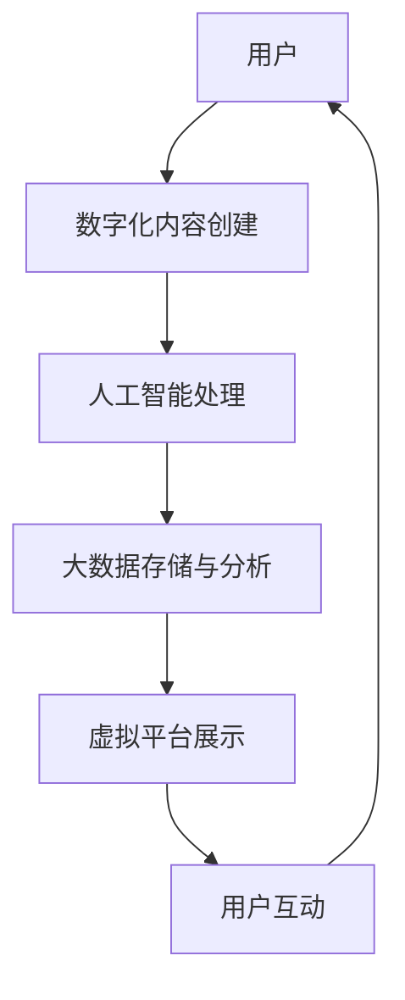

                 

## 1. 背景介绍

在数字化时代，文化和文明的交流已经超越了传统的物理边界。虚拟文化之旅，即通过数字化平台，实现全球各地文化的深度交流与互动，已经成为连接人类文明的重要桥梁。这一现象背后，是人工智能技术和大数据技术的驱动。虚拟文化之旅不仅丰富了人们的生活，也促进了全球文明的融合与互鉴。本文将探讨这一新兴平台的核心概念、技术原理和应用实践，以期为全球文明交流提供新的思路和工具。

## 2. 核心概念与联系

### 2.1 核心概念概述

虚拟文化之旅的核心概念包括虚拟平台、文化交流、人工智能、大数据、虚拟现实（VR）、增强现实（AR）等。这些概念相互交织，共同构成了这一新兴平台的框架。

- **虚拟平台**：指通过互联网、移动互联网等数字化技术搭建的交流平台，支持文化内容的展示、分享与互动。
- **文化交流**：指不同地域、民族、文化之间的沟通、理解和融合。
- **人工智能**：指模拟人类智能过程的技术，包括机器学习、自然语言处理、计算机视觉等。
- **大数据**：指大规模的数据集，用于分析和挖掘文化交流过程中的信息。
- **虚拟现实（VR）**：指通过模拟三维环境，使用户沉浸在虚拟世界中的技术。
- **增强现实（AR）**：指将虚拟信息叠加在现实世界中，增强用户对环境的感知。

这些概念通过以下Mermaid流程图呈现：

```mermaid
graph TD
    A[虚拟平台] --> B[人工智能]
    B --> C[大数据]
    C --> D[文化交流]
    D --> E[虚拟现实 (VR)]
    E --> F[增强现实 (AR)]
```

### 2.2 核心概念原理和架构的 Mermaid 流程图



## 3. 核心算法原理 & 具体操作步骤

### 3.1 算法原理概述

虚拟文化之旅的核心算法原理主要包括以下几个方面：

- **自然语言处理（NLP）**：通过文本分析和语义理解，实现跨文化交流的准确性和流畅性。
- **计算机视觉（CV）**：通过图像和视频分析，增强用户对文化内容的感知和互动。
- **推荐算法**：通过用户行为和偏好分析，实现个性化文化内容的推荐。

### 3.2 算法步骤详解

1. **内容创建与上传**：用户通过虚拟平台创建或上传文化内容，如文字、图片、视频等。
2. **自然语言处理**：平台使用NLP技术对内容进行语义分析和情感识别，生成标签和分类。
3. **计算机视觉**：平台对图片和视频内容进行图像识别和视频分析，增强用户互动体验。
4. **推荐算法**：平台根据用户行为和偏好，使用推荐算法推荐相关文化内容。
5. **互动与交流**：用户通过平台进行互动交流，分享和讨论文化内容。

### 3.3 算法优缺点

**优点**：
- **个性化推荐**：基于用户行为和偏好的推荐算法，提升用户满意度。
- **跨文化交流**：自然语言处理和计算机视觉技术，实现不同语言和文化背景下的高效沟通。
- **动态更新**：通过大数据分析，平台内容能够不断更新和优化。

**缺点**：
- **数据隐私**：用户上传的文化内容可能涉及隐私问题。
- **算法偏见**：推荐算法可能存在偏见，影响用户体验。
- **技术门槛**：开发和维护虚拟平台的技术门槛较高。

### 3.4 算法应用领域

虚拟文化之旅的应用领域广泛，涵盖以下几个方面：

- **教育**：通过虚拟平台，实现全球范围内的教育资源共享和跨文化交流。
- **旅游**：虚拟现实和增强现实技术，提供沉浸式的旅游体验。
- **文化保护**：数字化平台，保存和传播濒危文化遗产。
- **文化创意**：用户可以通过平台进行文化内容的创作和分享，激发创意。
- **跨文化合作**：不同文化背景的艺术家、学者进行合作创作。

## 4. 数学模型和公式 & 详细讲解 & 举例说明

### 4.1 数学模型构建

虚拟文化之旅的数学模型主要包括以下几个部分：

- **自然语言处理**：基于Transformer模型，使用自监督预训练和监督学习进行语义分析。
- **计算机视觉**：使用卷积神经网络（CNN）和循环神经网络（RNN）进行图像和视频分析。
- **推荐算法**：基于协同过滤、内容过滤和混合过滤等方法，进行文化内容的推荐。

### 4.2 公式推导过程

以自然语言处理为例，Transformer模型的核心公式如下：

$$
\mathbf{Z} = \mathbf{X} \cdot W_{xi} + \mathbf{B}_{xi}
$$
$$
\mathbf{Z} = \mathbf{Z} \cdot W_{i} + \mathbf{B}_i
$$
$$
\mathbf{Y} = \mathbf{Z} \cdot W_{y} + \mathbf{B}_y
$$

其中，$\mathbf{X}$ 为输入文本，$\mathbf{Z}$ 为中间层表示，$\mathbf{Y}$ 为输出文本。$W_{xi}, W_{i}, W_{y}$ 为权重矩阵，$\mathbf{B}_{xi}, \mathbf{B}_i, \mathbf{B}_y$ 为偏置向量。

### 4.3 案例分析与讲解

以Google Translate为例，Google Translate使用了Transformer模型进行机器翻译。通过自监督预训练和监督学习，模型能够准确地翻译不同语言之间的文本，从而实现跨文化交流。

## 5. 项目实践：代码实例和详细解释说明

### 5.1 开发环境搭建

开发虚拟文化之旅平台需要以下环境：

- **编程语言**：Python
- **框架**：Flask、TensorFlow、Keras、NLTK
- **数据库**：MySQL
- **服务器**：AWS或Google Cloud

安装步骤：
1. 安装Python和相关库：
```
pip install flask tensorflow keras nltk
```
2. 创建数据库：
```
CREATE DATABASE virtual_travel;
```
3. 搭建Flask应用：
```python
from flask import Flask, request, jsonify
app = Flask(__name__)
```

### 5.2 源代码详细实现

以下是一个简单的虚拟文化之旅平台代码实现：

```python
@app.route('/upload', methods=['POST'])
def upload_content():
    file = request.files['file']
    # 上传内容
    content = save_content(file)
    # 分析内容
    analysis = analyze_content(content)
    # 推荐内容
    recommendations = recommend_content(analysis)
    # 返回结果
    return jsonify({'content': content, 'analysis': analysis, 'recommendations': recommendations})

def save_content(file):
    # 保存上传的内容
    # ...
    return content

def analyze_content(content):
    # 分析上传的内容
    # ...
    return analysis

def recommend_content(analysis):
    # 推荐相关内容
    # ...
    return recommendations
```

### 5.3 代码解读与分析

代码实现主要包括三个步骤：

1. **上传内容**：通过Flask接收用户上传的内容，并保存到服务器。
2. **分析内容**：使用NLP和CV技术对上传的内容进行分析，生成文本标签和图像特征。
3. **推荐内容**：根据用户行为和内容特征，使用推荐算法推荐相关文化内容。

### 5.4 运行结果展示

平台运行后，用户可以通过Web界面上传内容，平台分析并推荐相关文化内容，形成跨文化交流的闭环。

## 6. 实际应用场景

### 6.1 教育

虚拟文化之旅平台可以在全球教育领域发挥重要作用。例如，通过虚拟平台共享教育资源，提供跨文化的在线课程和讨论，增强学生的国际视野。

### 6.2 旅游

虚拟现实和增强现实技术，可以为用户提供沉浸式的旅游体验。用户可以在虚拟环境中游览世界各地的名胜古迹，了解不同文化的历史和习俗。

### 6.3 文化保护

数字化平台可以保存和传播濒危文化遗产，如敦煌莫高窟、大英博物馆等。用户可以在平台上浏览和研究这些宝贵的文化资源。

### 6.4 文化创意

用户可以通过虚拟平台进行文化内容的创作和分享，激发创意，推动文化创新。例如，用户可以创作虚拟现实体验，或制作增强现实游戏，传播自己独特的文化理念。

### 6.5 跨文化合作

虚拟平台可以连接不同文化背景的艺术家、学者，进行合作创作，推动跨文化的交流与融合。

## 7. 工具和资源推荐

### 7.1 学习资源推荐

1. **《深度学习》by Ian Goodfellow**：介绍深度学习的理论基础和实践方法。
2. **《自然语言处理综论》by Jurafsky & Martin**：讲解NLP的基础知识和最新技术。
3. **Coursera - 机器学习课程**：由斯坦福大学教授Andrew Ng开设的机器学习课程，系统讲解机器学习的理论和实践。
4. **Udacity - 深度学习纳米学位**：提供深度学习技术的实战课程，包括自然语言处理和计算机视觉。
5. **Kaggle**：提供大量NLP和CV领域的竞赛和数据集，适合实战练习。

### 7.2 开发工具推荐

1. **Flask**：Python的Web开发框架，适合搭建虚拟平台。
2. **TensorFlow**：强大的深度学习框架，支持自然语言处理和计算机视觉。
3. **Keras**：基于TensorFlow的高层API，适合快速开发和原型设计。
4. **NLTK**：自然语言处理工具包，提供文本分析功能。
5. **Python3**：Python 3.x版本，适合进行数据分析和处理。

### 7.3 相关论文推荐

1. **Attention is All You Need**：Transformer模型的原理和应用。
2. **Convolutional Neural Networks for Human Language Processing**：CNN在NLP中的应用。
3. **Deep Learning for NLP**：深度学习在NLP中的发展和应用。
4. **Collaborative Filtering for Recommender Systems**：协同过滤算法的原理和实现。
5. **Semantic Analysis of Texts with Convolutional Neural Networks**：使用CNN进行文本语义分析。

## 8. 总结：未来发展趋势与挑战

### 8.1 研究成果总结

虚拟文化之旅平台通过数字化技术，实现了跨文化交流的便捷性和深度性。自然语言处理和计算机视觉技术的融合，使得平台具备强大的内容分析和推荐能力。

### 8.2 未来发展趋势

- **多模态融合**：虚拟平台将更多模态（如语音、视频、AR等）纳入交流过程，提供更丰富的用户体验。
- **AI生成内容**：利用生成对抗网络（GAN）等技术，生成高质量的文化内容，增强平台内容多样性。
- **社交网络整合**：将社交网络功能融入平台，实现用户间的互动和交流。
- **个性化推荐算法**：通过用户行为和内容特征，实现更精准、更个性化的内容推荐。
- **情感分析与情感生成**：使用情感分析技术，理解用户情感，提供情感支持的交流环境。

### 8.3 面临的挑战

- **技术门槛**：开发和维护虚拟平台的复杂性和技术门槛较高，需要跨学科知识。
- **数据隐私**：用户上传的内容可能涉及隐私问题，如何保护用户隐私是一大挑战。
- **内容质量**：高质量的文化内容供给不足，平台需持续投入人力和资源进行内容创作。
- **算法偏见**：推荐算法可能存在偏见，影响用户体验。

### 8.4 研究展望

- **跨文化融合**：推动不同文化之间的深度交流和融合，促进文化创新与发展。
- **社会影响**：评估虚拟平台对社会文化的影响，避免负面效应。
- **技术创新**：持续探索新技术，提升虚拟平台的性能和用户体验。

## 9. 附录：常见问题与解答

**Q1：如何保证虚拟平台的数据隐私和安全？**

A: 数据隐私和安全是虚拟平台的核心问题。解决方案包括：
1. **加密传输**：使用SSL/TLS协议加密数据传输，防止数据泄露。
2. **数据匿名化**：对用户数据进行匿名化处理，保护用户隐私。
3. **访问控制**：采用身份验证和授权机制，限制未授权用户访问。
4. **数据备份与恢复**：定期备份数据，确保数据安全。

**Q2：如何优化虚拟平台的推荐算法？**

A: 推荐算法是虚拟平台的核心技术之一。优化推荐算法的方法包括：
1. **协同过滤**：基于用户行为和物品特征进行推荐，适合个性化推荐。
2. **内容过滤**：基于物品属性进行推荐，适合内容推荐。
3. **混合过滤**：结合协同过滤和内容过滤，提升推荐精度。
4. **实时更新**：根据用户行为和平台数据，实时更新推荐算法，提升推荐效果。
5. **模型调优**：通过A/B测试和机器学习技术，优化推荐算法。

**Q3：虚拟平台如何与其他应用场景结合？**

A: 虚拟平台可以与其他应用场景结合，形成综合性解决方案。例如：
1. **虚拟旅游**：结合虚拟现实和增强现实技术，提供沉浸式的旅游体验。
2. **在线教育**：提供跨文化在线课程和讨论，增强学生的国际视野。
3. **文化保护**：保存和传播濒危文化遗产，推动文化保护和传播。
4. **文化创意**：提供文化内容的创作和分享平台，激发创意，推动文化创新。
5. **跨文化合作**：连接不同文化背景的艺术家和学者，进行合作创作，推动跨文化交流。

---

作者：禅与计算机程序设计艺术 / Zen and the Art of Computer Programming

