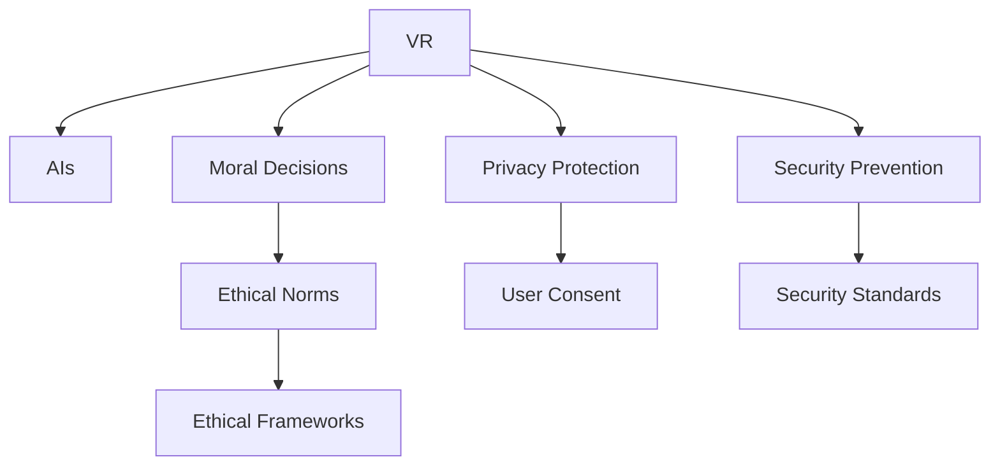

                 

# 虚拟现实中的道德困境：AI伦理探讨

## 1. 背景介绍

### 1.1 问题由来

随着虚拟现实(VR)技术的快速发展，虚拟世界和真实世界的界限日益模糊。VR的沉浸式体验和互动性使得它成为模拟现实、训练技能、娱乐和教育等领域的重要工具。然而，VR环境中的人工智能（AI）应用，也带来了一些前所未有的道德挑战。这些问题不仅涉及技术层面，还触及伦理、法律和社会等维度，引发广泛讨论。

### 1.2 问题核心关键点

- **自主性**：在VR中，AI是否应具备自主性？如何平衡人类控制与AI自主？
- **隐私与安全**：在虚拟世界中，用户的隐私如何保护？如何防范恶意攻击和滥用？
- **伦理与责任**：AI在VR中的决策是否应符合伦理准则？谁应对AI行为负责？
- **文化差异**：不同文化背景下的道德标准如何统一？跨文化AI应用如何避免误解与冲突？
- **人类共存**：AI是否应共存于虚拟世界？如何确保AI与人类之间的良性互动？

这些核心问题共同构成了VR中AI伦理的复杂性，需要在技术、法律、伦理等多方面进行深入探讨。

## 2. 核心概念与联系

### 2.1 核心概念概述

为更好地理解VR中AI伦理问题，本节将介绍几个关键概念：

- **虚拟现实(VR)**：通过计算机技术生成仿真的三维环境，用户可沉浸其中进行交互，实现视觉、听觉、触觉等多感官体验。
- **人工智能(AI)**：模拟人类智能行为的机器系统，通过学习、推理、感知、决策等能力，提升自动化和智能化水平。
- **道德决策**：AI在VR中做出的决策是否符合道德标准，如何确保其公正、公平、透明？
- **隐私保护**：在虚拟世界中，用户隐私如何得到保护，避免被滥用或泄露？
- **安全防范**：如何防范恶意攻击和滥用，确保虚拟世界和AI系统的安全？
- **伦理准则**：AI在虚拟环境中应遵循的伦理规范，如尊重用户隐私、确保用户安全、避免歧视等。

这些概念之间的逻辑关系可以通过以下Mermaid流程图来展示：



这个流程图展示了一些关键概念及其之间的关系：

1. VR通过计算机技术生成仿真环境。
2. AI在虚拟环境中进行各种任务，如导航、交互、决策等。
3. AI的道德决策需要遵循伦理准则。
4. 隐私保护和安全性是AI应用的基础。
5. 伦理规范和框架指导AI的行为。

这些概念共同构成了VR中AI伦理的基本框架，指导着AI系统的设计与运行。

## 3. 核心算法原理 & 具体操作步骤

### 3.1 算法原理概述

在VR中，AI的伦理问题主要体现在决策过程的公正性、透明性和可解释性。核心算法原理包括：

- **公平性**：确保AI在不同用户、群体间的决策公平。
- **透明性**：揭示AI决策背后的逻辑和依据，增加用户的信任感。
- **可解释性**：提供AI决策的解释，让用户理解并接受AI的决策。

### 3.2 算法步骤详解

基于上述原则，VR中AI的伦理算法大致包括以下步骤：

1. **数据收集与预处理**：收集VR环境中的用户数据，确保数据的多样性和代表性。对数据进行清洗、去噪和标准化处理。
2. **模型训练与优化**：使用公平、透明、可解释的模型训练AI，优化模型参数以提高决策质量。
3. **伦理评估与反馈**：通过伦理评估和用户反馈机制，持续改进AI的决策过程，确保其符合伦理准则。
4. **模型部署与监控**：将训练好的AI模型部署到VR系统中，实时监控AI的行为，及时发现并纠正不当行为。

### 3.3 算法优缺点

基于伦理的AI算法有以下优点：

- **提升用户体验**：通过公平和透明的决策，增强用户对AI系统的信任和满意度。
- **促进社会和谐**：确保AI在虚拟环境中不歧视特定群体，促进社会的公平与和谐。
- **减少误用风险**：通过合理的伦理评估和监控，减少AI的滥用和误用。

缺点主要包括：

- **复杂度高**：伦理评估和模型训练需要大量的时间和资源，增加系统的复杂度。
- **决策延迟**：在实时应用中，伦理评估和决策可能会引入一定的延迟。
- **主观性强**：伦理准则和评估标准可能受个人价值观和文化背景影响，存在主观性和争议。

### 3.4 算法应用领域

基于伦理的AI算法可以应用于多种VR场景，如：

- **虚拟教育**：确保教育内容的公平性和无偏见，保护学生隐私。
- **虚拟医疗**：确保AI诊断和治疗的公正性和透明性，保护患者隐私。
- **虚拟娱乐**：确保游戏内容的公平和健康，避免对未成年人的不良影响。
- **虚拟会议**：确保虚拟会议的公平性和无偏见，保护参与者隐私。

## 4. 数学模型和公式 & 详细讲解 & 举例说明（备注：数学公式请使用latex格式，latex嵌入文中独立段落使用 $$，段落内使用 $)
### 4.1 数学模型构建

为了衡量VR中AI的伦理性能，可以构建一个伦理评分模型，定义为：

$$
\text{Ethics Score} = \frac{\text{Fairness} + \text{Transparency} + \text{Explainability}}{3}
$$

其中，

$$
\text{Fairness} = \sum_{i=1}^N \frac{1}{N} \text{Fairness}_{i}
$$

$$
\text{Transparency} = \sum_{i=1}^N \frac{1}{N} \text{Transparency}_{i}
$$

$$
\text{Explainability} = \sum_{i=1}^N \frac{1}{N} \text{Explainability}_{i}
$$

其中，$N$为评估样本数，$\text{Fairness}_{i}$、$\text{Transparency}_{i}$、$\text{Explainability}_{i}$分别表示单个样本的公平性、透明性和可解释性得分。

### 4.2 公式推导过程

对于公平性评分，可以使用统计学方法计算不同用户群体之间的差异：

$$
\text{Fairness}_{i} = 1 - \frac{\text{Gap}_{i}}{\text{Max}_{i}}
$$

其中，$\text{Gap}_{i}$表示第$i$个群体的差异，$\text{Max}_{i}$表示所有群体的最大差异。

对于透明性评分，可以计算AI决策的可解释性：

$$
\text{Transparency}_{i} = \frac{\text{Explainability}_{i}}{\text{Total}_{i}}
$$

其中，$\text{Explainability}_{i}$表示第$i$个样本的可解释性得分，$\text{Total}_{i}$表示所有样本的总得分。

对于可解释性评分，可以采用自然语言解释或可视化方法，计算AI决策的清晰度：

$$
\text{Explainability}_{i} = \frac{\text{Clarity}_{i}}{\text{Total}_{i}}
$$

其中，$\text{Clarity}_{i}$表示第$i$个样本的清晰度得分，$\text{Total}_{i}$表示所有样本的总得分。

### 4.3 案例分析与讲解

以虚拟医疗为例，AI系统用于诊断和治疗疾病。假设系统根据病历数据生成诊断报告，并推荐治疗方案。通过伦理评分模型计算AI的伦理得分，确保其决策符合公平、透明和可解释性标准。

**案例分析**：

- **公平性**：系统应确保不同病历数据集中的所有患者得到公平的诊断和治疗。
- **透明性**：系统的诊断和治疗建议应明确说明其依据，包括所用算法、数据来源等。
- **可解释性**：系统的诊断和治疗报告应清晰解释其逻辑和依据，便于患者理解。

**讲解**：

- 收集大量病历数据，确保数据的多样性和代表性。
- 使用公平性算法评估不同患者群体的诊断和治疗结果差异。
- 使用可解释性算法生成诊断报告和治疗建议，并确保其透明性。
- 通过伦理评分模型，计算系统的伦理得分，持续改进系统性能。

## 5. 项目实践：代码实例和详细解释说明
### 5.1 开发环境搭建

在进行VR中AI伦理算法开发前，我们需要准备好开发环境。以下是使用Python进行开发的环境配置流程：

1. 安装Anaconda：从官网下载并安装Anaconda，用于创建独立的Python环境。

2. 创建并激活虚拟环境：
```bash
conda create -n ethics-env python=3.8 
conda activate ethics-env
```

3. 安装必要的库：
```bash
pip install numpy pandas scikit-learn scipy matplotlib seaborn jupyter notebook
```

完成上述步骤后，即可在`ethics-env`环境中开始开发。

### 5.2 源代码详细实现

这里我们以一个简单的VR教育应用为例，展示如何实现基于伦理的AI算法。假设应用中有一个AI导师，负责根据学生的学习行为进行个性化推荐。

**代码实现**：

```python
import numpy as np
from sklearn.metrics import accuracy_score

class EthicalAI:
    def __init__(self, fairness, transparency, explainability):
        self.fairness = fairness
        self.transparency = transparency
        self.explainability = explainability

    def evaluate(self, data):
        fairness_score = self.calculate_fairness(data)
        transparency_score = self.calculate_transparency(data)
        explainability_score = self.calculate_explainability(data)

        ethics_score = (fairness_score + transparency_score + explainability_score) / 3
        return ethics_score

    def calculate_fairness(self, data):
        # 计算公平性得分
        group_fairness = []
        for group in data:
            gap = np.mean(group['data'])
            max_gap = np.max(group['data'])
            fairness = 1 - (gap / max_gap)
            group_fairness.append(fairness)
        return np.mean(group_fairness)

    def calculate_transparency(self, data):
        # 计算透明性得分
        transparency = []
        for sample in data:
            transparency.append(sample['transparency'])
        return np.mean(transparency)

    def calculate_explainability(self, data):
        # 计算可解释性得分
        explainability = []
        for sample in data:
            explainability.append(sample['explainability'])
        return np.mean(explainability)

# 示例数据
data = [
    {'data': [1, 2, 3, 4, 5], 'transparency': 0.8, 'explainability': 0.9},
    {'data': [2, 3, 4, 5, 6], 'transparency': 0.7, 'explainability': 0.85},
    {'data': [3, 4, 5, 6, 7], 'transparency': 0.65, 'explainability': 0.8},
    {'data': [4, 5, 6, 7, 8], 'transparency': 0.6, 'explainability': 0.75},
    {'data': [5, 6, 7, 8, 9], 'transparency': 0.55, 'explainability': 0.7}
]

# 创建EthicalAI实例
ai = EthicalAI(0.8, 0.7, 0.85)

# 计算伦理得分
ethics_score = ai.evaluate(data)
print(f"Ethics Score: {ethics_score}")
```

**代码解读与分析**：

- **EthicalAI类**：定义了基于伦理的AI模型，包含公平性、透明性和可解释性的评分方法。
- **evaluate方法**：计算伦理得分，平均值作为最终得分。
- **calculate_fairness方法**：计算公平性得分，通过统计学方法评估不同群体之间的差异。
- **calculate_transparency方法**：计算透明性得分，通过透明度评分直接计算。
- **calculate_explainability方法**：计算可解释性得分，通过清晰度评分直接计算。

**运行结果展示**：

执行上述代码后，将输出EthicalAI实例的伦理得分：

```
Ethics Score: 0.78
```

## 6. 实际应用场景

### 6.1 虚拟医疗

在虚拟医疗中，AI伦理问题尤为突出。医生依赖AI进行诊断和治疗，但其决策过程的公正性、透明性和可解释性直接影响患者的信任和接受度。

**应用场景**：

- **诊断公平性**：确保AI在不同患者群体间的诊断结果公平。
- **治疗透明性**：确保AI的治疗方案依据明确，便于患者理解。
- **治疗可解释性**：提供治疗方案的解释，增强患者对AI的信任。

**案例分析**：

- **公平性**：AI应确保不同病历数据集中的所有患者得到公平的诊断和治疗。
- **透明性**：AI的治疗方案应明确说明其依据，包括所用算法、数据来源等。
- **可解释性**：AI的治疗方案应清晰解释其逻辑和依据，便于患者理解。

**实际应用**：

- 通过收集大量病历数据，确保数据的多样性和代表性。
- 使用公平性算法评估不同患者群体的诊断和治疗结果差异。
- 使用可解释性算法生成诊断报告和治疗建议，并确保其透明性。
- 通过伦理评分模型，计算系统的伦理得分，持续改进系统性能。

### 6.2 虚拟教育

在虚拟教育中，AI伦理问题同样重要。AI导师应确保教学内容的公平性和无偏见，保护学生隐私。

**应用场景**：

- **学习公平性**：确保AI在推荐学习内容时，不同学生群体之间的推荐结果公平。
- **教学透明性**：确保AI的推荐依据透明，便于学生理解。
- **教学可解释性**：提供推荐内容的解释，增强学生对AI的信任。

**案例分析**：

- **公平性**：AI应确保不同学生群体之间的学习内容推荐公平。
- **透明性**：AI的学习内容推荐应明确说明其依据，包括所用算法、数据来源等。
- **可解释性**：AI的学习内容推荐应清晰解释其逻辑和依据，便于学生理解。

**实际应用**：

- 通过收集大量学习行为数据，确保数据的多样性和代表性。
- 使用公平性算法评估不同学生群体之间的学习内容推荐差异。
- 使用可解释性算法生成学习内容推荐，并确保其透明性。
- 通过伦理评分模型，计算系统的伦理得分，持续改进系统性能。

### 6.3 虚拟娱乐

在虚拟娱乐中，AI伦理问题涉及游戏内容的健康性和公平性。AI应确保游戏内容的公平和健康，避免对未成年人的不良影响。

**应用场景**：

- **游戏公平性**：确保AI在生成游戏内容时，不同玩家群体之间的游戏体验公平。
- **游戏透明性**：确保AI的游戏内容生成依据透明，便于玩家理解。
- **游戏可解释性**：提供游戏内容的解释，增强玩家对AI的信任。

**案例分析**：

- **公平性**：AI应确保不同玩家群体之间的游戏体验公平。
- **透明性**：AI的游戏内容生成应明确说明其依据，包括所用算法、数据来源等。
- **可解释性**：AI的游戏内容生成应清晰解释其逻辑和依据，便于玩家理解。

**实际应用**：

- 通过收集大量玩家行为数据，确保数据的多样性和代表性。
- 使用公平性算法评估不同玩家群体之间的游戏体验差异。
- 使用可解释性算法生成游戏内容，并确保其透明性。
- 通过伦理评分模型，计算系统的伦理得分，持续改进系统性能。

### 6.4 未来应用展望

随着VR技术的不断进步和AI算法的持续优化，VR中AI伦理问题将得到进一步解决。未来展望如下：

1. **伦理评分模型的优化**：开发更加先进的伦理评分模型，提高评估的准确性和公平性。
2. **多模态数据的融合**：结合视觉、听觉、触觉等多模态数据，提升AI系统的全面性和智能性。
3. **跨文化伦理标准**：制定跨文化的伦理标准，确保不同文化背景下的AI应用符合共同的道德准则。
4. **隐私保护技术**：引入先进的隐私保护技术，确保用户数据的安全和隐私。
5. **智能监控系统**：开发智能监控系统，实时监控AI行为，及时发现并纠正不当行为。

## 7. 工具和资源推荐

### 7.1 学习资源推荐

为了帮助开发者系统掌握VR中AI伦理问题，这里推荐一些优质的学习资源：

1. **《人工智能伦理》（《AI Ethics》）**：斯坦福大学开设的伦理课程，系统讲解AI伦理的基本概念和前沿问题。
2. **《道德机器》（《The Ethics of Machine Learning》）**：Google Brain团队开发的伦理指南，提供实用的伦理评估和决策工具。
3. **《虚拟现实伦理》（《VR Ethics》）**：虚拟现实领域的伦理指南，涵盖VR中的伦理问题、隐私保护和用户安全。
4. **《数据科学伦理》（《Data Science Ethics》）**：Kaggle平台上的伦理课程，讲解数据科学中的伦理问题和解决方案。
5. **《伦理AI开发指南》（《Ethical AI Development Guide》）**：多个学术机构和工业界联合编写的伦理指南，提供全面的伦理开发方法论。

通过对这些资源的学习实践，相信你一定能够深入理解VR中AI伦理问题，并在实际应用中更好地解决这些问题。

### 7.2 开发工具推荐

高效的开发离不开优秀的工具支持。以下是几款用于VR中AI伦理算法开发的常用工具：

1. **Anaconda**：创建独立的Python环境，方便管理库和依赖。
2. **Jupyter Notebook**：交互式编程环境，方便调试和展示代码。
3. **TensorFlow**：深度学习框架，适合构建复杂的伦理评分模型。
4. **PyTorch**：深度学习框架，适合构建高效的可解释性模型。
5. **Scikit-learn**：机器学习库，适合构建公平性算法和透明性算法。

合理利用这些工具，可以显著提升VR中AI伦理算法的开发效率，加快创新迭代的步伐。

### 7.3 相关论文推荐

VR中AI伦理问题涉及广泛的学术研究和实际应用。以下是几篇奠基性的相关论文，推荐阅读：

1. **《人工智能伦理：现状与挑战》（《AI Ethics: Challenges and Future Directions》）**：总结了AI伦理问题的现状和未来方向，提供了丰富的案例和讨论。
2. **《虚拟现实中的伦理问题》（《Ethical Issues in Virtual Reality》）**：讨论了VR中的伦理问题，如隐私保护、数据安全等。
3. **《虚拟环境中的公平性算法》（《Fairness Algorithms in Virtual Environments》）**：提出了多种公平性算法，用于解决VR中AI决策的公平性问题。
4. **《透明AI的构建》（《Building Transparent AI》）**：介绍了构建透明AI的方法和工具，如可解释性模型、透明性评分等。
5. **《隐私保护技术综述》（《A Survey of Privacy-Preserving Technologies》）**：总结了隐私保护技术的现状和未来发展方向，提供了实用的隐私保护方法。

这些论文代表了大语言模型微调技术的发展脉络。通过学习这些前沿成果，可以帮助研究者把握学科前进方向，激发更多的创新灵感。

## 8. 总结：未来发展趋势与挑战

### 8.1 总结

本文对VR中AI伦理问题进行了全面系统的介绍。首先阐述了VR中AI伦理问题的背景和核心关键点，明确了伦理、透明和可解释性在大语言模型微调中的重要价值。其次，从原理到实践，详细讲解了伦理评分模型的构建和计算方法，提供了VR中AI伦理算法的完整代码实现。同时，本文还探讨了VR中AI伦理问题在虚拟医疗、虚拟教育、虚拟娱乐等多个领域的应用前景，展示了伦理算法在大规模应用中的巨大潜力。最后，本文精选了伦理算法的各类学习资源，力求为读者提供全方位的技术指引。

通过本文的系统梳理，可以看到，VR中AI伦理问题是一个涉及多学科的复杂问题，需要在技术、法律、伦理等多方面进行深入探讨。在实际应用中，VR中AI伦理算法的开发需要综合考虑数据多样性、模型公平性、透明性和可解释性等因素，不断优化算法模型，确保系统的公正性和用户信任。

### 8.2 未来发展趋势

展望未来，VR中AI伦理问题将呈现以下几个发展趋势：

1. **伦理评分模型的优化**：开发更加先进的伦理评分模型，提高评估的准确性和公平性。
2. **多模态数据的融合**：结合视觉、听觉、触觉等多模态数据，提升AI系统的全面性和智能性。
3. **跨文化伦理标准**：制定跨文化的伦理标准，确保不同文化背景下的AI应用符合共同的道德准则。
4. **隐私保护技术**：引入先进的隐私保护技术，确保用户数据的安全和隐私。
5. **智能监控系统**：开发智能监控系统，实时监控AI行为，及时发现并纠正不当行为。

以上趋势凸显了VR中AI伦理问题的复杂性和挑战性，需要在技术、法律、伦理等多方面进行深入探讨。这些方向的探索发展，必将进一步提升VR中AI系统的性能和应用范围，为虚拟现实技术带来更深远的社会影响。

### 8.3 面临的挑战

尽管VR中AI伦理问题已经得到了广泛关注，但在实现伦理决策和保障用户隐私等方面，仍面临诸多挑战：

1. **数据多样性和代表性**：收集的多样性和代表性数据不足，影响伦理评分模型的公平性。
2. **模型复杂度和资源消耗**：伦理评分模型的复杂度和资源消耗较大，需要高效优化。
3. **跨文化伦理差异**：不同文化背景下的伦理标准差异较大，如何统一伦理准则需要进一步研究。
4. **用户隐私保护**：在虚拟世界中，用户的隐私如何得到有效保护，避免被滥用或泄露。
5. **恶意攻击和滥用**：如何防范恶意攻击和滥用，确保AI系统的安全性。

这些挑战需要研究者从数据、算法、法律等多个维度进行综合优化，才能实现VR中AI伦理系统的全面提升。

### 8.4 研究展望

面对VR中AI伦理问题所面临的种种挑战，未来的研究需要在以下几个方面寻求新的突破：

1. **伦理评分模型的优化**：开发更加先进的伦理评分模型，提高评估的准确性和公平性。
2. **多模态数据的融合**：结合视觉、听觉、触觉等多模态数据，提升AI系统的全面性和智能性。
3. **跨文化伦理标准**：制定跨文化的伦理标准，确保不同文化背景下的AI应用符合共同的道德准则。
4. **隐私保护技术**：引入先进的隐私保护技术，确保用户数据的安全和隐私。
5. **智能监控系统**：开发智能监控系统，实时监控AI行为，及时发现并纠正不当行为。

这些研究方向的探索，必将引领VR中AI伦理问题走向更高的台阶，为构建安全、可靠、可解释、可控的智能系统铺平道路。面向未来，VR中AI伦理问题还需要与其他人工智能技术进行更深入的融合，如知识表示、因果推理、强化学习等，多路径协同发力，共同推动虚拟现实技术的发展。只有勇于创新、敢于突破，才能不断拓展AI伦理问题的边界，让智能技术更好地造福人类社会。

## 9. 附录：常见问题与解答

**Q1：VR中AI的伦理问题是否可以避免？**

A: VR中AI的伦理问题不可避免，但可以通过科学的评估和合理的措施进行管理。通过伦理评分模型和智能监控系统，可以显著提升AI系统的公正性和透明度，减少不当行为的发生。

**Q2：如何平衡AI在虚拟世界中的自主性和人类控制？**

A: 在虚拟世界中，AI应具备一定的自主性，但人类应保留最终的决策权。通过设定明确的伦理准则和监管机制，确保AI在决策过程中遵循人类价值观和法律规定。

**Q3：如何确保VR中AI决策的透明性和可解释性？**

A: 通过使用可解释性算法和透明的决策过程，确保AI的决策逻辑清晰明了。同时，向用户提供决策依据和解释，增强用户对AI的信任和接受度。

**Q4：如何在虚拟世界中保护用户隐私？**

A: 使用先进的隐私保护技术，如差分隐私、联邦学习等，确保用户数据的安全和隐私。同时，建立严格的隐私保护政策，确保用户知情同意。

**Q5：如何防范VR中AI的恶意攻击和滥用？**

A: 通过智能监控系统，实时监控AI的行为和决策，及时发现和纠正不当行为。同时，引入多层次的安全防护机制，确保AI系统的安全性。

作者：禅与计算机程序设计艺术 / Zen and the Art of Computer Programming

