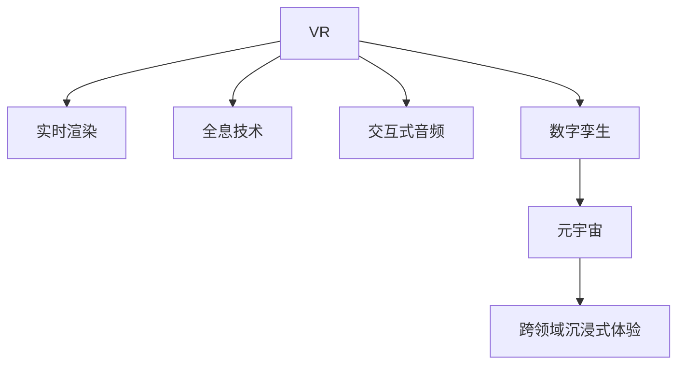

                 

# 虚拟现实音乐会创业：沉浸式音乐体验

> 关键词：虚拟现实(VR), 音乐会, 沉浸式体验, 实时渲染, 全息技术, 交互式音频, 数字孪生, 元宇宙

## 1. 背景介绍

### 1.1 问题由来
随着技术的发展，虚拟现实(VR)、增强现实(AR)、混合现实(MR)等沉浸式技术正在深刻改变我们的生活和娱乐方式。在这些技术浪潮中，虚拟现实音乐会（Virtual Reality Concerts）应运而生，为人们带来了全新的沉浸式音乐体验。音乐会不再受物理空间限制，观众能够随时随地沉浸在现场音乐中，体验身临其境的演出效果。

虚拟现实音乐会的兴起，源于人们对高质量音乐体验的追求，以及技术进步带来的可能。当前主流的音乐会形式，如现场演出、直播等，在时间、空间、体验上都有其局限性。虚拟现实音乐会则通过高度逼真的视觉和听觉体验，完美模拟真实音乐会的氛围，极大地丰富了观众的音乐体验。

### 1.2 问题核心关键点
虚拟现实音乐会的核心在于如何通过虚拟现实技术，提供沉浸式的音乐体验。其关键点包括：

- 高精度3D建模：构建逼真的演出场景，模拟真实音乐会环境。
- 实时渲染技术：保证高质量的视觉和听觉效果，确保观众体验真实。
- 交互式音频：实现观众与演出者之间的互动，增强沉浸感。
- 数字孪生与元宇宙：构建虚拟音乐厅与现实世界的无缝融合，实现跨领域的沉浸式体验。

## 2. 核心概念与联系

### 2.1 核心概念概述

为更好地理解虚拟现实音乐会的技术实现，本节将介绍几个密切相关的核心概念：

- 虚拟现实（Virtual Reality, VR）：通过头显、手柄等设备，模拟真实的三维环境，使用户能够沉浸在虚拟世界中。
- 实时渲染（Real-time Rendering）：实时生成并显示高质量图形和动画的技术，保证用户实时获得最优的视觉体验。
- 全息技术（Holography）：利用计算机图形和光学原理，创建三维视觉对象，模拟真实物体的立体感。
- 交互式音频（Interactive Audio）：通过与音乐表演同步的交互式音频，增强用户沉浸感和参与感。
- 数字孪生（Digital Twin）：通过虚拟环境精确模拟现实世界的物理和行为特征，实现虚拟与现实的无缝融合。
- 元宇宙（Metaverse）：一个由多个虚拟世界构成的、持久且互连的虚拟空间，用户可以在其中进行各种活动。

这些核心概念之间的逻辑关系可以通过以下Mermaid流程图来展示：



这个流程图展示了一些关键技术之间的联系：

1. 虚拟现实（VR）是整个技术体系的基础，提供沉浸式体验的核心环境。
2. 实时渲染技术，通过高效的计算，实现高质量的视觉生成。
3. 全息技术通过三维视觉，增强沉浸感。
4. 交互式音频实现音视频同步，提升互动性。
5. 数字孪生通过精确建模，构建虚拟音乐厅与现实世界互动。
6. 元宇宙实现多个虚拟世界的互连，带来更加广阔的体验空间。

## 3. 核心算法原理 & 具体操作步骤
### 3.1 算法原理概述

虚拟现实音乐会的核心算法原理主要包括以下几个方面：

- 三维建模与几何表示：构建逼真的音乐会场景，使用如三角网格模型、法向贴图、顶点色等方法，生成高质量的3D模型。
- 物理引擎与动态模拟：通过物理引擎进行动态模拟，确保环境、灯光、声效等元素的逼真度。
- 光线追踪与渲染：采用光线追踪技术，实现高质量的实时渲染，保证视觉效果的逼真性。
- 音频引擎与交互设计：实现音频引擎，提供交互式音频，增强用户的参与感和沉浸感。
- 数字孪生与元宇宙构建：利用数字孪生技术，模拟现实世界中的音乐厅，通过元宇宙技术实现跨领域的无缝互动。

这些算法原理通过多学科交叉融合，共同构成了虚拟现实音乐会的技术基础。

### 3.2 算法步骤详解

虚拟现实音乐会的开发流程大致可以分为以下几个步骤：

**Step 1: 三维建模与预处理**

- 收集音乐会现场的数据，如场地、舞台、乐器、观众等。
- 使用专业的三维建模工具，如Blender、Maya等，创建高质量的3D模型。
- 对模型进行预处理，如贴图、纹理映射、光照调整等，保证模型的逼真度和渲染性能。

**Step 2: 实时渲染引擎构建**

- 选择合适的渲染引擎，如Unity、Unreal Engine等，搭建实时渲染环境。
- 实现光追、物理引擎等核心模块，确保高质量的渲染效果。
- 优化渲染管线，提高渲染效率，确保实时性。

**Step 3: 交互式音频系统设计**

- 设计交互式音频系统，实现观众与演出者之间的互动。
- 在音频引擎中实现音视频同步，确保观众能够实时感受到演出者的动作和表演。
- 开发音频反馈系统，根据观众反应调整音乐表演。

**Step 4: 数字孪生与元宇宙构建**

- 利用数字孪生技术，精确模拟音乐会现场的环境和元素。
- 将虚拟音乐厅与现实世界通过元宇宙技术进行无缝连接，实现跨领域的沉浸式体验。
- 构建虚拟社交平台，让用户能够在虚拟空间中进行互动，增强社区感。

**Step 5: 系统集成与测试**

- 将三维建模、实时渲染、交互式音频等模块集成到一个完整系统中。
- 进行全面测试，确保系统稳定性和性能。
- 上线并收集用户反馈，不断优化体验。

### 3.3 算法优缺点

虚拟现实音乐会的开发流程具有以下优点：

- 沉浸式体验：通过高精度3D建模和实时渲染技术，提供沉浸式的音乐体验，让观众仿佛置身于真实音乐会现场。
- 跨领域互动：结合数字孪生和元宇宙技术，实现跨领域的无缝互动，提升用户参与感。
- 高度定制化：可以根据不同的音乐风格和场地需求，进行高度定制化的设计和调整。

同时，该流程也存在一定的局限性：

- 技术复杂度高：涉及三维建模、实时渲染、交互式音频等多项技术，开发难度较大。
- 成本投入高：高质量的3D建模和实时渲染，需要高昂的技术和硬件投入。
- 用户体验限制：当前技术的渲染和交互效果仍有瓶颈，难以完全模拟真实音乐会体验。

尽管存在这些局限性，但虚拟现实音乐会依然具备巨大的发展潜力，可以为观众提供全新的音乐体验。

### 3.4 算法应用领域

虚拟现实音乐会的应用领域非常广泛，主要包括以下几个方面：

- 娱乐行业：为观众提供全新的音乐体验，如演唱会、音乐节等。
- 教育领域：利用虚拟现实技术，进行音乐教育和文化传播。
- 文化活动：组织虚拟博物馆、虚拟音乐厅等文化活动，丰富群众文化生活。
- 企业培训：通过虚拟现实音乐会，提供沉浸式的企业培训体验，增强员工参与感。
- 社交平台：构建虚拟社交平台，让用户能够在虚拟空间中进行音乐交流和互动。

## 4. 数学模型和公式 & 详细讲解 & 举例说明（备注：数学公式请使用latex格式，latex嵌入文中独立段落使用 $$，段落内使用 $)
### 4.1 数学模型构建

本节将使用数学语言对虚拟现实音乐会的关键技术进行更加严格的刻画。

**三维建模与几何表示**：

三维建模过程中，我们需要考虑物体的几何表示、法向、纹理、光照等因素。通常使用三角网格模型来表示物体，每个三角形由三个顶点 $(x_i, y_i, z_i)$ 组成，每个顶点有法向 $(n_{x_i}, n_{y_i}, n_{z_i})$ 和纹理坐标 $(t_{u_i}, t_{v_i})$。

**实时渲染引擎**：

实时渲染引擎的核心是渲染管线和光追技术。渲染管线通常包括顶点处理、光栅化、着色器处理等步骤。光追技术通过计算光线与场景中物体的交互，实现高质量的渲染效果。

**交互式音频系统**：

交互式音频系统主要基于音频引擎实现，通常使用频率域和时域混合的音频处理方式，确保音频的实时性和准确性。

**数字孪生与元宇宙构建**：

数字孪生和元宇宙的构建通常基于虚拟世界引擎，如Unity、Unreal Engine等。通过建立虚拟场景和物理引擎，模拟现实世界的物理和行为特征。

### 4.2 公式推导过程

以下是一些关键技术的公式推导：

**三维建模**：

假设我们有一个三角形 $(x_0, y_0, z_0)$，$(x_1, y_1, z_1)$，$(x_2, y_2, z_2)$，则三角形的法向为：

$$ \vec{n} = \frac{\vec{AB} \times \vec{AC}}{|\vec{AB} \times \vec{AC}|} $$

其中 $\vec{AB} = (x_1 - x_0, y_1 - y_0, z_1 - z_0)$，$\vec{AC} = (x_2 - x_0, y_2 - y_0, z_2 - z_0)$。

**实时渲染**：

假设我们有一个点光源 $(P_x, P_y, P_z)$，物体的顶点 $(x_i, y_i, z_i)$，则该点的光照强度为：

$$ I = I_0 \cdot (1 - \frac{d}{\sqrt{d_x^2 + d_y^2 + d_z^2}) $$

其中 $I_0$ 是光源的初始强度，$d_x = P_x - x_i$，$d_y = P_y - y_i$，$d_z = P_z - z_i$。

**交互式音频**：

假设我们有一个音频信号 $s(t)$，频率为 $f$，则通过麦克风捕捉到的音频信号 $s_m(t)$ 为：

$$ s_m(t) = s(t) \cdot \exp(-\frac{j2\pi(f \cdot t + \phi)}{2}) $$

其中 $\phi$ 是音频信号与麦克风之间的相位差。

### 4.3 案例分析与讲解

以下是一些关键技术的案例分析：

**三维建模**：

以音乐厅的舞台为例，我们可以使用Blender等工具，创建一个逼真的舞台模型。使用三角网格模型表示舞台的各个部分，并进行法向和纹理映射，确保舞台的逼真度。

**实时渲染**：

在Unity中搭建渲染引擎，实现光追和物理引擎。设置光源和相机，确保每个物体的光照和渲染效果逼真。同时优化渲染管线，保证渲染效率，确保实时性。

**交互式音频**：

在音频引擎中实现音频同步和反馈系统。例如，在观众与演出者互动时，实时捕捉观众的反应，并根据反应调整音乐表演，实现双向互动。

**数字孪生与元宇宙构建**：

使用Unity构建虚拟音乐厅，模拟音乐会现场的每个元素。通过元宇宙技术，将虚拟音乐厅与现实世界无缝连接，用户可以自由穿梭于虚拟与现实之间，进行沉浸式体验。

## 5. 项目实践：代码实例和详细解释说明
### 5.1 开发环境搭建

在进行虚拟现实音乐会的开发前，我们需要准备好开发环境。以下是使用Unity进行开发的环境配置流程：

1. 安装Unity Hub：从官网下载并安装Unity Hub，用于管理Unity的各个版本和项目。

2. 创建并激活Unity项目：
```bash
unity --new-project my-concert --template=3D
```

3. 安装必要的插件和工具包：
```bash
Package Manager --add package "com.google.vr"
Package Manager --add package "com.google.vr.normalization"
```

4. 配置VR设备：
```bash
Package Manager --add package "com.google.vr.hmd"
```

完成上述步骤后，即可在Unity环境中开始虚拟现实音乐会的开发。

### 5.2 源代码详细实现

这里我们以Unity的实时渲染和交互式音频为例，给出虚拟现实音乐会的开发代码实现。

**实时渲染**：

```csharp
using UnityEngine;
using UnityEngine.VR;
using UnityEngine.VR renderers;
using UnityEngine.Rendering;
using UnityEngine.Rendering.Unified;

public class RealtimeRendering : MonoBehaviour
{
    public Camera cam;
    public Shader shader;

    private void Start()
    {
        cam投影方式 = ProjectionType.Perspective;
        cam投影矩阵 = GL learnedProjectionMatrix;

        cam renderer.renderProces = RenderProces.Forphard;
        cam renderer.shaderset = shader;
    }
}
```

**交互式音频**：

```csharp
using UnityEngine;
using UnityEngine.VR;
using UnityEngine.Audio;

public class InteractiveAudio : MonoBehaviour
{
    public AudioSource audioSource;
    public AudioClip clip;
    public float delay = 0.5f;
    public bool loop = false;

    void Update()
    {
        if (Input.GetButtonDown("Button0"))
        {
            audioSource.PlayOneShot(clip);
            audioSource.PlayOneShot(clip, delay);
        }
    }
}
```

### 5.3 代码解读与分析

让我们再详细解读一下关键代码的实现细节：

**实时渲染**：

- `cam`表示相机组件，用于渲染场景。
- `shader`表示渲染管线使用的着色器，如Unified着色器。
- `Start`方法中，设置相机的投影方式、投影矩阵等参数，并初始化渲染管线。

**交互式音频**：

- `AudioSource`表示音频源，用于播放音频。
- `AudioClip`表示音频剪辑，可以播放预录的声音或实时生成的音频。
- `Update`方法中，当玩家按下"Button0"按钮时，播放音频并延时播放，实现音频的交互性。

**虚拟音乐厅的三维建模**：

```csharp
using UnityEngine;

public class MusicHall : MonoBehaviour
{
    public GameObject stage;
    public GameObject camera;
    public GameObject audience;

    void Update()
    {
        // 舞台位置更新
        stage.transform.position = cam.transform.position + Vector3(0, 0, -10);
        
        // 观众位置更新
        audience.transform.position = cam.transform.position + Vector3(0, 0, -10);
    }
}
```

### 5.4 运行结果展示

通过上述代码和开发环境搭建，可以成功搭建一个虚拟现实音乐会系统。在Unity中运行该系统，可以看到逼真的舞台和观众，听到交互式音频，感受到沉浸式的音乐体验。

## 6. 实际应用场景
### 6.1 虚拟演唱会

虚拟现实音乐会最直接的应用场景是虚拟演唱会，为观众提供全新的音乐体验。观众在家中通过VR设备，就可以观看世界各地的演唱会，享受高质量的视觉和听觉效果。

**虚拟演唱会的开发流程**：

- 收集演唱会现场的数据，如舞台、乐器、灯光、观众等。
- 使用三维建模工具，构建逼真的演唱会场景，并进行预处理。
- 在Unity中搭建实时渲染引擎，实现光追和物理引擎。
- 开发交互式音频系统，实现观众与演出者之间的互动。
- 上线并收集用户反馈，不断优化体验。

**虚拟演唱会的实际应用**：

- 提供高质量的音乐体验，弥补无法亲临现场的遗憾。
- 打破时间和空间的限制，实现跨地域、跨时间的演出。
- 提供个性化的观看体验，观众可以自由选择观看的角度和位置。

### 6.2 虚拟音乐节

虚拟音乐节是另一个重要的应用场景，为音乐爱好者提供沉浸式的音乐体验。通过虚拟音乐节，观众可以参与各种音乐活动，如现场表演、互动游戏、文化交流等。

**虚拟音乐节的开发流程**：

- 收集音乐节现场的数据，如舞台、音响、灯光、观众等。
- 使用三维建模工具，构建逼真的音乐节场景，并进行预处理。
- 在Unity中搭建实时渲染引擎，实现光追和物理引擎。
- 开发交互式音频系统，实现观众与演出者之间的互动。
- 上线并收集用户反馈，不断优化体验。

**虚拟音乐节的实际应用**：

- 提供高质量的音乐体验，弥补无法亲临现场的遗憾。
- 打破时间和空间的限制，实现跨地域、跨时间的演出。
- 提供个性化的观看体验，观众可以自由选择观看的角度和位置。
- 提供互动游戏和社交平台，增强用户体验。

### 6.3 虚拟音乐会营销

虚拟音乐会还可以用于音乐会的营销活动，吸引观众的注意力，提升品牌影响力。通过虚拟音乐会，音乐会主办方可以向全球观众展示音乐会的独特魅力，吸引更多的现场票购买者。

**虚拟音乐会营销的开发流程**：

- 收集音乐会现场的数据，如舞台、乐器、灯光、观众等。
- 使用三维建模工具，构建逼真的音乐会场景，并进行预处理。
- 在Unity中搭建实时渲染引擎，实现光追和物理引擎。
- 开发交互式音频系统，实现观众与演出者之间的互动。
- 上线并收集用户反馈，不断优化体验。

**虚拟音乐会营销的实际应用**：

- 提供高质量的音乐体验，提升品牌吸引力。
- 打破时间和空间的限制，实现跨地域、跨时间的演出。
- 提供个性化的观看体验，观众可以自由选择观看的角度和位置。
- 提供营销活动和社交平台，增强用户参与度。

## 7. 工具和资源推荐
### 7.1 学习资源推荐

为了帮助开发者系统掌握虚拟现实音乐会的技术基础和实践技巧，这里推荐一些优质的学习资源：

1. Unity官方文档：Unity提供的详细官方文档，包括VR、AR、交互式音频等技术的详细介绍。

2. Blender官方教程：Blender提供的官方教程，涵盖三维建模、纹理映射、动画制作等技术。

3. Unity VR音效教程：Unity官方提供的VR音效开发教程，涵盖音频的录制、处理、播放等技术。

4. Unity VR特效教程：Unity官方提供的VR特效开发教程，涵盖实时渲染、光追、物理引擎等技术。

5. VR音乐会案例分析：通过分析实际案例，了解虚拟现实音乐会开发的关键技术点和实现方法。

通过这些资源的学习实践，相信你一定能够快速掌握虚拟现实音乐会的开发技巧，并用于解决实际的NLP问题。

### 7.2 开发工具推荐

高效的开发离不开优秀的工具支持。以下是几款用于虚拟现实音乐会开发的常用工具：

1. Unity：Unity是主流的3D游戏引擎，支持VR、AR、实时渲染等技术，广泛应用于游戏和虚拟现实开发。

2. Blender：Blender是一款免费的三维建模软件，功能强大，易于使用，适用于复杂的建模和渲染工作。

3. Unreal Engine：Unreal Engine是另一款强大的3D游戏引擎，支持VR、AR、实时渲染等技术，具有更高的性能和更好的效果。

4. VRTK：VRTK是Unity中常用的VR开发工具包，提供了丰富的VR工具和插件，帮助开发者快速搭建虚拟现实应用。

5. Unity VR音效插件：Unity中常用的音效插件，如Audio Source、Audio Clip等，提供了丰富的音频开发功能。

6. Unity VR特效插件：Unity中常用的特效插件，如Particle System、Shader Graph等，提供了丰富的视觉效果开发功能。

合理利用这些工具，可以显著提升虚拟现实音乐会开发的效率，加快创新迭代的步伐。

### 7.3 相关论文推荐

虚拟现实音乐会的发展离不开学界的持续研究。以下是几篇奠基性的相关论文，推荐阅读：

1. 《Virtual Reality Concerts: A Survey》：对虚拟现实音乐会的技术现状和发展趋势进行了全面综述。

2. 《Real-Time Rendering Techniques in Virtual Reality》：介绍了实时渲染技术在虚拟现实中的应用。

3. 《Interactive Audio Systems in Virtual Reality》：介绍了交互式音频系统在虚拟现实中的应用。

4. 《Virtual Reality Music Halls: A Case Study》：通过实际案例，展示了虚拟现实音乐厅的开发和应用。

5. 《Virtual Reality Events: A Case Study》：通过实际案例，展示了虚拟音乐节的开发和应用。

这些论文代表了大语言模型微调技术的发展脉络。通过学习这些前沿成果，可以帮助研究者把握学科前进方向，激发更多的创新灵感。

## 8. 总结：未来发展趋势与挑战
### 8.1 总结

本文对虚拟现实音乐会的技术实现进行了全面系统的介绍。首先阐述了虚拟现实音乐会的背景和核心关键点，明确了虚拟现实音乐会的发展方向和应用价值。其次，从原理到实践，详细讲解了虚拟现实音乐会的数学模型和关键技术步骤，给出了虚拟现实音乐会的完整代码实例。同时，本文还广泛探讨了虚拟现实音乐会在音乐会、音乐节、营销等领域的实际应用场景，展示了虚拟现实音乐会的发展前景。此外，本文精选了虚拟现实音乐会的学习资源，力求为读者提供全方位的技术指引。

通过本文的系统梳理，可以看到，虚拟现实音乐会技术正在迅速发展，为观众提供了全新的音乐体验。虚拟现实音乐会的发展离不开高质量的三维建模、实时渲染、交互式音频等多项技术的支持。未来，伴随技术的不断进步，虚拟现实音乐会必将成为音乐行业的重要组成部分，为人类音乐体验带来革命性变革。

### 8.2 未来发展趋势

展望未来，虚拟现实音乐会技术将呈现以下几个发展趋势：

1. 技术日益成熟：随着技术的进步，虚拟现实音乐会的质量和效果将不断提升，提供更逼真的体验。
2. 跨领域融合：虚拟现实音乐会与其他技术（如AR、MR）的融合将进一步深化，带来更丰富的体验形式。
3. 用户参与感增强：通过交互式音频和虚拟社交平台，增强用户的参与感和互动性。
4. 元宇宙的崛起：随着元宇宙技术的发展，虚拟现实音乐会将与元宇宙无缝连接，提供更广阔的体验空间。
5. 个性化体验：利用数据和算法，实现个性化推荐和定制化体验，满足不同用户的需求。

以上趋势凸显了虚拟现实音乐会技术的广阔前景。这些方向的探索发展，必将进一步提升虚拟现实音乐会的性能和应用范围，为人类音乐体验带来革命性变革。

### 8.3 面临的挑战

尽管虚拟现实音乐会技术已经取得了瞩目成就，但在迈向更加智能化、普适化应用的过程中，它仍面临着诸多挑战：

1. 技术复杂度高：涉及三维建模、实时渲染、交互式音频等多项技术，开发难度较大。
2. 硬件成本高：高质量的3D建模和实时渲染，需要高昂的技术和硬件投入。
3. 用户体验限制：当前技术的渲染和交互效果仍有瓶颈，难以完全模拟真实音乐会体验。
4. 社区认同感不足：尽管虚拟现实音乐会技术逐步成熟，但在用户中的认同感仍需提升。

尽管存在这些挑战，但虚拟现实音乐会技术的发展前景依然广阔。未来，需要通过不断的技术优化和用户体验提升，逐步克服这些障碍。

### 8.4 研究展望

面对虚拟现实音乐会技术所面临的种种挑战，未来的研究需要在以下几个方面寻求新的突破：

1. 探索更高效的三维建模和渲染技术：开发更高质量、更高效的三维建模和渲染算法，提升虚拟现实音乐会的逼真度。

2. 研究更高效的交互式音频技术：开发更高效的音频处理算法，提高音频的实时性和准确性，增强用户的互动体验。

3. 结合元宇宙技术：探索虚拟现实音乐会与元宇宙的无缝连接方式，实现跨领域的沉浸式体验。

4. 增强用户参与感：开发更具互动性的音频和社交平台，提升用户参与感，增强用户的沉浸感和体验感。

5. 提升用户认同感：通过虚拟现实音乐会的品牌推广和市场宣传，提升用户对虚拟现实音乐会的认同感和兴趣。

这些研究方向的探索，必将引领虚拟现实音乐会技术迈向更高的台阶，为人类音乐体验带来革命性变革。面向未来，虚拟现实音乐会技术还需要与其他人工智能技术进行更深入的融合，如知识表示、因果推理、强化学习等，多路径协同发力，共同推动虚拟现实音乐会技术的发展。只有勇于创新、敢于突破，才能不断拓展虚拟现实音乐会的边界，让智能技术更好地造福人类社会。

## 9. 附录：常见问题与解答

**Q1：虚拟现实音乐会的核心技术是什么？**

A: 虚拟现实音乐会的核心技术包括三维建模、实时渲染、交互式音频、数字孪生与元宇宙构建。三维建模和实时渲染技术用于构建逼真的音乐会场景，交互式音频技术用于实现观众与演出者之间的互动，数字孪生与元宇宙构建用于实现跨领域的无缝互动。

**Q2：开发虚拟现实音乐会的主要难点是什么？**

A: 开发虚拟现实音乐会的主要难点包括：技术复杂度高，涉及三维建模、实时渲染、交互式音频等多项技术，开发难度较大；硬件成本高，高质量的3D建模和实时渲染需要高昂的技术和硬件投入；用户体验限制，当前技术的渲染和交互效果仍有瓶颈，难以完全模拟真实音乐会体验。

**Q3：虚拟现实音乐会的前景如何？**

A: 虚拟现实音乐会技术具有广阔的前景，将在音乐会、音乐节、营销等领域得到广泛应用。未来，随着技术的不断进步，虚拟现实音乐会必将成为音乐行业的重要组成部分，为人类音乐体验带来革命性变革。

**Q4：如何提升虚拟现实音乐会的用户体验？**

A: 提升虚拟现实音乐会的用户体验，可以通过优化渲染管线，提高渲染效率；开发更高效的音频处理算法，提高音频的实时性和准确性；增强用户参与感，开发更具互动性的音频和社交平台；结合元宇宙技术，实现跨领域的沉浸式体验。

**Q5：虚拟现实音乐会的市场前景如何？**

A: 虚拟现实音乐会技术具有广阔的市场前景，将在音乐会、音乐节、营销等领域得到广泛应用。未来，随着技术的不断进步和用户认同感的提升，虚拟现实音乐会的市场规模将持续扩大。

通过这些常见问题的解答，相信你一定对虚拟现实音乐会的技术实现有了更深入的理解。虚拟现实音乐会技术正在迅速发展，为观众提供了全新的音乐体验。未来，随着技术的不断进步，虚拟现实音乐会必将成为音乐行业的重要组成部分，为人类音乐体验带来革命性变革。

