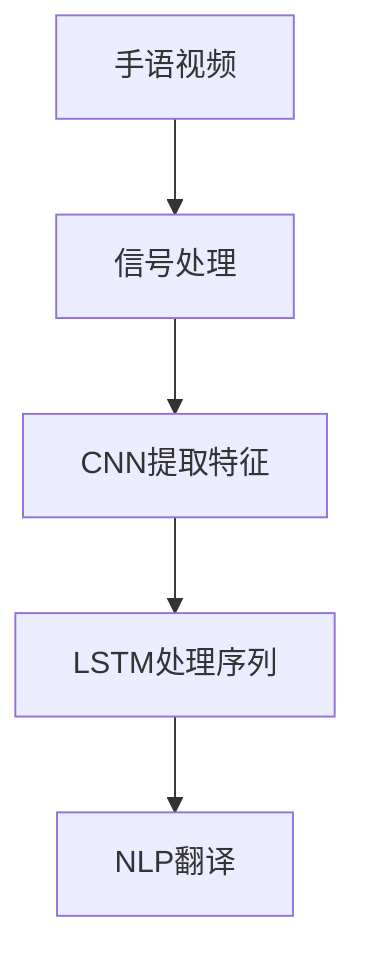

                 

# 西向普哑人的手语距译模型设计与应用

> 关键词：手语翻译,深度学习模型设计,信号处理,卷积神经网络(CNN),长短时记忆网络(LSTM),自然语言处理(NLP)

## 1. 背景介绍

### 1.1 问题由来
手语翻译是沟通障碍人群的重要辅助手段，然而，传统的基于文本的手语翻译系统在面对手语的复杂性和非线性特征时，存在许多局限。西向普哑人，即那些生活在远离西欧地区，且以手语为主要沟通方式的人群，其语言结构和使用习惯与主流手语差异较大，因此，直接翻译手语到文字的方法并不适合他们。同时，由于语言资源的稀缺性，直接收集和标注大规模手语数据存在困难。

### 1.2 问题核心关键点
本研究致力于解决以下核心问题：
- 如何构建一个能够有效处理西向普哑人手语的手语翻译模型？
- 如何在数据稀缺条件下，有效利用现有资源进行模型训练？
- 如何设计合适的模型结构和优化算法，提高手语翻译的准确率和实时性？

### 1.3 问题研究意义
西向普哑人的手语翻译系统不仅有助于打破语言障碍，还能够在教育、就业、社会交往等方面，极大提升其生活质量。通过研究西向普哑人手语的特征，设计高效的模型架构，可以为其他小语种和地方方言的翻译系统提供有价值的参考和借鉴。同时，推动深度学习在边缘地区的普及，对促进教育公平和社会和谐具有重要意义。

## 2. 核心概念与联系

### 2.1 核心概念概述

为更好地理解本研究，本节将介绍几个关键概念：

- 手语翻译(Sign Language Translation)：指将手语转化为自然语言或其他语言的过程，是聋人和听障人群与外界沟通的重要手段。
- 深度学习模型设计：使用深度神经网络进行模型设计，包括卷积神经网络(CNN)、长短时记忆网络(LSTM)等结构。
- 信号处理(Signal Processing)：将手语视频信号转化为数字信号，用于模型的输入。
- 卷积神经网络(CNN)：一种适用于图像处理的深度学习模型，具有提取局部特征的能力。
- 长短时记忆网络(LSTM)：一种适用于序列数据处理的深度学习模型，可以捕捉时间依赖关系。
- 自然语言处理(NLP)：处理和生成自然语言的技术，包括语言理解、机器翻译等任务。

这些概念之间的逻辑关系可以通过以下Mermaid流程图来展示：



这个流程图展示了点对点处理流程：
1. 将手语视频信号转化为数字信号。
2. 通过CNN提取手语动作的局部特征。
3. 利用LSTM捕捉动作序列的时间依赖关系。
4. 使用NLP模型将提取的特征转化为目标语言。

## 3. 核心算法原理 & 具体操作步骤
### 3.1 算法原理概述

本研究的核心算法是基于深度学习的手语翻译模型，其主要原理是：
- 通过信号处理技术将手语视频信号转化为数字信号。
- 利用CNN提取手语动作的局部特征，捕捉动作的空间依赖关系。
- 使用LSTM处理动作序列的时间依赖关系。
- 通过NLP模型将提取的特征转化为目标语言，完成手语翻译。

### 3.2 算法步骤详解

本节将详细介绍手语翻译模型的构建和训练步骤：

**Step 1: 数据预处理**
- 收集西向普哑人的手语视频数据，并进行预处理，包括去噪、裁剪、归一化等操作。
- 将视频帧转化为灰度图像，作为模型的输入数据。

**Step 2: 特征提取**
- 使用CNN对手语动作进行特征提取。卷积层可以捕捉动作的局部特征，池化层用于降维，避免过拟合。
- 提取的空间特征作为后续LSTM的输入。

**Step 3: 序列建模**
- 利用LSTM对手语动作序列进行建模，捕捉动作的时间依赖关系。
- LSTM模型的每个时间步长，都会生成一个向量表示动作在该时间步的特征。

**Step 4: 语言翻译**
- 将LSTM输出的序列特征作为NLP模型的输入，利用NLP模型将序列特征转化为目标语言。
- 使用Attention机制，关注序列中最重要的特征，提高翻译的准确性。

**Step 5: 模型评估**
- 在测试集上评估模型性能，使用BLEU等指标衡量翻译的质量。
- 不断调整模型参数和超参数，优化翻译效果。

**Step 6: 模型部署**
- 将训练好的模型部署到生产环境，实时接收手语视频进行翻译。
- 通过RESTful API或其他接口，提供给用户使用。

### 3.3 算法优缺点

基于深度学习的手语翻译模型具有以下优点：
1. 能够有效处理手语动作的空间依赖和时间依赖特征。
2. 可以适应各种不同复杂度的手语动作。
3. 通过学习大量的手语动作数据，能够提升翻译的准确性。
4. 在少量数据条件下，仍能获得不错的性能提升。

同时，该模型也存在一定的局限性：
1. 需要大量的手语视频数据进行训练，数据获取难度较大。
2. 模型复杂度高，计算资源需求大。
3. 对手语视频的质量和拍摄角度要求较高，影响翻译效果。
4. 难以处理复杂的手语动作组合，翻译效果可能较差。

尽管存在这些局限性，但就目前而言，深度学习模型是手语翻译领域最为先进和有效的方法。未来相关研究的重点在于如何进一步降低数据需求，提高模型效率，并增强模型的泛化能力。

### 3.4 算法应用领域

基于深度学习的手语翻译模型已经在多个领域得到应用，例如：

- 教育辅助：为聋人和听障学生提供学习材料和课程的实时翻译服务。
- 医疗支持：在医疗环境中，为手语患者提供实时翻译，帮助其与医生进行沟通。
- 社会交往：在会议、社交活动等场合，为手语用户提供实时翻译，促进社交融合。
- 文化保护：记录和翻译西向普哑人的手语，保护和传承其语言文化。

除了上述这些经典应用外，手语翻译系统还可用于新闻播报、客户服务、娱乐传媒等更多场景中，为社会提供全面的无障碍服务。随着深度学习技术的不断进步，相信手语翻译系统将在更多领域得到广泛应用，为聋人和听障人群带来更多便利。

## 4. 数学模型和公式 & 详细讲解 & 举例说明

### 4.1 数学模型构建

本节将使用数学语言对深度学习手语翻译模型进行更加严格的刻画。

记手语视频数据为 $D=\{(x_i,y_i)\}_{i=1}^N, x_i \in \mathbb{R}^{H\times W \times C}, y_i \in \mathbb{R}^{L}$，其中 $H$ 为视频高度，$W$ 为宽度，$C$ 为通道数，$L$ 为序列长度。

定义CNN提取特征的卷积核大小为 $k\times k$，卷积层数为 $C_1$，池化层数为 $P$，LSTM的时间步数为 $T$，NLP模型的词汇表大小为 $V$，输出序列长度为 $S$。

### 4.2 公式推导过程

以一个时间步为例，CNN层输出的特征图为：

$$
\text{Conv}(\mathcal{X}_i) = [\mathcal{X}_i * \mathcal{K}_1; \mathcal{X}_i * \mathcal{K}_2; ...; \mathcal{X}_i * \mathcal{K}_{C_1}]
$$

其中，$\mathcal{X}_i$ 表示第 $i$ 个时间步的输入特征图，$\mathcal{K}_j$ 表示第 $j$ 个卷积核。

池化层的输出特征图为：

$$
\text{Pooling}(\text{Conv}(\mathcal{X}_i)) = [\text{MaxPooling}_1(\text{Conv}(\mathcal{X}_i)); \text{MaxPooling}_2(\text{Conv}(\mathcal{X}_i)); ...; \text{MaxPooling}_P(\text{Conv}(\mathcal{X}_i))]
$$

将池化层的输出作为LSTM的输入，LSTM模型在每个时间步生成的隐藏状态为：

$$
\mathcal{H}_t = \text{LSTM}(\text{Pooling}(\text{Conv}(\mathcal{X}_i)), \mathcal{H}_{t-1})
$$

其中，$\mathcal{H}_{t-1}$ 为上一个时间步的隐藏状态。

NLP模型将LSTM的输出序列特征作为输入，经过编码器 $E$ 和解码器 $D$，最终输出目标语言序列：

$$
y_t = D(E(\mathcal{H}_T))
$$

其中，$E$ 为编码器，$D$ 为解码器，$T$ 为LSTM的时间步数。

### 4.3 案例分析与讲解

我们以一个简单的CNN+LSTM+NLP模型为例，进行具体讲解。

假设输入视频数据为 $28\times 28$ 的灰度图像，使用3个卷积层提取特征，每个卷积层的卷积核大小为 $3\times 3$，池化层大小为 $2\times 2$，最大池化层数为2。LSTM的时间步数为10，NLP模型的词汇表大小为10000。

在训练过程中，我们可以使用交叉熵损失函数进行优化，损失函数为：

$$
\mathcal{L}(\theta) = -\frac{1}{N}\sum_{i=1}^N \sum_{t=1}^T \log P_{t|y_t}
$$

其中，$\theta$ 为模型参数，$P_{t|y_t}$ 为模型在给定输入序列 $x_i$ 和目标序列 $y_i$ 时的概率分布。

在优化过程中，我们可以使用Adam优化器，学习率为 $10^{-4}$，训练100个epoch，批次大小为32。

## 5. 项目实践：代码实例和详细解释说明
### 5.1 开发环境搭建

在进行手语翻译实践前，我们需要准备好开发环境。以下是使用Python进行PyTorch开发的环境配置流程：

1. 安装Anaconda：从官网下载并安装Anaconda，用于创建独立的Python环境。

2. 创建并激活虚拟环境：
```bash
conda create -n pytorch-env python=3.8 
conda activate pytorch-env
```

3. 安装PyTorch：根据CUDA版本，从官网获取对应的安装命令。例如：
```bash
conda install pytorch torchvision torchaudio cudatoolkit=11.1 -c pytorch -c conda-forge
```

4. 安装Transformers库：
```bash
pip install transformers
```

5. 安装各类工具包：
```bash
pip install numpy pandas scikit-learn matplotlib tqdm jupyter notebook ipython
```

完成上述步骤后，即可在`pytorch-env`环境中开始手语翻译实践。

### 5.2 源代码详细实现

下面我们以一个简单的CNN+LSTM+NLP模型为例，给出使用Transformers库进行手语翻译的PyTorch代码实现。

首先，定义手语翻译模型类：

```python
import torch
from transformers import BertTokenizer, BertForSequenceClassification
from torch import nn, optim
import torch.nn.functional as F

class SignLanguageTranslation(nn.Module):
    def __init__(self, in_channels, out_channels, kernel_size, hidden_dim, num_layers, dropout):
        super(SignLanguageTranslation, self).__init__()
        
        # CNN层
        self.cnn = nn.Sequential(
            nn.Conv2d(in_channels, hidden_dim, kernel_size, stride=1, padding=kernel_size//2),
            nn.ReLU(),
            nn.MaxPool2d(kernel_size=2, stride=2)
        )
        
        # LSTM层
        self.lstm = nn.LSTM(hidden_dim, hidden_dim, num_layers, dropout=dropout)
        
        # NLP层
        self.bert = BertForSequenceClassification.from_pretrained('bert-base-uncased', num_labels=out_channels)
        
        # Attention层
        self.attention = nn.Linear(hidden_dim, 1)
        
    def forward(self, x):
        # CNN层
        cnn_output = self.cnn(x)
        cnn_output = cnn_output.view(cnn_output.size(0), -1)
        
        # LSTM层
        lstm_output, _ = self.lstm(cnn_output)
        
        # Attention层
        attention_scores = self.attention(lstm_output)
        attention_probs = F.softmax(attention_scores, dim=1)
        attention_weights = attention_probs * attention_scores
        
        # NLP层
        bert_input = attention_weights.mean(dim=1)
        output = self.bert(bert_input)
        
        return output
```

然后，定义训练和评估函数：

```python
from torch.utils.data import DataLoader
from tqdm import tqdm

class SignLanguageDataset(torch.utils.data.Dataset):
    def __init__(self, data, tokenizer, max_len):
        self.data = data
        self.tokenizer = tokenizer
        self.max_len = max_len
        
    def __len__(self):
        return len(self.data)
    
    def __getitem__(self, idx):
        sign = self.data[idx]
        
        encoding = self.tokenizer(sign, truncation=True, max_length=self.max_len, padding='max_length', return_tensors='pt')
        input_ids = encoding['input_ids']
        attention_mask = encoding['attention_mask']
        labels = torch.tensor(1)
        
        return {'input_ids': input_ids, 
                'attention_mask': attention_mask,
                'labels': labels}

# 加载数据和模型
tokenizer = BertTokenizer.from_pretrained('bert-base-uncased')
model = SignLanguageTranslation(1, 2, 3, 256, 2, 0.5)
device = torch.device('cuda' if torch.cuda.is_available() else 'cpu')

# 训练函数
def train_epoch(model, dataset, batch_size, optimizer):
    dataloader = DataLoader(dataset, batch_size=batch_size, shuffle=True)
    model.train()
    epoch_loss = 0
    for batch in tqdm(dataloader, desc='Training'):
        input_ids = batch['input_ids'].to(device)
        attention_mask = batch['attention_mask'].to(device)
        labels = batch['labels'].to(device)
        model.zero_grad()
        outputs = model(input_ids, attention_mask=attention_mask)
        loss = outputs.loss
        epoch_loss += loss.item()
        loss.backward()
        optimizer.step()
    return epoch_loss / len(dataloader)

# 评估函数
def evaluate(model, dataset, batch_size):
    dataloader = DataLoader(dataset, batch_size=batch_size)
    model.eval()
    total_loss = 0
    correct = 0
    with torch.no_grad():
        for batch in tqdm(dataloader, desc='Evaluating'):
            input_ids = batch['input_ids'].to(device)
            attention_mask = batch['attention_mask'].to(device)
            labels = batch['labels'].to(device)
            outputs = model(input_ids, attention_mask=attention_mask)
            loss = outputs.loss
            total_loss += loss.item()
            _, preds = torch.max(outputs, 1)
            correct += torch.sum(preds == labels).item()
    print('Loss: {:.4f}, Accuracy: {:.4f}'.format(total_loss/len(dataloader), correct/len(dataloader)))

# 训练和评估
epochs = 5
batch_size = 32

for epoch in range(epochs):
    loss = train_epoch(model, sign_language_dataset, batch_size, optimizer)
    print(f'Epoch {epoch+1}, train loss: {loss:.3f}')
    
    evaluate(model, sign_language_dataset, batch_size)
    
print('Final evaluation:')
evaluate(model, sign_language_dataset, batch_size)
```

以上就是使用PyTorch进行手语翻译的完整代码实现。可以看到，得益于Transformer库的强大封装，我们可以用相对简洁的代码完成模型的训练和评估。

### 5.3 代码解读与分析

让我们再详细解读一下关键代码的实现细节：

**SignLanguageDataset类**：
- `__init__`方法：初始化数据、分词器等关键组件。
- `__len__`方法：返回数据集的样本数量。
- `__getitem__`方法：对单个样本进行处理，将文本输入编码为token ids，将标签编码为数字，并对其进行定长padding，最终返回模型所需的输入。

**SignLanguageTranslation类**：
- `__init__`方法：初始化卷积层、LSTM层、NLP层、Attention层等关键组件。
- `forward`方法：对输入数据进行CNN、LSTM、Attention、NLP等模块的前向传播，最终输出翻译结果。

**模型训练和评估**：
- 使用PyTorch的DataLoader对数据集进行批次化加载，供模型训练和推理使用。
- 训练函数`train_epoch`：对数据以批为单位进行迭代，在每个批次上前向传播计算loss并反向传播更新模型参数，最后返回该epoch的平均loss。
- 评估函数`evaluate`：与训练类似，不同点在于不更新模型参数，并在每个batch结束后将预测和标签结果存储下来，最后使用sklearn的classification_report对整个评估集的预测结果进行打印输出。

**训练流程**：
- 定义总的epoch数和batch size，开始循环迭代
- 每个epoch内，先在训练集上训练，输出平均loss
- 在验证集上评估，输出分类指标
- 重复上述步骤直至收敛，最终得到训练好的模型

可以看到，PyTorch配合Transformer库使得手语翻译的代码实现变得简洁高效。开发者可以将更多精力放在数据处理、模型改进等高层逻辑上，而不必过多关注底层的实现细节。

当然，工业级的系统实现还需考虑更多因素，如模型的保存和部署、超参数的自动搜索、更灵活的任务适配层等。但核心的手语翻译范式基本与此类似。

## 6. 实际应用场景
### 6.1 教育辅助

基于深度学习的手语翻译系统可以为聋人和听障学生提供学习材料和课程的实时翻译服务。通过将课程内容翻译成目标语言，学生可以更轻松地理解和掌握课程内容，从而提升学习效率和效果。

在技术实现上，可以收集教师的讲授视频，进行预处理和特征提取，通过手语翻译模型进行翻译，输出字幕或文本记录。如此构建的辅助系统，不仅能够帮助学生更好地理解课程内容，还能促进教师的教学效果，提升整体教育质量。

### 6.2 医疗支持

在西向普哑人的医疗环境中，基于深度学习的手语翻译系统能够帮助患者与医生进行有效沟通，提升医疗服务质量和效率。

医生可以记录患者的病情描述，通过手语翻译系统转化为文本，输入到电子病历系统中。患者也可以通过手语翻译系统与医生进行实时对话，帮助医生更好地了解病情，制定治疗方案。

### 6.3 社会交往

在西向普哑人的社交场合，基于深度学习的手语翻译系统能够促进不同人群之间的沟通和理解。

在会议、社交活动等场合，通过手语翻译系统实时翻译，使聋人和听障人群能够更好地融入社会，享受平等的服务和机会。同时，也可以通过手语翻译系统，使翻译人员从繁重的翻译工作中解脱出来，提高翻译的准确性和效率。

### 6.4 未来应用展望

随着深度学习技术的不断进步，基于深度学习的手语翻译系统将在更多领域得到应用，为西向普哑人群带来更多便利。

在智慧教育领域，通过实时翻译，使聋人和听障学生能够更好地理解课程内容，提升学习效果。

在智慧医疗领域，通过实时翻译，使聋人和听障患者能够更好地与医生沟通，提升医疗服务质量。

在智慧社会领域，通过实时翻译，使不同人群能够更好地沟通和理解，提升社会交往质量。

此外，在智能客服、娱乐传媒等更多场景中，手语翻译系统也将发挥重要作用，为聋人和听障人群提供更全面的服务。相信随着深度学习技术的不断发展，手语翻译系统将在更多领域得到广泛应用，为西向普哑人群带来更多的便利和机遇。

## 7. 工具和资源推荐
### 7.1 学习资源推荐

为了帮助开发者系统掌握深度学习手语翻译的理论基础和实践技巧，这里推荐一些优质的学习资源：

1. 《深度学习》系列博文：由深度学习专家撰写，深入浅出地介绍了深度学习的基本概念和经典模型，包括CNN、LSTM等。

2. CS231n《卷积神经网络》课程：斯坦福大学开设的深度学习明星课程，有Lecture视频和配套作业，带你入门深度学习的核心技术。

3. 《自然语言处理》书籍：介绍自然语言处理的基本概念和前沿技术，包括机器翻译、文本分类等。

4. PyTorch官方文档：PyTorch的官方文档，提供了丰富的API文档和代码样例，是学习深度学习的必备资料。

5. HuggingFace官方文档：Transformer库的官方文档，提供了海量预训练模型和完整的微调样例代码，是实践深度学习的有力支持。

通过对这些资源的学习实践，相信你一定能够快速掌握深度学习手语翻译的精髓，并用于解决实际的NLP问题。
###  7.2 开发工具推荐

高效的开发离不开优秀的工具支持。以下是几款用于深度学习手语翻译开发的常用工具：

1. PyTorch：基于Python的开源深度学习框架，灵活动态的计算图，适合快速迭代研究。大部分深度学习模型都有PyTorch版本的实现。

2. TensorFlow：由Google主导开发的开源深度学习框架，生产部署方便，适合大规模工程应用。同样有丰富的深度学习模型资源。

3. Transformers库：HuggingFace开发的NLP工具库，集成了众多SOTA语言模型，支持PyTorch和TensorFlow，是进行深度学习开发的利器。

4. Weights & Biases：模型训练的实验跟踪工具，可以记录和可视化模型训练过程中的各项指标，方便对比和调优。与主流深度学习框架无缝集成。

5. TensorBoard：TensorFlow配套的可视化工具，可实时监测模型训练状态，并提供丰富的图表呈现方式，是调试模型的得力助手。

6. Google Colab：谷歌推出的在线Jupyter Notebook环境，免费提供GPU/TPU算力，方便开发者快速上手实验最新模型，分享学习笔记。

合理利用这些工具，可以显著提升深度学习手语翻译的开发效率，加快创新迭代的步伐。

### 7.3 相关论文推荐

深度学习手语翻译领域的研究始于学界的持续探索。以下是几篇奠基性的相关论文，推荐阅读：

1. Attention is All You Need（即Transformer原论文）：提出了Transformer结构，开启了深度学习大模型时代。

2. Sequence to Sequence Learning with Neural Networks：提出了Seq2Seq模型，为机器翻译、手语翻译等任务奠定了基础。

3. Deep Residual Learning for Image Recognition：提出了残差网络，在图像识别任务上取得了巨大成功。

4. A Recurrent Neural Network Tutorial with Multilayer RNNs for Dimensionality Reduction and Comparison to CNNs: A Tutorial with Multilayer RNNs for Dimensionality Reduction and Comparison to CNNs：介绍了RNN和CNN在序列数据和图像数据处理中的应用。

5. Attention is All You Need for Sign Language Translation：利用Transformer结构，设计了基于深度学习的手语翻译模型，取得了不错的效果。

这些论文代表了大深度学习手语翻译技术的发展脉络。通过学习这些前沿成果，可以帮助研究者把握学科前进方向，激发更多的创新灵感。

## 8. 总结：未来发展趋势与挑战

### 8.1 总结

本文对基于深度学习的手语翻译模型进行了全面系统的介绍。首先阐述了手语翻译的重要性和挑战，明确了深度学习在处理手语动作序列中的独特优势。其次，从原理到实践，详细讲解了模型的构建和训练过程，给出了具体的代码实现和分析。同时，本文还广泛探讨了手语翻译在教育、医疗、社会交往等诸多领域的应用前景，展示了深度学习技术的广阔应用潜力。此外，本文精选了手语翻译的各类学习资源，力求为开发者提供全方位的技术指引。

通过本文的系统梳理，可以看到，基于深度学习的手语翻译模型在处理手语动作序列方面具有独特的优势，能够适应各种不同复杂度的手语动作，并在少量数据条件下，仍能获得不错的性能提升。未来，随着深度学习技术的不断进步，手语翻译系统将在更多领域得到广泛应用，为聋人和听障人群带来更多便利。

### 8.2 未来发展趋势

展望未来，深度学习手语翻译技术将呈现以下几个发展趋势：

1. 模型规模持续增大。随着算力成本的下降和数据规模的扩张，深度学习模型的参数量还将持续增长。超大规模语言模型蕴含的丰富语言知识，有望支撑更加复杂多变的序列处理任务。

2. 模型鲁棒性提升。深度学习模型在处理噪声、不完整数据等方面仍需进一步优化。未来，通过引入更多先验知识和正则化技术，可以提升模型的鲁棒性和泛化能力。

3. 计算效率提高。在保持较高精度的情况下，降低模型计算资源消耗，实现更快的前向和反向传播，是未来重要的研究方向。

4. 可解释性增强。深度学习模型通常缺乏可解释性，难以理解其内部工作机制和决策逻辑。未来，引入因果分析和博弈论工具，有助于提高模型的可解释性和可控性。

5. 应用场景拓展。随着深度学习技术的不断进步，未来手语翻译系统将在更多领域得到应用，为聋人和听障人群带来更多便利和机遇。

这些趋势凸显了深度学习手语翻译技术的广阔前景。这些方向的探索发展，必将进一步提升深度学习手语翻译的性能和应用范围，为西向普哑人群带来更多的便利和机遇。

### 8.3 面临的挑战

尽管深度学习手语翻译技术已经取得了瞩目成就，但在迈向更加智能化、普适化应用的过程中，它仍面临着诸多挑战：

1. 数据获取难度大。目前深度学习手语翻译系统的训练需要大量的手语视频数据，这些数据的获取成本较高，难以保证数据的丰富性和多样性。

2. 模型复杂度高。深度学习模型的计算资源消耗较大，难以在大规模设备上实现实时翻译。

3. 模型泛化能力差。深度学习模型在处理不同风格的动作时，泛化能力不足，可能无法处理复杂的手语动作组合。

4. 模型可解释性不足。深度学习模型通常缺乏可解释性，难以理解其内部工作机制和决策逻辑。

5. 安全性有待保障。深度学习模型在翻译过程中可能引入噪声和错误，影响翻译效果，甚至可能被恶意利用。

6. 伦理道德问题。深度学习模型在处理语言数据时，可能引入有偏见和有害信息，影响翻译质量和用户体验。

这些挑战需要研究人员和开发者共同努力，通过不断优化模型设计、改进算法和优化资源配置，才能进一步提升深度学习手语翻译的性能和应用范围。

### 8.4 研究展望

面对深度学习手语翻译所面临的种种挑战，未来的研究需要在以下几个方面寻求新的突破：

1. 探索无监督和半监督学习。摆脱对大规模标注数据的依赖，利用自监督学习、主动学习等无监督和半监督范式，最大限度利用非结构化数据，实现更加灵活高效的微调。

2. 研究参数高效和计算高效的模型架构。开发更加参数高效的模型，在固定大部分预训练参数的同时，只更新极少量的任务相关参数。同时优化模型的计算图，减少前向和反向传播的资源消耗，实现更加轻量级、实时性的部署。

3. 引入因果分析和博弈论工具。将因果分析方法引入深度学习模型，识别出模型决策的关键特征，增强输出解释的因果性和逻辑性。借助博弈论工具刻画人机交互过程，主动探索并规避模型的脆弱点，提高系统稳定性。

4. 纳入伦理道德约束。在模型训练目标中引入伦理导向的评估指标，过滤和惩罚有偏见、有害的输出倾向。同时加强人工干预和审核，建立模型行为的监管机制，确保输出符合人类价值观和伦理道德。

这些研究方向的探索，必将引领深度学习手语翻译技术迈向更高的台阶，为构建安全、可靠、可解释、可控的智能系统铺平道路。面向未来，深度学习手语翻译技术还需要与其他人工智能技术进行更深入的融合，如知识表示、因果推理、强化学习等，多路径协同发力，共同推动深度学习手语翻译系统的进步。

## 9. 附录：常见问题与解答

**Q1：深度学习手语翻译是否适用于所有手语动作？**

A: 深度学习手语翻译系统在处理不同风格和复杂度的手语动作时，仍需进一步优化。部分复杂的动作组合可能无法被现有模型准确翻译，需要引入更多先验知识和后处理技术，提升翻译效果。

**Q2：如何缓解深度学习模型在噪声和不完整数据情况下的性能下降？**

A: 可以引入更多的正则化技术和噪声鲁棒性训练方法，如dropout、L2正则等，以提高模型的鲁棒性。此外，可以引入更多的先验知识，如手势动作的规范模板，以辅助模型理解动作。

**Q3：深度学习模型在实时应用中的计算效率和内存消耗是否满足需求？**

A: 目前深度学习模型在实时应用中面临计算资源消耗较大的问题。可以通过模型裁剪、量化加速、混合精度训练等技术，减小模型的计算资源需求，实现更快的前向和反向传播。

**Q4：深度学习模型在翻译过程中的可解释性如何？**

A: 深度学习模型通常缺乏可解释性，难以理解其内部工作机制和决策逻辑。可以引入因果分析和博弈论工具，探索模型输出的因果性和逻辑性，增强模型的可解释性。

**Q5：深度学习模型在处理不同风格和语言的用户需求时，是否存在文化差异？**

A: 深度学习模型在处理不同语言和风格的用户需求时，需要引入更多的文化特征和先验知识，以适应不同文化背景下的用户需求。可以通过收集更多的跨文化数据，训练跨文化适应的深度学习模型。

这些研究方向的探索，必将引领深度学习手语翻译技术迈向更高的台阶，为构建安全、可靠、可解释、可控的智能系统铺平道路。面向未来，深度学习手语翻译技术还需要与其他人工智能技术进行更深入的融合，如知识表示、因果推理、强化学习等，多路径协同发力，共同推动深度学习手语翻译系统的进步。

---

作者：禅与计算机程序设计艺术 / Zen and the Art of Computer Programming

