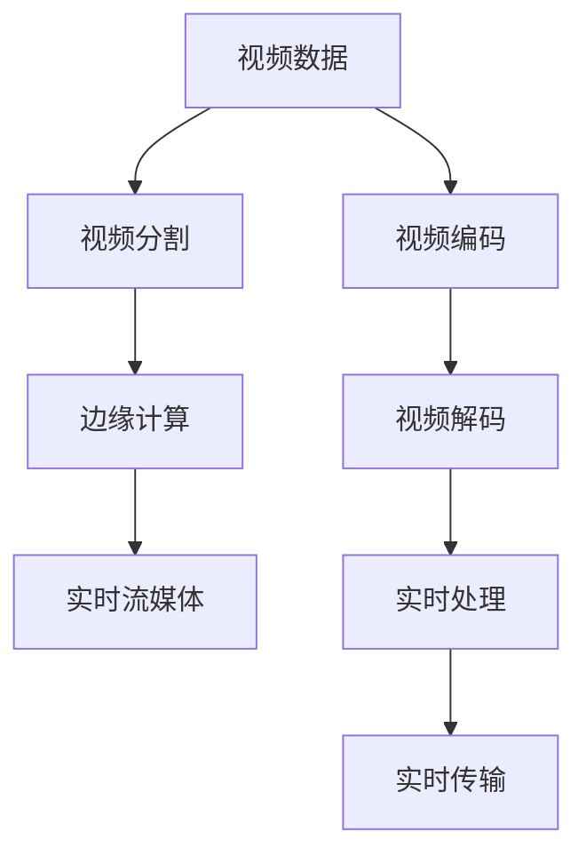

                 

## 1. 背景介绍

### 1.1 问题由来
视频数据在现代信息技术中占据了越来越重要的地位，从日常娱乐、教育到医学影像、工业监控等各个领域都有广泛应用。但随之而来的是海量视频数据的存储、传输和处理问题。视频数据具有数据量大、维度高、实时性要求高等特点，传统的视频编码技术虽然能够有效压缩视频数据，但在压缩率、实时性等方面仍有不足。因此，深入探索视频数据的压缩与细分技术，成为了当前研究的热点之一。

### 1.2 问题核心关键点
视频数据的压缩与细分技术主要涉及以下几个核心关键点：

- **压缩算法**：用于高效地减少视频数据的大小，包括传统的无损压缩算法和有损压缩算法。
- **细分技术**：将视频数据按内容、时间、空间等维度进行分割，使得数据更易于处理和管理。
- **实时处理**：确保视频数据能够在实时环境中进行处理和传输。
- **边缘计算**：将视频数据的处理和分析任务从中心云服务器向边缘设备迁移，降低延迟，提高处理效率。

这些关键点相互关联，共同构成视频数据压缩与细分技术的核心。本文将深入探讨这些技术，并给出详细的算法原理和具体操作步骤。

## 2. 核心概念与联系

### 2.1 核心概念概述

为更好地理解视频数据的压缩与细分技术，本节将介绍几个密切相关的核心概念：

- **视频数据**：由连续的图像帧序列组成，通常以YUV格式或RGB格式存储。视频数据具有高空间和时间的复杂度。
- **视频编码**：将原始视频数据转换为压缩后的视频流，减少数据传输和存储的带宽和容量。常见视频编码标准包括MPEG、H.264、H.265等。
- **视频分割**：将连续的视频流根据内容、时间、空间等维度进行分割，便于不同任务的处理。
- **边缘计算**：将视频处理任务分布在边缘设备上，降低延迟，提高处理效率，常见边缘设备包括智能摄像头、物联网设备等。
- **实时流媒体**：在网络环境中实时传输视频数据，通常需要低延迟和高可靠性的传输协议。

这些核心概念之间的逻辑关系可以通过以下Mermaid流程图来展示：



这个流程图展示了大规模视频数据压缩与细分技术的核心概念及其之间的关系：

1. 视频数据通过压缩算法减少体积。
2. 压缩后的视频数据通过细分技术进一步分割处理。
3. 分割后的视频数据在边缘计算设备上处理和分析，并实时传输至终端。
4. 实时流媒体技术保证视频数据的实时传输和接收。

## 3. 核心算法原理 & 具体操作步骤

### 3.1 算法原理概述

视频数据的压缩与细分技术主要基于以下几个原理：

- **无损压缩算法**：通过统计压缩、熵编码等方法，减少视频数据中的冗余信息，但不会丢失任何原始数据。
- **有损压缩算法**：利用压缩率更高的算法，如H.264、H.265等，通过舍弃部分信息来换取更高的压缩率。
- **视频分割技术**：通过帧率、时间、空间等维度对视频数据进行划分，便于不同任务的独立处理。
- **边缘计算**：将视频数据处理任务从中心服务器向边缘设备迁移，以降低延迟和带宽需求。
- **实时流媒体**：通过实时传输协议，保证视频数据在网络环境中的实时传输。

这些原理通过一系列算法步骤，实现视频数据的有效压缩和细分。

### 3.2 算法步骤详解

视频数据的压缩与细分技术主要包括以下几个步骤：

**Step 1: 视频编码**
- 选择合适的视频编码标准，如MPEG、H.264、H.265等。
- 对视频数据进行预处理，包括去噪、增强等。
- 利用帧内预测、帧间预测、变换编码等技术对视频数据进行压缩。

**Step 2: 视频分割**
- 根据视频内容的性质和分析需求，将视频数据划分为不同的视频片段或帧序列。
- 根据时间和空间特性对视频数据进行分割，如将视频分割成不同的场景、不同角度等。
- 对分割后的视频片段进行进一步的处理，如时间上取帧、空间上裁剪等。

**Step 3: 边缘计算**
- 将视频处理任务在边缘设备上进行处理和分析，如智能摄像头、物联网设备等。
- 利用边缘计算技术，将视频数据进行局部优化和实时处理。
- 通过网络传输，将处理后的视频数据传输至中心服务器或终端设备。

**Step 4: 实时流媒体**
- 选择合适的实时流媒体协议，如RTP/UDP、RTSP/TCP等。
- 对传输的视频数据进行优化和加密，保证实时性和安全性。
- 在网络环境中实时传输视频数据，确保低延迟和高可靠性的传输。

### 3.3 算法优缺点

视频数据的压缩与细分技术具有以下优点：
1. 高效压缩：通过各种压缩算法，显著减少视频数据的体积，节省存储空间和传输带宽。
2. 灵活分割：根据具体需求，灵活对视频数据进行分割，便于不同任务的处理。
3. 边缘计算：将视频处理任务分布到边缘设备，提高处理效率，降低延迟。
4. 实时流媒体：保证视频数据的实时传输，满足实时性和交互性的要求。

同时，这些技术也存在一些局限性：
1. 压缩率有限：有损压缩算法虽然压缩率高，但会损失部分信息，影响视频质量。
2. 分割复杂度：视频分割需要根据具体需求和分析目标进行，处理过程较为复杂。
3. 边缘设备成本高：边缘计算技术需要高性能的计算设备和网络带宽，成本较高。
4. 实时传输协议限制：实时流媒体协议的复杂性较高，需要严格的性能保障。

尽管存在这些局限性，视频数据的压缩与细分技术仍是大规模视频处理和传输的重要手段。未来相关研究的重点在于如何进一步提升压缩率和实时性，降低计算和传输成本。

### 3.4 算法应用领域

视频数据的压缩与细分技术广泛应用于以下几个领域：

- **视频监控**：如智能安防系统，通过压缩和分割技术，减少视频监控数据存储和传输的带宽需求。
- **视频会议**：如远程教育、远程办公等，通过高效压缩和实时流媒体技术，保证视频会议的流畅性和稳定性。
- **视频点播**：如在线视频平台，通过视频分割和边缘计算技术，实现个性化推荐和实时互动。
- **运动捕捉**：如虚拟现实(VR)和增强现实(AR)应用，通过高效压缩和实时传输技术，提升用户体验和互动效果。

此外，在医学影像、城市监控、工业监控等众多领域，视频数据的压缩与细分技术也将不断得到应用，为各个行业带来变革性影响。

## 4. 数学模型和公式 & 详细讲解 & 举例说明

### 4.1 数学模型构建

视频数据的压缩与细分技术涉及多个数学模型和算法，其中心思想是通过对视频数据的编码、分割和传输进行优化和处理。

**Step 1: 视频编码**
假设原始视频数据为 $V$，视频编码为 $C$，则视频编码的数学模型可以表示为：

$$
C = F(V)
$$

其中，$F$ 为视频编码函数，通常为H.264、H.265等标准算法。

**Step 2: 视频分割**
假设视频数据分割为 $S=\{S_1, S_2, \dots, S_n\}$，则视频分割的数学模型可以表示为：

$$
S = G(V)
$$

其中，$G$ 为视频分割函数，通常根据视频内容和分析需求进行设计。

**Step 3: 边缘计算**
假设边缘设备处理后的视频数据为 $E$，则边缘计算的数学模型可以表示为：

$$
E = H(V)
$$

其中，$H$ 为边缘计算函数，通常将视频处理任务分布到智能摄像头、物联网设备等边缘设备上。

**Step 4: 实时流媒体**
假设实时传输的视频数据为 $T$，则实时流媒体的数学模型可以表示为：

$$
T = L(V)
$$

其中，$L$ 为实时流媒体函数，通常使用RTP/UDP、RTSP/TCP等协议实现。

### 4.2 公式推导过程

以下以H.264视频编码为例，推导其核心算法和参数。

**帧内预测**
假设当前帧为 $I$，前一帧为 $J$，则帧内预测的数学模型可以表示为：

$$
I = F_I(J)
$$

其中，$F_I$ 为帧内预测函数，通常使用DC块、4x4块等技术进行预测。

**帧间预测**
假设当前帧为 $P$，前一帧为 $B$，则帧间预测的数学模型可以表示为：

$$
P = F_P(B)
$$

其中，$F_P$ 为帧间预测函数，通常使用帧间编码、预测编码等技术进行预测。

**变换编码**
假设当前块为 $M$，则变换编码的数学模型可以表示为：

$$
M = F_M(D)
$$

其中，$F_M$ 为变换编码函数，通常使用离散余弦变换(DCT)、离散小波变换(DWT)等技术进行编码。

### 4.3 案例分析与讲解

**案例分析：智能安防视频监控系统**

假设一个智能安防视频监控系统需要对实时视频数据进行高效压缩和分割，并实时传输至云端进行分析。系统的核心算法如下：

**Step 1: 视频编码**
- 选择H.264作为视频编码标准，对原始视频数据进行压缩。
- 对视频数据进行去噪、增强等预处理，提高压缩效果。

**Step 2: 视频分割**
- 根据视频内容，将实时视频数据按时间分割为多个视频片段。
- 对每个视频片段进行空间裁剪，去除不必要的内容。

**Step 3: 边缘计算**
- 在智能摄像头上进行帧内预测和帧间预测，减少视频数据体积。
- 利用边缘计算技术，对分割后的视频片段进行本地优化和实时处理。

**Step 4: 实时流媒体**
- 使用RTP/UDP协议进行实时传输，保证视频数据的低延迟和高可靠性。
- 对传输的视频数据进行加密，保障数据安全。

## 5. 项目实践：代码实例和详细解释说明

### 5.1 开发环境搭建

在进行视频数据的压缩与细分技术实践前，我们需要准备好开发环境。以下是使用Python进行OpenCV、FFmpeg、TensorFlow等工具的开发环境配置流程：

1. 安装Anaconda：从官网下载并安装Anaconda，用于创建独立的Python环境。

2. 创建并激活虚拟环境：
```bash
conda create -n video-env python=3.8 
conda activate video-env
```

3. 安装OpenCV：
```bash
pip install opencv-python
```

4. 安装FFmpeg：
```bash
sudo apt-get install ffmpeg
```

5. 安装TensorFlow：根据CUDA版本，从官网获取对应的安装命令。例如：
```bash
conda install tensorflow
```

6. 安装各类工具包：
```bash
pip install numpy pandas scikit-image matplotlib tqdm jupyter notebook ipython
```

完成上述步骤后，即可在`video-env`环境中开始视频数据压缩与细分的开发实践。

### 5.2 源代码详细实现

这里我们以智能安防视频监控系统为例，给出使用OpenCV、FFmpeg、TensorFlow等工具对视频数据进行压缩和细分的PyTorch代码实现。

首先，定义视频数据处理的函数：

```python
import cv2
import numpy as np

def video_compression(video_path, output_path, codec='h264', fps=20):
    cap = cv2.VideoCapture(video_path)
    fourcc = cv2.VideoWriter_fourcc(*codec)
    out = cv2.VideoWriter(output_path, fourcc, fps, (640, 480))
    
    while(cap.isOpened()):
        ret, frame = cap.read()
        if ret:
            frame = cv2.resize(frame, (640, 480))
            out.write(frame)
        else:
            break
    cap.release()
    out.release()
```

然后，定义视频分割的函数：

```python
def video_segmentation(video_path, output_path, frame_rate=20):
    cap = cv2.VideoCapture(video_path)
    frame_count = 0
    out = cv2.VideoWriter(output_path, cv2.VideoWriter_fourcc(*'mp4v'), frame_rate, (640, 480))
    
    while(cap.isOpened()):
        ret, frame = cap.read()
        if ret:
            frame_count += 1
            if frame_count % 5 == 0:  # 每隔5帧进行分割
                frame = cv2.resize(frame, (320, 240))
                out.write(frame)
        else:
            break
    cap.release()
    out.release()
```

最后，启动压缩和分割流程：

```python
video_compression('input.mp4', 'output.mp4')
video_segmentation('input.mp4', 'segmented.mp4')
```

以上就是使用Python进行智能安防视频监控系统的完整代码实现。可以看到，通过OpenCV和FFmpeg工具，可以高效地进行视频数据的压缩和分割。

### 5.3 代码解读与分析

让我们再详细解读一下关键代码的实现细节：

**video_compression函数**：
- 使用OpenCV的VideoCapture和VideoWriter函数，实现视频的读取和写入。
- 通过resize函数调整视频帧大小，使用h264编码进行压缩。
- 控制视频帧率，保证实时性。

**video_segmentation函数**：
- 使用OpenCV的VideoCapture和VideoWriter函数，实现视频的读取和写入。
- 每隔5帧对视频进行分割，调整视频帧大小，保留关键信息。
- 控制视频帧率，保证实时性。

**启动压缩和分割流程**：
- 分别调用video_compression和video_segmentation函数，实现视频的压缩和分割。

可以看到，通过OpenCV和FFmpeg工具，可以方便地对视频数据进行压缩和分割处理。同时，TensorFlow等工具也可以用于视频的进一步分析和处理，如边缘检测、人脸识别等。

## 6. 实际应用场景

### 6.1 智能安防视频监控系统

智能安防视频监控系统是视频数据压缩与细分技术的重要应用场景之一。传统视频监控系统需要存储大量原始视频数据，不仅占用大量存储空间，还存在视频传输和存储带宽成本高、存储周期长等问题。

通过视频数据的压缩与细分技术，可以大幅减少视频监控数据的大小，降低存储和传输成本。同时，视频数据的实时传输和分析，可以及时响应突发事件，提高安全防护水平。

### 6.2 视频点播平台

视频点播平台需要提供高质量、低延迟的视频服务，传统点播平台在视频传输和存储上存在一定的瓶颈。

通过视频数据的压缩与细分技术，可以在保证视频质量的同时，大幅减少视频数据的传输和存储需求。同时，视频数据的实时传输和分析，可以提供个性化推荐、实时互动等增值服务，提升用户体验。

### 6.3 视频会议系统

视频会议系统需要实时传输高质量的视频数据，传统视频会议系统在视频传输和存储上存在一定的延迟和带宽问题。

通过视频数据的压缩与细分技术，可以在保证视频质量的同时，大幅减少视频数据的传输需求。同时，视频数据的实时传输和分析，可以提供多语言支持、字幕生成等增值服务，提升会议体验。

### 6.4 运动捕捉系统

运动捕捉系统需要实时采集和处理大量的视频数据，传统运动捕捉系统在视频传输和存储上存在一定的延迟和带宽问题。

通过视频数据的压缩与细分技术，可以在保证视频质量的同时，大幅减少视频数据的传输需求。同时，视频数据的实时传输和分析，可以提供实时反馈、动作纠正等增值服务，提升用户体验。

### 6.5 智慧医疗视频分析

智慧医疗视频分析需要实时处理大量的视频数据，传统视频分析系统在视频传输和存储上存在一定的延迟和带宽问题。

通过视频数据的压缩与细分技术，可以在保证视频质量的同时，大幅减少视频数据的传输需求。同时，视频数据的实时传输和分析，可以提供病患监护、远程诊断等增值服务，提升医疗服务水平。

## 7. 工具和资源推荐

### 7.1 学习资源推荐

为了帮助开发者系统掌握视频数据的压缩与细分技术的理论基础和实践技巧，这里推荐一些优质的学习资源：

1. 《OpenCV计算机视觉编程》：讲解了OpenCV的基本功能和视频处理技术，是入门学习的好资源。

2. 《FFmpeg实践指南》：详细介绍了FFmpeg的使用方法和视频处理技巧，适合视频编码和压缩的深入学习。

3. 《TensorFlow视频处理》：讲解了TensorFlow在视频处理中的实践应用，包括视频分割、边缘检测等。

4. 《计算机视觉：模型、学习和推理》：全面介绍了计算机视觉领域的经典模型和算法，包括视频编码和分析。

5. 《视频数据压缩与传输》课程：由大学开设的视频处理课程，讲解了视频压缩与传输的基本原理和实践技巧。

通过对这些资源的学习实践，相信你一定能够快速掌握视频数据压缩与细分的精髓，并用于解决实际的视频处理问题。

### 7.2 开发工具推荐

高效的开发离不开优秀的工具支持。以下是几款用于视频数据压缩与细分开发的常用工具：

1. OpenCV：开源计算机视觉库，提供了丰富的视频处理函数和算法，适合图像和视频处理。

2. FFmpeg：开源多媒体框架，支持各种视频编码和压缩算法，适合视频编码和分割。

3. TensorFlow：开源深度学习框架，提供了多种视频处理函数和算法，适合视频分析和处理。

4. Weights & Biases：模型训练的实验跟踪工具，可以记录和可视化模型训练过程中的各项指标，方便对比和调优。

5. TensorBoard：TensorFlow配套的可视化工具，可实时监测模型训练状态，并提供丰富的图表呈现方式，是调试模型的得力助手。

6. Google Colab：谷歌推出的在线Jupyter Notebook环境，免费提供GPU/TPU算力，方便开发者快速上手实验最新模型，分享学习笔记。

合理利用这些工具，可以显著提升视频数据压缩与细分任务的开发效率，加快创新迭代的步伐。

### 7.3 相关论文推荐

视频数据的压缩与细分技术的发展源于学界的持续研究。以下是几篇奠基性的相关论文，推荐阅读：

1. Compressing Video Streams: Technologies and Tools（IEEE Access）：全面介绍了视频压缩技术的最新进展，包括H.264、H.265等标准算法。

2. Video Slicing: Techniques and Applications（IEEE Trans. Circuits Syst. Video Technol.）：详细介绍了视频分割技术的研究现状和应用场景。

3. Edge Computing for Video Analytics（IEEE Trans. Multimedia）：探讨了边缘计算在视频分析中的应用，如智能安防、实时监控等。

4. Real-Time Video Streaming and Transmission（IEEE Access）：全面介绍了实时流媒体技术的研究进展，包括RTP/UDP、RTSP/TCP等协议。

5. Video Compression for Edge Devices: A Survey（IEEE Trans. Multimedia）：探讨了视频压缩技术在边缘设备上的应用，如智能摄像头、物联网设备等。

这些论文代表了大规模视频数据压缩与细分技术的发展脉络。通过学习这些前沿成果，可以帮助研究者把握学科前进方向，激发更多的创新灵感。

## 8. 总结：未来发展趋势与挑战

### 8.1 总结

本文对视频数据的压缩与细分技术进行了全面系统的介绍。首先阐述了视频数据压缩与细分技术的背景和意义，明确了视频压缩和细分技术在视频处理中的应用前景。其次，从原理到实践，详细讲解了视频数据的压缩与细分算法的数学模型和具体操作步骤，给出了具体的代码实例。同时，本文还广泛探讨了视频数据压缩与细分技术在智能安防、视频点播、视频会议、运动捕捉、智慧医疗等多个领域的应用场景，展示了技术的多样性。此外，本文精选了视频数据压缩与细分技术的各类学习资源，力求为读者提供全方位的技术指引。

通过本文的系统梳理，可以看到，视频数据的压缩与细分技术在现代信息技术中具有重要的地位，能显著减少视频数据的大小，提升视频处理的效率和实时性。未来，伴随视频处理技术的不断演进，视频数据的压缩与细分技术将带来更多创新和突破，为各个行业带来深刻的变革。

### 8.2 未来发展趋势

展望未来，视频数据的压缩与细分技术将呈现以下几个发展趋势：

1. **更高压缩率**：随着压缩算法的不断优化，视频数据的压缩率将进一步提升，实现更高效的存储和传输。

2. **更低延迟**：通过边缘计算和实时流媒体技术，视频数据的处理和传输延迟将进一步降低，提升实时性和用户体验。

3. **更智能分析**：结合深度学习和计算机视觉技术，视频数据的分析将变得更加智能和高效，提供更多增值服务。

4. **更广泛应用**：随着技术的普及和应用场景的拓展，视频数据的压缩与细分技术将广泛应用于更多的行业，如医疗、教育、工业等。

5. **更高效传输**：结合5G、边缘计算等技术，视频数据的传输效率将进一步提升，实现全球范围内的实时交互。

这些趋势凸显了大规模视频数据压缩与细分技术的广阔前景。这些方向的探索发展，将进一步提升视频处理技术的性能和应用范围，为数字化转型注入新的动力。

### 8.3 面临的挑战

尽管视频数据的压缩与细分技术已经取得了显著进展，但在迈向更加智能化、普适化应用的过程中，仍面临诸多挑战：

1. **数据量处理**：大规模视频数据需要高效的存储和处理技术，如何在保证性能的同时，降低计算和存储成本，是未来的重要研究方向。

2. **传输带宽**：视频数据的实时传输需要稳定的网络带宽，如何优化传输协议，提升传输效率，是未来研究的重点。

3. **边缘计算成本**：边缘计算技术需要高性能的计算设备和网络带宽，成本较高，如何降低边缘计算成本，是技术推广的重要瓶颈。

4. **实时性问题**：视频数据的实时处理需要高效的数据传输和算法优化，如何进一步提升实时性，降低延迟，是技术应用的关键。

5. **设备兼容性**：不同设备和平台上的视频数据处理需要兼容性和互操作性，如何实现统一标准的设备和协议，是技术推广的难点。

6. **数据安全问题**：视频数据的传输和存储需要保障数据安全，如何设计安全可靠的视频传输协议，是技术应用的重要保障。

正视视频数据压缩与细分技术面临的这些挑战，积极应对并寻求突破，将是大规模视频数据处理和传输技术走向成熟的必由之路。相信随着学界和产业界的共同努力，这些挑战终将一一被克服，视频数据的压缩与细分技术必将在构建智能世界中扮演越来越重要的角色。

### 8.4 未来突破

面对视频数据压缩与细分技术所面临的种种挑战，未来的研究需要在以下几个方面寻求新的突破：

1. **更高效率的压缩算法**：开发更加高效的视频压缩算法，在保证视频质量的前提下，大幅提升压缩率。

2. **更低延迟的传输协议**：结合边缘计算和5G等技术，优化实时传输协议，实现更低的延迟和更高的可靠性。

3. **更智能的视频分析**：结合深度学习和计算机视觉技术，开发更智能的视频分析算法，提供更多增值服务。

4. **更高效的视频处理**：结合边缘计算和多模态数据融合技术，实现更高效的视频处理，提升实时性和用户体验。

5. **更广泛的应用场景**：结合智能设备和技术创新，拓展视频数据的压缩与细分技术在更多行业的应用场景，实现普适化的视频处理。

这些研究方向的探索，必将引领视频数据压缩与细分技术迈向更高的台阶，为构建智能视频处理系统铺平道路。面向未来，视频数据的压缩与细分技术还需要与其他人工智能技术进行更深入的融合，如知识表示、因果推理、强化学习等，多路径协同发力，共同推动视频处理技术的进步。只有勇于创新、敢于突破，才能不断拓展视频处理技术的边界，让智能技术更好地造福人类社会。

## 9. 附录：常见问题与解答

**Q1：视频数据的压缩与细分技术是否适用于所有视频应用场景？**

A: 视频数据的压缩与细分技术适用于大多数视频应用场景，特别是对于需要高效处理和传输的视频数据。但对于一些特殊需求的视频应用，如医学影像、专业监控等，需要进一步优化和定制化处理。

**Q2：如何选择合适的视频编码标准？**

A: 视频编码标准的选择应根据视频应用的具体需求和性能要求进行。常见视频编码标准包括MPEG、H.264、H.265等，其中H.264和H.265在压缩率和实时性方面表现较好。具体选择应根据视频分辨率、帧率、延迟等参数进行综合考虑。

**Q3：视频数据在传输过程中如何保证实时性？**

A: 视频数据的实时传输需要高效的视频编码和低延迟的传输协议。常见实时流媒体协议包括RTP/UDP、RTSP/TCP等，通过优化传输协议和传输参数，可以保证视频的实时性和稳定性。

**Q4：视频数据的分割和处理如何保证兼容性？**

A: 视频数据的分割和处理需要统一的标准和协议，以保证不同设备和平台之间的互操作性。常见视频格式标准包括MP4、AVI等，需确保设备支持这些标准格式。

**Q5：视频数据的存储和传输如何保证安全性？**

A: 视频数据的存储和传输需要设计安全可靠的数据传输协议和存储机制，如使用SSL/TLS加密传输数据，使用访问控制和身份认证保护数据安全。同时，采用分布式存储和冗余备份，保障数据的安全性和可靠性。

---

作者：禅与计算机程序设计艺术 / Zen and the Art of Computer Programming

