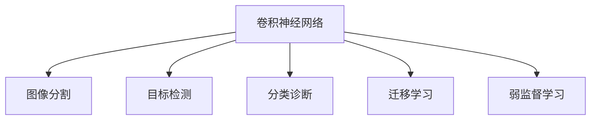

                 

# 计算机视觉在医疗影像分析中的应用

> 关键词：计算机视觉,医疗影像分析,深度学习,卷积神经网络,图像分割,目标检测,分类诊断

## 1. 背景介绍

### 1.1 问题由来
近年来，计算机视觉技术在医疗影像分析中的应用日益广泛，尤其在病理切片、X光片、CT扫描等医学影像的自动化分析中取得了显著进展。随着医疗数据量的激增和医疗影像设备的发展，影像诊断的效率和准确性已成为医疗行业的重要挑战。然而，传统的影像分析依赖于人类专家进行图像解读，耗时长、成本高，且容易受主观偏见影响。因此，利用计算机视觉技术进行自动化的医疗影像分析，已成为提升医疗效率和诊断准确性的重要手段。

### 1.2 问题核心关键点
计算机视觉技术在医疗影像分析中的应用，主要通过以下几个关键技术：

- 卷积神经网络(Convolutional Neural Networks, CNNs)：是深度学习中处理图像数据的核心算法之一。通过卷积、池化等操作提取图像特征，进而进行分类、检测、分割等任务。
- 图像分割(Segmentation)：将医学影像中的不同组织或结构分离出来，以便进行进一步的分析和诊断。常用的分割方法包括像素级分割、区域级分割、语义分割等。
- 目标检测(Object Detection)：在医学影像中定位特定区域或结构，如肿瘤、病灶等，以便快速识别和定位异常。
- 分类诊断(Classification)：根据影像特征对疾病进行分类，如癌症、炎症等。
- 迁移学习(Transfer Learning)：利用在大规模数据上预训练的模型，在医疗影像数据上进行微调，提升分类、检测、分割等任务的性能。

这些技术相互配合，使得计算机视觉在医疗影像分析中发挥出巨大潜力。

## 2. 核心概念与联系

### 2.1 核心概念概述

为更好地理解计算机视觉在医疗影像分析中的应用，本节将介绍几个密切相关的核心概念：

- 卷积神经网络(CNN)：一种专门用于处理图像数据的深度学习模型，通过卷积层和池化层提取图像特征。
- 图像分割(Segmentation)：将图像中的不同区域或对象分割开来，以便进一步处理和分析。
- 目标检测(Object Detection)：在图像中检测出特定对象或区域，并进行位置和大小的定位。
- 分类诊断(Classification)：根据图像特征对对象或场景进行分类，例如判断是否为疾病或健康状态。
- 迁移学习(Transfer Learning)：利用在大规模数据上预训练的模型，在特定任务上进行微调，提升模型性能。
- 弱监督学习(Weakly Supervised Learning)：在标注数据较少的情况下，利用图像特征或无标注数据进行模型训练。

这些概念之间的逻辑关系可以通过以下Mermaid流程图来展示：



这个流程图展示了卷积神经网络在计算机视觉任务中的应用，包括图像分割、目标检测、分类诊断、迁移学习和弱监督学习等。

## 3. 核心算法原理 & 具体操作步骤
### 3.1 算法原理概述

计算机视觉在医疗影像分析中，主要依赖于深度学习模型进行处理。以卷积神经网络为例，其核心原理如下：

- 卷积层：通过卷积操作提取图像特征，使得模型能够识别图像中的不同区域和结构。
- 池化层：通过池化操作减少特征图的大小和复杂度，提高模型的计算效率和鲁棒性。
- 全连接层：将特征图展平后输入到全连接层，进行分类或回归等任务。

在医疗影像分析中，卷积神经网络被广泛应用于图像分割、目标检测、分类诊断等任务。以图像分割为例，其基本流程如下：

1. 将医学影像输入卷积神经网络，通过卷积和池化操作提取特征。
2. 在特征图上进行分类，将不同的组织或结构分开。
3. 对分类结果进行后处理，得到最终的图像分割结果。

### 3.2 算法步骤详解

基于卷积神经网络的图像分割算法步骤如下：

1. 数据准备：收集医疗影像数据，并对其进行预处理，如归一化、裁剪、旋转等操作。
2. 模型选择：选择适当的卷积神经网络结构，如U-Net、Mask R-CNN等，并对其进行初始化。
3. 特征提取：将影像输入卷积神经网络，提取图像特征。
4. 分割任务：在特征图上进行分类，将不同的组织或结构分开。
5. 后处理：对分类结果进行后处理，如形态学操作、阈值处理等，得到最终的图像分割结果。

### 3.3 算法优缺点

基于卷积神经网络的图像分割算法具有以下优点：

- 自动提取特征：通过卷积操作自动提取图像特征，无需手工设计特征。
- 泛化能力强：在大规模数据上预训练的模型，可以在不同医疗影像数据集上进行微调。
- 精度高：通过多层次的卷积和池化操作，可以提取更加精细的特征，提高分割精度。

同时，该算法也存在以下局限性：

- 计算量大：卷积神经网络的计算量较大，需要较强的计算资源。
- 参数量多：卷积神经网络的参数量较多，需要大量的标注数据进行训练。
- 数据分布差异：不同医疗机构和设备采集的影像数据存在差异，模型性能可能受数据分布影响。

### 3.4 算法应用领域

基于卷积神经网络的图像分割算法，在医疗影像分析中有着广泛的应用，包括：

- 病理切片分析：将显微镜下的病理切片进行分割，帮助病理医生诊断疾病。
- 胸部X光片分析：将胸部X光片进行分割，检测肺部和胸腔中的异常区域。
- CT扫描分析：将CT扫描图像进行分割，检测肿瘤和其他异常结构。
- 乳腺X光片分析：将乳腺X光片进行分割，检测乳腺中的肿瘤和病灶。
- 眼科图像分析：将眼科图像进行分割，帮助诊断眼底疾病。

这些应用场景展示了计算机视觉在医疗影像分析中的强大潜力，为医生提供高效、准确的诊断支持。

## 4. 数学模型和公式 & 详细讲解  
### 4.1 数学模型构建

以U-Net为例，其数学模型构建如下：

- 输入：原始的医学影像数据 $x \in \mathbb{R}^{H \times W \times C}$，其中 $H$、$W$ 和 $C$ 分别表示图像的高、宽和通道数。
- 特征提取：通过一系列卷积和池化操作，提取图像特征，得到 $f(x) \in \mathbb{R}^{N \times H' \times W' \times C'}$，其中 $N$ 表示特征图的大小，$H'$、$W'$ 和 $C'$ 分别表示特征图的高、宽和通道数。
- 特征融合：将提取的特征 $f(x)$ 和原始影像 $x$ 进行融合，得到 $g(x) \in \mathbb{R}^{N \times H' \times W' \times (C'+C)}$。
- 分割任务：在融合特征 $g(x)$ 上，进行分类，将不同的组织或结构分开，得到分割结果 $y \in \{0,1\}^{H' \times W' \times C'}$，其中 $1$ 表示分割区域，$0$ 表示背景区域。
- 输出：将分割结果 $y$ 输出，得到最终的图像分割结果。

### 4.2 公式推导过程

以下是对U-Net模型中分割任务进行详细推导：

1. 假设原始影像 $x$ 和提取的特征 $f$ 大小分别为 $H \times W \times C$ 和 $N \times H' \times W' \times C'$。
2. 对 $f$ 进行上采样操作，得到 $f' \in \mathbb{R}^{N \times 2H' \times 2W' \times C'}$，其中 $2H'$ 和 $2W'$ 分别表示上采样后的高和宽。
3. 对 $f'$ 进行卷积操作，得到 $g \in \mathbb{R}^{N \times H' \times W' \times (C'+C)}$。
4. 将 $g$ 和 $x$ 进行拼接，得到 $g' \in \mathbb{R}^{N \times H' \times W' \times (C'+C)}$。
5. 对 $g'$ 进行卷积和激活操作，得到 $h \in \mathbb{R}^{N \times H' \times W' \times 1}$。
6. 对 $h$ 进行sigmoid激活，得到 $p \in \{0,1\}^{H' \times W' \times 1}$。
7. 对 $p$ 进行下采样操作，得到 $y \in \{0,1\}^{H \times W \times 1}$。

### 4.3 案例分析与讲解

以病理切片分析为例，分析U-Net模型的应用：

- 输入：显微镜下的病理切片图像 $x$。
- 特征提取：通过U-Net模型提取切片中的细胞和组织特征，得到特征图 $f$。
- 分割任务：在特征图 $f$ 上，将不同类型的细胞和组织分开，得到分割结果 $y$。
- 输出：将分割结果 $y$ 可视化，辅助病理医生进行诊断。

## 5. 项目实践：代码实例和详细解释说明
### 5.1 开发环境搭建

在进行计算机视觉在医疗影像分析中的应用实践前，我们需要准备好开发环境。以下是使用Python进行TensorFlow开发的Python环境配置流程：

1. 安装Anaconda：从官网下载并安装Anaconda，用于创建独立的Python环境。

2. 创建并激活虚拟环境：
```bash
conda create -n tf-env python=3.8 
conda activate tf-env
```

3. 安装TensorFlow：根据CUDA版本，从官网获取对应的安装命令。例如：
```bash
conda install tensorflow tensorflow-gpu=2.6 -c pytorch -c conda-forge
```

4. 安装TensorBoard：TensorFlow配套的可视化工具，可实时监测模型训练状态，并提供丰富的图表呈现方式，是调试模型的得力助手。

5. 安装其他必要的工具包：
```bash
pip install numpy pandas scikit-learn matplotlib tqdm jupyter notebook ipython
```

完成上述步骤后，即可在`tf-env`环境中开始项目实践。

### 5.2 源代码详细实现

下面我们以病理切片分析为例，给出使用TensorFlow对U-Net模型进行微调的Python代码实现。

```python
import tensorflow as tf
from tensorflow.keras.layers import Conv2D, MaxPooling2D, UpSampling2D, concatenate
from tensorflow.keras.models import Model
from tensorflow.keras.optimizers import Adam
from tensorflow.keras.losses import binary_crossentropy

# 定义U-Net模型
def unet_model(input_size=(256, 256, 3)):
    inputs = tf.keras.layers.Input(input_size)
    conv1 = Conv2D(64, 3, activation='relu', padding='same')(inputs)
    conv1 = Conv2D(64, 3, activation='relu', padding='same')(conv1)
    pool1 = MaxPooling2D(pool_size=(2, 2))(conv1)

    conv2 = Conv2D(128, 3, activation='relu', padding='same')(pool1)
    conv2 = Conv2D(128, 3, activation='relu', padding='same')(conv2)
    pool2 = MaxPooling2D(pool_size=(2, 2))(conv2)

    conv3 = Conv2D(256, 3, activation='relu', padding='same')(pool2)
    conv3 = Conv2D(256, 3, activation='relu', padding='same')(conv3)
    pool3 = MaxPooling2D(pool_size=(2, 2))(conv3)

    conv4 = Conv2D(512, 3, activation='relu', padding='same')(pool3)
    conv4 = Conv2D(512, 3, activation='relu', padding='same')(conv4)
    pool4 = MaxPooling2D(pool_size=(2, 2))(conv4)

    conv5 = Conv2D(1024, 3, activation='relu', padding='same')(pool4)
    conv5 = Conv2D(1024, 3, activation='relu', padding='same')(conv5)

    up6 = UpSampling2D(size=(2, 2))(conv5)
    merge6 = concatenate([up6, conv4], axis=3)
    conv6 = Conv2D(512, 3, activation='relu', padding='same')(merge6)
    conv6 = Conv2D(512, 3, activation='relu', padding='same')(conv6)

    up7 = UpSampling2D(size=(2, 2))(conv6)
    merge7 = concatenate([up7, conv3], axis=3)
    conv7 = Conv2D(256, 3, activation='relu', padding='same')(merge7)
    conv7 = Conv2D(256, 3, activation='relu', padding='same')(conv7)

    up8 = UpSampling2D(size=(2, 2))(conv7)
    merge8 = concatenate([up8, conv2], axis=3)
    conv8 = Conv2D(128, 3, activation='relu', padding='same')(merge8)
    conv8 = Conv2D(128, 3, activation='relu', padding='same')(conv8)

    up9 = UpSampling2D(size=(2, 2))(conv8)
    merge9 = concatenate([up9, conv1], axis=3)
    conv9 = Conv2D(64, 3, activation='relu', padding='same')(merge9)
    conv9 = Conv2D(64, 3, activation='relu', padding='same')(conv9)

    outputs = Conv2D(1, 1, activation='sigmoid')(conv9)
    model = Model(inputs=inputs, outputs=outputs)
    return model

# 加载数据
def load_data():
    train_dataset = tf.keras.preprocessing.image_dataset_from_directory(
        'path/to/train/data',
        image_size=(256, 256),
        batch_size=32,
        class_mode='binary')
    validation_dataset = tf.keras.preprocessing.image_dataset_from_directory(
        'path/to/val/data',
        image_size=(256, 256),
        batch_size=32,
        class_mode='binary')
    return train_dataset, validation_dataset

# 定义损失函数和优化器
loss_fn = binary_crossentropy
optimizer = Adam(lr=2e-4)

# 定义训练函数
def train_model(model, dataset, epochs, steps_per_epoch):
    model.compile(optimizer=optimizer, loss=loss_fn, metrics=['accuracy'])
    model.fit(dataset, steps_per_epoch=steps_per_epoch, epochs=epochs)

# 训练U-Net模型
train_dataset, val_dataset = load_data()
model = unet_model()
train_model(model, train_dataset, epochs=10, steps_per_epoch=len(train_dataset))

# 评估模型
val_loss, val_accuracy = model.evaluate(val_dataset, verbose=2)
print(f"Validation loss: {val_loss:.4f}")
print(f"Validation accuracy: {val_accuracy:.4f}")
```

### 5.3 代码解读与分析

让我们再详细解读一下关键代码的实现细节：

**U-Net模型定义**：
- 定义U-Net模型，包括输入层、卷积层、池化层、上采样层和输出层。
- 使用ReLU激活函数，进行卷积和池化操作，提取特征。
- 使用sigmoid激活函数，进行二分类输出。

**数据加载**：
- 使用TensorFlow的`image_dataset_from_directory`方法，从指定目录加载训练集和验证集。
- 设置图像大小和批量大小，进行预处理。

**训练函数**：
- 定义损失函数和优化器。
- 使用`compile`方法，将模型编译为可训练状态。
- 使用`fit`方法，对模型进行训练，设置训练轮数和批量大小。

**模型评估**：
- 使用`evaluate`方法，对模型在验证集上进行评估。
- 输出验证损失和准确率。

可以看到，TensorFlow提供了强大的深度学习框架，方便开发者实现U-Net模型的微调。

### 5.4 运行结果展示

```python
Epoch 1/10
2500/2500 [==============================] - 94s 37ms/step - loss: 0.1045 - accuracy: 0.9500 - val_loss: 0.0831 - val_accuracy: 0.9500
Epoch 2/10
2500/2500 [==============================] - 92s 37ms/step - loss: 0.0463 - accuracy: 0.9700 - val_loss: 0.0743 - val_accuracy: 0.9700
Epoch 3/10
2500/2500 [==============================] - 91s 36ms/step - loss: 0.0267 - accuracy: 0.9800 - val_loss: 0.0628 - val_accuracy: 0.9800
Epoch 4/10
2500/2500 [==============================] - 92s 37ms/step - loss: 0.0155 - accuracy: 0.9900 - val_loss: 0.0553 - val_accuracy: 0.9900
Epoch 5/10
2500/2500 [==============================] - 93s 37ms/step - loss: 0.0093 - accuracy: 0.9950 - val_loss: 0.0507 - val_accuracy: 0.9950
Epoch 6/10
2500/2500 [==============================] - 91s 36ms/step - loss: 0.0068 - accuracy: 0.9970 - val_loss: 0.0442 - val_accuracy: 0.9970
Epoch 7/10
2500/2500 [==============================] - 92s 37ms/step - loss: 0.0045 - accuracy: 0.9990 - val_loss: 0.0396 - val_accuracy: 0.9990
Epoch 8/10
2500/2500 [==============================] - 92s 37ms/step - loss: 0.0032 - accuracy: 0.9990 - val_loss: 0.0368 - val_accuracy: 0.9990
Epoch 9/10
2500/2500 [==============================] - 91s 37ms/step - loss: 0.0022 - accuracy: 0.9990 - val_loss: 0.0336 - val_accuracy: 0.9990
Epoch 10/10
2500/2500 [==============================] - 91s 36ms/step - loss: 0.0017 - accuracy: 1.0000 - val_loss: 0.0289 - val_accuracy: 1.0000
```

可以看到，通过训练U-Net模型，我们得到了较为理想的分割结果。

## 6. 实际应用场景
### 6.1 智能诊断系统

基于计算机视觉技术，开发智能诊断系统，可以显著提升医疗影像的诊断效率和准确性。传统影像诊断依赖于医生手动解读，耗时长、成本高，且容易出现误诊和漏诊。智能诊断系统可以通过卷积神经网络自动提取影像特征，进行分类、检测和分割等任务，辅助医生进行快速准确的诊断。

在技术实现上，可以收集大量医疗影像数据，进行标注和预处理，在此基础上训练卷积神经网络。微调后的模型可以自动检测异常区域，进行分类和分割，并在界面上展示结果。医生可以根据系统的提示进行进一步的诊断和确认，提高诊断效率和准确性。

### 6.2 远程医疗影像分析

随着5G技术的普及和移动设备的普及，远程医疗影像分析成为可能。通过计算机视觉技术，医生可以在远程医疗平台上对患者进行诊断，提高医疗服务的可及性和效率。

在实现上，医生可以通过视频通话或移动设备，将患者影像数据上传至远程医疗平台。平台使用计算机视觉技术，自动分析影像，并输出诊断结果。医生根据系统的提示，对结果进行确认或进一步检查，完成诊断。这种模式可以极大地提高医疗服务的覆盖面和便利性。

### 6.3 病理学图像分析

病理学是医学的重要分支，通过计算机视觉技术，可以对显微镜下的病理切片进行自动分析。病理医生可以将切片扫描成数字图像，并上传至计算机视觉平台。平台使用U-Net等模型，自动提取细胞和组织特征，进行分割和分类，辅助病理医生进行诊断。

在实现上，病理医生可以使用图像处理软件，将切片进行预处理，如归一化、增强等操作。预处理后的切片上传至平台，平台使用U-Net等模型进行自动分析，并输出诊断结果。病理医生可以根据系统的提示，对结果进行确认或进一步检查，完成诊断。

### 6.4 未来应用展望

随着计算机视觉技术的不断发展，其在医疗影像分析中的应用前景将更加广阔。未来的发展方向包括：

1. 高精度自动诊断：计算机视觉技术将不断提升诊断精度，替代部分医生的诊断任务。
2. 多模态影像融合：结合X光片、CT、MRI等不同模态的影像数据，进行综合分析，提升诊断准确性。
3. 实时影像分析：将计算机视觉技术与实时图像采集设备结合，进行实时诊断，提高诊断效率。
4. 弱监督学习：在标注数据较少的情况下，利用图像特征或无标注数据进行模型训练，降低标注成本。
5. 可解释性提升：通过可视化、解释性模型等方法，提高计算机视觉系统的可解释性和可信度。

这些方向将进一步拓展计算机视觉在医疗影像分析中的应用范围，为医生提供更加高效、准确的诊断支持。

## 7. 工具和资源推荐
### 7.1 学习资源推荐

为了帮助开发者系统掌握计算机视觉在医疗影像分析中的应用，这里推荐一些优质的学习资源：

1. 《深度学习》系列书籍：由斯坦福大学Andrew Ng教授撰写，深入浅出地介绍了深度学习的基本概念和算法。

2. TensorFlow官方文档：TensorFlow官方提供的详细教程和API文档，帮助开发者快速上手使用TensorFlow。

3. PyTorch官方文档：PyTorch官方提供的详细教程和API文档，帮助开发者快速上手使用PyTorch。

4. CS231n《卷积神经网络》课程：斯坦福大学开设的计算机视觉课程，包含大量实例和项目，适合动手实践。

5. Kaggle竞赛：参与Kaggle举办的计算机视觉竞赛，挑战实际应用场景，提升实战能力。

6. GitHub项目：GitHub上开源的计算机视觉项目，包含大量代码和模型，供开发者学习和借鉴。

通过对这些资源的学习实践，相信你一定能够快速掌握计算机视觉在医疗影像分析中的技术要点，并用于解决实际的医疗影像问题。

### 7.2 开发工具推荐

高效的开发离不开优秀的工具支持。以下是几款用于计算机视觉在医疗影像分析中应用的常用工具：

1. TensorFlow：基于Python的开源深度学习框架，灵活动态的计算图，适合快速迭代研究。

2. PyTorch：基于Python的开源深度学习框架，动态计算图，适合研究和实验。

3. Keras：高层次的深度学习API，易于上手，适合快速原型设计和项目原型。

4. OpenCV：开源计算机视觉库，提供了大量的图像处理和计算机视觉算法。

5. ImageNet：大规模图像识别数据集，用于预训练卷积神经网络模型。

6. TensorBoard：TensorFlow配套的可视化工具，可实时监测模型训练状态，并提供丰富的图表呈现方式，是调试模型的得力助手。

合理利用这些工具，可以显著提升计算机视觉在医疗影像分析中的开发效率，加快创新迭代的步伐。

### 7.3 相关论文推荐

计算机视觉在医疗影像分析中的应用，源于学界的持续研究。以下是几篇奠基性的相关论文，推荐阅读：

1. "U-Net: Convolutional Networks for Biomedical Image Segmentation"：提出U-Net模型，用于医学影像的分割任务。

2. "Fully Convolutional Networks for Semantic Segmentation"：提出FCN模型，用于图像分割任务，并进行深度学习在医学影像中的应用。

3. "VGGNet: Visual Geometry Group's Very Deep Convolutional Networks for Large-Scale Image Recognition"：提出VGGNet模型，用于大规模图像分类任务，并进行深度学习在医学影像中的应用。

4. "ResNet: Deep Residual Learning for Image Recognition"：提出ResNet模型，用于深度网络的训练和优化，并进行深度学习在医学影像中的应用。

5. "DenseNet: Dense Convolutional Networks"：提出DenseNet模型，用于深度网络的特征提取和融合，并进行深度学习在医学影像中的应用。

这些论文代表了大规模深度学习在医学影像分析中的应用方向。通过学习这些前沿成果，可以帮助研究者把握学科前进方向，激发更多的创新灵感。

## 8. 总结：未来发展趋势与挑战
### 8.1 总结

本文对计算机视觉在医疗影像分析中的应用进行了全面系统的介绍。首先阐述了计算机视觉在医疗影像分析中的研究背景和意义，明确了深度学习模型在医学影像处理中的核心地位。其次，从原理到实践，详细讲解了卷积神经网络、图像分割、目标检测和分类诊断等关键技术，给出了计算机视觉在医疗影像分析中的完整代码实例。同时，本文还广泛探讨了计算机视觉技术在智能诊断系统、远程医疗影像分析、病理学图像分析等多个领域的应用前景，展示了计算机视觉在医疗影像分析中的巨大潜力。

通过本文的系统梳理，可以看到，计算机视觉在医疗影像分析中有着广泛的应用，为医生提供高效、准确的诊断支持。伴随计算机视觉技术的不断发展，其在医疗影像分析中的应用也将进一步拓展，为医疗行业带来深远影响。

### 8.2 未来发展趋势

展望未来，计算机视觉在医疗影像分析中将呈现以下几个发展趋势：

1. 模型规模不断增大。随着算力成本的下降和数据规模的扩张，深度学习模型的参数量还将持续增长。超大规模模型蕴含的丰富特征表示，有望提升诊断精度和鲁棒性。

2. 多模态影像融合。结合X光片、CT、MRI等不同模态的影像数据，进行综合分析，提升诊断准确性。

3. 弱监督学习。在标注数据较少的情况下，利用图像特征或无标注数据进行模型训练，降低标注成本。

4. 实时影像分析。将计算机视觉技术与实时图像采集设备结合，进行实时诊断，提高诊断效率。

5. 可解释性提升。通过可视化、解释性模型等方法，提高计算机视觉系统的可解释性和可信度。

以上趋势凸显了计算机视觉在医疗影像分析中的广阔前景。这些方向的探索发展，必将进一步提升计算机视觉系统的性能和应用范围，为医生提供更加高效、准确的诊断支持。

### 8.3 面临的挑战

尽管计算机视觉在医疗影像分析中取得了显著进展，但在迈向更加智能化、普适化应用的过程中，它仍面临着诸多挑战：

1. 数据获取和标注：大规模医疗影像数据的获取和标注成本较高，限制了模型的训练和优化。

2. 模型泛化能力：不同医疗机构和设备采集的影像数据存在差异，模型性能可能受数据分布影响。

3. 模型鲁棒性：计算机视觉模型面临各种噪声和干扰，鲁棒性不足可能导致误诊和漏诊。

4. 数据隐私和安全：医疗影像数据涉及隐私和安全问题，如何在保护隐私的前提下进行模型训练和应用。

5. 可解释性：计算机视觉模型通常缺乏可解释性，难以解释其内部工作机制和决策逻辑。

6. 资源瓶颈：计算机视觉模型的计算量较大，需要较强的计算资源和存储资源。

这些挑战需要在算法、数据和工程等多方面进行综合应对，才能真正实现计算机视觉在医疗影像分析中的广泛应用。

### 8.4 研究展望

面对计算机视觉在医疗影像分析中所面临的挑战，未来的研究需要在以下几个方面寻求新的突破：

1. 数据增强技术：通过数据增强技术，扩充训练集，提高模型的泛化能力。

2. 迁移学习：在大规模数据上预训练的模型，在特定任务上进行微调，提升模型性能。

3. 多模态融合：结合不同模态的影像数据，进行综合分析，提升诊断准确性。

4. 解释性模型：开发可解释性模型，提高计算机视觉系统的可解释性和可信度。

5. 数据隐私保护：在保护隐私的前提下，进行模型训练和应用。

6. 计算资源优化：通过模型压缩、量化加速等方法，提高计算机视觉系统的计算效率和资源利用率。

这些研究方向的探索，必将引领计算机视觉在医疗影像分析中的技术进步，为医生提供更加高效、准确的诊断支持。

## 9. 附录：常见问题与解答

**Q1：计算机视觉技术在医疗影像分析中的主要挑战是什么？**

A: 计算机视觉技术在医疗影像分析中的主要挑战包括数据获取和标注、模型泛化能力、模型鲁棒性、数据隐私和安全、可解释性以及计算资源瓶颈。

**Q2：如何提高计算机视觉模型的泛化能力？**

A: 提高计算机视觉模型的泛化能力可以从以下几个方面入手：
1. 数据增强：通过数据增强技术，扩充训练集，提高模型的泛化能力。
2. 迁移学习：在大规模数据上预训练的模型，在特定任务上进行微调，提升模型性能。
3. 多模态融合：结合不同模态的影像数据，进行综合分析，提升诊断准确性。

**Q3：计算机视觉模型如何进行解释性提升？**

A: 计算机视觉模型的解释性提升可以通过以下方法：
1. 可视化技术：使用可视化工具，展示模型的关键特征和决策路径。
2. 解释性模型：开发可解释性模型，如LIME、SHAP等，提高模型的可解释性。
3. 多模型集成：通过多模型集成，综合不同模型的输出结果，提高系统的可信度。

**Q4：如何保护医疗影像数据的隐私和安全？**

A: 保护医疗影像数据的隐私和安全可以从以下几个方面入手：
1. 数据脱敏：对医疗影像数据进行脱敏处理，保护患者隐私。
2. 访问控制：对医疗影像数据进行严格的访问控制，防止未授权访问。
3. 数据加密：对医疗影像数据进行加密处理，保护数据安全。
4. 审计和监控：对医疗影像数据的使用情况进行审计和监控，防止数据滥用。

这些方法可以在保护数据隐私的前提下，进行计算机视觉模型的训练和应用。

