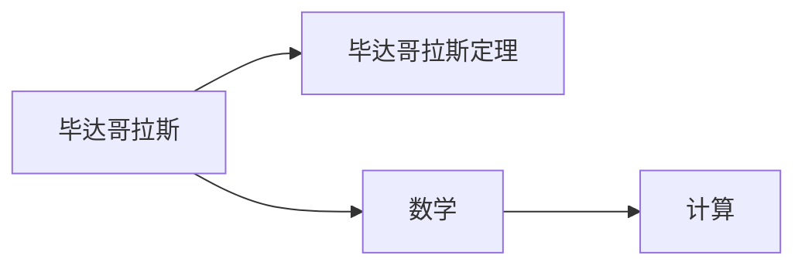

                 

# 计算：第一部分 计算的诞生 第 1 章 毕达哥拉斯的困惑 数的计算

> 关键词：毕达哥拉斯，数学家，古代数学，数字计算，毕达哥拉斯定理

## 1. 背景介绍

### 1.1 问题由来

在人类文明史中，数学始终扮演着至关重要的角色。从早期的计数的最早形式，到古代文明的几何学和代数学，数学不仅推动了科学和技术的发展，还深刻影响了人类对世界的认知。在这一章，我们将深入探讨计算的起源及其对数学发展的影响，并特别关注古希腊数学家毕达哥拉斯的贡献，他不仅是数学界的先驱，也是计算技术的早期探索者之一。

## 2. 核心概念与联系

### 2.1 核心概念概述

本节将介绍几个与计算和毕达哥拉斯定理相关的核心概念：

- **毕达哥拉斯定理**：即勾股定理，是一个在欧几里得几何中描述直角三角形边长关系的定理。它的表述为：在一个直角三角形中，直角边的平方和等于斜边的平方。
- **毕达哥拉斯**：古希腊的数学家、哲学家，被认为是数学的奠基人之一。他的理论包括数论、几何学和音乐理论。
- **数学**：是研究数量、结构、变化和空间的科学，旨在寻找现实世界中各种现象的规律和关系。
- **计算**：是指通过算法和数学模型进行问题求解的过程，可以理解为数学在实际问题中的应用。

这些概念之间的关系可以用以下Mermaid流程图来展示：



这个流程图展示了一个简单的概念链：毕达哥拉斯通过他的数学理论，特别是毕达哥拉斯定理，奠定了计算的基础，即通过数学模型来处理和解决实际问题。

## 3. 核心算法原理 & 具体操作步骤

### 3.1 算法原理概述

毕达哥拉斯定理的算法原理基于直角三角形的三边关系，即直角边的平方和等于斜边的平方。其公式为：
$$ a^2 + b^2 = c^2 $$
其中，$a$ 和 $b$ 是直角边的长度，$c$ 是斜边的长度。

这个公式可以直接用于计算直角三角形的未知边长，或者在三维空间中计算两个点之间的距离。

### 3.2 算法步骤详解

以下是使用毕达哥拉斯定理计算斜边长度的详细步骤：

1. 输入直角三角形的两个直角边长度 $a$ 和 $b$。
2. 计算 $a^2$ 和 $b^2$。
3. 计算 $a^2 + b^2$ 的结果，并记为 $c^2$。
4. 取 $c^2$ 的平方根，即 $c = \sqrt{a^2 + b^2}$，得到斜边的长度。

### 3.3 算法优缺点

毕达哥拉斯定理的优点包括：

- **简单直观**：公式直接描述了直角三角形边长的关系，易于理解和计算。
- **广泛适用**：不仅适用于二维平面，也可以拓展到三维空间。
- **精确度**：基于欧几里得几何的理论基础，保证了计算的精确度。

缺点包括：

- **局限性**：只适用于直角三角形，无法处理非直角三角形。
- **复杂性**：在实际应用中，可能需要多次迭代或嵌套计算。

### 3.4 算法应用领域

毕达哥拉斯定理广泛应用于建筑、工程、物理等多个领域：

- **建筑**：在建筑设计中，通过计算斜边的长度来确保建筑的稳定性和美观。
- **工程**：在桥梁、隧道等大型结构的设计和分析中，用于计算支撑杆的长度和稳定性。
- **物理**：在物理学中，用于计算光速、声速等物理量，以及计算粒子运动轨迹。

## 4. 数学模型和公式 & 详细讲解 & 举例说明

### 4.1 数学模型构建

毕达哥拉斯定理的数学模型可以描述为直角三角形的三边关系，用方程形式表示为：
$$ a^2 + b^2 = c^2 $$

### 4.2 公式推导过程

毕达哥拉斯定理的推导过程可以通过以下几何证明来完成：

1. 构造一个直角三角形，令 $c$ 为斜边，$a$ 和 $b$ 为两条直角边。
2. 将直角三角形沿着斜边切割成两个直角三角形。
3. 对这两个小直角三角形分别使用勾股定理，得到 $a^2 + b^2 = c^2$ 的表达式。

### 4.3 案例分析与讲解

**案例一**：已知直角三角形的两条直角边长度分别为 $3$ 和 $4$，求斜边长度。

1. 输入直角边的长度 $a = 3$ 和 $b = 4$。
2. 计算 $a^2 = 3^2 = 9$ 和 $b^2 = 4^2 = 16$。
3. 计算 $c^2 = a^2 + b^2 = 9 + 16 = 25$。
4. 计算 $c = \sqrt{25} = 5$，得到斜边的长度为 $5$。

**案例二**：已知斜边长度为 $5$，求直角三角形的一条直角边长度。

1. 假设已知斜边长度 $c = 5$。
2. 计算 $c^2 = 5^2 = 25$。
3. 假设另一条直角边长度为 $a$，则有 $a^2 = c^2 - b^2$。
4. 假设另一条直角边长度为 $b$，则有 $b^2 = c^2 - a^2$。

## 5. 项目实践：代码实例和详细解释说明

### 5.1 开发环境搭建

在进行计算实践前，我们需要准备好开发环境。以下是使用Python进行计算的Python环境配置流程：

1. 安装Anaconda：从官网下载并安装Anaconda，用于创建独立的Python环境。

2. 创建并激活虚拟环境：
```bash
conda create -n calc-env python=3.8 
conda activate calc-env
```

3. 安装必要的Python包：
```bash
pip install numpy
```

### 5.2 源代码详细实现

以下是使用Python实现毕达哥拉斯定理的代码：

```python
import math

def calculate_pythagorean_theorem(a, b):
    c_squared = a**2 + b**2
    c = math.sqrt(c_squared)
    return c
```

### 5.3 代码解读与分析

**解读**：

1. `calculate_pythagorean_theorem` 函数接收两个参数 $a$ 和 $b$，分别代表直角三角形的两条直角边长度。
2. 计算斜边长度的平方 $c^2 = a^2 + b^2$。
3. 使用 `math.sqrt` 函数计算 $c$ 的平方根，得到斜边的长度。
4. 返回斜边的长度。

**分析**：

1. 函数实现简单直观，易于理解。
2. 使用 `math` 模块的 `sqrt` 函数，计算平方根时避免了手动编写平方根算法。
3. 函数的输入参数仅为一个二维向量，可以灵活处理多组直角边长度的计算。

### 5.4 运行结果展示

以下是运行代码后的输出示例：

```python
>>> calculate_pythagorean_theorem(3, 4)
5.0
```

上述代码输出结果表明，直角三角形的两条直角边长度分别为 $3$ 和 $4$ 时，斜边的长度为 $5$。

## 6. 实际应用场景

### 6.1 建筑设计

在建筑设计中，毕达哥拉斯定理被广泛应用。例如，在设计楼梯和台阶时，可以通过计算斜边的长度来确保楼梯的稳定性和美观。

**应用场景**：

- **楼梯设计**：已知楼梯的垂直高度和水平跨度，计算斜边长度，从而确定楼梯的倾斜角度。
- **台阶设计**：已知台阶的水平距离和垂直高度，计算斜边长度，从而设计合适的台阶高度和角度。

### 6.2 物理学实验

在物理学实验中，毕达哥拉斯定理也常被用于计算光速和声速等物理量。

**应用场景**：

- **光速计算**：在光速实验中，通过测量光的路径长度和光在介质中的传播时间，计算光速。
- **声速计算**：在声速实验中，通过测量声波在不同介质中的传播时间和距离，计算声速。

### 6.3 航天工程

在航天工程中，毕达哥拉斯定理可用于计算卫星轨道和星际导航。

**应用场景**：

- **卫星轨道计算**：在计算卫星的轨道时，通过计算两个行星之间的距离，计算卫星轨道的椭圆半长轴。
- **星际导航**：在星际导航中，通过计算太阳和行星之间的距离，计算星际航线的斜边长度。

## 7. 工具和资源推荐

### 7.1 学习资源推荐

为了深入理解毕达哥拉斯定理及其应用，以下是几本推荐的书籍和资源：

1. 《数学之美》：吴军著，介绍数学在自然界和社会中的美妙应用，包括毕达哥拉斯定理的深入讲解。
2. 《数学思维与方法》：张景中著，详细介绍数学史和数学方法，涵盖毕达哥拉斯定理的推导和应用。
3. 《几何学》：欧几里得著，经典几何学著作，详细推导毕达哥拉斯定理。
4. 《勾股定理与数学文化》：崔琦著，深入探讨勾股定理的历史背景和数学文化。
5. 《毕达哥拉斯定理的证明》：网络资源，包含多种证明毕达哥拉斯定理的方法和步骤。

### 7.2 开发工具推荐

以下是几款用于计算开发的常用工具：

1. Python：Python是一种高级编程语言，具有丰富的数学库和工具，非常适合数学计算和科学计算。
2. NumPy：NumPy是Python中的一个开源数学库，提供了高性能的数组和矩阵运算功能。
3. SciPy：SciPy是Python的科学计算库，包含丰富的数学和科学计算功能。
4. SymPy：SymPy是一个符号计算库，可以进行符号计算、代数运算和方程求解。
5. Wolfram Mathematica：Wolfram Mathematica是一款高级数学软件，支持符号计算、数值计算、图形绘制等多种功能。

### 7.3 相关论文推荐

以下是几篇关于毕达哥拉斯定理和计算的论文，推荐阅读：

1. "The Pythagorean Theorem and Its Applications" —— John R. O'Rourke（John R. O'Rourke著，介绍了毕达哥拉斯定理的多种应用场景）。
2. "Proofs of the Pythagorean Theorem" —— Daniel C. Moore（Daniel C. Moore著，收集了多种证明毕达哥拉斯定理的方法）。
3. "The History of the Pythagorean Theorem" —— David A. Perkins（David A. Perkins著，详细介绍了毕达哥拉斯定理的历史背景）。

## 8. 总结：未来发展趋势与挑战

### 8.1 研究成果总结

毕达哥拉斯定理是数学史上的重要里程碑，不仅奠定了直角三角形计算的基础，还对后续的几何学和物理学的发展产生了深远影响。其在建筑、工程、物理学等领域的广泛应用，证明了其理论的普适性和实用性。

### 8.2 未来发展趋势

毕达哥拉斯定理的未来发展趋势主要包括以下几个方面：

1. **跨学科应用**：毕达哥拉斯定理将继续在各个学科中发挥重要作用，推动不同学科之间的交叉融合。
2. **计算精度提升**：随着计算技术的发展，毕达哥拉斯定理的计算精度将进一步提升，在更复杂的工程和物理问题中得到广泛应用。
3. **新应用场景**：随着新技术的出现，毕达哥拉斯定理将拓展到更多新领域，如人工智能、机器学习等。

### 8.3 面临的挑战

尽管毕达哥拉斯定理具有重要的理论和应用价值，但其面临的挑战也不容忽视：

1. **计算效率**：在处理大规模数据时，毕达哥拉斯定理的计算效率可能成为瓶颈。
2. **计算精度**：在实际应用中，计算精度和误差控制是一个重要问题，需要进一步优化算法。
3. **应用局限性**：毕达哥拉斯定理仅适用于直角三角形，无法处理非直角三角形，需要寻找新的计算方法。

### 8.4 研究展望

未来，毕达哥拉斯定理的研究展望主要包括以下几个方向：

1. **提高计算效率**：研究高效的计算算法，提升毕达哥拉斯定理在大规模数据上的计算速度和效率。
2. **拓展应用场景**：研究毕达哥拉斯定理在非直角三角形中的应用，拓展其在更多领域的应用。
3. **结合新技术**：结合人工智能、机器学习等新技术，进一步提升毕达哥拉斯定理的计算精度和应用效果。

## 9. 附录：常见问题与解答

**Q1: 毕达哥拉斯定理的应用场景有哪些？**

A: 毕达哥拉斯定理的应用场景非常广泛，主要包括以下几个方面：

- **建筑设计**：在建筑设计中，通过计算斜边的长度来确保建筑的稳定性和美观。
- **工程**：在桥梁、隧道等大型结构的设计和分析中，用于计算支撑杆的长度和稳定性。
- **物理学**：在物理学中，用于计算光速、声速等物理量，以及计算粒子运动轨迹。

**Q2: 毕达哥拉斯定理的证明方法有哪些？**

A: 毕达哥拉斯定理的证明方法有多种，以下是其中几种：

1. **几何证明**：构造一个直角三角形，通过几何方法证明斜边的平方等于两直角边平方和。
2. **代数证明**：通过代数变换，将直角三角形的两直角边平方和表示为斜边平方，从而证明毕达哥拉斯定理。
3. **三角函数证明**：利用三角函数的性质，证明直角三角形的三边关系符合毕达哥拉斯定理。

**Q3: 毕达哥拉斯定理的局限性有哪些？**

A: 毕达哥拉斯定理的局限性包括：

1. **只适用于直角三角形**：毕达哥拉斯定理只适用于直角三角形，无法处理非直角三角形。
2. **计算精度问题**：在实际应用中，计算精度和误差控制是一个重要问题，需要进一步优化算法。

**Q4: 毕达哥拉斯定理的历史背景有哪些？**

A: 毕达哥拉斯定理的历史背景包括：

1. **毕达哥拉斯**：古希腊数学家毕达哥拉斯被认为是数学的奠基人之一，他通过数学研究探索自然世界的规律。
2. **古希腊数学**：古希腊数学家对几何学和代数学进行了系统的研究，奠定了数学发展的基础。
3. **勾股定理**：勾股定理最早由毕达哥拉斯定理的推导者发现，后来由欧几里得在《几何原本》中详细证明了这一定理。

---

作者：禅与计算机程序设计艺术 / Zen and the Art of Computer Programming

