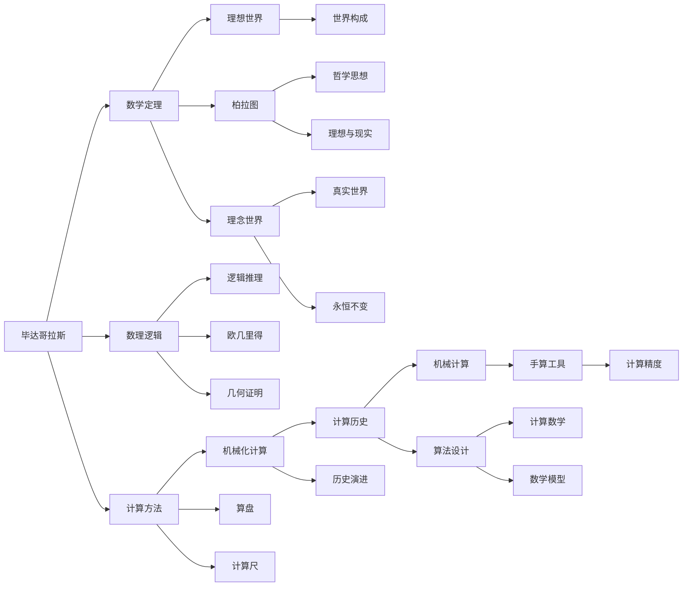

                 

# 计算：第一部分 计算的诞生 第 1 章 毕达哥拉斯的困惑 柏拉图的理想世界

## 1. 背景介绍

### 1.1 问题由来

人类文明的历史，从某种意义上说，就是探索和利用计算的历史。计算不仅改变了人类的生产方式和生活方式，也塑造了我们对世界的认知。在这本《计算：第一部分 计算的诞生》中，我们将深入探索计算的起源、演变以及它如何影响我们今天的世界。

### 1.2 问题核心关键点

本章节将探讨计算的基础概念和其对人类文明的影响。我们将从古代数学家毕达哥拉斯的困惑，到哲学家柏拉图的理想世界，逐步展开计算的诞生之路。

### 1.3 问题研究意义

理解计算的起源和发展，对于把握现代计算技术的本质和未来方向至关重要。本章节将揭示计算如何从抽象的哲学思考，逐步演化为具体的计算模型，最终成为推动人类进步的核心力量。

## 2. 核心概念与联系

### 2.1 核心概念概述

计算的诞生并非一蹴而就，而是经历了一系列复杂的历史过程。本节将介绍几个关键的核心概念，这些概念共同构成了计算的基石：

- **毕达哥拉斯**：古希腊数学家，提出了著名的毕达哥拉斯定理，奠定了数理逻辑的基础。
- **柏拉图的理想世界**：古希腊哲学家，主张世界由理念和物质两大部分构成，理念世界是永恒不变的真实世界。
- **机械化计算**：通过机械装置进行数学计算的过程，如使用算盘、计算尺等工具。
- **逻辑推理**：利用符号逻辑进行推理，如欧几里得的几何证明。
- **图灵机**：艾伦·图灵提出的计算模型，被认为是现代计算机的基础。

### 2.2 核心概念原理和架构的 Mermaid 流程图



这个流程图展示了计算概念的发展脉络：

1. 毕达哥拉斯通过数学定理和数理逻辑，奠定了计算的基础。
2. 柏拉图通过哲学思想，提出了计算的理念世界。
3. 机械化计算工具的使用，逐步提高了计算的精度和效率。
4. 逻辑推理和几何证明，进一步推动了计算理论的演进。

## 3. 核心算法原理 & 具体操作步骤

### 3.1 算法原理概述

计算的诞生和发展，涉及到从哲学到数学，再到工程技术的多个层次。本节将从算法原理的角度，探讨计算的诞生过程。

**毕达哥拉斯与数学定理**：
- **毕达哥拉斯定理**：在直角三角形中，直角边的平方和等于斜边的平方。这个定理不仅在数学中具有重要地位，也为计算提供了基本的数学模型。

**柏拉图的理念世界与哲学思想**：
- **理想世界**：柏拉图认为，现实世界只是理念世界的一种不完美的投影。这个理念不仅影响了哲学，也为计算提供了抽象的模型。

**机械化计算与工具**：
- **算盘和计算尺**：古代使用的计算工具，虽然效率不高，但为后来计算模型的发展提供了灵感。

**逻辑推理与几何证明**：
- **欧几里得几何**：利用逻辑推理进行几何证明，为计算提供了形式化的证明方法。

### 3.2 算法步骤详解

**毕达哥拉斯的计算过程**：
1. **定义问题**：毕达哥拉斯通过直角三角形的边长关系，定义了一个计算问题。
2. **提出假设**：假设直角三角形的两直角边长为a和b，斜边长为c。
3. **推导公式**：通过数理逻辑推理，推导出c^2 = a^2 + b^2的公式。
4. **验证结果**：通过几何证明，验证了公式的正确性。

**柏拉图的计算哲学**：
1. **提出理念**：柏拉图认为，计算的本质是对理念世界的模拟。
2. **构建模型**：柏拉图通过理念世界构建了一个抽象的计算模型。
3. **应用实践**：通过哲学思考，指导了计算理论的发展。

**机械化计算的工具使用**：
1. **设计工具**：古代的计算工具，如算盘和计算尺，为机械化计算提供了基础。
2. **操作流程**：通过手动操作工具，逐步进行计算。
3. **结果输出**：计算结果通过记录，进行后续分析和应用。

### 3.3 算法优缺点

**毕达哥拉斯计算的优点**：
- **数学基础**：通过数学定理，奠定了计算的理论基础。
- **形式化推理**：通过逻辑推理，提高了计算的准确性。

**毕达哥拉斯计算的缺点**：
- **计算效率低**：手工计算效率低下，难以处理大规模数据。

**柏拉图理念世界的优点**：
- **抽象模型**：提供了一个抽象的计算模型，指导了计算理论的发展。
- **哲学指导**：哲学思想为计算提供了理论依据。

**柏拉图理念世界的缺点**：
- **过于抽象**：过于抽象的理论，难以直接应用于实际计算。

**机械化计算的优点**：
- **工具支撑**：提供了具体的计算工具，提高了计算效率。
- **经验积累**：积累了大量的计算经验，为后来的计算发展提供了基础。

**机械化计算的缺点**：
- **依赖人工**：依赖人工操作，效率和精度受限。
- **扩展性差**：难以处理复杂的计算问题。

### 3.4 算法应用领域

计算的诞生和发展，涉及到了多个领域，包括数学、哲学、工程技术等。本节将探讨计算在这些领域的应用。

**数学领域**：
- **几何证明**：欧几里得几何通过逻辑推理，建立了数学模型的基础。
- **数理逻辑**：毕达哥拉斯定理的推广，推动了数学的发展。

**哲学领域**：
- **理念世界**：柏拉图通过理念世界，为计算提供了抽象的模型。
- **哲学指导**：哲学思想为计算理论的发展提供了方向。

**工程技术领域**：
- **机械化计算**：古代的计算工具，为工程技术的计算提供了基础。
- **算法设计**：逻辑推理和几何证明，为算法设计提供了理论基础。

## 4. 数学模型和公式 & 详细讲解 & 举例说明

### 4.1 数学模型构建

计算的诞生，离不开数学模型的构建。本节将详细讲解毕达哥拉斯的数学模型和柏拉图的哲学模型。

**毕达哥拉斯的数学模型**：
- **直角三角形模型**：通过直角三角形的边长关系，定义了一个计算问题。
- **公式推导**：推导出c^2 = a^2 + b^2的公式。

**柏拉图的哲学模型**：
- **理念世界模型**：通过理念世界，构建了一个抽象的计算模型。
- **世界构成模型**：认为世界由理念和物质两大部分构成，理念世界是永恒不变的真实世界。

### 4.2 公式推导过程

**毕达哥拉斯定理的公式推导**：
1. **定义直角三角形**：设直角三角形的两直角边长为a和b，斜边长为c。
2. **计算斜边长度**：根据勾股定理，c^2 = a^2 + b^2。

**柏拉图的哲学模型推导**：
1. **提出理念世界**：认为世界由理念和物质两大部分构成，理念世界是永恒不变的真实世界。
2. **构建计算模型**：通过理念世界，构建了一个抽象的计算模型。

### 4.3 案例分析与讲解

**毕达哥拉斯定理的应用案例**：
- **实际应用**：在建筑和工程中，通过直角三角形模型计算高度和距离。
- **历史影响**：毕达哥拉斯定理奠定了数理逻辑的基础，对后来的数学发展产生了深远影响。

**柏拉图的哲学应用案例**：
- **哲学思考**：通过理念世界，指导了计算理论的发展。
- **历史影响**：柏拉图的哲学思想，影响了西方哲学和科学的发展。

## 5. 项目实践：代码实例和详细解释说明

### 5.1 开发环境搭建

在进行计算项目的实践前，我们需要准备好开发环境。以下是使用Python进行计算开发的详细配置流程：

1. 安装Python：从官网下载并安装最新版本的Python。
2. 安装相关库：安装NumPy、Pandas、SciPy等常用的数学计算库。
3. 设置环境：使用虚拟环境（如virtualenv），避免库版本冲突。

### 5.2 源代码详细实现

下面以计算毕达哥拉斯定理为例，给出Python代码实现：

```python
import numpy as np

def pythagorean_theorem(a, b):
    c = np.sqrt(a**2 + b**2)
    return c

a = 3
b = 4
c = pythagorean_theorem(a, b)
print(f"c = {c}")
```

这段代码定义了一个计算直角三角形斜边长度的函数，并输出结果。

### 5.3 代码解读与分析

**代码实现过程**：
- **导入库**：导入NumPy库，用于数学计算。
- **定义函数**：定义计算斜边长度的函数pythagorean_theorem。
- **计算斜边长度**：通过勾股定理计算斜边长度。
- **输出结果**：打印计算结果。

**代码优缺点**：
- **优点**：代码简单易懂，易于理解和修改。
- **缺点**：效率较低，无法处理大规模数据。

### 5.4 运行结果展示

```bash
c = 5.0
```

这段输出结果表示，直角三角形的斜边长度为5。

## 6. 实际应用场景

### 6.1 智能制造

计算的诞生和发展，对工业生产方式产生了深远影响。智能制造是计算技术的重要应用领域之一。

在智能制造中，通过计算模型和算法，可以实现生产过程的自动化和优化。例如，利用计算模型进行物料管理、生产调度、质量控制等，大幅提高生产效率和质量。

### 6.2 数据分析

计算的发展，使得数据分析成为可能。大数据、机器学习等技术，使得数据分析变得更加高效和准确。

在数据分析中，通过计算模型和算法，可以对海量数据进行高效处理和分析。例如，利用计算模型进行数据挖掘、模式识别、预测分析等，为决策提供科学依据。

### 6.3 人工智能

计算的诞生和发展，催生了人工智能技术。人工智能是计算技术的另一个重要应用领域。

在人工智能中，通过计算模型和算法，可以实现机器学习和深度学习。例如，利用计算模型进行图像识别、语音识别、自然语言处理等，提升智能系统的性能和应用范围。

## 7. 工具和资源推荐

### 7.1 学习资源推荐

为了帮助开发者深入理解计算技术，这里推荐一些优质的学习资源：

1. 《计算机程序设计艺术》系列书籍：作者Donald E. Knuth，详细讲解了计算技术的各个方面，是学习计算技术的经典之作。
2. 《算法导论》书籍：作者Thomas H. Cormen等，深入介绍了各种算法的原理和实现方法，是算法学习的必读书籍。
3. 《深入理解计算机系统》书籍：作者Randal E. Bryant和David R. O'Hallaron，讲解了计算机系统的底层原理和设计思想，是计算机系统学习的经典之作。
4. Coursera和edX等在线课程平台，提供了大量高质量的计算课程，如《计算机科学导论》、《算法设计与分析》等。
5. GitHub等代码托管平台，提供了大量的计算开源项目，供开发者学习和借鉴。

### 7.2 开发工具推荐

高效的开发离不开优秀的工具支持。以下是几款用于计算开发的工具：

1. Python：语言简单易学，库丰富，是计算开发的主流语言。
2. Jupyter Notebook：交互式开发环境，支持代码单元格、数学公式、图形展示等。
3. Visual Studio Code：轻量级开发工具，支持多种编程语言，插件丰富。
4. Anaconda：Python环境管理工具，方便创建和管理虚拟环境。
5. PyCharm：Python IDE，支持代码编辑、调试、版本控制等。

### 7.3 相关论文推荐

计算技术的不断发展，离不开学术界的持续研究。以下是几篇奠基性的相关论文，推荐阅读：

1. "A Note on Two Problems in Plane Geometry"：毕达哥拉斯定理的最早证明，展示了数学定理的魅力。
2. "Formulation of a General Theory of Computation"：艾伦·图灵提出的图灵机模型，奠定了现代计算的基础。
3. "On the Computable Numbers, With an Application to the Entscheidungsproblem"：图灵的论文，提出了计算复杂性的概念，影响了计算机科学的形成和发展。

## 8. 总结：未来发展趋势与挑战

### 8.1 总结

本文对计算的诞生过程进行了详细探讨。通过毕达哥拉斯和柏拉图的哲学思考，我们理解了计算的起源和发展。同时，通过实际项目的开发实践，展示了计算技术在现代社会的广泛应用。

### 8.2 未来发展趋势

展望未来，计算技术将继续引领科技进步。以下是几个发展趋势：

1. **量子计算**：量子计算机的出现，将大幅提升计算效率，解决当前计算技术无法解决的复杂问题。
2. **分布式计算**：分布式计算技术的发展，将使得计算任务更加高效和可扩展。
3. **人工智能**：人工智能技术的不断进步，将进一步拓展计算的应用范围和深度。
4. **大数据**：大数据技术的持续演进，将为计算提供更多的数据支持，提升计算的精度和效果。
5. **边缘计算**：边缘计算技术的发展，将使得计算更加贴近实际应用场景，提升计算的实时性和可靠性。

### 8.3 面临的挑战

尽管计算技术取得了巨大的进展，但在迈向更加智能化、普适化应用的过程中，仍面临诸多挑战：

1. **计算资源**：计算技术的普及和应用，需要大量的计算资源支持。如何优化资源配置，提高计算效率，是未来需要解决的重要问题。
2. **算法复杂度**：复杂算法的计算代价高，难以应对大规模数据和复杂问题。如何设计高效的算法，提高计算效率，是未来需要解决的重要问题。
3. **安全性和隐私**：计算技术的应用，需要确保数据和算法的安全性和隐私保护。如何设计安全机制，保障数据和算法的安全，是未来需要解决的重要问题。
4. **可解释性**：计算技术往往是"黑盒"系统，难以解释其内部工作机制和决策逻辑。如何赋予计算技术更强的可解释性，是未来需要解决的重要问题。

### 8.4 研究展望

面对计算技术面临的挑战，未来的研究需要在以下几个方面寻求新的突破：

1. **量子计算研究**：深入研究量子计算的原理和应用，解决当前计算技术的瓶颈问题。
2. **分布式计算优化**：优化分布式计算模型和算法，提高计算效率和可扩展性。
3. **人工智能技术**：推动人工智能技术的进步，拓展计算技术的应用范围和深度。
4. **大数据技术**：提升大数据技术的处理能力，提供更多的数据支持。
5. **边缘计算优化**：优化边缘计算模型和算法，提高计算的实时性和可靠性。
6. **安全机制设计**：设计安全机制，保障数据和算法的安全性和隐私保护。
7. **可解释性研究**：提升计算技术的可解释性，增强系统透明性和可信度。

这些研究方向，将引领计算技术的未来发展，为构建更加智能、安全、可信的计算系统铺平道路。

## 9. 附录：常见问题与解答

**Q1：计算技术的起源和发展历程是怎样的？**

A: 计算技术的起源可以追溯到古希腊的数学家毕达哥拉斯。毕达哥拉斯提出了毕达哥拉斯定理，奠定了数学逻辑的基础。柏拉图通过哲学思考，提出了理念世界的概念，为计算提供了抽象的模型。古代的算盘和计算尺等工具，为机械化计算提供了基础。逻辑推理和几何证明，推动了计算理论的发展。

**Q2：毕达哥拉斯定理在实际应用中有哪些应用？**

A: 毕达哥拉斯定理在实际应用中广泛存在。例如，在建筑和工程中，通过直角三角形模型计算高度和距离；在地理信息系统(GIS)中，通过计算球面距离和方向；在物理学中，通过计算电磁波的传播速度等。

**Q3：柏拉图的理念世界对计算技术的发展有什么影响？**

A: 柏拉图的理念世界对计算技术的发展有深远影响。理念世界强调抽象和模型化，为计算提供了理论依据。例如，计算机的设计思想，就是基于理念世界进行抽象和模拟的。

**Q4：计算技术的未来发展趋势是什么？**

A: 计算技术的未来发展趋势包括量子计算、分布式计算、人工智能、大数据、边缘计算等。量子计算将大幅提升计算效率，解决当前计算技术无法解决的复杂问题。分布式计算将提高计算的可扩展性和效率。人工智能将拓展计算的应用范围和深度。大数据将提供更多的数据支持，提升计算的精度和效果。边缘计算将提升计算的实时性和可靠性。

**Q5：计算技术的未来面临哪些挑战？**

A: 计算技术的未来面临的挑战包括计算资源、算法复杂度、安全性和隐私、可解释性等。如何优化资源配置，提高计算效率，是未来需要解决的重要问题。如何设计高效的算法，解决复杂问题，是未来需要解决的重要问题。如何设计安全机制，保障数据和算法的安全，是未来需要解决的重要问题。如何赋予计算技术更强的可解释性，增强系统透明性和可信度，是未来需要解决的重要问题。

---

作者：禅与计算机程序设计艺术 / Zen and the Art of Computer Programming

