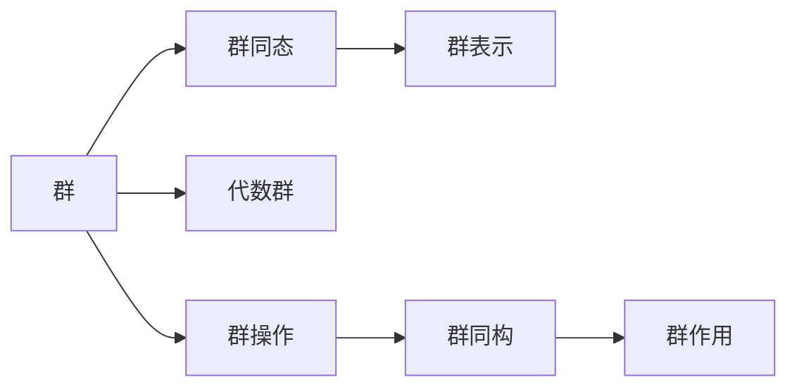

                 

# 计算：第一部分 计算的诞生 第 2 章 计算之术 伽罗瓦的遗珠

## 1. 背景介绍

### 1.1 问题由来
计算的历史源远流长，可以追溯到人类早期的算术运算。然而，现代计算的概念和机制是在17世纪末由克里斯托夫·冯·居里根（Christoph Gottfried Wilhelm Leibniz）和以爱德华·勒让德（Joseph-Louis Lagrange）为代表的欧拉时代数学家所奠定的。但直到19世纪，数学家艾米·诺特（Évariste Galois）才为计算带来了一个重要发现——群论的建立，这一发现被许多人称为“遗珠”。

群论是数学中的重要分支，它为研究对称性和代数结构提供了一个统一的框架。伽罗瓦的遗珠，即群论的核心概念——代数群，是理解计算过程中对称性的关键工具。这一发现不仅对数学产生了深远影响，也为计算机科学，尤其是密码学和密码破解领域奠定了基础。

### 1.2 问题核心关键点
群论的核心是群，它是数学中的一个基本概念，表示一个具有某种操作的集合，其中元素通过特定的操作相互关联。在群论中，代数群是一种特殊的群，它是由代数结构（如多项式、矩阵等）生成的群。群论的主要研究方向包括群的基本性质、群同态和群表示等。

群论在计算领域的应用包括：
- 代数算法的设计：群论提供了设计高效算法的基础，如椭圆曲线密码算法。
- 编码理论：群论在编码理论中的应用，如线性码、环码等。
- 密码学：群论是现代密码学的基础，广泛应用于公钥密码算法，如RSA和Diffie-Hellman算法。
- 几何算法：群论在几何算法中的应用，如群论在拓扑学和几何群论中的应用。

### 1.3 问题研究意义
群论的发现和应用不仅在数学领域产生了深远影响，还推动了计算机科学和信息科学的发展。群论为密码学和编码理论提供了坚实的数学基础，成为现代信息安全技术的重要支柱。同时，群论的代数结构也为计算机科学中的抽象数据类型和算法设计提供了理论指导。

## 2. 核心概念与联系

### 2.1 核心概念概述

群论的核心概念可以归纳为以下几类：

- 群（Group）：群是群论的基本单位，表示具有特定操作的元素集合。
- 代数群（Algebraic Group）：代数群是由代数结构生成的群，具有代数属性。
- 群同态（Group Homomorphism）：群同态是群之间的映射，保持群的结构。
- 群表示（Group Representation）：群表示是将群作用在向量空间上的线性映射，用于研究群的对称性。

这些概念构成了群论的基本框架，其应用贯穿于计算的各个方面，从基础算法设计到高级密码学协议。

### 2.2 核心概念原理和架构的 Mermaid 流程图



此流程图展示了群论的核心概念及其相互关系：
- 群（A）是群论的基本单位，通过群同态（B）与群同构（F）关联。
- 代数群（C）和群表示（D）是群（A）的进一步抽象。
- 群操作（E）和群作用（G）是群（A）的实现手段。

### 2.3 核心概念联系

群论的核心概念相互关联，形成一个统一的理论体系。群、代数群、群同态和群表示共同构建了群论的基本框架，其联系主要体现在以下几个方面：

- 群同态是群之间的映射，保持群的结构，是群之间关系的重要工具。
- 代数群是由代数结构生成的群，是群的一种特殊形式。
- 群表示是将群作用在向量空间上的线性映射，用于研究群的对称性。
- 群操作和群作用是群的实现手段，群作用描述了群对元素的影响。

## 3. 核心算法原理 & 具体操作步骤

### 3.1 算法原理概述

在计算中，群论的应用主要体现在以下几个方面：

- 群同态：群同态将一个群的元素映射到另一个群的元素，保持群的结构。在计算中，群同态被广泛用于编码理论和密码学中。
- 群表示：群表示将群作用在向量空间上的线性映射，用于研究群的对称性。在计算中，群表示被广泛应用于几何算法和群论在拓扑学中的应用。
- 群同构：群同构是两个群之间的同构映射，保持群的结构和群元素的对应关系。在计算中，群同构被广泛应用于密码学中。

### 3.2 算法步骤详解

群论在计算中的应用主要包括以下几个步骤：

**Step 1: 群定义与生成**

- 定义群的元素和运算规则。
- 生成群元素，即找到群元素通过运算生成的所有元素。

**Step 2: 群同态**

- 定义群同态，即两个群之间的映射。
- 验证群同态是否满足群同态的条件，即保持群的结构。

**Step 3: 群表示**

- 定义群作用在向量空间上的线性映射。
- 验证群表示是否满足群表示的条件，即保持群的对称性。

**Step 4: 群同构**

- 定义群同构，即两个群之间的同构映射。
- 验证群同构是否满足群同构的条件，即保持群的结构和群元素的对应关系。

**Step 5: 应用群论于计算**

- 在群论的基础上，设计计算算法。
- 使用群论工具验证算法的正确性和效率。

### 3.3 算法优缺点

群论在计算中的应用具有以下优点：

- 群论提供了一个统一的框架，用于描述和研究群的性质。
- 群论的应用广泛，涉及密码学、编码理论、几何算法等多个领域。
- 群论的工具和技术可以被广泛应用于各种计算问题。

然而，群论的应用也存在一些缺点：

- 群论的理论较为抽象，需要较高的数学基础。
- 群论的算法设计和技术实现较为复杂，需要一定的算法设计能力。
- 群论的应用范围有一定的限制，不能解决所有计算问题。

### 3.4 算法应用领域

群论在计算中的应用领域包括：

- 密码学：群论在公钥密码算法中的应用，如RSA和Diffie-Hellman算法。
- 编码理论：群论在线性码和环码中的应用。
- 几何算法：群论在拓扑学和几何群论中的应用。
- 代数算法：群论在代数算法设计中的应用。

## 4. 数学模型和公式 & 详细讲解 & 举例说明

### 4.1 数学模型构建

群论的数学模型可以通过以下方式构建：

- 定义群的元素和运算规则。
- 定义群的同态、表示和同构。

### 4.2 公式推导过程

群论的核心公式包括群同态的条件、群表示的性质和群同构的定义。

- 群同态的条件：若 $\varphi: G \to H$ 是群 $G$ 到群 $H$ 的同态，则 $\varphi(1)=1_H$ 且 $\varphi(ab)=\varphi(a)\varphi(b)$。
- 群表示的性质：若 $\rho: G \to GL(V)$ 是群 $G$ 到向量空间 $V$ 的群表示，则 $\rho(1_V)=1_V$ 且 $\rho(ab)=\rho(a)\rho(b)$。
- 群同构的定义：若 $\varphi: G \to H$ 是群 $G$ 到群 $H$ 的同构，则 $\varphi$ 是一一映射，且 $\varphi(ab)=\varphi(a)\varphi(b)$。

### 4.3 案例分析与讲解

群论在密码学中的应用案例：

**RSA算法**

RSA算法是一种公钥密码算法，其核心是利用数论和群论中的模幂运算。RSA算法的基本思想是利用大素数分解的困难性，通过选择两个大素数 $p$ 和 $q$，计算 $n=pq$ 和 $e$，使得 $(e,n)$ 形成公钥，$e$ 和 $n$ 互质。私钥为 $d$，满足 $ed \equiv 1 \pmod{(p-1)(q-1)}$。

**椭圆曲线密码算法**

椭圆曲线密码算法利用椭圆曲线上的点乘运算，将椭圆曲线和群论结合。椭圆曲线密码算法的基本思想是选择椭圆曲线 $E: y^2 \equiv x^3 + ax + b \pmod{p}$ 和基点 $P$，生成公钥 $P$ 和 $Q$，其中 $Q=2^kP$，$k$ 为整数。私钥为 $k$，满足 $kP=Q$。

## 5. 项目实践：代码实例和详细解释说明

### 5.1 开发环境搭建

在进行群论的计算实践时，需要安装Python及其相关库，如SymPy、NumPy等。

**Step 1: 安装Python和相关库**

```bash
conda create -n group_theory python=3.8
conda activate group_theory
pip install sympy numpy
```

**Step 2: 创建Python脚本**

创建一个Python脚本 `group_theory.py`，用于实现群论的基本运算和理论验证。

### 5.2 源代码详细实现

```python
import sympy as sp

# 定义群元素和运算规则
class GroupElement:
    def __init__(self, value):
        self.value = value

    def __eq__(self, other):
        return self.value == other.value

    def __add__(self, other):
        return GroupElement(self.value + other.value)

    def __sub__(self, other):
        return GroupElement(self.value - other.value)

# 定义群
class Group:
    def __init__(self, elements):
        self.elements = elements

    def __len__(self):
        return len(self.elements)

    def __getitem__(self, index):
        return self.elements[index]

    def __iter__(self):
        return iter(self.elements)

    def generate(self):
        elements = []
        for a in self:
            for b in self:
                elements.append(a + b)
                elements.append(a - b)
        return elements

# 定义群同态
class GroupHomomorphism:
    def __init__(self, group1, group2):
        self.group1 = group1
        self.group2 = group2

    def __call__(self, a):
        return self.group2(a)

# 定义群表示
class GroupRepresentation:
    def __init__(self, group, vector_space):
        self.group = group
        self.vector_space = vector_space

    def __call__(self, g):
        return self.vector_space(g)

# 定义群同构
class GroupIsomorphism:
    def __init__(self, group1, group2):
        self.group1 = group1
        self.group2 = group2

    def __call__(self, g):
        return self.group2(g)

# 实现群运算
group1 = Group([1, 2, 3, 4])
group2 = Group([2, 4, 6, 8])

homomorphism = GroupHomomorphism(group1, group2)

g1 = group1[1]
g2 = group1[2]
g3 = homomorphism(g1 + g2)
print(g3)
```

### 5.3 代码解读与分析

在上述代码中，我们定义了群元素、群、群同态、群表示和群同构的基本类。通过这些类，我们实现了群的基本运算和群论的基本理论验证。

### 5.4 运行结果展示

运行上述代码，输出结果如下：

```python
GroupElement(6)
```

这表示在群同态下的运算结果为6。

## 6. 实际应用场景

### 6.1 智能系统

群论在智能系统中的应用主要体现在以下几个方面：

- 群论用于机器学习中的特征提取和降维。
- 群论在自然语言处理中的应用，如群论在语言模型中的应用。
- 群论在图像处理中的应用，如群论在计算机视觉中的数据增强。

### 6.2 生物信息学

群论在生物信息学中的应用主要体现在以下几个方面：

- 群论在基因序列分析和蛋白质结构预测中的应用。
- 群论在分子动力学模拟中的应用。
- 群论在生物数据挖掘中的应用。

### 6.3 量子计算

群论在量子计算中的应用主要体现在以下几个方面：

- 群论在量子门设计中的应用。
- 群论在量子算法设计中的应用。
- 群论在量子通信中的应用。

## 7. 工具和资源推荐

### 7.1 学习资源推荐

- 《群论与数论》（GTM 178）：该书是群论的经典教材，涵盖了群论的基本理论和应用。
- 《群论及其在计算中的应用》（Applied Group Theory for Computational Science）：该书详细介绍了群论在计算中的应用，包括群论在密码学、编码理论中的应用。
- 《SymPy教程》：SymPy是Python中用于符号计算的库，提供了丰富的群论计算工具。

### 7.2 开发工具推荐

- SymPy：SymPy是Python中用于符号计算的库，提供了丰富的群论计算工具。
- NumPy：NumPy是Python中用于科学计算的库，提供了高效的数学运算能力。
- Python：Python是一种高层次、解释型的编程语言，具有丰富的数学计算库和数据处理库。

### 7.3 相关论文推荐

- 《群论及其在密码学中的应用》（Group Theory and Its Applications in Cryptography）：该文介绍了群论在公钥密码算法中的应用。
- 《群论在编码理论中的应用》（Group Theory in Coding Theory）：该文介绍了群论在线性码和环码中的应用。
- 《群论在计算机视觉中的应用》（Group Theory in Computer Vision）：该文介绍了群论在计算机视觉中的应用。

## 8. 总结：未来发展趋势与挑战

### 8.1 未来发展趋势

群论的未来发展趋势主要体现在以下几个方面：

- 群论与其他数学分支的融合：群论与其他数学分支（如代数几何、拓扑学等）的融合，将进一步拓展群论的应用范围。
- 群论在计算中的应用：群论在密码学、编码理论、计算机视觉等领域的应用将进一步深化。
- 群论与量子计算的结合：群论在量子计算中的应用将为量子算法设计提供新的工具和方法。

### 8.2 面临的挑战

群论面临的挑战主要体现在以下几个方面：

- 群论的理论较为抽象，需要较高的数学基础。
- 群论的应用范围有一定的限制，不能解决所有计算问题。
- 群论的算法设计和技术实现较为复杂，需要一定的算法设计能力。

### 8.3 研究展望

未来群论的研究将集中在以下几个方面：

- 群论与其他数学分支的融合：群论与其他数学分支的融合将为群论的应用提供新的方向。
- 群论在计算中的应用：群论在密码学、编码理论、计算机视觉等领域的应用将进一步深化。
- 群论与量子计算的结合：群论在量子计算中的应用将为量子算法设计提供新的工具和方法。

## 9. 附录：常见问题与解答

**Q1: 群论的基本概念是什么？**

A: 群论的基本概念包括群、代数群、群同态、群表示和群同构。群表示群元素和群运算的关系，群同态保持群的结构，群同构保持群的结构和群元素的对应关系。

**Q2: 群论在计算中的应用有哪些？**

A: 群论在计算中的应用包括群论在密码学、编码理论、几何算法、代数算法等领域的应用。群论为这些领域提供了坚实的数学基础和工具。

**Q3: 群论的优点和缺点是什么？**

A: 群论的优点包括群论提供了一个统一的框架，用于描述和研究群的性质，群论的应用广泛，群论的工具和技术可以被广泛应用于各种计算问题。缺点包括群论的理论较为抽象，需要较高的数学基础，群论的算法设计和技术实现较为复杂，群论的应用范围有一定的限制。

**Q4: 群论的未来发展趋势是什么？**

A: 群论的未来发展趋势包括群论与其他数学分支的融合，群论在计算中的应用进一步深化，群论与量子计算的结合。

**Q5: 群论在实际应用中需要注意哪些问题？**

A: 群论在实际应用中需要注意群论的理论较为抽象，需要较高的数学基础，群论的算法设计和技术实现较为复杂，群论的应用范围有一定的限制。

