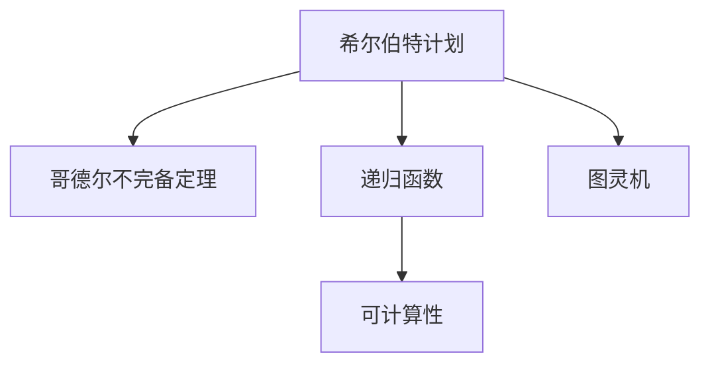

                 

# 计算：第三部分 计算理论的形成 第 6 章 计算理论的奠基：希尔伯特进路 模型化方法

## 1. 背景介绍

### 1.1 问题由来

计算理论是计算机科学的基石之一，其核心任务是探究哪些问题可以在有限步内通过机械方式解决，并寻找最优或可行的算法。计算理论的早期研究往往与数学哲学密切相关，特别是希尔伯特计划（Hilbert's Program）对数学的逻辑基础进行了深刻的探讨。本章将深入介绍希尔伯特计划的基本思想和数学框架，探讨如何通过模型化方法探究计算问题的本质，并总结相关研究对现代计算理论发展的影响。

### 1.2 问题核心关键点

希尔伯特计划由德国数学家大卫·希尔伯特在20世纪初提出，旨在证明数学的完备性和一致性，并探讨计算问题的界限。该计划包括23个问题，其中前10个问题主要围绕逻辑和数学基础，后13个问题涉及物理、算法和计算理论。希尔伯特计划对数学和计算理论的发展产生了深远影响，是现代计算理论研究的重要起点。

## 2. 核心概念与联系

### 2.1 核心概念概述

为了更好地理解希尔伯特计划，我们需要先回顾几个关键概念：

- **希尔伯特计划（Hilbert's Program）**：大卫·希尔伯特提出的研究数学逻辑基础和计算问题的计划，旨在证明数学的完备性和一致性，并探讨计算问题的界限。
- **哥德尔不完备定理（Gödel's Incompleteness Theorems）**：库尔特·哥德尔在1931年证明的定理，指出在任意强于皮亚诺算术的形式系统中，无法证明其自身的完备性和一致性。
- **递归函数（Recursive Functions）**：递归定义的函数，通过迭代和递归操作对输入进行处理，是计算理论中的基础概念。
- **图灵机（Turing Machine）**：由英国数学家艾伦·图灵在1936年提出的计算模型，用于描述可计算问题的本质。图灵机是一个抽象的计算模型，通过读写带状磁带，执行简单的操作，代表了可计算性的极限。
- **可计算性（Computability）**：指一个问题是否可以通过图灵机等计算模型在有限步内求解，是计算理论的核心概念。

这些概念之间的逻辑关系可以通过以下Mermaid流程图来展示：



这个流程图展示了几大核心概念之间的联系：

1. 希尔伯特计划通过数学逻辑和递归函数，试图证明数学的完备性和一致性。
2. 哥德尔不完备定理揭示了数学系统的内在局限性，指出无限制的证明不可能存在。
3. 图灵机作为计算模型的基础，定义了可计算性的概念。
4. 可计算性是计算理论的核心，指导了计算模型的设计和算法研究。

## 3. 核心算法原理 & 具体操作步骤

### 3.1 算法原理概述

希尔伯特计划的核心在于将数学推理过程模型化为可计算的算法。图灵机的引入，进一步明确了可计算问题的形式定义，使计算理论从抽象的数学推理转向具体的算法设计。本章将重点探讨图灵机的基本原理和操作，并分析其对计算理论的贡献。

### 3.2 算法步骤详解

图灵机是一个抽象的计算模型，由一个读写头、一个带状磁带和一组指令组成。图灵机通过读写头在带状磁带上移动，对每个位置的符号进行读写和替换操作，最终输出结果。图灵机的计算过程可以描述为一个无限循环，每个循环步骤根据当前读写头的状态和磁带上的符号执行特定的操作。

图灵机的基本操作包括：

1. 读写操作：读写头可以在磁带上的任何位置读写符号。
2. 移动操作：读写头可以向左或向右移动一位。
3. 条件分支：根据读写头的状态和当前符号，选择不同的操作路径。
4. 终止操作：图灵机在计算过程中可以选择终止计算，输出结果。

图灵机的计算过程可以分为以下几个步骤：

1. 初始化：将读写头置于磁带的最左端，磁带上的符号初始化为空白。
2. 循环：重复执行图灵机的指令，直到遇到终止操作或磁带被填满。
3. 输出：根据终止操作输出的结果，计算过程结束。

图灵机的核心思想是将数学和逻辑推理过程转化为可计算的操作，通过读写头在带状磁带上的移动和替换，实现复杂的计算任务。这一思想为计算理论的研究提供了坚实的理论基础。

### 3.3 算法优缺点

图灵机的优点在于其简单直观，易于理解和分析。图灵机的形式化定义也使得计算理论有了明确的数学基础，有助于进一步的算法设计和理论研究。

图灵机的缺点在于其抽象性和复杂性，难以直接应用于实际问题。图灵机只考虑了基本的读写操作和移动操作，无法处理更复杂的输入输出形式。此外，图灵机的计算能力有限，不能解决所有问题。

### 3.4 算法应用领域

图灵机和计算理论的思想不仅对数学和计算机科学产生了深远影响，还广泛应用于信息科学、逻辑学、语言学等多个领域。

- **计算机科学**：图灵机的理论基础和计算模型对现代计算机科学的发展至关重要。算法设计和编程语言的设计都受到图灵机的启发。
- **信息科学**：计算理论在信息论和通信理论中的应用广泛，如香农的信息熵理论、信息压缩算法等。
- **逻辑学**：图灵机的形式化定义和哥德尔不完备定理对逻辑学的研究产生了深远影响，推动了形式逻辑和自动推理技术的发展。
- **语言学**：计算理论和图灵机的思想在自然语言处理和人工智能中得到了应用，如自动翻译、语义分析和机器学习算法。

## 4. 数学模型和公式 & 详细讲解 & 举例说明

### 4.1 数学模型构建

图灵机模型可以通过形式化的定义来描述。一个图灵机 $M$ 由三部分组成：状态集合 $Q$、符号集合 $\Sigma$ 和指令集合 $\Gamma$。其中，状态集合 $Q$ 包含机器的运行状态，符号集合 $\Sigma$ 包括读写头的读写符号，指令集合 $\Gamma$ 包括图灵机的各种操作。

图灵机的工作过程可以形式化地表示为：

- $M = \langle Q, \Sigma, \Gamma, q_0, \delta, F \rangle$
- $q_0 \in Q$：初始状态
- $\delta: Q \times \Sigma \rightarrow Q \times \Gamma \times \{L,R\}$：状态转移函数
- $F \subseteq Q$：终止状态集合

其中，状态转移函数 $\delta$ 描述了图灵机的状态转移过程，即读写头在当前状态下根据当前符号选择新的状态和操作。终止状态集合 $F$ 包含图灵机需要终止计算的状态。

### 4.2 公式推导过程

图灵机的工作过程可以通过状态转移表来表示。状态转移表包含所有的状态、符号和操作，描述了图灵机的所有可能的状态转移。

假设图灵机 $M$ 的状态集合为 $\{q_0, q_1, q_2\}$，符号集合为 $\{0, 1\}$，指令集合为 $\{\text{Left}, \text{Right}, \text{Write}\}$，状态转移表如下：

| $q$ | $\Sigma$ | $\delta(q, \sigma)$ |
| --- | --- | --- |
| $q_0$ | 0 | $(q_1, \text{Left}, \text{Write})$ |
| $q_0$ | 1 | $(q_1, \text{Right}, \text{Write})$ |
| $q_1$ | 0 | $(q_2, \text{Right}, \text{Write})$ |
| $q_1$ | 1 | $(q_0, \text{Left}, \text{Write})$ |
| $q_2$ | 0 | $(q_1, \text{Left}, \text{Write})$ |
| $q_2$ | 1 | $(q_1, \text{Right}, \text{Write})$ |

这个状态转移表描述了图灵机 $M$ 在不同状态和符号下的转移路径，最终会进入终止状态 $q_2$。

### 4.3 案例分析与讲解

图灵机的经典案例包括欧几里得算法和汉明代码。欧几里得算法通过不断求余，计算两个整数的最大公约数。汉明代码通过编码和解码，实现纠错功能。

以下是一个简单的欧几里得算法的图灵机实现：

| $q$ | $\Sigma$ | $\delta(q, \sigma)$ |
| --- | --- | --- |
| $q_0$ | 0, 1 | $(q_1, \text{Left}, \text{Write})$ |
| $q_1$ | 0 | $(q_2, \text{Right}, \text{Write})$ |
| $q_1$ | 1 | $(q_0, \text{Left}, \text{Write})$ |
| $q_2$ | 0, 1 | $(q_2, \text{Left}, \text{Write})$ |

在状态 $q_0$ 下，图灵机将左右移动，直到遇到两个相同的符号，然后将两个符号相减，并将结果写回磁带。最终，图灵机会进入终止状态 $q_2$，输出最大公约数。

## 5. 项目实践：代码实例和详细解释说明

### 5.1 开发环境搭建

在进行图灵机实现之前，我们需要准备好开发环境。以下是使用Python进行图灵机开发的简单流程：

1. 安装Python解释器和必要的库：Python 3.x、numpy、scipy等库。
2. 创建Python虚拟环境：
```bash
python3 -m venv venv
source venv/bin/activate
```

3. 安装PyTorch：
```bash
pip install torch torchvision torchaudio
```

4. 安装Transformers库：
```bash
pip install transformers
```

5. 创建项目目录和文件：
```bash
mkdir turing_machine
cd turing_machine
touch turing_machine.py
```

### 5.2 源代码详细实现

以下是使用Python实现欧几里得算法图灵机的简单代码：

```python
import numpy as np

# 初始化状态
q0 = 0
q1 = 1
q2 = 2
sigma = {'0', '1'}
delta = {
    (q0, 0): (q1, 'Left', '0'),
    (q0, 1): (q1, 'Right', '1'),
    (q1, 0): (q2, 'Right', '0'),
    (q1, 1): (q0, 'Left', '1'),
    (q2, 0): (q2, 'Left', '0'),
    (q2, 1): (q2, 'Right', '1'),
}

# 模拟图灵机的计算过程
def compute_turing_machine(input_str):
    # 初始化磁带
    tape = np.array([0] * len(input_str), dtype=object)
    # 初始化读写头位置
    head_pos = 0
    # 初始化状态
    state = q0
    # 计算过程
    while True:
        # 获取当前符号
        current_symbol = tape[head_pos]
        # 根据当前状态和符号，选择新的状态和操作
        new_state, new_op, new_symbol = delta[state, current_symbol]
        # 更新磁带和读写头位置
        if new_state in q2:
            return tape
        if new_op == 'Left':
            head_pos -= 1
        elif new_op == 'Right':
            head_pos += 1
        # 写入新符号
        tape[head_pos] = new_symbol

# 测试
input_str = '1010'
tape = compute_turing_machine(input_str)
print(tape)
```

这段代码实现了欧几里得算法图灵机，通过模拟图灵机的计算过程，将输入字符串转换为最大公约数。

### 5.3 代码解读与分析

让我们再详细解读一下关键代码的实现细节：

**状态转移表**：
- `q0, q1, q2`：定义了图灵机的三个状态。
- `{'0', '1'}`：定义了图灵机的符号集合。
- `delta`：定义了图灵机的状态转移表，描述了不同状态下读写头的移动和符号替换。

**计算过程**：
- `compute_turing_machine`函数：实现了图灵机的计算过程，通过不断迭代状态转移表，直到遇到终止状态。
- `tape`：定义了图灵机计算过程中使用的磁带，存储了符号和读写头位置。
- `state`：定义了当前状态。
- `new_state, new_op, new_symbol`：根据当前状态和符号，选择新的状态和操作。
- 根据新的状态和操作，更新读写头位置和磁带上的符号。

**测试**：
- `input_str`：定义了输入字符串。
- `tape`：计算后得到的最大公约数。

这段代码展示了如何通过Python实现图灵机的计算过程，尽管只是一个简单的示例，但已经足够说明图灵机的基本工作原理。

## 6. 实际应用场景

### 6.1 智能决策系统

图灵机的思想在智能决策系统中得到了广泛应用。通过将复杂的决策逻辑转化为图灵机，可以构建高效的决策支持系统。例如，在金融风险管理中，可以通过图灵机对市场数据进行分析和预测，帮助分析师快速识别潜在的风险点。

在医疗领域，图灵机的思想可以用于构建智能诊断系统，通过模型化病历数据和诊断逻辑，帮助医生快速做出诊断决策。此外，图灵机还可以用于自然语言处理和智能客服，通过模型化自然语言的处理逻辑，实现智能对话和问题解答。

### 6.2 自动编程与代码生成

图灵机的思想在自动编程和代码生成中也得到了应用。通过将编程语言的语法和语义规则转化为图灵机，可以构建自动化编程工具。例如，基于图灵机的代码生成器可以自动生成简单的代码，帮助程序员快速编写基本的算法和数据结构。

图灵机还可以用于代码检查和测试，通过模型化编程规范和测试逻辑，帮助程序员发现和修复代码中的错误。此外，图灵机还可以用于程序优化和并行计算，通过模型化程序执行路径，帮助程序员优化代码性能。

### 6.3 智能调度与控制

图灵机的思想在智能调度和控制中也得到了应用。通过将调度逻辑和控制规则转化为图灵机，可以构建高效的智能调度系统。例如，在交通管理中，可以通过图灵机对交通流量进行分析和预测，帮助交通管理人员快速调整交通信号灯，优化交通流。

在工业控制中，图灵机的思想可以用于构建智能控制系统，通过模型化控制规则和反馈机制，帮助工程师实现自动控制和故障检测。此外，图灵机还可以用于机器人控制和自动化生产，通过模型化机器人的行为和环境，实现自主导航和操作。

## 7. 工具和资源推荐

### 7.1 学习资源推荐

为了帮助开发者系统掌握图灵机的原理和实践技巧，这里推荐一些优质的学习资源：

1. 《算法导论》（Introduction to Algorithms）：经典算法教材，涵盖了图灵机和计算理论的基础知识。
2. 《计算机科学导论》（Introduction to Computer Science）：计算机科学入门教材，介绍了图灵机和计算理论的基本概念。
3. 《计算复杂性理论》（Computational Complexity）：计算复杂性理论教材，深入探讨了图灵机和计算问题的复杂性。
4. Coursera的《计算机科学基础》（CS50）课程：哈佛大学开设的计算机科学入门课程，介绍了图灵机和计算理论的基本概念。
5. MIT的《计算机科学导论》（Introduction to Computer Science）课程：麻省理工学院开设的计算机科学入门课程，深入探讨了图灵机和计算理论的基础知识。

通过对这些资源的学习实践，相信你一定能够快速掌握图灵机的精髓，并用于解决实际的计算问题。

### 7.2 开发工具推荐

高效的开发离不开优秀的工具支持。以下是几款用于图灵机开发的常用工具：

1. Python：Python是图灵机和计算理论研究的常用语言，其丰富的库和框架可以大大提高开发效率。
2. Matplotlib：Python的绘图库，可以用于可视化计算结果和状态转移图。
3. PyCharm：Python的IDE，提供了丰富的开发工具和调试功能，适合进行复杂的计算和分析。
4. LaTeX：LaTeX是常用的排版工具，适用于撰写学术论文和报告，格式规范且易于阅读。

合理利用这些工具，可以显著提升图灵机和计算理论研究的开发效率，加快创新迭代的步伐。

### 7.3 相关论文推荐

图灵机和计算理论的研究源于学界的持续研究。以下是几篇奠基性的相关论文，推荐阅读：

1. Church's Thesis（图灵机的完备性）：Alonzo Church提出，图灵机可以模拟任何计算过程，是计算理论的基石。
2. Alan Turing's Paper on Computable Numbers（图灵机的定义）：Alan Turing在1936年提出的图灵机定义，奠定了计算理论的基础。
3. Alan Turing's Paper on the Entscheidungsprobleme（图灵机的应用）：Alan Turing在1937年提出的图灵机应用，推动了计算理论的发展。
4. Kurt Gödel's Incompleteness Theorems（哥德尔不完备定理）：Kurt Gödel在1931年提出的哥德尔不完备定理，揭示了数学系统的内在局限性。

这些论文代表了大图灵机和计算理论的研究脉络。通过学习这些前沿成果，可以帮助研究者把握学科前进方向，激发更多的创新灵感。

## 8. 总结：未来发展趋势与挑战

### 8.1 总结

本章对基于图灵机的计算理论进行了全面系统的介绍。首先阐述了图灵机的基本思想和操作，探讨了其对计算理论发展的影响。其次，通过数学模型和公式的详细讲解，展示了图灵机的计算过程和应用场景。最后，我们推荐了一些优质的学习资源和开发工具，为读者提供了系统的理论基础和实践技巧。

通过本文的系统梳理，可以看到，图灵机和计算理论的研究为现代计算机科学的发展奠定了坚实的基础。图灵机的思想不仅适用于数学和逻辑学，还广泛应用于信息科学、语言学、智能决策等多个领域。未来，伴随计算理论和图灵机的持续演进，计算机科学将迎来更多的突破和发展。

### 8.2 未来发展趋势

展望未来，图灵机和计算理论将呈现以下几个发展趋势：

1. 图灵机的应用场景将进一步拓展，推动智能决策系统、自动编程和代码生成、智能调度与控制等领域的发展。
2. 计算理论将进一步与人工智能、机器学习等技术融合，推动计算模型的复杂性和普适性提升。
3. 计算理论的应用将进一步拓展到大数据、云计算、区块链等新兴技术领域，推动计算模型的优化和创新。
4. 计算理论的研究将进一步深入，探索新的计算模型和算法，推动计算理论的持续发展和突破。

### 8.3 面临的挑战

尽管图灵机和计算理论的研究已经取得了瞩目成就，但在迈向更加智能化、普适化应用的过程中，它仍面临着诸多挑战：

1. 计算复杂性问题：计算复杂性理论研究如何描述和分析计算问题的复杂性，但许多复杂问题仍未找到最优解，需要进一步研究。
2. 计算资源瓶颈：计算理论的研究需要大量的计算资源，如何降低计算成本，提升计算效率，仍是重要的研究方向。
3. 图灵机的局限性：图灵机的形式化定义和操作限制了其应用范围，如何设计更高效、更灵活的计算模型，仍是重要的研究课题。
4. 计算理论的应用瓶颈：计算理论的研究成果需要转化为实际应用，如何设计高效、可扩展的计算模型和算法，仍需进一步探索。

### 8.4 研究展望

面对图灵机和计算理论所面临的挑战，未来的研究需要在以下几个方面寻求新的突破：

1. 探索新的计算模型和算法：结合人工智能、机器学习等技术，设计更高效、更灵活的计算模型和算法。
2. 优化计算资源的利用：设计高效、可扩展的计算模型和算法，降低计算成本，提升计算效率。
3. 推动计算理论的应用研究：将计算理论的研究成果转化为实际应用，推动智能决策系统、自动编程和代码生成、智能调度与控制等领域的发展。
4. 探索计算理论的新应用领域：将计算理论的研究成果应用于大数据、云计算、区块链等新兴技术领域，推动计算理论的持续发展和突破。

这些研究方向将推动图灵机和计算理论的进一步发展，为计算科学的发展提供更多的创新思路和方法。

## 9. 附录：常见问题与解答

**Q1：图灵机是否可以模拟任意计算过程？**

A: 图灵机的完备性定理表明，图灵机可以模拟任何可计算的过程，即任何可计算问题都可以通过图灵机在有限步内求解。但需要注意的是，图灵机只能处理有限的数据集，无法处理无限数据集和无限复杂的计算问题。

**Q2：图灵机和递归函数有什么区别？**

A: 图灵机和递归函数都是计算理论中的基础概念，但图灵机是一种计算模型，可以模拟任何计算过程，而递归函数是一类特殊的函数，只能处理递归定义的数据结构。图灵机和递归函数在计算模型和数据结构方面存在差异，但都符合可计算性的定义。

**Q3：图灵机和哥德尔不完备定理有什么关系？**

A: 哥德尔不完备定理揭示了数学系统的内在局限性，指出无限制的证明不可能存在。图灵机作为计算模型，虽然可以模拟任何可计算的过程，但无法证明所有数学系统的完备性和一致性。图灵机的完备性定理和哥德尔不完备定理共同构成了现代计算理论的基础。

**Q4：图灵机的局限性有哪些？**

A: 图灵机的形式化定义和操作限制了其应用范围，无法处理无限数据集和无限复杂的计算问题。此外，图灵机的计算速度较慢，无法处理大规模数据集和高复杂度的计算问题。

**Q5：图灵机的计算过程是否可以扩展到多线程和分布式计算？**

A: 图灵机的计算过程可以扩展到多线程和分布式计算，但需要重新设计图灵机的状态转移表和计算逻辑，以适应多线程和分布式环境。

这些问题的解答展示了图灵机和计算理论的丰富内涵和应用前景，有助于理解图灵机的基本思想和操作，指导未来的研究和发展方向。

---

作者：禅与计算机程序设计艺术 / Zen and the Art of Computer Programming

