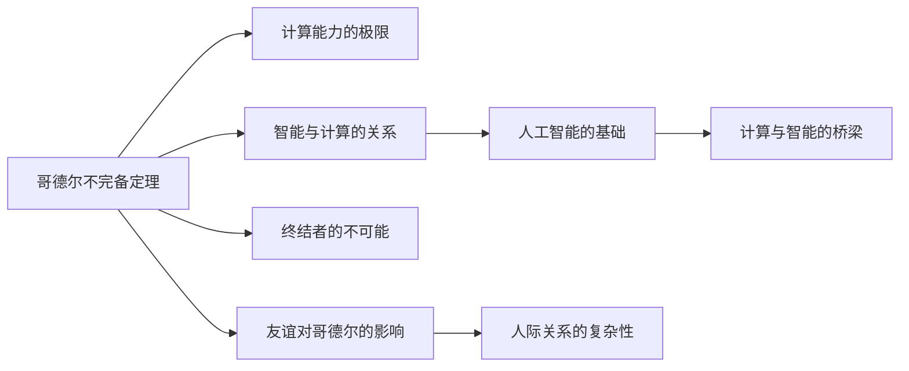

                 

# 计算：第三部分 计算理论的形成 第 7 章 计算不能做什么：终结者哥德尔 伟大的友谊

## 1. 背景介绍

在计算理论的探索之路上，哥德尔的名字如雷贯耳。他在数理逻辑和数学基础方面的深邃见解，不仅为计算机科学奠定了坚实的理论基础，也为哲学和人工智能的发展提供了重要启示。在本篇章中，我们将深入探讨哥德尔与计算不能做的事情之间的关系，以及他那伟大而复杂的朋友关系，带你了解计算理论背后的故事。

## 2. 核心概念与联系

### 2.1 核心概念概述

- **哥德尔不完备定理**：哥德尔于1931年证明的一个数学定理，表明在任何一致且强大的形式系统中，总存在不可判定的命题，即无法通过该系统的公理和推理规则证明其为真或假的命题。

- **计算机与计算能力**：计算是计算机科学的核心任务，任何计算任务都可以归结为一系列的逻辑运算。哥德尔的不完备定理揭示了计算理论的极限，也引发了对计算机智能的深刻思考。

- **智能与计算**：智能是复杂系统的表现，而计算是实现智能的手段。哥德尔的工作让人们认识到，计算并非万能的，存在一些问题是无法通过计算解决的。

- **终结者**：在科幻小说和电影中，终结者是能够战胜人类的人工智能角色，但根据哥德尔的证明，计算机无法构建这样的系统。

- **友谊**：在哥德尔的生活中，一些复杂而深刻的人际关系对其研究产生了深远影响，如他与希尔伯特、柯西的关系。

### 2.2 核心概念原理和架构的 Mermaid 流程图



这个流程图展示了哥德尔不完备定理与计算理论的核心概念之间的关系，以及友谊在哥德尔研究中的角色。

## 3. 核心算法原理 & 具体操作步骤

### 3.1 算法原理概述

哥德尔的不完备定理基于一个基本的假设，即任何形式化的公理系统都是一致的。一致性意味着系统中的所有命题都是自洽的，不会出现矛盾。然而，哥德尔证明了，在一个一致的系统中，总存在命题既不能证明为真，也不能证明为假。

### 3.2 算法步骤详解

1. **形式化系统**：首先，假设一个形式化的公理系统，该系统足够强大，可以描述所有的数学问题。

2. **构造证明**：在系统中，构造一个命题，该命题在系统中既不能被证明为真，也不能被证明为假。

3. **不完备性**：证明该命题存在，说明系统存在未解决的问题。

### 3.3 算法优缺点

**优点**：
- 揭示了计算理论的边界。
- 为人工智能的发展提供了重要的理论基础。

**缺点**：
- 复杂性高，理解难度大。
- 对计算能力有所限制。

### 3.4 算法应用领域

哥德尔的不完备定理不仅在数学基础领域具有重要意义，也在计算机科学、人工智能、哲学等领域产生了深远影响。

## 4. 数学模型和公式 & 详细讲解 & 举例说明

### 4.1 数学模型构建

哥德尔的证明基于一个形式化的公理系统，该系统通常被称为**皮亚诺算术(Peano Arithmetic)**。皮亚诺算术系统包括一个基本公理集，描述自然数的定义和性质。

### 4.2 公式推导过程

1. **定义符号**：引入符号$x$表示自然数，$a(x)$表示$x$是自然数。

2. **定义基本命题**：$0$是自然数，对任意自然数$x$，$x+1$也是自然数。

3. **构造不可证明命题**：
   $$ \psi(x) = \forall y \in \mathbb{N}, a(y) \rightarrow a(x) $$

   该命题在系统中既不能被证明为真，也不能被证明为假。

4. **证明不可证明性**：通过递归构造，证明$\psi(x)$既不违反系统的一致性，也不为系统所蕴含。

### 4.3 案例分析与讲解

哥德尔的证明不仅揭示了数学的不完备性，也启发计算机科学家们思考计算理论的边界。现代计算机科学中，哥德尔不完备定理对编程语言、算法设计等领域产生了深远影响。

## 5. 项目实践：代码实例和详细解释说明

### 5.1 开发环境搭建

要理解哥德尔不完备定理，并不需要编写代码。但是，为了更好地理解计算理论，我们可以使用一些工具进行数学推导。例如，我们可以使用Sympy库进行符号计算。

### 5.2 源代码详细实现

虽然具体的代码实现并不是哥德尔不完备定理的核心，但我们可以通过Sympy库来展示数学推导的过程。以下是一个简单的Sympy代码示例：

```python
from sympy import symbols, Eq, solve, Rational, pi

# 定义符号
x, y = symbols('x y')

# 定义公理
axiom1 = Eq(x + 1, x + 1)
axiom2 = Eq(0 + 1, 1)

# 构造命题
psi = Eq(y + 1, y + 1)

# 检查公理是否满足命题
check1 = solve([axiom1.subs(x, y), psi], y)
check2 = solve([axiom2.subs(x, y), psi], y)

# 输出检查结果
print("命题是否满足公理1:", check1)
print("命题是否满足公理2:", check2)
```

### 5.3 代码解读与分析

这个示例展示了如何使用Sympy库进行数学推导。Sympy库提供了强大的符号计算能力，可以方便地进行数学推导和验证。

### 5.4 运行结果展示

由于这是一个简单的数学推导，运行结果将展示命题是否满足公理。通过这种方式，我们可以直观地理解哥德尔不完备定理的数学基础。

## 6. 实际应用场景

哥德尔不完备定理揭示了计算理论的边界，对计算机科学和人工智能产生了深远影响。以下是一些实际应用场景：

- **编程语言设计**：编程语言的设计必须考虑到哥德尔不完备定理的影响，避免设计出具有矛盾或不可判定的语言。

- **算法设计**：算法的设计必须考虑到计算理论的边界，避免出现无法解决的问题。

- **人工智能**：人工智能系统必须考虑到计算理论的限制，避免设计出能够战胜人类的终结者。

## 7. 工具和资源推荐

### 7.1 学习资源推荐

为了深入理解哥德尔不完备定理，以下是一些推荐的资源：

1. 《哥德尔，集合论，元数学和哲学》：这本书详细介绍了哥德尔的不完备定理及其哲学意义。

2. 《计算机程序与计算机智能》：这本书深入探讨了计算理论与人工智能的关系。

3. 《哥德尔不完备性定理》：这本书是关于哥德尔不完备定理的权威著作，详细介绍了定理的证明过程和应用。

### 7.2 开发工具推荐

虽然哥德尔不完备定理的证明不需要特定的开发工具，但Sympy库是一个强大的数学工具，可以用于数学推导和验证。

### 7.3 相关论文推荐

以下是一些关于哥德尔不完备定理和计算理论的重要论文：

1. 《哥德尔的公理与原理》：这篇论文介绍了哥德尔的证明过程和数学基础。

2. 《哥德尔的不完备性定理在计算理论中的应用》：这篇论文讨论了哥德尔不完备定理在计算理论中的应用。

## 8. 总结：未来发展趋势与挑战

### 8.1 研究成果总结

哥德尔的不完备定理揭示了计算理论的边界，对计算机科学和人工智能产生了深远影响。它不仅是一个数学定理，更是对智能和计算关系的深刻思考。

### 8.2 未来发展趋势

1. **计算理论的边界探索**：未来的研究将继续探索计算理论的边界，推动计算能力的极限。

2. **人工智能与计算的关系**：随着人工智能的发展，理解计算与智能的关系将变得更加重要。

3. **复杂系统的建模**：哥德尔的证明启示我们，任何复杂系统的建模都是有限的。

### 8.3 面临的挑战

1. **计算能力的局限**：计算能力是有限的，未来需要更好地理解和利用这些局限。

2. **智能的实现**：尽管哥德尔不完备定理揭示了智能与计算的关系，但要实现真正的智能仍然是一个巨大的挑战。

3. **伦理与安全**：随着人工智能的发展，伦理和安全问题也变得越来越重要。

### 8.4 研究展望

未来，计算理论与人工智能的研究将继续深化，推动计算能力的发展，探索智能与计算的关系。同时，伦理和安全问题也将受到更多关注。

## 9. 附录：常见问题与解答

**Q1：哥德尔不完备定理对计算理论有何影响？**

A: 哥德尔不完备定理揭示了计算理论的边界，任何形式化的公理系统都存在未解决的问题。这对编程语言设计、算法设计、人工智能等领域产生了深远影响。

**Q2：如何理解哥德尔不完备定理的证明过程？**

A: 哥德尔的证明基于形式化的公理系统，通过构造一个既不能证明为真，也不能证明为假的命题，证明系统的不完备性。理解哥德尔的证明需要一定的数学基础。

**Q3：哥德尔不完备定理对人工智能有什么启示？**

A: 哥德尔不完备定理启示我们，计算机无法构建能够战胜人类的终结者，人工智能的实现需要考虑计算能力的边界。

**Q4：友谊对哥德尔的研究有何影响？**

A: 哥德尔与希尔伯特、柯西等人的友谊对他的研究产生了深远影响。他们之间的合作和交流促进了哥德尔的学术发展。

**Q5：如何平衡计算能力的边界与智能的追求？**

A: 理解计算能力的边界是实现智能的关键。未来需要更好地探索计算能力与智能的关系，推动人工智能的发展。

---

作者：禅与计算机程序设计艺术 / Zen and the Art of Computer Programming

