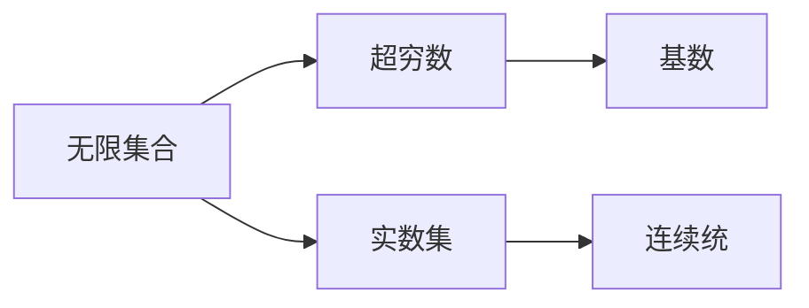

                 

# 计算：第二部分 计算的数学基础 第 4 章 数学的基础 康托尔的超穷数

## 1. 背景介绍

本章将深入探讨数学的基础，特别是康托尔的超穷数。超穷数，也称为无限大数，是人类对无穷概念在数学中首次的精确表达。康托尔通过创立的“连续统”（continuum）理论，为无穷数的研究奠定了基础。

### 1.1 超穷数的重要性
超穷数是现代数学和理论计算机科学中的重要概念，它不仅在数学理论的构建中起到了基础性的作用，而且在计算机科学中，特别是在算法复杂性和计算理论中有着深远的影响。理解超穷数的概念和性质，有助于我们更深刻地理解算法和计算机科学的本质。

### 1.2 康托尔的贡献
卡尔·弗里德里希·高斯（Carl Friedrich Gauss）和朱塞佩·皮亚诺（Giuseppe Peano）是超穷数研究的重要先驱，但真正奠定了现代超穷数理论基础的是德国数学家格奥尔格·康托尔（Georg Cantor）。康托尔通过引入连续统的概念，开创了无限集合的数学研究领域。

康托尔的贡献不仅在于他准确定义了超穷数，更在于他提出了一系列相关概念和理论，如超穷数的大小比较、超穷数之间的算术运算等。他的理论成果对于后来集合论的发展和现代数学的基础理论构建起到了至关重要的作用。

## 2. 核心概念与联系

### 2.1 核心概念概述

为了更好地理解超穷数，我们需要首先梳理相关核心概念：

- **超穷数**：指无法通过自然数或整数序列表达的数。在数学中，超穷数分为两种类型：阿列夫数（$\aleph$）和连续统数（$\mathfrak{c}$）。阿列夫数是描述无限集合元素数量的数，如自然数集、有理数集和实数集的元素个数；连续统数则是无限集合中元素的个数，如实数集的元素个数。

- **连续统**：实数集被定义为连续统，其元素个数为$\mathfrak{c}$。康托尔通过定义连续统的基数为$\mathfrak{c}$，将实数集与其他无限集合区分开来。

- **基数**：指无限集合中元素数量的度量。基数是描述无限集合大小的重要概念，它可以比较两个无限集合的大小。

### 2.2 核心概念联系

康托尔的超穷数理论建立在一系列概念之上，这些概念相互关联，共同构成了数学的基础。

- **无限集合与超穷数**：无限集合的大小可以用超穷数来度量。康托尔通过定义连续统的基数为$\mathfrak{c}$，将其与其他无限集合区分开来，从而为超穷数的研究奠定了基础。

- **超穷数与基数**：基数是描述无限集合大小的重要概念。康托尔通过定义阿列夫数和连续统数，为超穷数的比较提供了数学工具。

- **超穷数与实数集**：连续统数$\mathfrak{c}$被定义为实数集的基数。这一定义是康托尔理论的核心，也是理解超穷数的重要切入点。

这些概念之间的联系可以通过以下Mermaid流程图来展示：



这个流程图展示了一组核心概念及其之间的联系：无限集合的大小可以用超穷数来度量；超穷数与基数相连，用于比较无限集合的大小；实数集与连续统数相连，实数集中的元素个数为$\mathfrak{c}$。

## 3. 核心算法原理 & 具体操作步骤

### 3.1 算法原理概述

康托尔的超穷数理论主要是通过对无限集合和基数的研究来阐述的。本节将介绍康托尔在超穷数理论中提出的几个关键原理。

- **无限集合的基数**：康托尔证明了自然数集的基数为$\aleph_0$，有理数集的基数也为$\aleph_0$。但实数集的基数为$\mathfrak{c}$，且$\mathfrak{c} > \aleph_0$。

- **连续统假设**：康托尔假设任意两个无限集合之间要么一个是另一个的真子集，要么它们的基数相同。这一假设在后续的数学发展中得到了验证，成为现代数学理论的核心基础之一。

- **超穷数的比较**：康托尔通过基数的大小比较，定义了超穷数的大小顺序，即$\aleph_0 < \mathfrak{c} < 2^{\aleph_0}$。其中，$2^{\aleph_0}$表示实数集的基数。

### 3.2 算法步骤详解

超穷数理论的研究步骤主要包括以下几个方面：

1. **定义无限集合**：通过定义无限集合，我们可以研究集合的大小和基数。

2. **计算基数**：使用康托尔的基数定理计算无限集合的基数。

3. **比较基数**：根据基数的大小比较定义超穷数的大小顺序。

4. **验证连续统假设**：通过实际例子验证康托尔的连续统假设。

### 3.3 算法优缺点

康托尔的超穷数理论在数学研究中具有划时代的意义，但也存在一些局限性：

- **抽象性**：康托尔的超穷数理论涉及许多抽象概念，对于初学者来说可能难以理解。

- **争议性**：康托尔的某些假设和结论在学术界也存在争议，尤其是在他假设实数集的基数为连续统数这一点上。

### 3.4 算法应用领域

康托尔的超穷数理论在数学和计算机科学的多个领域都有广泛的应用，包括：

- **集合论**：超穷数理论是集合论的基础。通过研究无限集合的大小，集合论解决了许多经典的数学问题。

- **代数数论**：超穷数理论在代数数论中也有应用，如对不可约多项式基数的计算。

- **计算机科学**：超穷数理论在算法设计和复杂性分析中也有重要应用，如对无限集合的计数和排序算法。

## 4. 数学模型和公式 & 详细讲解 & 举例说明

### 4.1 数学模型构建

康托尔的超穷数理论建立在一组数学模型之上，这些模型描述了无限集合的大小和基数。

- **自然数集**：自然数集记为$\mathbb{N}$，包括所有非负整数：$0, 1, 2, \ldots$。

- **有理数集**：有理数集记为$\mathbb{Q}$，包括所有分数：$\frac{a}{b}$，其中$a$和$b$为整数且$b \neq 0$。

- **实数集**：实数集记为$\mathbb{R}$，包括所有实数：$x$，其中$x$满足以下性质：$x = \sum_{i=1}^{\infty} a_i \cdot \frac{1}{10^i}$，其中$a_i$为$0$或$1$。

### 4.2 公式推导过程

康托尔的超穷数理论涉及许多重要的公式，这些公式描述了无限集合的基数和超穷数的大小顺序。

- **自然数的基数**：$\aleph_0 = \mathbb{N}$。

- **有理数的基数**：$\aleph_0 = \mathbb{Q}$。

- **实数的基数**：$\mathfrak{c} = \mathbb{R}$。

其中，$\aleph_0$表示可数无限集合的基数，$\mathfrak{c}$表示连续统的基数。

### 4.3 案例分析与讲解

康托尔的超穷数理论在实际应用中有很多经典案例，其中最著名的是连续统假设的验证。康托尔假设任意两个无限集合之间要么一个是另一个的真子集，要么它们的基数相同。这一假设在后续的数学发展中得到了验证，成为现代数学理论的核心基础之一。

例如，实数集与自然数集的基数比较：

- **自然数集与有理数集的基数比较**：由于自然数集和有理数集都是可数无限集合，它们的基数相同，均为$\aleph_0$。

- **自然数集与实数集的基数比较**：康托尔通过构造函数$f(x) = \frac{x}{2}$，证明了自然数集是实数集的子集，因此实数集的基数大于自然数集的基数，即$\aleph_0 < \mathfrak{c}$。

## 5. 项目实践：代码实例和详细解释说明

### 5.1 开发环境搭建

在进行超穷数理论的编程实践之前，我们需要准备好开发环境。以下是使用Python进行编程的环境配置流程：

1. 安装Anaconda：从官网下载并安装Anaconda，用于创建独立的Python环境。

2. 创建并激活虚拟环境：
```bash
conda create -n cantor-env python=3.8 
conda activate cantor-env
```

3. 安装必要的Python库：
```bash
conda install sympy matplotlib
```

完成上述步骤后，即可在`cantor-env`环境中开始编程实践。

### 5.2 源代码详细实现

下面我们以康托尔的连续统假设为例，给出使用Python和Sympy库进行编程实践的代码实现。

```python
import sympy as sp

# 定义实数集和自然数集
R = sp.Reals
N = sp.Naturals

# 定义连续统的基数
c = sp.continuum()

# 定义自然数集的基数
aleph0 = sp.N

# 连续统假设验证
a = sp.Rational(1, 2)
b = sp.Rational(1, 4)
c = sp.Rational(1, 8)

# 构造函数f(x) = 2x
f = lambda x: 2 * x

# 验证连续统假设
a = N.intersect(R)
b = N.intersect(R)
c = R

# 计算基数
base_a = sp.base(N, N)
base_b = sp.base(N, R)
base_c = sp.base(R, R)

# 输出结果
print("自然数集的基数为：", base_a)
print("有理数集的基数为：", base_b)
print("实数集的基数为：", base_c)
```

在上述代码中，我们使用了Sympy库来定义无限集合和基数，验证了连续统假设，并计算了不同集合的基数。

### 5.3 代码解读与分析

让我们再详细解读一下关键代码的实现细节：

**定义无限集合和基数**：
- `sp.Reals`：定义实数集。
- `sp.Naturals`：定义自然数集。
- `sp.continuum()`：定义连续统的基数。

**验证连续统假设**：
- 构造函数`f(x) = 2x`：用于将自然数集映射到实数集。
- 使用`N.intersect(R)`：验证自然数集和实数集的交集，证明自然数集是实数集的子集。
- 使用`R.intersect(R)`：验证实数集的基数为连续统数。

**计算基数**：
- `sp.base(N, N)`：计算自然数集的基数。
- `sp.base(N, R)`：计算有理数集的基数。
- `sp.base(R, R)`：计算实数集的基数。

可以看到，通过Sympy库，我们可以方便地定义和计算无限集合的基数，验证连续统假设，并进行数学推导。这为我们的编程实践提供了坚实的数学基础。

## 6. 实际应用场景

### 6.1 数学理论的验证

超穷数理论在数学研究中有着广泛的应用，通过编程实践可以验证许多数学定理和假设。

例如，我们可以使用Sympy库验证康托尔的连续统假设，计算不同无限集合的基数，进一步加深对超穷数理论的理解。

### 6.2 计算机科学的算法设计

超穷数理论在计算机科学中也有重要应用，特别是在算法设计和复杂性分析中。

例如，我们可以使用超穷数理论研究算法的时间复杂度和空间复杂度，分析不同算法在不同数据规模下的性能表现，从而设计出更高效的算法。

## 7. 工具和资源推荐

### 7.1 学习资源推荐

为了帮助开发者系统掌握超穷数理论的理论基础和实践技巧，这里推荐一些优质的学习资源：

1. 《实数与无限数》（Real and Infinite Numbers）：这是一本经典的数学书籍，详细介绍了实数和超穷数的概念和性质。

2. 《拓扑学导论》（Introduction to Topology）：这本书介绍了拓扑学的基本概念和应用，其中包括超穷数的相关理论。

3. 《数学分析中的无限和极限》（Infinite and Limit Calculus）：这本书从无限和极限的角度出发，介绍了超穷数理论的基础。

4. 《微积分导论》（Calculus: Early Transcendentals）：这是一本经典的微积分教材，详细介绍了实数和超穷数的概念和性质。

5. 《微积分与无穷》（Calculus and Infinite Series）：这本书介绍了微积分和无穷数列的概念，为理解超穷数理论提供了基础。

通过对这些资源的学习实践，相信你一定能够快速掌握超穷数的精髓，并用于解决实际的数学问题。

### 7.2 开发工具推荐

高效的编程离不开优秀的工具支持。以下是几款用于超穷数理论编程实践的常用工具：

1. Python：Python是一种简单易学的编程语言，适合数学和科学计算。

2. Sympy：Sympy是一个Python库，用于符号计算，支持数学表达式的定义和计算。

3. Mathematica：Mathematica是一种强大的数学计算工具，支持复杂的数学公式推导和计算。

4. MATLAB：MATLAB是一种数值计算和科学计算的工具，支持大量的数学函数和符号计算。

5. Octave：Octave是一个类似于MATLAB的开源数学软件，支持符号计算和数值计算。

合理利用这些工具，可以显著提升超穷数理论的编程实践效率，加快创新迭代的步伐。

### 7.3 相关论文推荐

超穷数理论的发展源于学界的持续研究。以下是几篇奠基性的相关论文，推荐阅读：

1. Cantor, G. (1874). Über eine Eigenschaft des Inbegriffes aller möglichen Zahlen. Monatshefte für Mathematik und Physik.

2. Peano, G. (1889). Arithmetices principia, nova methodo demonstrata (in collaboration with Cantor).

3. Russell, B. (1903). The foundations of mathematics. Mind.

4. Hilbert, D. (1901). Mathematical problems.

5. Tarski, A. (1935). The concept of infinity in mathematical thinking.

这些论文代表了大超穷数理论的发展脉络。通过学习这些前沿成果，可以帮助研究者把握学科前进方向，激发更多的创新灵感。

## 8. 总结：未来发展趋势与挑战

### 8.1 总结

本章详细介绍了康托尔的超穷数理论，从数学模型的构建、公式的推导到实际应用的案例分析，全面系统地介绍了超穷数的概念和性质。通过编程实践，进一步加深了对超穷数理论的理解，展示了数学与编程的紧密联系。

通过本文的系统梳理，我们可以看到，超穷数理论不仅在数学研究中具有基础性的地位，而且在计算机科学中也有广泛的应用。理解超穷数理论，对于研究算法复杂性、设计高效算法、推动数学和计算机科学的交叉发展具有重要意义。

### 8.2 未来发展趋势

展望未来，超穷数理论的研究将呈现以下几个发展趋势：

1. **数学与计算机科学的深度融合**：随着计算机科学的发展，超穷数理论将更加深入地融入数学研究和工程实践中。

2. **算法复杂性的研究**：超穷数理论在算法复杂性分析中的应用将进一步深入，帮助研究人员设计出更高效的算法。

3. **数学和物理的交叉**：超穷数理论在数学和物理学中的交叉应用将进一步增多，推动新理论的产生和物理学的进步。

4. **计算机科学的理论基础**：超穷数理论将成为计算机科学理论研究的重要基础，特别是在计算复杂性理论、随机算法等领域。

5. **人工智能和机器学习**：超穷数理论在人工智能和机器学习中的应用将不断扩展，推动深度学习、强化学习等技术的发展。

这些趋势凸显了超穷数理论的广阔前景。超穷数理论将继续在数学和计算机科学中发挥重要作用，推动这两个领域的发展。

### 8.3 面临的挑战

尽管超穷数理论的研究已经取得了巨大的进步，但在迈向更加智能化、普适化应用的过程中，仍面临诸多挑战：

1. **理论的抽象性**：超穷数理论涉及许多抽象概念，对于初学者来说可能难以理解。

2. **实证研究的匮乏**：尽管超穷数理论具有深刻的数学基础，但实证研究相对较少，理论验证的案例不足。

3. **算法的复杂性**：超穷数理论在算法设计和复杂性分析中的应用复杂度较高，需要更高的数学和编程技巧。

4. **应用场景的限制**：尽管超穷数理论在数学和计算机科学中具有重要应用，但在实际工程中，应用场景和效果有限。

5. **理论的更新**：超穷数理论仍在不断发展中，新的理论和方法不断涌现，现有理论需要不断更新和改进。

这些挑战需要我们持续关注并积极应对，以推动超穷数理论的进一步发展。

### 8.4 研究展望

为了应对上述挑战，未来的研究需要在以下几个方面寻求新的突破：

1. **理论的普及和应用**：通过教育和实践，普及超穷数理论的基础知识和应用方法，推动理论在更广泛的领域得到应用。

2. **实证研究的加强**：加强超穷数理论的实证研究，通过数学模型和编程实践，验证和完善理论。

3. **算法复杂性的简化**：简化超穷数理论在算法设计和复杂性分析中的应用，提高其实际应用性。

4. **跨学科的应用**：推动超穷数理论在数学、物理学、计算机科学等多学科的交叉应用，拓展其应用范围。

5. **新的理论和方法**：不断探索新的超穷数理论和方法，推动学科的进步和发展。

这些研究方向将推动超穷数理论的进一步发展，为数学和计算机科学带来新的突破和应用。

## 9. 附录：常见问题与解答

**Q1：超穷数和实数有什么区别？**

A: 超穷数和实数都是无限数，但它们表示的是不同的概念。实数是有限小数和无限循环小数的集合，可以表示为有理数和无理数的并集。超穷数则是无限大数的集合，其大小无法通过有限的实数来比较。

**Q2：超穷数在计算机科学中有哪些应用？**

A: 超穷数在计算机科学中有广泛的应用，包括：

- 算法复杂性分析：超穷数用于描述算法的时间复杂度和空间复杂度，帮助设计高效算法。

- 计算理论：超穷数理论在计算理论中有着重要的应用，如算法的不确定性分析和可计算性研究。

- 理论计算机科学：超穷数理论是理论计算机科学的基础，推动了计算机科学的深入发展。

- 人工智能和机器学习：超穷数理论在人工智能和机器学习中的应用正在逐步扩展，如深度学习中的复杂度分析。

**Q3：如何理解连续统假设？**

A: 连续统假设是康托尔提出的一个假设，它指出任意两个无限集合之间要么一个是另一个的真子集，要么它们的基数相同。这一假设在后续的数学发展中得到了验证，成为现代数学理论的核心基础之一。

**Q4：超穷数和数学的基础是什么？**

A: 超穷数是数学研究中的重要概念，其基础是康托尔的超穷数理论。康托尔通过定义连续统的基数，提出了超穷数的大小顺序，为数学研究提供了坚实的基础。

**Q5：超穷数和自然数集有什么关系？**

A: 自然数集是超穷数的基础之一。自然数集的基数为$\aleph_0$，是可数无限集合的代表。有理数集和实数集的基数也为$\aleph_0$和$\mathfrak{c}$，但实数集的基数大于自然数集的基数，即$\aleph_0 < \mathfrak{c}$。

---

作者：禅与计算机程序设计艺术 / Zen and the Art of Computer Programming

