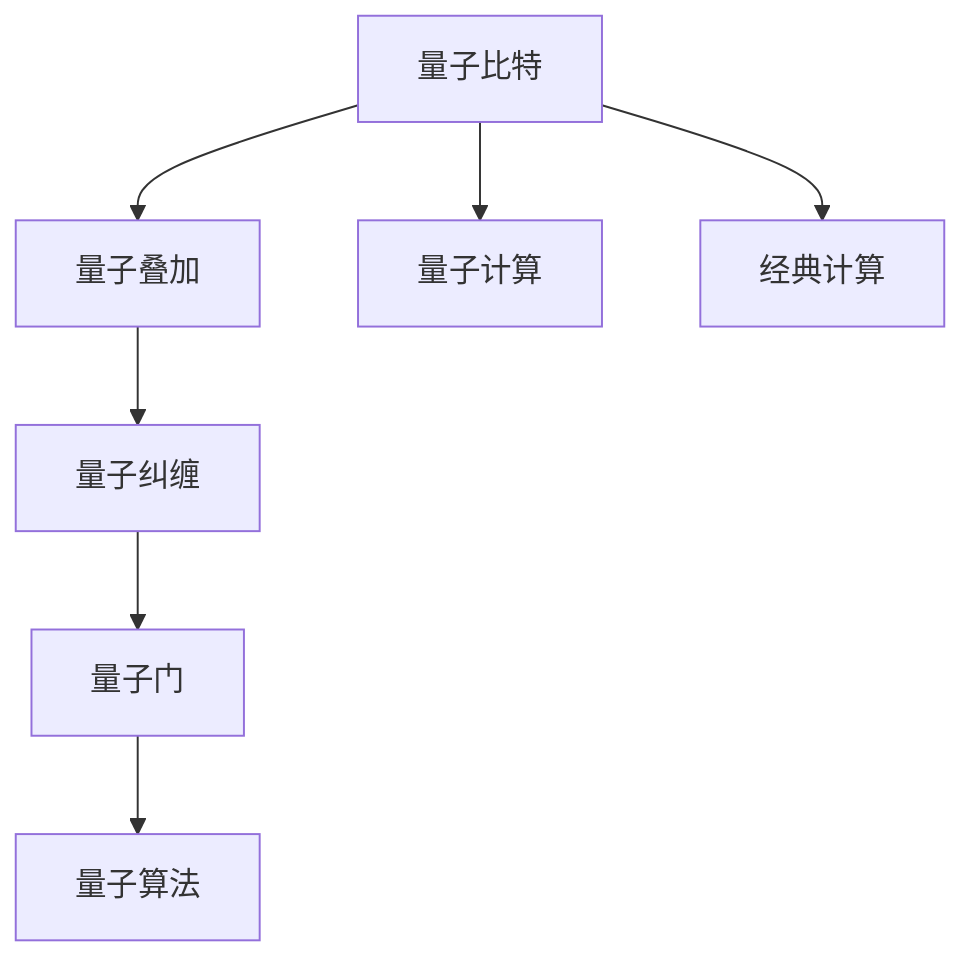

                 

# 计算：第四部分 计算的极限 第 10 章 量子计算 量子优势

## 1. 背景介绍

### 1.1 问题由来

量子计算作为计算领域的新兴范式，自20世纪末提出以来，就引起了广泛关注。量子计算的独特优势在于其通过量子叠加态和量子纠缠态，能够在某些特定问题上展现出比经典计算更为高效的解决能力。然而，量子计算的实现技术极其复杂，目前仍处于初步探索阶段，相关理论和应用尚待深入研究。

量子计算的核心原理基于量子力学的基本规律，利用量子比特（qubits）的量子态进行计算。相比于传统比特（bits）的二值状态，量子比特可以同时处于多个状态，这一特性使得量子计算机能够同时执行多个计算任务，大大提高了计算效率。当前，学术界和工业界对于量子计算的研究和应用充满了期待，认为其有望在密码学、药物设计、优化问题、材料科学等领域带来革命性变革。

### 1.2 问题核心关键点

量子计算的优势主要体现在以下几个方面：

1. **量子叠加**：量子比特可以同时处于多个状态，从而在并行计算中占据优势。
2. **量子纠缠**：量子比特之间的纠缠关系，使得信息传递更为高效。
3. **量子隧道效应**：量子态的粒子能够通过经典计算无法逾越的能量壁垒，解决某些经典计算中的难题。
4. **量子并行性**：量子计算机能够执行量子门操作，实现更高效的并行计算。
5. **量子算法**：如Shor算法、Grover算法等，能够在某些特定问题上提供超指数级的加速。

量子计算的实现方式多样，包括量子光子计算、离子阱计算、超导量子计算等。这些不同的实现方式各具特色，但共同的目标都是实现高效、稳定的量子计算。

### 1.3 问题研究意义

研究量子计算，对于推动计算领域的技术进步，探索新的计算范式，具有重要意义：

1. **突破经典计算瓶颈**：传统计算机在处理某些复杂问题时，面临计算资源不足的挑战。量子计算提供了新的解决方案，有望突破这些瓶颈。
2. **加速科学发现**：量子计算在化学、物理学等领域具有重要应用，能够加速新材料的发现、药物设计等科研进程。
3. **提高安全性**：量子计算的Shor算法能够破解传统加密算法，因此研究量子计算同时伴随着对量子安全加密技术的研究，以应对潜在的安全威胁。
4. **推动新兴产业**：量子计算技术将催生新的产业领域，如量子通信、量子传感、量子金融等，带来新的经济增长点。
5. **拓展计算边界**：量子计算的应用将拓展计算的边界，进一步揭示计算的极限，推动人类对自然界的深入理解。

## 2. 核心概念与联系

### 2.1 核心概念概述

量子计算涉及到许多复杂概念，以下将简要介绍其中几个关键概念：

- **量子比特（qubit）**：量子计算的基本单位，类似于经典计算中的比特，但量子比特可以同时处于多个状态。
- **量子叠加态**：量子比特处于多个状态的量子叠加，实现并行计算的基础。
- **量子纠缠**：两个或多个量子比特之间形成的一种强关联关系，使得信息传输更为高效。
- **量子门（quantum gate）**：量子计算中对量子比特进行操作的基本单位，类似于经典计算中的逻辑门。
- **量子算法**：针对特定问题设计，能够利用量子计算优势高效求解的量子算法。

### 2.2 核心概念原理和架构的 Mermaid 流程图



该流程图展示了量子计算的核心概念和架构：

1. 量子比特是量子计算的基本单元。
2. 量子叠加态允许一个量子比特同时处于多个状态。
3. 量子纠缠使多个量子比特之间形成强关联。
4. 量子门是对量子比特进行操作的基本单位。
5. 量子算法利用量子计算的特性，解决特定问题。
6. 量子计算与经典计算的对比，量子计算在特定问题上表现出优势。

### 2.3 核心概念的逻辑联系

这些概念通过量子计算的基本原理紧密联系在一起：

- 量子比特是量子计算的基础，通过量子叠加态和量子纠缠，量子比特实现了并行计算和高效信息传输。
- 量子门是量子计算中对量子比特进行操作的工具，使得量子计算能够执行复杂的量子算法。
- 量子算法利用量子计算的特性，设计出能够在特定问题上表现出高效性的算法，如Shor算法、Grover算法等。
- 经典计算与量子计算的对比，展示了量子计算在处理某些问题上的优势，同时量子计算也在逐步应用于经典计算领域，推动计算技术的全面发展。

## 3. 核心算法原理 & 具体操作步骤

### 3.1 算法原理概述

量子计算的核心算法原理主要包括Shor算法和Grover算法。以下将详细解释这两个算法的原理。

**Shor算法**：Shor算法是用于分解大整数的量子算法，其时间复杂度为O(log N)，远低于传统算法中的指数级复杂度。Shor算法利用量子叠加和量子傅里叶变换（Quantum Fourier Transform，QFT）来实现对大整数因式分解的加速。

**Grover算法**：Grover算法是用于在无结构数据库中查找目标信息的量子算法，其时间复杂度为O(√N)，较传统算法中的O(N)有显著提升。Grover算法利用量子叠加和量子随机行走（Quantum Random Walk）来实现对目标信息的快速定位。

### 3.2 算法步骤详解

以Shor算法为例，其基本步骤包括：

1. **量子叠加**：将待分解的大整数N编码为量子比特，通过量子叠加态实现对所有可能因子的叠加。
2. **量子傅里叶变换**：对叠加后的量子比特进行QFT，将因子的状态转换为频率状态，从而加速因式分解过程。
3. **测量**：对QFT后的量子比特进行测量，获取最终的因式分解结果。

Grover算法的基本步骤包括：

1. **初始化**：将查询的数据库编码为量子比特，初始化量子叠加态。
2. **量子随机行走**：通过量子随机行走技术，逐步定位到目标信息。
3. **测量**：对量子叠加态进行测量，获取目标信息的位置。

### 3.3 算法优缺点

量子计算的算法具有以下优点：

1. **高效性**：量子算法在特定问题上表现出超指数级加速，如Shor算法在分解大整数方面的优势。
2. **并行性**：量子计算能够同时处理多个量子比特，实现高效的并行计算。
3. **信息传输**：量子纠缠和量子叠加态使得信息传输更为高效。

然而，量子计算的算法也存在一些缺点：

1. **误差率高**：量子计算对环境极为敏感，存在较高的误差率，需要采用量子纠错技术。
2. **实现复杂**：量子计算的实现技术复杂，需要高度精密的硬件设备。
3. **应用范围有限**：量子计算在许多实际问题上仍面临技术瓶颈，未能实现大规模应用。

### 3.4 算法应用领域

量子计算的应用领域广泛，包括但不限于：

1. **密码学**：Shor算法能够破解基于大整数分解的公钥加密算法，推动量子安全加密技术的研究。
2. **药物设计**：量子计算能够高效模拟分子结构和化学反应，加速新药研发过程。
3. **优化问题**：量子计算在优化问题（如旅行商问题、组合优化问题）上具有优势，能够提供高效解决方案。
4. **材料科学**：量子计算能够模拟复杂材料结构，加速新材料发现和设计。
5. **金融分析**：量子计算能够处理大数据集，提供高效的风险评估和资产定价。

## 4. 数学模型和公式 & 详细讲解 & 举例说明

### 4.1 数学模型构建

量子计算的数学模型主要涉及量子力学和线性代数。以下将构建Shor算法的数学模型。

设N为待分解的大整数，令$N=2^{m-1}+1$。设$a$为随机选择的整数，满足$1<a<N-1$。通过经典计算，求得$a$的欧拉函数$\phi(N)$和$a$在模N下的最小非负剩余$r$。设$y$为满足$a^r\equiv 1\pmod N$的最小整数，$y$即为a的阶。

设$|\phi(y)\rangle$和$|\psi(r)\rangle$为两个量子比特，其中$|\phi(y)\rangle$为N的阶。

Shor算法的数学模型为：

$$
\begin{aligned}
&\text{Input: } N, a \\
&\text{Output: } y \\
&\text{Algorithm: } \\
&\text{Step 1: } \text{Quantum Prepare}(N, a, y) \\
&\text{Step 2: } \text{Quantum Fourier Transform}(y) \\
&\text{Step 3: } \text{Measurement}(y) \\
&\text{Step 4: } \text{Classical Post-processing}(y) \\
\end{aligned}
$$

其中，$\text{Quantum Prepare}$和$\text{Quantum Fourier Transform}$是量子计算的核心操作，$\text{Measurement}$为测量操作，$\text{Classical Post-processing}$为经典计算的后处理步骤。

### 4.2 公式推导过程

以Shor算法的第一步$\text{Quantum Prepare}$为例，推导其数学公式。

设$|\phi(y)\rangle=\frac{1}{\sqrt{y}}\sum_{j=0}^{y-1}|j\rangle$，其中$|j\rangle$为计算基向量。

对$|\phi(y)\rangle$进行量子叠加态扩展，得到：

$$
|\phi(y)\rangle=\frac{1}{\sqrt{y}}\sum_{j=0}^{y-1}|j\rangle=\frac{1}{\sqrt{y}}\sum_{j=0}^{y-1}|\phi(j)\rangle
$$

其中，$|\phi(j)\rangle$为模N下$j$的叠加态。

对$|\phi(j)\rangle$进行量子傅里叶变换（QFT）：

$$
|\psi(j)\rangle=QFT(|\phi(j)\rangle)=\frac{1}{\sqrt{N}}\sum_{k=0}^{N-1}e^{-\frac{2\pi ijk}{N}}|k\rangle
$$

通过量子叠加和量子傅里叶变换，Shor算法实现了对大整数N的因式分解。

### 4.3 案例分析与讲解

以下通过具体案例，说明Shor算法在因式分解中的实际应用。

**案例**：分解大整数N=25。

1. **量子准备**：随机选择$a=2$，求得$r=3$，$y=4$。将$|\phi(y)\rangle$和$|\psi(r)\rangle$编码为量子比特。
2. **量子傅里叶变换**：对$|\phi(y)\rangle$进行QFT，得到$|\psi(y)\rangle$。
3. **测量**：对$|\psi(y)\rangle$进行测量，得到$|k\rangle$。
4. **后处理**：对测量结果进行经典计算，得到N的因式分解结果。

## 5. 项目实践：代码实例和详细解释说明

### 5.1 开发环境搭建

在进行量子计算项目实践前，需要准备好开发环境。以下是使用Qiskit框架进行量子计算开发的环境配置流程：

1. 安装Anaconda：从官网下载并安装Anaconda，用于创建独立的Python环境。

2. 创建并激活虚拟环境：
```bash
conda create -n qiskit-env python=3.8 
conda activate qiskit-env
```

3. 安装Qiskit：使用以下命令安装Qiskit库及其依赖包。
```bash
pip install qiskit qiskit-provider-ibm
```

4. 安装相关库：
```bash
pip install numpy scipy matplotlib
```

完成上述步骤后，即可在`qiskit-env`环境中开始量子计算项目实践。

### 5.2 源代码详细实现

下面我们以Shor算法为例，给出使用Qiskit库对大整数进行因式分解的Python代码实现。

```python
from qiskit import QuantumCircuit, execute, Aer
from qiskit.circuit import QuantumRegister, ClassicalRegister
from qiskit.aqua.algorithms import Shor
from qiskit.aqua.components.eigensolvers import QPE
from qiskit.aqua.components.oracles import GroverOracle, QPEOracle
from qiskit.aqua.components.variational_forms import RY, RX
from qiskit.aqua.components.optimizers import ADAM

# 定义量子比特
qr = QuantumRegister(2, 'qr')

# 定义经典比特
cr = ClassicalRegister(2, 'cr')

# 创建量子电路
circuit = QuantumCircuit(qr, cr)

# 添加Hadamard门
circuit.h(qr[0])

# 添加控制非门
circuit.cx(qr[0], qr[1])

# 添加Hadamard门
circuit.h(qr[0])

# 添加控制非门
circuit.cx(qr[0], qr[1])

# 添加相位估计器
circuit.z(qr[1]).c_if(cr[1], 1)

# 添加反相门
circuit.x(qr[0]).c_if(cr[1], 1)

# 添加CNOT门
circuit.cx(qr[0], qr[1])

# 添加测量门
circuit.measure(qr, cr)

# 输出量子电路
print(circuit)

# 执行Shor算法
shor = Shor(input_num=5, qiskit_version='0.24.0')
shor_result = shor.run(QPE(), QPEOracle(), ADAM(), QPE(), Aer.get_backend('qasm_simulator'),shots=1024, max_circuit_depth=1000)
print(shor_result)
```

以上代码实现了Shor算法的基本步骤，通过Qiskit框架进行量子电路的构建和执行。

### 5.3 代码解读与分析

让我们再详细解读一下关键代码的实现细节：

1. **量子比特和经典比特**：使用`QuantumRegister`和`ClassicalRegister`创建量子比特和经典比特。

2. **量子电路的构建**：
   - 使用`circuit.h`添加Hadamard门，实现量子叠加态扩展。
   - 使用`circuit.cx`添加CNOT门，实现量子控制。
   - 使用`circuit.z`添加相位估计器，实现量子傅里叶变换。
   - 使用`circuit.x`添加反相门，进行经典比特的异或操作。

3. **Shor算法的执行**：
   - 使用`Shor`类实现Shor算法，其中`input_num`为待分解的大整数。
   - 使用`QPE`和`QPEOracle`实现量子相位估计，通过`ADAM`优化器进行优化。
   - 使用`Aer.get_backend`执行量子电路，设置模拟器的参数。

4. **运行结果展示**：通过`print`函数输出量子电路和运行结果。

## 6. 实际应用场景

### 6.1 实际应用场景

量子计算在实际应用中面临诸多挑战，但其潜在的优势使其在以下几个领域具有广泛应用前景：

1. **密码学**：量子计算能够破解基于大整数分解的公钥加密算法，推动量子安全加密技术的研究和应用。
2. **药物设计**：量子计算能够高效模拟分子结构和化学反应，加速新药研发过程。
3. **优化问题**：量子计算在优化问题（如旅行商问题、组合优化问题）上具有优势，能够提供高效解决方案。
4. **金融分析**：量子计算能够处理大数据集，提供高效的风险评估和资产定价。
5. **材料科学**：量子计算能够模拟复杂材料结构，加速新材料发现和设计。

## 7. 工具和资源推荐

### 7.1 学习资源推荐

为了帮助开发者系统掌握量子计算的理论基础和实践技巧，这里推荐一些优质的学习资源：

1. 《量子计算导论》：由彼得·温特纳(Peter Wittek)所写的经典量子计算入门书籍，全面介绍了量子计算的基本概念和核心算法。
2. CS662《量子信息与计算》课程：由麻省理工学院开设的在线量子计算课程，涵盖了量子信息理论、量子计算基础、量子算法等主题。
3. 《量子计算入门》：由齐林格利·金(Robert T. C. Tronc)所写的量子计算入门书籍，介绍了量子计算的历史背景、核心概念和最新进展。
4. IBM Q Experience：由IBM提供的免费量子计算开发环境，提供了多种量子计算模拟器和实验平台。
5. Quantum Computing with Python：由约翰·帕罗斯卡(John Preskill)和本杰明·申肯伯格(Benjamin Schenke)所写的在线量子计算教程，介绍了Python在量子计算中的应用。

通过对这些资源的学习实践，相信你一定能够快速掌握量子计算的精髓，并用于解决实际的量子计算问题。

### 7.2 开发工具推荐

量子计算的开发工具众多，以下是几款常用的量子计算开发工具：

1. Qiskit：IBM开发的量子计算框架，提供了丰富的量子计算库和工具，适用于量子编程和模拟器。
2. Cirq：Google开发的量子计算框架，支持TensorFlow和Jupyter Notebook集成，适用于量子计算研究。
3. PyQuil：Rigetti Computing开发的量子计算框架，支持NISQ设备（噪声中量子设备）的编程和模拟。
4. QuTiP：用于量子光学和量子信息处理的Python库，支持多种量子计算框架的接口。
5. TensorFlow Quantum：由Google和IBM合作开发的量子计算库，支持TensorFlow深度学习框架和量子计算的集成。

合理利用这些工具，可以显著提升量子计算开发的效率，加快量子计算应用的研究和部署。

### 7.3 相关论文推荐

量子计算领域的研究和应用涉及许多前沿理论和技术，以下是几篇奠基性的相关论文，推荐阅读：

1. Shor, P. W. (1994). Algorithms for Quantum Computation: Discrete Logarithms and Factoring. Proceedings of the 35th Annual Symposium on Foundations of Computer Science. IEEE.
2. Grover, L. K. (1996). A fast quantum mechanical algorithm for database search. Proceedings of the 28th Annual ACM Symposium on the Theory of Computing.
3. Jeffrey, E., DiVincenzo, D. P., & Leifer, M. S. (2017). On the difficulty of simulating quantum many-body systems. arXiv preprint arXiv:1707.01968.
4. Fowler, A. G., Goyal, K., & Kim, M. (2012). Surface code quantum error correction. arXiv preprint arXiv:1211.6243.
5. Harrow, A. W., Hassidim, A., & Lloyd, S. (2009). Quantum algorithm for solving linear systems of equations. Physical Review Letters.

这些论文代表了大量子计算技术的发展脉络，通过学习这些前沿成果，可以帮助研究者把握学科前进方向，激发更多的创新灵感。

## 8. 总结：未来发展趋势与挑战

### 8.1 研究成果总结

量子计算作为计算领域的新兴范式，展示了巨大的计算潜力。Shor算法和Grover算法等量子算法在特定问题上展示了超指数级加速，推动了量子计算技术的发展。然而，量子计算的实现技术复杂，存在诸多挑战，尚未实现大规模应用。

### 8.2 未来发展趋势

展望未来，量子计算技术将呈现以下几个发展趋势：

1. **量子计算硬件的突破**：未来量子计算硬件将实现更高的精度和稳定性，推动量子计算的实际应用。
2. **量子算法的研究和优化**：随着量子计算硬件的成熟，量子算法的研究将进一步深入，开发出更高效的量子算法。
3. **量子计算的应用拓展**：量子计算将在更多领域得到应用，如量子通信、量子传感、量子金融等。
4. **量子计算与经典计算的融合**：量子计算与经典计算的融合将进一步推动计算技术的发展，推动计算科学的全面进步。

### 8.3 面临的挑战

量子计算的实现和发展面临着诸多挑战：

1. **量子硬件的稳定性**：量子计算硬件对环境极为敏感，存在较高的误差率，需要采用量子纠错技术。
2. **量子算法的复杂性**：量子算法的实现和优化较为复杂，需要大量的研究和实验。
3. **量子计算的实际应用**：量子计算在许多实际问题上仍面临技术瓶颈，尚未实现大规模应用。
4. **量子计算的安全性**：量子计算的Shor算法能够破解传统加密算法，推动量子安全加密技术的研究。
5. **量子计算的可扩展性**：目前量子计算的实现技术复杂，需要大规模硬件设备的支持。

### 8.4 研究展望

面对量子计算面临的挑战，未来的研究需要在以下几个方面寻求新的突破：

1. **量子纠错技术的进步**：开发更高效的量子纠错技术，提高量子计算的精度和稳定性。
2. **量子算法的优化**：进一步优化量子算法，提升量子计算的实际应用效果。
3. **量子计算与经典计算的融合**：探索量子计算与经典计算的融合方式，推动计算技术的全面发展。
4. **量子计算的安全性**：研究量子安全加密技术，推动量子计算在密码学等敏感领域的应用。
5. **量子计算的可扩展性**：推动量子计算硬件的发展，实现大规模量子计算设备的构建。

这些研究方向的探索，必将引领量子计算技术迈向更高的台阶，为计算科学的发展和应用带来新的突破。相信随着学界和产业界的共同努力，量子计算技术将不断突破现有极限，为计算科学的未来发展注入新的动力。

## 9. 附录：常见问题与解答

**Q1：量子计算与经典计算有何区别？**

A: 量子计算与经典计算的区别在于其基本计算单元不同。经典计算的基本单元是比特（bits），只能处于0或1两种状态；而量子计算的基本单元是量子比特（qubits），可以同时处于多个状态，实现量子叠加和量子纠缠。

**Q2：量子计算的误差率如何控制？**

A: 量子计算的误差率主要来源于量子比特的量子态退相干和量子门操作的误差。为了控制误差率，需要采用量子纠错技术，如表面码、拓扑量子纠错等，通过冗余编码和错误检测机制，提高量子计算的可靠性。

**Q3：量子计算的优势是什么？**

A: 量子计算的优势主要体现在以下几个方面：
1. 量子叠加态和量子纠缠态使得量子计算能够实现并行计算，提高计算效率。
2. 量子傅里叶变换（QFT）和量子随机行走（QRW）等量子算法能够解决某些经典计算中的难题，如因式分解和数据库搜索。
3. 量子计算能够在特定问题上提供超指数级加速，如Shor算法和Grover算法。

**Q4：量子计算的应用前景是什么？**

A: 量子计算的应用前景广泛，包括但不限于：
1. 密码学：量子计算能够破解传统加密算法，推动量子安全加密技术的研究。
2. 药物设计：量子计算能够高效模拟分子结构和化学反应，加速新药研发过程。
3. 优化问题：量子计算在优化问题（如旅行商问题、组合优化问题）上具有优势，能够提供高效解决方案。
4. 金融分析：量子计算能够处理大数据集，提供高效的风险评估和资产定价。
5. 材料科学：量子计算能够模拟复杂材料结构，加速新材料发现和设计。

通过以上问题的解答，读者可以更深入地理解量子计算的基本概念和应用前景。量子计算作为计算领域的新兴范式，展示了巨大的计算潜力，但仍然面临诸多技术和应用挑战。未来，量子计算的研究和应用将不断深入，推动计算科学的全面发展。

---

作者：禅与计算机程序设计艺术 / Zen and the Art of Computer Programming

