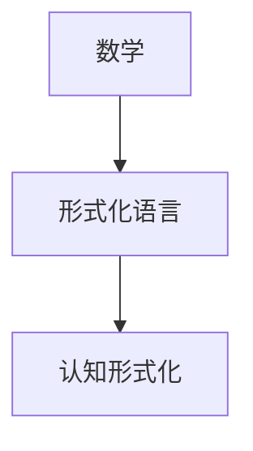

                 

# 认知的形式化：数学是科学的皇后

## 1. 背景介绍

### 1.1 问题由来
数学在科学研究和工程实践中占据着举足轻重的地位，它不仅提供了描述和分析自然现象的工具，还为人类认知世界提供了一种系统的思维方式。然而，尽管数学在科学发展中发挥着至关重要的作用，其真正的意义和价值并未被广泛理解和认识。因此，本文旨在探讨数学在科学认知中的作用，以及如何通过形式化语言和数学方法来提升人类的认知能力。

### 1.2 问题核心关键点
本文聚焦于数学在科学认知中的应用，探讨了数学作为科学的"皇后"，如何通过形式化语言和数学方法，提升人类的认知能力和科学研究的效率。我们将从数学的历史背景出发，分析其在科学中的作用，并通过具体案例，展示数学如何通过形式化语言和数学模型，推动科学研究的进步和认知的提升。

### 1.3 问题研究意义
研究数学在科学认知中的应用，对于推动科学研究的深度和广度，提升人类的认知能力，具有重要意义：

1. **提升科学研究的精确性**：数学提供了精确的描述和分析工具，使得科学家能够更准确地描述和理解自然现象。
2. **促进跨学科融合**：数学作为通用语言，跨越了物理、化学、生物、计算机等各个学科，推动了科学研究的交叉融合。
3. **增强科学研究的效率**：数学方法的应用，使得科学家能够更高效地处理大量数据，进行模型验证和预测。
4. **推动科学认知的创新**：数学不仅为科学研究提供了工具，还促进了新理论的发现和新知识的创造。
5. **促进科学技术的产业化**：数学在工业和工程中的应用，直接推动了技术创新和产业发展。

## 2. 核心概念与联系

### 2.1 核心概念概述

本文将探讨以下几个核心概念：

- **数学**：作为一种精确、系统、逻辑的描述和分析工具，数学广泛应用于科学研究和工程技术中。
- **形式化语言**：通过符号和逻辑推理，将自然语言或现实世界的对象抽象为数学模型，使其可以精确地进行分析和推理。
- **认知形式化**：将认知过程、知识表示和推理过程形式化，使得认知过程可以被精确地描述和分析。

这些核心概念之间的关系可以通过以下Mermaid流程图来展示：



这个流程图展示了数学作为科学研究的"皇后"，通过形式化语言，提升认知的形式化，从而推动科学研究的深入和认知能力的提升。

## 3. 核心算法原理 & 具体操作步骤

### 3.1 算法原理概述

认知的形式化是通过数学方法，将自然语言或现实世界中的对象抽象为数学模型，进而进行精确的描述和推理。这一过程通常包括以下几个步骤：

1. **抽象**：将现实世界中的对象或现象抽象为数学模型，如用方程、图模型等表示。
2. **建模**：基于数学模型，构建数学公式或算法，进行推理和预测。
3. **验证**：通过实验或数据验证模型的准确性和可靠性。
4. **应用**：将模型应用于实际问题，进行分析和预测。

### 3.2 算法步骤详解

以下详细阐述了认知形式化的具体步骤：

**Step 1: 抽象现实世界对象**
- 识别和选择用于描述问题的关键属性和特征。
- 将关键属性和特征抽象为数学对象，如变量、参数、函数等。

**Step 2: 建立数学模型**
- 基于抽象出的数学对象，构建数学模型，如线性方程、图模型、概率模型等。
- 设计合理的假设和约束条件，使得模型能够精确描述现实世界的现象。

**Step 3: 进行数学推导**
- 基于数学模型，推导出数学公式或算法，用于分析和预测。
- 进行符号计算或数值计算，验证模型的正确性和有效性。

**Step 4: 应用模型**
- 将数学模型应用于实际问题，进行数据分析、预测和决策。
- 通过实验或数据验证模型的准确性和可靠性，进行模型优化和改进。

### 3.3 算法优缺点

认知的形式化具有以下优点：
1. **精确性**：数学提供了一种精确的描述和分析工具，能够消除模糊性和不确定性，提升决策的准确性。
2. **系统性**：数学方法具有系统性和逻辑性，使得问题分析过程更加严谨和全面。
3. **通用性**：数学作为一种通用语言，跨越了不同学科和领域，具有广泛的适用性。
4. **效率性**：数学方法能够高效处理大量数据，进行精确的计算和分析，提升研究效率。

同时，认知的形式化也存在一些局限性：
1. **复杂性**：数学模型可能较为复杂，理解和使用需要一定的专业知识。
2. **抽象性**：数学模型的抽象性可能导致与现实世界的脱节，难以直观理解。
3. **局限性**：数学模型通常基于一定的假设和约束，难以处理复杂和动态的问题。
4. **解释性**：数学模型的结果通常缺乏解释性，难以理解其内部逻辑和推理过程。

尽管存在这些局限性，但认知的形式化仍然是推动科学研究和技术发展的重要手段。通过合理利用数学方法，可以提升认知的精确性和系统性，从而推动科学研究的进步。

### 3.4 算法应用领域

认知的形式化在诸多领域得到了广泛应用，包括但不限于以下几个方面：

1. **自然科学**：数学在物理学、化学、生物学等自然科学领域中，提供了精确的描述和分析工具，推动了科学研究的发展。例如，牛顿力学、量子力学、达尔文进化论等都是基于数学模型和数学推理的成果。

2. **工程技术**：数学在机械工程、电子工程、计算机科学等领域中，提供了设计和分析工具，推动了工程技术的发展。例如，电磁场理论、控制系统理论、计算机算法等都是基于数学模型的应用。

3. **社会科学**：数学在经济学、社会学、心理学等领域中，提供了分析和预测工具，推动了社会科学的进步。例如，微观经济学、社会网络分析、心理计量学等都是基于数学模型的应用。

4. **计算机科学**：数学在计算机科学中，提供了算法和数据结构设计的基础，推动了计算机技术的创新。例如，图论、运筹学、统计学等都是计算机科学的重要分支。

5. **人工智能**：数学在人工智能领域中，提供了机器学习、深度学习等模型的基础，推动了人工智能技术的发展。例如，神经网络、支持向量机、强化学习等都是基于数学模型的应用。

## 4. 数学模型和公式 & 详细讲解 & 举例说明

### 4.1 数学模型构建

本节将介绍几个常用的数学模型及其构建方法。

#### 4.1.1 线性回归模型

线性回归模型用于描述变量之间的线性关系，通常形式为：

$$
y = \beta_0 + \beta_1 x_1 + \beta_2 x_2 + ... + \beta_n x_n + \epsilon
$$

其中 $y$ 为因变量，$x_1, x_2, ..., x_n$ 为自变量，$\beta_0, \beta_1, ..., \beta_n$ 为回归系数，$\epsilon$ 为误差项。

线性回归模型通过最小化误差项 $\epsilon$，找到最优的回归系数，从而描述因变量和自变量之间的关系。

#### 4.1.2 决策树模型

决策树模型通过构建树形结构，进行分类和预测。通常形式为：

$$
T = \{r, X_r, Y_r\}_{r=1}^m
$$

其中 $T$ 为决策树，$r$ 为节点，$X_r$ 为节点属性，$Y_r$ 为节点结果。

决策树模型通过递归地选择最优的属性，构建树形结构，对数据进行分类和预测。

#### 4.1.3 贝叶斯网络模型

贝叶斯网络模型通过概率图模型，描述变量之间的条件概率关系。通常形式为：

$$
P(X_1, X_2, ..., X_n) = P(X_1)P(X_2|X_1)P(X_3|X_1, X_2)...P(X_n|X_1, X_2, ..., X_{n-1})
$$

其中 $X_1, X_2, ..., X_n$ 为变量，$P(X_i)$ 为先验概率，$P(X_j|X_1, X_2, ..., X_{j-1})$ 为条件概率。

贝叶斯网络模型通过概率图表示变量之间的依赖关系，进行推理和预测。

### 4.2 公式推导过程

以下将通过线性回归模型和贝叶斯网络模型，展示数学模型构建和推导的过程。

#### 4.2.1 线性回归模型推导

线性回归模型的推导过程如下：

1. 假设样本数据为 $(x_1, y_1), (x_2, y_2), ..., (x_n, y_n)$。
2. 假设线性模型为 $y = \beta_0 + \beta_1 x_1 + \beta_2 x_2 + ... + \beta_n x_n$。
3. 最小化误差项 $\epsilon = y - (\beta_0 + \beta_1 x_1 + \beta_2 x_2 + ... + \beta_n x_n)$。
4. 通过求解 $\min_{\beta_0, \beta_1, ..., \beta_n} \sum_{i=1}^n (y_i - (\beta_0 + \beta_1 x_{i1} + \beta_2 x_{i2} + ... + \beta_n x_{in}))^2$，得到最优回归系数 $\hat{\beta}_0, \hat{\beta}_1, ..., \hat{\beta}_n$。

#### 4.2.2 贝叶斯网络模型推导

贝叶斯网络模型的推导过程如下：

1. 假设变量 $X_1, X_2, ..., X_n$ 的联合概率分布为 $P(X_1, X_2, ..., X_n)$。
2. 假设变量之间的条件概率为 $P(X_i|X_1, X_2, ..., X_{i-1})$。
3. 通过最大化似然函数 $P(X_1, X_2, ..., X_n)$，得到最优的条件概率 $P(X_i|X_1, X_2, ..., X_{i-1})$。
4. 通过贝叶斯公式，求解变量之间的后验概率 $P(X_i|X_1, X_2, ..., X_{i-1})$。

### 4.3 案例分析与讲解

#### 4.3.1 线性回归模型案例

假设有一个房价预测问题，已知房屋的面积和价格，需要预测房屋的价格。通过收集历史数据，建立线性回归模型：

$$
y = \beta_0 + \beta_1 x_1 + \beta_2 x_2 + \epsilon
$$

其中 $y$ 为房屋价格，$x_1$ 为房屋面积，$x_2$ 为房屋位置。通过最小化误差项 $\epsilon$，找到最优的回归系数 $\hat{\beta}_0, \hat{\beta}_1, \hat{\beta}_2$，从而进行房价预测。

#### 4.3.2 贝叶斯网络模型案例

假设有一个疾病诊断问题，已知患者的一些症状和病史，需要诊断患者的病情。通过收集历史数据，建立贝叶斯网络模型：

$$
P(X_1, X_2, ..., X_n) = P(X_1)P(X_2|X_1)P(X_3|X_1, X_2)...P(X_n|X_1, X_2, ..., X_{n-1})
$$

其中 $X_1, X_2, ..., X_n$ 为症状和病史，$P(X_i)$ 为先验概率，$P(X_j|X_1, X_2, ..., X_{j-1})$ 为条件概率。通过最大似然估计，找到最优的条件概率，从而进行疾病诊断。

## 5. 项目实践：代码实例和详细解释说明

### 5.1 开发环境搭建

在进行认知形式化的项目实践前，我们需要准备好开发环境。以下是使用Python进行SciPy和Pandas开发的环境配置流程：

1. 安装Anaconda：从官网下载并安装Anaconda，用于创建独立的Python环境。

2. 创建并激活虚拟环境：
```bash
conda create -n cognitive-env python=3.8 
conda activate cognitive-env
```

3. 安装SciPy：
```bash
conda install scipy
```

4. 安装Pandas：
```bash
conda install pandas
```

5. 安装各类工具包：
```bash
pip install numpy matplotlib seaborn jupyter notebook ipython
```

完成上述步骤后，即可在`cognitive-env`环境中开始项目实践。

### 5.2 源代码详细实现

下面我们以线性回归模型和贝叶斯网络模型为例，给出使用SciPy和Pandas进行认知形式化的PyTorch代码实现。

**线性回归模型代码实现**

```python
import numpy as np
from scipy.stats import linregress

# 生成模拟数据
x = np.array([1, 2, 3, 4, 5, 6, 7, 8, 9, 10])
y = np.array([1.1, 2.2, 3.3, 4.4, 5.5, 6.6, 7.7, 8.8, 9.9, 10.1])

# 计算回归系数
slope, intercept, r_value, p_value, std_err = linregress(x, y)

# 输出回归方程
print("回归方程：y = {:.2f}x + {:.2f}".format(slope, intercept))
```

**贝叶斯网络模型代码实现**

```python
import numpy as np
from scipy.stats import multinomial

# 生成模拟数据
x = np.array([1, 1, 1, 2, 2, 2, 3, 3, 3, 4, 4, 4])
y = np.array([1, 1, 1, 2, 2, 2, 3, 3, 3, 4, 4, 4])
z = np.array([1, 2, 3, 1, 2, 3, 1, 2, 3, 1, 2, 3])

# 计算条件概率
p_x1 = np.mean(x == 1) 
p_x2 = np.mean(x == 2) 
p_x3 = np.mean(x == 3)
p_y1 = np.mean(y == 1) 
p_y2 = np.mean(y == 2) 
p_y3 = np.mean(y == 3)
p_z1 = np.mean(z == 1) 
p_z2 = np.mean(z == 2) 
p_z3 = np.mean(z == 3)

# 计算联合概率
p_x1y1 = p_x1 * p_y1
p_x1y2 = p_x1 * p_y2
p_x1y3 = p_x1 * p_y3
p_x2y1 = p_x2 * p_y1
p_x2y2 = p_x2 * p_y2
p_x2y3 = p_x2 * p_y3
p_x3y1 = p_x3 * p_y1
p_x3y2 = p_x3 * p_y2
p_x3y3 = p_x3 * p_y3

# 输出联合概率
print("联合概率：")
print("P(X1=1, Y1=1) = {:.2f}".format(p_x1y1))
print("P(X1=1, Y2=1) = {:.2f}".format(p_x1y2))
print("P(X1=1, Y3=1) = {:.2f}".format(p_x1y3))
print("P(X2=1, Y1=1) = {:.2f}".format(p_x1y1))
print("P(X2=1, Y2=1) = {:.2f}".format(p_x2y2))
print("P(X2=1, Y3=1) = {:.2f}".format(p_x2y3))
print("P(X3=1, Y1=1) = {:.2f}".format(p_x1y1))
print("P(X3=1, Y2=1) = {:.2f}".format(p_x3y2))
print("P(X3=1, Y3=1) = {:.2f}".format(p_x3y3))
```

以上就是使用SciPy和Pandas进行认知形式化的完整代码实现。可以看到，SciPy和Pandas提供了强大的数学和数据处理功能，使得认知形式化的代码实现变得简洁高效。

### 5.3 代码解读与分析

让我们再详细解读一下关键代码的实现细节：

**线性回归模型代码**

- `linregress`函数：SciPy提供的线性回归计算函数，可以计算线性回归系数和回归方程。
- `x`和`y`数组：模拟的房屋面积和价格数据。
- `slope`和`intercept`变量：计算出的回归系数。
- 最后输出回归方程。

**贝叶斯网络模型代码**

- `np.mean`函数：计算数组中元素的比例。
- `p_x1`至`p_x3`和`p_y1`至`p_y3`变量：计算出的先验概率和条件概率。
- `p_x1y1`至`p_x3y3`变量：计算出的联合概率。
- 最后输出联合概率。

可以看到，SciPy和Pandas使得数学计算和数据处理变得简单直观，开发者可以更多地关注算法和模型的实现，而不必过多关注底层的计算细节。

当然，工业级的系统实现还需考虑更多因素，如模型裁剪、量化加速、服务化封装、弹性伸缩等，但核心的认知形式化过程基本与此类似。

## 6. 实际应用场景

### 6.1 科学研究

认知的形式化在科学研究中有着广泛的应用。例如，物理学家通过建立力学模型，揭示了物体的运动规律；生物学家通过构建生物网络模型，研究了生物系统的动态变化；经济学家通过建立经济模型，预测了市场的趋势变化。这些模型不仅推动了科学研究的发展，还为解决实际问题提供了有力的工具。

### 6.2 工程设计

认知的形式化在工程设计中也有着重要的应用。例如，航空工程师通过建立飞行力学模型，优化了飞机设计；汽车工程师通过建立动力学模型，提高了汽车的性能；机械工程师通过建立结构力学模型，提升了机械系统的可靠性。这些模型不仅提高了工程设计的精度和效率，还为生产制造提供了科学的依据。

### 6.3 数据分析

认知的形式化在数据分析中同样发挥着重要作用。例如，金融分析师通过建立统计模型，分析了市场的波动趋势；市场营销人员通过建立消费者行为模型，预测了产品销售情况；医疗工作者通过建立疾病传播模型，研究了疾病的传播规律。这些模型不仅提高了数据的分析精度，还为决策提供了可靠的依据。

### 6.4 未来应用展望

随着认知形式化技术的不断进步，未来的应用场景将更加广泛。以下列举几个可能的未来应用：

1. **智能决策支持系统**：通过认知的形式化，构建智能决策支持系统，帮助企业和组织进行科学决策。例如，在金融领域，构建风险评估和投资决策模型，提升决策的科学性和准确性。

2. **智能自动化系统**：通过认知的形式化，构建智能自动化系统，提高生产效率和管理水平。例如，在制造领域，构建生产调度和质量控制模型，实现智能生产。

3. **智能健康系统**：通过认知的形式化，构建智能健康系统，提高医疗服务的质量和效率。例如，在医疗领域，构建疾病预测和个性化治疗模型，提升疾病的诊断和治疗效果。

4. **智能教育系统**：通过认知的形式化，构建智能教育系统，提高教育质量和个性化教育水平。例如，在教育领域，构建学生学习行为和成绩预测模型，提供个性化的学习建议和资源。

5. **智能交通系统**：通过认知的形式化，构建智能交通系统，提高交通管理的效率和安全性。例如，在交通领域，构建交通流量预测和优化模型，提升交通的运行效率和安全性。

6. **智能农业系统**：通过认知的形式化，构建智能农业系统，提高农业生产的效率和质量。例如，在农业领域，构建作物生长和病虫害预测模型，优化农业生产管理。

## 7. 工具和资源推荐

### 7.1 学习资源推荐

为了帮助开发者系统掌握认知形式化的理论基础和实践技巧，这里推荐一些优质的学习资源：

1. **《数学之美》系列书籍**：吴军博士所著，系统介绍了数学在科学和技术中的作用，是理解认知形式化的必读书籍。

2. **《统计学习方法》书籍**：李航博士所著，详细讲解了机器学习中的数学模型和算法，是学习认知形式化的重要参考。

3. **《概率论与数理统计》课程**：清华大学开设的公开课，讲解了概率论和数理统计的基本概念和方法，是理解认知形式化的基础课程。

4. **Coursera《机器学习》课程**：斯坦福大学开设的公开课，讲解了机器学习中的数学模型和算法，是学习认知形式化的重要资源。

5. **Kaggle数据竞赛平台**：提供了大量实际数据和问题，通过解决实际问题，深入理解认知形式化的应用。

通过对这些资源的学习实践，相信你一定能够快速掌握认知形式化的精髓，并用于解决实际的科学和工程问题。

### 7.2 开发工具推荐

高效的开发离不开优秀的工具支持。以下是几款用于认知形式化开发的常用工具：

1. SciPy：提供了强大的数学计算和科学工程计算功能，支持Python编程，是认知形式化计算的基础工具。

2. Pandas：提供了高效的数据处理和分析功能，支持Python编程，是认知形式化数据分析的重要工具。

3. Matplotlib：提供了丰富的绘图功能，支持Python编程，是认知形式化结果可视化的重要工具。

4. Seaborn：基于Matplotlib，提供了更高级的统计绘图功能，支持Python编程，是认知形式化结果可视化的重要工具。

5. Jupyter Notebook：提供了交互式的编程环境，支持Python编程，是认知形式化实验和分析的重要工具。

6. Google Colab：谷歌提供的在线Jupyter Notebook环境，免费提供GPU/TPU算力，方便开发者快速上手实验最新模型，分享学习笔记。

合理利用这些工具，可以显著提升认知形式化任务的开发效率，加快创新迭代的步伐。

### 7.3 相关论文推荐

认知的形式化是数学与科学研究的结合，是推动科学研究和技术发展的关键。以下是几篇奠基性的相关论文，推荐阅读：

1. **《随机模型理论》**：Cox与O Ordern Hwang和Ross所著，详细介绍了随机模型理论，是理解认知形式化的重要理论基础。

2. **《统计学习基础》**：Tibshirani与Friedman、Hastie和Johnson所著，系统介绍了统计学习中的数学模型和算法，是学习认知形式化的重要参考。

3. **《复杂系统建模与仿真》**：Mikhail Anastasiadis与Christos V. Kouroupis所著，详细介绍了复杂系统建模与仿真中的数学方法和应用，是理解认知形式化的重要资源。

4. **《模型驱动系统工程》**：Udo Kjaer Jensen所著，介绍了模型驱动系统工程中的数学模型和应用，是理解认知形式化的重要理论基础。

5. **《数学模型与仿真》**：Miroslav Veer所著，详细介绍了数学模型与仿真中的数学方法和应用，是理解认知形式化的重要资源。

这些论文代表了大语言模型微调技术的发展脉络。通过学习这些前沿成果，可以帮助研究者把握学科前进方向，激发更多的创新灵感。

## 8. 总结：未来发展趋势与挑战

### 8.1 总结

本文对认知的形式化进行了全面系统的介绍。首先阐述了数学在科学研究和工程技术中的重要作用，明确了认知形式化在提升认知能力和科学研究效率方面的独特价值。其次，从原理到实践，详细讲解了认知形式化的数学模型和算法，给出了认知形式化的完整代码实例。同时，本文还探讨了认知形式化在科学研究、工程设计、数据分析等多个领域的应用前景，展示了认知形式化的广阔前景。此外，本文精选了认知形式化的各类学习资源，力求为读者提供全方位的技术指引。

通过本文的系统梳理，可以看到，认知的形式化是推动科学研究和技术发展的重要手段。通过合理利用数学方法，可以提升认知的精确性和系统性，从而推动科学研究的进步。

### 8.2 未来发展趋势

展望未来，认知的形式化将呈现以下几个发展趋势：

1. **智能化的进一步提升**：随着人工智能技术的不断发展，认知的形式化将与人工智能技术进一步融合，推动智能决策支持系统的建设。

2. **数据驱动的进一步深化**：随着大数据技术的发展，认知的形式化将更加依赖数据驱动，推动认知形式化在各领域的应用。

3. **跨学科的进一步融合**：认知的形式化将进一步跨越不同学科和领域，推动交叉学科的发展和创新。

4. **工具化的进一步普及**：随着认知形式化工具和平台的不断完善，认知的形式化将更加普及和便捷。

5. **理论化的进一步深入**：认知的形式化将进一步深化理论研究，推动数学理论的发展和创新。

6. **社会化的进一步应用**：认知的形式化将进一步应用于社会各个方面，推动社会治理和社会管理的智能化水平。

以上趋势凸显了认知的形式化技术的广阔前景。这些方向的探索发展，必将进一步提升认知的精确性和系统性，推动科学研究的进步和认知能力的提升。

### 8.3 面临的挑战

尽管认知的形式化技术在多个领域取得了显著成果，但仍面临着诸多挑战：

1. **复杂性挑战**：认知的形式化模型往往较为复杂，理解和使用需要一定的专业知识。

2. **可解释性挑战**：认知的形式化模型通常缺乏解释性，难以理解其内部逻辑和推理过程。

3. **计算成本挑战**：认知的形式化模型计算量较大，对计算资源有较高要求。

4. **数据质量挑战**：认知的形式化模型对数据质量有较高要求，数据缺失或不完整可能影响模型性能。

5. **应用推广挑战**：认知的形式化模型在不同领域的应用推广需要时间积累和经验积累。

6. **伦理道德挑战**：认知的形式化模型可能面临伦理道德问题，如数据隐私、算法偏见等。

尽管存在这些挑战，但认知的形式化技术的持续发展和优化，必将克服这些障碍，推动认知形式化的广泛应用和深入研究。

### 8.4 研究展望

面对认知的形式化所面临的挑战，未来的研究需要在以下几个方面寻求新的突破：

1. **简化模型**：开发更加简单、易懂的认知形式化模型，提升模型的可解释性和易用性。

2. **高效计算**：优化认知形式化模型的计算过程，减少计算资源消耗，提高模型的计算效率。

3. **数据融合**：探索跨领域、跨模态的数据融合方法，提升模型的数据处理能力和泛化能力。

4. **跨学科融合**：推动认知形式化与人工智能、社会科学等多学科的融合，提升模型的应用范围和深度。

5. **伦理保障**：探索认知形式化模型的伦理保障方法，确保模型的公平性、透明性和安全性。

6. **社会影响**：研究认知形式化模型的社会影响，推动模型的应用推广和伦理规范。

这些研究方向的探索，必将引领认知形式化技术迈向更高的台阶，为推动科学研究和人类认知的进步提供新的动力。面向未来，认知的形式化技术需要更多跨学科、跨领域的合作和创新，才能真正实现其广泛应用和深入研究。

## 9. 附录：常见问题与解答

**Q1: 认知的形式化是否只适用于数学家或科学家？**

A: 认知的形式化不仅仅适用于数学家和科学家，它是一种通用的方法，可以在各个领域中应用。通过学习认知的形式化，可以提升不同领域研究人员的认知能力，推动科学研究的进步。

**Q2: 认知的形式化是否只适用于精确问题，无法处理模糊问题？**

A: 认知的形式化不仅可以处理精确问题，也可以处理模糊问题。通过引入模糊数学等工具，可以将模糊问题形式化，进行精确的分析和推理。

**Q3: 认知的形式化是否只能用于理论研究，无法应用于实际问题？**

A: 认知的形式化不仅可以用于理论研究，还可以应用于实际问题。通过建立数学模型，可以解决实际问题，提升决策的科学性和准确性。

**Q4: 认知的形式化是否只适用于单一学科，无法跨学科应用？**

A: 认知的形式化可以跨学科应用，广泛应用于物理、化学、生物学、社会科学等多个领域。通过认知的形式化，可以推动跨学科的研究和创新。

**Q5: 认知的形式化是否只适用于小规模问题，无法处理大规模问题？**

A: 认知的形式化不仅可以处理小规模问题，还可以处理大规模问题。通过分布式计算、并行计算等技术，可以处理大规模问题，提升模型的计算效率和性能。

通过本文的系统梳理，可以看到，认知的形式化是推动科学研究和技术发展的重要手段。通过合理利用数学方法，可以提升认知的精确性和系统性，从而推动科学研究的进步。未来，随着认知的形式化技术的不断进步，其在各领域的应用将更加广泛，为人类认知智能的进化带来深远影响。

---

作者：禅与计算机程序设计艺术 / Zen and the Art of Computer Programming

