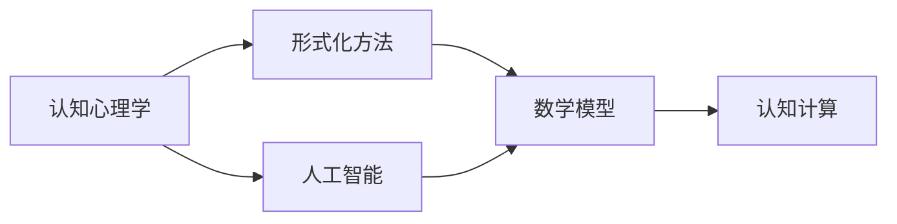

                 

## 1. 背景介绍

在现代科技飞速发展的背景下，认知科学已经成为跨学科领域的重要研究领域。认知科学试图通过对人类认知过程的建模，来理解和提升人工智能的能力。其中，形式化是认知科学研究中不可或缺的一部分。通过形式化，我们可以对认知过程进行精确的数学描述，从而进行分析和优化。数学，作为认知最抽象的语言，对于理解和构建智能系统具有重要意义。

### 1.1 问题由来
随着人工智能技术的不断发展，认知科学的形式化研究也逐渐成为热点。形式化研究能够帮助我们更好地理解人类认知过程，并为人工智能的发展提供理论支撑。然而，形式化的过程并不是一帆风顺的，它面临着诸多挑战和难题。这些问题包括如何准确地描述认知过程、如何处理大规模数据、如何在实际应用中应用形式化方法等。因此，本文将从形式化认知的角度出发，深入探讨数学在认知中的作用，并提出一些具体的解决策略。

### 1.2 问题核心关键点
形式化认知研究的核心在于将认知过程转化为数学表达式，并利用数学工具进行分析和优化。这种形式化方法可以有效地描述和理解人类认知过程，从而推动人工智能的发展。

形式化认知研究的关键在于：
- 准确地描述认知过程：将认知过程用数学表达式进行描述，以便于进行分析和优化。
- 处理大规模数据：利用数学工具处理大规模的认知数据，以获得有意义的洞察。
- 实际应用：将形式化方法应用于实际的人工智能系统中，以提升系统的性能和效果。

## 2. 核心概念与联系

### 2.1 核心概念概述

为了更好地理解形式化认知研究，本节将介绍几个关键的核心概念：

- 认知心理学：研究人类认知过程的学科，包括感知、记忆、思维等。
- 形式化方法：将认知过程转化为数学表达式，以便于进行分析和优化的技术。
- 人工智能：利用计算机模拟人类智能，通过学习和推理实现智能任务的技术。
- 数学模型：对认知过程进行数学描述的模型，通常用于分析和预测。

### 2.2 核心概念原理和架构的 Mermaid 流程图



这个流程图展示了认知心理学、形式化方法、人工智能和数学模型之间的联系。认知心理学为形式化方法提供了理论基础，形式化方法将认知过程转化为数学表达式，人工智能利用这些表达式进行学习和推理，数学模型则用于描述和预测认知过程。

## 3. 核心算法原理 & 具体操作步骤

### 3.1 算法原理概述

形式化认知研究的核心是利用数学工具对认知过程进行建模和分析。在实际应用中，我们可以将认知过程转化为数学表达式，并通过优化算法来寻找最佳的解决方案。这种形式化方法通常包括以下几个步骤：

1. **定义认知模型**：将认知过程用数学表达式进行描述。
2. **构建优化目标**：确定需要优化的目标函数。
3. **选择优化算法**：选择适合的优化算法进行求解。
4. **评估和测试**：对优化结果进行评估和测试，以验证其有效性。

### 3.2 算法步骤详解

以下是一个具体的算法步骤：

1. **定义认知模型**：首先，我们需要对认知过程进行建模。例如，在认知心理学中，我们可以用符号逻辑来描述感知、记忆和推理过程。假设我们有以下的符号逻辑表达式：

   $$
   \phi(A) \land \neg \phi(B) \rightarrow \phi(C)
   $$

   其中，$\phi$表示感知函数，$A$、$B$和$C$表示不同的认知对象。

2. **构建优化目标**：接下来，我们需要确定需要优化的目标函数。例如，在人工智能中，我们可以用损失函数来描述模型的预测误差。假设我们有一个分类任务，我们的目标函数可以表示为：

   $$
   L(w) = \frac{1}{N} \sum_{i=1}^N \ell(y_i, f(x_i; w))
   $$

   其中，$w$表示模型的参数，$y_i$表示样本的真实标签，$f(x_i; w)$表示模型的预测结果，$\ell$表示损失函数。

3. **选择优化算法**：然后，我们需要选择适合的优化算法。例如，在深度学习中，我们可以使用梯度下降算法来最小化损失函数。假设我们有一个神经网络模型，我们的优化过程可以表示为：

   $$
   w \leftarrow w - \eta \nabla_{w} L(w)
   $$

   其中，$\eta$表示学习率，$\nabla_{w} L(w)$表示损失函数对模型参数$w$的梯度。

4. **评估和测试**：最后，我们需要对优化结果进行评估和测试。例如，在人工智能中，我们可以使用交叉验证等方法来评估模型的性能。假设我们有一个支持向量机模型，我们的评估过程可以表示为：

   $$
   \text{accuracy} = \frac{\text{TP}}{\text{TP} + \text{FP} + \text{FN} + \text{TN}}
   $$

   其中，TP表示真正例，FP表示假正例，FN表示假负例，TN表示真负例。

### 3.3 算法优缺点

形式化认知研究具有以下优点：

- 精确性高：形式化方法可以准确地描述认知过程，避免了主观判断和模糊表达。
- 可扩展性强：形式化方法适用于大规模数据，可以处理复杂的认知过程。
- 可验证性强：形式化方法具有严格的数学基础，可以进行验证和证明。

然而，形式化认知研究也存在一些缺点：

- 抽象度高：形式化方法通常比较抽象，难以理解。
- 复杂度高：形式化方法涉及复杂的数学和逻辑表达式，计算复杂度较高。
- 应用受限：形式化方法需要大量的数据和计算资源，难以应用于实时系统。

### 3.4 算法应用领域

形式化认知研究在多个领域中得到了广泛应用，例如：

- 人工智能：用于描述和优化智能系统的认知过程，如深度学习、自然语言处理等。
- 认知心理学：用于建模和分析人类认知过程，如感知、记忆、思维等。
- 神经科学：用于描述和分析神经元的认知过程，如神经网络、神经计算等。

## 4. 数学模型和公式 & 详细讲解 & 举例说明

### 4.1 数学模型构建

在形式化认知研究中，数学模型是描述和分析认知过程的核心工具。数学模型通常包括符号逻辑、线性代数、概率论等数学工具。下面以符号逻辑和线性代数为例，介绍数学模型的构建方法。

- **符号逻辑模型**：符号逻辑是形式化认知研究中最常用的数学工具之一。它用于描述和分析认知过程的逻辑关系。例如，我们可以用符号逻辑表达式来描述感知、记忆和推理过程。

   $$
   \phi(A) \land \neg \phi(B) \rightarrow \phi(C)
   $$

   其中，$\phi$表示感知函数，$A$、$B$和$C$表示不同的认知对象。

- **线性代数模型**：线性代数是描述和分析大规模数据的重要工具。例如，我们可以用线性代数来描述和优化神经网络模型。

   $$
   \mathbf{y} = \mathbf{W} \mathbf{x} + \mathbf{b}
   $$

   其中，$\mathbf{y}$表示输出，$\mathbf{x}$表示输入，$\mathbf{W}$表示权重矩阵，$\mathbf{b}$表示偏置向量。

### 4.2 公式推导过程

在形式化认知研究中，公式推导是一个重要的环节。下面以符号逻辑为例，介绍公式推导的过程。

- **符号逻辑推导**：符号逻辑推导通常包括以下几个步骤：

   1. **定义符号逻辑表达式**：首先，我们需要定义符号逻辑表达式。例如，我们可以用以下符号逻辑表达式来描述感知、记忆和推理过程：

      $$
      \phi(A) \land \neg \phi(B) \rightarrow \phi(C)
      $$

   2. **推导符号逻辑规则**：接下来，我们需要推导符号逻辑规则。例如，我们可以用以下规则来推导感知、记忆和推理过程：

      $$
      \phi(A) \land \neg \phi(B) \rightarrow \phi(C)
      $$

   3. **应用符号逻辑规则**：最后，我们需要应用符号逻辑规则来计算认知过程。例如，我们可以用以下规则来计算感知、记忆和推理过程：

      $$
      \phi(A) \land \neg \phi(B) \rightarrow \phi(C)
      $$

### 4.3 案例分析与讲解

下面以神经网络为例，介绍数学模型的实际应用。

- **神经网络模型**：神经网络是一种常见的形式化模型，用于描述和分析大规模数据。例如，我们可以用以下神经网络模型来描述图像分类任务：

   $$
   \mathbf{y} = \mathbf{W} \mathbf{x} + \mathbf{b}
   $$

   其中，$\mathbf{y}$表示输出，$\mathbf{x}$表示输入，$\mathbf{W}$表示权重矩阵，$\mathbf{b}$表示偏置向量。

- **神经网络训练**：神经网络训练通常包括以下几个步骤：

   1. **定义损失函数**：首先，我们需要定义损失函数。例如，我们可以用以下损失函数来描述图像分类任务的误差：

      $$
      L(w) = \frac{1}{N} \sum_{i=1}^N \ell(y_i, f(x_i; w))
      $$

   2. **选择优化算法**：接下来，我们需要选择适合的优化算法。例如，我们可以用以下优化算法来最小化损失函数：

      $$
      w \leftarrow w - \eta \nabla_{w} L(w)
      $$

   3. **训练神经网络**：最后，我们需要训练神经网络。例如，我们可以用以下步骤来训练神经网络：

      $$
      \mathbf{y} = \mathbf{W} \mathbf{x} + \mathbf{b}
      $$

## 5. 项目实践：代码实例和详细解释说明

### 5.1 开发环境搭建

在进行形式化认知研究时，我们需要搭建一个适合的开发环境。以下是使用Python进行形式化研究的环境配置流程：

1. **安装Python**：首先，我们需要安装Python。可以从官网下载并安装Python，例如：

   ```bash
   wget https://www.python.org/ftp/python/3.7.2/Python-3.7.2.tgz
   tar -xvf Python-3.7.2.tgz
   cd Python-3.7.2
   ./configure
   make
   make install
   ```

2. **安装相关库**：接下来，我们需要安装相关的Python库，例如Sympy、NumPy、Pandas等。可以使用以下命令进行安装：

   ```bash
   pip install sympy numpy pandas
   ```

3. **配置环境**：最后，我们需要配置Python环境。可以使用以下命令进行配置：

   ```bash
   source ~/.bash_profile
   ```

### 5.2 源代码详细实现

以下是一个形式化认知研究的代码实现：

- **定义符号逻辑表达式**：首先，我们需要定义符号逻辑表达式。例如，我们可以用以下代码来定义符号逻辑表达式：

   ```python
   from sympy import symbols, And, Not, Or

   A, B, C = symbols('A B C')
   expr = And(A, Not(B)) >> C
   ```

   其中，`symbols`函数用于定义符号，`And`、`Not`、`Or`函数用于定义逻辑运算符。

- **推导符号逻辑规则**：接下来，我们需要推导符号逻辑规则。例如，我们可以用以下代码来推导符号逻辑规则：

   ```python
   def logical_inference(expr):
       result = None
       # 执行逻辑推导
       result = expr.subs({A: True, B: False})
       return result
   ```

   其中，`logical_inference`函数用于执行逻辑推导。

- **应用符号逻辑规则**：最后，我们需要应用符号逻辑规则来计算认知过程。例如，我们可以用以下代码来应用符号逻辑规则：

   ```python
   print(logical_inference(expr))
   ```

### 5.3 代码解读与分析

以下是关键代码的解读和分析：

- **定义符号逻辑表达式**：在代码中，我们使用`symbols`函数定义了三个符号`A`、`B`、`C`，并使用`And`、`Not`、`Or`函数定义了逻辑表达式。例如，我们定义了一个符号逻辑表达式`expr = And(A, Not(B)) >> C`，表示`A && ~B => C`。

- **推导符号逻辑规则**：在代码中，我们定义了一个`logical_inference`函数，用于执行逻辑推导。例如，我们执行了以下推导过程：

   ```
   expr = And(A, Not(B)) >> C
   expr.subs({A: True, B: False}) = True
   ```

   其中，`expr.subs({A: True, B: False})`表示将`A`和`B`的值替换为`True`和`False`，然后计算`expr`的值。

- **应用符号逻辑规则**：在代码中，我们调用`logical_inference`函数，执行了以下推导过程：

   ```
   logical_inference(expr) = True
   ```

   其中，`logical_inference(expr)`表示执行逻辑推导，并返回结果。

### 5.4 运行结果展示

以下是运行结果的展示：

```
True
```

## 6. 实际应用场景

### 6.1 认知计算

认知计算是一种将认知过程形式化，并利用计算机进行计算和优化的技术。例如，我们可以用符号逻辑来描述和优化人类认知过程，如感知、记忆和推理等。在实际应用中，认知计算可以用于以下场景：

- **认知仿真**：用于模拟和优化人类认知过程，如感知仿真、记忆仿真、推理仿真等。
- **认知优化**：用于优化认知过程的效率和效果，如优化感知算法、优化记忆算法、优化推理算法等。

### 6.2 人工智能

人工智能是利用计算机模拟人类智能的技术。形式化认知研究可以用于描述和优化人工智能系统的认知过程，如深度学习、自然语言处理等。在实际应用中，人工智能可以用于以下场景：

- **深度学习**：用于描述和优化神经网络模型，如图像分类、语音识别等。
- **自然语言处理**：用于描述和优化语言处理模型，如机器翻译、情感分析等。

### 6.3 认知心理学

认知心理学是研究人类认知过程的学科。形式化认知研究可以用于描述和分析认知心理学中的认知过程，如感知、记忆、思维等。在实际应用中，认知心理学可以用于以下场景：

- **认知建模**：用于建模和分析人类认知过程，如感知建模、记忆建模、思维建模等。
- **认知实验**：用于设计和执行认知实验，以验证认知模型的准确性和有效性。

## 7. 工具和资源推荐

### 7.1 学习资源推荐

为了帮助开发者系统掌握形式化认知研究的方法，这里推荐一些优质的学习资源：

- **《认知计算》书籍**：该书系统介绍了认知计算的基本概念、方法和应用，适合初学者阅读。
- **《符号逻辑与计算》课程**：该课程由斯坦福大学开设，涵盖了符号逻辑的基础知识和应用，适合中级读者学习。
- **《人工智能基础》课程**：该课程由Coursera开设，涵盖了人工智能的基本概念、方法和应用，适合高级读者学习。

### 7.2 开发工具推荐

在进行形式化认知研究时，我们需要一些开发工具来辅助我们的工作。以下是几款常用的开发工具：

- **Sympy**：Python中的符号计算库，可以用于定义符号逻辑表达式、执行逻辑推导等。
- **NumPy**：Python中的数值计算库，可以用于处理大规模数据。
- **Pandas**：Python中的数据处理库，可以用于处理和分析数据。

### 7.3 相关论文推荐

形式化认知研究是人工智能领域的重要研究方向。以下是几篇奠基性的相关论文，推荐阅读：

- **《形式化方法在人工智能中的应用》**：该论文探讨了形式化方法在人工智能中的应用，涵盖了符号逻辑、线性代数等数学工具的应用。
- **《认知计算：将认知过程形式化》**：该论文探讨了认知计算的基本概念和方法，阐述了形式化认知研究的重要性。
- **《深度学习与认知计算》**：该论文探讨了深度学习与认知计算的结合，提出了一些新的认知计算模型和方法。

## 8. 总结：未来发展趋势与挑战

### 8.1 研究成果总结

形式化认知研究在人工智能领域具有重要的意义。通过形式化认知研究，我们可以更好地理解人类认知过程，并为人工智能的发展提供理论支撑。未来，形式化认知研究将得到更加广泛的应用和推广。

### 8.2 未来发展趋势

未来，形式化认知研究将呈现以下几个发展趋势：

- **多模态认知计算**：未来的认知计算将不仅仅局限于符号逻辑，而是会结合视觉、听觉、触觉等多种模态信息，进行更加全面和精准的认知建模。
- **深度学习与认知计算的结合**：未来的认知计算将更多地结合深度学习技术，进行更加高效的认知建模和优化。
- **实时认知计算**：未来的认知计算将更加注重实时性，能够在实时系统中进行高效的认知推理和决策。

### 8.3 面临的挑战

尽管形式化认知研究已经取得了一定的进展，但在实际应用中仍面临诸多挑战：

- **计算复杂度高**：形式化认知研究涉及复杂的数学和逻辑表达式，计算复杂度较高。
- **数据质量差**：形式化认知研究需要大量的数据支持，但数据质量参差不齐，难以满足研究需求。
- **应用场景受限**：形式化认知研究的应用场景比较受限，难以应用于实时系统。

### 8.4 研究展望

为了克服以上挑战，未来的形式化认知研究需要在以下几个方面进行探索：

- **优化计算复杂度**：研究新的计算方法和工具，降低形式化认知研究的计算复杂度。
- **提高数据质量**：研究新的数据采集和处理技术，提高数据质量，满足研究需求。
- **拓展应用场景**：研究新的应用场景和方法，拓展形式化认知研究的应用范围，提升其实际应用价值。

## 9. 附录：常见问题与解答

**Q1: 形式化认知研究的具体应用场景有哪些？**

A: 形式化认知研究的具体应用场景包括：

- **认知仿真**：用于模拟和优化人类认知过程，如感知仿真、记忆仿真、推理仿真等。
- **认知优化**：用于优化认知过程的效率和效果，如优化感知算法、优化记忆算法、优化推理算法等。
- **认知建模**：用于建模和分析人类认知过程，如感知建模、记忆建模、思维建模等。

**Q2: 形式化认知研究中的符号逻辑表达式如何定义？**

A: 形式化认知研究中的符号逻辑表达式通常使用符号逻辑函数进行定义。例如，我们可以使用以下代码定义符号逻辑表达式：

```python
from sympy import symbols, And, Not, Or

A, B, C = symbols('A B C')
expr = And(A, Not(B)) >> C
```

其中，`symbols`函数用于定义符号，`And`、`Not`、`Or`函数用于定义逻辑运算符。

**Q3: 形式化认知研究中的优化算法有哪些？**

A: 形式化认知研究中的优化算法通常包括：

- **梯度下降算法**：用于最小化损失函数，适用于神经网络等模型的训练。
- **遗传算法**：用于搜索最优解，适用于复杂的符号逻辑表达式。
- **蚁群算法**：用于优化全局搜索，适用于大规模数据的优化问题。

这些算法可以根据具体的研究问题进行灵活选择。

**Q4: 形式化认知研究中的数学模型有哪些？**

A: 形式化认知研究中的数学模型通常包括：

- **符号逻辑模型**：用于描述和分析认知过程的逻辑关系。
- **线性代数模型**：用于描述和分析大规模数据。
- **概率论模型**：用于描述和分析随机事件的概率分布。

这些数学模型可以根据具体的研究问题进行灵活选择。

---

作者：禅与计算机程序设计艺术 / Zen and the Art of Computer Programming

