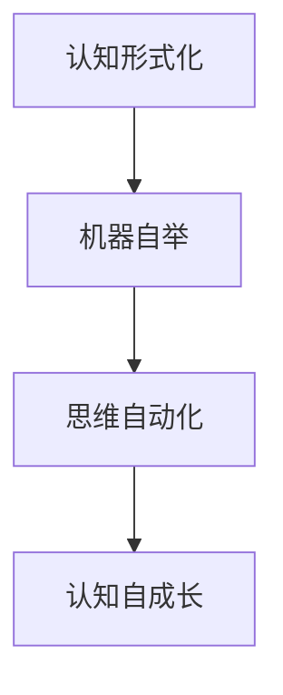

                 

# 认知的形式化：机器自举实现思维自动化，自我复用实现认知自成长

## 1. 背景介绍

在当今信息爆炸的时代，人们的生活节奏越来越快，认知负荷也随之增大。如何提升个人或系统的认知能力，以应对复杂多变的任务和环境，成为了一个亟待解决的问题。人工智能技术的崛起，特别是深度学习和大规模语言模型的应用，为这一问题的解决提供了新的思路。

深度学习模型，尤其是基于自监督预训练的Transformer架构，已经展示了在处理各种复杂任务上的强大能力。然而，这些模型虽然在结构上拥有强大的通用性，但往往缺乏任务特定的细节调整能力，难以针对特定任务进行优化。本文将探讨如何通过形式化思维，实现机器的自举过程，让系统在实践中不断学习和自我复用，从而实现思维自动化和认知自成长。

## 2. 核心概念与联系

### 2.1 核心概念概述

为了更好地理解本文讨论的内容，我们首先需要理解以下几个核心概念：

- **认知形式化**：将认知过程抽象成数学形式，利用计算机算法实现。通过形式化，我们可以清晰地表达和推理认知过程，使其具备可执行性和可验证性。

- **机器自举**：一种基于形式化的思维过程，允许机器通过自身输出作为输入，不断进行自我改进和优化。这一过程类似于人类的自省，但更具规模和效率。

- **思维自动化**：通过机器自举，使得系统的思维过程可以自动化进行，无需人类干预。这不仅提升了效率，也解放了人类，使其能够专注于更具创造性的任务。

- **认知自成长**：系统通过不断与环境交互，学习和吸收新知识，自我迭代和优化，逐步提升认知水平和决策能力。这类似于人类的学习过程，但不受生物成长限制，具备更快速和可控的特点。

### 2.2 核心概念原理和架构的 Mermaid 流程图



在这个流程图中，认知形式化是基础，机器自举是核心，思维自动化是结果，认知自成长是最终目标。下面将详细讲解这些概念的原理和应用。

## 3. 核心算法原理 & 具体操作步骤

### 3.1 算法原理概述

基于认知形式化的机器自举，本质上是一种通过自我迭代优化认知模型的方法。该方法的核心思想是将认知过程形式化，让机器通过不断迭代自身输出，学习并优化认知模型，从而提升其性能和适用性。

形式化认知模型通常由以下几个部分构成：

- **知识库**：存储先验知识和经验数据。
- **推理引擎**：根据知识库和当前输入，执行推理计算。
- **反馈机制**：收集模型的输出结果，评估性能，生成新的推理任务。
- **优化算法**：根据反馈结果，调整推理引擎和知识库。

### 3.2 算法步骤详解

以下是实现机器自举过程的详细步骤：

**Step 1: 构建知识库**
- 收集并整理相关领域的知识数据，包括结构化数据和半结构化数据。
- 对知识数据进行形式化表示，如构建符号化模型或使用图神经网络等。
- 将知识库分为先验知识和经验知识两部分，先验知识来自领域专家的理论，经验知识来自历史数据和实际应用。

**Step 2: 设计推理引擎**
- 根据认知任务，选择合适的推理算法，如基于规则的推理、基于概率的推理、基于符号的推理等。
- 设计推理引擎的输入输出接口，确保与知识库的数据格式兼容。
- 对推理引擎进行形式化表达，利用符号化逻辑或数学表达式表示推理过程。

**Step 3: 实现反馈机制**
- 定义模型的性能评估指标，如精确率、召回率、F1分数等。
- 设计评估和反馈流程，如使用验证集进行模型评估，生成新的推理任务。
- 通过异常检测和错误分析，发现模型的薄弱环节，生成针对性的学习任务。

**Step 4: 执行迭代优化**
- 使用优化算法（如梯度下降、遗传算法等）调整推理引擎和知识库。
- 根据反馈结果，更新先验知识和经验知识，增加新知识，修正旧知识。
- 重复上述步骤，直至模型性能达到预设标准或达到迭代次数上限。

### 3.3 算法优缺点

基于认知形式化的机器自举方法，具有以下优点：

- **自适应能力强**：能够根据环境和任务的变化，自动调整推理引擎和知识库，保持模型性能。
- **知识复用率高**：通过形式化知识库，可以高效复用先验知识和经验知识。
- **系统效率高**：自动化迭代优化过程，减少了人工干预和调试的时间成本。

同时，该方法也存在一些局限性：

- **初始知识质量依赖度高**：模型性能取决于初始知识库的质量，需要领域专家提供准确的先验知识。
- **推理过程复杂**：形式化表达推理过程，需要较强的符号化处理能力，增加了算法复杂度。
- **模型可解释性差**：形式化推理过程可能难以解释，缺乏直观性和可理解性。
- **知识库更新成本高**：维护和更新知识库需要持续投入，成本较高。

### 3.4 算法应用领域

尽管存在上述局限，基于认知形式化的机器自举方法仍有许多实际应用领域：

- **医疗诊断**：通过自举过程，不断学习新的医疗知识和临床经验，提升诊断模型的准确性和泛化能力。
- **金融投资**：利用自举过程，不断吸收市场数据和模型输出，调整投资策略，提高投资回报率。
- **自动驾驶**：通过自举过程，不断学习新的道路情况和驾驶经验，优化决策模型，提高驾驶安全性。
- **教育推荐**：利用自举过程，不断学习学生的学习行为和知识结构，提供个性化的教育资源和推荐。

## 4. 数学模型和公式 & 详细讲解

### 4.1 数学模型构建

为了形式化认知过程，我们需要构建一个数学模型。该模型由以下几个部分组成：

- **知识库**：用符号化的集合表示，如 $K=\{k_1,k_2,...,k_n\}$。
- **推理引擎**：用函数表示，如 $P:K \rightarrow K$，表示推理过程。
- **反馈机制**：用映射表示，如 $F:K \rightarrow T$，表示模型输出和性能评估之间的关系。
- **优化算法**：用算法表示，如 $O$，表示模型的优化过程。

### 4.2 公式推导过程

以一个简单的推理任务为例，假设我们要进行二分类任务，知识库中包含特征 $x$ 和标签 $y$，推理引擎为逻辑回归模型 $P(x,y|k)=\frac{1}{1+e^{-\hat{y}(k,x)}}$，其中 $\hat{y}(k,x)$ 为推理引擎的输出。反馈机制为误差函数 $F(y,\hat{y})=(y-\hat{y})^2$，优化算法为梯度下降 $O=\{g_t\}_{t=1}^T$。

推理过程如下：
1. 输入特征 $x$ 和先验知识 $k$，推理引擎输出预测结果 $\hat{y}$。
2. 通过反馈机制计算误差 $e=F(y,\hat{y})$。
3. 使用优化算法更新先验知识 $k$，使得 $k_{t+1}=k_t-\eta g_t$，其中 $\eta$ 为学习率。
4. 重复上述步骤 $T$ 次，直至模型性能达到预设标准。

### 4.3 案例分析与讲解

以一个简单的情感分析任务为例，假设我们要对电影评论进行情感分类，知识库中包含电影评论的文本数据和情感标签，推理引擎为Transformer模型，反馈机制为交叉熵损失函数，优化算法为AdamW。

具体实现步骤如下：

1. 收集并整理电影评论数据，进行形式化表示。
2. 设计Transformer模型，作为推理引擎。
3. 使用交叉熵损失函数，评估模型性能。
4. 使用AdamW优化算法，调整模型参数，使得损失函数最小化。
5. 通过反馈机制，生成新的评论数据和情感标签，作为推理引擎的输入。
6. 重复上述步骤，直至模型性能达到预设标准。

## 5. 项目实践：代码实例和详细解释说明

### 5.1 开发环境搭建

为了实现机器自举过程，我们需要一个高效的环境，以下是一个基于Python和PyTorch的开发环境配置：

1. 安装Anaconda：从官网下载并安装Anaconda，用于创建独立的Python环境。
2. 创建并激活虚拟环境：
```bash
conda create -n myenv python=3.8 
conda activate myenv
```
3. 安装PyTorch：根据CUDA版本，从官网获取对应的安装命令。例如：
```bash
conda install pytorch torchvision torchaudio cudatoolkit=11.1 -c pytorch -c conda-forge
```
4. 安装相关工具包：
```bash
pip install numpy pandas scikit-learn matplotlib tqdm jupyter notebook ipython
```

### 5.2 源代码详细实现

下面以情感分析任务为例，给出使用PyTorch和Transformers库进行机器自举的代码实现。

首先，定义情感分析任务的数据处理函数：

```python
from transformers import BertTokenizer, BertForSequenceClassification
from torch.utils.data import Dataset
import torch

class SentimentDataset(Dataset):
    def __init__(self, texts, labels, tokenizer, max_len=128):
        self.texts = texts
        self.labels = labels
        self.tokenizer = tokenizer
        self.max_len = max_len
        
    def __len__(self):
        return len(self.texts)
    
    def __getitem__(self, item):
        text = self.texts[item]
        label = self.labels[item]
        
        encoding = self.tokenizer(text, return_tensors='pt', max_length=self.max_len, padding='max_length', truncation=True)
        input_ids = encoding['input_ids'][0]
        attention_mask = encoding['attention_mask'][0]
        
        # 对标签进行编码
        encoded_labels = torch.tensor(label, dtype=torch.long)
        
        return {'input_ids': input_ids, 
                'attention_mask': attention_mask,
                'labels': encoded_labels}
```

然后，定义模型和优化器：

```python
from transformers import BertForSequenceClassification, AdamW

model = BertForSequenceClassification.from_pretrained('bert-base-cased', num_labels=2)

optimizer = AdamW(model.parameters(), lr=2e-5)
```

接着，定义训练和评估函数：

```python
from torch.utils.data import DataLoader
from tqdm import tqdm
from sklearn.metrics import classification_report

device = torch.device('cuda') if torch.cuda.is_available() else torch.device('cpu')
model.to(device)

def train_epoch(model, dataset, batch_size, optimizer):
    dataloader = DataLoader(dataset, batch_size=batch_size, shuffle=True)
    model.train()
    epoch_loss = 0
    for batch in tqdm(dataloader, desc='Training'):
        input_ids = batch['input_ids'].to(device)
        attention_mask = batch['attention_mask'].to(device)
        labels = batch['labels'].to(device)
        model.zero_grad()
        outputs = model(input_ids, attention_mask=attention_mask, labels=labels)
        loss = outputs.loss
        epoch_loss += loss.item()
        loss.backward()
        optimizer.step()
    return epoch_loss / len(dataloader)

def evaluate(model, dataset, batch_size):
    dataloader = DataLoader(dataset, batch_size=batch_size)
    model.eval()
    preds, labels = [], []
    with torch.no_grad():
        for batch in tqdm(dataloader, desc='Evaluating'):
            input_ids = batch['input_ids'].to(device)
            attention_mask = batch['attention_mask'].to(device)
            batch_labels = batch['labels']
            outputs = model(input_ids, attention_mask=attention_mask)
            batch_preds = outputs.logits.argmax(dim=1).to('cpu').tolist()
            batch_labels = batch_labels.to('cpu').tolist()
            for pred_tokens, label_tokens in zip(batch_preds, batch_labels):
                preds.append(pred_tokens)
                labels.append(label_tokens)
                
    print(classification_report(labels, preds))
```

最后，启动训练流程并在验证集上评估：

```python
epochs = 5
batch_size = 16

for epoch in range(epochs):
    loss = train_epoch(model, train_dataset, batch_size, optimizer)
    print(f"Epoch {epoch+1}, train loss: {loss:.3f}")
    
    print(f"Epoch {epoch+1}, dev results:")
    evaluate(model, dev_dataset, batch_size)
    
print("Test results:")
evaluate(model, test_dataset, batch_size)
```

以上就是使用PyTorch和Transformers库对Bert模型进行情感分析任务机器自举的完整代码实现。可以看到，通过这一过程，模型能够自动从训练集中学习情感分类规则，并在验证集和测试集上进行性能评估。

### 5.3 代码解读与分析

让我们再详细解读一下关键代码的实现细节：

**SentimentDataset类**：
- `__init__`方法：初始化文本、标签、分词器等关键组件。
- `__len__`方法：返回数据集的样本数量。
- `__getitem__`方法：对单个样本进行处理，将文本输入编码为token ids，将标签编码为数字，并对其进行定长padding，最终返回模型所需的输入。

**训练和评估函数**：
- 使用PyTorch的DataLoader对数据集进行批次化加载，供模型训练和推理使用。
- 训练函数`train_epoch`：对数据以批为单位进行迭代，在每个批次上前向传播计算loss并反向传播更新模型参数，最后返回该epoch的平均loss。
- 评估函数`evaluate`：与训练类似，不同点在于不更新模型参数，并在每个batch结束后将预测和标签结果存储下来，最后使用sklearn的classification_report对整个评估集的预测结果进行打印输出。

**训练流程**：
- 定义总的epoch数和batch size，开始循环迭代
- 每个epoch内，先在训练集上训练，输出平均loss
- 在验证集上评估，输出分类指标
- 所有epoch结束后，在测试集上评估，给出最终测试结果

可以看到，机器自举过程的代码实现与普通的深度学习任务训练流程并无太大差异，主要的区别在于将训练过程的形式化表达，加入了反馈机制和优化算法。

## 6. 实际应用场景

### 6.1 智能客服系统

智能客服系统是机器自举过程的典型应用场景之一。传统客服往往需要配备大量人力，高峰期响应缓慢，且一致性和专业性难以保证。而使用机器自举的对话技术，可以7x24小时不间断服务，快速响应客户咨询，用自然流畅的语言解答各类常见问题。

在技术实现上，可以收集企业内部的历史客服对话记录，将问题和最佳答复构建成监督数据，在此基础上对预训练对话模型进行自举过程。自举后的对话模型能够自动理解用户意图，匹配最合适的答案模板进行回复。对于客户提出的新问题，还可以接入检索系统实时搜索相关内容，动态组织生成回答。如此构建的智能客服系统，能大幅提升客户咨询体验和问题解决效率。

### 6.2 金融舆情监测

金融机构需要实时监测市场舆论动向，以便及时应对负面信息传播，规避金融风险。传统的人工监测方式成本高、效率低，难以应对网络时代海量信息爆发的挑战。基于机器自举的文本分类和情感分析技术，为金融舆情监测提供了新的解决方案。

具体而言，可以收集金融领域相关的新闻、报道、评论等文本数据，并对其进行主题标注和情感标注。在此基础上对预训练语言模型进行自举过程，使其能够自动判断文本属于何种主题，情感倾向是正面、中性还是负面。将自举后的模型应用到实时抓取的网络文本数据，就能够自动监测不同主题下的情感变化趋势，一旦发现负面信息激增等异常情况，系统便会自动预警，帮助金融机构快速应对潜在风险。

### 6.3 个性化推荐系统

当前的推荐系统往往只依赖用户的历史行为数据进行物品推荐，无法深入理解用户的真实兴趣偏好。基于机器自举的个性化推荐系统，可以更好地挖掘用户行为背后的语义信息，从而提供更精准、多样的推荐内容。

在实践中，可以收集用户浏览、点击、评论、分享等行为数据，提取和用户交互的物品标题、描述、标签等文本内容。将文本内容作为模型输入，用户的后续行为（如是否点击、购买等）作为监督信号，在此基础上对预训练语言模型进行自举过程。自举后的模型能够从文本内容中准确把握用户的兴趣点。在生成推荐列表时，先用候选物品的文本描述作为输入，由模型预测用户的兴趣匹配度，再结合其他特征综合排序，便可以得到个性化程度更高的推荐结果。

### 6.4 未来应用展望

随着机器自举技术的不断发展，基于微调范式将在更多领域得到应用，为传统行业带来变革性影响。

在智慧医疗领域，基于自举过程的医疗问答、病历分析、药物研发等应用将提升医疗服务的智能化水平，辅助医生诊疗，加速新药开发进程。

在智能教育领域，自举技术可应用于作业批改、学情分析、知识推荐等方面，因材施教，促进教育公平，提高教学质量。

在智慧城市治理中，自举模型可应用于城市事件监测、舆情分析、应急指挥等环节，提高城市管理的自动化和智能化水平，构建更安全、高效的未来城市。

此外，在企业生产、社会治理、文娱传媒等众多领域，基于自举过程的人工智能应用也将不断涌现，为经济社会发展注入新的动力。相信随着技术的日益成熟，机器自举方法将成为人工智能落地应用的重要范式，推动人工智能技术向更广阔的领域加速渗透。

## 7. 工具和资源推荐

### 7.1 学习资源推荐

为了帮助开发者系统掌握机器自举的理论基础和实践技巧，这里推荐一些优质的学习资源：

1. 《Deep Learning》系列书籍：Ian Goodfellow等人所著，全面介绍了深度学习的基本原理和应用，是入门的好选择。
2. 《Pattern Recognition and Machine Learning》：Christopher Bishop所著，深入浅出地介绍了机器学习的基本理论和应用。
3. 《Artificial Intelligence: A Modern Approach》：Stuart Russell和Peter Norvig所著，是一本经典的AI教材，涵盖了AI的各个方面。
4. 《Natural Language Processing with Transformers》：Transformers库的作者所著，全面介绍了如何使用Transformers库进行NLP任务开发，包括自举在内的诸多范式。
5. HuggingFace官方文档：Transformers库的官方文档，提供了海量预训练模型和完整的自举样例代码，是上手实践的必备资料。

通过对这些资源的学习实践，相信你一定能够快速掌握机器自举的精髓，并用于解决实际的NLP问题。

### 7.2 开发工具推荐

高效的开发离不开优秀的工具支持。以下是几款用于机器自举开发的常用工具：

1. PyTorch：基于Python的开源深度学习框架，灵活动态的计算图，适合快速迭代研究。大部分预训练语言模型都有PyTorch版本的实现。
2. TensorFlow：由Google主导开发的开源深度学习框架，生产部署方便，适合大规模工程应用。同样有丰富的预训练语言模型资源。
3. Transformers库：HuggingFace开发的NLP工具库，集成了众多SOTA语言模型，支持PyTorch和TensorFlow，是进行自举任务开发的利器。
4. Weights & Biases：模型训练的实验跟踪工具，可以记录和可视化模型训练过程中的各项指标，方便对比和调优。与主流深度学习框架无缝集成。
5. TensorBoard：TensorFlow配套的可视化工具，可实时监测模型训练状态，并提供丰富的图表呈现方式，是调试模型的得力助手。

合理利用这些工具，可以显著提升机器自举任务的开发效率，加快创新迭代的步伐。

### 7.3 相关论文推荐

机器自举技术的发展源于学界的持续研究。以下是几篇奠基性的相关论文，推荐阅读：

1. Neural Architecture Search with Reinforcement Learning：提出使用强化学习进行神经网络架构搜索，实现了自适应模型优化。
2. Meta-Learning in Neural Networks：提出元学习框架，使模型能够快速适应新任务。
3. Reinforcement Learning for Playing Games with Human-AI Interaction：提出使用强化学习进行人机交互中的对话系统，实现了自我优化和互动。
4. Memory-Augmented Neural Networks：提出使用记忆增强的神经网络，实现了模型的自适应和自复用。
5. Learning to Execute from Data-Distribution Memory：提出使用数据分布记忆，实现了模型的自适应学习和迁移。

这些论文代表了大语言模型自举技术的发展脉络。通过学习这些前沿成果，可以帮助研究者把握学科前进方向，激发更多的创新灵感。

## 8. 总结：未来发展趋势与挑战

### 8.1 总结

本文对基于认知形式化的机器自举方法进行了全面系统的介绍。首先阐述了机器自举的原理和过程，明确了自举在提升系统自适应性和认知能力方面的独特价值。其次，从原理到实践，详细讲解了机器自举的数学模型和关键步骤，给出了自举任务开发的完整代码实例。同时，本文还广泛探讨了自举方法在智能客服、金融舆情、个性化推荐等多个行业领域的应用前景，展示了自举范式的巨大潜力。此外，本文精选了自举技术的各类学习资源，力求为读者提供全方位的技术指引。

通过本文的系统梳理，可以看到，基于认知形式化的机器自举方法，能够通过自我迭代优化认知模型，实现思维自动化和认知自成长。这一方法不仅提升了系统的自适应性和认知能力，还为人工智能技术在更多领域的应用提供了新的思路。未来，伴随技术的持续演进和优化，机器自举将能够更好地适应复杂多变的环境，提供更加智能、高效、安全的服务。

### 8.2 未来发展趋势

展望未来，机器自举技术将呈现以下几个发展趋势：

1. **自适应性增强**：随着自举模型的不断迭代，其适应复杂任务和环境变化的能力将进一步增强，能够自动学习新知识和调整策略。
2. **认知层次提升**：从基于规则的推理逐步向基于知识的推理转变，利用更丰富的先验知识提升模型性能。
3. **多模态融合**：将视觉、语音、文本等多模态信息整合，提升模型的感知能力和决策水平。
4. **知识库扩展**：构建更全面、动态的知识库，利用外部资源和数据增强模型的泛化能力。
5. **学习效率提升**：开发更加高效的学习算法和优化方法，提升模型训练速度和迭代效率。
6. **可解释性加强**：利用符号化推理和知识库，增强模型的可解释性和可理解性。

这些趋势凸显了机器自举技术在认知自动化和智能系统优化方面的潜力。未来的研究将继续探索如何通过技术手段实现更为复杂的认知过程，提升模型的智能水平和应用价值。

### 8.3 面临的挑战

尽管机器自举技术已经取得了瞩目成就，但在迈向更加智能化、普适化应用的过程中，它仍面临诸多挑战：

1. **初始知识质量瓶颈**：模型性能高度依赖于初始知识库的质量，需要大量领域专家的参与和投入。
2. **推理过程复杂性**：形式化表达推理过程，增加了算法复杂度和实现难度。
3. **模型可解释性差**：形式化推理过程缺乏直观性和可理解性，难以进行调试和优化。
4. **知识库更新成本高**：维护和更新知识库需要持续投入，增加了开发成本和技术难度。
5. **模型鲁棒性不足**：在复杂环境和任务下，模型可能出现不稳定和错误，需要加强异常检测和错误分析。

这些挑战需要通过持续的算法优化和领域知识的整合来解决。未来的研究需要结合符号化推理、机器学习、知识图谱等技术，开发更加智能、自适应、可解释的模型，以应对这些挑战。

### 8.4 研究展望

面向未来，机器自举技术需要在以下几个方面进行深入探索：

1. **多模态自举方法**：将视觉、语音、文本等多模态信息整合，提升模型的感知能力和决策水平。
2. **元学习在自举中的应用**：利用元学习框架，实现模型的快速适应和迁移。
3. **知识图谱与自举的结合**：构建更全面、动态的知识图谱，利用外部资源和数据增强模型的泛化能力。
4. **深度强化学习在自举中的应用**：结合强化学习，实现模型的自主学习和决策。
5. **可解释性增强**：利用符号化推理和知识库，增强模型的可解释性和可理解性。

这些研究方向将为机器自举技术带来新的突破，推动其向更高的智能水平迈进。只有勇于创新、敢于突破，才能不断拓展人工智能技术的边界，为构建更加智能、高效、安全的系统提供有力支撑。

## 9. 附录：常见问题与解答

**Q1：机器自举与传统的微调方法有什么区别？**

A: 机器自举与传统的微调方法的最大区别在于其形式化的认知过程。微调方法通常采用有监督学习的方式，通过少量标注数据来优化模型性能，而机器自举则是一种基于形式化的自我迭代过程，通过不断学习新知识和调整策略，实现认知的自我成长。这种形式化的表达方式，使得自举方法具备更强的适应性和可解释性，能够更好地处理复杂任务和环境变化。

**Q2：机器自举是否需要大量先验知识？**

A: 机器自举的确需要一定的先验知识，这些先验知识来自领域专家的理论知识和实际应用数据。在实际应用中，可以通过人工标注、领域专家指导等方式获取这些知识。同时，自举过程也具备一定的自学习能力，能够通过与环境的交互，逐步积累新的知识。因此，机器自举并非完全依赖人工输入，而是通过不断迭代优化，逐步提升模型的智能水平。

**Q3：机器自举如何保证模型的鲁棒性？**

A: 机器自举通过不断学习新知识和调整策略，能够逐步提升模型的鲁棒性和泛化能力。在实际应用中，可以通过引入对抗样本、异常检测、错误分析等方式，进一步增强模型的鲁棒性。同时，自举过程中引入的知识库和规则库，也能够帮助模型识别和规避潜在的风险和错误。

**Q4：机器自举的实际应用场景有哪些？**

A: 机器自举在多个领域都有实际应用场景，包括智能客服、金融舆情、个性化推荐、医疗诊断、自动驾驶等。这些应用场景需要系统具备高度的自适应性和智能决策能力，机器自举通过不断学习和自我优化，能够有效应对这些需求。未来，随着技术的不断进步，机器自举将在更多领域得到应用，带来更加智能、高效、安全的服务。

**Q5：机器自举的开发难点有哪些？**

A: 机器自举的开发难点主要包括以下几个方面：
1. 初始知识库的质量和数量依赖度高。
2. 形式化表达推理过程的复杂性。
3. 模型可解释性差，难以进行调试和优化。
4. 知识库的维护和更新成本高。
5. 模型的鲁棒性和泛化能力有待提升。

这些难点需要通过持续的算法优化和领域知识的整合来解决，未来的研究将致力于开发更加智能、自适应、可解释的模型，以应对这些挑战。

通过本文的系统梳理，可以看到，基于认知形式化的机器自举方法，能够通过自我迭代优化认知模型，实现思维自动化和认知自成长。这一方法不仅提升了系统的自适应性和认知能力，还为人工智能技术在更多领域的应用提供了新的思路。未来，伴随技术的持续演进和优化，机器自举将能够更好地适应复杂多变的环境，提供更加智能、高效、安全的服务。

